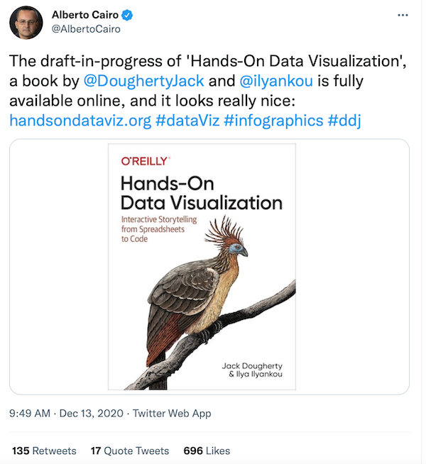

## Our Open-Access Web Edition: Why and How {- #open-access}
This open-access web edition displays the book manuscript we submitted to our publisher, O'Reilly Media, Inc., which we publicly shared under the terms of our contract, and is freely available to read at https://HandsOnDataViz.org. Also, you can access our open-source code templates that we featured in this book on our GitHub organizational account at https://github.com/handsondataviz. To suggest any corrections or updates for future editions, you can open an issue or submit a pull request on our book's GitHub repository at https://github.com/handsondataviz/book. See also [Appendix: Publishing with Bookdown](bookdown.html) to learn why and how we built our workflow around [Bookdown](https://bookdown.org), [GitHub](https://github.com), and [Zotero](https://zotero.org).

### Why create an open-access book? {-}
Why did we publicly share this open-access edition of our book? Why not maximize our profits and try to pocket all of the cash instead? Our answer is a combination of philosophical values and pragmatic realities. This is Jack's third open-access book, and he has previously written more about the rationale in the introductions to *Writing History in the Digital Age* (co-edited with Kristen Nawrotzki) and *Web Writing: Why and How for Liberal Arts Teaching and Learning* (co-edited with Tennyson O'Donnell).^[@doughertyWritingHistoryDigital2013; @doughertyWebWritingWhy2015]. Here's a summary of our key motivations.

First, we believe that **knowledge becomes more valuable when shared widely**, rather than hidden behind a paywall. If our book makes a small improvement to the world by helping a thousand readers to communicate more clearly with data, then reaching ten thousand or more readers is even better. Originally, this book began as a compilation of tutorials for a data visualization course, which educated many college students and Hartford community partners in face-to-face settings, and thousands more in a free online course that attracted readers from around the globe. An open-access book is more likely to share knowledge than a closed one.^[On the origins of this book in a free online course, see @doughertyToughQuestionsAsk2017. For an interesting perspective from another O'Reilly author who asks whether writing a book is *worth* it, see @kleppmannWritingBookIt2020]

Second, both of us **operate in a reputation economy**, where our professional status rises or falls in the eyes of readers who judge the quality of our work. Therefore, it's in our professional self-interest to make our best work more accessible to wider audiences, rather than hiding it behind a paywall. Jack is a college professor and Ilya is a civic technologist. Creating an open-access book that introduces readers to core principles and concrete examples, and shares links to our open-access code templates, aligns with the expectations in our professions. Money also matters, but it's not our primary motivator, and both of us earn salaries through our regular employment.^[On reputation capital in academic life, see Tim Burke in the Conclusions to @doughertyWritingHistoryDigital2013; and also @fitzpatrickPlannedObsolescencePublishing2011, p. 40]  

Third, the **quality of our final product improved as a direct result of reader feedback** on the early open-access editions. Years before we even considered approaching a publisher, we publicly shared early drafts on the web, and interactions with readers, both face-to-face and via email, eventually persuaded us to pitch it to a publisher as a full-fledged book. During our extended writing and revising process, we intentionally made all of the chapters visible as we wrote them, including incomplete sections with lots of "TODO" notes. Readers sent us thoughtful questions, helpful suggestions, and told us how they were using the draft book to teach students or coworkers. Some readers pointed out errors we had missed, and a few even submitted corrections via GitHub pull requests. To be clear, our draft also improved dramatically due to the feedback of our developmental editor and her colleagues, as well as peer reviewers she recruited, all of whom were compensated by the publisher. Thanks to input from all of our readers, this open-access book is much stronger than a closed one would have been.

Finally, one more motivator may be particular to this type of book on data visualization. **By design, the ideal way to read this book is through your browser on the open web**. We embedded dozens of charts and maps on web pages so that readers can explore their interactive nature and float their cursors to view underlying data. The text also includes hundreds of hyperlinks to sample data and sources for further reading. If you're reading the print or PDF edition of this book, you're missing out. And while it may be possible to include some interactive materials behind a password-protected website, that proprietary approach might violate the terms of service for some of the charts, maps, and tools we feature in this book.

### How did we make this book open access? {-}

When we decided we wanted to transform our existing online draft chapters into a polished publication, we sought a publisher who would work with us to include an open-access edition. Fortunately, our first-choice publisher, O'Reilly Media, has a friendly stance toward open access than many traditional publishers, and they also make money by selling print and digital books. When pitching our book proposal to O'Reilly's editors, we pointed to our existing open-access site and the web traffic it received as evidence of the book's audience.

During our book contract negotiations with O'Reilly, here's how our acquisitions editor addressed the open-access issue in an April 2020 email:

> I assume you are wanting to leave the open-access textbook version available as it stands now? That would generally be fine with us, with the caveat that our edits and any material added to print book and our platform edition (basically, the work we do together) stays with us and does not migrate to the open edition. It does not prevent you from also updating your open edition differently, but would prevent a cut and paste of all of our editorial work into your open edition. And of course it would prevent you from charging separately for your open edition, but as long as you kept it open, it could stay up in perpetuity...  

Based on this favorable stance, we agreed to sign a contract with O'Reilly that permits us to publish our open-access web edition for free (we cannot sell it) and which we also submitted as the final manuscript. The publisher has done copyediting (which we cannot directly "cut and paste" into our web edition), but we can update our web edition as we wish, and have continued to do so. Also, we submitted more than 300 figures, and the editorial team redrew about 15% to match their style. So while we cannot paste those redrawn figures into the web edition, that's fine because those are mostly stylistic changes.

Interestingly, O'Reilly's standard book contract does not specifically mention "open access" by name. Instead, here's the relevant sections of our agreement. Part 2A gives O'Reilly exclusive rights to publish our work, and Part 2C states that their exclusive rights in 2A do not apply to our "pre-existing materials," meaning our open-access web edition and final manuscript.

> 2. (a) You, jointly and severally, grant us the exclusive rights throughout the world and in any language, for the duration of all copyrights in the Work, to: (i) print, copy, publish, market, display, distribute, and provide access to the Work, in print, electronic, online, audio, and/or audiovisual form (and/or in any form in which we may now or in the future publish, display, distribute, or provide access to similar works); (ii) create derivative works based on the Work, and with respect to any derivative work, to exercise the rights granted to us in the preceding subsection (i) with respect to the Work; and (iii) license others to exercise any of the rights licensed to us. We will register the copyright in the first U.S. print edition of the Work in the United States Copyright Office in your names, provided that you sign and return to us Exhibit 3.  

> (b) You acknowledge and agree that your ownership rights in the Work do not include ownership of any public domain data and technology, open source material that is not authored by you, or third-party material included in the Work. You also acknowledge and agree that with respect to any publication, distribution, or display of the Work, or access to the Work, permitted by this agreement, our ownership rights include the distinctive elements associated with the Work in that format, for example, the title, cover art, design format, "look and feel," method of presentation, elements related to any series that includes the Work, and our trademarks, service marks, and trade names.  

> (c) We acknowledge and agree that the work will be based on, and may incorporate, materials you have previously developed and/or published ("Pre-Existing Materials"). We agree that the exclusivity granted in Section 2(a) above does not apply to such Pre-Existing Materials and nothing in this agreement is intended to restrict your ability to utilize the Pre-Existing Materials.  

Also, during editing and production, O'Reilly asked us not to include the open-access link (https://HandsOnDataViz.org) in the text of their book. We understand and respected that request, though also pointed out that it pops up as the first result in [a Google search of the book's title](https://www.google.com/search?hl=en&as_q=hands+on+data+visualization).

Finally, it's interesting that even when we tweet about the book being open-access, the O'Reilly marketing team often likes or retweets us. This suggests that our for-profit publisher understands that the open-access edition *might* generate some sales that otherwise would not have happened if buyers were unaware of our book. For example, as we were finishing up our open-access manuscript, data visualization expert Alberto Cairo [tweeted about our book](https://twitter.com/AlbertoCairo/status/1338134036758335495) and many followers liked or reshared his tweet, including our publisher. This type of Twitter publicity probably would not have happened if our book manuscript was locked behind a for-profit paywall.

### What is our readership and sales data? {-}

How many people have read our open-access web book? And how many for-profit books have been sold? Answering these questions requires data from different sources because our book appears in four editions. One is the open-access web edition that we host on our GitHub website (with our custom domain https://handsondataviz.org). The other three editions are sold by O'Reilly: subscriber-only online access to their entire library (which retails at $49/month), the print book edition, and the eBook edition. Furthermore, O'Reilly sells foreign rights to publish the book in other countries.

Here's a summary of readership for our open-access web edition, according to our Google Analytics data, before and after O'Reilly published our book in late March 2021:

| Time Period (calendar year)   |  Users  | Pageviews | Avg Session Duration |
|-------------------------------|--------:|----------:|---------------------:|
| 2019 (before contract)        |  41,443 | 117,750   | 1:55 minutes         |
| 2020 (revising manuscript)    |  60,709 | 185,391   | 2:09 minutes         |
| 2021 (book published March)   | 112,586 | 285,511   | 1:46 minutes         |
| 2022                          | 170,889 | 391,751   | 1:27 minutes         |
| 2023                          | 139,215 | 311,013   | 0:54 minutes         |
| 2024                          | 119,902 | 285,849   | 0:55 minutes         |
| 2025                          |  73,468 | 177,456   | 1:01 minutes         |

Here's a summary of O'Reilly's book sales for their editions thru March 2025:

| O'Reilly Sales | Units | Earnings | Pct to Author | Author Royalties |
|----------------|------:|---------:|--------------:|-----------------:|
| Online Access  |       | $12,473  | 25%           | $3,118           |
| Print Books    | 926   | $22,706  | 10%           | $2,270           |
| eBooks         | 243   | $6,255   | 25%           | $1,563           |
| Foreign Rights |       | $5,747   | 25%           | $1,436           |
| Other/Returns  |       |          |               | $  104           |
| Total          | 1,169 | $47,287  |               | $8,494           |

Note that O'Reilly does not provide us with data on the number of readers or pageviews of our book through their subscriber-only online access.

In response to the Russian invasion of Ukraine, we have contributed all book royalties from 2022 to present to three funds: [Save Life in Ukraine](https://savelife.in.ua/en/donate/), the [Ukraine Humanitarian Appeal](https://www.dec.org.uk/appeal/ukraine-humanitarian-appeal), which closed down in 2025, and most recently [The Halo Trust](https://www.halotrust.org/get-involved/ukraine/thank-you/) for de-mining in Ukraine. Please join us and donate. #StandWithUkraine

While our open-access web book audience is large and growing, O'Reilly's total earnings from for-profit sales seems modest by comparison. That's perfectly fine with us, because we never measured our success by squeezing out more money from for-profit book sales. Instead, our primary goal with *Hands-On Data Visualization* was to enhance the quality and expand the readership of our open-access edition, while collaborating with a publisher, who respects our open-access priorities, to produce print and digital editions of the book to readers who prefer to buy them in these formats. Working with O'Reilly---especially our developmental editor, copyeditor, and production editor---has been an excellent experience.

In conclusion, our approach to open-access book publishing may not match your ideals or realities. Perhaps you rely on book sales as your sole source of income. Many authors and publishers still prefer to let readers preview only a chapter online in order to maximize revenue. Some authors will consider open-access publishing, but dare not share their drafts until the work is completed. Others take the opposite approach and widely circulate pieces of their early writing online in blog posts or social media, but do not share the comprehensive final work in the same manner. Still others have never considered any of these options, nor do they realize that the knowledge-production industry is slowly changing, and some book publishers are growing more comfortable with open-access agreements. So while our approach may not suit your situation, we hope that our reasoning will nudge you to think differently about why and how all of us publish books, both in the present and in future years to come.

### How to read the web edition {-}
Reading the open-access edition of *Hands-On Data Visualization* in your web browser the ideal way to explore our interactive charts and maps. Most are embedded in the web pages as iframes using the same principles illustrated in [Chapter 9: Embed on the Web](embed.html). Also, the web edition enables readers to easily click on internal cross-references and follow our links to external sources.

Try these toolbar features located near the top of your browser:

- Menu
- Search
- Font to adjust text size and display
- View source code on GitHub (if available)
- Download book files (if available)
- Shortcuts (arrow keys to navigate; `s` to toggle sidebar; `f` to toggle search)
- Social Media
- Share

#### Open links in new tabs {-}
Keep your place when reading online and moving between pages.  

- Two-finger trackpad click
- or Control + click (Mac)
- or Alt + click (Chromebook)
- or right-click (Windows and others)

#### Share section links {-}
Float your cursor over any section header to reveal a hashtag anchor symbol: `#`. Click the symbol to view the section link in your browser bar, and copy it to share with others.

