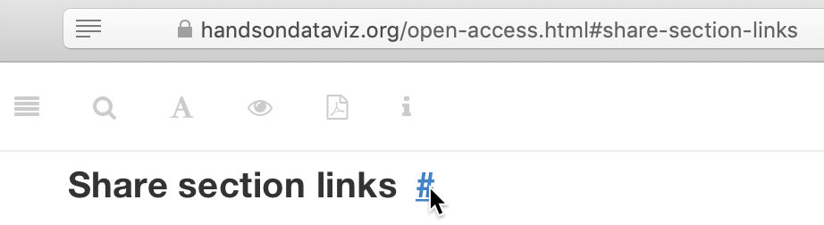

## About this Open-Access Book {- #open-access}

TODO: Rewrite and decide whether to use this section header to go back to "How to Read Online" or "How to Read the Web Edition"

This open-access book-in-progress is free to read on the web at <http://HandsOnDataViz.org> to fully experience the interactive charts, maps, and video clips. Any modern web browser will display the book, but readers may prefer larger screens (laptops or desktops) over smaller screens (such as smartphones or tablets). In your web browser, try these toolbar features near the top of the page:

- Menu
- Search
- Font to adjust text size and display
- View source code on GitHub
- Shortcuts (arrow keys to navigate; `s` to toggle sidebar; `f` to toggle search)
- Social Media
- Share

#### Open links in new tabs {-}
Keep your place when reading online and moving between pages.  

- Two-finger trackpad click
- or Control + click (Mac)
- or Alt + click (Chromebook)
- or right-click (Windows and others)

#### Share section links {-}
Float your cursor over any section header to reveal a hashtag anchor symbol: `#`. Click the symbol to view the link to this section in your browser bar, and copy it to share with others.

#### Use a second monitor {-}
If you have a small screen, consider connecting a second monitor, or work next to a second computer or tablet. This allows you to view tutorials in one screen and build visualizations in the other screen.

#### Refresh browser {-}
To view the most up-to-date content in your web browser, do a "hard refresh" to [bypass any saved content in your browser cache](https://en.wikipedia.org/wiki/Wikipedia:Bypass_your_cache).

- Ctrl + F5 (most Windows-Linux browsers)
- Command + Shift + R (Chrome or Firefox for Mac)
- Shift + Reload button toolbar (Safari for Mac)
