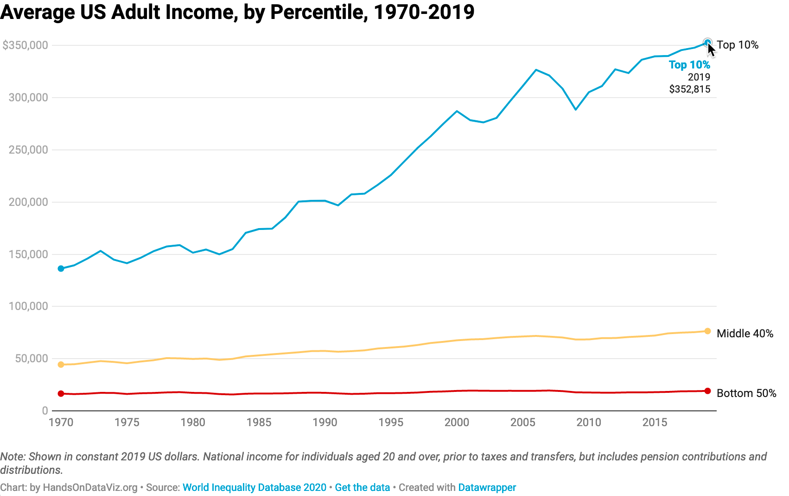
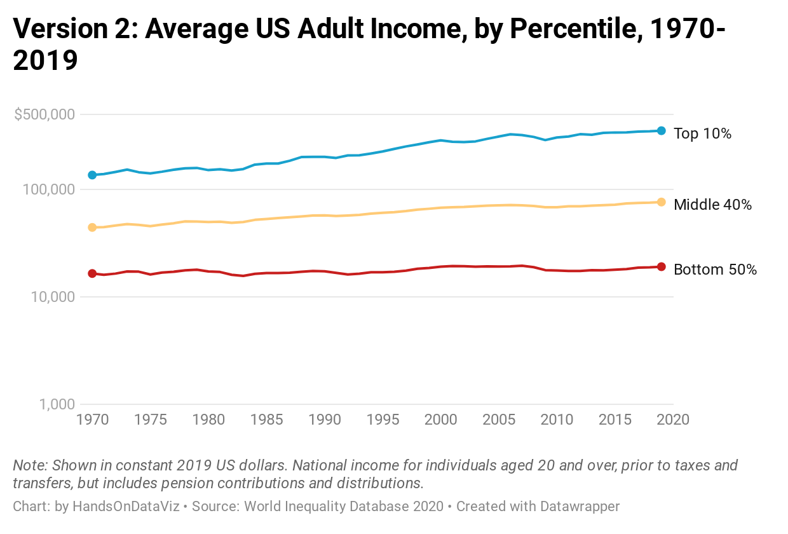
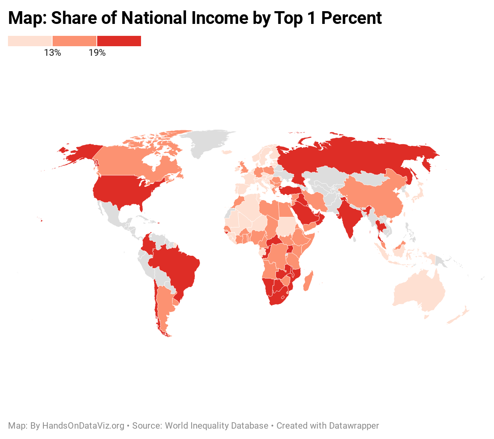
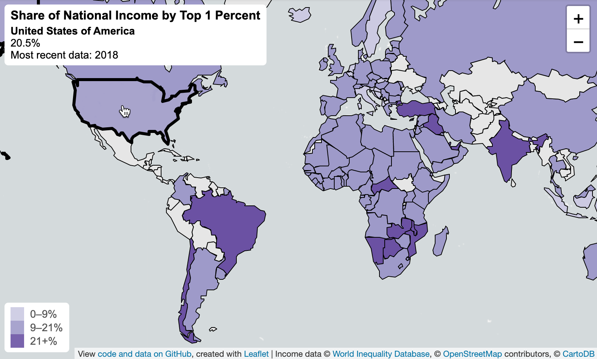

# Introduction: Why Data Visualization? {#introduction}
In this book, you'll learn how to create true and meaningful data visualizations through chapters that blend design principles and step-by-step tutorials, in order to make your information-based analysis and arguments more insightful and compelling. Just as sentences become more persuasive with supporting evidence and source notes, your data-driven writing becomes more powerful when paired with appropriate tables, charts, or maps. Words tell us stories, but visualizations show us *data stories* by transforming quantitative, relational, or spatial patterns into images. When visualizations are well-designed, they draw our attention to what is most important in the data in ways that would be difficult to communicate through text alone.

Our book features a growing number of free and easy-to-learn digital tools for creating *data visualizations*. We broadly define this term primarily as *charts*, which encode data as images, and *maps* which add a spatial dimension. While *tables* do not illustrate data in the same way, we include them in this book because of our pragmatic need to navigate new learners through a decision-making process that often results in building one of these three products. Furthermore, in this digital era we define data visualizations as images that can be easily re-used by modifying the underlying information, typically stored in a data file, in contrast to *infographics* that are generally designed as single-use artwork.^[Note that other data visualization books may use these terms differently. For example, all visualizations are defined as "charts" in @cairoHowChartsLie2019, p. 23.]

As educators, we designed *Hands-On Data Visualization* to introduce key concepts and provide step-by-step tutorials for new learners. You can teach yourself, or use the book to teach others. Also, unlike many technical books that focus solely on one tool, our book guides you on how to choose among over twenty free and easy-to-use visualization tools that we recommend. Finally, while some other books only focus on *static* visualizations that can be distributed only on paper or PDF documents, we demonstrate how to design *interactive* tables, charts, and maps, and embed them on the web. Interactive visualizations engage wider audiences on the internet by inviting them to interact with the data, explore patterns that interest them, download files if desired, and easily share your work on social media.

Data visualizations have spread widely across on the internet over the last decade. Today in our web browsers we encounter more digital charts and maps than we previously saw in the print-only past. But rapid growth also raises serious problems. The "information age" now overlaps with the "age of disinformation." Now that nearly anyone can post online, how do you make wise decisions about whom to trust? When presented with conflicting data stories about divisive policy issues such as social inequality or climate change, which one do you believe? In the next section, we'll delve into this thorny topic by exploring what types of evidence persuades you, and why. And we'll share this dirty little secret about data visualization: it illuminates our path in pursuit of the truth, but it also empowers us to deceive and lie.

## What Can You Believe? {- #believe}
To begin, how do you know whether or not to believe us, the authors of this book? Could we be lying to you? How do you determine what information is truthful? Let’s start with a simple one-sentence statement:

*Claim 1. Economic inequality has sharply risen in the United States since the 1970s.*

Do you believe this claim---or not? Perhaps you’ve never thought about the topic in this particular way before now (and if so, it’s time to wake up). It’s possible your response depends on whether this statement blends in with your prior beliefs, or pushes against them. Or perhaps you’ve been taught to be skeptical of claims lacking supporting evidence (and if so, thank your teachers).

So let’s move on to a more complex two-sentence statement that also cites a source:

*Claim 2. In 1970, the top 10 percent of US adults received an average income of about $135,000 in today’s dollars, compared to the bottom 50 percent who earned around $16,500. This inequality gap grew sharply over the next five decades, as the top tier income climbed to about $350,000, while the bottom half barely moved to about $19,000, according to the World Inequality Database.*[@worldinequalitydatabaseIncomeInequalityUSA2020]

Is this second claim more believable than the first one? It now makes a more precise claim by defining economic inequality in terms of average income for the upper 10 percent versus the bottom 50 percent over time. Also, this sentence pins its claims to a specific source, and invites us to read further by following the footnote. But how do these factors influence its persuasiveness? Does the sentence lead you to ask about the trustworthiness of the source and how it defines "income"? Does the wording make you wonder about the other 40 percent of the population between the two extremes?

To answer some of those questions, let’s supplement the second claim with a bit more information, as shown in Table \@ref(tab:us-income).

Table: (\#tab:us-income) Average US Adult Income, 1970-2019

| US Income Tier | 1970 | 2019 |
|------|--|--|
| Top 10 Percent | $136,308 | $352,815 |
| Middle 40 Percent | $44,353 | $76,462 |
| Bottom 50 Percent | $16,515 | $19,177 |

Note: Shown in constant 2019 US dollars. National income for individuals aged 20 and over, prior to taxes and transfers, but includes pension contributions and distributions.
Source: [World Inequality Database 2020](https://wid.world/share/#0/countrytimeseries/aptinc_p50p90_z;aptinc_p90p100_z;aptinc_p0p50_z/US/2015/kk/k/x/yearly/a/false/0/400000/curve/false)

Does Table \@ref(tab:us-income) make Claim 2 more persuasive? Since the table contains essentially the same information as the two sentences about top and bottom income levels, it shouldn’t make any difference. But the table communicates the evidence more effectively, and makes a more compelling case. For many people, it’s easier to read and grasp the relationship between numbers when they’re organized in a grid, rather than complex sentences. As your eyes skim down the columns, you automatically notice the huge jump in income for the top 10 percent, which nearly tripled over time, while the bottom 50 percent barely budged. In addition, the table fills in more information that was missing from the text about the middle 40 percent, whose income grew over time, but not nearly as much as the top tier. Furthermore, the note at the bottom of the table adds a bit more context about how the data is “shown in constant 2019 US dollars,” which means that the 1970s numbers were adjusted to account for changes to the cost of living and purchasing power of dollars over a half-century. The note also briefly mentions other terms used by the World Inequality Database to calculate income (such as taxes, transfers, and pensions), though you would need to consult the source for clearer definitions. Social scientists use different methods to measure income inequality, but generally report findings similar to those shown here.^[The World Inequality Database builds on the work of economists Thomas Piketty, Emmanuel Saez, and their colleagues, who have constructed US historical income data based not only on self-reported surveys, but also large samples of tax returns submitted to the Internal Revenue Service. See WID methods at @worldinequalitydatabaseMethodology2020. See overview of methodological approaches in @stoneGuideStatisticsHistorical2020. See comparable findings on US income inequality by the Pew Charitable Trust in @menascehorowitzTrendsIncomeWealth2020]

## Some Pictures Are More Persuasive {- #persuasive}
Now let’s substitute a data visualization---specifically the line chart in Figure \@ref(fig:us-income-chart1)---in place of the table, to compare which one is more persuasive.

(ref:us-income-chart1) Explore the [interactive line chart](https://datawrapper.dwcdn.net/LtRbj/) of US adult income inequality over time.

```{r us-income-chart1, fig.cap="(ref:us-income-chart1)"}
if(knitr::is_html_output(excludes="markdown")) knitr::include_url("https://datawrapper.dwcdn.net/LtRbj/") else 
```

Is Figure \@ref(fig:us-income-chart1) more persuasive than Table \@ref(tab:us-income)? Since the line chart contains the same historical start and stop points as the table, it should not make any difference. But the line chart also communicates a powerful, visualized data story about income gaps that grabs your attention more effectively than the table. As your eyes follow the colored lines horizontally across the page, the widening inequality between the top versus the middle and bottom tiers is striking. The chart also packs so much granular information into one image. Looking closely, you also notice how the top-tier income level was relatively stable during the 1970s, then spiked upward from the 1980s to the present, and grew more distant from other lines. Meanwhile, as the middle-tier income rose slightly over time, the fate of the lowest-tier remained relatively flat, reached its peak in 2007, and then dipped back downward for much of the past decade. The rich got richer, and the poor got poorer, as the saying goes. But the chart reveals how rapidly those riches grew, while poverty remained recalcitrant in recent years.

Now let’s insert Figure \@ref(fig:us-income-chart2), which contains the same data as Figure \@ref(fig:us-income-chart1), but presented in a different format. Which chart should you believe? Remember, we warned you to watch out for people who use data visualizations to tell lies.

(ref:us-income-chart2) Explore the [alternative version of the interactive line chart](https://datawrapper.dwcdn.net/JsxEp/) of US adult income inequality over time, using the same data as the first version.

```{r us-income-chart2, fig.cap="(ref:us-income-chart2)"}
if(knitr::is_html_output(excludes="markdown")) knitr::include_url("https://datawrapper.dwcdn.net/JsxEp/") else 
```

What’s going on? If Figure \@ref(fig:us-income-chart2) contains the same data as Figure \@ref(fig:us-income-chart1), why do they look so different? What happened to the striking growth in inequality gaps, which now seem to be smoothed away? Did the crisis suddenly disappear? Was it a hoax?

Although the chart in Figure \@ref(fig:us-income-chart2) is technically accurate, it intentionally misleads readers. Look closely at the labels in the vertical axis. The distance between the first and second figures ($1,000 to $10,000) is the same as the distance between the second and the third ($10,000 to $100,000), but those jumps represent very different amounts of money ($9,000 versus $90,000). That’s because this chart was constructed with a [logarithmic scale](https://en.wikipedia.org/wiki/Logarithmic_scale), which is most appropriate for showing exponential growth. You may recall seeing logarithmic scales during the Covid pandemic, when they were appropriately used to illustrate very high growth rates, which are difficult to display with a traditional linear scale. This second chart is technically accurate, because the data points and scale labels match up, but it’s misleading because there is no good reason to interpret this income data using a logarithmic scale, other than to deceive us about this crisis. People can use charts to illuminate the truth, but also can use them to disguise it.

## Different Shades of the Truth {- #shades}
Let’s expand our analysis of income inequality beyond the borders of one nation. Here’s a new claim that introduces comparative evidence and its source. Unlike the prior US examples that showed historical data for three income tiers, this global example focuses on the most current year of data available for the top 1 percent in each nation. Also, instead of measuring income in US dollars, this international comparison measures the percentage share of the national income held by the top 1 percent. In other words, how large a slice of the pie is eaten by the richest 1 percent in each nation?

*Claim 3. Income inequality is more severe in the United States, where the richest 1 percent of the population currently receives 20 percent of the national income. By contrast, in most European nations the richest 1 percent receives a smaller share, ranging between 6 to 15 percent of the national income.*[@worldinequalitydatabaseTopNationalIncome2020]

Following the same train of thought above, let’s supplement this claim with a visualization to evaluate its persuasiveness. While we could create a table or a chart, those would not be the most effective ways to quickly display information for over 120 nations in our dataset. Since this is spatial data, let's transform it into an interactive map to help us identify any geographic patterns and to encourage readers to explore income levels around the globe, as shown in Figure \@ref(fig:world-income-map1).

(ref:world-income-map1) Explore the [interactive map](https://datawrapper.dwcdn.net/NLMLg/) of world income inequality, measured by the share of national income held by the top 1 percent of the population, based on the most recent data available. Source: [World Inequality Database 2020](https://wid.world/world/#sptinc_p99p100_z/US;FR;DE;CN;ZA;GB;WO/last/eu/k/p/yearly/s/false/5.070499999999999/30/curve/false/country).

```{r world-income-map1, fig.cap="(ref:world-income-map1)"}
if(knitr::is_html_output(excludes="markdown")) knitr::include_url("https://datawrapper.dwcdn.net/NLMLg/", height = "405px") else 
```

Is Figure \@ref(fig:world-income-map1) more persuasive than Claim 3? While the map and the text present the same data about income inequality in the US versus Europe, there should be no difference. But the map pulls you into a powerful story that vividly illustrates gaps between the rich and poor, similar to the chart example above. Colors in the map signal a crisis. Income inequality in the US (along with Russia and Brazil) stands out in dark red at the highest level of the legend, where the top 1 percent holds 19% or more of the national income. By contrast, as your eye floats across the Atlantic, nearly all of the European nations appear in lighter beige and orange colors, indicating no urgent crisis as their top-tier holds a smaller share of the national income.

Now let's introduce the alternative map in Figure \@ref(fig:world-income-map2), which contains the same data as shown in Figure \@ref(fig:world-income-map1), but is displayed in a different format. Which map should you believe?

(ref:world-income-map2) Explore an [alternative version of the interactive map](https://datawrapper.dwcdn.net/o5f9Q/) of world income inequality, using the same data as the map above.

```{r world-income-map2, fig.cap="(ref:world-income-map2)"}
if(knitr::is_html_output(excludes="markdown")) knitr::include_url("https://datawrapper.dwcdn.net/o5f9Q/", height = "405px") else 
```

Why does the second map in Figure \@ref(fig:world-income-map2) look different than the first map in Figure \@ref(fig:world-income-map1)? Instead of dark red, the US is now colored medium-blue, closer on the spectrum to Canada and most European nations. Did the inequality crisis simply fade away from the US, and move to dark-blue Brazil? Which map tells the truth?

This time, neither map is misleading. Both make truthful interpretations of the data with reasonable design choices, even though they create very different impressions in our eyes. To understand why, look closely at the map legends. The first map sorts nations in three categories (less than 13%, 13-19%, 19% and above), while the second map displays the entire range in a green-blue color gradient. Since the US share is 20.5 percent, in the first map it falls into the top bucket with the darkest red color, but in the second map it falls somewhere closer to the middle as medium-blue color. Yet both maps are equally valid, because neither violates a definitive rule in map design nor intentionally disguises data. People can mislead with maps, but it's also possible to make more than one portrait of the truth.

The interpretive nature of data visualization poses a serious challenge. As the authors of this book, our goal is to guide you in creating truthful and meaningful charts and maps. We'll point you toward principles of good design, encourage thoughtful habits of mind, and try to show by example. Occasionally we'll even tell you what *not* to do. But data visualization is a slippery subject to teach, sometimes more art than science. We know that charts and maps can be manipulated---just like words---to mislead your audience, and we'll demonstrate common deception techniques to help you spot them in other people's work, and consciously avoid them in your own. But newcomers may be frustrated by the somewhat fuzzy rules of data visualization. Often there is no *single* correct answer to a problem, but rather *several* plausible solutions, each with their own strengths and weaknesses. As a learner, your job is to continually search for *better answers* without necessarily expecting to find the *one right answer*, especially as visualization methods and tools continue to evolve, and people invent new ways to show the truth.

## Organization of the Book {- #organization}
We've organized the chapters of this book to serve as an introductory hands-on guide to data visualization, from spreadsheets to code. Also, we assume no prior skills other than general familiarity with operating a computer and a vague memory of secondary school mathematics, along with an innate curiosity about telling stories with data. Imagine the book in four parts.

In part one, you'll develop foundational skills about envisioning your data story, along with the tools and data you'll need to tell it. We'll gradually move from [Chapter 2: Choose Tools to Tell Your Data Story](choose.html) to [Chapter 3: Strengthen Your Spreadsheet Skills](spreadsheet.html) to [Chapter 4: Find and Question Your Data](find.html) to [Chapter 5: Clean Up Messy Data](clean.html) to [Chapter 6: Make Meaningful Comparisons](comparisons.html). These chapters feature hands-on tutorials to enrich learning by doing.

In part two, you'll build lots of visualizations with easy-to-learn drag-and-drop tools, and find out which types work best with different data stories. We'll start with [Chapter 7: Chart Your Data](chart.html), [Chapter 8: Map Your Data](map.html), and [Chapter 9: Table Your Data](table.html) and develop your understanding of the interpretive style that each one emphasizes. In [Chapter 10: Embed on the Web](embed.html), you'll learn how to insert all of these interactive visualizations on common web platforms, to invite readers to explore your data and share your work more widely.

In part three, you'll advance to working with more powerful tools, specifically code templates, that give you more control over customizing the appearance of your visualizations and where you host them online. We'll start with [Chapter 11: Edit and Host Code with GitHub](github.html), and walk you through the easy web interface for this popular open-source coding platform. Then you'll build using [Chapter 12: Chart.js and Highcharts Templates](chartcode.html) and [Chapter 13: Leaflet Map Templates](leaflet.html), and discover more advanced spatial tools in [Chapter 14: Transform Your Map Data](transform.html). At the end of the book we include an [Appendix: How to Fix Common Problems](fix.html) to consult when you accidentally break your code, which is also a great way to learn how it works.

In part four, we'll wrap up all of the visualization skills you've developed by returning to the central theme of this introduction: telling true and meaningful stories with data. In [Chapter 15: Detect Lies and Reduce Bias](detect.html), you'll learn how to lie with charts and maps in order to do a better job of telling the truth. Finally, [Chapter 16: Tell and Show Your Data Story](story.html) emphasizes how the goal of data visualization is not simply to make pictures about numbers, but to craft a truthful narrative that convinces readers how and why your interpretation matters.

### Summary {- #summary1}
Now you have a clearer sense of our primary goal for this book. We aim for you to learn how to tell true and meaningful stories with interactive data visualizations, while being mindful of the ways that people can use them to mislead. In the next chapter, let's get started on clarifying the data story you wish to tell, and factors to consider when choosing tools to do the job.
