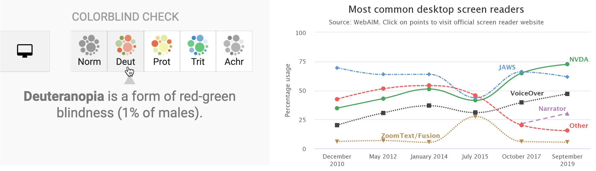

# Choose Tools to Tell Your Story {#choose}
If you feel overwhelmed by the avalanche of digital tools available today, you're not alone. When you're simply trying to do your regular work, keeping up with the latest software developments can feel like an additional part-time job you didn't sign up for. Digital tools are constantly changing and evolving. That's good news if you like to experiment and choose among different options, but not-so-good news if you lack the time to make complex decisions.

In this chapter, we'll help you navigate your way through the decision-making process. We'll begin with the most important step---[sketching out your data story](sketch.html)---to help identify the types of tools you need to tell it effectively. Next, we'll review [ten factors to consider when choosing digital tools and the tradeoffs involved](tool-factors.html). Finally, we'll present our [list of recommended data visualization tools](recommended-tools.html), plus one extra to help you get organized: [a password manager](password-manager.html). All of these tools are free to use, and the book introduces them gradually, from easy-to-learn beginner tools to more advanced power tools that grant you more control over where your work is hosted and how it looks.

## Start Sketching Your Data Story {- #sketch}
Before we dive into digital tools, let's focus on what's most important: our *data story*. We build visualizations to help us tell a story about the information we've gathered, a narrative that draws the audience's attention to meaningful patterns and key insights amid all of the pieces of data. Help them to see the forest, rather than listing every single tree.

But in the early stage of a data visualization project, a common problem is that we don't yet have a clear sense of the key pieces of our data story, or how they fit together. That's perfectly normal. One of the best ways to address that problem is a quick exercise that's designed to move partially-formed ideas from inside our heads out onto pieces of paper, to help you and any co-workers see them more clearly.

For this exercise, push away your computer and pick up some of our favorite old-school tools:

  - several blank sheets of paper
  - colored pencils, pens, or markers
  - your imagination

Get ready to sketch out your data story in words and pictures. No artistic skills are required.

1. On the first sheet of paper, *write down the problem* that motivates your data project. If you prefer a prompt, try filling in these blanks: *We need to find out ______ in order to _________.* In many cases, people come to data visualization with an information-driven problem, which they hope will lead them to achieve a broader goal. For example, when working on the first draft of this book, our problem statement was: *We need to find out our readers' backgrounds and interests about data visualization, in order to write a better introductory guide that meets their needs.*

2. On the second sheet of paper, *rewrite your problem statement into a question*. Write a question for which you genuinely do not yet know the answer---and punctuate it with a question mark. If your brain is tempted to jump ahead and try to answer the question, fight that urge. Instead, focus on framing the question, by using more precise wording than what you wrote above, without limiting the range of possible results. For example, when working on the first draft, our question was: *How do readers of our book describe their prior experience with data visualization, education level, and learning goals?* While we had some preliminary guesses, we honestly didn't know the answer at that stage, which made it an authentic question.

3. On the third sheet of paper, *draw pictures and arrows to show how you'll find data* to answer your question above. Are you conducting door-to-door interviews with neighborhood residents, or sending an online survey to customers, or downloading family income and county maps from the US Census? Sketch a picture of your data collection process, to show how you plan to bring together different pieces of information. For example, when writing the first draft of our book, we asked readers to fill out a quick online survey form, and reminded them not to insert any private data, because we shared back their collected responses in a public spreadsheet.

4. On the fourth sheet of paper, *sketch at least one type of visualization you plan to create* after you obtain your data above. Do you envision some type of chart, like a bar, line, or scatter chart? Or do you imagine some type of map, maybe with points or polygons? If your visualizations will be interactive, try to show the concept using buttons and more than one sheet of paper. You can add *imaginary data* at this stage because it's just a preliminary sketch, as shown in Figure \@ref(fig:data-story-panel). Have fun!

(ref:data-story-panel) Sketch out your story idea on four pages: problem, question, find data, visualize.

```{r data-story-panel, out.width=750, fig.cap="(ref:data-story-panel)"}
 knitr::include_graphics("images/02-choose/data-story-panel.png")
 ```

This exercise can help you in multiple ways, whether you do it by yourself, or even better, with a team of co-workers, as shown in Figure \@ref(fig:data-story-photo-combined). First, by migrating ideas from your mind to paper, you'll make your thinking clearer not only for you, but also more visible for others. When ideas are sketched out, you can reflect on them, listen to feedback, cross-out not-so-good ones, and replace them with better ones on new sheets of paper. If your initial sketches are too complicated or confusing, break down those ideas into separate pages to make them more coherent.

(ref:data-story-photo-combined) The data story sketching exercise can be done solo, but works even better with a team of people. In our data visualization course, college students and community partners collaborate on framing the data story for their projects.

```{r data-story-photo-combined, out.width=750, fig.cap="(ref:data-story-photo-combined)"}
 knitr::include_graphics("images/02-choose/data-story-photo-combined.jpg")
 ```

Second, look at your sheets like a storyboard. Spread them out on a table, move them around to potentially reorder the sequence, start to define the three essential stages of your story: the beginning, middle, and end. Also, these pages can help you organize your thinking about how you'll communicate your data story to larger audiences, such as a presentation slide deck, or paragraphs and pictures for your next report or web page. Don't throw them away, because we'll return to this exercise at the end of the book in [Chapter 16: Tell and Show Your Data Story](story.html).

Finally, this sketching exercise can help you identify which chapters you should focus on in the body of this book. If you're puzzled about where to search for data, check out [Chapter 4: Find and Question Your Data](find.html). If you're thinking about building a chart or map, but need examples of different types, look at the beginning of [Chapter 7: Chart Your Data](chart.html) and [Chapter 8: Map Your Data](map.html).

Now that you have a clearer sense of the story you wish to tell, and some initial ideas about the visualizations you wish to create, in the next two sections we'll discuss tools to do the job, and factors you should consider when deciding among them.

## Ten Factors When Considering Tools {- #tool-factors}
Making decisions between the seemingly endless number of digital tools can feel overwhelming. To help you navigate your decision-making process, below we list ten key factors that we consider when evaluating new visualization tools or online services. When comparing options, many decisions involve some type of tradeoff, a balance between competing wants and needs, such as ease-of-use versus extensive features. By identifying key factors, we believe that each reader can make a more informed decision about which tools offer the best tradeoff for you, since all of us are different. Furthermore, we worded our categories broadly, because the concepts can be applied to other areas of your digital life, but followed up with more context about data visualization in particular.

*1. Easy-to-learn*

How much time will be required to learn a new tool? In our busy lives, this is often the most important factor, but also one that varies widely, as your personal investment of time and energy depends on your prior experience in using related tools and grasping key concepts. In this book, we use the label *Easy Tools* to identify those best suited for beginners (and even some advanced users prefer them, too). They usually feature a graphical user interface, meaning you operate them with pull-down menus or drag-and-drop steps, rather than memorizing commands to be typed into a blank screen. The better ones also offer user-friendly error messages that guide you in the right direction after a wrong turn. Later in the book, we'll introduce *Power Tools* that provide more control and customization of your visualizations, such as code templates that you can copy and edit, which is easier than writing them from scratch. Overall, when deciding which tools to include in this book, we placed easy-to-learn at the top of our list. In fact, we removed a popular free drag-and-drop tool from an earlier draft of this book because even *we* had difficulty following our own instructions in how to use it. When faced with several good options, choose simplicity.

*2. Free or Affordable*

Is the tool free to use? Or is it based on a *freemium* model that offers basic functions for free, with premium features at a price? Or does it require paying a one-time purchase or monthly subscription fee? Of course, the answer to what is affordable will vary for each reader. We fully understand that the business model for many software developers requires steady revenue, and both of us willingly pay to use specific tools necessary for our work. If you regularly rely on a tool to do your job, with no clear alternative, it's in your best interest to financially support their continued existence. But when creating this book, we were impressed by the wide array of high-quality data visualization tools that are available at no cost to users. To increase access to data visualization for all readers, every tool we recommend is free, or its core features are freely available.

*3. Powerful*

Does the tool offer all of the features you anticipate needing? For example, does it support building sufficient types of data visualizations for your project? Although more is usually better, some types of charts are obscure and rarely used, such as [radar charts](https://en.wikipedia.org/wiki/Radar_chart) and [waterfall charts](https://en.wikipedia.org/wiki/Waterfall_chart). Also, look out for limits on the amount of data you can upload, or restrictions on visualizations you create. For example, we previously removed a freemium tool from an earlier version of this book when the company began to require a paid license if your map was viewed more than 100 times on the web. Furthermore, to what extent does the tool allow you to customize the appearance of your visualizations? Since drag-and-drop and freemium tools commonly limit your display options, you may need to make tradeoffs between them versus more powerful and customizable tools. In this book, we begin with easy tools and gradually introduce more advanced ones in each chapter, to help you identify your ideal combination of simplicity and power.

*4. Supported*

Does the developer regularly maintain and update the tool, and respond to questions or issues? Is there an active user community that supports the tool and shares its knowledge about using it? If you've worked with digital tools as long as we have, you'll recognize our pain in losing several whose developers pulled the plug. For example, the [Killed By Google](http://killedbygoogle.com) lists nearly 200 applications and online services that this multi-billion dollar corporation closed down. One of these was a popular data visualization tool, [Google Fusion Tables](https://en.wikipedia.org/wiki/Google_Fusion_Tables), which once occupied a full chapter in an earlier version of this book, when we removed when Google shut down the tool after a ten-year run in 2019. Although none of us can predict which online tools will persist in future years, we looked for signs of active support before including them in this book, such as regular updates, stars earned on a [GitHub](http://github.com) developer's site, and questions answered in the [StackOverflow](http://stackoverflow.com) user forum. But never assume that the future will resemble the past. The continuous evolution of digital tools means that some become extinct.

*5. Portable*

How easily can you migrate your data *into* and *out* of a tool? For example, we stopped recommending an online story map tool created by a well-known software company when we discovered that while users could easily upload locations, text, and photos, but there was no way to export all of their work! As digital technology inevitably changes, all data will need to migrate to another platform, and it's your job to be prepared for this eventual transition. Think about the issue as historical preservation, to increase the likelihood that your projects will continue to function on some unknown platform in the future. If your current tool developer announced that it was shutting down next month, could you easily extract all of the underlying data in a commonly-used file format to upload to a different tool? A key step to future-proof your visualizations is to ensure that your data files are easily separated from the presentation software that generates the charts or maps. When recommending tools for this book, we favored those that support portable data downloads for future migrations.

*6. Secure and Private*

This category combines related questions about security and privacy. First, does the online tool or service take reasonable precautions to protect your personal information from malicious hackers and malware? Review a [list of major data breaches on Wikipedia](https://en.wikipedia.org/wiki/List_of_data_breaches) to help you make informed decisions. If your tool developer recently experienced a malicious data hack, find out how they responded. Second, when you access tools through your browser, does they track your web activity across different sites? Also be aware of [internet censorship by different governments around the globe](https://en.wikipedia.org/wiki/Internet_censorship_and_surveillance_by_country), as compiled by Wikipedia, unless you happen to be reading this book in China, which has [blocked access to all of Wikipedia since April 2019](https://en.wikipedia.org/wiki/Censorship_of_Wikipedia). Finally, does the tool clearly explain whether the data you enter or the products you create will stay private or become public? For example, some companies offer free access to their visualization tools, but in exchange require you to make your data, charts, and maps publicly accessible. That tradeoff may be acceptable if you're working with open-access data and already plan to freely share your visualizations, as many journalists and scholars do. In any case, make sure the terms of service are clearly defined before you start using a tool.

*7. Collaborative*

Does the tool allow people to work together and co-create a data visualization? If so, does the tool allow different levels of access or version control to help prevent team members from accidentally overwriting each other's contributions? Prior generations of digital tools were designed primarily for solo users, in part to address security and privacy issues raised above. But today, many data visualization projects require access and input from multiple team members. Collaboration is essential for success. As co-authors of this book, who jointly wrote the text and co-created many of the visualizations, we favor a newer generation of tools designed for team work environments.

*8. Cross-Platform*

This category refers to both creating and consuming digital content. First, does the tool work across different computer operating systems? In this book, we highlight several tools that run inside any modern web browser, which usually (but not always) means they will operate on all major desktop and laptop computer platforms, such as Windows, Mac, Chromebook, and Linux. When necessary, we specify when a tool will only run on specific computer operating systems, and this often reduces access for people using lower-cost computers. Second, does the tool create visualizations that are responsive to different screen sizes? In other words, does it produce charts and maps that display satisfactorily on smaller devices, such as smartphones and tablets? In this book, we favor cross-platform tools that also display content responsively on smaller devices, but we do not necessarily expect that tools can be operated on small devices to create visualizations. In other words, when we say that a tool runs inside any modern web browser, we don't necessarily mean phone and tablet browsers, but sometimes they work there, too.

*9. Open-Source*

Is the tool’s software code publicly viewable? Can the code be modified and redistributed, so that other developers can suggest improvements, or build new features or extensions? We recognize that many developers rely on non-public proprietary code to sell their tools at a profit, and several of those appear in the book. But we also have been impressed with the number of high-quality data visualization tools offered under different types of open-source licensing arrangements, by sustainable communities of volunteer developers, non-profit organizations, and also for-profit companies who recognize some economic benefits of open-source code development. When recommending tools for this book, we highlight open-source options when available.

*10. Accessible for Visually-Impaired Readers*

Does the tool create visualizations that are accessible for visually-impaired readers? Although disability advocacy laws were passed decades ago, digital technology still lags behind and is slowly catching up, especially in the field of data visualization. But some tools include [a built-in check for colorblindness](https://blog.datawrapper.de/colorblind-check/) and offer [chart types designed for low-vision people using screen readers](https://www.highcharts.com/demo/accessible-line), as shown in Figure \@ref(fig:colorblind-accessible-combined).

(ref:colorblind-accessible-combined) On the left, the Datawrapper built-in check for colorblindness. On the right, a Highcharts line chart designed for low-vision accessibility.

```{r colorblind-accessible-combined, out.width=750, fig.cap="(ref:colorblind-accessible-combined)"}
 
```

Those are ten factors we consider when deciding whether to add another item into our digital toolkit. Often we need to make compromises, as you'll read in the next section. Of course, your list of factors may vary, and might include other values that are vitally important yet sometimes harder to judge, such as a software developer's ethical business practices or contribution to the public good. Whatever criteria you value, make them explicit in your decision-making process, and inform others about what influences your choices.

Also consider other people's perspectives on making tool decisions. When visualization designer Lisa Charlotte Rost wrote about her [fascinating experiment in recreating one chart with 24 different tools](https://source.opennews.org/articles/what-i-learned-recreating-one-chart-using-24-tools/), she concluded that "there are no perfect tools, just good tools for people with certain goals." On a related note, when digital historian Lincoln Mullen offered advice on [making prudent choices about digital tools](https://lincolnmullen.com/blog/how-to-make-prudent-choices-about-your-tools/), his first recommendation was: "The best possible tool is the one you're already using to get work done." Don't fall into the familiar trap of believing that your productivity will increase if only you began to use yet another new tool. Mullen's second piece of advice was: "Prefer the tool that your local co-workers use." Even if a different tool is objectively better, it may be outweighed by the benefits of mutual support and collaboration with people using a less-awesome application in your local setting.^[@rostWhatLearnedRecreating2016; @mullenHowMakePrudent2013. See also criteria for educational tools by @wattersAudreyTestWhat2012a]

Now that you've considered different factors behind tool decisions, in the next section you'll see an overview of our recommendations for readers of this book, with a quick description and link to the chapter where we introduce each of them.

## Our Recommended Tools {- #recommended-tools}
When creating this book, we aimed to identify the most essential data visualization tasks that beginners are likely to face, and the digital toolkit needed to complete those tasks. In the prior section we listed ten factors that influenced our tool recommendations, such as being easy-to-learn, free or affordable, with powerful capacity. In this section, we have listed all of the tools featured in this book, with recommended uses and references to chapters where they appear, as shown in Table \@ref(tab:tools). Your data visualization projects may only require you to use only a small number of these, or perhaps even just one tool. But it's important to be aware of the different types of tools, because you may not realize how they can help you if don't know that they exist.

Table: (\#tab:tools) Recommended Tools and Uses, with Chapter References

| Tools | Collect | Clean | Chart | Geocode | Map | Table | Code | Transform |
|-|-|-|-|-|-|-|-|-|
| Google Sheets  spreadsheet/charts | [Ch3](spreadsheet-tools.html) | [Ch5](clean.html) | [Ch7](chart-google.html) | [Ch3](geocode.html) |  | [Ch9](table.html) |  |  |
| LibreOffice Calc  spreadsheet/charts | [Ch3](spreadsheet-tools.html) |  |  |  |  |  |  |  |
| Airtable  relational database | [Ch3](database.html) |  |  |  |  |  |  |  |
| Tabula PDF table extractor |  | [Ch5](tabula.html) |  |  |  |  |  |  |
| OpenRefine  data cleaner |  | [Ch5](open-refine.html) |  |  |  |  |  |  |
| Datawrapper  charts/maps/tables |  |  | [Ch7](chart-datawrapper.html) | [Ch8](map-symbolmap-datawrapper.html) | [Ch8](symbolmap-datawrapper.html) | [Ch9](table-datawrapper.html) |  |  |
| Tableau Public  charts/maps/tables |  |  | [Ch7](chart-tableau.html) |  | [Ch8](map-tableau.html) | [Ch8](table.html) |  |  |
| Chart.js  code templates |  |  | [Ch12](chartcode.html) |  |  |  |  |  |
| Highcharts  code templates |  |  | [Ch12](chartcode.html) |  |  |  |  |  |
| Google My Maps  simple map maker |  |  |  | [Ch8](mymaps.html) | [Ch8](mymaps.html) |  |  |  |
| Leaflet map  code templates |  |  |  |  | [Ch13](leaflet.html) |  |  |  |
| GitHub  edit & host code |  |  |  |  |  |  | [Ch11](github.html) |  |
| GitHub Desktop & Atom code editor |  |  |  |  |  |  | [Ch11](github-desktop-atom.html) |  |
| GeoJson.io edit  & draw geodata |  |  |  |  |  |  |  | [Ch14](geojsonio.html) |
| Mapshaper  edit & join geodata |  |  |  |  |  |  |  | [Ch14](mapshaper.html) |
| MapWarper  georeference images |  |  |  |  |  |  |  | [Ch14](mapwarper.html) |

If this list initially looks overwhelming, don't worry! Newer users can complete most of the twelve introductory-level chapters in this book with only two easy-to-learn tools. Begin with [Google Sheets for spreadsheets and basic charts](https://handsondataviz.org/spreadsheet-tools.html), then move up to [Datawrapper for more advanced charts and maps](https://handsondataviz.org/chart-datawrapper.html). You can create amazing data visualizations with just these two tools. Also, they play nicely together, as Datawrapper allows you to directly import and update data from Google Sheets.

In addition to the tools featured in Table \@ref(tab:tools), you'll also see many more useful add-ons and assistants mentioned in the text, including [ColorBrewer to select map colors](map-design.html), the [Geocoding by SmartMonkey add-on for Google Sheets](geocode.html), and the [W3Schools TryIt iframe page](https://www.w3schools.com/tags/tryit.asp?filename=tryhtml_iframe). Also, consider enhancing your web security by installing the free [Privacy Badger browser extension from the Electronic Frontier Foundation](https://privacybadger.org/) to view and exercise some control over who's tracking you, and also review the [EFF's Surveillance Self-Defense Guide](https://ssd.eff.org/).

We often make compromises about tools that excel in some criteria but not others. For example, the tool most frequently featured in our book's tutorials is [Google Sheets](https://www.google.com/sheets/about/), because it's easy-to-learn, free, and powerful. But Google Sheets is not open-source, and some people express concerns about giving Google too much access to their information. To address the latter point, one way to make this compromise more palatable is to create a specific Google account to your data visualization work from your private life.

Finally, we recognize that digital tools are continually changing and evolving. Some tools we only discovered because someone mentioned or tweeted about it while we were writing this book. As time goes by, we expect that some tools will no longer be available, and we also anticipate discovering newer ones that do a better job of telling our data stories. If you'd like to recommend a tool that's not currently on our list, [contact the authors](authors.html) and tell us how it rates on the ten factors that guide our selection process above.

## Use a Password Manager {- #password-manager}

Finally, we highly recommend a password manager: think of it as one tool to rule them all! Password managers help you to keep track of all of the accounts you will create when using several of the online tools above. We recommend installing [BitWarden](https://bitwarden.com), an open-source password manager that offers its core features for free for Windows, Mac, and Linux computers, all major web browsers, and iOS and Android mobile devices. When you install BitWarden, you create one universal password (be careful not to forget it) that grants you access to all of the account usernames and passwords you catalog. You also install the Bitwarden extension in your preferred web browsers. When you register for a new account in your browser, the password manager typically asks if you wish to store that information in your vault with end-to-end encryption. Also, when you visit that site in the future, the password manager usually recognizes it and enters your login credentials with one click, as shown in Figure \@ref(fig:bitwarden-annotated).

(ref:bitwarden-annotated) The Bitwarden browser extension recognizes sites you have previously stored, and enters your credentials with one click.

```{r bitwarden-annotated, out.width=500, fig.cap="(ref:bitwarden-annotated)"}
 knitr::include_graphics("images/02-choose/bitwarden-annotated.png")
```

We recommend storing your passwords inside a tool like BitWarden, rather than in a specific web browser (such as Chrome or Firefox) for two reasons. First, you can set up BitWarden to sync and access your passwords across *different* browsers and *multiple* devices, including your laptop and mobile phone. Second, if your primary browser or computer crashes, you still have online access to your secure BitWarden vault, which means you can continue to work on a different computer.

### Summary {- #summary2}
Now you have a better sense of the wide range of data visualization tools we recommend in this book, and how to make wise decisions when choosing among tools in general. Always keep the data story in the forefront of your mind, since the tools are simply means to help you achieve that end. The next chapter is designed to strengthen your skills regarding the most common tool in our data visualization toolkit: spreadsheets.
