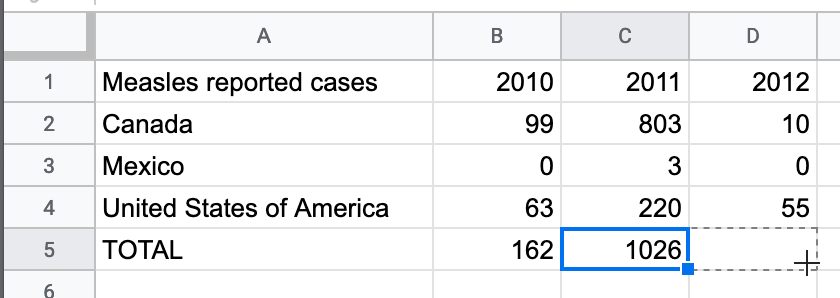
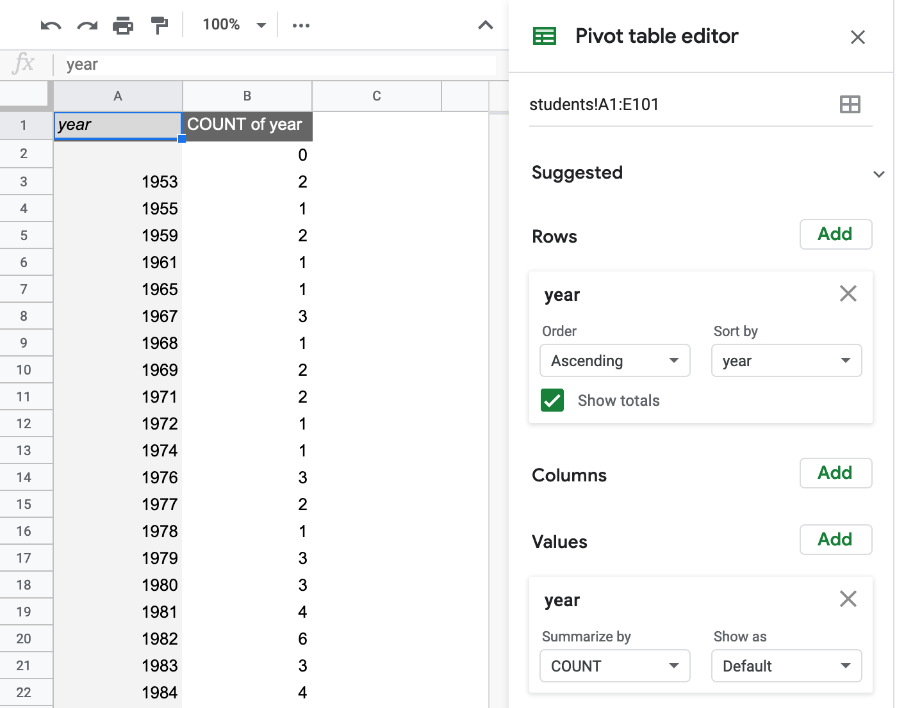
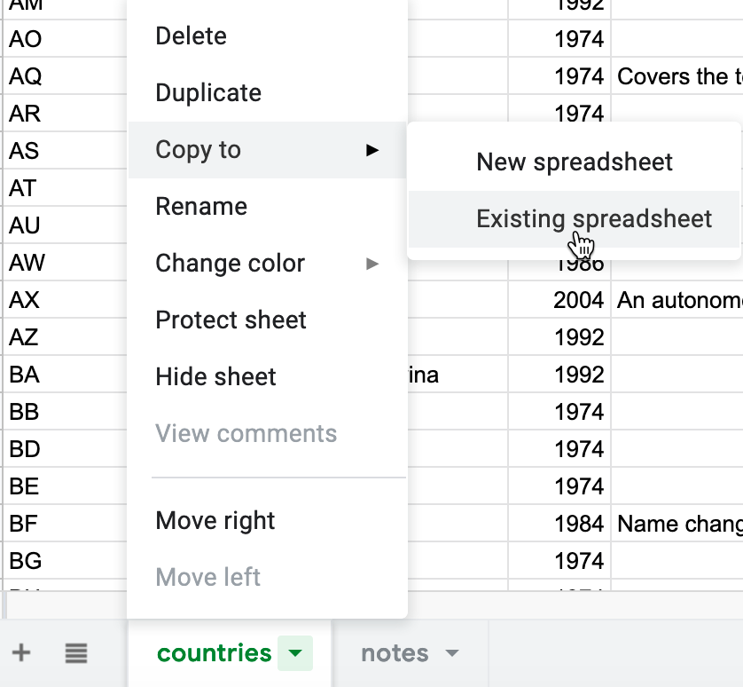

# Improve Your Spreadsheet Skills {#spreadsheet}
Before we begin to design data visualizations, it's important to make sure our spreadsheet skills are up to speed. While teaching this topic, we've heard many people describe how they "never really learned" how to use spreadsheet tools as part of their official schooling or workplace training. But spreadsheet skills are vital to learn, not only as incredible time-savers for tedious tasks, but more importantly, to help us discover the stories buried inside our data.

The interactive charts and maps that we'll construct later this book are built on data tables, which we typically open with spreadsheet tools to reveal rows and columns of numbers and text, where each box in the grid is called a "cell." In this chapter, we'll start by reviewing basic steps, such as [sharing data](share.html), [sorting and filtering](sort.html), and [calculating with formulas and functions](calculate.html). Then we'll step up to the next level of skills, such as [regrouping data with pivot tables](pivot.html), [matching columns with lookup tables](vlookup.html), [connecting sheets with a relational database](database.html), and [collecting data with online forms](forms.html). All of the methods we illustrate are intended for introductory users, and do not require any background in statistics.

If you want to learn ways to make your computer do more work for you, this is the right chapter for you. Even if you *think* you know something about using spreadsheets, skim these sections and you might learn a trick or two that will help you to design charts and maps more efficiently in later chapters.

## Selecting your Spreadsheet Tool {- #spreadsheet-tool}
Which spreadsheet tool should you use? As we describe in more detail in [Chapter 1: Choose Tools to Tell Your Data Story](choose.html), the answer depends on how you respond to different questions about your work. First, is your data public or private? If private, consider using a downloadable spreadsheet tool that runs on your personal computer, to reduce the risk of an accidental data breach that might happen when using an online spreadsheet tool that automatically stores your data in the cloud. Second, will you be working solo or with other people? For collaborative projects, consider using an online spreadsheet tool that's designed to allow other team members to simultaneously view or edit data. Third, do you need to import or export data in any specific format (which we'll describe in the next section), such as Comma Separated Values (CSV)? If yes, then choose a spreadsheet tool that supports that format. Finally, do you prefer a free tool, or are you willing to pay for it, or donate funds to support open-source development?

Here's how three common spreadsheet tools compare on these questions:

- [Google Sheets](https://www.google.com/sheets/about/) is a free online spreadsheet tool that works in any modern web browser, and automatically stores your data in the cloud. While data you upload is private by default, you can choose to share it with specific individuals or anyone on the internet, and allow them to view or edit for real-time collaboration, similar to Google Documents. Google Sheets also imports and exports data in CSV, ODS, Excel, and other formats. You can sign up for a free personal [Google Drive](https://drive.google.com) account with the same username as your Google Mail account, or create a separate account under a new username to reduce Google's invasion into your private life. Another option is to pay for a [Google Suite](https://gsuite.google.com/) business account subscription, which offers nearly identical tools, but with sharing settings designed for larger organizations or educational institutions.
- [LibreOffice](https://www.libreoffice.org/) is a free downloadable suite of tools, including its Calc spreadsheet, available for Mac, Windows, and Linux computers, and is an increasingly popular alternative to Microsoft Office. When you download LibreOffice, its sponsor organization, The Document Foundation, requests a donation to continue its open-source software development. The Calc spreadsheet tool imports and exports data in its native ODS format, as well as CSV, Excel, and others. While an online collaborative platform is under development, it is not yet available for broad usage.
- [Microsoft Excel](https://support.microsoft.com/en-us/excel) is the spreadsheet tool in the Microsoft Office suite, which is available in different versions, though commonly confused as the company has changed its product names over time. A paid subscription to [Microsoft 365](https://www.microsoft.com/en-us/microsoft-365) allows you to download the Excel tool to your Windows or Mac computer or other devices (which is what most people mean when they simply say "Excel") and also to work with Excel online through your browser and share files with collaborators through Microsoft's file hosting service. Also, anyone can sign up for a free version of Excel online (without the downloadable tool) at Microsoft's [Office on the Web](https://office.com). But neither the paid nor free version of Excel online allows you to download files into the Comma Separated Values (.csv) generic data format, an important feature required by some data visualization tools in later chapters of this book. You can only export to CSV using the downloadable Excel tool, available only with a paid Microsoft 365 subscription.

Deciding which spreadsheet tool to use is not a simple choice. Sometimes our decisions change from project to project, depending on costs, data formats, privacy concerns, and the personal preferences of any collaborators. Occasionally we've also had co-workers or clients specifically request that we send them non-sensitive spreadsheet data attached to an email, rather than sharing it through a spreadsheet tool platform that was designed for collaboration. So it's best to be familiar with all three commonly-used spreadsheet tools above, and to understand their respective strengths and weaknesses.

In this book, we primarily use Google Sheets for most of our examples. All of the data we distribute through this book is public. Also, we wanted a spreadsheet tool designed for collaboration, so that we can share links to data files with readers like you, so that you can view our original version, and either make a copy to edit in your own Google Drive, or download in a different format to use in LibreOffice or Excel. Most of the spreadsheet methods we teach look the same across all spreadsheet tools, and we point out exceptions when relevant.

## Download and Export to CSV or ODS formats {- #csv}
In [Chapter 1: Choose Tools to Tell Your Data Story](choose.html), we learned the advantages of selecting software tools that support data migration, so that you can export your work to other platforms. Digital technology always changes. Never upload important data into a tool if you can't easily get it out! In addition, better tools allow you to export your work in open-data or generic file formats, not just proprietary formats created primarily for a specific company's software platform.

When choosing a spreadsheet tool, test if and how it exports into these two open data formats:

- Comma Separated Values (.csv) export only one sheet of data, with no formulas or formatting, into a wide range of spreadsheet and visualization tools, including several featured in later chapters of this book.
- OpenDocument Spreadsheet (.ods) exports a spreadsheet with multiple tabs of data, including basic formulas and formatting, into multiple spreadsheet tools, including Google Sheets, Microsoft Excel, and LibreOffice

About data formats:  TODO: MERGE ABOVE?

Spreadsheet tools organize data in different formats. When you download spreadsheet data to your personal computer, you typically see its filename, followed by a period and a 3- or 4-character abbreviated extension, which represents the data format, as shown in Figure \@ref(fig:data-formats). The most common data formats we use in this chapter are:

- `.csv` means Comma Separated Values, a generic format for a single sheet of simple data, with no formulas or styling.
- `.ods` means OpenDocument Spreadsheet, a standardized open format that supports multi-tabbed data sheets, formulas, styling, etc.
- `.xlsx` or the older `.xls` means Microsoft Excel, a proprietary format that supports multi-tabbed sheets, formulas, styling, etc.

(ref:data-formats) Three common data formats---csv, ods, and xlsx---displayed as icons in the Mac Finder.

```{r data-formats, fig.cap="(ref:data-formats)"}
 knitr::include_graphics("images/02-spreadsheet/data-formats.png")
```

In Google Sheets, go to *File > Download As* to export in CSV format (for only the current sheet) or ODS format (for a multi-tabbed spreadsheet with most formulas and formatting), or other formats, as shown in Figure \@ref(fig:sheets-download).

(ref:sheets-download) In Google Sheets, go to *File > Download As* to export data to other common formats.

```{r sheets-download, fig.cap="(ref:sheets-download)"}
 knitr::include_graphics("images/02-spreadsheet/sheets-download.png")
```

In the downloadable LibreOffice and its Calc spreadsheet tool, select *File > Save As* to save in its native ODS format, or export in CSV, XLSX, and other formats.

In the online Excel for free OneDrive or paid Office 365, the *File > Save As* menu allows you to save a file in its native XLSX format, or export in ODS format, as shown in Figure \@ref(fig:excel-online-save-as). But online Excel lacks an easy way to export data in CSV format.

(ref:excel-online-save-as) Online versions of Excel export into ODS format, but not CSV.

```{r excel-online-save-as, fig.cap="(ref:excel-online-save-as)"}
 knitr::include_graphics("images/02-spreadsheet/excel-online-save-as.png")
```

In the downloadable Excel for Windows and Mac, the *File > Save As* menu allows you to save a file in its native XLSX format, or export in CSV, ODS, or other formats. But saving from Excel into CSV format requires thinking through a few steps that sometimes confuse people.

1. Remember that if you have an Excel workbook with multiple sheets and formulas, the CSV export will only save the *active* sheet (meaning the one you're currently viewing), and only the *data* in that sheet (meaning none of the formulas you may have used for calculations). If you need to create a CSV version for other data visualization tools in this book, we advise that you first save a full-version of your Excel file, and then save a CSV file, using parallel file names:

- data.csv
- data.xlsx

2. In the downloadable version of Excel, click on *File > Save As* and select *CSV* format. If you see multiple CSV options, choose *CSV UTF-8*, which should work best across different computer platforms.

3. If your Excel workbook contains multiple sheets, you may see a warning that it cannot be saved in CSV format, which only saves data contained in the active sheet. If you understand this, click *OK* to continue. On the next screen, Excel may warn you about "Possible data loss" when saving an Excel file in CSV format, which is true. That's why we recommended that you first save the full-version of your Excel file before saving a CSV file.

TODO: I can add screenshots of any of the downloadable Excel steps above, but I don't think it's necessary. Thoughts?

Once you've learned how to export your spreadsheet data into an open format, you're ready to migrate it into other data visualization tools or platforms that we'll introduce in later chapters of this book. Data portability is key for ensuring that your charts and maps will last well into the future.


TODO: does this warning fit here?

Warning: Several tools in this book may not work properly on a Mac computer that does not display the filename extensions, meaning the abbreviated file format after the period, such as `data.csv` or `map.geojson`. The Mac operating system hides these by default, so you need to turn them on by going to Finder > Preferences > Advanced, and check the box to *Show all filename extensions*, as shown in Figure \@ref(fig:mac-file-extensions).

(ref:mac-file-extensions) On a Mac, go to Finder > Preferences > Advanced and check the box to *Show all filename extensions*.

```{r mac-file-extensions, fig.cap="(ref:mac-file-extensions)"}
 knitr::include_graphics("images/02-spreadsheet/mac-file-extensions.png")
```


## Make Your Own Copy of a Google Sheet {- #copy}
In several chapters of this book, we share sample data with links to Google Sheets, using settings that allow you to view---but not edit---the original file. We want everyone to have access to the data, but do not want anyone to accidentally modify the contents. Follow these simple steps to make your own copy of a Google Sheet that you can edit, without changing our version.

1. Right-click on this [sample-students Google Sheets file](https://docs.google.com/spreadsheets/d/1FYTiLHfOI2caT2lkI4i8fGbhA-oKT_MSOP1vQWWC9MA) to open in a new tab. We set it to "View only" so that anyone on the internet can see the contents, but not edit them.

2. Sign in to your Google account by clicking the blue button in the upper-right corner.

3. Go to *File > Make a Copy* to create a duplicate of this Google Sheet in your Google Drive, as shown in Figure \@ref(fig:file-make-copy). You can rename the file to remove "Copy of...".

(ref:file-make-copy) Go to *File > Make a Copy* to create your own version of this Google Sheet.

```{r file-make-copy, fig.cap="(ref:file-make-copy)"}
 knitr::include_graphics("images/02-spreadsheet/file-make-copy.png")
```

4. To keep your Google Drive files organized, click the *My Drive* button and the *New folder* button to create a folder for your data, before clicking *OK*, as shown in Figure \@ref(fig:my-drive-new-folder). If you make a habit of saving every file in a folder, you'll save a lot of time later when searching for the correct file.

(ref:my-drive-new-folder) Click the *My Drive* and *New folder* buttons to save your work in a folder.

```{r my-drive-new-folder, fig.cap="(ref:my-drive-new-folder)"}
 knitr::include_graphics("images/02-spreadsheet/my-drive-new-folder.png")
```

Your copy of the Google Sheet will be private to you only, by default. In the next section we'll learn about different options for sharing your Google Sheet data with others.


## Share Your Google Sheets {- #share}
If you're working on a collaborative project with other people, Google Sheets offers several ways to share your data online, even with people who do not own a Google account. When you create a new Sheet, its default setting is private, meaning only you can view or edit its contents. In this section, you'll learn how to expand those options using the *Share* button.

1. Log into your [Google Drive account](http://drive.google.com), click the *New* button, select *Google Sheets*, and create a blank spreadsheet. By default, a new Sheet will be private to you. You will need to name your file to proceed with next steps.

2. Click the *Share* button in the upper-right corner, and your options will appear on the *Share with people and groups* screen, as shown in Figure \@ref(fig:share-screen).

3. In the top half of the screen, you can share access with specific individuals by typing their Google usernames into the *Add people and groups* field. For each person or group you add, on the next screen select the drop-down menu to choose if they can *View*, *Comment* on, or *Edit* the file. Decide if you wish to notify them with a link to the file and optional message.

4. In the lower half of the screen, you can share access more widely by clicking on *Change to anyone with the link*. On the next screen, the default option is to allow anyone who has the link to *View* the file, but you can change this to allow anyone to *Comment* on or *Edit* it. Also, you can click *Copy link* to paste the web address to your data in an email or public website.

(ref:share-screen) Click the *Share* button to grant access to individuals (top half) or anyone with the link (bottom half).

```{r share-screen, fig.cap="(ref:share-screen)"}
 knitr::include_graphics("images/02-spreadsheet/share-screen.png")
```

Tip: If you don't want to send people a really long and ugly Google Sheet web address such as `https://docs.google.com/spreadsheets/d/1FYTiLHfOI2caT2lkI4i8fGbhA-oKT_MSOP1vQWWC9MA`, use a free link-shortening service. For example, by using our free [Bitly.com](http://bitly.com) account and its handy [Chrome browser extension](https://chrome.google.com/webstore/detail/bitly-unleash-the-power-o/iabeihobmhlgpkcgjiloemdbofjbdcic) or [Firefox browser extension](https://addons.mozilla.org/en-US/firefox/user/13352154/), we can paste in a long URL and customize the back-end to something shorter, such as [bit.ly/sample-students](https://bit.ly/sample-students), as shown in Figure \@ref(fig:link-shortening). If someone else has already claimed your preferred custom name, you'll need to think up a different one. Beware that `bit.ly` links are case-sensitive, so we prefer to customize the back-end in all lower-case to match the front-end.

(ref:link-shortening) Use a free link-shortening service, such as Bitly.com, and customize its back-end.

```{r link-shortening, fig.cap="(ref:link-shortening)"}
 knitr::include_graphics("images/02-spreadsheet/link-shortening.png")
```

Now that you have different options for sharing a Google Sheet, let's learn how to upload and convert data from different formats.

## Upload and Convert Data to Google Sheets {- #upload}

A common mistake to avoid when using Google Drive is failing to check the hidden *Convert uploads* box. Checking this box automatically transforms files such as Microsoft Excel sheets or Word documents into Google Sheets or Google Docs format, which allows easier editing. Google turns off this option by default on new accounts, and hides it inside its Settings screen. But if you're reading this page, you'll learn how to turn it on, and the benefits of doing so. Share this tip with your family, friends, and co-workers---they'll thank you!

1. Find an Excel file you can use on your personal computer. If you don't have one, click this [sample Excel data file](https://handsondataviz.org/data/data.xlsx) and save to download to your computer.

2. Log into your [Google Drive](https://drive.google.com) account, and click the *Gear* symbol in the upper-right corner to open the Settings screen. Note that this global *Gear symbol > Settings* appears at Google Drive level, *not* inside each Google Sheet.

3. Check the box to *Convert uploaded files to Google Docs editor format*, as shown in Figure \@ref(fig:convert-uploads), and click *Done*. This turns on the conversion setting globally, meaning it will convert all possible files that you upload in the future---including Microsoft Excel, Word, PowerPoint, and more---unless you turn it off.

(ref:convert-uploads) Inside your Google Drive settings (the gear symbol), check the box to convert uploads.

```{r convert-uploads, fig.cap="(ref:convert-uploads)"}
 knitr::include_graphics("images/02-spreadsheet/convert-uploads.png")
```

4. Upload a sample Excel file from your computer to your Google Drive. Either drag-and-drop it to the desired folder, as shown in Figure \@ref(fig:upload-file), or use the *New* button and select *File upload*.

(ref:upload-file) Drag-and-drop your sample Excel file into your Google Drive to upload it.

```{r upload-file, fig.cap="(ref:upload-file)"}
 knitr::include_graphics("images/02-spreadsheet/upload-file.png")
```

If you forget to check the *Convert uploads* box, Google Drive will keep uploaded files in their original format, and display their icons and file name extensions such as `.xlsx` or `.csv`, as shown in Figure \@ref(fig:drive-file-icons).

(ref:drive-file-icons) If you forget to convert uploads, Google Drive will keep files in their original format with these icons.

```{r drive-file-icons, fig.cap="(ref:drive-file-icons)"}
 knitr::include_graphics("images/02-spreadsheet/drive-file-icons.png")
```

Tip: Google Drive now allows you to edit Microsoft Office file formats, but not all features are guaranteed to work across platforms. Also, Google Drive now allows you to convert an uploaded Excel file into its Google format by using the *File > Save as Google Sheets* menu.

Tip: To convert individual files to your Google Drive, while keeping the global conversion setting off, from inside any Google Sheet you can select *File > Import > Upload*. But we recommend that most people turn on the global conversion setting as described above, except in cases where you intentionally use Google Drive to edit an Excel-formatted file, and understand that some features may not work.


## Sort and Filter Data {- #sort}
Spreadsheet tools help you delve into your data and lift its stories to the surface. One of the most basic steps in organizing your data is to *sort* the contents of an entire table by one column, such as alphabetical order in a column of text, or highest-to-lowest order in a column of numbers. A related method is to *filter* an entire table to display only rows that contain certain values, such as a specific text or numerical value among all of the other entries. While you could manually sort or filter small datasets, spreadsheets become more powerful when you work with hundreds or thousands of rows of data.

Let's use a large sample file to learn how to sort and filter data.

1. Open this [Google Sheet of New York City restaurant health inspection data](https://docs.google.com/spreadsheets/d/1WvEa46w8en5uWiMX7Jq6o02Q--wMHN2jGFOjD4sr73A/). It contains over 13,000 rows of data for inspections conducted in January 2020, where each row is a health violation. This is just a fraction of the full dataset available from the original source, [NYC Open Data](https://nycopendata.socrata.com/Health/DOHMH-New-York-City-Restaurant-Inspection-Results/43nn-pn8j).

2. Login to your Google Sheets account, and go to *File > Make a Copy* to create your own version that you can edit.

3. Before sorting, click the upper-left corner of the sheet to select all cells, as shown in Figure \@ref(fig:sheets-select-all). The entire sheet should become light blue to show you've selected all cells.

(ref:sheets-select-all) Click the upper-left corner to select all cells before sorting.

```{r sheets-select-all, fig.cap="(ref:sheets-select-all)"}
 knitr::include_graphics("images/02-spreadsheet/sheets-select-all.png")
```

Warning: If you forget to select all cells, you might accidentally sort one column independently of the others, which would scramble your entire dataset and make it meaningless. Always select all cells before sorting!

4. Go to *Data > Sort Range* to review all of your sort options. In the next screen, check the *Data has header row* box to view the column headers in your data. Let's sort the *SCORE* column in ascending order (from A-Z), as shown in Figure \@ref(fig:sheets-sort-range), to display the lowest-scoring restaurants at the top of the sheet.

(ref:sheets-sort-range) Go to *Data > Sort Range*, check the header row box, and sort by *SCORE* in ascending order.

```{r sheets-sort-range, fig.cap="(ref:sheets-sort-range)"}
 knitr::include_graphics("images/02-spreadsheet/sheets-sort-range.png")
```

5. Now let's try filtering your sheet. Go to *Data > Create a Filter*, which inserts downward arrows in each column header. Click on the downward arrow in the *BORO* column, and see options to display or hide rows of data. For example, click only the *Manhattan* boro, and unclick all of the other options, to display only rows with that name, as shown in Figure \@ref(fig:sheets-filter).

(ref:sheets-filter) Go to *Data > Create a Filter*, and in the *BORO* column, select only *Manhattan*.

```{r sheets-filter, fig.cap="(ref:sheets-filter)"}
 knitr::include_graphics("images/02-spreadsheet/sheets-filter.png")
```

By sorting and filtering large spreadsheets, you can begin to focus on key details in your data. Where should we *not* go out for lunch?


## Calculate with Formulas and Functions {- #calculate}
Spreadsheet tools can save you lots of time when you insert simple formulas and functions to automatically perform calculations across entire rows and columns of data. In this section you'll learn how to write a simple formula that adds up a column of numbers, then you'll insert built-in functions to show the sum and average.

1. Open this Google Sheet of [Measles cases in three nations 2010-18](https://docs.google.com/spreadsheets/d/15Q16jcgoIcoQ-UkAJ3nfQpU-4d_Hk6tJqEYoobmnxY0/), a subset of [data from the World Health Organization](https://www.who.int/data/gho/data/indicators/indicator-details/GHO/measles---number-of-reported-cases). Log into your Google Drive account, and go to *File > Make a Copy* to edit your own version.

2. Let's calculate the total number of reported cases in 2010 by inserting a simple formula that adds up the cells for Canada, Mexico, and the US that year. Spreadsheet formulas begin with an `=` equal sign, and refer to specific cells and operations. Click on cell B5 and type in `= B2 + B3 + B4` then press *Return* or *Enter*. A total of 162 cases in 2010 will appear in the cell where you entered the formula.

3. Now let's speed up our work using the built-in `SUM` function to total up numbers for us. Click on column C5 and type in `=SUM(C2:C4)`, which calculates the sum of all of the cells between C2 and C4. then press *Return*. A total of 1,026 cases in 2011 will appear.

4. Now let's speed up our work even more by using the built-in click-and-drag tool to extend the `SUM` calculation across the row for each remaining year. Click in cell C5, and float your cursor over the dot in the bottom-right corner, which transforms your cursor into a crosshair symbol. Then click-and-drag your crosshair cursor from cell C5 to J5, which automatically copies and pastes the formula in each cell, and let go, as shown in Figure \@ref(fig:drag-calculation).

(ref:drag-calculation) Click on the bottom-right dot to transform your cursor into a crosshair, then drag to paste the formula, as shown in this [animated GIF](https://handsondataviz.org/images/02-spreadsheet/drag-calculation.gif).

```{r drag-calculation, fig.cap="(ref:drag-calculation)"}
if(knitr::is_html_output()) knitr::include_url("images/02-spreadsheet/drag-calculation.gif", height = "300px") else 
```

5. We can use another built-in function to calculate the average number of reported cases for each nation over time. Click in cell K2 and type in `=AVERAGE(B2:J2)` or select it if the tool suggests it. Then click the right-corner dot in cell K2 and drag downward to extend the calculation for the other rows.

Tip: Spreadsheet tools ignore empty cells when performing calculations. In this example, the World Health Organization did not list any data for the US in 2018.

Warning: When you save a spreadsheet in CSV format, your calculated results will remain, but any formulas that created those results will disappear from the CSV sheet. Keep the original in a spreadsheet format as a reminder about how you constructed the formulas.

Spreadsheet tools contain many more functions to perform numerical calculations and also to modify text. See more examples in the "Split data into two or more columns" and "Combine columns into one" sections in [Chapter 4: Clean Up Messy Data](clean.html). In the next section, you'll learn a more advanced spreadsheet method to regroup data with a pivot table.

## Regroup Data with Pivot Tables {- #pivot}
Pivot tables are another powerful feature built into spreadsheet tools to help you regroup or rearrange your data, hence the name "pivot." In this section we'll start with a sheet that contains an anonymous partial class roster for an online data visualization class we previously taught. Each row represents an individual student, including their birth year, gender, and country of origin. You'll learn how to "pivot" this individual-level data into a new sheet that cross-tabulates the number of students by birth year and gender.

1. Open this [Google Sheet of Sample Students](https://docs.google.com/spreadsheets/d/1FYTiLHfOI2caT2lkI4i8fGbhA-oKT_MSOP1vQWWC9MA), log into your Google Drive, and go to *File > Make a Copy* to edit your own version.

2. Go to *Data > Pivot Table*, and on the next screen, select *Create* in a new sheet, as shown in Figure \@ref(fig:sheets-pivot-create).

(ref:sheets-pivot-create) Go to *Data > Pivot Table*, and create in a new sheet.

```{r sheets-pivot-create, fig.cap="(ref:sheets-pivot-create)"}
 knitr::include_graphics("images/02-spreadsheet/sheets-pivot-create.png")
```

3. In the *Pivot table editor* screen, you can regroup data from the first sheet by adding rows, columns, and values. First, click the Rows *Add* button and select *year*, which shows each of the unique entries for birth year in column A.

4. Next, to count the number of students for each birth year, click the Values *Add* button and select *year* again. Initially, the pivot table will summarize by adding up the total of all birth years, but you don't want that. Instead, change the *Summarize by* drop-down menu to *COUNT*, which shows the frequency for each row, as shown in Figure \@ref(fig:sheets-pivot-editor).

(ref:sheets-pivot-editor) In the Google Sheets pivot editor, add *year* as a Row, and add *year* again as a Value, but change *Summarize by* to *Count*, as shown in this [animated GIF](https://handsondataviz.org/images/02-spreadsheet/sheets-pivot-editor.gif).

```{r sheets-pivot-editor, fig.cap="(ref:sheets-pivot-editor)"}
if(knitr::is_html_output()) knitr::include_url("images/02-spreadsheet/sheets-pivot-editor.gif", height = "1080px") else 
```

Tip: *COUNT* summarizes numerical values, and *COUNTA* summarizes text values.

5. You can create more advanced pivot tables by adding a *Column* header, such as *gender*, to display a cross-tabulation of students by birth year and gender. Furthermore, you can also *Filter* the data, for example, to show only students who listed *US* as their country of origin.

While pivot tables may look a bit different across other spreadsheet tools, the concept is similar. Learn more about how pivot tables work in the [support pages for LibreOffice](https://help.libreoffice.org/Calc/Creating_Pivot_Tables) and [Microsoft Excel](https://support.microsoft.com/en-us/office/create-a-pivottable-to-analyze-worksheet-data-a9a84538-bfe9-40a9-a8e9-f99134456576). Click to download and save this [sample student data in CSV format](https://handsondataviz.org/data/sample-students.csv) to your computer to upload into either tool.

Now that you've learned how to regroup data with pivot tables, let's move on to another common task of matching data columns from different sheets.

## Match Columns with VLOOKUP {- #vlookup}
Spreadsheet tools also allow you to "look up" matching data from one sheet and automatically paste it into another sheet, using the "VLOOKUP" function. The "V" stands for "vertical" lookup, which means making matches across columns, the most typical way to lookup data. In this section you'll learn how to write a function in one sheet that looks for matching data in a second sheet, and pastes it into a new column in the first sheet.

Here's a common problem where "VLOOKUP" can save you lots of time. Imagine two spreadsheets. The first sheet, which we saw in the previous section, contains a list of students enrolled in a class, where each row includes a two-letter code for their country of origin. But some abbreviations may not be familiar to everyone. A second sheet contains a list of all of the two-letter abbreviated codes, plus the full name of each country, as shown in Figure \@ref(fig:vlookup-setup). Your goal is to "lookup" each student's two-letter code in the second sheet, and paste the full name of each country for each row in the first sheet. Doing this manually would require lots of your time, but learning how to use the VLOOKUP function will do the work for you automatically.

(ref:vlookup-setup) The problem: match each two-letter code in the left sheet with the full country name in the right sheet.

```{r vlookup-setup, fig.cap="(ref:vlookup-setup)"}
 knitr::include_graphics("images/02-spreadsheet/vlookup-setup.png")
```

1. In one browser tab, open this [Google Sheet of Sample Students](https://docs.google.com/spreadsheets/d/1FYTiLHfOI2caT2lkI4i8fGbhA-oKT_MSOP1vQWWC9MA). In another tab, open this [Google Sheet of Country Codes 2-letter](https://docs.google.com/spreadsheets/d/1iuImHkn2Aotf-0g6pcKv6e65QLWICjVHNUrcGfPxQNE). Log into your Google Drive, and go to *File > Make a Copy* to create your own version of both sheets, so that you can edit them.

2. Let's simplify this two-file problem by copying all of the data into one Google Sheet. Go to the Country Codes sheet, select the *countries* tab, and go to *Copy to > Existing spreadsheet*, and select *Sample Students,* as shown in Figure \@ref(fig:vlookup-copy). Go back to the *Sample Students* sheet and you'll see a new tab named *Copy of countries*.

(ref:vlookup-copy) Copy the *countries* data into the existing *Sample Students* sheet.

```{r vlookup-copy, fig.cap="(ref:vlookup-copy)"}
 
```

3. In the Sample Students sheet, in the *students* tab, click in cell E1 and type `country name.` This creates a new column header where lookup results will be automatically pasted.

3. Click in cell E2 and type `=VLOOKUP` and Google Sheets will suggest that you complete the full formula in this format:

```
VLOOKUP(search_key, range, index, [is_sorted])
```

Here's what each part means:

- search_key = The cell in Sheet 1 you wish to match.
- range = At least two columns in Sheet 2 to search for your match and desired result.
- index = The column in the Sheet 2 range that contains your desired result, where 1 = first column, 2 = second column, etc.
- [is_sorted] = Enter `false` to find exact matches only, which makes sense in this case. Otherwise, enter `true` if the first column of the Sheet 2 range is sorted and you will accept the closest match, even if not an exact one.

4. Type in the full VLOOKUP formula or click on the relevant cells and columns to automatically enter it. Your formula should look similar to `=VLOOKUP(D2,'Copy of countries'!A:B,2,false)`, as shown in Figure \@ref(fig:vlookup-solution), but may differ if you have different tab names.

(ref:vlookup-solution) Your VLOOKUP formula should look similar to this, depending on your tab names.

```{r vlookup-solution, fig.cap="(ref:vlookup-solution)"}
 knitr::include_graphics("images/02-spreadsheet/vlookup-solution.png")
```

Let's break down each part of that formula, separated by commas:

- D2 = The search_key, the cell you want to match in the *students* tab.
- *'Copy of countries'!A:B* = The range, meaning you are searching for matches and results in all of columns A and B in the *Copy of countries* tab.
- 2 = The index, meaning your desired result appears in the 2nd column of the range above.
- *false* = Display exact matches only.

5. After you enter the full VLOOKUP formula, press *Enter* on your keyboard, and the result should display an exact match, if found. In this example, the student with country code `KR` should also display its full country name, `Korea, Republic of`. Float your cursor over the dot in the bottom-right corner of that cell to drag down the results.

While we used Google Sheets to demonstrate how to "lookup" matching data in another spreadsheet column, the

Now that you understand how to use the VLOOKUP function to match columns data columns across spreadsheets, the next section will introduce you to the concept of a relational database, and when you might want to use one.

## Connect Sheets with Relational Database {- #database}
In the previous section, you learned how the VLOOKUP function can search for matching data in columns across spreadsheets and automatically paste results. Building on that concept, let's distinguish between a spreadsheet and a relational database, and in what cases you might want to use the latter.

A spreadsheet is sometimes called a "flat-file database" because all of the records are stored in rows and columns in a single table. For example, if your company kept track of all of your orders and customers in a spreadsheet, the entries would appear like this:

```
Order   Customer    Location
1       Janice      New York
2       Jean        Seattle
3       Jim         Dallas
4       Joe         Los Angeles
5       Julius      Chicago
6       Janice      New York
7       Julius      Chicago
```

In a spreadsheet, every time a customer placed an order, their location would need to be entered separately, which would mean lots of duplicated information. Also, updates would requiring changing the same information in multiple places in your spreadsheet.

By contrast, if your company used a relational database, you would maintain two tables---one for orders and one for customers---with links between them, like this:

```
Order       Customer
1           Janice  
2           Jean
3           Jim
4           Joe    
5           Julius
6           Janice
7           Julius


Customer    Location
Janice      New York
Jean        Seattle
Jim         Dallas
Joe         Los Angeles
Julius      Chicago
```

When someone's address changed, in a relational database it would only need to be updated in one place---the customer table---and only one time. Also, by separating data into different tables, it would be easier to add up your total customers without counting duplicates.

If you're responsible for managing data tables with relationships between them, especially one-to-many relationships (such as where Janice and Julius each place multiple orders), consider the pros and cons of working with a relational database. Years ago, relational databases required complex software that was not easy to set up. But a newer generation of tools such as [AirTable](http://airtable.com) enable you to create relational databases in your web browser with up to 1,200 free records (and more with the paid version), using existing templates (or design your own), and collaborative editing with your co-workers. Furthermore, Airtable supports data migration by allowing you to export all of your records in CSV format.

While the details of setting up a relational database are beyond the scope of this chapter, it's important to understand the conceptual difference between a "flat-file" spreadsheet and a collection of data tables with linked relationships. In the next section, we'll describe how to collect data using online forms, a feature found in Google Sheets, Airtable, and several other tools.

## Collect Data with Online Forms {- #forms}
No doubt, everyone with an email address has been asked to fill out at least one online form. We promise *not* to send you another! But if you need to collect simple data from people who communicate digitally with you, sometimes the easiest solution is to send them an online form that compiles their responses in a data table, which can be much faster than re-entering information from paper forms.

If you already have a Google Drive account, one tool that many people overlook is Google Forms, which is partially hidden under *New > More > Google Forms*, as shown in Figure \@ref(fig:forms-new).

(ref:forms-new) The Google Forms tool is partially hidden in the Google Drive *New > More* menu.

```{r forms-new, fig.cap="(ref:forms-new)"}
 knitr::include_graphics("images/02-spreadsheet/forms-new.png")
```

The Google Forms *Questions* tab allows you to request different types of responses: short- and paragraph-length answers, multiple choice, checkboxes, file uploads, etc., as shown in Figure \@ref(fig:forms-questions). Click the *Preview* (eyeball) button to see how your form will appear to users, then click the *Send* button to distribute via email, a link, or an iframe. You can learn more about how to use the latter in [Chapter 7: Embed On Your Web](embed.html).

(ref:forms-questions) The Google Forms *Questions* tab allows you to request different types of responses.

```{r forms-questions, fig.cap="(ref:forms-questions)"}
 knitr::include_graphics("images/02-spreadsheet/forms-questions.png")
```

The Google Forms *Responses* tab includes a button to open answers you receive in a linked Google Sheet, as shown in Figure \@ref(fig:forms-responses). As you've learned in this chapter, data becomes more powerful when you can share, organize, and analyze it using spreadsheet tools to help reveal and tell its underlying stories.

(ref:forms-responses) The Google Forms *Responses* tab includes a button to open answers in a linked Google Sheet.

```{r forms-responses, fig.cap="(ref:forms-responses)"}
 knitr::include_graphics("images/02-spreadsheet/forms-responses.png")
```

### Summary {- #summary2}
If you're one of the many people who "never really learned" about spreadsheets in school or on the job, or if you've taught yourself bits and pieces along the way, we hope that this chapter has successfully introduced or refreshed your skills. All of the subsequent chapters in this book, especially those on designing interactive charts and maps, require a basic level of familiarity with spreadsheets. In addition to serving as incredible time-savers when it comes to tedious data tasks, the spreadsheet tools and methods featured above are designed to help you share, sort, calculate, as well as more advanced skills in pivoting tables and matching with lookup tables, with the broader goal of telling your data stories.

The next chapter describes strategies for finding data, particularly on open data sites operated by governmental and non-profit organizations, where you'll also need spreadsheet skills to download information in an organized way. See additional spreadsheet skills in later chapters of the book. [Chapter 4: Clean Up Messy Data](clean.html) demonstrates how to find and replace, split data into columns, and combine columns of data (such as when you need the street address, city, and postal code all in one line). [Chapter 11: Transform Your Map Data](transform.html) also features more advanced spreadsheet skills and tools, such as how to geocode addresses, pivot address points into polygons, and how to normalize data to create more meaningful polygon maps.
