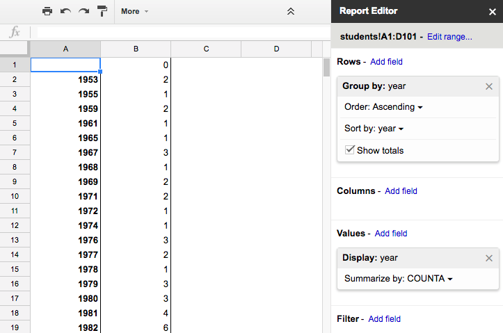
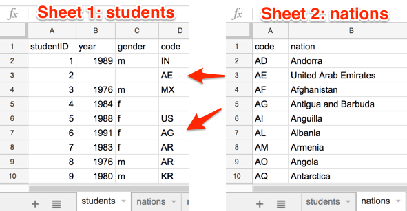

# Improve Your Spreadsheet Skills {#spreadsheet}
Before we begin to design data visualizations, let's bring our spreadsheet skills up to speed. While teaching this topic, we've heard many people describe how they "never really learned" how to use spreadsheet tools as part of their official schooling or workplace training. But spreadsheet skills are vital to learn, not only as incredible time-savers for tedious tasks, but more importantly, to help us discover the stories buried inside our data.

To fill this gap, we added this chapter to introduce or refresh your spreadsheet skills. The interactive charts and maps that we'll construct later this book are built on data tables, which we typically open with spreadsheet tools to reveal rows and columns of numbers and text, where each box in the grid is called a "cell." In this chapter, we'll start by reviewing basic steps, such as [sharing data](share.html), [sorting and filtering](sort.html), and [calculating with formulas and functions](calculate.html). Then we'll step up to the next level of skills, such as [grouping data with pivot tables](pivot.html), [matching columns with lookup tables](vlookup.html), [collecting data with online forms](forms.html), and [connecting sheets with a relational database](database.html). Even if you *think* you know how to use spreadsheets, skim through these sections and you'll probably learn a few things that will help you to create better charts and maps later in the book.

About spreadsheet tools:

- Free online [Google Sheets](https://www.google.com/sheets/about/) offers an easy-to-learn yet powerful spreadsheet tool that works in any modern web browser. Since it's designed for collaboration and exports data into multiple open formats, we feature it in several examples in this book. You can sign up for a free personal [Google Drive](https://drive.google.com) account with the same username as your Google Mail account, or create a separate account to reduce Google's invasion into your personal life. Another option is to pay for a [Google Suite](https://gsuite.google.com/) business account, with nearly identical tools, but designed for larger teams and organizations.  
- Free downloadable [LibreOffice and its Calc spreadsheet](https://www.libreoffice.org/) is a powerful and increasingly popular open-source alternative to Microsoft Office, available for Mac, Windows, and Linux desktop and laptop computers. When downloading, a donation is requested to continue support for open-source software development.
- Free online [Microsoft Excel for OneDrive](https://onedrive.live.com) and the paid online [Microsoft Excel for Office 365](https://www.microsoft.com/en-us/microsoft-365/microsoft-office) offer limited Office tools in your web browser. For example, these online versions of Excel do *not* allow you to easily save or download files into the Comma Separated Values (.csv) generic data format, a very important feature required by other data visualization tools in later chapters of this book. Exporting to CSV format requires the downloadable version of Excel below. TODO: Further fact-checking needed because I investigated for 15 minutes and cannot find an easy way to export to CSV in the online Excel using the free OneDrive or paid Office 365 account, contrary to this Microsoft Support page: https://support.microsoft.com/en-us/office/import-or-export-text-txt-or-csv-files-5250ac4c-663c-47ce-937b-339e391393ba
- Paid downloadable [Microsoft Excel](https://www.microsoft.com/) is available for Windows and Mac desktops and laptops, and other devices. When people simply say "Excel" they usually mean this powerful yet pricey version. It offers the most complete set of spreadsheet tools (including the simple task of exporting to CSV that its online cousins lack), but was not originally designed for online collaboration.

Which spreadsheet tool should you use? As we describe in more detail in [Chapter 1: Choose Tools to Tell Your Data Story](choose.html), that answer depends on multiple factors. Is your data public or private? If private, consider using downloadable spreadsheet tool that runs on your personal computer, to reduce the risk of an accidental data breach with an online spreadsheet tool. Also, will you be working solo or with other people? For collaborative projects, consider using an online spreadsheet tool that's designed to allow other team members to simultaneously view or edit data. In this book, we emphasize public, shared datasets, so our examples feature Google Sheets. But most of the spreadsheet methods we teach are common across other spreadsheet tools, and we point out exceptions where relevant.

About data formats:

Spreadsheet tools organize data in different formats. When you download spreadsheet data to your personal computer, you typically see its filename, followed by a period and a 3- or 4-character abbreviated extension, which represents the data format, as shown in Figure \@ref(fig:data-formats). The most common data formats we use in this chapter are:

- `.csv` means Comma Separated Values, a generic format for a single sheet of simple data, with no formulas or styling.
- `.ods` means OpenDocument Spreadsheet, a standardized open format that supports multi-tabbed data sheets, formulas, styling, etc.
- `.xlsx` or the older `.xls` means Microsoft Excel, a proprietary format that supports multi-tabbed sheets, formulas, styling, etc.

(ref:data-formats) Three common data formats---csv, ods, and xlsx---displayed as icons in the Mac Finder. TODO: Expand screenshot to show data formats as displayed in Chromebook for comparison?

```{r data-formats, fig.cap="(ref:data-formats)"}
 knitr::include_graphics("images/02-spreadsheet/data-formats.png")
```

Warning: Several tools in this book may not work properly on a Mac computer that does not display the filename extensions, meaning the abbreviated file format after the period, such as `data.csv` or `map.geojson`. The Mac operating system hides these by default, so you need to turn them on by going to Finder > Preferences > Advanced, and check the box to *Show all filename extensions*, as shown in Figure \@ref(fig:mac-file-extensions).

(ref:mac-file-extensions) On a Mac, go to Finder > Preferences > Advanced and check the box to *Show all filename extensions*.

```{r mac-file-extensions, fig.cap="(ref:mac-file-extensions)"}
 knitr::include_graphics("images/02-spreadsheet/mac-file-extensions.png")
```

## Make Your Own Copy of a Google Sheet {- #copy}
In several chapters of this book, we share sample data with links to Google Sheets, using settings that allow you to view---but not edit---the original file. We want everyone to have access to the data, but do not want anyone to accidentally modify the contents. Follow these simple steps to make your own copy of a Google Sheet that you can edit, without changing our version.

1. Right-click on this [sample-students Google Sheets file](https://docs.google.com/spreadsheets/d/1FYTiLHfOI2caT2lkI4i8fGbhA-oKT_MSOP1vQWWC9MA) to open in a new tab. We set it to "View only" so that anyone on the internet can see the contents, but not edit them.

2. Sign in to your Google account by clicking the blue button in the upper-right corner.

3. Go to *File > Make a Copy* to create a duplicate of this Google Sheet in your Google Drive, as shown in Figure \@ref(fig:file-make-copy). You can rename the file to remove "Copy of...".

(ref:file-make-copy) Go to *File > Make a Copy* to create your own version of this Google Sheet.

```{r file-make-copy, fig.cap="(ref:file-make-copy)"}
 knitr::include_graphics("images/02-spreadsheet/file-make-copy.png")
```

4. To keep your Google Drive files organized, click the *My Drive* button and the *New folder* button to create a folder for your data, before clicking *OK*, as shown in Figure \@ref(fig:my-drive-new-folder). If you make a habit of saving every file in a folder, you'll save a lot of time later when searching for the correct file.

(ref:my-drive-new-folder) Click the *My Drive* and *New folder* buttons to save your work in a folder.

```{r my-drive-new-folder, fig.cap="(ref:my-drive-new-folder)"}
 knitr::include_graphics("images/02-spreadsheet/my-drive-new-folder.png")
```

Your copy of the Google Sheet will be private to you only, by default. In the next section we'll learn about different options for sharing your Google Sheet data with others.


## Share Your Google Sheets {- #share}
If you're working on a collaborative project with other people, Google Sheets offers several ways to share your data online, even with people who do not own a Google account. When you create a new Sheet, its default setting is private, meaning only you can view or edit its contents. In this section, you'll learn how to expand those options using the *Share* button.

1. Log into your [Google Drive account](http://drive.google.com), click the *New* button, select *Google Sheets*, and create a blank spreadsheet. By default, a new Sheet will be private to you. You will need to name your file to proceed with next steps.

2. Click the *Share* button in the upper-right corner, and your options will appear on the *Share with people and groups* screen, as shown in Figure \@ref(fig:share-screen).

3. In the top half of the screen, you can share access with specific individuals by typing their Google usernames into the *Add people and groups* field. For each person or group you add, on the next screen select the drop-down menu to choose if they can *View*, *Comment* on, or *Edit* the file. Decide if you wish to notify them with a link to the file and optional message.

4. In the lower half of the screen, you can share access more widely by clicking on *Change to anyone with the link*. On the next screen, the default option is to allow anyone who has the link to *View* the file, but you can change this to allow anyone to *Comment* on or *Edit* it. Also, you can click *Copy link* to paste the web address to your data in an email or public website.

(ref:share-screen) Click the *Share* button to grant access to individuals (top half) or anyone with the link (bottom half).

```{r share-screen, fig.cap="(ref:share-screen)"}
 knitr::include_graphics("images/02-spreadsheet/share-screen.png")
```

Tip: If you don't want to send people a really long and ugly Google Sheet web address such as `https://docs.google.com/spreadsheets/d/1FYTiLHfOI2caT2lkI4i8fGbhA-oKT_MSOP1vQWWC9MA`, use a free link-shortening service. For example, by using our free [Bitly.com](http://bitly.com) account and its handy [Chrome browser extension](https://chrome.google.com/webstore/detail/bitly-unleash-the-power-o/iabeihobmhlgpkcgjiloemdbofjbdcic) or [Firefox browser extension](https://addons.mozilla.org/en-US/firefox/user/13352154/), we can paste in a long URL and customize the back-end to something shorter, such as [bit.ly/sample-students](https://bit.ly/sample-students), as shown in Figure \@ref(fig:link-shortening). If someone else has already claimed your preferred custom name, you'll need to think up a different one. Beware that `bit.ly` links are case-sensitive, so we prefer to customize the back-end in all lower-case to match the front-end.

(ref:link-shortening) Use a free link-shortening service, such as Bitly.com, and customize its back-end.

```{r link-shortening, fig.cap="(ref:link-shortening)"}
 knitr::include_graphics("images/02-spreadsheet/link-shortening.png")
```

Now that you have different options for sharing a Google Sheet, let's learn how to upload and convert data from different formats.

## Upload and Convert Data to Google Sheets {- #upload}

A common mistake to avoid when using Google Drive is failing to check the hidden *Convert uploads* box. Checking this box automatically transforms files such as Microsoft Excel sheets or Word documents into Google Sheets or Google Docs format, which allows easier editing. Google turns off this option by default on new accounts, and hides it inside its Settings screen. But if you're reading this page, you'll learn how to turn it on, and the benefits of doing so. Share this tip with your family, friends, and co-workers---they'll thank you!

1. Find an Excel file you can use on your personal computer. If you don't have one, click this [sample Excel data file](https://handsondataviz.org/data/data.xlsx) and save to download to your computer.

2. Log into your [Google Drive](https://drive.google.com) account, and click the *Gear* symbol in the upper-right corner to open the Settings screen. Note that this global *Gear symbol > Settings* appears at Google Drive level, *not* inside each Google Sheet.

3. Check the box to *Convert uploaded files to Google Docs editor format*, as shown in Figure \@ref(fig:convert-uploads), and click *Done*. This turns on the conversion setting globally, meaning it will convert all possible files that you upload in the future---including Microsoft Excel, Word, PowerPoint, and more---unless you turn it off.

(ref:convert-uploads) Inside your Google Drive settings (the gear symbol), check the box to convert uploads.

```{r convert-uploads, fig.cap="(ref:convert-uploads)"}
 knitr::include_graphics("images/02-spreadsheet/convert-uploads.png")
```

4. Upload a sample Excel file from your computer to your Google Drive. Either drag-and-drop it to the desired folder, as shown in Figure \@ref(fig:upload-file), or use the *New* button and select *File upload*.

(ref:upload-file) Drag-and-drop your sample Excel file into your Google Drive to upload it.

```{r upload-file, fig.cap="(ref:upload-file)"}
 knitr::include_graphics("images/02-spreadsheet/upload-file.png")
```

If you forget to check the *Convert uploads* box, Google Drive will keep uploaded files in their original format, and display their icons and file name extensions such as `.xlsx` or `.csv`, as shown in Figure \@ref(fig:drive-file-icons).

(ref:drive-file-icons) If you forget to convert uploads, Google Drive will keep files in their original format with these icons.

```{r drive-file-icons, fig.cap="(ref:drive-file-icons)"}
 knitr::include_graphics("images/02-spreadsheet/drive-file-icons.png")
```

Tip: Google Drive now allows you to edit Microsoft Office file formats, but not all features are guaranteed to work across platforms. Also, Google Drive now allows you to convert an uploaded Excel file into its Google format by using the *File > Save as Google Sheets* menu.

Tip: To convert individual files to your Google Drive, while keeping the global conversion setting off, from inside any Google Sheet you can select *File > Import > Upload*. But we recommend that most people turn on the global conversion setting as described above, except in cases where you intentionally use Google Drive to edit an Excel-formatted file, and understand that some features may not work.


## Download and Export to CSV or ODS formats {- #csv}

In [Chapter 1: Choose Tools to Tell Your Data Story](choose.html), we learned the advantages of selecting software tools that support data migration, so that you can export your work to other platforms. Digital technology always changes. Never upload important data into a tool if you can't easily get it out! In addition, better tools allow you to export your work in open-data or generic file formats, not just proprietary formats created primarily for a specific company's software platform.

When choosing a spreadsheet tool, test if and how it exports into these two open data formats:

- Comma Separated Values (.csv) export only one sheet of data, with no formulas or formatting, into a wide range of spreadsheet and visualization tools, including several featured in later chapters of this book.
- OpenDocument Spreadsheet (.ods) exports a spreadsheet with multiple tabs of data, including basic formulas and formatting, into multiple spreadsheet tools, including Google Sheets, Microsoft Excel, and LibreOffice

In Google Sheets, go to *File > Download As* to export in CSV format (for only the current sheet) or ODS format (for a multi-tabbed spreadsheet with most formulas and formatting), or other formats, as shown in Figure \@ref(fig:sheets-download).

(ref:sheets-download) In Google Sheets, go to *File > Download As* to export data to other common formats.

```{r sheets-download, fig.cap="(ref:sheets-download)"}
 knitr::include_graphics("images/02-spreadsheet/sheets-download.png")
```

In the downloadable LibreOffice and its Calc spreadsheet tool, select *File > Save As* to save in its native ODS format, or export in CSV, XLSX, and other formats.

In the online Excel for free OneDrive or paid Office 365, the *File > Save As* menu allows you to save a file in its native XLSX format, or export in ODS format, as shown in Figure \@ref(fig:excel-online-save-as). But online Excel lacks an easy way to export data in CSV format.

(ref:excel-online-save-as) Online versions of Excel export into ODS format, but not CSV.

```{r excel-online-save-as, fig.cap="(ref:excel-online-save-as)"}
 knitr::include_graphics("images/02-spreadsheet/excel-online-save-as.png")
```

In the downloadable Excel for Windows and Mac, the *File > Save As* menu allows you to save a file in its native XLSX format, or export in CSV, ODS, or other formats. But saving from Excel into CSV format requires thinking through a few steps that sometimes confuse people.

1. Remember that if you have an Excel workbook with multiple sheets and formulas, the CSV export will only save the *active* sheet (meaning the one you're currently viewing), and only the *data* in that sheet (meaning none of the formulas you may have used for calculations). If you need to create a CSV version for other data visualization tools in this book, we advise that you first save a full-version of your Excel file, and then save a CSV file, using parallel file names:

- data.csv
- data.xlsx

2. In the downloadable version of Excel, click on *File > Save As* and select *CSV* format. If you see multiple CSV options, choose *CSV UTF-8*, which should work best across different computer platforms.

3. If your Excel workbook contains multiple sheets, you may see a warning that it cannot be saved in CSV format, which only saves data contained in the active sheet. If you understand this, click *OK* to continue. On the next screen, Excel may warn you about "Possible data loss" when saving an Excel file in CSV format, which is true. That's why we recommended that you first save the full-version of your Excel file before saving a CSV file.

TODO: I can add screenshots of any of the downloadable Excel steps above, but I don't think it's necessary. Thoughts?

Once you've learned how to export your spreadsheet data into an open format, you're ready to migrate it into other data visualization tools or platforms that we'll introduce in later chapters of this book. Data portability is key for ensuring that your charts and maps will last well into the future.


## Sort and Filter Data {- #sort}

Spreadsheet tools help you delve into your data and lift its stories to the surface. One of the most basic steps in organizing your data is to *sort* the contents of an entire table by one column, such as alphabetical order in a column of text, or highest-to-lowest order in a column of numbers. A related method is to *filter* an entire table to display only rows that contain certain values, such as a specific text or numerical value among all of the other entries. While you could manually sort or filter small datasets, spreadsheets become more powerful when you work with hundreds or thousands of rows of data.

Let's use a large sample file to learn how to sort and filter data.

1. Open this [Google Sheet of New York City restaurant health inspection data](https://docs.google.com/spreadsheets/d/1WvEa46w8en5uWiMX7Jq6o02Q--wMHN2jGFOjD4sr73A/). It contains over 13,000 rows of data for inspections conducted in January 2020, where each row is a health violation. This is just a fraction of the full dataset. See the [NYC Open Data source](https://nycopendata.socrata.com/Health/DOHMH-New-York-City-Restaurant-Inspection-Results/43nn-pn8j) for more info.

2. Login to your Google Sheets account, and go to *File > Make a Copy* to create your own version that you can edit.

3. Before sorting, click the upper-left corner of the sheet to select all cells, as shown in Figure \@ref(fig:sheets-select-all). The entire sheet should become light blue to show you've selected all cells.

(ref:sheets-select-all) Click the upper-left corner to select all cells before sorting.

```{r sheets-select-all, fig.cap="(ref:sheets-select-all)"}
 knitr::include_graphics("images/02-spreadsheet/sheets-select-all.png")
```

Warning: If you forget to select all cells, you might accidentally sort one column independently of the others, which would scramble your entire dataset and make it meaningless. Always select all cells before sorting!

4. Go to *Data > Sort Range* to review all of your sort options. In the next screen, check the *Data has header row* box to view the column headers in your data. Let's sort the *SCORE* column in ascending order (from A-Z), as shown in Figure \@ref(fig:sheets-sort-range), to display the lowest-scoring restaurants at the top of the sheet.

(ref:sheets-sort-range) Go to *Data > Sort Range*, check the header row box, and sort by *SCORE* in ascending order.

```{r sheets-sort-range, fig.cap="(ref:sheets-sort-range)"}
 knitr::include_graphics("images/02-spreadsheet/sheets-sort-range.png")
```

5. Now let's try filtering your sheet. Go to *Data > Create a Filter*, which inserts downward arrows in each column header. Click on the downward arrow in the *BORO* column, and see options to display or hide rows of data. For example, click only the *Manhattan* boro, and unclick all of the other options, to display only rows with that name, as shown in Figure \@ref(fig:sheets-filter).

(ref:sheets-filter) Go to *Data > Create a Filter*, and in the *BORO* column, select only *Manhattan*.

```{r sheets-filter, fig.cap="(ref:sheets-filter)"}
 knitr::include_graphics("images/02-spreadsheet/sheets-filter.png")
```

By sorting and filtering large spreadsheets, you can begin to focus on key details in your data. Where should we *not* go out for lunch?


## Calculate with Formulas and Functions {- #calculate}
**TODO: START AGAIN HERE**

- when possible, start text by posing a common problem, and how this method can solve it
- redo visuals: Google Sheets with better examples
- see other notes inserted below

Simple formulas can save you lots of time. The big advantage of spreadsheet tools is the ability to insert simple formulas to calculate numbers, or combine columns of text, for entire rows and columns.

#### Write a simple formula {-}

In most spreadsheets, begin writing a simple formula with an equal sign, and refer to specific cells and functions, such as:

- = A2 + B2 + C2

#### Write formulas with built-in functions {-}
TODO: rewrite to show how this is same as above

- = Sum(A2:C2)

TODO: rewrite to show common numerical and textual functions

- = Average(A2:C2)

#### Copy and paste, or drag formulas {-}
If you've inserted a formula into one row, how can you quickly do the same calculation across all rows?

Spreadsheets can magically automate calculations across rows or columns. In most cases, you can copy and paste a formula into new cells. Sometimes you can click-and-drag the lower-right corner of a formula cell (which may appear as a cross-hair) to automate calculations.

```{r spreadsheet-formula}
if(knitr::is_html_output()) knitr::include_url("images/02-spreadsheet/SpreadsheetFormula640w.gif") else knitr::include_graphics("images/placeholder.jpg")
```

#### Copy and Paste > Special > Values to replace formulas with data {-}
After inserting calculations in a spreadsheet, sometimes dynamic formulas must be replaced with static data before the results can be visualized. One solution is to select and copy a column (or the entire sheet), then paste > special > values to replace the formula with numerical results.

```{r spreadsheet-paste-special}
if(knitr::is_html_output()) knitr::include_url("images/02-spreadsheet/SpreadsheetPasteSpecialValues640w.gif") else knitr::include_graphics("images/placeholder.jpg")
```

Remember that if you need to check or run the calculations again at a later point, click (or right-click) the tab to save a copy to the spreadsheet as a backup.

#### Create a column of consecutive numbers {-}
To quickly create a column of consecutive numbers, such as unique ID numbers, in most spreadsheet tools:

- Insert the number 1 into a cell and press Return
- Click the cell and float the cursor over the bottom-right corner, where it will change into a cross-hair symbol
- On a Mac, hold down the Option key and drag the cross-hair down to create consecutive numbers
- **TO DO** insert equivalent commands for Windows, Chromebook

```{r excel-drag-consec}
if(knitr::is_html_output()) knitr::include_url("images/02-spreadsheet/excel-drag-consec.gif") else knitr::include_graphics("images/placeholder.jpg")
```

## Group Data with Pivot Tables {- #pivot}
Here's a common problem: You open a large spreadsheet with many rows of data, such as a list of students. Your goal is to count students by categories, such as the number of students by each year of birth.  What's the most efficient way to do this?


A solution: Create a pivot table to aggregate (or group together) and summarize data in another spreadsheet tab.



While pivot tables may look different across spreadsheet tools, the concept is the same.

#### Video with step-by-step tutorial for Google Sheets {-}
<iframe width="560" height="315" src="https://www.youtube.com/embed/3sK7-g0otGM?rel=0" frameborder="0" allow="autoplay; encrypted-media" allowfullscreen></iframe>

1) Click this link and Save to download to your computer: [sample-students in CSV format](data/sample-students.csv). CSV means comma-separated values, a generic spreadsheet format that most tools can easily open.

2) Sign into [Google Drive](http://drive.google.com) (requires free account) and drag-and-drop the sample CSV file to instantly upload. Before you do this, make sure your Settings (gear symbol) is set to Convert Uploads to Google Docs editor format (the default setting).

3) Shift-click to select all columns that you wish to pivot.

4) Select Data > Pivot Table..., which opens a new spreadsheet tab.

5) In Report Editor, select Rows > Add Field > Year to list all entries in order.

6) In Report Editor, select Values > Add Field > Year to summarize all values for each entry.

7) Change Summarize by SUM to Summarize by COUNTA (to count alphabetical or numerical entries), or COUNT (to count only numeric values).

#### More Advanced Pivot Table with Google Sheets {-}
In addition to grouping by rows, you can create more advanced pivot tables by grouping by columns and filtering results. For example, the pivot table shown below shows rows by birth year, columns by gender (blank, female, male, other), and filters results to show only 18 students from one country: US.


#### Learn More {-}
- Google, Create and Use Pivot Tables Help Page https://support.google.com/docs/answer/1272898
- LibreOffice, Creating Pivot Tables Help Page https://help.libreoffice.org/Calc/Creating_Pivot_Tables
- Andrew Ba Tran, "Tutorial: How to Make Pivot Tables in Google Sheets," TrendCT, September 4, 2015, http://trendct.org/2015/09/04/tutorial-how-to-make-pivot-tables-in-google-sheets

## Match Columns with VLOOKUP {- #vlookup}
Here's a common problem: Sheet 1 contains a long roster of students enrolled in our *Data Visualization For All* course, with a two-letter code for their nation. Sheet 2 contains the list of codes for each nation. How can we quickly match up this information in one sheet, so that each row contains the nation for each student?



One solution: Spreadsheets contain a VLOOKUP function, which "looks up" data across two or more vertical columns, and automatically fills in matching entries. This tutorial demonstrates how to set up this calculation in Google Sheets and Excel


#### Video with step-by-step tutorial for Google Sheets {-}
<iframe width="560" height="315" src="https://www.youtube.com/embed/qrzKzts3mV0?rel=0" frameborder="0" allow="autoplay; encrypted-media" allowfullscreen></iframe>

1) Click this link and Save to download to your computer: [sample-students-nations in .ODS format](data/sample-students-nations.ods). ODS means OpenDocument System, a generic multi-tab format that most spreadsheet tools can easily open.

2) To upload the downloaded file to Google Sheets, see the [Upload Files and Convert tutorial](upload) in this book, and remember that Settings (gear symbol) must be set to Convert files to Google format. Or, open the file with Microsoft Excel or LibreOffice, and the directions below will be similar.

2) In the students sheet, type "nation" as a column header into cell E1.

3) Click in cell E2, start typing "=VLOOKUP" and the spreadsheet tool will suggest that you complete the formula in this format:

```markdown
VLOOKUP(search_key, range, index, [is_sorted])
```
  - search_key = the Sheet 1 cell we are trying to match
  - range = the columns in Sheet 2 where matches may exist
  - index = the column in the Sheet 2 range that contains the desired result, where 1 = first column, 2 = second column, etc.
  - [is_sorted] = if the first column of the range is sorted, enter "true" to find the closest match; otherwise enter "false" to return exact matches only

4) You can type in the formula, or fill it out by clicking on cells, columns, and sheets as shown in the video above.

## Collect and Share Data with Google Forms {- #forms}

TODO: write simple tutorial for Google Forms and explain how to share the spreadsheet; also mention other web form services

## Connect Sheets with Relational Database {- #database}

TODO: add introduction to relational database section, with AirTable

**Summary**

TODO: write summary

Also refer to more additional spreadsheet skills elsewhere in the book.
[Chapter 4: Clean Up Messy Data](clean.html) shows how to find and replace, split data into columns, and combine columns of data.
[Chapter 11: Transform Your Map Data](transform.html) shows how to geocode addresses, pivoting address points into polygons, and normalize data.
