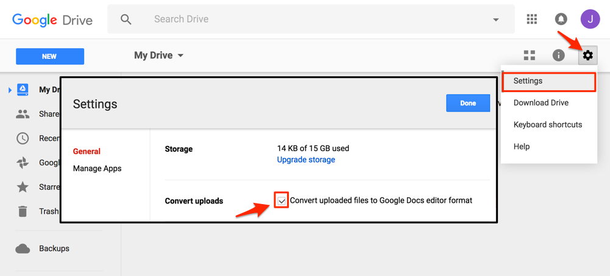

# Improve Your Spreadsheet Skills {#spreadsheet}
Before we begin to design data visualizations, let's bring our spreadsheet skills up to speed. While teaching this topic, we've heard many people describe how they "never really learned" how to use spreadsheet tools, such as Google Sheets or Microsoft Excel, as part of their official schooling or workplace training. But spreadsheet skills are vital to learn, not only as incredible time-savers for tedious tasks, but more importantly, to help us discover the stories buried inside our data.

To fill this gap, we added this chapter to introduce or refresh your spreadsheet skills. The interactive charts and maps that we'll construct later this book are built on data tables, which we typically open with spreadsheet tools to reveal rows and columns of numbers and text, where each box in the grid is called a "cell." In this chapter, we'll start by reviewing basic steps, such as [uploading](upload.html) and [sharing data](share.html), [sorting and filtering](sort.html), and [inserting simple formulas to automatically run calculations](calculate.html). Then we'll step up to the next level of skills, such as [grouping data with pivot tables](pivot.html), [matching columns with lookup tables](vlookup.html), and [collecting data with online forms](forms.html). Even if you *think* you know how to use spreadsheets, skim through these sections and you'll probably learn a few things that will help you to create better charts and maps later in the book.

Spreadsheet tools and terminology:

Most of our examples in this book feature [Google Sheets](https://www.google.com/sheets/about/), a free and easy-to-learn collaborative spreadsheet tool, which is part of the Google Drive family. Users can sign up for a free personal account or a paid business account, and if you already have a Google Mail account, you can use the same username to access it.

The methods shown here are similar across other spreadsheet tools, such as:

- free online [Microsoft Excel for Office Live](https://office.live.com/start/Excel.aspx)
- paid downloadable [Microsoft Excel for Office 365](https://www.microsoft.com/en-us/microsoft-365/microsoft-office) for desktop, laptop, and other devices
- free and open-source downloadable [LibreOffice](https://www.libreoffice.org/) for desktop and laptop, with donation requested

Any of these tools will be sufficient for this book, but more advanced users may need more complex tools to manage very large datasets, or relational databases, or to perform deeper analysis.

TODO: Which spreadsheet tool should you use? That depends on how you wish to share and store data for your project.

- If you are the **only person** working on a data project, use any spreadsheet tool.
- If you need to **protect private data**, avoid online tools and use any desktop spreadsheet.
- If you need to **share live data** with others, use Google Sheets.

TODO: Data formats

- Comma-separated values (.csv), a generic single sheet
- Microsoft Excel current (.xlsx) and older format (.xls)
- OpenData System (.ods), a generic multi-tab spreadsheet

- OpenDocument Spreadsheet (.ods)
- Comma-separated values (.csv)
- Tab-separated values (.tab)
- Text files (.txt) into Google Sheets format

Warning: Several tools in this book will not work properly if your computer does not display the filename extensions, meaning the abbreviated file format after the period, such as `data.csv` or `map.geojson`. The Mac computer operating system hides these by default, so you need to turn them on by going to Finder > Preferences > Advanced, and check the box to *Show all filename extensions*, as shown in Figure \@ref(fig:mac-file-extensions).

(ref:mac-file-extensions) On a Mac, go to Finder > Preferences > Advanced and check the box to *Show all filename extensions*.

```{r mac-file-extensions, fig.cap="(ref:mac-file-extensions)"}
 knitr::include_graphics("images/02-spreadsheet/mac-file-extensions.png")
```


Warning: To follow the steps in this book, we recommend either a desktop or laptop computer, running either the Mac or Windows or Linux operating system, with an internet connection and a modern web browser such as Chrome, Firefox, Safari, or Edge. Another good option is a Chromebook laptop, which enables you to complete *most* of the steps in this book, and we'll point out any limitations in specific chapters. While it's possible to use a tablet or smartphone device, we do not recommend it because you cannot follow all of the steps, and you'll also get frustrated with the small screen and perhaps throw your device (or this book) across the room, and possibly hit someone else in the head. Ouch! We are not responsible for injuries caused by flying objects.

Tip: If you're working on a laptop, consider buying or borrowing an external mouse that can plug into your machine. We've met several people who found it much easier to click, hover, and scroll with a mouse rather than a laptop's built-in trackpad.

Tip: If you're new to working with computers---or teaching new users with this book---consider starting with [mouse exercises](http://www.pbclibrary.org/mousing/mousercise.htm). All of the tools in this book assume that users already know how to click tiny buttons, hover over links, and scroll web pages, but rarely are these skills taught, and everyone needs to learn them at some point in our lives.

TODO: I added the tips above because these are huge yet surmountable obstacles for many people I've worked with, especially older generations and incarcerated people. But I'm uncertain about the link to the mouse exercises. Perhaps I should tweet at public library staff and instructors to find better beginning resources?


## Upload Files and Convert to Google Sheets {- #upload}

Google Drive can convert many file types into [Google Sheets format](https://www.google.com/sheets/about/):

- Microsoft Excel (.xls and .xlsx)
- OpenDocument Spreadsheet (.ods)
- Comma-separated values (.csv)
- Tab-separated values (.tab)
- Text files (.txt) into Google Sheets format

#### Tutorial {-}
1) Sign in to your free Google Drive account (http://drive.google.com)

2) To convert files into Google Sheets format, open the Settings (upper-right gear symbol), and **check the box** to Convert uploaded files to Google Docs.



3) To upload your file, use the New > File Upload menu OR drag-and-drop it into your Google Drive screen.


4) When your file is successfully converted, the Google Sheets icon will appear. Recommended: Right-click to rename the file and remove the old extension (.xlsx or .csv or other), since it is no longer in this old format.


5) Google Drive files that display different icons have **not** been converted into Google Sheets format.


**Beware**: A different way to convert spreadsheets into Google Sheets format is the File > Import menu, but this creates two files in your Google Drive (such as data and data.csv), which is confusing.  

## Make a Copy with Google Sheets {- #copy}
In this book, you will open links to Google Sheets that allow you to view -- but not edit -- the contents. How can you quickly make your own version that you can edit?


#### Best solution {-}
1) Sign in to your Google account in the upper-right corner. Requires a free account.

2) Go to File > Make a Copy to save a duplicate of the spreadsheet to your Google Drive. By default, your copy will be private to you. Go to the [Share Data with Google Sheets](spreadsheet.html#share) chapter in this book to allow others to view, comment, or edit your spreadsheet.

Highly recommended: Create folders in your Google Drive to keep your files organized and easily findable.


#### Alternate solution {-}
Another option is to File > Download As into a different format, such as:

- Microsoft Excel (.xlsx)
- OpenData System (.ods), a generic multi-tab spreadsheet
- Comma-separated values (.csv), a generic single sheet

No Google account is required.

## Share Data with Google Sheets {- #share}
To share live spreadsheet data with other people, use Google Sheets (https://www.google.com/sheets/about/). Requires a free Google
Drive account.

#### Video with step-by-step tutorial {-}
<iframe width="560" height="315" src="https://www.youtube.com/embed/PoLhyld3KLo?rel=0" frameborder="0" allow="autoplay; encrypted-media" allowfullscreen></iframe>

1) Sign in to your Google Drive (http://drive.google.com), and in the New menu, select Google Sheets.

2) New spreadsheets are private by default. Only the owner can view and edit.

3) To open your spreadsheet to others, click the blue Share button.

4) To share data with specific individuals, enter their Google usernames.

5) Or, to share data more widely, click the **Advanced** button on the next screen. (I wish Google made this button larger!)

6) Click the Change button and decide on Link Sharing settings:

- Public on the web (anyone can find your data)
- Anyone with the link (similar to an unlisted phone number)
- Off (only specific people you list by Google usernames)

Below those settings, select the Access level:

- Can view
- Can comment
- Can edit (for co-authored data)

7) Select Save, and scroll down on the next screen to select Done.

**Tip:** To avoid sending a long Google Sheets link to others, use a free link-shortening service such as Bit.ly (http://bit.ly). Requires a free account.

#### Learn more {-}
- "Share Files from Google Drive," Google help page, https://support.google.com/docs/answer/2494822
- Jack Dougherty, "How to Co-Author and Peer Edit with Google Docs," Web Writing: How and Why for Liberal Arts Teaching and Learning, (2015), http://epress.trincoll.edu/webwriting/chapter/how-to-google-docs

## Save Spreadsheets in CSV or ODS {- #csv}
To transfer spreadsheet data to another platform, or import it into a visualization tool, you may need to convert your file into a different format. Consider two options:

#### Comma-separated values (.csv) {-}
- to transfer only one sheet of data, with no formulas or formatting, into a wide range of spreadsheet and visualization tools

#### OpenDocument Spreadsheet (.ods) {-}
- to transfer multiple sheets, with basic formulas and formatting, into many spreadsheet tools (Excel, Google Sheets, LibreOffice)

#### Convert to CSV or ODS with Google Sheets {-}

In the File > Download As menu, select either ODS (to convert a Google Sheets file with multiple tabs, formulas, and formatting) or CSV (to capture only the data in the current sheet).


#### Convert to ODS with Microsoft Excel {-}

In the File > Save As menu, select ODS format.


#### Convert to CSV with Microsoft Excel {-}

1) Note that CSV format will save only the first sheet of a multi-sheet Excel workbook. If you have source information or other data in other tabs, keep your original Excel file for backup purposes. You can give them parallel file names:

- data.csv
- data.xlsx

2) In the Excel file, select the File > Save As menu, and select CSV format.


3) Older versions of Excel may warn you that some features (such as formulas and formatting) will not be saved in a generic CSV data file. Be sure to keep a backup Excel version, then click Continue to save your data into CSV format.


4) In older versions of Excel, when you quit the application, another screen will ask if you wish to save the CSV file a second time. **Don't let Excel confuse you.** If you have not made any changes to the Excel file since the step above, click Don't Save, because you already saved the file in CSV format.


## Sort and Filter Data {- #sort}

TODO:

- write intro on the title concepts
- when possible, start text by posing a common problem, and how this method can solve it
- redo visuals: Google Sheets with better example
- add Filter data

#### Sort data by columns {-}

To sort data rows by a column, select the entire spreadsheet (top-left corner icon), then right-click or look for the sort menu. Be sure to select the entire sheet to avoid accidentally sorting one column without the adjacent ones.

```{r spreadsheet-sort}
if(knitr::is_html_output()) knitr::include_url("images/02-spreadsheet/SpreadsheetSort640w.gif") else knitr::include_graphics("images/placeholder.jpg")
```

#### Filter data by columns {-}
TO DO

## Calculate with Formulas and Functions {- #calculate}
TODO:

- when possible, start text by posing a common problem, and how this method can solve it
- redo visuals: Google Sheets with better examples
- see other notes inserted below

Simple formulas can save you lots of time. The big advantage of spreadsheet tools is the ability to insert simple formulas to calculate numbers, or combine columns of text, for entire rows and columns.

#### Write a simple formula {-}

In most spreadsheets, begin writing a simple formula with an equal sign, and refer to specific cells and functions, such as:

- = A2 + B2 + C2

#### Write formulas with built-in functions {-}
TODO: rewrite to show how this is same as above

- = Sum(A2:C2)

TODO: rewrite to show common numerical and textual functions

- = Average(A2:C2)

#### Copy and paste, or drag formulas {-}
If you've inserted a formula into one row, how can you quickly do the same calculation across all rows?

Spreadsheets can magically automate calculations across rows or columns. In most cases, you can copy and paste a formula into new cells. Sometimes you can click-and-drag the lower-right corner of a formula cell (which may appear as a cross-hair) to automate calculations.

```{r spreadsheet-formula}
if(knitr::is_html_output()) knitr::include_url("images/02-spreadsheet/SpreadsheetFormula640w.gif") else knitr::include_graphics("images/placeholder.jpg")
```

#### Copy and Paste > Special > Values to replace formulas with data {-}
After inserting calculations in a spreadsheet, sometimes dynamic formulas must be replaced with static data before the results can be visualized. One solution is to select and copy a column (or the entire sheet), then paste > special > values to replace the formula with numerical results.

```{r spreadsheet-paste-special}
if(knitr::is_html_output()) knitr::include_url("images/02-spreadsheet/SpreadsheetPasteSpecialValues640w.gif") else knitr::include_graphics("images/placeholder.jpg")
```

Remember that if you need to check or run the calculations again at a later point, click (or right-click) the tab to save a copy to the spreadsheet as a backup.

#### Create a column of consecutive numbers {-}
To quickly create a column of consecutive numbers, such as unique ID numbers, in most spreadsheet tools:

- Insert the number 1 into a cell and press Return
- Click the cell and float the cursor over the bottom-right corner, where it will change into a cross-hair symbol
- On a Mac, hold down the Option key and drag the cross-hair down to create consecutive numbers
- **TO DO** insert equivalent commands for Windows, Chromebook

```{r excel-drag-consec}
if(knitr::is_html_output()) knitr::include_url("images/02-spreadsheet/excel-drag-consec.gif") else knitr::include_graphics("images/placeholder.jpg")
```

## Group Data with Pivot Tables {- #pivot}
Here's a common problem: You open a large spreadsheet with many rows of data, such as a list of students. Your goal is to count students by categories, such as the number of students by each year of birth.  What's the most efficient way to do this?


A solution: Create a pivot table to aggregate (or group together) and summarize data in another spreadsheet tab.


While pivot tables may look different across spreadsheet tools, the concept is the same.

#### Video with step-by-step tutorial for Google Sheets {-}
<iframe width="560" height="315" src="https://www.youtube.com/embed/3sK7-g0otGM?rel=0" frameborder="0" allow="autoplay; encrypted-media" allowfullscreen></iframe>

1) Click this link and Save to download to your computer: [sample-students in CSV format](data/sample-students.csv). CSV means comma-separated values, a generic spreadsheet format that most tools can easily open.

2) Sign into [Google Drive](http://drive.google.com) (requires free account) and drag-and-drop the sample CSV file to instantly upload. Before you do this, make sure your Settings (gear symbol) is set to Convert Uploads to Google Docs editor format (the default setting).

3) Shift-click to select all columns that you wish to pivot.

4) Select Data > Pivot Table..., which opens a new spreadsheet tab.

5) In Report Editor, select Rows > Add Field > Year to list all entries in order.

6) In Report Editor, select Values > Add Field > Year to summarize all values for each entry.

7) Change Summarize by SUM to Summarize by COUNTA (to count alphabetical or numerical entries), or COUNT (to count only numeric values).

#### More Advanced Pivot Table with Google Sheets {-}
In addition to grouping by rows, you can create more advanced pivot tables by grouping by columns and filtering results. For example, the pivot table shown below shows rows by birth year, columns by gender (blank, female, male, other), and filters results to show only 18 students from one country: US.


#### Learn More {-}
- Google, Create and Use Pivot Tables Help Page https://support.google.com/docs/answer/1272898
- LibreOffice, Creating Pivot Tables Help Page https://help.libreoffice.org/Calc/Creating_Pivot_Tables
- Andrew Ba Tran, "Tutorial: How to Make Pivot Tables in Google Sheets," TrendCT, September 4, 2015, http://trendct.org/2015/09/04/tutorial-how-to-make-pivot-tables-in-google-sheets

## Match Columns with VLOOKUP {- #vlookup}
Here's a common problem: Sheet 1 contains a long roster of students enrolled in our *Data Visualization For All* course, with a two-letter code for their nation. Sheet 2 contains the list of codes for each nation. How can we quickly match up this information in one sheet, so that each row contains the nation for each student?


One solution: Spreadsheets contain a VLOOKUP function, which "looks up" data across two or more vertical columns, and automatically fills in matching entries. This tutorial demonstrates how to set up this calculation in Google Sheets and Excel


#### Video with step-by-step tutorial for Google Sheets {-}
<iframe width="560" height="315" src="https://www.youtube.com/embed/qrzKzts3mV0?rel=0" frameborder="0" allow="autoplay; encrypted-media" allowfullscreen></iframe>

1) Click this link and Save to download to your computer: [sample-students-nations in .ODS format](data/sample-students-nations.ods). ODS means OpenDocument System, a generic multi-tab format that most spreadsheet tools can easily open.

2) To upload the downloaded file to Google Sheets, see the [Upload Files and Convert tutorial](upload) in this book, and remember that Settings (gear symbol) must be set to Convert files to Google format. Or, open the file with Microsoft Excel or LibreOffice, and the directions below will be similar.

2) In the students sheet, type "nation" as a column header into cell E1.

3) Click in cell E2, start typing "=VLOOKUP" and the spreadsheet tool will suggest that you complete the formula in this format:

```markdown
VLOOKUP(search_key, range, index, [is_sorted])
```
  - search_key = the Sheet 1 cell we are trying to match
  - range = the columns in Sheet 2 where matches may exist
  - index = the column in the Sheet 2 range that contains the desired result, where 1 = first column, 2 = second column, etc.
  - [is_sorted] = if the first column of the range is sorted, enter "true" to find the closest match; otherwise enter "false" to return exact matches only

4) You can type in the formula, or fill it out by clicking on cells, columns, and sheets as shown in the video above.

## Collect and Share Data with Google Forms {- #forms}

TODO: write simple tutorial for Google Forms and explain how to share the spreadsheet; also mention other web form services

### Summary {-}

TODO: write summary

Also refer to more additional spreadsheet skills elsewhere in the book.
[Chapter 4: Clean Up Messy Data](clean.html) shows how to find and replace, split data into columns, and combine columns of data.
[Chapter 11: Transform Your Map Data](transform.html) shows how to geocode addresses, pivoting address points into polygons, and normalize data.
