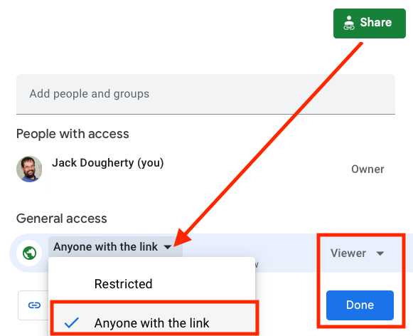

# Strengthen Your Spreadsheet Skills {#spreadsheet}
Before we begin to design data visualizations, it's important to make sure our spreadsheet skills are up to speed. While teaching this topic, we've heard many people describe how they "never really learned" how to use spreadsheet tools as part of their official schooling or workplace training. But spreadsheet skills are vital to learn, not only as incredible time-savers for tedious tasks, but more importantly, to help us discover the stories buried inside our data.

The interactive charts and maps that we'll construct later this book are built on data tables, which we typically open with spreadsheet tools, such as Google Sheets, LibreOffice, or Microsoft Excel. Spreadsheets typically contain columns and rows of numerical or textual data, as shown in Figure \@ref(fig:spreadsheet-terms). The first row often contains headers, meaning labels describing the data in each column. Also, columns are automatically labeled with letters, and rows with numbers, so that every cell or box in the grid can be referenced, such `C2`. When you click on a cell, it may display a formula that automatically runs a calculation with references other cells. Formulas always begin with an equal sign, and may simply add up other cells (such as `=C2+C3+C4`), or may contain a function that performs a specific operation (such as calculating the average of a range of cells: `=average(C2:C7)`). Some spreadsheet files contain multiple sheets (sometimes called workbooks), where each tab across the bottom opens a specific sheet.

(ref:spreadsheet-terms) Screenshot of a typical spreadsheet, with headers, tabs, and the active cell displaying a formula.

```{r spreadsheet-terms, out.width=600, fig.cap="(ref:spreadsheet-terms)"}
 knitr::include_graphics("images/02-spreadsheet/spreadsheet-terms-annotated.png")
```

In this chapter, we'll start by reviewing basic steps, such as [sharing](share.html), [uploading](upload.html), [geocoding with add-on tools](geocode.html), and [collecting data with online forms](forms.html). Then we'll move on to ways of organizing and analyzing your data, such as [sorting and filtering](sort.html), [calculating with formulas](calculate.html), and [summarizing with pivot tables](pivot.html). Finally, we'll examine ways to connect different sheets, such as [matching columns with lookup tables](vlookup.html), and [relational databases](database.html). We illustrate all of these methods with beginner-level users in mind, meaning they do not require any prior background.

We'll practice several of these skills using sample data that may interest you, because it includes people like you. So far over 3,000 readers of this book have responded to a quick public survey about their general location, prior level of experience and education, and goals for learning data visualization. If you haven't already done so, [fill out the quick survey form](https://forms.gle/yn5QwTzfQkYcppQn9) to contribute your own response, and also to give you a better sense of how the questions were posed, then see the results in the [public sample dataset](https://docs.google.com/spreadsheets/d/1egX_akJccnCSzdk1aaDdtrEGe5HcaTrlOW-Yf6mJ3Uo).

If you want to learn ways to make your computer do more of the tedious data preparation work for you, this chapter is definitely for you. Or if you already feel very familiar with spreadsheets, you should at least skim this chapter, and perhaps you'll learn a trick or two that will help you to create charts and maps more efficiently later in the book.

## Select your Spreadsheet Tools {- #spreadsheet-tools}
Which spreadsheet tools should you use? As we discussed in more detail in [Chapter 1: Choose Tools to Tell Your Story](choose.html), the answer depends on how you respond to different questions about your work. First, is your data public or private? If private, consider using a downloadable spreadsheet tool that runs on your computer, to reduce the risk of an accidental data breach that might happen when using an online spreadsheet tool that automatically stores your data in the cloud. Second, will you be working solo or with other people? For collaborative projects, consider using an online spreadsheet tool that's designed to allow other team members to simultaneously view or edit data. Third, do you need to import or export data in any specific format (which we'll describe in the next section), such as Comma Separated Values (CSV)? If yes, then choose a spreadsheet tool that supports that format. Finally, do you prefer a free tool, or are you willing to pay for it, or donate funds to support open-source development?

Here's how three common spreadsheet tools compare on these questions:

- [Google Sheets](https://www.google.com/sheets/about/) is a free online spreadsheet tool that works in any modern web browser, and automatically stores your data in the cloud. While data you upload is private by default, you can choose to share it with specific individuals or anyone on the internet, and allow them to view or edit for real-time collaboration, similar to Google Documents. Google Sheets also imports and exports data in CSV, ODS, Excel, and other formats. You can sign up for a free personal [Google Drive](https://drive.google.com) account with the same username as your Google Mail account, or create a separate account under a new username to reduce Google's invasion into your private life. Another option is to pay for a [Google Workspace](https://workspace.google.com/) business account subscription (formerly known as G Suite), which offers nearly identical tools, but with sharing settings designed for larger organizations or educational institutions.
- [LibreOffice](https://www.libreoffice.org/) is a free downloadable suite of tools, including its Calc spreadsheet, available for Mac, Windows, and Linux computers, and is an increasingly popular alternative to Microsoft Office. When you download LibreOffice, its sponsor organization, The Document Foundation, requests a donation to continue its open-source software development. The Calc spreadsheet tool imports and exports data in its native ODS format, as well as CSV, Excel, and others. While an online collaborative platform is under development, it is not yet available for broad usage.
- [Microsoft Excel](https://support.microsoft.com/en-us/excel) is the spreadsheet tool in the Microsoft Office suite, which is available in different versions, though commonly confused as the company has changed its product names over time. A paid subscription to [Microsoft 365](https://www.microsoft.com/en-us/microsoft-365) provides you with two versions: the full-featured downloadable version of Excel (which is what most people mean when they simply say "Excel") for Windows or Mac computers and other devices, and access to a simpler online Excel through your browser, including file sharing with collaborators through Microsoft's online hosting service. If you do not wish to pay for a subscription, anyone can sign up for a free version of online Excel at Microsoft's [Office on the Web](https://office.com), but this does *not* include the full-featured downloadable version. The online Excel tool has limitations. For example, neither the paid nor the free version of online Excel allows you to save files in the single-sheet generic Comma Separated Values (.csv) format, an important featured required by some data visualization tools in later chapters of this book. You can only export to CSV format using the downloadable Excel tool, which is now available only with a paid Microsoft 365 subscription.

Deciding which spreadsheet tools to use is not a simple choice. Sometimes our decisions change from project to project, depending on costs, data formats, privacy concerns, and the personal preferences of any collaborators. Occasionally we've also had co-workers or clients specifically request that we send them non-sensitive spreadsheet data attached to an email, rather than sharing it through a spreadsheet tool platform that was designed for collaboration. So it's best to be familiar with all three commonly-used spreadsheet tools above, and to understand their respective strengths and weaknesses.

In this book, we primarily use Google Sheets for most of our examples. All of the data we distribute through this book is public. Also, we wanted a spreadsheet tool designed for collaboration, so that we can share links to data files with readers like you, so that you can view our original version, and either make a copy to edit in your own Google Drive, or download in a different format to use in LibreOffice or Excel. Most of the spreadsheet methods we teach look the same across all spreadsheet tools, and we point out exceptions when relevant.

### Sidebar: Common data formats {-}
Spreadsheet tools organize data in different formats. When you download spreadsheet data to your computer, you typically see its filename, followed by a period and a 3- or 4-character abbreviated extension, which represents the data format, as shown in Figure \@ref(fig:data-formats). The most common data formats we use in this book are:

- `.csv` means Comma Separated Values, a generic format for a single sheet of simple data, which saves no formulas nor styling.
- `.ods` means OpenDocument Spreadsheet, a standardized open format that saves multi-tabbed sheets, formulas, styling, etc.
- `.xlsx` or the older `.xls` means Excel, a Microsoft format that supports multi-tabbed sheets, formulas, styling, etc.
- `.gsheet` means Google Sheets, which also supports multi-tabbed sheets, formulas, styling, etc., but you don't normally see these on your computer because they are primarily designed to exist online.

(ref:data-formats) Three data formats commonly seen on your computer---csv, ods, and xlsx---when displayed properly in the Mac Finder.

```{r data-formats, out.width=350, fig.cap="(ref:data-formats)"}
 knitr::include_graphics("images/02-spreadsheet/data-formats.png")
```

Tip: The Mac computer hides filename extensions by default, meaning you may not be able to see the abbreviated file format after the period, such as `data.csv` or `map.geojson`. We recommend that you change this setting by going to Finder > Preferences > Advanced, and check the box to *Show all filename extensions*, as shown in Figure \@ref(fig:mac-file-extensions).

(ref:mac-file-extensions) On a Mac, go to *Finder-Preferences-Advanced* and check the box to *Show all filename extensions*.

```{r mac-file-extensions, out.width=400, fig.cap="(ref:mac-file-extensions)"}
 knitr::include_graphics("images/02-spreadsheet/mac-file-extensions.png")
```

## Download to CSV or ODS Format {- #csv}
In [Chapter 1: Choose Tools to Tell Your Story](choose.html), you learned why we recommend software that supports portability, so you can migrate data to other platforms as technology evolves. Never upload important data into a tool that doesn't allow you to easily get it back out. Ideally, spreadsheet tools should allow you to export your work in generic or open-data file formats, such as Comma Separated Values (CSV) and OpenDocument Spreadsheet (ODS), to maximize your options to migrate to other platforms.

Warning: If you're working in any spreadsheet with multiple tabs and formulas, a CSV export will save only the *active* sheet (meaning the one you're currently viewing), and only the *data* in that sheet (meaning that if you inserted formulas to run calculations, only the results would appear, not the formulas). Later in this book you may need to create a CSV file to import into a data visualization tool, so if the source was a multi-tabbed spreadsheet with formulas, keep track of the original.

One reason we feature Google Sheets in this book is because it exports data in several common formats. To try it, open this [Google Sheets sample data file](https://docs.google.com/spreadsheets/d/1eXWG6sSb6ZL4pKvCsCjcqeJ8l4vqbckuYEBj8T-uefo/) in a new tab, and go to *File > Download* to export in CSV format (for only the data in the active sheet) or ODS format (which keeps data and most formulas in multi-tab spreadsheets), or other formats such as Excel, as shown in Figure \@ref(fig:sheets-download). Similarly, in the downloadable LibreOffice and its Calc spreadsheet tool, select *File > Save As* to save data in its native ODS format, or to export to CSV, Excel, or other formats.

(ref:sheets-download) In Google Sheets, go to *File - Download As* to export data in several common formats.

```{r sheets-download, out.width=600, fig.cap="(ref:sheets-download)"}
 knitr::include_graphics("images/02-spreadsheet/sheets-download.png")
```

But exporting data can be trickier in Microsoft Excel. Using the online Excel tool in your browser (either the free or paid version), you *cannot* save files in the generic single-sheet CSV format, a step required by some data visualization tools in later chapters of this book. Only the downloadable Excel tool (which now requires a paid subscription) will export in CSV format, a step required by some data visualization tools in later chapters of this book. And when using the downloadable Excel tool to save in CSV format, the steps sometimes confuse people. First, if you see multiple CSV options, choose *CSV UTF-8*, which should work best across different computer platforms. Second, if your Excel workbook contains multiple sheets or formulas, you may see a warning that it cannot be saved in CSV format, which only saves data (not formulas) contained in the active sheet (not all sheets). If you understand this, click *OK* to continue. Third, on the next screen, Excel may warn you about "Possible data loss" when saving an Excel file in CSV format, for reasons described above. Overall, when working with the downloadable Excel tool, first save the full-version of your Excel file in XLSX format before exporting a single sheet in CSV format.

Once you've learned how to export your spreadsheet data into an open format, you're ready to migrate it into other data visualization tools or platforms that we'll introduce in later chapters of this book. Data portability is key for ensuring that your charts and maps will last well into the future.

## Make a Copy of a Google Sheet {- #copy}
In this book we provide several data files using Google Sheets. Our links point to the online files, and we set the sharing settings to allow anyone to view---but not edit---the original version. This allows everyone to have access to the data, but no one can accidentally modify the contents. In order for you to complete several exercises in this chapter, you need to learn how to make your own copy of our Google Sheets---which you can edit---without changing our originals.

1. Open this [Google Sheet of Hands-On Data Visualization reader public survey responses](https://docs.google.com/spreadsheets/d/1egX_akJccnCSzdk1aaDdtrEGe5HcaTrlOW-Yf6mJ3Uo) in a new tab in your browser. We set it to "View only" so that anyone on the internet can see the contents, but not edit the original file. Learn more about the survey at the top of the chapter.

2. Sign in to your Google account by clicking the blue button in the upper-right corner.

3. Go to *File > Make a Copy* to create a duplicate of this Google Sheet in your Google Drive, as shown in Figure \@ref(fig:file-make-copy). You can rename the file to remove "Copy of...".

(ref:file-make-copy) Go to *File - Make a Copy* to create your own version of this Google Sheet.

```{r file-make-copy, out.width=200, fig.cap="(ref:file-make-copy)"}
 knitr::include_graphics("images/02-spreadsheet/file-make-copy.png")
```

4. To keep your Google Drive files organized, save them in folders with relevant names to make them easier to find. For example, you can click the *My Drive* button and the *New folder* button to create a folder for your data, before clicking *OK*, as shown in Figure \@ref(fig:my-drive-new-folder).

(ref:my-drive-new-folder) Click the *My Drive* and *New folder* buttons to save your work in a folder.

```{r my-drive-new-folder, out.width=300, fig.cap="(ref:my-drive-new-folder)"}
 knitr::include_graphics("images/02-spreadsheet/my-drive-new-folder.png")
```

Your copy of the Google Sheet will be private to you only, by default. In the next section we'll learn about different options for sharing your Google Sheet data with others.

## Share Your Google Sheets {- #share}
If you're working on a collaborative project with other people, Google Sheets offers several ways to share your data online, even with people who do not own a Google account. When you create a new Sheet, its default setting is private, meaning only you can view or edit its contents. In this section, you'll learn how to expand those options using the *Share* button.

1. Log into your [Google Drive account](https://drive.google.com), click the *New* button, select *Google Sheets*, and create a blank spreadsheet. You will need to name your file to proceed with next steps.

2. Click the *Share* button in the upper-right corner, and your options will appear on the *Share with people and groups* screen, as shown in Figure \@ref(fig:share-screen).

3. In the top half of the screen, you can share access with specific individuals by typing their Google usernames into the *Add people and groups* field. For each person or group you add, on the next screen select the drop-down menu to assign them to be *Viewer*, *Commenter*, or *Editor* of the file. Decide if you wish to notify them with a link to the file and optional message.

4. In the lower half of the screen, you can share access more widely by clicking on *Change to anyone with the link*. On the next screen, the default option is to allow anyone who has the link to *View* the file, but you can change this to allow anyone to *Comment* on or *Edit* it. Also, you can click *Copy link* to paste the web address to your data in an email or public website.

(ref:share-screen) Click the *Share* button to grant access to specific individuals (top half) or change to "anyone with the link" (bottom half).

```{r share-screen, out.width=600, fig.cap="(ref:share-screen)"}
 
```

Tip: If you don't want to send people a really long and ugly Google Sheet web address such as:

`https://docs.google.com/spreadsheets/d/1egX_akJccnCSzdk1aaDdtrEGe5HcaTrlOW-Yf6mJ3Uo`

then use a free link-shortening service. For example, by using our free [Bitly.com](https://bitly.com) account and its handy [Chrome browser extension](https://chrome.google.com/webstore/detail/bitly-unleash-the-power-o/iabeihobmhlgpkcgjiloemdbofjbdcic) or [Firefox browser extension](https://addons.mozilla.org/en-US/firefox/user/13352154/), we can paste in a long URL and customize the latter half to something shorter, such as [bit.ly/reader-responses](https://bit.ly/reader-responses), as shown in Figure \@ref(fig:link-shortening). If someone else has already claimed your preferred custom name, you'll need to think up a different one. Beware that `bit.ly` links are case-sensitive, so we prefer to customize the latter half in all lowercase to match the front half.

(ref:link-shortening) Use a free link-shortening service, such as Bitly.com, and customize its back-end.

```{r link-shortening, out.width=300, fig.cap="(ref:link-shortening)"}
 knitr::include_graphics("images/02-spreadsheet/link-shortening.png")
```

Now that you have different options for sharing a Google Sheet, let's learn how to upload and convert data from different formats.

## Upload and Convert to Google Sheets {- #upload}
We feature Google Sheets in this book partly because it supports data migration, meaning the ability to import and export files in many common formats. But imports work best when you check the *Convert uploads* box, which is hidden inside the Google Drive Settings gear symbol as shown in Figure \@ref(fig:drive-settings). Checking this box automatically transforms Microsoft Excel sheets into Google Sheets format (and also Microsoft Word and PowerPoint files into Google Documents and Slides formats), which allows easier editing. If you don't check this box, then Google will keep your files in their original format, which makes them harder to edit. Google turns off this conversion setting by default on new accounts, but we'll teach you how to turn it on, and the benefits of doing so.

1. Find a sample Excel file you can use on your computer. If you don't have one, open and save to download to your computer this [Excel file of a subset of the Hands-On Data Visualization reader public survey responses](data/subset-reader-survey.xlsx).

2. Log into your [Google Drive](https://drive.google.com) account, and click the *Gear symbol* in the upper-right corner, as shown in Figure \@ref(fig:drive-settings), to open the Settings screen. Note that this global *Gear symbol > Settings* appears at Google Drive level, *not* inside each Google Sheet.

(ref:drive-settings) Click your Google Drive *Gear Symbol - Settings* in the upper-right corner.

```{r drive-settings, out.width=300, fig.cap="(ref:drive-settings)"}
 knitr::include_graphics("images/02-spreadsheet/drive-settings.png")
```

3. On the Settings screen, check the box to *Convert uploaded files to Google Docs editor format*, as shown in Figure \@ref(fig:convert-uploads), and click *Done*. This turns on the conversion setting globally, meaning it will convert all possible files that you upload in the future---including Microsoft Excel, Word, PowerPoint, and more---unless you turn it off.

(ref:convert-uploads) Inside your Google Drive Settings, check the box to automatically convert all uploads.

```{r convert-uploads, out.width=750, fig.cap="(ref:convert-uploads)"}
 
```

4. Upload a sample Excel file from your computer to your Google Drive. Either drag-and-drop it to the desired folder, as shown in Figure \@ref(fig:upload-file), or use the *New* button and select *File upload*.

(ref:upload-file) Drag-and-drop your sample Excel file into your Google Drive to upload it.

```{r upload-file, out.width=300, fig.cap="(ref:upload-file)"}
 knitr::include_graphics("images/02-spreadsheet/upload-file.png")
```

If you forget to check the *Convert uploads* box, Google Drive will keep uploaded files in their original format, and display their icons and file name extensions such as `.xlsx` or `.csv`, as shown in Figure \@ref(fig:drive-file-icons).

(ref:drive-file-icons) If you forget to convert uploads, Google Drive will keep files in their original format with these icons.

```{r drive-file-icons, out.width=300, fig.cap="(ref:drive-file-icons)"}
 knitr::include_graphics("images/02-spreadsheet/drive-file-icons.png")
```

Tip: Google Drive now allows you to edit Microsoft Office file formats, but not all features are guaranteed to work across platforms. Also, Google Drive now allows you to convert a specific uploaded Excel file into its Google format by using the *File > Save as Google Sheets* menu. Finally, to convert individual files to your Google Drive, while keeping the global conversion setting off, from inside any Google Sheet you can select *File > Import > Upload*. But we recommend that most people turn on the global conversion setting as described above, except in cases where you intentionally use Google Drive to edit an Excel-formatted file, and understand that some features may not work.

Now that you know how to upload and convert an existing dataset, in the next section you'll learn how to install and use a Google Sheets add-on tool to geocode address data into latitude and longitude coordinates.

## Geocode Addresses in Google Sheets {- #geocode}
In this section, you'll learn how to geocode data by installing a free Google Sheets add-on tool. This allows you to geocode addresses directly inside your spreadsheet, which will be very useful when using [Leaflet map code templates in Chapter 12](leaflet.html).

Geocoding means converting addresses or location names into geographic coordinates (or x- and y-coordinates) that can be plotted on a map, as shown in Figure \@ref(fig:geocode-data). For example, the Statue of Liberty in the New York City area is located at *40.69, -74.04*. The first number is the latitude and the second is the longitude. Since the equator is 0 degrees latitude, positive latitude is the northern hemisphere, and negative latitude is in the southern hemisphere. Similarly, the prime meridian is 0 degrees longitude, which passes through Greenwich, England. So positive longitude is east of the meridian, and negative longitude is west, until you reach the opposite side of the globe, roughly near the International Date Line in the Pacific Ocean.

(ref:geocode-data) To map addresses, you first need to geocode them.

```{r geocode-data, fig.cap="(ref:geocode-data)"}
knitr::include_graphics("images/02-spreadsheet/geocode-data.png")
```

If you have just one or two addresses, you can quickly geocode them with [Google Maps](https://www.google.com/maps). Search for an address, right-click on that point, and select the first entry to copy its latitude and longitude, as shown in Figure \@ref(fig:gmaps-coordinates).

(ref:gmaps-coordinates) To geocode one address, search in Google Maps and right-click to copy its coordinates.

```{r gmaps-coordinates, out.width=200, fig.cap="(ref:gmaps-coordinates)"}

```

But what if you need to geocode a dozen or a hundred addresses? To geocode multiple addresses inside your spreadsheet, install a free Google Sheets Add-on called [Geocoding by SmartMonkey](https://gsuite.google.com/marketplace/app/geocoding_by_smartmonkey/1033231575312), created by Xavier Ruiz, the CEO of [SmartMonkey](https://www.smartmonkey.io/), a geographic route-planning company in Barcelona, Spain. Add-ons are created by third-party companies to expand features for Google Sheets, Google Documents, and related tools. Add-ons are verified to meet Google's requirements and distributed through its [G Suite Marketplace](https://gsuite.google.com/marketplace).

1. Sign into your Google Drive account, go to the [Geocoding by SmartMonkey Add-on page](https://gsuite.google.com/marketplace/app/geocoding_by_smartmonkey/1033231575312), and click the blue button to install it in your Google Sheets. The Add-on will ask for your permission before installing, and if you agree, press *Continue*. In the next window, choose your Google Drive account, and if you agree with the terms, click *Allow* to complete the installation. Google will email you to confirm that you have installed this third-party app with access to your account. You can always [review permissions and revoke access](https://myaccount.google.com/permissions) in the future, if desired.

2. Go to your [Google Drive](https://drive.google.com) and create a new Google Sheet. Select the *Extensions* menu to see the new *Geocoding by SmartMonkey* options, and select *Geocode Details* menu. The geocoding tool will create a new sheet with sample data and display results for three new columns: *Latitude*, *Longitude*, and *Address found*, as shown in Figure \@ref(fig:geocode-details). Always review the quality of geocoded results by comparing the *Address found* column to the original *Address* entered.

(ref:geocode-details) Select *Extensions--Geocoding by SmartMonkey--Geocode Details* to display sample data with results for three new columns: *Latitude*, *Longitude*, and *Address found*.

```{r geocode-details, fig.cap="(ref:geocode-details)"}
 
```

3. Paste your own address data to replace the sample data in the sheet, and geocode it as you did in the step above. Follow these guidelines to improve the quality of your results:

- Do not skip any rows in the *Address* column.
- Insert the full address using the format of the national postal service of the country where it is located. Separate terms with spaces.
- You can leave the *Country* column blank, but its default value is the United States. To specify other nations, use their [top-level Internet domain code](https://en.wikipedia.org/wiki/List_of_Internet_top-level_domains), such as `es` for Spain.
- If your original data splits street, city, state, and zip code into different columns, see how to [Combine Data into One Column in Chapter 4: Clean Up Messy Data](combine-data.html).
- Give the tool time to work. For example, if you enter 50 addresses, expect to wait at least 15 seconds for your geocoded results.
- Gecoding results may be limited to approximately 500 addresses per day per account.
- Always inspect the quality of your results, and never assume that geocoding services from any provider are accurate.

If you need a faster geocoding service for US addresses, which can handle up to 10,000 requests in one upload, see [bulk geocoding with the US Census](bulk-geocode.html) in Chapter 13: Transform Your Map Data.

Now that you know how to use a Google Sheets Add-on to geocode addresses, in the next section you will learn how to collect data using an online form, and access it as a spreadsheet.

## Collect Data with Google Forms {- #forms}
At the top of this chapter, we invited you and other readers of this book to fill out a [quick online survey](https://forms.gle/yn5QwTzfQkYcppQn9), which [publicly shares all of the responses in a sample dataset](https://docs.google.com/spreadsheets/d/1egX_akJccnCSzdk1aaDdtrEGe5HcaTrlOW-Yf6mJ3Uo), so that we can learn more about people like you, and to continue to make revisions to match your expectations. In this section, you'll learn how to create your own online form and link the results to a live Google Sheet.

Inside your Google Drive account, click on the *New* button and select *Google Forms*, as shown in Figure \@ref(fig:forms-new).

(ref:forms-new) Click the *New* button to select *Google Forms*.

```{r forms-new, out.width=150, fig.cap="(ref:forms-new)"}
 knitr::include_graphics("images/02-spreadsheet/forms-new.png")
```

The Google Forms *Questions* tab allows you to design questions with different types of responses: short- and paragraph-length answers, multiple choice, checkboxes, file uploads, etc., as shown in Figure \@ref(fig:forms-questions). Furthermore, Google Forms attempts to interpret questions you enter in order to predictively assign them to a type.

(ref:forms-questions) The Google Forms *Questions* tab allows you to designate different types of responses.

```{r forms-questions, out.width=700, fig.cap="(ref:forms-questions)"}
 knitr::include_graphics("images/02-spreadsheet/forms-questions.png")
```

Give each question a very short title, since these will appear as column headers in the linked spreadsheet you'll create further below. If a question needs more explanation or examples, click the three-dot kebob menu in the bottom-right corner to *Show > Description*, which opens a text box where you can type in more details, as shown in Figure \@ref(fig:forms-description). Also, you can *Show > Response validation*, which requires users to follow a particular format, such as an email address or phone number. Furthermore, you can select the *Required* field to require users to respond to a question before proceeding. See additional options on the [Google Forms support page](https://support.google.com/a/users/answer/9991170).

(ref:forms-description) Click the three-dot kebab menu to *Show - Description* to add details for any question.

```{r forms-description, out.width=700, fig.cap="(ref:forms-description)"}
 knitr::include_graphics("images/02-spreadsheet/forms-description.png")
```

Note: Another name for the three-dot menu symbol is the "kebab menu" because it resembles Middle Eastern food cooked on a skewer, in contrast to the three-line "hamburger menu" on many mobile devices, as shown in Figure \@ref(fig:menu-hamburger-kebab). Software developers must be hungry.

(ref:menu-hamburger-kebab) Distinguish between the hamburger versus kebab menu icons.

```{r menu-hamburger-kebab, fig.cap="(ref:menu-hamburger-kebab)"}
knitr::include_graphics("images/02-spreadsheet/menu-hamburger-kebab.png")
```

To preview how your online will appear to recipients, click the *Eyeball symbol* near the top of the page, as shown in Figure \@ref(fig:forms-preview). When your form is complete, click the *Send* button to distribute it via email, a link, or to embed the live form as an iframe on a web page. Learn more about the latter option in [Chapter 9: Embed on the Web](embed.html).

(ref:forms-preview) Click the *Eyeball symbol* to preview your form.

```{r forms-preview, out.width=350, fig.cap="(ref:forms-preview)"}
 knitr::include_graphics("images/02-spreadsheet/forms-preview.png")
 ```

The Google Forms *Responses* tab will show individual results you receive, and also includes a powerful button to open the data in a linked Google Sheet, as shown in Figure \@ref(fig:forms-responses).

(ref:forms-responses) The Google Forms *Responses* tab includes a button to open results in a linked Google Sheet.

```{r forms-responses, out.width=500, fig.cap="(ref:forms-responses)"}
 knitr::include_graphics("images/02-spreadsheet/forms-responses.png")
```

Now that you've learned how to collect data with an online form and linked spreadsheet, the next two sections will teach you how to sort, filter, and pivot tables to begin analyzing their contents and the stories they reveal.

## Sort and Filter Data {- #sort}
Spreadsheet tools help you to dig deeper into your data and raise the stories you find to the surface. A basic step in organizing your data is to *sort* a table by a particular column, to quickly view its minimum and maximum values, and the range that lies in between. A related method is to *filter* an entire table to display only rows that contain certain values, to help them stand out for further study among all of the other entries. Both of these methods become more powerful when your spreadsheets contain hundreds or thousands of rows of data. To learn how to sort and filter, let's explore the reader survey sample dataset we described at the top of the chapter.

1. Open this [Google Sheet of Hands-On Data Visualization reader public survey responses](https://docs.google.com/spreadsheets/d/1egX_akJccnCSzdk1aaDdtrEGe5HcaTrlOW-Yf6mJ3Uo) in a new tab in your browser.

2. Login to your Google Sheets account, and go to *File > Make a Copy* to create your own version that you can edit.

3. Before sorting, click the upper-left corner of the sheet to select all cells, as shown in Figure \@ref(fig:sheets-select-all). When the entire sheet becomes light blue, and all of the alphabetical column and numerical row headers become dark grey, this confirms you've selected all cells.

(ref:sheets-select-all) Click the upper-left corner to select all cells before sorting.

```{r sheets-select-all, out.width=400, fig.cap="(ref:sheets-select-all)"}
 knitr::include_graphics("images/02-spreadsheet/sheets-select-all.png")
```

Warning: If you forget to select all cells, you might accidentally sort one column independently of the others, which will scramble your dataset and make it meaningless. Always select all cells before sorting!

4. In the top menu, go to *Data > Sort Range > Advanced Range Sorting Options* to review all of your sort options. In the next screen, check the *Data has header row* box to view the column headers in your data. Let's sort the *Experience with data visualization* column in ascending order (from A-Z), as shown in Figure \@ref(fig:sheets-sort-range), to display the minimum at the top, the maximum at the bottom, and the range in between.

(ref:sheets-sort-range) Go to *Data - Sort Range - Advanced Range Sorting Options*, check the header row box, and sort by *Experience with dataviz* in ascending order.

```{r sheets-sort-range, out.width=400, fig.cap="(ref:sheets-sort-range)"}
 knitr::include_graphics("images/02-spreadsheet/sheets-sort-range.png")
```

Scroll through your sorted data and you'll see that over 1,000 readers rated themselves as beginners (level 1) with data visualization.

Tip: When working with large spreadsheets, you can "freeze" the first row so that column headers will still appear as you scroll downward. In Google Sheets, go to *View > Freeze* and select 1 row, as shown in Figure \@ref(fig:sheets-view-freeze). You can also freeze one or more columns to continuously display when scrolling sideways. LibreOffice has a same option to *View > Freeze Rows and Columns*, but Excel has a different option called *Window > Split*.

(ref:sheets-view-freeze) In Google Sheets, go to *View - Freeze* to select the number of rows to continuously display when scrolling downward.

```{r sheets-view-freeze, out.width=500, fig.cap="(ref:sheets-view-freeze)"}
 knitr::include_graphics("images/02-spreadsheet/sheets-view-freeze.png")
```

5. Now let's try filtering your sheet. Go to *Data > Create a Filter*, which inserts downward arrows in each column header. Click on the downward arrow-shaped toggle in the *Occupation* column, and see options to display or hide rows of data. For example, look under *Filter by values*, then click the "Clear" button to undo all options, then click only *educator* to display only rows with that response, as shown in Figure \@ref(fig:sheets-filter). Click "OK".

(ref:sheets-filter) Go to *Data - Create a Filter*, click the downward arrow in the *Occupation* column, select only *educator*.

```{r sheets-filter, out.width=300, fig.cap="(ref:sheets-filter)"}
 knitr::include_graphics("images/02-spreadsheet/sheets-filter.png")
```

Now your view of reader responses is sorted by experience, and filtered to show only educators. Scroll through their one-sentence goals for learning about data visualization. How to do they compare to your own goals? In the next section, we'll learn how to start analyzing your data with simple formulas and functions.

## Calculate with Formulas {- #calculate}
Spreadsheet tools can save you lots of time when you insert simple formulas and functions to automatically perform calculations across entire rows and columns of data. Formulas always begin with an equal sign, and may simply add up other cells (such as `=C2+C3+C4`), or may contain a function that performs a specific operation (such as calculating the sum of a range of cells: `=SUM(C2:C100)`). In this section you'll learn how to write two formulas with functions: one to calculate an average numeric value, and another to count the frequency of a specific text response. Once again, let's learn this skill using the reader survey sample dataset we described at the top of the chapter.

1. Open this [Google Sheet of Hands-On Data Visualization reader public survey responses](https://docs.google.com/spreadsheets/d/1egX_akJccnCSzdk1aaDdtrEGe5HcaTrlOW-Yf6mJ3Uo) in a new tab in your browser.

2. Log into your Google Drive account, and go to *File > Make a Copy* to edit your own version.

3. Add a blank row immediately below the header to make space for our calculations. Right-click on row number 1 and select *Insert 1 below* to add a new row, as shown in Figure \@ref(fig:sheets-insert-row).

(ref:sheets-insert-row) Right-click on row number 1 and select *Insert 1 below*.

```{r sheets-insert-row, out.width=200, fig.cap="(ref:sheets-insert-row)"}
 knitr::include_graphics("images/02-spreadsheet/sheets-insert-row.png")
```

4. Let's calculate the average level of reader experience with data visualization. Click on cell E2 in the new blank row you just created, and type an equal symbol (`=`) to start a formula. Google Sheets will automatically suggest possible formulas based on the context, and you can select one that displays the average for current values in the column, such as `=AVERAGE(E3:E2894)`, then press *Return* or *Enter* on your keyboard, as shown in Figure \@ref(fig:sheets-average).

(ref:sheets-average) Type `=` to start a formula and select the suggestion for average, or type it directly in with the correct range.

```{r sheets-average, out.width=300, fig.cap="(ref:sheets-average)"}
 knitr::include_graphics("images/02-spreadsheet/sheets-average.png")
```

Since our live spreadsheet has a growing number of survey responses, you will have a larger number in the last cell reference to include all of the entries in your version. Currently, the average level of reader experience with data visualization is around 2 on a scale from 1 (beginner) to 5 (professional), but this may change as more readers fill out the survey. Note that if any readers leave this question blank, spreadsheet tools ignore empty cells when performing calculations.

Tip: In Google Sheets, another way to write the formula above is `=AVERAGE(E3:E)`, which averages *all* values in column E, beginning with cell E3, without specifying the last cell reference. Using this syntax will keep your calculations up-to-date if more rows are added, but it does *not* work with LibreOffice or Excel.

5. Part of the magic of spreadsheets is that you can use the built-in hold-and-drag feature to copy and paste a formula across other columns or rows, and it will automatically update its cell references. Click in cell E2, and then press and hold down on the blue dot in the bottom-right corner of that cell, which transforms your cursor into a crosshair symbol. Drag your cursor to cell F2 and let go, and show in Figure \@ref(fig:sheets-drag-calc). The formula will be automatically pasted and updated for the new column to `=AVERAGE(F3:F2894)` or `AVERAGE(F3:F)`, depending on which way you entered it above. Once again, since this is a live spreadsheet with a growing number of responses, your sheet will have a larger number in the last cell reference.

(ref:sheets-drag-calc) Click on the blue bottom-right dot in cell E2, then hold-and-drag your crosshair cursor in cell F2, and let go to automatically paste and update the formula.

```{r sheets-drag-calc, fig.cap="(ref:sheets-drag-calc)"}
if(knitr::is_html_output(excludes="markdown")) knitr::include_url("images/02-spreadsheet/sheets-drag-calc.gif", height = "185px") else knitr::include_graphics("images/02-spreadsheet/sheets-drag-calc.png")
```

6. Since the *Occupation* column contains a defined set of text responses, let's use a different function to count them using an *if statement*, such as the number of responses if a reader listed "educator". Click in cell G2 and type the equal symbol (`=`) to start a new formula. Google Sheets will automatically suggest possible formulas based on the context, and you can select one that displays the count if the response is *educator* for current values in the entire column. You can directly type in the formula `=COUNTIF(G3:G2894,"=educator")`, where your last cell reference will be a larger number to reflect all of the rows in your version, or type in the Google Sheets syntax `=COUNTIF(G3:G,"=educator")` that runs the calculation on the entire column without naming a specific endpoint, as shown in Figure \@ref(fig:sheets-countif).

(ref:sheets-countif) Select or enter a formula that counts responses if the entry is *educator*.

```{r sheets-countif, out.width=250, fig.cap="(ref:sheets-countif)"}
 knitr::include_graphics("images/02-spreadsheet/sheets-countif.png")
```

Spreadsheet tools contain many more functions to perform numerical calculations and also to modify text. Read more about functions in this support pages for [Google Sheets](https://support.google.com/docs/topic/9054603), [LibreOffice](https://help.libreoffice.org/Calc/Functions_by_Category), or [Microsoft Excel support page](https://support.microsoft.com/en-us/office/excel-functions-by-category-5f91f4e9-7b42-46d2-9bd1-63f26a86c0eb).

See additional spreadsheet skills in later chapters of the book, such as how to [find and replace with blank](find-and-replace.html), [split data into separate columns](split-data.html), and [combine data into one column](combine-data.html) in [Chapter 4: Clean Up Messy Data](clean.html). See also [how to normalize data](normalize.html) in Chapter 5 and [how to pivot address points into polygons](pivot-point-to-polygon.html) in [Chapter 13: Transform Your Map Data](transform.html).

Now that you've learned how to count one type of survey response, the next section will teach you how to regroup data with pivot tables that summarize all responses by different categories.

## Summarize Data with Pivot Tables {- #pivot}
Pivot tables are another powerful feature built into spreadsheet tools to help you reorganize your data and summarize it in a new way, hence the name "pivot." Yet pivot tables are often overlooked by people who were never taught about them, or have not yet discovered how to use them. Let's learn this skill using the reader survey sample dataset we described at the top of the chapter. Each row represents an individual reader, including their occupation and prior level of experience with data visualization. You'll learn how to "pivot" this individual-level data into a new table that displays the total number of reader responses by two categories: occupation and experience level.

1. Open this [Google Sheet of Hands-On Data Visualization reader public survey responses](https://docs.google.com/spreadsheets/d/1egX_akJccnCSzdk1aaDdtrEGe5HcaTrlOW-Yf6mJ3Uo) in a new tab in your browser. Log into your Google Drive account, and go to *File > Make a Copy* to edit your own version.

2. Or, if you have already created your own copy for the prior section on Formulas and Functions, delete row 2 that contains our calculations, because we don't want those getting mixed into our pivot table.

3. Go to *Insert > Pivot Table*, and on the next screen, select *Create* in a new sheet, as shown in Figure \@ref(fig:sheets-pivot-create). The new sheet will include a Pivot Table tab at the bottom.

(ref:sheets-pivot-create) Go to *Insert - Pivot Table*, and create in a new sheet.

```{r sheets-pivot-create, out.width=550, fig.cap="(ref:sheets-pivot-create)"}
 knitr::include_graphics("images/02-spreadsheet/sheets-pivot-create.png")
```

4. In the *Pivot table editor* screen, you can regroup data from the first sheet by adding rows, columns, and values. First, click the Rows *Add* button and select *Occupation*, which displays the unique entries in that column, as shown in Figure \@ref(fig:sheets-pivot-rows).

(ref:sheets-pivot-rows) In the *Pivot table editor*, click the Rows *Add* button and select *Occupation*.

```{r sheets-pivot-rows, out.width=600, fig.cap="(ref:sheets-pivot-rows)"}
 knitr::include_graphics("images/02-spreadsheet/sheets-pivot-rows.png")
```

5. Next, to count the number of responses for each entry, click the Values *Add* button and select *Occupation* again. Google Sheets will automatically summarize the values by *COUNTA*, meaning it displays the frequency of each textual response, as shown in Figure \@ref(fig:sheets-pivot-values).

(ref:sheets-pivot-values) In the *Pivot table editor*, click the Values *Add* button and select *Occupation*.

```{r sheets-pivot-values, out.width=600, fig.cap="(ref:sheets-pivot-values)"}
 knitr::include_graphics("images/02-spreadsheet/sheets-pivot-values.png")
```

Currently, the top three occupations listed by readers are information technology, for-profit business, and student. Since this is a live spreadsheet, these rankings may change as more readers respond to the survey.

6. Furthermore, you can create a more advanced pivot cross-tabulation of occupation and experience among reader responses. Click on the *Columns* button to add *Experience with data visualization*, as shown in Figure \@ref(fig:sheets-pivot-columns).

(ref:sheets-pivot-columns) In the *Pivot table editor*, click the Columns *Add* button and select *Experience with data visualization*.

```{r sheets-pivot-columns, fig.cap="(ref:sheets-pivot-columns)"}
 knitr::include_graphics("images/02-spreadsheet/sheets-pivot-columns.png")
```

To go one step further, *Filter* the data to limit the pivot table results by another category. For example, in the drop-down menu, you can click the Filters *Add* button, select *Years of school*, then under *Filter by values* select *Clear*, then check *20* to display only readers who listed 20 or more years.

Deciding how to add *Values* in the *Pivot table editor* can be challenging, because there are multiple options to summarize the data, as shown in Figure \@ref(fig:sheets-pivot-summarize). Google Sheets will offer its automated guess based on the context, but you may need to manually select the best option to represent your data as desired. Three of the most common options to summarize values are:

- SUM: the total value of numeric responses (What is the total years of schooling for readers?)
- COUNT: frequency of numeric responses (How many readers listed 20 years of schooling?)
- COUNTA: frequency of text responses (How many readers listed occupation as "educator")

Although Google Sheets pivot tables display raw numbers by default, under the *Show as* drop-down menu you can choose to display them as percentages of the row, of the column, or of the grand total.

(ref:sheets-pivot-summarize) In the *Pivot table editor*, see multiple options to summarize *Values*.

```{r sheets-pivot-summarize, out.width=250, fig.cap="(ref:sheets-pivot-summarize)"}
 knitr::include_graphics("images/02-spreadsheet/sheets-pivot-summarize.png")
```

While designing pivot tables may look differently across other spreadsheet tools, the concept is the same. Learn more about how pivot tables work in the [support pages for Google Sheets](https://support.google.com/docs/topic/9054603) or [LibreOffice](https://help.libreoffice.org/Calc/Creating_Pivot_Tables) or [Microsoft Excel](https://support.microsoft.com/en-us/office/create-a-pivottable-to-analyze-worksheet-data-a9a84538-bfe9-40a9-a8e9-f99134456576). Remember that you can download the Google Sheets data and export to ODS or Excel format to experiment with pivot tables in other tools.

Now that you've learned how to regroup and summarize data with pivot tables, in the next section you'll learn a related method to connect matching data columns across different spreadsheets using VLOOKUP.


## Match Columns with VLOOKUP {- #vlookup}
Spreadsheet tools also allow you to "look up" data in one sheet and automatically find and paste matching data from another sheet. This section introduces the VLOOKUP function, where the "V" stands for "vertical," meaning matches across columns, which is the most common way to look up data. You'll learn how to write a function in one sheet that looks for matching cells in select columns in a second sheet, and pastes the relevant data into a new column in the first sheet. If you've ever faced the tedious task of manually looking up and matching data between two different spreadsheets, this automated method will save you lots of time.

Here's a scenario that illustrates why and how to use the VLOOKUP function. Figure \@ref(fig:vlookup-setup) shows two different sheets with sample data about food banks that help feed hungry people in different parts of the US, drawn from [Feeding America: Find Your Local Food Bank](https://www.feedingamerica.org/find-your-local-foodbank). The first sheet lists individual people at each food bank, the second sheet lists the address for each food bank, and the two share a common column named *organization*. Your goal is to produce one sheet that serves as a mailing list, where each row contains one individual's name, organization, and full mailing address. Since we're using a small data sample to simplify this tutorial, it may be tempting to manually copy and paste in the data. But imagine an actual case that includes over 200 US food banks and many more individuals, where using an automated method to match and paste data is essential.

(ref:vlookup-setup) Your goal is to create one mailing list that matches individual names and organizations on the left sheet with their addresses on the right sheet.

```{r vlookup-setup, out.width=750, fig.cap="(ref:vlookup-setup)"}
 knitr::include_graphics("images/02-spreadsheet/vlookup-setup.png")
```

1. Open this [Google Sheet of Food Bank sample names and addresses](https://docs.google.com/spreadsheets/d/1bcvOJayycijIbf8e-u_cMq0kPbEp29MFQr_FXK6igs4) in a new browser tab. Log into your Google Drive, and go to *File > Make a Copy* to create your own version that you can edit.

We simplified this two-sheet problem by placing both tables in the same Google Sheet. Click on the first tab, called *names*, and the second tab, called *addresses*. In the future, if you need to move two separate Google Sheets into the same file, go to the tab of one sheet, right-click the tab to *Copy to > Existing spreadsheet*, and select the name of the other sheet.

2. In your editable copy of the Google Sheet, the *names* tab will be our destination for the mailing list we will create. Go to the *addresses* sheet, copy the column headers for *street - city - state - zip*, and paste them into cells C1 through F1 on the *names* sheet, as shown in Figure \@ref(fig:vlookup-headers). This creates new column headers where our lookup results will be automatically pasted.

(ref:vlookup-headers) Paste the last four column headers from the *addresses* sheet into the *names* sheet.

```{r vlookup-headers, out.width=500, fig.cap="(ref:vlookup-headers)"}
 knitr::include_graphics("images/02-spreadsheet/vlookup-headers.png")
```

3. In the *names* sheet, click in cell C2 and type `=VLOOKUP`, and Google Sheets will suggest that you complete the full formula in this format:

```
VLOOKUP(search_key, range, index, [is_sorted])
```

Here's what each part means:

- search_key = The cell in 1st sheet you wish to match.
- range = At least two columns in the 2nd sheet to search for your match and desired result.
- index = The column in the 2nd sheet range that contains your desired result, where 1 = first column, 2 = second column, etc.
- [is_sorted] = Enter `false` to find exact matches only, which makes sense in this case. Otherwise, enter `true` if the first column of the 2nd sheet range is sorted and you will accept the closest match, even if not an exact one.

4. One option is to directly type this formula into cell C2, using comma separators: `=VLOOKUP(B2,'addresses'!A:E,2,false)`. Another option is to click on the *VLOOKUP Vertical lookup* grey box that Google Sheets suggests, and click on the relevant cells, columns, and sheets for the formula to be automatically entered for you, as shown in Figure \@ref(fig:vlookup-solution). What's new here is that this formula in the *names* sheet refers to a range of columns A to E in the *addresses* sheet. Press *Return* or *Enter* on your keyboard.

(ref:vlookup-solution) The VLOOKUP formula in cell C2 of the *names* sheet (top) searches for matches across columns A to E in the *addresses* sheet (bottom).

```{r vlookup-solution, out.width=700, fig.cap="(ref:vlookup-solution)"}
 knitr::include_graphics("images/02-spreadsheet/vlookup-solution.png")
```

Let's break down each part of the formula you entered in cell C2 of the *names* sheet:

- `B2` = The search_key: the cell in the *organization* column you wish to match in the *names* sheet
- `'addresses'!A:E` = The range where you are searching for your match and results across columns A to E in the *addresses* sheet.
- `2` = The index, meaning your desired result appears in the 2nd column (*street*) of the range above.
- `false` = Find exact matches only.

5. After you enter the full VLOOKUP formula, it will display the exact match for the first organization, the Central Texas Food Bank, whose address is 6500 Metropolis Dr. Click and hold down on the blue dot in the bottom-right corner of cell C2, and drag your crosshair cursor across columns D to F and let go, which will automatically paste and update the formula for the city, state, and zip columns, as shown in Figure \@ref(fig:vlookup-drag).

(ref:vlookup-drag) Click on cell C2, then hold-and-drag the bottom-right blue dot across columns D to F, which automatically pastes and updates the formula.

```{r vlookup-drag, out.width=500, fig.cap="(ref:vlookup-drag)"}
 knitr::include_graphics("images/02-spreadsheet/vlookup-drag.png")
```

6. Finally, use the same hold-and-drag method to paste and update the formula downward to fill in all rows, as shown in Figure \@ref(fig:vlookup-final).

(ref:vlookup-final) Click on cell F2, then hold-and-drag the bottom-right blue dot down to row 11, which automatically pastes and updates the formula.

```{r vlookup-final, out.width=500, fig.cap="(ref:vlookup-final)"}
 knitr::include_graphics("images/02-spreadsheet/vlookup-final.png")
```

Warning: If you save this spreadsheet in CSV format, your calculated results will appear in the CSV sheet, but any formulas you created to produce those results will disappear. Always keep track of your original spreadsheet to remind yourself how you constructed formulas.

You've successfully created a mailing list---including each person's name, organization, and full mailing address---using the VLOOKUP function to match and paste data from two sheets. Now that you understand how to use formulas to connect different spreadsheets, the next section will teach you how to manage multiple relationships between spreadsheets with the help of a relational database.


## Spreadsheet vs. Relational Database {- #database}
In the previous section, you learned how the VLOOKUP function can search for matching data in columns across spreadsheets and automatically paste results. Building on that concept, let's distinguish between a spreadsheet and a relational database, and under what circumstances it might be wiser to use the latter.

A spreadsheet is sometimes called a "flat-file database" because all of the records are stored in rows and columns in a single table. For example, if you kept a single spreadsheet of US food bank staff, every row would list an individual person, organization, and addresses, just like the mailing list we created in Figure \@ref(fig:vlookup-final) in the prior section on VLOOKUP.

But keeping all of your data in a single spreadsheet can raise problems. For example, it contains lots of duplicated entries. For people who all work at the same food bank, each row contains a duplicate of that organization's address. If an organization moves to a new location, you need to update all of the rows that contain those addresses. Or if two organizations merge together under a new name, you need to update all of the rows for individuals affected by that change. While keeping all of your information organized in a single spreadsheet initially sounds like a good idea, when your dataset grows in size and internal relationships (such as tracking people who are connected to organizations, etc.), continually updating every row becomes a lot of extra work.

Instead of a single spreadsheet, consider using a relational database, which organizes information into separate sheets (also known as tables), but continually maintains the relevant connections between them. Look back at the two-sheet problem we presented in Figure \@ref(fig:vlookup-setup) at the beginning of the VLOOKUP section. The first sheet lists individual people at each food bank, the second sheet lists the address for each food bank, and the two sheets share a column named *organization* that shows how they are related. Relational databases can save you time. For example, if you update an organization's address in one sheet, the linked sheet will automatically reflect this change in every row for staff who work at that organization.

Although Google Sheets is a great spreadsheet, it's not a relational database. Instead, consider a better tool such as [Airtable](https://airtable.com), which allows you to create relational databases in your web browser with up to 1,200 free records (or more with the paid version), using existing templates or your own designs. Airtable enables data migration by importing or exporting all records in CSV format, and it also supports real-time editor collaboration with co-workers.

To demonstrate, we imported both of the Google Sheets above into this [live Airtable database called Food Banks sample](https://airtable.com/shrOlb4XT11Xy2LP2), which anyone with the link can view, but only we can edit. At the top are tabs to view each sheet, named *people* and *food banks*. To transform this into a relational database, we used Airtable settings to link the *organization* column in the *people* sheet to the *food banks* sheet, where the addresses are stored, as shown in Figure \@ref(fig:airtable-link). In our editable version, we double-clicked on the column name, then selected *Link to another record* in the drop-down menu, to connect it to another tab.

(ref:airtable-link) In this Airtable sample, we linked the *organization* column in the *people* sheet to the *food banks* sheet.

```{r airtable-link, out.width=500, fig.cap="(ref:airtable-link)"}
 knitr::include_graphics("images/02-spreadsheet/airtable-link.png")
```

In our Airtable sample, click on a linked row to expand it and view related data. For example, if you click and expand on the first row the *people* sheet, their organization's full address appears from the *food banks* sheet, as shown in Figure \@ref(fig:airtable-expand). In our editable version, if we update the address for one organization in the *food banks* sheet, it's automatically changed for all employees linked to that organization in the *people* sheet. In addition, Airtable allows you to sort, filter, and create different views of your data that you can share with others, a topic we'll cover in [Chapter 9: Embed on the Web](embed.html). See more about its features in the [Airtable Support page](https://support.airtable.com).

(ref:airtable-expand) In this [Airtable demo](https://airtable.com/shrOlb4XT11Xy2LP2), click on a row in one sheet to expand and view its linked data in another sheet.

```{r airtable-expand, out.width=600, fig.cap="(ref:airtable-expand)"}
if(knitr::is_html_output(excludes="markdown")) knitr::include_url("https://airtable.com/embed/shrOlb4XT11Xy2LP2?backgroundColor=yellow", height = "533px") else knitr::include_graphics("images/02-spreadsheet/airtable-expand.png")
```

It's important to understand the conceptual differences between a "flat-file" spreadsheet and a relational database to help you determine when to use one tool versus another. As you've learned in the sections above, spreadsheets are your best choice to begin organizing and analyzing your data, using methods such as sorting, filtering, pivoting, and lookup, to help reveal the underlying stories that you may wish to visualize. But relational databases are your best choice when maintaining large amounts of data with internal links, like one-to-many relationships, such as an organization with several employees.  

### Summary {- #summary2}
If you're one of the many people who "never really learned" about spreadsheets in school or on the job, or if you've taught yourself bits and pieces along the way, we hope that this chapter has successfully strengthened your skills. All of the subsequent chapters in this book, especially those on designing [interactive charts in Chapter 6](chart.html) and [interactive maps in Chapter 7](map.html), require a basic level of familiarity with spreadsheets. In addition to serving as incredible time-savers when it comes to tedious data tasks, the spreadsheet tools and methods featured above are designed to help you share, sort, calculate, pivot, and lookup matching data, with the broader goal of visualizing your data stories.

The next chapter describes strategies for finding and questioning your data, particularly on open data sites operated by governmental and non-profit organizations, where you'll also need spreadsheet skills to download and organize public information.
