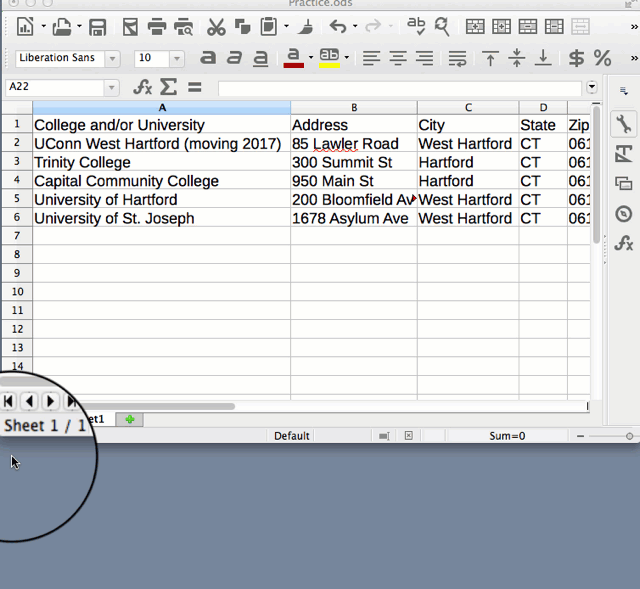

## Source Your Data Files {#source}
*last updated March 1, 2017*

Source your data. Spell out exactly where it came from, so that someone other than you, several years in the future, could understand its origin.

#### Label the file name {-}

Everyone has seen examples of bad file names:
  - data.xls
  - bldgdatalist.csv
  - data77.xls

Write a short but meaningful file name. If different versions of the data are floating around, add the current date at the end, in YYYY-MM-DD format, perhaps like this:
  - town-demographics-2016-03-08.xls

#### Save source data in separate sheet {-}

If you have doubts when cleaning up columns, click (or right-click) on the spreadsheet tab to copy the sheet to another tab as a backup, to avoid destroying any data.

Add a *source* tab, after the data, with notes to remind you and others about its origins and when it was last updated.

** TO DO **

Source your data
     - explain that data cannot be copyrighted, but representations of data can be
     - open-source and creative commons
     - credit sources and collaborators on dataviz products and readme files
     - Whose perspectives does your data privilege? Whose stories remain untold?
