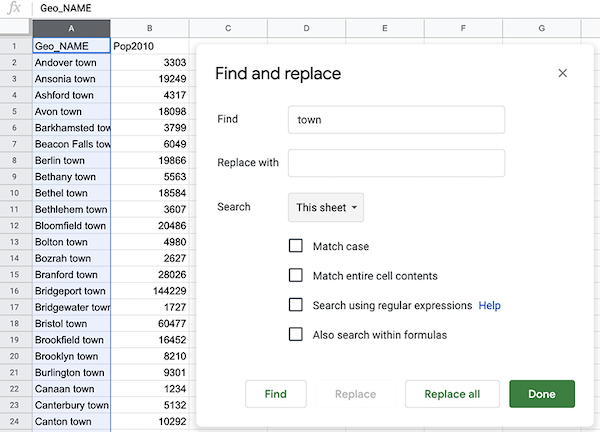
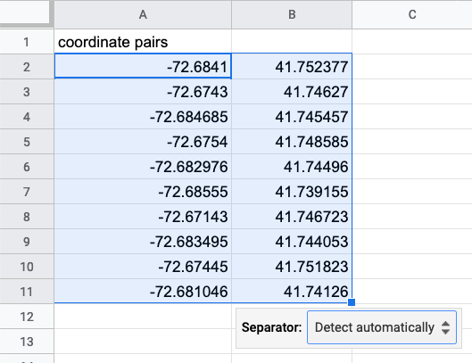
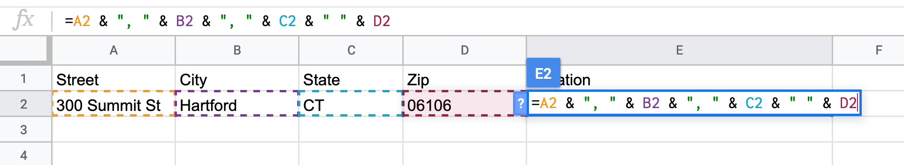
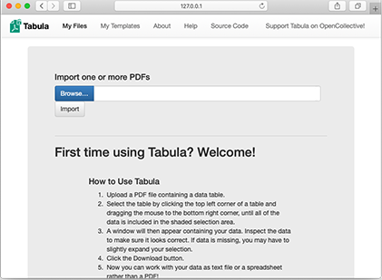
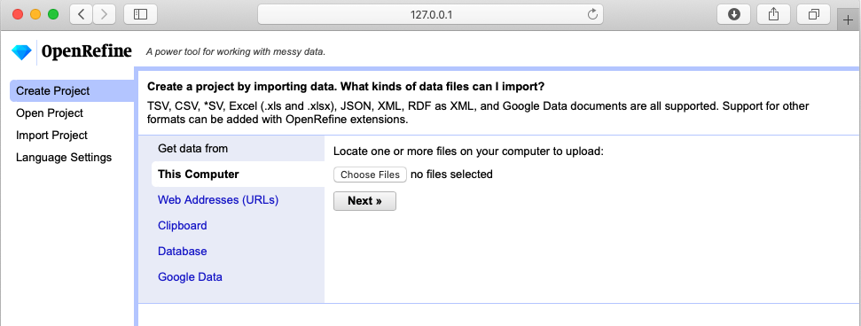
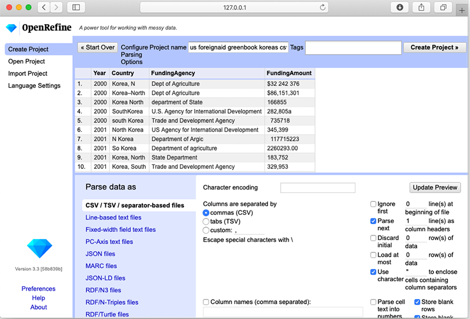
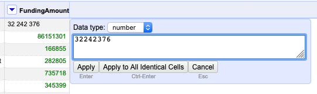
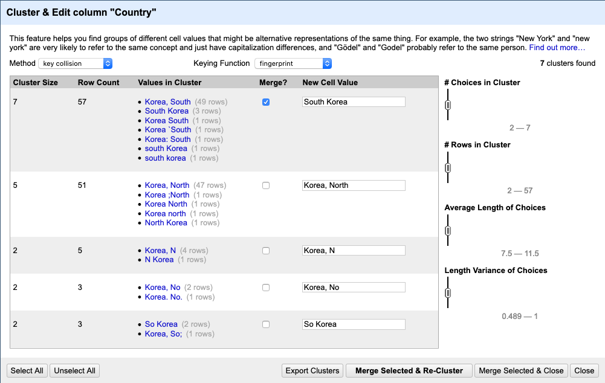

# Clean Up Messy Data {#clean}

More often than not, datasets will be messy and hard to visualize right away.
They will have missing values, various spelling of the same categories,
dates in different formats, text in numeric-only columns, multiple things in the same columns,
and other unexpected things (see Figure \@ref(fig:clean-up-messy-data) for inspiration).
Don't be surprised if you find yourself spending longer cleaning up data than
actually analyzing and visualizing it—it is often the case for data analysts.

(ref:clean-up-messy-data) More often than not, raw data looks like this.

```{r clean-up-messy-data, fig.cap="(ref:clean-up-messy-data)"}
knitr::include_graphics("images/04-clean/clean-up-messy-data.png")
```

It is important to learn several tools in order to know which one to use
to clean your data efficiently.
We will start by looking at fairly basic data cleanup using Google Sheets.
Keep in mind that the same principles (and in most cases
even the same formulas) can be use in Microsoft Excel, LibreOffice Calc, Mac's Numbers,
or other spreadsheet packages.

We will then show you how to extract table data from PDF documents using a free tool called Tabula.
Tabula is used by data journalists and researchers worldwide
to analyze government spendings, procurement records and all sorts of other datasets
that get trapped in PDFs.

At the end, we will introduce OpenRefine, an extremely powerful and versatile tool
to clean up the messiest spreadsheets, such as those containing dozens of misspelled versions
of universities or town names.

## Clean Data with Spreadsheets {- #clean-spreadsheets}

Let's take a look at some techniques to clean up data directly in your favorite
spreadsheet tool. We will use Google Sheets as an example, but the same principles
will apply to most other software packages, such as Excel, Calc, or Numbers.

#### Find and Replace with a blank {-}

A common problem with census data is that geographic names contain unnecessary words.
For example, your data can look something like that:

```
Hartford town
New Haven town
Stamford town
```

But you want a clean list of towns, either to display in a chart, or to merge with a different dataset:

```
Hartford
New Haven
Stamford
```

Here's one quick solution: In any spreadsheet tool, use the Find and Replace command to remove unwanted characters.
You can download our [sample file](data/find-replace-town-geonames.csv),
which contains 169 Connecticut towns and their population, for the exercise.

1. Select the column you want to modify by clicking on the column header. If you don't,
you will be searching and replacing in the entire spreadsheet.
2. From *Edit* menu, choose *Find and replace* item. You will see the window like is shown in Figure \@ref(fig:sheets-find-replace).
3. In the *Find* field, type ` town`, without quotation marks and leaving a space before the word. If you don't leave the space,
you will accidentally remove *town* from *Newtown*, and you will end up with trailing spaces which can cause troubles in the future.
4. Leave the *Replace with* field blank.
5. *Search* field should be set to the range you selected in step 1, or *All sheets* if you didn't
select anything.
6. You have the option to *match case*. If checked, `town` and `Town` and `tOwN` will be treated differently.
For our purpose, you can leave *match case* unchecked.
7. Press the *Replace all* button. Since this sample file contains 169 towns, the window
will state that 169 instances of "town" have been replaced.

(ref:sheets-find-replace) Find and Replace window in Google Sheets.

```{r sheets-find-replace, fig.cap="(ref:sheets-find-replace)"}

```

#### Split data into two or more columns {-}

Sometimes multiple pieces of data appear in a single cell,
such as names (`John Doe`), coordinate pairs (`40.12,-72.12`),
or addresses (`300 Summit St, Hartford, CT, 06106`). For your analysis,
you might want to split them into separate entities, so that your *FullName*
column (with `John Doe` in it) becomes *FirstName* (`John`) and *LastName* (`Doe`) columns,
coordinates become *Latitude* and *Longitude* columns, and your *FullAddress* column becomes
4 columns, *Street*, *City*, *State*, and *Zip* (postcode).

##### Example 1 {-}

Let's begin with a simple example of coordinate pairs. You can use our
[sample file](data/split-coordinate-pairs.csv),
which is a collection of latitude-longitude pairs separated by a comma,
with each pair on a new line.

1. Select the data you wish to split, either the full column or just several rows.
Note that you can only split data from one column at a time.
2. Make sure there is no data in the column to the right of the one you're splitting, because
all data there will be written over.
3. Go to *Data* and select *Split text to columns*, as in Figure \@ref(fig:sheets-split).
4. Google Sheets will try to guess your separator automatically. You will see that your coordinates
are now split with the comma, and the Separator is set to *Detect automatically* in the dropdown.
You can manually change it to a comma (`,`), a semicolon (`;`), a period (`.`), a space character,
or any other custom character (or even a sequence of characters — more about that in Example 2 of this section).
5. You can rename columns into *Longitude* (first number) and *Latitude* (second number).

(ref:sheets-split) Select Data > Split text to columns to automatically separate data.

```{r sheets-split, fig.cap="(ref:sheets-split)"}

```

##### Example 2 {-}

Now, let's look at a slightly more complicated example.
Imagine your dataset is structured as follows:

```
| Location                           |
| 300 Summit St, Hartford CT--06106  |
| 1012 Broad St, Hartford CT--06106  |
| 37 Alden St, Hartford CT--06114    |
```

Each cell contains a full address, but you want to split it into four cells:
street address (300 Summit St), city (Hartford), state (CT), and zipcode (06106).
Notice that the separator between the street and the rest of the address is a comma,
a separator between the city and state is a space, and there are two dash
lines between state and zipcode.

1. Start splitting left to right. So your first separator will be a comma.
Select your column (or one or more cells within that column), and go to *Data* > *Split text to columns*.
2. Google Sheets should automatically split your cell into two parts, `300 Summit St` and `Hartford CT--06106`,
using comma as a separator. (If it didn't, just select *Comma* from the dropdown menu that appeared).
3. Now, select only the second column and perform *Split text to columns*. You will see that the city
is now separate from the state and zipcode, and Google Sheets chose space as a separator (if it didn't, choose *Space* from the dropdown menu).
4. Next, select only the third column and perform *Split text to columns* again. Google Sheets won't recognize `--`
as a separator, so you will have to manually select *Custom*, type `--` in the text field,
and hit Enter. You should now have four columns.

Tip: Google Sheets will treat zipcodes as numbers and will delete leading zeros (so 06106 will become 6106).
To fix that, select the column, and go to *Format > Number > Plain text*. Now you can manually re-add zeros.
If your dataset is large, consider concatenating 0s using the formula introduced in [Combine separate columns into one](#combine-separate-columns-into-one).

#### Combine separate columns into one {-}

Now, let's see how to perform the reverse action.
Imagine you receive address data in separate columns, formatted like this:

```
| Street        | City        | State      | Zip        |
| 300 Summit St | Hartford    | CT         | 06106      |
```

The data comes is four columns: street address, city, state, and zipcode.
Let's say your mapping tool requires you to combine all of this terms into
one location column, like that:

```
| Location                            |
| 300 Summit St, Hartford, CT 06106   |
```

You can write a simple formula to combine (or concatenate) terms
using ampersands (`&`) as cells values connectors,
and quoted spaces (`" "`), or spaces with commas (`", "`),
or a dash with spaces on both sides (`" - "`), or anything
else as term separators.

For example, imagine that a spreadsheet contains an address that is separated into four columns---*Address, City, State,* and *Zip*---as shown in columns A-D in Figure \@ref(fig:sheets-combine). In column E, you can add new header named *Location* and insert a formula in this format, to combine the items using ampersands (`&`) and separating them with quoted spaces (`" "`), like this: `=A2&" "&B2&" "&C2&" "&D2`

(ref:sheets-combine) Use ampersands to combine items and separate them with spaces.

```{r sheets-combine, fig.cap="(ref:sheets-combine)"}
 
```

You are now able to split data to columns using custom separators, and
concatenate values from different cells into one. But what if your table is trapped
inside a PDF? In the next section, we will introduce Tabula and show you how to
convert tables from PDF documents into tables that you can analyze in Google Sheets,
Microsoft Excel, or similar packages.

## Extract Tables from PDFs with Tabula {- #tabula}

It sometimes happens that the dataset you are interested in is only available as a PDF document.
Don't despair, you can *likely* use Tabula to extract tables and save them as CSV files.

Tabula is a free tool that runs on Java, and is available for Mac, Windows, and Linux computers. It runs on your
local machine and does not send your data to the cloud, so you can also use it for sensitive documents.

Note: Keep in mind that PDFs generally come in two flavors, image-based and text-based.
You know your PDF is text-based if you can use cursor to select and copy-paste text. These are great for Tabula.
Image-based PDFs are those that were created from scanning documents. Before they can be processed with Tabula,
you will need to use an optical character recognition (OCR) software, such as Adobe Acrobat,
to create a text-based PDF.

### Set Up Tabula {-}

[Download the newest version of Tabula](https://tabula.technology/).
You can use download buttons on the left-hand side, or scroll down to the *Download & Install Tabula*
section to download a copy for your platform.

Unlike most other programs, Tabula does not require installation. Just unzip the downloaded archive,
and double-click the icon. If prompted with a security message (such as
"Tabula is an app downloaded from the internet. Are you sure you want to open it?"),
follow the instruction to proceed (on a Mac, click *Open*; you might have to go to
System Preferences > Security & Privacy, and resolve the issue there).

Your default system browser should open, like shown in Figure \@ref(fig:tabula-welcome).
The URL will be something like `http://127.0.0.1:8080/`, meaning Tabula is running on your local machine.
127.0.0.1, also known as `localhost`, is the hostname for your machine. `8080` is called port
(it's okay if you see a different port—most likely because 8080 was taken by some other
program running on your computer). If for any reason you decide to use a different browser,
just copy-paste the URL.

(ref:tabula-welcome) Tabula welcome page.

```{r tabula-welcome, fig.cap="(ref:tabula-welcome)"}

```

### Load a PDF and Autodetect Tables {-}
Since the beginning of the Covid-19 pandemic, the Department of Public Health in Connecticut
has been issuing daily PDFs with case and death count by town.
For the demonstration, we will use [one of those PDFs](data/ct-dph-covid-2020-05-31.pdf)
from May 31, 2020.

1. Select the PDF you want to extract data from by clicking the blue *Browse...* button.
2. Click *Import*. Tabula will begin analyzing the file.
3. As soon as Tabula finishes loading the PDF, you will see a PDF viewer with individual pages. The interface is fairly clean, with only four buttons in the header.
4. The easiest first step is to let Tabula autodetect tables. Click the relevant button in the header.
You will see that each table is highlighted in red, like shown in Figure \@ref(fig:tabula-autodetect).

(ref:tabula-autodetect) Selected tables are highlighted in red.

```{r tabula-autodetect, fig.cap="(ref:tabula-autodetect)"}
knitr::include_graphics("images/04-clean/tabula-autodetect.png")
```

### Manually Adjust Selections and Export {-}

1. Click *Preview & Export Extracted Data* green button to see how Tabula thinks the data should be exported.
2. If the preview tables don't contain the data you want, try switching between *Stream* and *Lattice* extraction methods in the left-hand-side bar.
3. If the tables still don't look right, or you with to remove some tables that Tabula auto-detected, hit *Revise selection* button.
That will bring you back to the PDF viewer.
4. Now you can *Clear All Selections* and manually select
tables of interest. Use drag-and-drop movements to select tables of interest (or parts of tables).
5. If you want to "copy" selection to some or all pages, you can use *Repeat this Selection* dropdown, which appears
in the lower-right corner of your selections, to propagate changes. This is extremely useful if your PDF consists of
many similarly-formatted pages.
6. Once you are happy with the result, you can export it. If you have only one table, we recommend using CSV as export format.
If you have more than one table, consider switching export format to *zip of CSVs*.
This way each table will be saved as an individual file, rather than all tables inside one CSV file.

Once you exported your data, you can find it in a Downloads folder on your computer (or wherever you chose to save it).
It is ready to be opened in Google Sheets or Microsoft Excel, analyzed, and visualized!
In the following section, we are going to look how to clean up messy datasets with OpenRefine.


## Clean Data with OpenRefine {- #open-refine}

Consider a dataset that looks like the one in Figure \@ref(fig:openrefine-dataset).
Can you spot any problems with it?

(ref:openrefine-dataset) First 20 rows of the sample dataset. Can you spot any problems with it?

```{r openrefine-dataset, fig.cap="(ref:openrefine-dataset)"}
knitr::include_graphics("images/04-clean/openrefine-dataset.png")
```

Notice how the funding amounts (last column)
are not standardized. Some amounts have commas as thousands separators,
some have spaces, and some start with a dollar character.
Notice also how the Country column includes various spellings of North and South Korea.
Datasets like this can be an absolute nightmare to analyze. Luckily,
OpenRefine provides powerful tools to clean up and standardize such data.

Note: This data exerpt is from [US Overseas Loans and Grants (Greenbook) dataset](https://catalog.data.gov/dataset/u-s-overseas-loans-and-grants-greenbook),
which shows US economic and military assistance to various countries.
We chose to only include assistance to South Korea and North Korea for the years between 2000 and 2018.
We added deliberate misspellings and formatting issues for demonstration purposes
(although we did not alter values).

Download this [sample dataset](data/us-foreignaid-greenbook-koreas.csv)
or use your own file with messy data.
Inspect the file in any spreadsheet software. You can see that the dataset has four columns:
year (between 2000 and 2018, inclusive), country (North or South Korea),
a US funding agency, and funding amount (in 2018 US dollars).
Let's now use OpenRefine to clean it up.

### Set up OpenRefine {-}

You can download a copy of OpenRefine for Linux, Mac, or Windows from the [official
download page](https://openrefine.org/download.html). Just like Tabula, it runs in your browser and no
data leaves your local machine, which is great for confidentiality.

If you work on a **Mac**, the downloaded file will be a .dmg file. You will likely encounter
a security message that will prevent OpenRefine from launching. Go to System Preferences -> Security and Privacy, and
hit *Open Anyway* button in the lower half of the window. If prompted with another window, click *Open*.

If you use **Windows**, unzip the downloaded file. Double-click the .exe file, and OpenRefine should
open in your default browser.

Once launched, you should see OpenRefine in your browser with `127.0.0.1:3333` address (localhost, port 3333),
like shown in Figure \@ref(fig:openrefine-welcome).

(ref:openrefine-welcome) OpenRefine starting page.

```{r openrefine-welcome, fig.cap="(ref:openrefine-welcome)"}

```

### Load Data and Start a New Project {-}

To begin cleaning up your messy dataset, you should load it into a new project.
OpenRefine lets you upload a dataset from your local machine,
or a remote URL on the web (including a Google Spreadsheet), or copy/paste data into a text field.
OpenRefine is able to extract data directly from SQL databases, but this is beyond the scope of this book.
We assume that you downloaded the sample dataset we provided (or you are using your own file),
so let's load it from your computer.

1. Under *Get data from: This computer*, click *Browse...* and select the file. Click Next.
2. Before you can start cleaning up data, OpenRefine allows you to make sure data is **parsed** properly.
In our case, parsing means the way the data is split into columns.
Make sure OpenRefine assigned values to the right columns,
or change setting in *Parse data as* block at the bottom of the page until it starts looking meaningful,
like shown in Figure \@ref(fig:openrefine-parse).
3. Hit *Create Project* in the upper-right corner.

(ref:openrefine-parse) OpenRefine parsing options.

```{r openrefine-parse, fig.cap="(ref:openrefine-parse)"}

```

Now when you've successfully read the data into a new project, let's start
the fun part: converting text into numbers, removing unnecessary characters,
and fixing the spellings for North and South Koreas.

### Convert Dollar Amounts from Text to Numbers {-}

Once your project is created, you will see the first 10 rows of the dataset.
You can change it to 5, 10, 25, or 50
by clicking the appropriate number in the header

Each column header has its own menu (callable by clicking the arrow-down button).
Left-aligned numbers in a column are likely represented as text
(as is the case with FundingAmount column in our example), and they need to be transformed
into numeric format.

1. To transform text into numbers, open the column menu, and go to *Edit cells* > *Common transforms* > *To number*.
2. You will see that some numbers became green and right-aligned (success!), but most did not change.
That is because dollar sign (`$`) and commas (`,`) confuse OpenRefine and prevent values to be converted into numbers.
3. Let's remove `$` and `,` from the FundingAmount column. In the column menu, choose *Edit cells* >
*Transform*. In the Expression window, type `value.replace(',', '')` and notice how commas
disappear in the preview window. When you confirm your formula works, click *OK*.
4. Now, repeat the previous step, but instead of a comma, remove the `$` character.
(Your expression will become `value.replace('$', '')`).
5. Perform Step 1 again.
You will see that all but three
cells turned green. That is because we have spaces and an `a` character at the end of one number.
Fix those manually by hovering over cells, and clicking the `edit` button
(in the new popup window, make sure to change *Data type* to *number*, and hit *Apply*,
like in Figure \@ref(fig:openrefine-manual-edit)).

(ref:openrefine-manual-edit) Manually remove spaces and extra characters, and change data type to number.

```{r openrefine-manual-edit, fig.cap="(ref:openrefine-manual-edit)"}

```

At this point, all funding amounts should be clean numbers, right-aligned and colored in green.
We're ready to move on to the Country column and fix different spellings of Koreas.


### Cluster Similar Spellings {-}

When you combine different data sources, or process survey data where respondents
wrote down their answers as opposed to selecting them from a dropdown menu, you might end up
with multiple spellings of the same word (town name, education level – you name it!).
One of the most powerful features of OpenRefine is the ability to cluster similar responses.

If you use our original sample file, take a look at the *Country* column and
all variations of North and South Korea spellings.
From *Country* column's dropdown menu, go to *Facet* > *Text facet*. This will open up a window
in the left-hand side with all spellings (and counts) of column values. 26 choices for a column
that should have just two distinct values, North Korea and South Korea!

1. To begin standardizing spellings, click on the arrow-down button of Country column header,
and choose *Edit cells* > *Cluster and edit*. You will see a window like the one shown in Figure
\@ref(fig:openrefine-cluster).
2. You will have a choice of two clustering methods, *key collision* or *nearest neighbor*. Both
methods can be powered by different functions, but let's leave the default *key collision* with *fingerprint* function.
3. OpenRefine will calculate a list of clusters. *Values in Cluster* column contains grouped spellings
that OpenRefine considers the same. If you agree with a grouping, check the *Merge?* box, and assign
the "true" value to the *New Cell Value* input box. In our example, this would be either `North Korea` or `South Korea`.
4. You can go through all groupings, **or** stop after one or two and click **Merge Selected & Re-Cluster** button.
The clusters you chose to merge will be merged, and grouping will be re-calculated
(don't worry, the window won't go anywhere). Keep regrouping until you are happy with the result.

Spend some time playing with *Keying function* parameters, and notice
how they produce clusters of different sizes and accuracy.

(ref:openrefine-cluster) Cluster similar text values.

```{r openrefine-cluster, fig.cap="(ref:openrefine-cluster)"}

```

### Export {-}

Once you are done cleaning up and clustering data, save the clean dataset
by clicking *Export* button in the upper-right corner of OpenRefine window.
You can choose your format (we recommend CSV, or comma-separated value).
Now you have a clean dataset that is ready to be processed and visualized.

### Summary {- #summary4}

In this chapter, we looked at cleaning up tables in Google Sheets,
liberating tabular data trapped in PDFs
using Tabula, and using OpenRefine to clean up very messy datasets.
You will often find yourself using several of these tools on the same dataset
before it becomes good enough for your analysis. We encourage you to
learn more formulas in Google Sheets, and explore extra functionality of OpenRefine
in your spare time.

You now know how to clean up your data, so let's proceed to visualizing it.
In the following chapter, we will introduce you to a range of free data visualization
tools that you can use to build interactive charts and embed them in your website.
