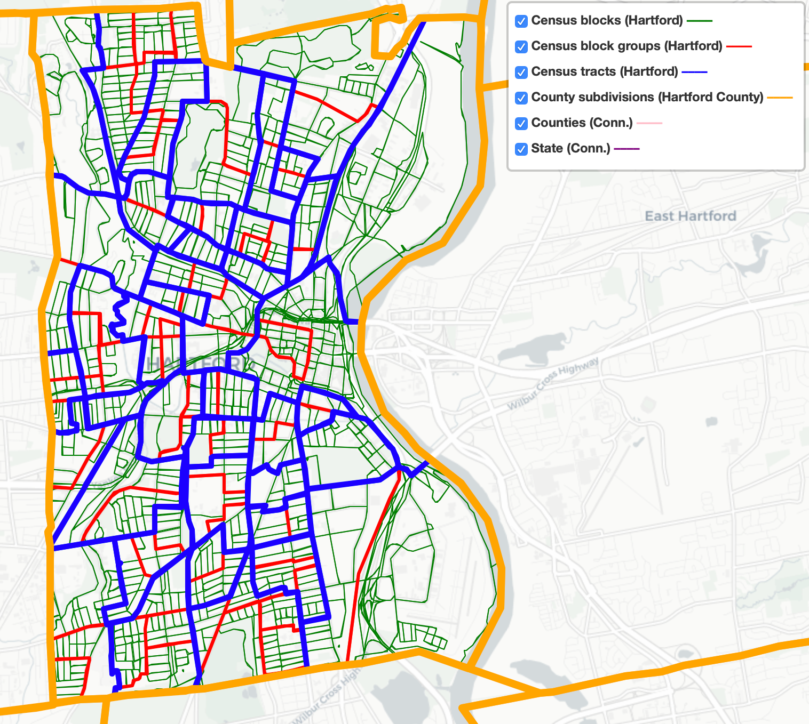

# Find and Question Your Data {#find}
In the early stages of a visualization project, we often start with two interrelated issues: *Where can I find reliable data?*, and after you find something, *What does this data truly represent?* If you leap too quickly into constructing charts and maps without thinking deeply about these dual issues, you run the risk of creating meaningless, or perhaps worse, misleading visualizations. This chapter breaks down both of these broad issues by providing concrete strategies to [guide your search](guiding.html), understand debates about [public and private data](public.html), [mask or aggregate sensitive data](mask-aggregate.html), navigate a growing number of [open data repositories](opendata.html), [source your data origins](source.html), and [recognize bad data](bad-data.html). Finally, once you've found some files, we propose some ways to [question and acknowledge the limitations of your data](question.html).

Information does not magically appear out of thin air. Instead, people collect and publish data, with explicit or implicit purposes, within the social contexts and power structures of their times. As data visualization advocates, we strongly favor evidence-based reasoning over less-informed alternatives. But we caution against embracing so-called data objectivity, since numbers and other forms of data are *not* neutral. Therefore, when working with data, pause to inquire more deeply about *Whose stories are told?* and *Whose perspectives remain unspoken?* Only by asking these types of questions, according to *[Data Feminism](https://data-feminism.mitpress.mit.edu/)* authors Catherine D'Ignazio and Lauren Klein, will we "start to see how privilege is baked into our data practices and our data products."[@dignazioDataFeminism2020]

## Guiding Questions for Your Search {- #guiding}
For many people, a data search is simply googling some keywords on the web. Sometimes that works, sometimes not. When that approach flounders, we reflect on the many lessons we've learned about data-hunting while working alongside talented librarians, journalists, and researchers. Collectively, they taught us a set of guiding questions that outline a more thoughtful process about *how to search* for data:

*What exactly is the question you're seeking to answer with data?*

Literally write it down---in the form of a question, punctuated with a question mark at the end---to clarify your own thinking, and also so that you can clearly communicate it to others who can assist you. All too often, our brains automatically leap ahead to try to identify the *answer*, without reflecting on the best way frame the *question* in a way that does not limit the range of possible outcomes.

Look back at data visualization projects that made a lasting impression on you to identify the underlying question that motivated them. In their coverage of the US opioid epidemic, the *Washington Post* and the West Virginia *Charleston Gazette-Mail* successfully fought a legal battle to obtain a US Drug Enforcement Agency database that the federal government and the drug industry sought to keep secret. In 2019, a team of data journalists published the database with interactive maps to answer one of their central questions: *How many prescription opioid pills were sent to each US county, per capita, and which companies and distributors were responsible?* Their [maps revealed](https://www.washingtonpost.com/graphics/2019/investigations/dea-pain-pill-database/) high clusters in several rural Appalachian counties that received over 150 opioid pills per resident, on average, each year from 2006 to 2014. Moreover, only six companies distributed over three-quarters of the 100 billion oxycodone and hydrocodone pills across the US during this period: McKesson Corp., Walgreens, Cardinal Health, AmerisourceBergen, CVS and Walmart.^[@DrillingDEAPain2019] Even if you're not working with data as large or as controversial as this one, the broader lesson is to clearly identify the question you're seeking to answer.

Also, it's perfectly normal to revise your question as your research evolves. For example, Jack and his students once began a data project by naively asking *What were Connecticut public school test scores in the 1960s?* Soon we discovered that standardized state-level school testing as we know it today did not appear in states like Connecticut until the mid-1980s school accountability movement. Even then, results were not widely visible to the public until newspapers began to publish them once a year in print in the 1990s. Later, real estate firms, school-ratings companies, and government agencies began to publish data continuously on the web as the Internet expanded in the late 1990s and early 2000s. Based on what we learned, we revised our research question to *When and how did Connecticut homebuyers start to become aware of school test scores, and how did these influence the prices they were willing to pay for access to selected public school attendance areas?*[@doughertySchoolChoiceSuburbia2009] Be prepared to refine your question when the evidence leads you in a better direction.

*What types of organizations may have collected or published the data you seek?*

If a governmental organization may have been involved, then at what level: local, regional, state/provincial, national, or international? Which branch of government: executive, legislative, judicial? Or which particular governmental agency might have been responsible for compiling or distributing this information? Since all of these different structures can be overwhelming, reach out to librarians who are trained to work with government documents and databases, often at [state government libraries](https://libguides.ala.org/mailing-lists), or at local institutions participating in the [US Federal Depository Library Program](https://www.doi.gov/library/collections/federal-documents). Or might the data you seek have been compiled by a non-governmental organization, such as academic institutions, journalists, non-profit groups, or for-profit corporations? Figuring out *which organizations* might have collected and published the data can help point you to the digital or print materials they typically publish, and most appropriate tools to focus your search in that particular area.

*What level(s) of data are available?*

Is information disaggregated into individual cases or aggregated into larger groups? Smaller units of data allow you to make more granular interpretations, while larger units can help you to identify broader patterns. Librarians can help us to decipher how and why organizations publish data at different levels. For example, the US Census collects data every ten years about each person residing in the nation. Under law, individual-level data about each person is confidential for 72 years, then released to the public. Currently, you can search for specific individuals in the 1940 Census and earlier decades at the [US National Archives](https://www.archives.gov/research/genealogy/census/about) and other websites, as shown in Figure \@ref(fig:census-1940-excerpt).

(ref:census-1940-excerpt) Excerpt of individual-level 1940 US Census data for co-author Dougherty's father's family.

```{r census-1940-excerpt, out.width=350, fig.cap="(ref:census-1940-excerpt)"}
 knitr::include_graphics("images/04-find/census-1940-excerpt.png")
```

Meanwhile, the US Census publishes data for current years by aggregating individual records into larger geographic areas to protect people's privacy. Using the [Standard Hierarchy of US Census Geographic Entities](https://www2.census.gov/geo/pdfs/reference/geodiagram.pdf), we created a simplified map in Figure \@ref(fig:census-divisions-hartford) to show the relationships between some of the most common geographic areas for Hartford, Connecticut:

- State
- County
- County subdivisions (equivalent to Connecticut towns and cities)
- Census tracts (designated areas, roughly 2,500 to 8,000 people)
- Block groups (sub-unit of tracts, roughly 600 to 3,000 people)
- Census blocks (sub-unit of block groups, but not always a city block)

(ref:census-divisions-hartford) Common US census geographies around Hartford, Connecticut, 2019. Zoom out in the [interactive version](https://handsondataviz.github.io/census-divisions-hartford/) for county and state boundaries.

```{r census-divisions-hartford, fig.cap="(ref:census-divisions-hartford)"}
if(knitr::is_html_output(excludes="markdown")) knitr::include_url("https://handsondataviz.github.io/census-divisions-hartford/", height = "700px") else 
```

*Have prior publications drawn on similar data, and if so, how can we trace their sources?*

Some of our best ideas began when reading an article or book that described its source of evidence, and we imagined new ways to visualize that data. Several times we have stumbled across a data table in a print publication, or perhaps an old web page, which sparked our interest in tracking down a newer version to explore. Even *outdated* data helps by demonstrating how someone previously collected it at one point in time. Follow the footnotes to track down its origins. Use [Google Scholar](https://google.com/scholar) and more specialized research databases (ask librarians for assistance if needed) to track down the source of previously-published data. One bonus is that if you can locate more current data, you may be able to design a visualization that compares change over time.

*What if no one has collected the data you're looking for?*

Sometimes this happens due to more than a simple oversight. In *[Data Feminism](https://data-feminism.mitpress.mit.edu/)*, Catherine D'Ignazio and Lauren Klein underscore how issues of data collection "are directly connected to larger issues of power and privilege" by recounting a story about tennis star Serena Williams. When Williams experienced life-threatening complications while giving birth to her daughter in 2017, she called public attention to the way that she, a Black woman, needed to advocate for herself in the hospital. After her experience, she wrote on social media that "Black women are over 3 times more likely than white women to die from pregnancy- or childbirth-related causes," citing the US Centers for Disease Control and Prevention (CDC). When journalists followed up to investigate further, they discovered the absence of detailed data on maternal mortality, and what a 2014 United Nations report described as a "particularly weak" aspect of data collection in the US healthcare system. Journalists reported that "there was still no national system for tracking complications sustained in pregnancy and childbirth," despite comparable systems for other health issues such as heart attacks or hip replacements. Power structures are designed to count people whose lives are highly valued, or under a high degree of surveillance. D'Ignazio and Klein call on us to critically examine these power systems, collect data to counter their effects, and make everyone's labor in this process more visible.[@dignazioDataFeminism2020, chapter 1] If no one has collected the data you're looking for, perhaps you can make valuable steps to publicly recognize the issue, and possibly gather it yourself.

Hunting for data involves much more than googling keywords. Deepen your search by reflecting on the types of questions that librarians, journalists, and other researchers have taught us to ask: What types of organizations might---or might not---have collected the data? At what levels? At any prior point in time? And under what social and political contexts? In the next section, you'll learn more about related issues to consider over public and private data.

## Public and Private Data {- #public}
When searching for data, you also need to be informed about debates regarding public and private data. Not only do these debates influence the kinds of data you might be able to legally use in your visualizations, but they also raise deeper ethical issues about the extent to which anyone should be able to collect or circulate private information about individuals. This section offers our general observations on these debates, based primarily on our context in the United States. Since we are not lawyers (thank goodness!), please consult with legal experts for advice about your specific case if needed.

The first debate asks: *To what extent should anyone be allowed to collect data about private individuals?* Several critics of "big data" worry that governments are becoming more like a totalitarian "Big Brother" as they collect more data about individual citizens in the digital age. In the United States, concerns mounted in 2013 when whistleblower Edward Snowden disclosed how the National Security Agency conducted global surveillance using US citizen email and phone records provided by telecommunications companies. Shoshana Zuboff, a Harvard Business School professor and author of *The Age of Surveillance Capitalism*, warns of an equal threat posed by corporations that collect and commodify massive amounts of individually-identifiable data for profit.[@zuboffAgeSurveillanceCapitalism2019] Due to the rise of digital commerce, powerful technology companies own data that you and others consider to be private:

- Google knows what words you typed into their search engine, as shown in aggregated form in [Google Trends](https://trends.google.com/trends/). Also, Google's Chrome browser tracks your web activity through cookies, as [described by *Washington Post* technology reporter Geoffrey Fowler](https://www.washingtonpost.com/technology/2019/06/21/google-chrome-has-become-surveillance-software-its-time-switch/).^[@fowlerGoodbyeChromeGoogle2019]
- Amazon eavesdrops and records your conversations around its Alexa home assistants, as [Fowler also documents](https://www.washingtonpost.com/technology/2019/05/06/alexa-has-been-eavesdropping-you-this-whole-time/).^[@fowlerAlexaHasBeen2019]
- Facebook follows which friends and political causes you favor, and [Fowler also reports](https://www.washingtonpost.com/technology/2020/01/28/off-facebook-activity-page/) how it tracks your off-Facebook activity, such as purchases made at other businesses, to improve its targeted advertising.^[@fowlerFacebookWillNow2020]

Some point out that "big data" collected by large corporations can offer public benefits. For example, [Apple shared its aggregated mobility data](https://covid19.apple.com/mobility) collected from iPhone users to help public health officials compare which populations stayed home rather than travel during the Covid pandemic. But others point out that corporations are largely setting their own terms for how they collect data and what they can do with it. Although California has begun to [implement its Consumer Privacy Act in 2020](https://www.washingtonpost.com/technology/2020/01/21/ccpa-transparency/), which promises to allow individuals the right to review and delete the data that companies collect about them, US state and federal government has not fully entered this policy arena. If you work with data that was collected from individuals by public or private organizations, learn about these controversies to help you make wise and ethical choices on what to include in your visualizations.

The second question is: *When our government collects data, to what extent should it be publicly available?* In the United States, the 1966 [Freedom of Information Act](https://en.wikipedia.org/wiki/Freedom_of_Information_Act) and its subsequent amendments have sought to open access to information in the federal government, with the view that increased transparency would promote public scrutiny and pressure on officials to make positive changes. In addition, state governments operate under their own freedom of information laws, sometimes called "open records" or "sunshine laws." When people say they've submitted a "FOI," it means they've sent a written request to a government agency for information that they believe should be public under the law. But federal and state FOIA laws are complex, and courts have interpreted cases in different ways over time, as summarized in the [Open Government Guide](https://www.rcfp.org/open-government-guide/) by the Reporters Committee for Freedom of the Press, and also by the [National Freedom of Information Coalition](https://www.nfoic.org/). Sometimes government agencies quickly agree and comply with a FOI request, while other times they may delay or reject it, which may pressure the requester to attempt to resolve the issue through time-consuming litigation. Around the world, [over 100 nations have their own version of freedom of information laws](https://en.wikipedia.org/wiki/Freedom_of_information_laws_by_country), with the oldest being Sweden's 1766 Freedom of the Press Act, but these laws vary widely.

In most cases, individual-level data collected by US federal and state governments is considered private, except in cases where our governmental process has determined that a broader interest is served by making it public. To illustrate this distinction, let's begin with two cases where US federal law protects the privacy of individual-level data:

- Patient-level health data is generally protected under the [Privacy Rule of the Health Insurance Portability and Accountability Act](https://en.wikipedia.org/wiki/Health_Insurance_Portability_and_Accountability_Act#Privacy_Rule), commonly known as HIPAA. In order for public health officials to track broad trends about illness in the population, individual patient data must be aggregated into larger anonymized datasets in ways that protect specific people's confidentiality.

- Similarly, student-level education data is generally protected under the [Family Educational Rights and Privacy Act](https://en.wikipedia.org/wiki/Family_Educational_Rights_and_Privacy_Act), commonly known as FERPA. Public education officials regularly aggregate individual student records into larger anonymized public datasets to track the broad progress of schools, districts, and states, without revealing individually-identifiable data.

On the other hand, here are three cases where government has ruled that the public interest is served by making individual-level data widely available:

- Individual contributions to political candidates are public information in the [US Federal Election Commission database](https://www.fec.gov/data/receipts/individual-contributions/), and related databases by non-profit organizations, such as [Follow The Money](https://www.followthemoney.org/) by the National Institute on Money in Politics and [Open Secrets](http://www.opensecrets.org/) by the Center for Responsive Politics. The latter two sites describe more details about donations submitted through political action committees and controversial exceptions to campaign finance laws. Across the US, state-level political contribution laws vary widely, and these public records are stored in separate databases. For example, anyone can search the [Connecticut Campaign Reporting Information System](https://seec.ct.gov/Portal/eCRIS/eCrisSearch) to find donations made by the first author to state-level political campaigns.

- Individual property ownership records are public, and increasingly hosted online by many local governments. A privately-funded company compiled this [US public records directory](https://publicrecords.netronline.com/) with links to county and municipal property records, where available. For example, anyone can search the [property assessment database for the Town of West Hartford, Connecticut](http://gis.vgsi.com/westhartfordct/) to find property owned by the first author, its square footage, and purchase price.

- Individual salaries for officers of tax-exempt organizations are public, which they are required to file on Internal Revenue Service (IRS) 990 forms each year. For example, anyone can search 990 forms on ProPublica's [Nonprofit Explorer](https://projects.propublica.org/nonprofits), and view the salary and other compensation of the top officers of the first author's employer and the second author's alma mater, Trinity College in Hartford, Connecticut.

Social and political pressures are continually changing the boundary over what types of individual-level data collected by government should be made publicly available. For example, the Black Lives Matter movement has gradually made more individual-level data about violence by police officers more widely available. For example, in 2001 the State of New Jersey required local police departments to document any "use of force" by officers, whether minor or major, such as firing their gun. But no one could easily search these paper forms until a team of journalists from NJ Advance Media submitted over 500 public records requests and compiled [The Force Report digital database](https://force.nj.com/), where anyone can look up individual officers and investigate patterns of violent behavior. Similarly, a team of ProPublica journalists created [The NYPD Files database](https://projects.propublica.org/nypd-ccrb/), which now allows anyone to search closed cases of civilian complaints against New York City police officers, by name or precinct, for patterns of substantiated allegations.

Everyone who works with data needs to get informed about key debates over what should be public or private, become active in policy discussions about whose interests are being served, and contribute to making positive change. In the next section, you'll learn about ethical choices you'll need to make when working with sensitive individual-level data.

## Mask or Aggregate Sensitive Data {- #mask-aggregate}

Even if individual-level data is legally and publicly accessible, each of us is responsible for making ethical decisions about if and how to use it when creating data visualizations. When working with sensitive data, some ethical questions to ask are: *What are the risks that publicly sharing individual-level data might cause more harm than good?* and *Is there a way to tell the same data story without publicly sharing details that may intrude on individual privacy?* There are no simple answers to these ethical questions, since every situation is different and requires weighing the risks of individual harm versus the benefits of broader knowledge about vital public issues. But this section clarifies some of the alternatives to blindly redistributing sensitive information, such as masking and aggregating individual-level data.

Imagine that you're exploring crime data and wish to create an interactive map about the frequency of different types of 911 police calls across several neighborhoods. If you search for [public data about police calls](http://www.opendatanetwork.com/search?q=police), as described in the [Open Data section in this chapter](open-data.html), you'll see different policies and practices for sharing individual-level data published by police call centers. In many US states, information about victims of sexual crimes or child abuse (such as the address where police were sent) is considered confidential and exempt from public release, so it's not included in the open data. But some police departments publish open data about calls with the full address for other types of crimes, in a format like this:

```
| Date | Full Address | Category |
| Jan 1 | 1234 Main St | Aggravated Assault |
```

While this information is publicly available, it's possible that you could cause some type of physical or emotional harm to the victims by redistributing detailed information about a violent crime with their full address in your data visualization.

One alternative is to *mask* details in sensitive data. For example, some police departments hide the last few digits of street addresses in their open data reports to protect individual privacy, while still showing the general location, in a format like this:

```
| Date | Masked Address | Category |
| Jan 1 | 1XXX Main St | Aggravated Assault |
```

You can also mask individual-level data when appropriate, using methods similar to the Find and Replace method with your spreadsheet tool as in [Chapter 5: Clean Up Messy Data](clean.html).

Another strategy is to *aggregate* individual-level data into larger groups, which can protect privacy while showing broader patterns. In the example above, if you're exploring crime data across different neighborhoods, grouping individual 911 calls into larger geographic areas, such as census tracts or area names, in a format like this:

```
| Neighborhood | Crime Category | Frequency |
| East Side | Aggravated Assault | 13 |
| West Side | Aggravated Assault | 21 |
```

Aggregating individual-level details into larger, yet meaningful categories, is also a better way to tell data stories about the bigger picture. To aggregate simple spreadsheet data, see the [summarizing with pivot tables section in Chapter 3](pivot.html). To [geocode US addresses into census areas](bulk-geocode.html), or to [pivot address points into a polygon map](pivot-point-to-polygon.html), or to [normalize data](normalize.html) to create more meaningful maps, see [Chapter 14: Transform Your Map Data](transform.html).

In the next section, you'll learn how to explore datasets that governments and non-governmental organizations have intentionally shared with the public.

## Open Data Repositories {- #opendata}
Over the past decade, an increasing number of governmental and non-governmental organizations around the globe have begun to pro-actively share public data through open data repositories. While some of these datasets were previously available as individual files on isolated websites, these growing networks have made open data easier to find, enabled more frequent agency updates, and sometimes support live interaction with other computers. Open data repositories often include these features:

- View and Export: At minimum, open data repositories allow users to view and export data in common spreadsheet formats, such as CSV, ODS, and XLSX. Some repositories also provide geographical boundary files for creating maps.
- Built-in Visualization Tools: Several repositories offer built-in tools for users to create interactive charts or maps on the platform site. Some also provide code snippets for users to embed these built-in visualizations into their own websites, which you'll learn more about in [Chapter 10: Embed on the Web](embed.html).
- Application Programming Interface (APIs): Some repositories provide endpoints with code instructions that allow other computers to pull data directly from the platform into an external site or online visualization. When repositories continuously update data and publish an API endpoint, it can be an ideal way to display live or "almost live" data in your visualization, which you'll learn more about in [Chapter 13: Leaflet Map Templates](leaflet.html).

Due to the recent growth of open data repositories, especially in governmental policy and scientific research, there is no single website that lists all of them. Instead, we list just a few sites from the US and around the globe to spark readers' curiosity and encourage you to dig deeper:

- [Data.gov](https://www.data.gov/), the official repository for US federal government agencies.
- [Data.census.gov](https://data.census.gov), the main platform to access US Census Bureau data. The Decennial Census is a full count of the population every ten years, while the American Community Survey (ACS) is an annual sample count that produces one-year, three-year, or five-year estimates for different census geographies, with margins of error.
- [Eurostat](https://ec.europa.eu/eurostat), the statistical office of the European Union.
- [Federal Reserve Economic Research](https://fred.stlouisfed.org/), for US and international data.
- [Global Open Data Index](https://index.okfn.org/dataset/), by the Open Knowledge Foundation.
- [Google Dataset Search](https://datasetsearch.research.google.com/).
- [Harvard Dataverse](https://dataverse.harvard.edu), open to all researchers from any discipline.
- [Humanitarian Data Exchange](https://data.humdata.org), by the United Nations Office for the Coordination of Humanitarian Affairs.
- [IPUMS](https://www.ipums.org), Integrated Public Use Microdata Series, the world's largest individual-level population database, with microdata samples from US and international census records and surveys, hosted by the University of Minnesota.
- [openAfrica](https://africaopendata.org/), by Code for Africa.
- [Open Data Inception](https://opendatainception.io/), a map-oriented global directory.
- [Open Data Network](https://www.opendatanetwork.com/), a directory by Socrata, primarily of US state and municipal open data platforms.
- [United Nations data](http://data.un.org/).
- [World Bank Open Data](https://data.worldbank.org/), a global collection of economic development data.
- [World Inequality Database](https://wid.world/), global data on income and wealth inequality.

For more options, see *Open Data* listings that have been organized and maintained by staff at several libraries, including the [University of Rochester](https://libguides.lib.rochester.edu/c.php?g=384429), [SUNY Geneseo](https://libguides.geneseo.edu/data), [Brown University](https://libguides.brown.edu/opendata), and many others.

In addition, better-resourced higher-education libraries and other organizations may pay subscription fees that allow their students and staff to access "closed" data repositories. For example, [Social Explorer](https://www.socialexplorer.com/) offers decades of demographic, economic, health, education, religion, and crime data for local and national geographies, primarily for the US, Canada, and Europe. Previously, Social Explorer made many files available to the public, but it now requires a paid subscription or 14-day free trial. Also, [Policy Map](https://www.policymap.com/) provides demographic, economic, housing, and quality of life data for US areas, and makes some publicly visible in its [Open Map view](https://www.policymap.com/maps), but you need a subscription to download them.

See also how to [find geographic boundary files in GeoJSON format](find-geojson.html), an open data standard used for creating maps in this book, in Chapter 14: Transform Your Map Data.

Now that you've learned more about navigating open data repositories, the next section will teach you ways to properly source the data that you discover.

## Source Your Data {- #source}
When you find data, write the source information inside the downloaded file or a new file you create. Add key details about its origins, so that you---or someone else in the future---can replicate your steps. We recommend doing this in two places: the spreadsheet file name and a source notes tab. As a third step, make a backup sheet of your data.

The first step is to label every data file that you download or create. All of us have experienced "bad file names" like these, which you should avoid:

- data.csv
- file.ods
- download.xlsx

Write a short but meaningful file name. While there's no perfect system, a good strategy is to abbreviate the source (such as `census` or `worldbank` or `eurostat`), add topic keywords, and a date or range. If you or co-workers will be working on different versions of a downloaded file, include the current date in YYYY-MM-DD (year-month-date) format. If you plan to upload files to the web, type names in all lower-case and replace blank spaces with dashes (`-`) or underscores (`_`). Better file names look like this:

- town-demographics-2019-12-02.csv
- census2010_population_by_county.ods
- eurostat-1999-2019-co2-emissions.xlsx

The second step is to save more detailed source notes about the data on a separate tab inside the spreadsheet, which works for multi-tab spreadsheet tools such as Google Sheets, LibreOffice, and Excel. Add a new tab named *notes* that describes the origins of the data, a longer description for any abbreviated labels, and when it was last updated, as shown in Figure \@ref(fig:sheets-with-tabs). Add your own name and give credit to collaborators who worked with you. If you need to create a CSV file from this data, give it a parallel name to your multi-tabbed spreadsheet file so that you can easily find your original source notes again in the future.

(ref:sheets-with-tabs) Create separate spreadsheet tabs for data, notes, and backup.

```{r sheets-with-tabs, out.width=600, fig.cap="(ref:sheets-with-tabs)"}
 knitr::include_graphics("images/04-find/sheets-with-tabs.png")
```

A third step is to make a backup of the original data before cleaning or editing it. For a simple one-sheet file in a multi-tab spreadsheet tool, right-click on the tab containing the data to make a duplicate copy in another tab, also shown in Figure \@ref(fig:sheets-with-tabs). Clearly label the new tab as a backup and leave it alone! For CSV files or more complex spreadsheets, create a separate backup file. To be clear, these simple backup strategy only helps you from making non-fixable edits to your original data. Make sure you have a broader strategy to backup your files from your computer or cloud account in case either of those are deleted or those systems crash.

Make a habit of using these three sourcing strategies---filenames, notes, and backups---to increase the credibility and replicability of your data visualizations. In the next section, we'll explore more ways to reduce your chances of making "bad data" errors.

## Recognize Bad Data {- #bad-data}
When your data search produces some results, another key step is to open the file, quickly scroll through the content, and look for any warning signs that it might contain "bad data." If you fail to catch a problem in your data at an early stage, it could lead to false conclusions and diminish the credibility of all of your work. Fortunately, members of the data visualization community have shared multiple examples of problems we've previously encountered, to help save newer members from making the same embarrassing mistakes. One popular crowd-sourced compilation by data journalists was [The Quartz Guide to Bad Data](https://github.com/Quartz/bad-data-guide), last updated in 2018. Watch out for spreadsheets containing these "bad data" warning signs:

- Missing values: If you see blank or "null" entries, does that mean data was not collected? Or maybe a respondent did not answer? If you're unsure, find out from the data creator. Also beware when humans enter a `0` or `-1` to represent a missing value, without thinking about its consequences on running spreadsheet calculations, such as SUM or AVERAGE.
- Missing leading zeros: One of the zip codes for Hartford, Connecticut is `06106`. If someone converts a column of zip codes to numerical data, it will strip out the leading zero and appear as `6106`. Similarly, the US Census Bureau lists every place using a FIPS code, and some of these also begin with a meaningful zero character. For example, the FIPS code for Los Angeles County, California is `037`, but if someone accidentally converts a column of text to numbers, it will strip out the leading zero and convert that FIPS code to `37`, which may break some functions that rely on this code being a 3-digit number, or may make some people interpret it as a 2-digit state code for North Carolina instead.
- 65536 rows or 255 columns: These are the maximum number of rows supported by older-style Excel spreadsheets, or columns supported by Apple Numbers spreadsheet, respectively. If your spreadsheet stops exactly at either of these limits, you probably have only partial data. As we wrote this, [the BBC reported that Public Health England lost thousands of Covid test results](https://www.bbc.com/news/technology-54423988) due to this row limit in older Excel spreadsheets.
- Inconsistent date formats: For example, November 3rd, 2020 is commonly entered in spreadsheets in the US as `11/3/2020` (month-date-year), while people in other locations around the globe commonly type it as `3/11/2020` (date-month-year). Check your source.
- Dates such as January 1st 1900, 1904, or 1970: These are default timestamps in Excel spreadsheets and Unix operating systems, which may indicate the actual date was blank or overwritten.
- Dates similar to `43891`: When you type `March 1` during the year 2020 into Microsoft Excel, it automatically displays as `1-Mar`, but is saved using Excel's internal date system as `43891`. If someone converts this column from date to text format, you'll see Excel's 5-digit number, not the dates you're expecting.

Other ways to review the quality of data entry in any spreadsheet column are to [sort](sort.html) or [pivot](pivot.html) the data as described in Chapter 3, or to create a [histogram](histogram-google.html) as you will learn in Chapter 7. These methods enable you to quickly inspect the range of values that appear in a column and to help you identify bad data.

Also beware of bad data due to poor [geocoding](geocode.html), when locations have been translated into latitude and longitude coordinates that cannot be trusted. For example, visualization expert Alberto Cairo describes how data *appeared* to show that Kansas residents viewed more online pornography than other US states. But on closer examination, the internet protocol (IP) addresses of many viewers could not be accurately geocoded, perhaps because they sought to maintain their privacy by using virtual private networks (VPN) to disguise their location. As a result, the geocoding tool automatically placed large numbers of users in the geographic center of the contiguous US, which happens to be in Kansas.^[@cairoHowChartsLie2019, pp. 99-102] Similarly, when global data is poorly geocoded, the population booms on imaginary "[Null Island](https://en.wikipedia.org/wiki/Null_Island)," which is actually a weather buoy located in the Atlantic Ocean at the intersection of the prime meridian and the equator, where the latitude and longitude coordinates are 0,0. For these reasons, carefully inspect geocoded data for errors caused by tools that mistakenly place results in the exact center of your geography, as shown in Figure \@ref(fig:bad-geocoding).

(ref:bad-geocoding) Beware of bad geocoding that automatically places data in the geographic center of the contiguous United States (in northern Kansas), or on imaginary Null Island in the Atlantic Ocean (the location of coordinates 0,0).

```{r bad-geocoding, out.width=600, fig.cap="(ref:bad-geocoding)"}
 knitr::include_graphics("images/04-find/bad-geocoding.png")
```

What should you do when you discover bad data in your project? Sometimes small issues are relatively straightforward and do not call into question the integrity of the entire dataset. Sometimes you can fix these using methods we describe in [Chapter 5: Clean Up Messy Data](clean.html). But larger issues can be more problematic. Follow the source of your data stream to try to identify where the issue began. If you cannot find and fix the issue on your own, contact the data provider to ask for their input, since they should have a strong interest in improving the quality of the data. If they cannot resolve an important data issue, then you need to pause and think carefully. In this case, is it wiser to continue working with problematic data and add a cautionary note to readers, or should you stop using the dataset entirely and call attention to its underlying problem? These are not easy decisions, and you should ask for opinions from colleagues. In any case, never ignore the warning signs of bad data.

Finally, you can help to prevent bad data from occurring by following key steps we've outlined above. Give meaningful names to your data files, and add source notes in a separate tab about when and where you obtained it, along with any definitions or details about what it claims to measure and how it was recorded. Explain what any blanks or null values mean, and avoid replacing those with zeroes or other symbols. Always watch out for formatting issues when entering data or running calculations in spreadsheets.

In the next section, you'll learn more questions to help you understand your data at a deeper level.

## Question Your Data {- #question}
Now that you've found, sourced, and inspected some files, the next step is to *question your data* by looking more deeply than what appears at its surface level. Read the *metadata*, which are the notes that describe the data and its sources. Examine the contents to reflect on what is explicitly stated---or unstated---to better understand its origin, context, and limitations. You cannot program a computer to do this step for you, as it requires critical-thinking skills to see beyond the characters and numbers appearing on your screen.

One place to start is to ask: *What do the data labels really mean?* and to consider these potential issues:

*What are full definitions for abbreviated column headers?*

Spreadsheets often contain abbreviated column headers, such as *Elevation* or *Income*. Sometimes the original software limited the number of characters that could be entered, or the people who created the header names preferred to keep them short. But was *Elevation* entered in meters or feet? An abbreviated data label does not answer that key question, so you'll need to check the source notes, or if that's not available, compare elevation data for a specific point in the dataset to a known source that includes the measurement unit. Similarly, if you're working with US Census data, does the *Income* abbreviation refer to per person, per family, or per household? Also, does the value reflect the *median* (the mid-point in a range of numbers) or the *mean* (the average, calculated by adding up the sum and dividing by the number of values). Check definitions in the source notes.

*How exactly was the data collected?*

For example, was *Elevation* for a specific location measured by a GPS unit on the ground? Or was the location geocoded on a digital map that contains elevation data? In most cases the two methods will yield different results, and whether that matters depends on the degree of precision required in your work. Similarly, when the US Census reports data from its annual American Community Survey (ACS) estimates for *Income* and other variables, these are drawn from small samples of respondents for lower levels of geography, such as a census tract with roughly 4,000 residents, which can generate very high margins of error. For example, it's [not uncommon to see ACS estimates](data/ct-tract-income-moe-acs2018.xlsx) for a census tract with a mean family income of $50,000---but also with a $25,000 margin of error---which tells you that the actual value is somewhere between $25,000 and $75,000. As a result, some ACS estimates for small geographic units are effectively meaningless. Check how data was recorded, and note any reported margins of error, in the source notes. See also [how to create error bars in Chapter 7: Chart Your Data](chart.html).

*To what extent is the data socially constructed?*

What do the data labels reveal or hide about how people defined categories in different social and political contexts, which differ across place and time? For example, we designed an [interactive historical map of racial change](https://ontheline.github.io/otl-racial-change/index-caption.html) for Hartford County, Connecticut using over 100 years of US Census data. But Census categories for race and ethnicity shifted dramatically during those decades because people in power redefined these contested terms and reassigned people to different groups.^[For a deeper analysis, see @andersonAmericanCensusSocial2015] Into the 1930s, US Census officials separated "Native White" and "Foreign-born White" in reports, then combined and generally reported these as "White" in later decades. Also, Census officials classified "Mexican" as "Other races" in 1930, then moved this group back to "White" in 1940, then reported "Puerto Rican or Spanish surname" data in 1960, followed by "Hispanic or Latino" as an ethnic category distinct from race in later decades. Finally, the Census replaced "Negro" with "Black" in 1980, and finally dropped mutually-exclusive racial categories in 2000, so that people could choose more than one. As a result, these historical changes in the social construction of race and ethnicity influenced how we designed our map to display "White" or "White alone" over time, with additional census categories relevant to each decade shown in the pop-up window, with our explanation about these decisions in the caption and source notes. There is no single definitive way to visualize socially-constructed data when definitions change across decades. But when you make choices about data, describe your thought process in the notes or companion text.

*What aspects of the data remain unclear or uncertain?*

Here's a paradox about working with data: some of these deep questions may not be fully answerable if the data was collected by someone other than yourself, especially if that person came from a distant place, or time period, or a different position in a social hierarchy. But even if you cannot fully answer these questions, don't let that stop you from asking good questions about the origins, context, and underlying meaning of your data. Our job is to tell true and meaningful stories with data, but that process begins by clarifying what we know---and what we don't know---about the information we've gathered. Sometimes we can visually depict its limitations through error bars, as you'll learn in the [chart design in Chapter 7](chart-design.html), and sometimes we need to [acknowledge uncertainty in our data stories, as we'll discuss in Chapter 16](sources-uncertainty.html).

### Summary {- #summary4}

This chapter reviewed two broad questions that everyone should ask during the early stages of their visualization project: *Where can I find data?* and *What do I really know about it?* We broke down both questions into more specific parts to develop your knowledge and skills in guiding questions for your search, engaging with debates over public and private data, masking and aggregating sensitive data, navigating open data repositories, sourcing data origins, recognizing bad data, and questioning your data more deeply than its surface level. Remember these lessons as you leap into the next few chapters on cleaning data and creating interactive charts and maps. We'll come back to related issues on this topic in [Chapter 15: Detect Lies and Reduce Bias](detect.html).
