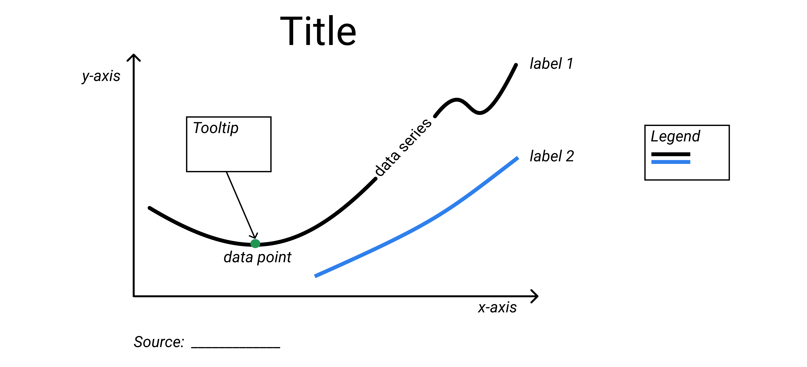
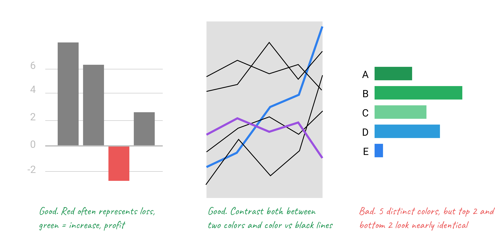

# Chart Your Data {#chart}
Charts pull readers deeper into your story. Even if your data contains geographical information, sometimes a chart tells your story better than a map. But designing meaningful, interactive charts requires careful thought about how to communicate your data story with your audience. In this chapter, you will learn how to:

- Practice [principles of chart design](chart-design.html). Learn to identify good charts from bad ones.
- Choose a chart type that matches your story and data format, and follow tutorials in the table below. Beginners may start with easy-to-learn tools such as [Google Sheets](chart-google-sheets.html) or [Tableau Public](tableau-public.html), then move up to more powerful tools, such as [Chart.js](chartjs.html), which require you to [Modify and Host Code Templates with GitHub](github.html) or another web host.

See also related chapters in this book:

- [Draw and write your data story](draw.html) to capture your ideas on paper
- [Improve spreadsheet skills](spreadsheet.html), [Find and know your data](find.html), and [Clean your data](clean.html)
- [Embed your interactive chart on your website](embed.html)
- [Detect bias in data stories](detect.html), including [How to lie with charts](how-to-lie-with-charts.html)
- [Tell your data story](story.html), including its most meaningful insights and limitations

| Basic chart types | Best use and tutorial chapters |
| --- | --- |
| Grouped column or bar<br>  | Best to compare categories side-by-side. Vertical columns, or horizontal bars for long labels. <br>Easy tool: [Google Sheets bar and column tutorial](column-bar-google.html)<br>Power tool: [Chart.js templates](chartjs.html) |
| Separated column or bar<br>  | Best to compare categories in separate clusters. Vertical columns, or horizontal bars for long labels.<br>Easy tool: [Google Sheets bar and column tutorial](column-bar-google.html)<br>Power tool: [Chart.js templates](chartjs.html) |
| Stacked column or bar<br>  | Best to compare sub-categories, or parts of a whole. Vertical columns, or horizontal bars for long labels.<br>Easy tool: [Google Sheets bar and column tutorial](column-bar-google.html)<br>Power tool: [Chart.js templates](chartjs.html) |
| Histogram<br>  | Best to show distribution of raw data, with number of values in each bucket.<br>Easy tool: [Google Sheets bar and column tutorial](column-bar-google.html)<br>Power tool: [Chart.js templates](chartjs.html) |
| Pie chart<br>  | Best to show parts of a whole, but hard to estimate size of slices.<br>Easy tool: [Google Sheets pie chart tutorial](pie-line-area-google.html)<br>Power tool: [Chart.js templates](chartjs.html) |
| Line chart<br>  | Best to show continuous data, such as change over time.<br>Easy tool: [Google Sheets line chart tutorial](pie-line-area-google.html)<br>Power tool: [Chart.js templates](chartjs.html) |
| Filtered line chart <br>  | Best to show multiple lines of continuous data, with on-off toggle buttons. <br>Easy tool: [Tableau Public filtered line chart tutorial](filtered-line-chart-tableau.html) |
| Stacked area chart<br>  | Best to show parts of a whole, with change over time. <br>Easy tool: [Google Sheets stacked area tutorial](pie-line-area-google.html)<br>Power tool: [Chart.js templates](chartjs.html) |
| Scatter chart <br>  | Best to show relationship between two sets of data. Also called an XY chart. <br>Easy tool: [Google Sheets scatter chart tutorial](scatter-bubble-google.html) or [Tableau Public scatter chart tutorial](scatter-chart-tableau.html)<br>Power tool: [Chart.js templates](chartjs.html) |
| Bubble chart <br>  | Best to show relationship between three or four sets of data, using bubble size and color.<br>Easy tool: [Google Sheets bubble chart tutorial](scatter-bubble-google.html)<br>Power tool: [Chart.js templates](chartjs.html) |

#### For more advanced chart types and tutorials {-}
- [Google Sheets Chart types help page](https://support.google.com/docs/answer/190718)
- [Tableau Public resources page](https://public.tableau.com/en-us/s/resources)
- [Chart.js samples page](https://www.chartjs.org/samples/latest/)

## Chart Design Principles {- #chart-design}
Spot the difference between good and bad charts, based on this compilation of design principles from leading experts, with citations listed below to learn more.

1) Remember the **most important principle:** Find meaningful insights in your data, and create visualizations that help you tell these stories. All of the other details below are secondary.

2) Before you begin, ask yourself: Do I really need a chart to tell this data story? Or would a table or text alone do a better job?

3) Decide if the best way to communicate with your audience is with static charts (such as images printed on paper) or interactive charts (embedded in a website, with tooltip details and source links). Most of these principles apply to both types, but [this book features tools and tutorials](chart) to create interactive charts.

4) Understand basic chart vocabulary: title, labels, horizontal x-axis and vertical y-axis, data series, tooltip, source and credits.



5) Identify the [chart type](chart) that best matches your story and data format.

6) Draw visual comparisons that are easy for readers to understand, rather than confusing them (adapted from Gourley p. 19).

7) Do the math for your readers. Based on your data story, decide if you should show absolute numbers, percentages, or percent change (Wong pp. 23-25, 104-107).


8) Order categories logically---either alphabetically, by value, or sequentially---depending on your data story (Gourley, p. 19; Wong pp. 70-71).


9) For long labels, use horizontal bar charts instead of vertical column charts (Wong p. 66).


10) On bar and column charts, start the vertical y-axis at zero, and choose natural increments (Wong pp. 51-52). But line charts do not need to start at zero, and can focus on specific ranges. See also the [How to Lie with Charts](how-to-lie-with-charts) and [How to Lie with Maps](how-to-lie-with-maps) chapters in this book.


11) Beware of pie charts. Most readers cannot accurately estimate sizes of different slices. Consider other ways to show part-to-whole relationships, such as bar/column charts, or stacked bar/column charts (Few 2007, pp. 2-4; Wong p. 79).


12) If you choose to use a pie chart, then show no more than 5 slices, and places the largest slices closest to the top at 12 o'clock (Wong, pp. 74-75).


13) Words matter as much as pictures.
- Add meaningful titles, labels, and annotations to draw attention to your data story.
- Keep typography simple, and **use bold type** sparingly to highlight your key insights (Wong p. 32; Knaflic pp. 107, 111).

14) On static charts, label items directly when possible. (On interactive charts, designers may need to rely on tooltips and text.) Insert a legend in a logical place for readers (Wong, p. 56).

15) Add source credits and bylines---with links to view data tables and details---to build credibility and accountability.

16) Avoid “chart junk”--such as 3D perspective, shadows, and unnecessary ornaments---which distract readers from your data story. Never use 3D unless you are plotting three-dimensional data (Tufte p. *to come*, Wong p. 62, Knaflic p. 65).


17) De-clutter charts (Knaflic pp. 91-98, 130-135).


18) Choose colors wisely.
- Use color to logically organize your data. Avoid random colors (Wong pp. 40, 44).
- Avoid bad combinations from opposite sides of color wheel, such as red/green or yellow/blue (Wong pp. 40, 44).
- Use contrast (such as color vs gray) to call attention to your data story (Knaflic pp. 87-88)



See also [Map Design Principles](map-design.html) and [Tell Your Data Story](story.html) chapters in this book.

#### Learn more {-}
- Stephanie D. H. Evergreen, Effective Data Visualization: The Right Chart for the Right Data, (Los Angeles: SAGE Publications, Inc, 2016)

- Stephen Few, Now You See It: Simple Visualization Techniques for Quantitative Analysis, (Oakland, Calif: Analytics Press, 2009)

- Stephen Few, “Save the Pies for Dessert [critique of pie charts],” Visual Business Intelligence Newsletter, 2007, 1–14, http://www.perceptualedge.com/articles/visual_business_intelligence/save_the_pies_for_dessert.pdf

- Stephen Few, Show Me the Numbers: Designing Tables and Graphs to Enlighten, Second edition (Burlingame, CA: Analytics Press, 2012)

- Drew Gourley, How to Use Data Visualization to Win Over Your Audience, (Visage and Hubspot, June 2015), https://visage.co/content/data-viz-win-audience

- Cole Nussbaumer Knaflic, Storytelling with Data: A Data Visualization Guide for Business Professionals, (Hoboken, New Jersey: Wiley, 2015)

- Cole Nussbaumer Knalfic, "An Updated Post on Pies," StoryTelling with Data, February 16, 2017, http://www.storytellingwithdata.com/blog/2017/1/10/an-updated-post-on-pies

- Wayne Lytle, Viz-O-Matic: The Dangers of Glitziness and Other Visualization Faux Pas, 1993 video shared on YouTube, https://www.youtube.com/watch?v=fP-7rhb-qMg

- Isabel Meirelles, Design for Information: An Introduction to the Histories, Theories, and Best Practices Behind Effective Information Visualizations (Rockport Publishers, 2013), http://isabelmeirelles.com/book-design-for-information/

- Tableau, Visual Analysis Best Practices: A Guidebook, n.d., http://www.tableau.com/sites/default/files/media/whitepaper_visual-analysis-guidebook_0.pdf.

- Edward R. Tufte, Beautiful Evidence (Graphics Press, 2006)

- “WTF Visualizations: Visualizations That Make No Sense,” 2017, http://viz.wtf.

- xkcd, “University Website,” accessed February 12, 2017, https://xkcd.com/773/

- Nathan Yau, “One Dataset, Visualized 25 Ways,” FlowingData, January 24, 2017, http://flowingdata.com/2017/01/24/one-dataset-visualized-25-ways/

- Nathan Yau, “Best Data Visualization Projects of 2016,” FlowingData, December 29, 2016, http://flowingdata.com/2016/12/29/best-data-visualization-projects-of-2016/

## Google Sheets Charts {- #chart-google-sheets}
Use Google Sheets (http://sheets.google.com), an easy drag-and-drop tool, to create basic interactive charts that you can embed in your website.

#### Tool Review {-}
- Pros:
  - Free and easy-to-learn tool on the collaborative Google Drive platform.
  - Edit, share, and publish interactive charts from your data, all in one spreadsheet.
- Cons:
  - Limited control over chart appearance.
  - Scatter charts cannot show data in tooltips.
  - Bubble charts cannot show small, uniform bubbles.
  - Cannot cite or link to source data inside the chart.
  - Cannot add annotations to highlight items inside charts.
  - For more powerful tools that require more skills, see tutorials in this book on [Tableau Public](scatter-chart-tableau.html) and [Chart.js](chartjs.html).

#### Tutorials {-}
Follow the Google Sheet Chart tutorials in this book to create:

- [Column and Bar Charts](column-bar-google.html)
  - Grouped
  - Separated
  - Stacked
  - Histograms
- [Pie, Line and Area Charts](pie-line-area-google.html)
- [Scatter and Bubble Charts](scatter-bubble-google.html)

#### Learn more {-}
- [Google Sheet chart types help page](https://support.google.com/docs/answer/190718)

## Column and Bar Charts with Google Sheets {- #column-bar-google}
Follow these tutorials to create different types of column and bar charts with Google Sheets <http://sheets.google.com> on the Google Drive platform. Requires free account.

- Grouped
- Separated
- Stacked
- Histograms

#### Grouped Column and Bar Charts {-}
Best to compare categories side-by-side. Vertical columns, or horizontal bars for long labels.

**Try it:** This grouped column chart shows differences in obesity between men and women in each age bracket. Float your cursor over columns to view data details.

<iframe width="600" height="371" seamless frameborder="0" scrolling="no" src="https://docs.google.com/spreadsheets/d/1ltA9siijVSDkTE3fzB3UaWHO7dotBIrGH4R9wI_Qyqw/pubchart?oid=787918829&amp;format=interactive"></iframe><a href="https://docs.google.com/spreadsheets/d/1ltA9siijVSDkTE3fzB3UaWHO7dotBIrGH4R9wI_Qyqw/edit#gid=1017658845"><br>View data from CDC and StateOfObesity.org</a>

**Tutorial:**

1) Right-click to open link in new tab: [Google Sheet Column chart with grouped data template](https://docs.google.com/spreadsheets/d/1ltA9siijVSDkTE3fzB3UaWHO7dotBIrGH4R9wI_Qyqw/)

2) Sign in to your Google Drive or [sign up for a free account](http://sheets.google.com)

3) Select File > Make a Copy to save your own version to your Google Drive.


4) To remove the current chart from your copy of the spreadsheet, select it and press the delete.

5) Format your data in a similar way as shown below. Each row is a data series, which displays as a separate color in the chart.


6)  Use your cursor to select only the data you wish to chart, then select Insert > Chart.


7) In the Chart Editor > Recommendations tab, choose your preferred Column chart (or horizontal Bar chart for longer labels), or see more options in Chart Types tab. Press the Insert button.


8) To customize title, labels, and more, click the editing controls in the upper-right corner.


9) To make your data public, select the blue Share button > Advanced, then Change from Private to Public On the Web, with Anyone Can View.

```{r share-sheet}
if(knitr::is_html_output()) knitr::include_url("images/05-chart/column-share.gif") else knitr::include_graphics("images/placeholder.jpg")
```

10) To embed your chart in another website, click the upper-right chart editing controls, select Publish Chart, select Embed, and press the Publish button. Copy the iframe code and see the [Embed on Your Web](embed.html) chapter in this book.

11) Reminder: Currently, there is no easy way to cite or link to your source data inside a Google Sheets chart. Instead, cite and link to your source data in the text of the web page, as shown in the example at the top.

#### Separated Column and Bar Charts {-}
Best to compare categories in separate clusters. Vertical columns, or horizontal bars for long labels.

**Try it:** This separated bar chart shows calorie counts of fast food items, separated by restaurant chains. The horizontal bar offers more space for longer labels. Float your cursor over bars to explore data details.

<iframe width="700" height="432" seamless frameborder="0" scrolling="no" src="https://docs.google.com/spreadsheets/d/1LGUYaVLoRcOiB8KcXb3Rn7LRj0exnUQYOy58LrkGPAk/pubchart?oid=1270431574&amp;format=interactive"></iframe><a href="https://docs.google.com/spreadsheets/d/1LGUYaVLoRcOiB8KcXb3Rn7LRj0exnUQYOy58LrkGPAk/edit#gid=956322126"><br>View data from Starbucks and McDonalds</a>

** Tutorial:**

1) Right-click to open this link in a new tab: [Google Sheet Column chart with separated data template](https://docs.google.com/spreadsheets/d/1LGUYaVLoRcOiB8KcXb3Rn7LRj0exnUQYOy58LrkGPAk/)

2) Follow similar steps in the first tutorial above.

3) Format your data in a similar way as shown below. Each column is a data series, which displays as a separate color in the chart.


4) In the Chart Editor > Recommendations tab, choose your preferred Bar chart, or see more options in Chart Types tab.

#### Stacked Column and Bar Charts {-}
Best to compare sub-categories, or parts of a whole. Vertical columns, or horizontal bars for long labels.

**Try it:** This stacked column chart compares the percentage of overweight residents across nations. Float your cursor over columns to view data details.

<iframe width="600" height="371" seamless frameborder="0" scrolling="no" src="https://docs.google.com/spreadsheets/d/1WS11EK33JCmvCRzSDh9UpP6R7Z2sHglF7ve5iJL6eZk/pubchart?oid=307057605&amp;format=interactive"></iframe><a href="https://docs.google.com/spreadsheets/d/1WS11EK33JCmvCRzSDh9UpP6R7Z2sHglF7ve5iJL6eZk/edit#gid=735710691"><br>View data from WHO and CDC</a>

**Tutorial:**

1) Begin by opening this link in a new tab: [Google Sheets Stacked column chart template](https://docs.google.com/spreadsheets/d/1WS11EK33JCmvCRzSDh9UpP6R7Z2sHglF7ve5iJL6eZk/)

2) Follow most of the same steps in first tutorial above.

3) Format your data in a similar way as shown below. Each column is a data series, which displays as a separate color in the chart.


4) In the Chart Editor > Recommendations tab, choose Stacked column chart (or Stacked bar chart if you prefer a horizontal orientation), or see more options in Chart Types tab.

#### Histograms {-}
Best to show the distribution of raw data, with number of values in each bucket. Typically displayed in vertical columns.

**Try it**   to come*

**Tutorial:**  to come *

- Format data into two columns
  - data labels in the first column
  - numeric values in second column


## Pie, Line, and Area Charts with Google Sheets {- #pie-line-area-google}

#### Pie Chart {-}
Best to show parts of a whole, but hard to estimate size of slices.

Try it -- to come

Tutorial - to come

#### Line Chart {-}
Best to show change over time with continuous data.

**Try it:** In this line chart, the level of chicken (shown in orange) rises steadily and surpasses beef (red) and pork (blue). Float your cursor over lines to view data details.

<p><iframe width="600" height="371" seamless frameborder="0" scrolling="no" src="https://docs.google.com/spreadsheets/d/1wkWxxZ2-N5hqkcp7in8bxwdEcT1-XMnt1A8qUXxUSjw/pubchart?oid=2073830845&amp;format=interactive"></iframe><a href="https://docs.google.com/spreadsheets/d/1wkWxxZ2-N5hqkcp7in8bxwdEcT1-XMnt1A8qUXxUSjw/edit#gid=894957893">View source data from USDA</a></p>

**Tutorial:**

- Begin by opening this link in a new tab: [Google Sheet Line chart template](https://docs.google.com/spreadsheets/d/1wkWxxZ2-N5hqkcp7in8bxwdEcT1-XMnt1A8qUXxUSjw/)
- Follow most of the same steps in first tutorial above.
- Format your data in a similar way as shown below. Each column is a data series, which displays as a separate color in the chart.<br>
- In the Chart Editor > Recommendations tab, choose Line chart, or see more options in Chart Types tab.

#### Stacked Area Chart {-}
Best to show part-to-whole relationships that change over time.

**Try it:** to come

**Tutorial:** to come

## Scatter and Bubble Charts with Google Sheets {- #scatter-bubble-google}
Follow these tutorials to create different types scatter and bubble charts with [Google Sheets](http://sheets.google.com)

#### Scatter chart {-}
Best to show relationships between two series of data. Also called an XY chart, because each point represents a coordinate value plotted along the horizontal x-axis and the vertical y-axis.

**Try it:** This scatter chart reveals a downward slope: nations with lower fertility also tend to have higher life expectancy. But remember that a data correlation does not necessarily show causation. Float your cursor over points to view data details. However, the Google Sheet scatter chart only displays static labels for each country, rather than interactive tooltips. See alternative tools below.

<p><iframe width="626" height="387" seamless frameborder="0" scrolling="no" src="https://docs.google.com/spreadsheets/d/1LJCj3RaVgaQsAZriV_JDQhBrIBSvnH_N1LBCkZK1bqs/pubchart?oid=386475448&amp;format=interactive"></iframe><a href="https://docs.google.com/spreadsheets/d/1LJCj3RaVgaQsAZriV_JDQhBrIBSvnH_N1LBCkZK1bqs/edit#gid=562477420">View source data from World Bank</a></p>

**Tutorial:**

- Begin by opening this link in a new tab: [Google Sheets Scatter chart with static data labels](https://docs.google.com/spreadsheets/d/1LJCj3RaVgaQsAZriV_JDQhBrIBSvnH_N1LBCkZK1bqs/)
- Follow most of the same steps in first tutorial above.
- Format your data in a similar way as shown below. The first column (life expectancy) is the x-axis data series, and the second column  (fertility) is the y-axis data series. The third column consists of data labels (names of countries).<br>

- In the Chart Editor > Recommendations tab, choose Scatter chart, or see more options in Chart Types tab.
- To display static labels for each point, click the upper-right charter corner for Advanced Editing tools > Customization tab, the scroll down to Series > Data labels > Custom, and press Update.

- Since the Google Sheets scatter chart is not ideal, consider using the 3-column bubble chart below, or the [Scatter Chart with Tableau Public tutorial](scatter-chart-tableau) in this book.

#### Bubble chart with 3 columns {-}
Best to show the relationship between two series of data, similar to the scatter chart above, with labels in tooltips.

**Try it:** This bubble chart shows the same data as above on fertility and life expectancy. Float your cursor over each bubble to reveal a tooltip with the country name and the two data points.

<p><iframe width="600" height="371" seamless frameborder="0" scrolling="no" src="https://docs.google.com/spreadsheets/d/1CL7joH_3wvMYo9HIiSuFP0Ykv_Nl5DK6DYYcd3_gFnU/pubchart?oid=2105121864&amp;format=interactive"></iframe><a href="https://docs.google.com/spreadsheets/d/1CL7joH_3wvMYo9HIiSuFP0Ykv_Nl5DK6DYYcd3_gFnU/edit#gid=1602534273">View source data from World Bank</a></p>

**Tutorial:**
- Begin by opening this link a new tab: [Google Sheets Bubble chart with 3 columns template](https://docs.google.com/spreadsheets/d/1CL7joH_3wvMYo9HIiSuFP0Ykv_Nl5DK6DYYcd3_gFnU/)
- Format your data in a similar way as shown below, with three columns in this order:
  - A: label for each bubble
  - B: numeric data on horizontal x-axis
  - C: numeric data on vertical y-axis<br>

- Follow most of the same steps in the first tutorial above.
- In the Chart Editor, skip the Recommendation tab, select the Chart Types tab, then choose Bubble chart (near Scatter chart).<br>

- Labels will appear on each bubble by default. To hide labels initially, so that they appear only in the interactive tooltips when floating the cursor over data, customize your chart. Click the editing controls in the upper-right corner, scroll down to Series, and change Labels > Color > None.<br>

- Unfortunately, there is no easy way to reduce all bubbles to a uniformly smaller size. See the Google Sheets Bubble chart with 5 columns below, or create a [Scatter Chart with Tableau Public](chart.html#scatter-chart-with-tableau-public) in this book.

#### Bubble chart with 5 columns {-}
Best to show the relationship between three or four series of data. Similar to a scatter chart, but with bubble size and color to represent additional variables.

**Try it:** This bubble chart shows fertility and life expectancy for a subset of the nations above, with population (shown by bubble size) and region (shown by bubble color). Float your cursor over bubbles to view data details.

<p><iframe width="600" height="371" seamless frameborder="0" scrolling="no" src="https://docs.google.com/spreadsheets/d/1YgBWYm9nTGlCuyqSwU3SDb7xk-SMSPgjfYq5iLqL0nQ/pubchart?oid=200651442&amp;format=interactive"></iframe><a href="https://docs.google.com/spreadsheets/d/1YgBWYm9nTGlCuyqSwU3SDb7xk-SMSPgjfYq5iLqL0nQ/edit#gid=1182154897">View data from World Bank</a></p>

** Tutorial **
- Begin by opening this link a new tab: [Google Sheets Bubble chart with 5 columns template](https://docs.google.com/spreadsheets/d/1YgBWYm9nTGlCuyqSwU3SDb7xk-SMSPgjfYq5iLqL0nQ/)
- Follow most of the same steps in the tutorials above.
- Format your data in a similar way as shown below, with 5 columns in this order:
  - A: label for each bubble
  - B: numeric data on horizontal x-axis
  - C: numeric data on vertical y-axis
  - D: text data to represent bubble color (each category will appear as a new color, or leave blank to display all as one color)  
  - E: numeric data to represent bubble size<br>
  
- Labels will appear on each bubble by default. To hide labels in the default display (and show them only in the interactive tooltips when floating the cursor over data), see the 3-column bubble chart tutorial above.

#### Learn more {-}
See additional chart types in this [Google Sheets help page](https://support.google.com/docs/answer/190718)

## Create Charts with Tableau Public {- #tableau-public}
This book includes tutorials to create interactive charts with Tableau Public <https://public.tableau.com>. Free download requires email signup.

- [Create an XY Scatter Chart with Tableau Public](scatter-chart-tableau.html)
- [Create a Filtered Line Chart with Tableau Public](filtered-line-chart-tableau.html)

#### Tool Review {-}
- Pros
  - Easy-to-learn tool for basic charts, with power to create more advanced visualizations
  - Tableau Public (free version) includes most features found in Tableau Desktop (US $999+)
  - Connect to multiple data formats: Text (CSV), Google Sheets, Excel, and more
  - Combine multiple visualizations and tell stories with dashboard and story point features
- Cons
  - Only available as a downloadable application for Mac or Windows
  - New users may be overwhelmed by extensive options
  - Saving your work online makes it public (hence the name Tableau Public)
  - Limited support for maps below the nation or state levels
  - Dependent upon Tableau web servers

#### Learn more {-}
- [Embed Tableau Public on Your Website](iframe-tableau) chapter in this book
- Tableau Public Resources, with how-to videos and sample data <https://public.tableau.com/en-us/s/resources>
- Tableau Public Support page <https://www.tableau.com/support/public>

## Create XY Scatter Chart with Tableau Public {- #scatter-chart-tableau}
An interactive scatter chart shows the relationship between two variables by displaying a series of XY coordinates. Readers can float their cursor over points to view specific details. The chart below, which illustrates the strong relationship between Connecticut school district income and test scores, was created with the free downloadable tool for Mac and Windows, Tableau Public <http://public.tableau.com>.

#### Try it {-}

<iframe src="https://public.tableau.com/views/CTSchoolDistrictsbyIncomeandGradeLevels2009-13/Sheet1?:showVizHome=no&:embed=true" width="90%" height="500"></iframe>

#### Video with step-by-step tutorial {-}
<iframe width="560" height="315" src="https://www.youtube.com/embed/70RKjT91cjs?rel=0" frameborder="0" allow="autoplay; encrypted-media" allowfullscreen></iframe>

1) Read the [Tableau Public tool review](tableau-public) in this book, then download and install the free application on a Mac or Windows computer from <http://public.tableau.com>. Requires a free account.

2) Click the link and Save to download the sample file to your computer: [ct-districts-income-grades-2009-13 in Excel format](data/ct-districts-income-grades-2009-13.xlsx).

3) Open the sample file to view three columns: district, median household income, and grade levels (above/below national average for 6th grade Math and English test scores). The Notes tab explains how this data is based on the work of Sean Reardon et al. at the [Stanford Education Data Archive](http://purl.stanford.edu/db586ns4974), Motoko Rich et al. at [The New York Times](http://www.nytimes.com/interactive/2016/04/29/upshot/money-race-and-success-how-your-school-district-compares.html), Andrew Ba Tran at [TrendCT](http://trendct.org/2016/05/06/wealth-and-grades-compare-connecticuts-school-districts/), and the American Community Survey 2009-13 via [Social Explorer](http://socialexplorer.com).

Hint: To prepare your own scatter chart data from different sources, see the [Match Spreadsheet Columns with VLookup Function](vlookup) chapter in this book.

4) In Tableau Public, click Connect to import the data file from your computer. If you downloaded an Excel file, Connect to Excel. Or if you downloaded a CSV file, Connect to Text. Or click "More..." to connect to Google Sheets.

5) Drag the Data sheet into the Data Source field.

6) In bottom-left corner, below the "Go to Worksheet" reminder, click Sheet 1.

7) Welcome to the Tableau Public Worksheet. Although it may feel overwhelming at first, the key is learning where to drag items from the data tab into the main worksheet. Dimensions are any information that is qualitative or categorical, while measures are quantitative information about the dimensions.

8) Drag the Grade Levels measure into the Rows field.

9) Drag the Median Household Income measure into the Columns field. The initial chart will appear as one point, but that's because all of the data is aggregated together. We're not done yet.

10) Drag the District dimension into the lower portion of the Marks area. Now your scatter chart will appear, and float your cursor over each point to view details.

11) Click Sheet 1 to rename the title of your chart.

12) Click the Worksheet menu to Show Caption and type in data sources.

13) Recommended: Click the Standard menu (above Columns) to change view to Fit Width.


14) To publish your chart on the public web, select File > Save to Tableau Public As. Requires signup for a free Tableau account.  

15) Give your workbook a meaningful title, since this name will appear in the URL for your published work on the Tableau Public server, and press Save.

16) After publishing your work on the web, Tableau Public will automatically open the web link in your default browser. Click Edit Details to enter more information. Under Toolbar settings, see checkbox to Allow your workbook and its data to be downloaded by others.


Checking this box enables the Download button at the bottom of your published work, which allows users to access your data and workbook, to see how you constructed the visualization.


17) To insert your Tableau Public visualization in your own website, see the [Embed On Your Web](embed.html) chapter of this book, and in particular, [Embed Tableau Public on your Website](embed.html#tableau).

18) To see all of your published visualizations, go to your Tableau Public online profile, which follows this format:
```markdown
https://public.tableau.com/profile/USERNAME
```
#### Learn more {-}
Combine multiple visualizations and tell stories with Tableau Public dashboard and story point features. See Tableau Public Resources, with how-to videos and sample data <https://public.tableau.com/en-us/s/resources>.

## Create Filtered Line Chart with Tableau Public {- #filtered-line-chart-tableau}
TODO: Decide whether to keep or not. Originally co-authored with Veronica. An interactive filtered line chart provides checkboxes to turn on/off selected data lines to make specific comparisons, since displaying all of the lines at once would be overwhelming. Readers can float their cursor over each line to identify the school name and data details. We created this tutorial to help a Hartford non-profit education advocacy group compare cohorts of student achievement levels over time across forty schools. You can create your own version with a free downloadable tool for Mac and Windows computers, Tableau Public <https://public.tableau.com>.

#### Try it {-}
<iframe src='https://public.tableau.com/views/LineChartSample/Sheet1?:showVizHome=no&:embed=true' width="90%" height="530"></iframe>

Or right-click the [link to view full-size in a new tab](https://public.tableau.com/views/LineChartSample/Sheet1?:embed=y&:display_count=yes)

#### Video with step-by-step tutorial {-}
<iframe width="560" height="315" src="https://www.youtube.com/embed/_L4u9mfE8Qo?rel=0" frameborder="0" allow="autoplay; encrypted-media" allowfullscreen></iframe>

1) Read the [Tableau Public tool review](tableau-public) in this book, then download and install the free application on a Mac or Windows computer from <http://public.tableau.com>. Requires a free account.

2) Click link and Save file to download to your computer: [sample-filtered-line-chart in CSV format](data/sample-filtered-line-chart.csv). CSV means comma-separated values, a generic spreadsheet format that most data tools can easily open.

Hint: When preparing your own spreadsheet, format your data so that Tableau Public can read it. For example, make sure that Year data is entered as "2007" instead of "1/1/2007". Leave all blank spaces as-is so that Tableau automatically converts them to "null" values during the data import.

3) In Tableau Public, click Connect to import the data file you downloaded to your computer. If you downloaded a CSV file, Connect to Text. Or if you downloaded an Excel file, Connect to Excel. Or click "More..." to connect to Google Sheets.

4) Your data sheet should automatically appear in Tableau Public. Any blanks will automatically convert to “null.”

5) In bottom-left corner, below the "Go to Worksheet" reminder, click Sheet 1.

6) Welcome to the Tableau Public Worksheet. Although it may feel overwhelming at first, the key is learning where to drag-and-drop items from the data tab into the main worksheet. Dimensions are any information that is qualitative or categorical, while measures are quantitative information about the dimensions.  In this example, we are creating a line chart with two dimensions (year and school) and one measure (scores).

7) Drag-and-drop Year into the Column field.

8) Drag-and-drop Schools into the Row field.

9) Drag-and-drop Scores into the middle of the grid.

10) Select Score (but not its drop-down menu), then go to the Analysis menu and turn off Aggregated Measures. We need to do this so that the numbers are displayed individually, and not aggregated by default.

11) In the upper-right corner, go to the Show Me window. (If it is closed, then open it.) Then select Lines (continuous).

12) Initially, each School row appears at its own chart. To blend all of them together into one master chart, drag School to the Marks window and drop it on the Color button. All of the School lines will appear in one chart, with identifying colors.

13) To filter the line chart to display only selected items, go to the Marks window, select the School Cohort drop-down menu, and choose Filter.

14) The Filter window should appear in the far-right side. (If necessary, close the Show Me window to view the Filter window.) Select only a few schools to display by default.

15) Since users can identify schools by turning them on in the Filter window, or floating their cursors to view tooltips for each line, we do not need to show the color legend for each school. In bottom-right School window, select the drop-down menu and choose Hide Card.

16) Confirm or enter text for the axes, title, and caption to describe the data source.

17) To publish your chart on the public web, select File > Save to Tableau Public As. Requires signup for a free Tableau account.

18) Give your workbook a meaningful title, since this name will appear in the URL for your published work on the Tableau Public server, and Save.

19) After publishing your work on the web, Tableau Public will automatically open the web link in your default browser. Click Edit Details to enter more information. Under Toolbar settings, see checkbox to Allow your workbook and its data to be downloaded by others.


Checking this box enables the Download button at the bottom of your published work, which allows users to access your data and workbook, to see how you constructed the visualization.


20) To insert your Tableau Public visualization in your own website, see the [Embed On Your Web](embed) chapter of this book, and in particular, [Embed Tableau Public on your Website](iframe-tableau).

21) To see all of your published visualizations, go to your Tableau Public online profile, which follows this format:
```markdown
https://public.tableau.com/profile/USERNAME
```
####  Learn more {-}
Combine multiple visualizations and tell stories with Tableau Public dashboard and story point features. See Tableau Public Resources, with how-to videos and sample data <https://public.tableau.com/en-us/s/resources>.
