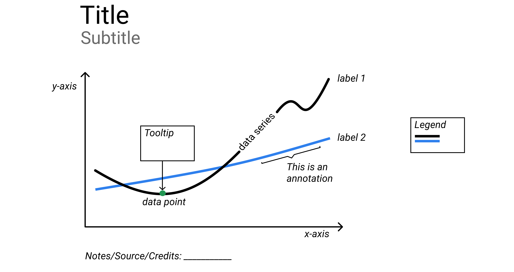
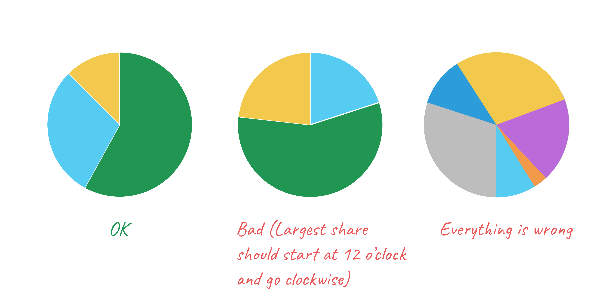
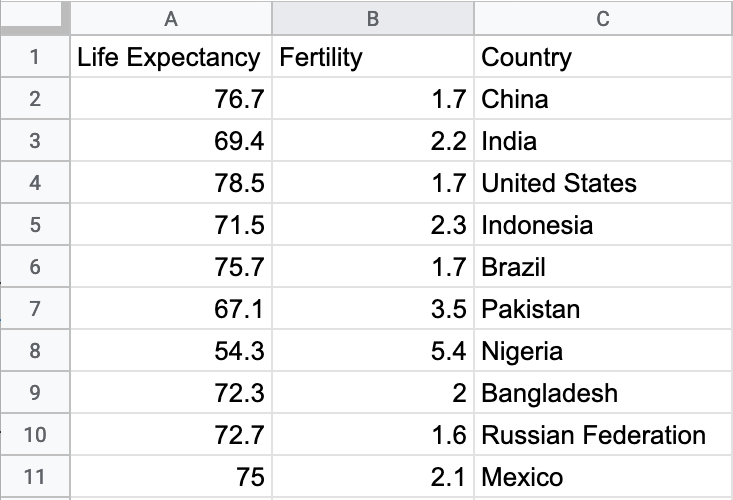
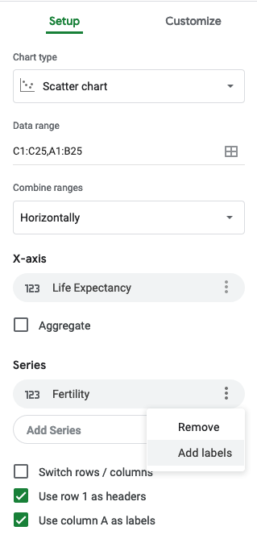
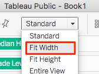

# Chart Your Data {#chart}
Charts pull readers deeper into your story. Even if your data contains geographical information,
sometimes a chart tells your story better than a map. But designing meaningful, interactive charts
requires careful thought about how to communicate your data story with your audience.

In this chapter, we will look at main [principles of chart design](chart-design.html), and
learn to identify good charts from bad ones. You will learn to choose a chart type that
matches your story and data format.

You will learn how to make static and interactive charts with [Google Sheets](chart-google-sheets.html)
and how to publish them on your website. We will then look at building interactive charts with
[Tableau Public](tableau-public.html), a free version of the powerful software used by
data analysts and data visualization practitioners.

At the end, we will introduce chart templates with JavaScript's [Chart.js](chartjs.html) library,
which give you a lot of control over how the charts look. Working with Chart.js will require
you to [modify and host code templates with GitHub](github.html), which is described in detail in Chapter 8.


See also related chapters in this book:

- [Draw and write your data story](draw.html) to capture your ideas on paper
- [Improve spreadsheet skills](spreadsheet.html), [Find and know your data](find.html), and [Clean your data](clean.html)
- [Embed your interactive chart on your website](embed.html)
- [Detect bias in data stories](detect.html), including [How to lie with charts](how-to-lie-with-charts.html)
- [Tell your data story](story.html), including its most meaningful insights and limitations

| Basic chart types | Best use and tutorial chapters |
| --- | --- |
| Grouped column or bar<br>  | Best to compare categories side-by-side. Vertical columns, or horizontal bars for long labels. <br>Easy tool: [Google Sheets bar and column tutorial](column-bar-google.html)<br>Power tool: [Chart.js templates](chartjs.html) |
| Separated column or bar<br>  | Best to compare categories in separate clusters. Vertical columns, or horizontal bars for long labels.<br>Easy tool: [Google Sheets bar and column tutorial](column-bar-google.html)<br>Power tool: [Chart.js templates](chartjs.html) |
| Stacked column or bar<br>  | Best to compare sub-categories, or parts of a whole. Vertical columns, or horizontal bars for long labels.<br>Easy tool: [Google Sheets bar and column tutorial](column-bar-google.html)<br>Power tool: [Chart.js templates](chartjs.html) |
| Histogram<br>  | Best to show distribution of raw data, with number of values in each bucket.<br>Easy tool: [Google Sheets bar and column tutorial](column-bar-google.html)<br>Power tool: [Chart.js templates](chartjs.html) |
| Pie chart<br>  | Best to show parts of a whole, but hard to estimate size of slices.<br>Easy tool: [Google Sheets pie chart tutorial](pie-line-area-google.html)<br>Power tool: [Chart.js templates](chartjs.html) |
| Line chart<br>  | Best to show continuous data, such as change over time.<br>Easy tool: [Google Sheets line chart tutorial](pie-line-area-google.html)<br>Power tool: [Chart.js templates](chartjs.html) |
| Filtered line chart <br>  | Best to show multiple lines of continuous data, with on-off toggle buttons. <br>Easy tool: [Tableau Public filtered line chart tutorial](filtered-line-chart-tableau.html) |
| Stacked area chart<br>  | Best to show parts of a whole, with change over time. <br>Easy tool: [Google Sheets stacked area tutorial](pie-line-area-google.html)<br>Power tool: [Chart.js templates](chartjs.html) |
| Scatter chart <br>  | Best to show relationship between two sets of data. Also called an XY chart. <br>Easy tool: [Google Sheets scatter chart tutorial](scatter-bubble-google.html) or [Tableau Public scatter chart tutorial](scatter-chart-tableau.html)<br>Power tool: [Chart.js templates](chartjs.html) |
| Bubble chart <br>  | Best to show relationship between three or four sets of data, using bubble size and color.<br>Easy tool: [Google Sheets bubble chart tutorial](scatter-bubble-google.html)<br>Power tool: [Chart.js templates](chartjs.html) |

#### For more advanced chart types and tutorials {-}
- [Google Sheets Chart types help page](https://support.google.com/docs/answer/190718)
- [Tableau Public resources page](https://public.tableau.com/en-us/s/resources)
- [Chart.js samples page](https://www.chartjs.org/samples/latest/)


## Chart Design Principles {- #chart-design}

Although not a science, data visualization comes with a set of rules, principles, and best practices
that create a basis for clear and eloquent charts. Some of those rules are less rigid than others,
but prior to "breaking" them, it is important to establish why they are important.

Before you begin, ask yourself: Do I really need a chart to tell this data story?
Or would a table or text alone do a better job? Making a good chart takes time and effort,
so make sure it enhances your story.

### Deconstructing a Chart {-}

Let's take a look at Figure \@ref(fig:design-principles-chart-components).
It shows basic chart components that are shared among most chart types.

(ref:design-principles-chart-components) Common chart components.

```{r design-principles-chart-components, fig.cap="(ref:design-principles-chart-components)"}

```

A *title* is perhaps the most important element of any chart. A good title is short, clear,
and tells a story on its own. For example, "Black and Asian Population More Likely to Die of Covid-19",
or "Millions of Tons of Plastic Enter the Ocean Every Year" are both good titles.

Sometimes a more "dry" and "technical" title is preferred. Our two titles can then be changed to
"Covid-19 Deaths by Race in New York City, March 2020" and "Tons of Plastic Entering the Ocean, 1950–2020", respectively.

Often these two styles are combined into a title ("story") and a subtitle ("technical"), like that:

```
Black and Asian Population More Likely to Die of Covid-19
Covid-19 Deaths by Race in New York City, March 2020
```

Make sure your subtitle is less prominent than the title. You can achieve this by decreasing font size,
or changing font color (or both).

Horizontal (x) and vertical (y) *axes* define the scale and units of measure.

A *data series* is a collection of observations, which is usually a row or
a column of numbers, or *data points*, in your dataset.

*Labels* and *annotations* are often used across the chart to give more context. For example,
a line chart showing US unemployment levels between 1900 and 2020
can have a "Great Depression" annotation arround 1930s, and "Covid-19 Impact" annotation for 2020,
both representing spikes in unemployment.
You might also choose to label items directly instead of relying on axes, which is common
with bar charts. In that case, a relevant axis can be hidden and the chart will look less cluttered.

A *legend* shows symbology, such as colors and shapes used in the chart, and their meaning (usually values that they represent).

You should add any *Notes*, *Data Sources*, and *Credits* underneath the chart to give more context about
where the data came from, how it was processed and analyzed, and who created the visualization.
Remember that being open about these things helps build credibility and accountability.

In interactive charts, a *tooltip* is often used to provide more data or context
once a user clicks or hovers over a data point or a data series.
Tooltips are great for complex visualizations with multiple layers of data,
because they de-clutter the chart. But because tooltips are harder to interact with on smaller screens,
such as phones and tablets, and are invisible when the chart is printed, only rely on them to convey 
additional, nice-to-have information. Make sure all essential information
is visible without any user interaction.

### Some Rules are More Important than Others {-}

Although the vast majority of rules in data visualization are open to interpretation,
there are some that are hard to bend.

**Bar chart axis must start at zero.**
Unlike line charts, bar or column charts need to have their value axis start at zero.
This is to ensure that a bar twice the length of another bar represents twice its value.
The Figure \@ref(fig:design-principles-start-at-zero) shows a good and a bad example.

(ref:design-principles-start-at-zero) Start your bar chart at zero.

```{r design-principles-start-at-zero, fig.cap="(ref:design-principles-start-at-zero)"}
knitr::include_graphics("images/05-chart/design-principles-start-at-zero.png")
```

Starting y-axis at anything other than zero is a common trick used by some media
and politicians to exaggerate differences in surveys and election results.

**Pie Charts Represent 100%**.
Pie charts is one of the most contentious issues in data visualization.
Most dataviz practitioners will recommend avoiding them entirely, saying that
people are bad at accurately estimating sizes of different slices.
We take a less dramatic stance, as long as you adhere to the recommendations
we give in the next section.

But the one and only thing in data visualization that every single professional
will agree on is that *pie charts represent 100% of the quantity*.
If slices sum up to anything other than 100%, it is a crime. If you design a survey 
titled *Are you a cat or a dog person?* and include *I am both* as the third option,
forget about putting the results into a pie chart.

### Chart Aesthetics {-}

Remember that you create a chart to help the reader understand the story, not to confuse them.
Decide if you want to show absolute numbers, percentages, or percent changes, and do the math for your readers.

**Avoid chart junk**. Start with a white background and add elements as you see appropriate. You should be able to justify 
each element you add. To do so, ask yorself: Does this element improve the chart, or can I 
drop it without decreasing readability? This way you won't end up with so-called "chart junk" as shown in Figure \@ref(fig:design-principles-junk), 
which includes 3D perspectives, shadows, and unnecessary elements. They might have looked cool in early versions
of Microsoft Office, but let's stay away from them today.

(ref:design-principles-junk) Avoid chart junk.

```{r design-principles-junk, fig.cap="(ref:design-principles-junk)"}
knitr::include_graphics("images/05-chart/design-principles-junk.png")
```

The only justification for using three dimensions is to plot three-dimensional data,
which has x, y, and z values. And don't let anyone tell you otherwise.

**Beware of pie charts**. Remember that pie charts only show part-to-whole relationship, so all slices need to add up to 100%.
Generally, the fewer slices—the better. Arrange slices from largest
to smallest, clockwise, and put the largest slice at 12 o'clock.
Figure \@ref(fig:design-principles-pie) illustrates that.

(ref:design-principles-pie) Sort slices in pie charts from largest to smallest, and start at 12 o'clock.

```{r design-principles-pie, fig.cap="(ref:design-principles-pie)"}

```

If your pie chart has more than five slices, consider showing your data in a bar chart, either stacked or separated,
like Figure \@ref(fig:design-principles-pie-to-bar) shows.

(ref:design-principles-pie-to-bar) Consider using bar charts instead of pies.

```{r design-principles-pie-to-bar, fig.cap="(ref:design-principles-pie-to-bar)"}
knitr::include_graphics("images/05-chart/design-principles-pie-to-bar.png")
```

**Don't make people turn their heads to read labels**. When your column chart has long x-axis labels that have to be rotated (often 90 degrees) to fit,
consider turning the chart 90 degrees so that it becomes a horizontal bar chart.
Take a look at Figure \@ref(fig:design-principles-turn-bar) to see how much easier it is to read horizontally-oriented labels.

(ref:design-principles-turn-bar) For long labels, use horizontal bar charts.

```{r design-principles-turn-bar, fig.cap="(ref:design-principles-turn-bar)"}

```

**Arrange elements logically**. If your bar chart shows different categories,
consider ordering them, like is shown in Figure \@ref(fig:design-principles-order-categories).
You might want to sort them alphabetically, which can be useful if you want the reader
to be able to quickly ook up an item, such as their town. Ordering categories by
value is another common technique that makes comparisons possible.
If your columns represent a value of something at a particular time,
they have to be ordered sequentially, of course.

(ref:design-principles-order-categories) For long labels, use horizontal bar charts.

```{r design-principles-order-categories, fig.cap="(ref:design-principles-order-categories)"}
knitr::include_graphics("images/05-chart/design-principles-order-categories.png")
```

**Do not overload your chart**. When labelling axes,
choose natural increments that space equally, such as [0, 20, 40, 60, 80, 100],
or [1, 10, 100, 1000] for a logarithmic scale. Do not overload your scales.
Keep your typography simple, use (but do not overuse) **bolding** to highlight major insights.
Consider using commas as thousands separators for readability
(`1,000,000` is much easier to read than `1000000`).

**Be careful with the colors**. The use of color is a complex topic, and there are plenty
of books and research devoted to it.
But some principles are fairly universal. First, do not use colors just for the sake of it,
most charts are fine being monochromatic.
Second, remember that colors come with some meaning attached, which can vary among cultures.
In the world of business, red is conventionally used to represent loss, and it would be unwise
to use this color to show profit. Make sure you avoid random colors.

Whatever colors you end up choosing, they need to be distinguishable
(otherwise what is the point?). Do not use colors that are too similar in hue 
(for example, various shades of green–leave them for choropleth maps).
Certain color combinations are hard to interpret for color-blind people,
like green/red or yellow/blue, so be very careful with those.
Figure \@ref(fig:design-principles-color) shows some good and bad examples of color use.

(ref:design-principles-color) Don't use colors just for the sake of it.

```{r design-principles-color, fig.cap="(ref:design-principles-color)"}
knitr::include_graphics("images/05-chart/design-principles-color.png")
```

If you follow the advice, you should end up with a de-cluttered chart as shown in
Figure \@ref(fig:design-principles-decluttered).
Notice how your eyes are drawn to the bars and their corresponding values,
not bright colors or secondary components like the axes lines.

(ref:design-principles-decluttered) Make sure important things catch the eye first.

```{r design-principles-decluttered, fig.cap="(ref:design-principles-decluttered)"}
knitr::include_graphics("images/05-chart/design-principles-decluttered.png")
```


## Google Sheets Charts {- #chart-google-sheets}

Google Sheets (https://sheets.google.com) is a well-known spreadsheet program
that allows creating basic charts using intuitive drag-and-drop interface.
Most people who create charts with Google Sheets export them as static *png* images.
But in fact these interactive charts can be easily embedded in your website.

In this section, we will look at creating column and bar charts that are separated,
grouped, and stacked. We will also look at makig pie, line, area, and scatter charts,
and learn to visualize three-dimentional data using bubble charts.

As most easy-to-use tools, Google Sheets has its shortcomings when it comes to 
charting. You might find yourself with too little control over the appearance option.
Your won't have much control  over your scatterplot tooltips.
You won't be able to cite or link to source data inside the chart,
but it won't be possible. You won't be able to annotate to highlight items inside charts.
But you *will* be able to create good-looking interactive visualizations
inside your spreadsheets *quickly*.

Tip: For an overview of charts and graphs in Google Sheets, visit
[this help page](https://support.google.com/docs/answer/190718).


## Column and Bar Charts with Google Sheets {- #column-bar-google}

Column and bar charts are some of the most common types of charts
in data visualization (column charts are just vertical bar charts).
They are used to compare values across categories.

In this tutorial, we will use three small datasets to build interactive
separated, grouped, and stacked bar charts in Google Sheets:

* Obesity in the US (by US CDC, and StateOfObesity.org project)
* High-Caolorie Fast-Food Items
* Global Database on Body Mass Index by World Health Organization

You will need a Google account (it's free).

If this is an e-book, you should be able to interact with the charts in this tutorial.
Hover over data points to see tooltips with additional data.

### Grouped Column and Bar Charts {-}

Figure 5-9 shows differences in obesity between
men and women in three age bracket. If you read this book electronically,
you should be able to hover over columns and see tooltips with data.

TODO: FIGURE 5-9
<iframe width="600" height="371" seamless frameborder="0" scrolling="no" src="https://docs.google.com/spreadsheets/d/1ltA9siijVSDkTE3fzB3UaWHO7dotBIrGH4R9wI_Qyqw/pubchart?oid=787918829&amp;format=interactive"></iframe><a href="https://docs.google.com/spreadsheets/d/1ltA9siijVSDkTE3fzB3UaWHO7dotBIrGH4R9wI_Qyqw/edit#gid=1017658845"><br>View data from CDC and StateOfObesity.org</a>

The following steps will help you recreate this interactive chart.

1) Right-click to open link in new tab: [Google Sheet Column chart with grouped data template](https://docs.google.com/spreadsheets/d/1ltA9siijVSDkTE3fzB3UaWHO7dotBIrGH4R9wI_Qyqw/)

2) Sign in to your Google Drive or [sign up for a free account](https://sheets.google.com)

3) Select File > Make a Copy to save your own version to your Google Drive. Screenshot from Figure 5-10
shows the relevant item in the File dropdown menu.


4) To remove the current chart from your copy of the spreadsheet, select it and press the *delete*.

5) Format your data as shown in Figure 5-11. Each row is a data series, which displays as a separate color in the chart.


6)  Use your cursor to select only the data you wish to chart, then select *Insert > Chart*, like
in Figure 5-12.


7) In the Chart Editor > Recommendations tab, choose your preferred Column chart
(or horizontal Bar chart if you have longer labels), or see more options in Chart Types tab as per Figure 5-13.
Press the Insert button when done.


8) To customize title, labels, and more, choose *Edit chart* from the menu in the upper-right corner of the chart.
as shown in Figure 5-15.


9) To make your data public, select Share button in the upper-right corner > Advanced, then Change from Private to Public On the Web, with Anyone Can View.

```{r share-sheet}
if(knitr::is_html_output()) knitr::include_url("images/05-chart/column-share.gif") else knitr::include_graphics("images/placeholder.jpg")
```

10) To embed your chart in another website, click the upper-right chart editing controls,
select *Publish chart*, select Embed, and press the Publish button.
See [Chapter 7](embed.html) of this book to learn what to do with the generated iframe code.

Note: Currently, there is no easy way to cite or link to your source data inside a Google Sheets chart.
Instead, cite and link to your source data in the text of the web page. Remember that citing your sources
adds credibility to your work.


### Separated Column and Bar Charts {-}

When you visualize individual, independent categories, you wouldn't want to group charts.
Instead, you want bars (columns) to be separated.

Figure 5-16 shows calorie counts of fast food items for two restaurant chains, Starbucks and McDonald's.
Unlike Figure 5-9, here the bars are spaced away from each other.

TODO: FIGURE 5-16

<iframe width="700" height="432" seamless frameborder="0" scrolling="no" src="https://docs.google.com/spreadsheets/d/1LGUYaVLoRcOiB8KcXb3Rn7LRj0exnUQYOy58LrkGPAk/pubchart?oid=1270431574&amp;format=interactive"></iframe><a href="https://docs.google.com/spreadsheets/d/1LGUYaVLoRcOiB8KcXb3Rn7LRj0exnUQYOy58LrkGPAk/edit#gid=956322126"><br>View data from Starbucks and McDonalds</a>

The only difference between making a grouped vs separated bar chart is how you structure your data.
To make Google Sheets separate columns, you will need to leave some cells blank, like in Figure 5-17.
Other than that, the steps remain the same.


If you want to get started with the fast-food example, right-click to open this link in a new tab:
[Google Sheet Column chart with separated data template](https://docs.google.com/spreadsheets/d/1LGUYaVLoRcOiB8KcXb3Rn7LRj0exnUQYOy58LrkGPAk/).


### Stacked Column and Bar Charts {-}

Stacked column and bar charts can be used to compare sub-categories. They can also be used
to represents parts of a whole instead of pie charts.

The stacked column chart in Figure 5-18 compares the percentage of overweight residents across nations.

TODO: FIGURE 5-18
<iframe width="600" height="371" seamless frameborder="0" scrolling="no" src="https://docs.google.com/spreadsheets/d/1WS11EK33JCmvCRzSDh9UpP6R7Z2sHglF7ve5iJL6eZk/pubchart?oid=307057605&amp;format=interactive"></iframe><a href="https://docs.google.com/spreadsheets/d/1WS11EK33JCmvCRzSDh9UpP6R7Z2sHglF7ve5iJL6eZk/edit#gid=735710691"><br>View data from WHO and CDC</a>

To create a stacked bar chart, you need to choose Chart Type > Stacked column chart (or Stacked bar chart) in the Chart editor window.
Structure your data as shown in Figure 5-19. Each column is a new series with its own color.
To get started with the Body Mass Index example, begin by opening this link in a new tab:
[Google Sheets Stacked column chart template](https://docs.google.com/spreadsheets/d/1WS11EK33JCmvCRzSDh9UpP6R7Z2sHglF7ve5iJL6eZk/).


### Histograms {-}

Histogram is a type of bar chart that represents distribution of items, whether numerical
or categorical. To bulid a histogram, you need to assign each data point to one of
the non-overlapping *buckets* (or *bins*).

Let's say you want to know what time of day are you more likely to get an email.
One approach would be to download metadata about all emails you received in 2020,
and assign them to a bucket between 0 and 23 according to the email hour.
Hours will become your bins, and email counts will be your frequency data.
Then your final dataset can look something like:

```
Hour  Emails
0	    12
1	    11
2	    7
...
13    82
14	  103
15	  105
16	  74
17	  53
...
23	  22
```
You can now make a histogram. The good news is, Google Sheets considers histograms to
be regular column charts, so you should be able to use a previous tutorial to make one.

Hint: Select two columns with the data you want to visualize,
and go to *Insert > Chart*. In the Chart editor window, in *Setup* tab, select *Chart type >  Column chart*.

Figure 5-20 shows the resulting histogram.

TODO: FIGURE 5-20
<iframe width="600" height="371" seamless frameborder="0" scrolling="no" src="https://docs.google.com/spreadsheets/d/e/2PACX-1vRyg09UZgGWVHPk3oOKAZ-zlqtDF_RpvOLdAsM-k-ZW5NavcxAyHbErgr-7dt7U_AFSVZONSTZ9sVII/pubchart?oid=509234663&amp;format=interactive"></iframe>

If you want to reuse our fictional dataset from the example,
[make a copy of this spreadsheet](https://docs.google.com/spreadsheets/d/1V-r1bOWpvyCRhmJa0gRZ1TEchXvrr7UTZ97rKOU1WRo/edit?usp=sharing).

If you want to have a less detailed histogram, you can combine hours into greater bins, for example
*Morning*, *Afternoon*, *Evening*, and *Night*
to cover the hours of 6–11, 12–17, 18–23, and 0–5, respectively. Then your dataset will look like:

```
Time of Day,Emails
Morning,353
Afternoon,497
Evening,279
Night,37
```

Bins in a histogram should span (in other words, "cover") the entire range of values of your dataset.
This way you don't leave out any data.
We recommend you use bins of the same size (like 24 1-hour bins, or four 6-hour bins) to ensure
readers can compare across bars.

## Pie, Line, and Area Charts with Google Sheets {- #pie-line-area-google}

#### Pie Chart {-}
As we mentioned in the Chart Aesthetics section, you need to be careful when using pie charts.
First, remember to not have too many slices (ideally you should limit slices to 5). They should be arranged
from largest to smallest and start at 12 o'clock. To separate slices, you can use different slice colors,
or lines.

Make sure your data adds up to 100%. If you want to show a pie chart with the number of fruit your store had 
sold in a day—21 apples, 5 oranges, and 32 bananas—the sum of all fruit, 58, is your 100%.
Then a reader can figure out that of all fruits sold, approximately 55% were bananas.
If you decided to also include some, but not all other items that your store has sold,
such as pizzas, your pie chart would not make sense.

<p>
<iframe src="https://docs.google.com/spreadsheets/d/e/2PACX-1vQai8YWkqMOHsiwWXpe1jyhBKy5wW6zcMaEIklkF-598h1QaVBrRR0F9JVrsX2Zo5ihXWP-HlnY-KlE/pubhtml?gid=0&amp;single=true&amp;widget=true&amp;headers=false"></iframe>
</p>

To make a pie chart with Google Sheets, arrange your data in two columns, *Label* and *Value*.
Values can be expressed in either percentages or counts.
For example,

```
Apple,21
Orange,5
Banana,32
```

Select all cells and go to *Insert > Chart*. Google Sheets is good at guessing chart types,
so it is possible the chart you will see right away will be a pie. If not, in Chart editor in tab Setup,
select  *Pie chart* from the Chart type dropdown list.

Notice that slices are ordered the same way they appear in the spreadsheet. We highly recommend you
sort values from largest to smallest: right-click the header of your values column, and click `Sort sheet Z-A`.
You will see that the chart updates automatically.

Right-click on the chart, and choose *Chart & axis titles > Chart title* to add a meaningful title.
In *Customize* tab of the Chart editor, you can also change colors and add borders to slices.

#### Line Chart {-}
The most common use of line charts is to represent values at different points in time,
in other words to show change over time. The line chart in Figure 5-X shows per-capita
meat availability in the US for the past 110 years. You can see that 
the level of chicken (shown in orange) rises steadily and surpasses beef (red) and pork (blue).

<p>
<iframe width="600" height="371" seamless frameborder="0" scrolling="no" src="https://docs.google.com/spreadsheets/d/1wkWxxZ2-N5hqkcp7in8bxwdEcT1-XMnt1A8qUXxUSjw/pubchart?oid=2073830845&amp;format=interactive"></iframe>
<br>
<a href="https://docs.google.com/spreadsheets/d/1wkWxxZ2-N5hqkcp7in8bxwdEcT1-XMnt1A8qUXxUSjw/edit#gid=894957893">View source data from USDA</a>
</p>

The simplest way to organize your data is to use the first column as x-axis labels,
and each additional column as a new series (which will become its own line).

For example, the meat data from Figure 5-X looks like that:
```
Year	Beef	Pork	Chicken
1910	48.5	38.2	11
1920	40.7	39	9.7
1930	33.7	41.1	11.1
1940	37.8	45.1	10
1950	44.6	43	14.3
1960	59.1	48.6	19.1
1970	79.6	48.1	27.4
1980	72.1	52.1	32.7
1990	63.9	46.4	42.4
2000	64.5	47.8	54.2
2010	56.7	44.3	58
2017	54	47	64
```

The data is available in a [Google Sheet Line chart template](https://docs.google.com/spreadsheets/d/1wkWxxZ2-N5hqkcp7in8bxwdEcT1-XMnt1A8qUXxUSjw/),
which you can use to make a copy.

Select the data, and choose *Insert > Chart*. It is possible Google Sheets will create a line chart right away.
If not, in Chart editor in tab Setup, select  *Line chart* from the Chart type dropdown list.

#### Stacked Area Chart {-}
In the previous section, we saw how individual meat availability changed over time.
It was hard, however, to estimate if the overall meat availability went up or down.
(That is, of course, if we assume that beef, pork, and chicken are the only meats we eat).

We can see how availability of individual meat types, *and* the total meat availability over time
using a stacked area chart, like shown in Figure 5-X. Here, we can still see that chicken
has been on the rise since 1970s. We can also see that the total availability has not changed much
since then.

The data is available in a [Google Sheet Stacked area chart template](https://docs.google.com/spreadsheets/d/16QR4prVUoztW6bFVyj_q0n8GjNWqkcW6sgAkIyHQIJc/edit?usp=sharing),
which you can use to make a copy.

<p>
<iframe width="600" height="371" seamless frameborder="0" scrolling="no" src="https://docs.google.com/spreadsheets/d/e/2PACX-1vSotrM_zZDo0MT--JgXwA3nBQudzIwmt8TGwmZxvUxNUzPrfBgqso5glLn05ObJxdTTmKoT_fQWQMx-/pubchart?oid=1976471326&amp;format=interactive"></iframe>
</p>

Set up the data exactly as you would with a line chart (first column is labels for the x-axis,
second and following columns are series, or lines). Select it, and choose *Insert > Chart*.
In the Chart editor, in tab Setup, select  *Stacked area chart* from the Chart type dropdown list.

## Scatter and Bubble Charts with Google Sheets {- #scatter-bubble-google}


Follow these tutorials to create different types scatter and bubble charts
with [Google Sheets](https://sheets.google.com).

#### Scatter chart {-}
Scatter charts, also known as scatterplots, use x-y coordinates to show the relationship between
two variables.

This scatter chart in Figure 5-X uses World Bank data to reveal a downward slope:
nations with lower fertility (births per woman)
tend to have higher life expectancy. You can also phrase is the other way,
nations with higher life expectancy at birth have lower fertility.
Remember that a data correlation does not
necessarily show causation, so you cannot use this chart to "prove" that fewer
births result in longer lives, or that longer-living females give birth to fewer children.

If this is an e-book, you should be able to hover over points to view data details.

<p>
<iframe width="626" height="387" seamless frameborder="0" scrolling="no" src="https://docs.google.com/spreadsheets/d/1LJCj3RaVgaQsAZriV_JDQhBrIBSvnH_N1LBCkZK1bqs/pubchart?oid=386475448&amp;format=interactive"></iframe>
<br>
<a href="https://docs.google.com/spreadsheets/d/1LJCj3RaVgaQsAZriV_JDQhBrIBSvnH_N1LBCkZK1bqs/edit#gid=562477420">View source data from World Bank</a>
</p>

The data used in Figure 5-X is available from our
[Google Sheets Scatter chart template](https://docs.google.com/spreadsheets/d/1LJCj3RaVgaQsAZriV_JDQhBrIBSvnH_N1LBCkZK1bqs/).
You can copy it to your own Google Drive so that you're able to edit it (go to *File > Make a copy*).

Figure 5-X shows the first few rows of the dataset.
Notice that the data is structured in three columns. The first column, *Life Expectancy*,
is plotted on the x-axis (horizontal). The second column, *Fertility*, is plotted on the y-axis (vertical).
The third column contains *Country* labels.



To build a scatter chart, select the **two** columns that contain your numeric data,
and go to *Insert > Chart*. Google Sheets will likely to guess the chart type and you will see a scatterplot,
but if not, you can always manually pick Scatter chart from the *Chart type* dropdown.
Make sure your x-axis is set to Life Expectancy, and your Series shows Fertility.
Note that both Life Expectancy and Fertility have `123` icon, meaning they are numeric.

You will see a lot of scatter charts out there that do not label data points, and that's okay.
Some scatter plots are designed to show whether or not there is a correlation, and knowing
which points are which is not important. But sometimes labels are important for your storytelling.

In Chart editor, click on the kebab menu for your Series dataset (Fertility), and then *Add labels*.
The labels added by default will be the x-values of points. To make Google Sheets read
labels from the third column (*Country*), click the name of your label dataset (Life Expectancy),
then *Select a data range* button in the upper-right corner of the dropdown,
and choose cells in the relevant columns. Make sure to include the header (first row) if
all other data ranges include it.



Tip: You may notice that some data points are too close to edges, and their labels are cut off.
To fix this, go to Customize tab of the Chart editor. There, you can set minimum and maximum values
for both horizontal and vertical axes. Unlike in bar charts, axes in scatter plots do not have to start at zero.
You can set your minimum and maximum values to be a few units below and above the extreme points of your
data range.

#### Bubble chart with 3 columns {-}
In this tutorial, we will show you a little trick that you can use if you want a scatter chart
with both data values displayed in a tooltip. We will use the same 
World Bank dataset as we did for the scatter plot.

The bubble chart (more about the *proper* use of bubble charts in the next section)
in Figure 5-X shows the same data as our scatterplot on life expectancy vs fertility.

If this is an e-book, hover your cursor over each bubble (dot) to reveal a tooltip
with the country name and the two data points.

<p>
<iframe width="600" height="371" seamless frameborder="0" scrolling="no" src="https://docs.google.com/spreadsheets/d/1CL7joH_3wvMYo9HIiSuFP0Ykv_Nl5DK6DYYcd3_gFnU/pubchart?oid=2105121864&amp;format=interactive"></iframe>
<br>
<a href="https://docs.google.com/spreadsheets/d/1CL7joH_3wvMYo9HIiSuFP0Ykv_Nl5DK6DYYcd3_gFnU/edit#gid=1602534273">View source data from World Bank</a>
</p>

The data for this example is available in [Google Sheets Bubble chart with 3 columns template](https://docs.google.com/spreadsheets/d/1CL7joH_3wvMYo9HIiSuFP0Ykv_Nl5DK6DYYcd3_gFnU/)

Notice that we moved the labels column (*Country*) to be the first one in the dataset,
but the order shouldn't matter in this case. So our first column is the label for each bubble,
the second column is the data to be plotted on horizontal x-axis, and the third column (fertility)
will be placec on the y-axis.

Select all three columns, and go to *Insert > Chart*. Google Sheets will likely create a stacked
column chart by default, so choose *Bubble* from the Chart type dropdown window.

If you want to remove labels from the bubbles, remove the **ID** series (click on the kebab menu > Remove).

Unfortunately, there is no easy way to reduce all bubbles to a uniformly smaller size.
In the following section, we will introduce you to the proper way of using bubble charts.

#### Bubble chart with 5 columns {-}
Bubble charts are a good alternative to scatter charts if you need to include
one or two extra series in addition to your x- and y-coordinates. One of those
can be expressed through bubble size (bigger bubbles represent larger values).
Another one can make use of color (best for categorical data).

The bubbe chart in Figure 5-X shows fertility and life expectancy for a subset of the nations,
with population (shown by bubble size) and region (shown by bubble color).
Float your cursor over bubbles to view data details if this is an e-book.

<p>
<iframe width="600" height="371" seamless frameborder="0" scrolling="no" src="https://docs.google.com/spreadsheets/d/1YgBWYm9nTGlCuyqSwU3SDb7xk-SMSPgjfYq5iLqL0nQ/pubchart?oid=200651442&amp;format=interactive"></iframe>
<br>
<a href="https://docs.google.com/spreadsheets/d/1YgBWYm9nTGlCuyqSwU3SDb7xk-SMSPgjfYq5iLqL0nQ/edit#gid=1182154897">View data from World Bank</a>
</p>

The five-column dataset is available in this [Google Sheets Bubble chart with 5 columns template](https://docs.google.com/spreadsheets/d/1YgBWYm9nTGlCuyqSwU3SDb7xk-SMSPgjfYq5iLqL0nQ/).
The columns are arranged in the following order: country label, x-axis value,
y-axis value, color, and bubble size.

```
Country	Life expectancy	Fertility	Region	Population
United States	78.5	1.70	North America	326687501
United Kingdom	81.4	1.70	Europe	66460344
...
Nigeria	54.3	5.40	Africa	195874740
South Africa	63.9	2.40	Africa	57779622
```

Select all data and go to *Insert > Chart*, and choose Bubble as the Chart type.
Make sure your **ID**, **X-axis**, **Y-axis**, **Series**, and **Size** fields
contains the series you want to display, and make sure to have *Use row 1 as headers* option checked.

To change labels color, go to Customize tab of the Chart editor, and set Text color under the Bubble menu.
Make it gray or black, so that it won't interfere with the bubble colors themselves.

Tip: If some of your bubbles are too close to the borders, set Min and Max values for the axis manually
under Horizontal axis and Vertical axis menus.

## Create Charts with Tableau Public {- #tableau-public}

Tableau is powerful data visualization software used by many professionals and organizations
to analyze and present data. Tableau can combine multiple datasets to show in a single chart (or a map),
and allows to create dashboards with multiple visualizations. Individual visualizations
and dashboards can be published and embedded on your website through an iframe.

Tableau comes in several versions, and the one we're
interestedin in Tableau Public. It is free, and only requires an email
to [download](https://public.tableau.com/s/). You might be overwhelmed
by the amount of options and features Tableau provides through its interface.
We will show you the very basics enough to get started, and if you want to
dive further, there are many great books on Tableau available.

In this book, we will show you how to add datasets to Tableau Public, and how to [create a scatterplot](scatter-chart-tableau.html)
and a filtered line chart](filtered-line-chart-tableau.html).

#### Learn more {-}
- [Embed Tableau Public on Your Website](iframe-tableau) chapter in this book
- Tableau Public Resources, with how-to videos and sample data <https://public.tableau.com/en-us/s/resources>
- Tableau Public Support page <https://www.tableau.com/support/public>

## Create XY Scatter Chart with Tableau Public {- #scatter-chart-tableau}
An interactive scatter chart shows the relationship between two variables by displaying a series of XY coordinates. Readers can float their cursor over points to view specific details. The chart below, which illustrates the strong relationship between Connecticut school district income and test scores, was created with the free downloadable tool for Mac and Windows, Tableau Public <http://public.tableau.com>.

#### Try it {-}

<iframe src="https://public.tableau.com/views/CTSchoolDistrictsbyIncomeandGradeLevels2009-13/Sheet1?:showVizHome=no&:embed=true" width="90%" height="500"></iframe>

#### Video with step-by-step tutorial {-}
<iframe width="560" height="315" src="https://www.youtube.com/embed/70RKjT91cjs?rel=0" frameborder="0" allow="autoplay; encrypted-media" allowfullscreen></iframe>

1) Read the [Tableau Public tool review](tableau-public) in this book, then download and install the free application on a Mac or Windows computer from <http://public.tableau.com>. Requires a free account.

2) Click the link and Save to download the sample file to your computer: [ct-districts-income-grades-2009-13 in Excel format](data/ct-districts-income-grades-2009-13.xlsx).

3) Open the sample file to view three columns: district, median household income, and grade levels (above/below national average for 6th grade Math and English test scores). The Notes tab explains how this data is based on the work of Sean Reardon et al. at the [Stanford Education Data Archive](http://purl.stanford.edu/db586ns4974), Motoko Rich et al. at [The New York Times](http://www.nytimes.com/interactive/2016/04/29/upshot/money-race-and-success-how-your-school-district-compares.html), Andrew Ba Tran at [TrendCT](http://trendct.org/2016/05/06/wealth-and-grades-compare-connecticuts-school-districts/), and the American Community Survey 2009-13 via [Social Explorer](http://socialexplorer.com).

Hint: To prepare your own scatter chart data from different sources, see the [Match Spreadsheet Columns with VLookup Function](vlookup) chapter in this book.

4) In Tableau Public, click Connect to import the data file from your computer. If you downloaded an Excel file, Connect to Excel. Or if you downloaded a CSV file, Connect to Text. Or click "More..." to connect to Google Sheets.

5) Drag the Data sheet into the Data Source field.

6) In bottom-left corner, below the "Go to Worksheet" reminder, click Sheet 1.

7) Welcome to the Tableau Public Worksheet. Although it may feel overwhelming at first, the key is learning where to drag items from the data tab into the main worksheet. Dimensions are any information that is qualitative or categorical, while measures are quantitative information about the dimensions.

8) Drag the Grade Levels measure into the Rows field.

9) Drag the Median Household Income measure into the Columns field. The initial chart will appear as one point, but that's because all of the data is aggregated together. We're not done yet.

10) Drag the District dimension into the lower portion of the Marks area. Now your scatter chart will appear, and float your cursor over each point to view details.

11) Click Sheet 1 to rename the title of your chart.

12) Click the Worksheet menu to Show Caption and type in data sources.

13) Recommended: Click the Standard menu (above Columns) to change view to Fit Width.



14) To publish your chart on the public web, select File > Save to Tableau Public As. Requires signup for a free Tableau account.  

15) Give your workbook a meaningful title, since this name will appear in the URL for your published work on the Tableau Public server, and press Save.

16) After publishing your work on the web, Tableau Public will automatically open the web link in your default browser. Click Edit Details to enter more information. Under Toolbar settings, see checkbox to Allow your workbook and its data to be downloaded by others.


Checking this box enables the Download button at the bottom of your published work, which allows users to access your data and workbook, to see how you constructed the visualization.


17) To insert your Tableau Public visualization in your own website, see the [Embed On Your Web](embed.html) chapter of this book, and in particular, [Embed Tableau Public on your Website](embed.html#tableau).

18) To see all of your published visualizations, go to your Tableau Public online profile, which follows this format:
```markdown
https://public.tableau.com/profile/USERNAME
```
#### Learn more {-}
Combine multiple visualizations and tell stories with Tableau Public dashboard and story point features. See Tableau Public Resources, with how-to videos and sample data <https://public.tableau.com/en-us/s/resources>.

## Create Filtered Line Chart with Tableau Public {- #filtered-line-chart-tableau}
TODO: Decide whether to keep or not. Originally co-authored with Veronica. An interactive filtered line chart provides checkboxes to turn on/off selected data lines to make specific comparisons, since displaying all of the lines at once would be overwhelming. Readers can float their cursor over each line to identify the school name and data details. We created this tutorial to help a Hartford non-profit education advocacy group compare cohorts of student achievement levels over time across forty schools. You can create your own version with a free downloadable tool for Mac and Windows computers, Tableau Public <https://public.tableau.com>.

#### Try it {-}
<iframe src='https://public.tableau.com/views/LineChartSample/Sheet1?:showVizHome=no&:embed=true' width="90%" height="530"></iframe>

Or right-click the [link to view full-size in a new tab](https://public.tableau.com/views/LineChartSample/Sheet1?:embed=y&:display_count=yes)

#### Video with step-by-step tutorial {-}
<iframe width="560" height="315" src="https://www.youtube.com/embed/_L4u9mfE8Qo?rel=0" frameborder="0" allow="autoplay; encrypted-media" allowfullscreen></iframe>

1) Read the [Tableau Public tool review](tableau-public) in this book, then download and install the free application on a Mac or Windows computer from <http://public.tableau.com>. Requires a free account.

2) Click link and Save file to download to your computer: [sample-filtered-line-chart in CSV format](data/sample-filtered-line-chart.csv). CSV means comma-separated values, a generic spreadsheet format that most data tools can easily open.

Hint: When preparing your own spreadsheet, format your data so that Tableau Public can read it. For example, make sure that Year data is entered as "2007" instead of "1/1/2007". Leave all blank spaces as-is so that Tableau automatically converts them to "null" values during the data import.

3) In Tableau Public, click Connect to import the data file you downloaded to your computer. If you downloaded a CSV file, Connect to Text. Or if you downloaded an Excel file, Connect to Excel. Or click "More..." to connect to Google Sheets.

4) Your data sheet should automatically appear in Tableau Public. Any blanks will automatically convert to “null.”

5) In bottom-left corner, below the "Go to Worksheet" reminder, click Sheet 1.

6) Welcome to the Tableau Public Worksheet. Although it may feel overwhelming at first, the key is learning where to drag-and-drop items from the data tab into the main worksheet. Dimensions are any information that is qualitative or categorical, while measures are quantitative information about the dimensions.  In this example, we are creating a line chart with two dimensions (year and school) and one measure (scores).

7) Drag-and-drop Year into the Column field.

8) Drag-and-drop Schools into the Row field.

9) Drag-and-drop Scores into the middle of the grid.

10) Select Score (but not its drop-down menu), then go to the Analysis menu and turn off Aggregated Measures. We need to do this so that the numbers are displayed individually, and not aggregated by default.

11) In the upper-right corner, go to the Show Me window. (If it is closed, then open it.) Then select Lines (continuous).

12) Initially, each School row appears at its own chart. To blend all of them together into one master chart, drag School to the Marks window and drop it on the Color button. All of the School lines will appear in one chart, with identifying colors.

13) To filter the line chart to display only selected items, go to the Marks window, select the School Cohort drop-down menu, and choose Filter.

14) The Filter window should appear in the far-right side. (If necessary, close the Show Me window to view the Filter window.) Select only a few schools to display by default.

15) Since users can identify schools by turning them on in the Filter window, or floating their cursors to view tooltips for each line, we do not need to show the color legend for each school. In bottom-right School window, select the drop-down menu and choose Hide Card.

16) Confirm or enter text for the axes, title, and caption to describe the data source.

17) To publish your chart on the public web, select File > Save to Tableau Public As. Requires signup for a free Tableau account.

18) Give your workbook a meaningful title, since this name will appear in the URL for your published work on the Tableau Public server, and Save.

19) After publishing your work on the web, Tableau Public will automatically open the web link in your default browser. Click Edit Details to enter more information. Under Toolbar settings, see checkbox to Allow your workbook and its data to be downloaded by others.


Checking this box enables the Download button at the bottom of your published work, which allows users to access your data and workbook, to see how you constructed the visualization.


20) To insert your Tableau Public visualization in your own website, see the [Embed On Your Web](embed) chapter of this book, and in particular, [Embed Tableau Public on your Website](iframe-tableau).

21) To see all of your published visualizations, go to your Tableau Public online profile, which follows this format:
```markdown
https://public.tableau.com/profile/USERNAME
```
####  Learn more {-}
Combine multiple visualizations and tell stories with Tableau Public dashboard and story point features. See Tableau Public Resources, with how-to videos and sample data <https://public.tableau.com/en-us/s/resources>.


#### See also {-}
- Stephanie D. H. Evergreen, Effective Data Visualization: The Right Chart for the Right Data, (Los Angeles: SAGE Publications, Inc, 2016)

- Stephen Few, Now You See It: Simple Visualization Techniques for Quantitative Analysis, (Oakland, Calif: Analytics Press, 2009)

- Stephen Few, “Save the Pies for Dessert [critique of pie charts],” Visual Business Intelligence Newsletter, 2007, 1–14, http://www.perceptualedge.com/articles/visual_business_intelligence/save_the_pies_for_dessert.pdf

- Stephen Few, Show Me the Numbers: Designing Tables and Graphs to Enlighten, Second edition (Burlingame, CA: Analytics Press, 2012)

- Drew Gourley, How to Use Data Visualization to Win Over Your Audience, (Visage and Hubspot, June 2015), https://visage.co/content/data-viz-win-audience

- Cole Nussbaumer Knaflic, Storytelling with Data: A Data Visualization Guide for Business Professionals, (Hoboken, New Jersey: Wiley, 2015)

- Cole Nussbaumer Knalfic, "An Updated Post on Pies," StoryTelling with Data, February 16, 2017, http://www.storytellingwithdata.com/blog/2017/1/10/an-updated-post-on-pies

- Wayne Lytle, Viz-O-Matic: The Dangers of Glitziness and Other Visualization Faux Pas, 1993 video shared on YouTube, https://www.youtube.com/watch?v=fP-7rhb-qMg

- Isabel Meirelles, Design for Information: An Introduction to the Histories, Theories, and Best Practices Behind Effective Information Visualizations (Rockport Publishers, 2013), http://isabelmeirelles.com/book-design-for-information/

- Tableau, Visual Analysis Best Practices: A Guidebook, n.d., http://www.tableau.com/sites/default/files/media/whitepaper_visual-analysis-guidebook_0.pdf.

- Edward R. Tufte, Beautiful Evidence (Graphics Press, 2006)

- “WTF Visualizations: Visualizations That Make No Sense,” 2017, http://viz.wtf.

- xkcd, “University Website,” accessed February 12, 2017, https://xkcd.com/773/

- Nathan Yau, “One Dataset, Visualized 25 Ways,” FlowingData, January 24, 2017, http://flowingdata.com/2017/01/24/one-dataset-visualized-25-ways/

- Nathan Yau, “Best Data Visualization Projects of 2016,” FlowingData, December 29, 2016, http://flowingdata.com/2016/12/29/best-data-visualization-projects-of-2016/
