# Chart Your Data {#chart}
Charts pull readers deeper into your story. Even if your data contains geographical information,
sometimes a chart tells your story better than a map. But designing meaningful, interactive charts
requires careful thought about how to communicate your data story with your audience.

In this chapter, we will look at main [principles of chart design](chart-design.html), and
learn to identify good charts from bad ones. You will learn important rules that apply to all charts, and also some aesthetic guidelines to follow when customizing your own designs. While all of the tools we describe allow you to create *static* charts that you can download as PNG or JPG files, this book focuses on creating *interactive* charts that reveal more details about your data when you float your cursor over them in your web browser. Later you'll learn how to [embed interactive charts on your website in chapter 8](embed.html).

To begin, decide which type of chart you wish to create in Table \@ref(tab:chart-types). Your decision will be based on the format of your data, and the story you wish to tell, such as the type of data comparison you wish to draw to your reader's attention. Once you choose your chart type, follow our tool recommendations and step-by-step tutorials. This chapter features easy drag-and-drop tools such as [Google Sheets](chart-google.html), [Datawrapper](chart-datawrapper.html), and [Tableau Public](chart-tableau-public.html). But Table \@ref(tab:chart-types) also refers to more powerful and customizable chart code templates, such as [Chart.js and Highcharts templates in chapter 10](chartcode.html), which give you ever more control over customizing your design and storing your data, but request you to learn how to [edit and host code templates with GitHub in chapter 9](github.html).

Note that we blend our tutorials for *bar and column charts* because they're essentially the same, except that bars are oriented horizontally and columns vertically. Look at your data labels when deciding which type to create. If you need to display long labels, such as "Mocha Frappuccino 24-ounce" and "Double Quarter Pounder with cheese," make a horizontal bar chart to create sufficient space to make them readable. Or if you have short labels, such as "US" and "Canada", you can create either a bar or column chart.

Table: (\#tab:chart-types) Basic Chart Types and Tutorials

| Chart | Best use and tutorials in this book |
| --- | --- |
| Grouped bar or column<br>  | Best to compare categories side-by-side. If labels are long, use horizontal bars instead of vertical columns. <br>Easy tools: [Bar and Column Charts in Google Sheets tutorial](bar-column-google.html)<br>Power tool: [Chart.js and Highcharts templates](chartcode.html) |
| Split bar or column <br>  | Best to compare categories in separate clusters.  If labels are long, use horizontal bars instead of vertical columns.<br>Easy tools: [Bar and Column Charts in Google Sheets tutorial](bar-column-google.html)<br>Power tool: [Chart.js and Highcharts templates](chartcode.html) |
| Stacked bar or column<br>  | Best to compare sub-categories, or parts of a whole.  If labels are long, use horizontal bars instead of vertical columns.<br>Easy tools: [Bar and Column Charts in Google Sheets tutorial](bar-column-google.html)<br>Power tool: [Chart.js and Highcharts templates](chartcode.html) |
| Histogram<br>  | Best to show distribution of raw data, with number of values in each bucket. If labels are long, use horizontal bars instead of vertical columns..<br>Easy tools: [Bar and Column Charts in Google Sheets tutorial](bar-column-google.html)<br>Power tool: [Chart.js and Highcharts templates](chartcode.html) |
| Pie chart<br>  | Best to show parts of a whole, but hard to estimate size of slices.<br>Easy tools: [Pie Chart in Google Sheets tutorial](pie-line-area-google.html)<br>Power tool: [Chart.js and Highcharts templates](chartcode.html) |
| Line chart<br>  | Best to show continuous data, such as change over time.<br>Easy tools: [Line Chart in Google Sheets tutorial](pie-line-area-google.html)<br>Power tool: [Chart.js and Highcharts templates](chartcode.html) |
| Filtered line chart <br>  | Best to show multiple lines of continuous data, with on-off toggle buttons. <br>Easy tool: [Filtered Line Chart in Tableau Public tutorial](filtered-line-chart-tableau.html) |
| Stacked area chart<br>  | Best to show parts of a whole, with continuous data such as change over time. <br>Easy tools: [Stacked Area Chart in Google Sheets tutorial](pie-line-area-google.html)<br>Power tool: [Chart.js and Highcharts templates](chartcode.html) |
| Scatter chart <br>  | Best to show the relationship between two sets of data. <br>Easy tool: [Scatter and Bubble Chart in Datawrapper tutorial](scatter-bubble-datawrapper.html). <br>Power tool: [Chart.js and Highcharts templates](chartcode.html) |
| Bubble chart <br>  | Best to show the relationship between three or four sets of data, using bubble size and color.<br>Easy tool: [Scatter and Bubble Chart in Datawrapper tutorial](scatter-bubble-datawrapper.html)<br>Power tool: [Chart.js and Highcharts templates](chartcode.html) |

<!-- TODO: Add chart with error bars to acknowledge data uncertainty (such as margins of error), and also consider mentioning this in chart design principles
Add annotated charts (or annotated line chart?) in Datawrapper
Add range charts in Datawrapper - best for showing gaps between two data categories, such as inequalities
Change Scatter and Bubble charts to Datawrapper -->

## Chart Design Principles {- #chart-design}

Although not a science, data visualization comes with a set of rules, principles, and best practices
that create a basis for clear and eloquent charts. Some of those rules are less rigid than others,
but prior to "breaking" them, it is important to establish why they are important.

Before you begin, ask yourself: Do I really need a chart to tell this data story?
Or would a table or text alone do a better job? Making a good chart takes time and effort,
so make sure it enhances your story.

### Deconstructing a Chart {-}

Let's take a look at Figure \@ref(fig:design-principles-chart-components).
It shows basic chart components that are shared among most chart types.

(ref:design-principles-chart-components) Common chart components.

```{r design-principles-chart-components, fig.cap="(ref:design-principles-chart-components)"}
knitr::include_graphics("images/05-chart/design-principles-chart-components.png")
```

A *title* is perhaps the most important element of any chart. A good title is short, clear,
and tells a story on its own. For example, "Pandemic Hits Black and Latino Population Hardest",
or "Millions of Tons of Plastic Enter the Ocean Every Year" are both clear titles that quickly convey a larger story.

Sometimes your editor or audience will prefer a more technical title for your chart. If so, the two titles above could be changed, respectively, to "Covid-19 Deaths by Race in New York City, Spring 2020" and "Tons of Plastic Entering the Ocean, 1950–2020."

A hybrid strategy is to combine a story-oriented title with a more technical subtitle, such as: “Pandemic Hits Black and Latino Population Hardest: Covid-19 Deaths by Race in New York City, Spring 2020.” If you follow this model, make your subtitle less prominent than your title by decreasing its font size, or changing its font style or color, or both.

Horizontal (x) and vertical (y) *axes* define the scale and units of measure.

A *data series* is a collection of observations, which is usually a row or
a column of numbers, or *data points*, in your dataset.

*Labels* and *annotations* are often used across the chart to give more context. For example,
a line chart showing US unemployment levels between 1900 and 2020
can have a "Great Depression" annotation around 1930s, and "Covid-19 Impact" annotation for 2020,
both representing spikes in unemployment.
You might also choose to label items directly instead of relying on axes, which is common
with bar charts. In that case, a relevant axis can be hidden and the chart will look less cluttered.

A *legend* shows symbology, such as colors and shapes used in the chart, and their meaning (usually values that they represent).

You should add any *Notes*, *Data Sources*, and *Credits* underneath the chart to give more context about
where the data came from, how it was processed and analyzed, and who created the visualization.
Remember that being open about these things helps build credibility and accountability.

In interactive charts, a *tooltip* is often used to provide more data or context
once a user clicks or hovers over a data point or a data series.
Tooltips are great for complex visualizations with multiple layers of data,
because they declutter the chart. But because tooltips are harder to interact with on smaller screens,
such as phones and tablets, and are invisible when the chart is printed, only rely on them to convey
additional, nice-to-have information. Make sure all essential information
is visible without any user interaction.

### Some Rules are More Important than Others {-}

Although the vast majority of rules in data visualization are open to interpretation,
there are some that are hard to bend.

#### Bar charts must start at zero {-}

Bar charts use *length* to represent value, therefore their value axis *must start at zero*.
That applies to column and area charts as well.
This is to ensure that a bar twice the length of another bar represents twice its value.
The Figure \@ref(fig:design-principles-start-at-zero) shows a good and a bad example.

(ref:design-principles-start-at-zero) Start your bar chart at zero.

```{r design-principles-start-at-zero, fig.cap="(ref:design-principles-start-at-zero)"}
knitr::include_graphics("images/05-chart/design-principles-start-at-zero.png")
```

Starting y-axis at anything other than zero is a common trick used by some media
and politicians to exaggerate differences in surveys and election results. Learn more about how to [detect bias in data stories](detect.html) in chapter 13.

#### Pie Charts Represent 100% {-}
Pie charts is one of the most contentious issues in data visualization.
Most dataviz practitioners will recommend avoiding them entirely, saying that
people are bad at accurately estimating sizes of different slices.
We take a less dramatic stance, as long as you adhere to the recommendations
we give in the next section.

But the one and only thing in data visualization that every single professional
will agree on is that *pie charts represent 100% of the quantity*.
If slices sum up to anything other than 100%, it is a crime. If you design a survey
titled *Are you a cat or a dog person?* and include *I am both* as the third option,
forget about putting the results into a pie chart.

### Chart Aesthetics {-}

Remember that you create a chart to help the reader understand the story, not to confuse them.
Decide if you want to show absolute numbers, percentages, or percent changes,
and do the math for your readers.

#### Avoid chart junk {-}
Start with a white background and add elements as you see appropriate.
You should be able to justify each element you add. To do so, ask yourself:
Does this element improve the chart, or can I drop it without decreasing readability?
This way you won't end up with so-called "chart junk" as shown
in Figure \@ref(fig:design-principles-junk), which includes 3D perspectives,
shadows, and unnecessary elements. They might have looked cool in
early versions of Microsoft Office, but let's stay away from them today.
Chart junk distracts the viewer and reduces chart readability and comprehension.
It also looks unprofessional and doesn't add credibility to you as a storyteller.

(ref:design-principles-junk) Chart junk distracts the viewer, so stay away from shadows, 3D perspectives, unnecessary colors and other fancy elements.

```{r design-principles-junk, fig.cap="(ref:design-principles-junk)"}
knitr::include_graphics("images/05-chart/design-principles-junk.png")
```

Do not use shadows or thick outlines with bar charts, because the reader might think
that decorative elements are part of the chart, and thus misread the
values that bars represent.

The only justification for using three dimensions is to plot three-dimensional data,
which has x, y, and z values. For example, you can build a [three-dimensional map of
population density](https://blog.mapbox.com/3d-mapping-global-population-density-how-i-built-it-141785c91107),
where x and y values represent latitude and longitude. In most cases, however,
three dimensions are best represented in a bubble chart, or a scatterplot
with varying shapes and/or colors.

#### Beware of pie charts {-}
Remember that pie charts only show part-to-whole relationship, so all slices need to add up to 100%. Generally, the fewer slices—the better. Arrange slices from largest
to smallest, clockwise, and put the largest slice at 12 o'clock.
Figure \@ref(fig:design-principles-pie) illustrates that.

(ref:design-principles-pie) Sort slices in pie charts from largest to smallest, and start at 12 o'clock.

```{r design-principles-pie, fig.cap="(ref:design-principles-pie)"}
knitr::include_graphics("images/05-chart/design-principles-pie.png")
```

If your pie chart has more than five slices, consider showing your data in a bar chart, either stacked or split, like Figure \@ref(fig:design-principles-pie-to-bar) shows.

(ref:design-principles-pie-to-bar) Consider using bar charts instead of pies.

```{r design-principles-pie-to-bar, fig.cap="(ref:design-principles-pie-to-bar)"}
knitr::include_graphics("images/05-chart/design-principles-pie-to-bar.png")
```

#### Don't make people turn their heads to read labels {-}
When your column chart has long x-axis labels that have to be rotated (often 90 degrees) to fit, consider turning the chart 90 degrees so that it becomes a horizontal bar chart. Take a look at Figure \@ref(fig:design-principles-turn-bar) to see how much easier it is to read horizontally-oriented labels.

(ref:design-principles-turn-bar) For long labels, use horizontal bar charts.

```{r design-principles-turn-bar, fig.cap="(ref:design-principles-turn-bar)"}
knitr::include_graphics("images/05-chart/design-principles-turn-bar.png")
```

#### Arrange elements logically {-}
If your bar chart shows different categories, consider ordering them, like is shown in Figure \@ref(fig:design-principles-order-categories). You might want to sort them alphabetically, which can be useful if you want the reader to be able to quickly look up an item, such as their town. Ordering categories by value is another common technique that makes comparisons possible. If your columns represent a value of something at a particular time, they have to be ordered sequentially, of course.

(ref:design-principles-order-categories) For long labels, use horizontal bar charts.

```{r design-principles-order-categories, fig.cap="(ref:design-principles-order-categories)"}
knitr::include_graphics("images/05-chart/design-principles-order-categories.png")
```

#### Do not overload your chart {-}
When labelling axes, choose natural increments that space equally, such as [0, 20, 40, 60, 80, 100], or [1, 10, 100, 1000] for a logarithmic scale. Do not overload your scales.
Keep your typography simple, and use (but do not overuse) **bold type** to highlight major insights.
Consider using commas as thousands separators for readability (`1,000,000` is much easier to read than `1000000`).

#### Be careful with the colors {-}
The use of color is a complex topic, and there are plenty
of books and research devoted to it. For an excellent overview, see Lisa Charlotte Rost's "[A Friendly Guide to Colors in Data Visualization](https://blog.datawrapper.de/colorguide/)" blog post for Datawrapper.^[@rostYourFriendlyGuide2018] But some principles are fairly universal. First, do not use colors just for the sake of it, most charts are fine being monochromatic. Second, remember that colors come with some meaning attached, which can vary among cultures. In the world of business, red is conventionally used to represent loss, and it would be unwise to use this color to show profit. Make sure you avoid random colors.

Whatever colors you end up choosing, they need to be distinguishable (otherwise what is the point?). Do not use colors that are too similar in hue (for example, various shades of green–--leave them for choropleth maps). Certain color combinations are hard to interpret for color-blind people, like green/red or yellow/blue, so be very careful with those. Figure \@ref(fig:design-principles-color) shows some good and bad examples of color use.

(ref:design-principles-color) Don't use colors just for the sake of it.

```{r design-principles-color, fig.cap="(ref:design-principles-color)"}
knitr::include_graphics("images/05-chart/design-principles-color.png")
```

If you follow the advice, you should end up with a de-cluttered chart as shown in
Figure \@ref(fig:design-principles-decluttered). Notice how your eyes are drawn to the bars and their corresponding values, not bright colors or secondary components like the axes lines.

(ref:design-principles-decluttered) Make sure important things catch the eye first.

```{r design-principles-decluttered, fig.cap="(ref:design-principles-decluttered)"}
knitr::include_graphics("images/05-chart/design-principles-decluttered.png")
```

## Google Sheets Charts {- #charts-google}
In this section, you'll learn about the pros and cons of creating interactive charts in [Google Sheets](https://sheets.google.com), the powerful [spreadsheet tool we introduced in chapter 2](spreadsheet.html). Google Sheets has many advantages for newcomers to data visualization. First, Google Sheets allows you to clean, analyze, share, and publish charts, all in the same platform. One tool does it all, which makes it easier to organize your work by keeping it all together in one place. Second, Google Sheets is familiar and easy to learn to many users, so it will help you to *quickly* create good-looking interactive charts. See all of the [types of charts you can create with Google Sheets](https://support.google.com/docs/answer/190718). Although some people export charts as static images in *JPG* or *PNG* format, this chapter focuses on creating interactive charts that display more info about your data when you hover over them in your browser. Later, you'll learn [how to embed an interactive chart on your website in chapter 8](embed.html).

But Google Sheets also has limitations. First, there is no easy way to cite or link to your source data inside a Google Sheets chart, so you will need to add this key information to the text of a web page that contains your embedded interactive chart. Second, you cannot add text annotations or highlight specific items inside your charts. Finally, you are limited in customizing your chart design, especially tooltips when hovering over data visualizations. If Google Sheets does not meet your needs, refer back to Table \@ref(tab:chart-types) for other tools and tutorials, such as [Datawrapper](chart-datawrapper.html), [Tableau Public](chart-tableau.html), and [Chart.js and Highcharts code templates](chartcode.html).

In the next two sections, we'll review the most appropriate cases to use [bar and column charts](bar-column-google.html), followed by [pie, line, and area charts](pie-line-area-google.html). Each section features hands-on examples and step-by-step instructions with sample datasets to help you learn.

## --Bar and Column Charts {- #bar-column-google}
Before you begin, be sure to review the [pros and cons of designing charts with Google Sheets in the prior section](charts-google.html). In this section, you'll learn how to create bar and column charts, the most common visualization methods to compare values across categories. We'll focus on why and how to create four different types: grouped, split, stacked, and histograms. For all of these, we blend the instructions for bar and column charts because they're essentially the same, though oriented in different directions. If your data contains long labels, create a horizontal bar chart, instead of a vertical column chart, to give them more space for readability.

### Grouped Bar and Column Charts {-}
A grouped bar or column chart is best to compare categories side-by-side. For example, if you wish to emphasize gender differences in obesity across age brackets, then format the male and female data series together in vertical columns in your Google Sheet, as shown in Figure \@ref(fig:column-grouped-data). Now you can easily create a grouped column chart to displays these data series side-by-side, as shown in Figure \@ref(fig:column-grouped).  

(ref:column-grouped-data) To create a grouped bar or column chart, format each data series vertically in Google Sheets.

```{r column-grouped-data, out.width=400, fig.cap="(ref:column-grouped-data)"}
 knitr::include_graphics("images/05-chart/column-grouped-data.png")
```

(ref:column-grouped) Grouped Column chart: Explore the [interactive version](https://docs.google.com/spreadsheets/d/e/2PACX-1vSkvNNrgYCpNtsaCRxn7g5o4UR8OJXSxBWvUK531t5vYubt39gecV9yLIfic89DCeJnGNvpRttFfKzn/pubchart?oid=787918829&format=interactive). Data from [StateOfObesity.org](http://stateofobesity.org/files/stateofobesity2016.pdf).

```{r column-grouped, fig.cap="(ref:column-grouped)"}
if(knitr::is_html_output()) knitr::include_url("https://docs.google.com/spreadsheets/d/e/2PACX-1vSkvNNrgYCpNtsaCRxn7g5o4UR8OJXSxBWvUK531t5vYubt39gecV9yLIfic89DCeJnGNvpRttFfKzn/pubchart?oid=787918829&amp;format=interactive") else 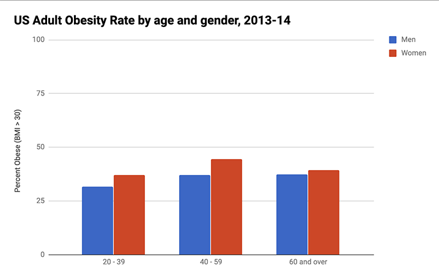
```

To create your own interactive grouped column (or bar) chart, use our template and follow these steps.

1. Open our [Grouped Column chart template in Google Sheets](https://docs.google.com/spreadsheets/d/1ltA9siijVSDkTE3fzB3UaWHO7dotBIrGH4R9wI_Qyqw/) with US obesity data by gender and age. Sign in to your account, and go to *File > Make a Copy* to save a version you can edit to your own Google Drive, as shown in Figure \@ref(fig:file-make-copy2).

(ref:file-make-copy2) Make your own copy of the Google Sheet template.

```{r file-make-copy2, out.width="250px", fig.cap="(ref:file-make-copy2)"}
 knitr::include_graphics("images/05-chart/file-make-copy2.png")
```

2. To remove the current chart from your copy of the spreadsheet, float your cursor to the top-right corner of the chart to make the 3-dot kebab menu appear, and select *Delete*, as shown in Figure \@ref(fig:delete-chart).

(ref:delete-chart) Float cursor in top-right corner of the chart to make the 3-dot kebab menu appear, and select Delete.

```{r delete-chart, out.width="180px", fig.cap="(ref:delete-chart)"}
 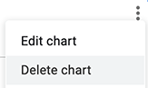
```

Note: Another name for the 3-dot menu symbol is the "kebab menu" because it resembles Middle Eastern
food cooked on a skewer, in contrast to the three-line "hamburger menu" on many mobile devices,
as shown in Figure \@ref(fig:menu-hamburger-kebab). Software developers must be hungry.

(ref:menu-hamburger-kebab) Distinguish between the hamburger verus kebab menu icons.

```{r menu-hamburger-kebab, fig.cap="(ref:menu-hamburger-kebab)"}
knitr::include_graphics("images/05-chart/menu-hamburger-kebab.png")
```

3. Format your data to make each column a data series (such as male and female), as shown in Figure \@ref(fig:column-grouped-data), which means it will display as a separate color in the chart. Feel free to add more than two columns.

4. Use your cursor to select only the data you wish to chart, then go to the *Insert* menu and select *Chart*, as shown in Figure \@ref(fig:column-grouped-insert).

(ref:column-grouped-insert) Select your data and Insert the Chart.

```{r column-grouped-insert, out.width="250px", fig.cap="(ref:column-grouped-insert)"}
 knitr::include_graphics("images/05-chart/column-grouped-insert.png")
```

7. In the Chart Editor, change the default selection to *Column chart*, with *Stacking none*, to display Grouped Columns, as shown in Figure \@ref(fig:column-grouped-editor). Or select *Horizontal bar chart* if you have longer labels.

(ref:column-grouped-editor) Change the default to Column chart, with Stacking none.

```{r column-grouped-editor, out.width="250px", fig.cap="(ref:column-grouped-editor)"}
 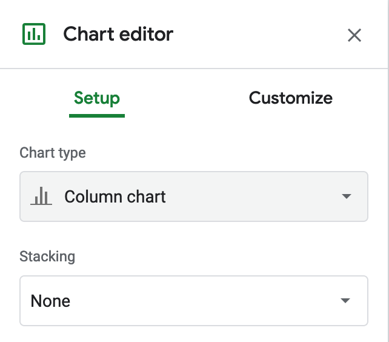
```

8. To customize title, labels, and more, in the Chart Editor select *Customize*, as shown in Figure \@ref(fig:chart-editor-customize). Also, you can select the chart and axis titles to edit them.

(ref:chart-editor-customize) Select Customize to edit title, labels, and more.

```{r chart-editor-customize, out.width="250px", fig.cap="(ref:chart-editor-customize)"}
 knitr::include_graphics("images/05-chart/chart-editor-customize.png")
```

9. To make your data public, go to the upper-right corner of your sheet to click the Share button, and in the next screen, click the words "Change to anyone with the link," as shown in Figure \@ref(fig:share-button-sheet). This means your sheet is no longer Restricted to only you, but can be viewed by anyone with the link. See additional options.

(ref:share-button-sheet) Click the Share button and then click *Change to anyone with the link* to make your data public.

```{r share-button-sheet, out.width="350px", fig.cap="(ref:share-button-sheet)"}
 knitr::include_graphics("images/05-chart/share-button-sheet-annotated.png")
```

10. To embed an interactive version of your chart in another web page, click the kebab menu in the upper-right corner of your chart, and select Publish Chart, as shown in Figure \@ref(fig:chart-publish). In the next screen, select Embed and press the Publish button. See [Chapter 8: Embed on the Web](embed.html) to learn what to do with the iframe code.

(ref:chart-publish) Select Publish Chart to embed an interactive chart on another web page.

```{r chart-publish, out.width="200px", fig.cap="(ref:chart-publish)"}
 knitr::include_graphics("images/05-chart/chart-publish.png")
```

Since there is no easy way to cite or link to your source data inside a Google Sheets chart, you will need to add this information to the text of the web page that contains your interactive chart. Remember that citing your data sources adds credibility to your work.

### Split Bar and Column Charts {-}
A split column (or bar) chart is best to compare categories in separate clusters. For example, imagine you wish to emphasize calorie counts for selected foods offered at two different restaurants, Starbucks and McDonalds. Format the restaurant data in vertical columns in your Google Sheet, as shown in Figure \@ref(fig:bar-split-data). Since food items are unique to each restaurant, only enter calorie data in the appropriate column, and leave other cells blank. Now you can easily create a split bar (or column) chart that displays the restaurant data in different clusters, as shown in Figure \@ref(fig:bar-split). Unlike the grouped column chart previously shown in Figure \@ref(fig:column-grouped), here the bars are separated from each other, because we do not wish to draw comparisons between food items that are unique to each restaurant. Also, our chart displays horizontal bars (not columns) because our some data labels are long.

(ref:bar-split-data) To create a split bar (or column) chart, format each data series vertically, and leave cells blank where appropriate.

```{r bar-split-data, out.width=500, fig.cap="(ref:bar-split-data)"}
 knitr::include_graphics("images/05-chart/bar-split-data.png")
```

(ref:bar-split) Split bar chart: Explore the [full-screen interactive version](https://docs.google.com/spreadsheets/d/e/2PACX-1vSkvNNrgYCpNtsaCRxn7g5o4UR8OJXSxBWvUK531t5vYubt39gecV9yLIfic89DCeJnGNvpRttFfKzn/pubchart?oid=787918829&format=interactive). Data from [Starbucks and McDonalds](https://docs.google.com/spreadsheets/d/1LGUYaVLoRcOiB8KcXb3Rn7LRj0exnUQYOy58LrkGPAk/edit#gid=956322126).

```{r bar-split, fig.cap="(ref:bar-split)"}
if(knitr::is_html_output()) knitr::include_url("https://docs.google.com/spreadsheets/d/1LGUYaVLoRcOiB8KcXb3Rn7LRj0exnUQYOy58LrkGPAk/pubchart?oid=1270431574&amp;format=interactive") else knitr::include_graphics("images/05-chart/bar-split.png")
```

Create your own version using our [Split Bar Chart in Google Sheets template](https://docs.google.com/spreadsheets/d/1LGUYaVLoRcOiB8KcXb3Rn7LRj0exnUQYOy58LrkGPAk/) with Starbucks and McDonalds data. Organize each data series vertically so that it becomes its own color in the chart. Leave cells blank when no direct comparisons are appropriate. The remainder of the steps are similar to the grouped column chart tutorial above.

### Stacked Bar and Column Charts {-}
Stacked column (or bar) charts are best to compare subcategories, or parts of a whole. For example, if you wish to compare the percentage of overweight residents across nations, format each weight-level data series in vertical columns in your Google Sheet, as shown in Figure \@ref(fig:column-stacked-data). Now you can easily create a stacked column (or bar) chart that displays comparisons of weight-level subcategories across nations, as shown in Figure \@ref(fig:column-stacked). Often it's better to use a stacked chart instead of multiple pie charts, because people can see differences more precisely in rectangular stacks than in circular pie slices.

(ref:column-stacked-data) To create a stacked column (or bar) chart, format each data series vertically in Google Sheets.

```{r column-stacked-data, out.width=450, fig.cap="(ref:column-stacked-data)"}
 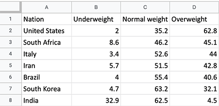
```

(ref:column-stacked) Stacked column chart: Explore the [interactive version](https://docs.google.com/spreadsheets/d/e/2PACX-1vSZrCP99EDqmpYc3VxFF5-Fpryh7KOU3GZ39Gl33OmDw4ecWKXxjrfzHDeQKfandKiUwvDkyF6kwK6L/pubchart?oid=307057605&format=interactive). Data from [WHO and CDC](https://docs.google.com/spreadsheets/d/1WS11EK33JCmvCRzSDh9UpP6R7Z2sHglF7ve5iJL6eZk/edit#gid=735710691).

```{r column-stacked, fig.cap="(ref:column-stacked)"}
if(knitr::is_html_output()) knitr::include_url("https://docs.google.com/spreadsheets/d/e/2PACX-1vSZrCP99EDqmpYc3VxFF5-Fpryh7KOU3GZ39Gl33OmDw4ecWKXxjrfzHDeQKfandKiUwvDkyF6kwK6L/pubchart?oid=307057605&amp;format=interactive") else 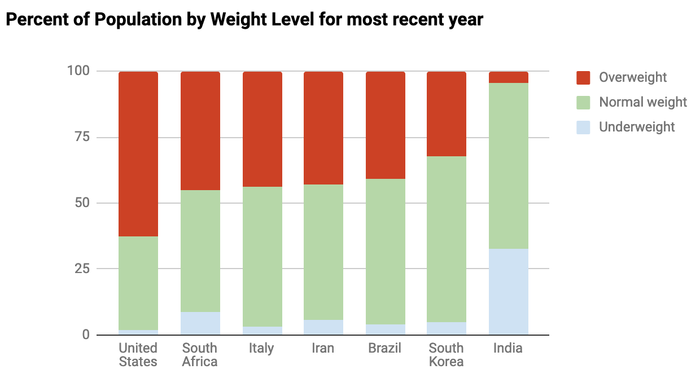
```

Create your own version using our [Stacked Column Chart in Google Sheets template](https://docs.google.com/spreadsheets/d/1WS11EK33JCmvCRzSDh9UpP6R7Z2sHglF7ve5iJL6eZk/) with international weight-level data. Organize each data series vertically so that it becomes its own color in the chart. In the Chart Editor window, choose *Chart Type > Stacked column chart* (or choose *Stacked bar chart* if you have long data labels). The rest of the steps are similar to the ones above.

To change the color of a data series (for example, to show Overweight category in red), click the kebab menu in the top-right corner of the chart, then go to *Edit Chart > Customize > Series*. Then choose the appropriate series from the dropdown menu, and set its color in the dropdown menu, as shown in Figure \@ref(fig:column-stacked-edit-series).

(ref:column-stacked-edit-series) To edit a column color, select *Edit Chart - Customize - Series*.

```{r column-stacked-edit-series, out.width="550px", fig.cap="(ref:column-stacked-edit-series)"}
 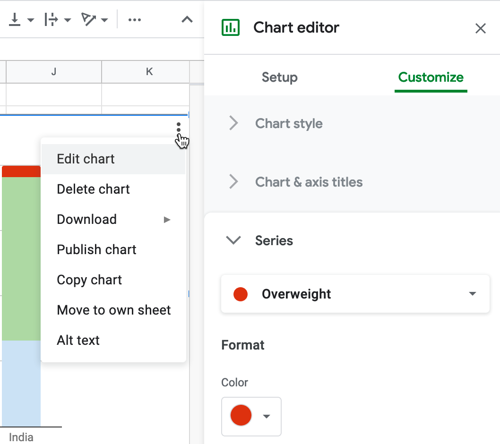
```

### Histograms {-}
A histogram is a specific type of bar or column chart that is best for showing the distribution of raw data, with the number of values in each bucket (or bin). To build a histogram, you need to assign each data point, whether numerical or categorical, into one of the non-overlapping buckets. For example, imagine that you wish to track the number of customers each hour in a local coffee shop. Format the raw customer data series in a vertical column in your Google Sheet, as shown in Figure \@ref(fig:histogram-data). Now you can easily create a histogram column chart that displays the number of customers per hour, as shown in Figure \@ref(fig:histogram), which resembles the "popular times" format for businesses in Google Maps. This coffee shop experiences a morning rush and an afternoon rush, but the middle of the day and late evenings are relatively quiet.

(ref:histogram-data) To create a histogram, format the raw data series vertically in Google Sheets.

```{r histogram-data, out.width=250, fig.cap="(ref:histogram-data)"}
 knitr::include_graphics("images/05-chart/histogram-data.png")
```

(ref:histogram) Histogram: Explore the [interactive version](https://docs.google.com/spreadsheets/d/e/2PACX-1vRyg09UZgGWVHPk3oOKAZ-zlqtDF_RpvOLdAsM-k-ZW5NavcxAyHbErgr-7dt7U_AFSVZONSTZ9sVII/pubchart?oid=509234663&format=interactive). Fictitious data on coffee shop customers.

```{r histogram, fig.cap="(ref:histogram)"}
if(knitr::is_html_output()) knitr::include_url("https://docs.google.com/spreadsheets/d/e/2PACX-1vRyg09UZgGWVHPk3oOKAZ-zlqtDF_RpvOLdAsM-k-ZW5NavcxAyHbErgr-7dt7U_AFSVZONSTZ9sVII/pubchart?oid=509234663&amp;format=interactive") else knitr::include_graphics("images/05-chart/histogram.png")
```

Create your own version using our [Histogram Chart in Google Sheets template](https://docs.google.com/spreadsheets/d/1V-r1bOWpvyCRhmJa0gRZ1TEchXvrr7UTZ97rKOU1WRo) with coffee shop customer data. Google Sheets considers histograms to be regular column charts, so in the Chart Editor window, choose *Chart Type > Column chart* and follow the rest of the directions in the Bar and Column Chart tutorial above. Alternatively, you could choose to sort customers into larger bins, such as time of day (morning, afternoon, evening), as shown in the second tab of the template.

Tip: We set a custom number format to display *8 AM* and other times as desired in the *Hour* column. In Google Sheets, select a column, then go to *Format > Number > More Formats > Custom Number Formats* to define your preferred format.

## --Pie, Line, and Area Charts {- #pie-line-area-google}
Before starting this section, be sure to review the [pros and cons of designing charts with Google Sheets](chart-google.html), as well as [beginner-level step-by-step instructions for creating bar and column charts](bar-column-google.html), in the previous sections of this chapter. In this section, you'll learn why and how to use Google Sheets to build three more types of interactive visualizations: pie charts (to show parts of a whole), line charts (to show change over time), and stacked area charts (to combine showing parts of a whole, with change over time). If Google Sheets or these chart types do not meet your needs, refer back to Table \@ref(tab:chart-types) for other tools and tutorials.

### Pie Charts {-}
Some people use pie charts to show parts of a whole, but we urge caution with this type of chart for reasons explained further below. For example, if you wish to show the number of different fruits sold by a store in one day, as a proportion of total fruit sold, then format the labels and values in vertical columns in your Google Sheet, as shown in Figure \@ref(fig:pie-data). Values can be expressed as either raw numbers or percentages. Now you can easily create a pie chart that displays these values as colored slices of a circle, as shown in Figure \@ref(fig:pie). Viewers can see that bananas made up slightly over half of the fruit sold, followed by apples and oranges.

(ref:pie-data) To create a pie chart, format the data values vertically in Google Sheets.

```{r pie-data, out.width=250, fig.cap="(ref:pie-data)"}
 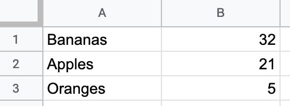
```

(ref:pie) Pie chart: Explore the [interactive version](https://docs.google.com/spreadsheets/d/e/2PACX-1vQai8YWkqMOHsiwWXpe1jyhBKy5wW6zcMaEIklkF-598h1QaVBrRR0F9JVrsX2Zo5ihXWP-HlnY-KlE/pubchart?oid=760990456&format=interactive). Data is fictitious.

```{r pie, fig.cap="(ref:pie)"}
if(knitr::is_html_output()) knitr::include_url("https://docs.google.com/spreadsheets/d/e/2PACX-1vQai8YWkqMOHsiwWXpe1jyhBKy5wW6zcMaEIklkF-598h1QaVBrRR0F9JVrsX2Zo5ihXWP-HlnY-KlE/pubchart?oid=760990456&amp;format=interactive") else 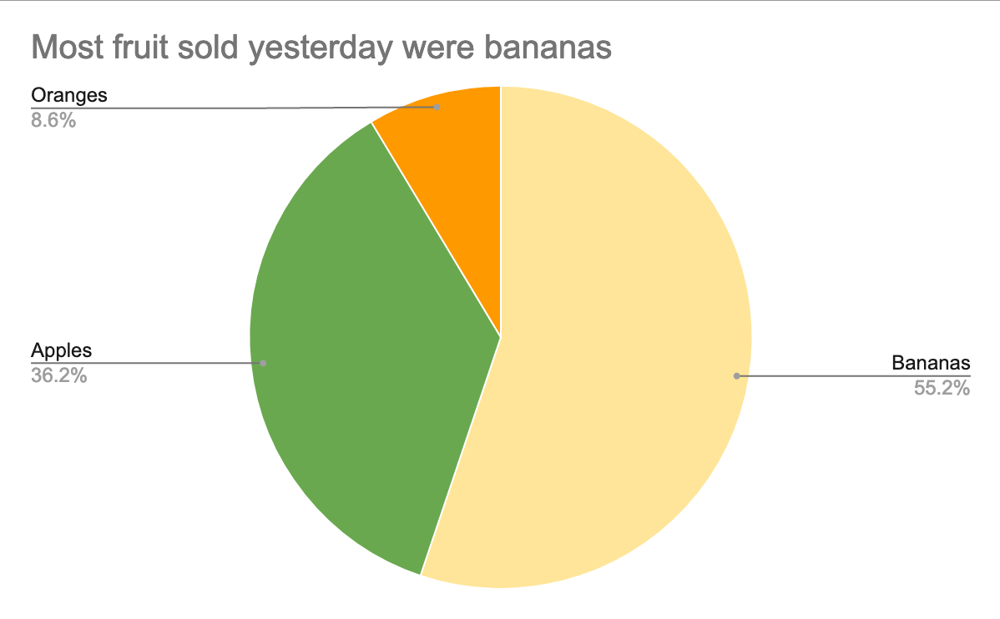
```

But you need to be careful when using pie charts, as we described in the [Chart Design section](chart-design.html) of this chapter. First, make sure your data adds up to 100 percent. If you created a pie chart that displayed *some* but *not all* of the fruits sold, it would not make sense. Second, avoid creating too many slices, since people cannot easily distinguish smaller ones. Ideally, use no more than 5 slices in a pie chart. Finally, start the pie at the top of the circle (12 o'clock) and arrange the slices clockwise, from largest to smallest.

Create your own version using our [Pie Chart in Google Sheets template](https://docs.google.com/spreadsheets/d/11cn0eysXqXIwhcTKmGuzMDw_RmpDpYLKZN3TeevT-Vg/). The steps are similar to those in prior Google Sheets chart tutorials in this chapter. Go to *File > Make a Copy* to create a version you can edit in your Google Drive. Select all of the cells and go to *Insert > Chart*. If Google Sheets does not correctly guess that you wish to create a pie chart, then in the Chart editor window, in the Setup tab, select *Pie chart* from the *Chart type* dropdown list.

Note that slices are ordered the same way they appear in the spreadsheet. Select the entire sheet and *Sort* the values column from largest to smallest, or from Z to A. In *Customize* tab of the Chart editor, you can change colors and add borders to slices. Then add a meaningful title and labels as desired.

### Line Charts {-}
A line chart is the best way to represent continuous data, such as change over time. For example, imagine you wish to compare the availability of different meats per capita in the US over the past century. In your Google Sheet, organize the time units (such as years) into the first column, since these will appear on the horizontal X-axis. Also, place each data series (such as beef, pork, chicken) alongside the vertical time-unit column, and each series will become its own line, as shown in Figure \@ref(fig:line-data). Now you can easily create a line chart that emphasizes each data series changed over time, as shown in Figure \@ref(fig:line). In the US, the amount of chicken per capita steadily rose and surpassed pork and beef around 2000.

(ref:line-data) To create a line chart, format the time units and each data series in vertical columns.

```{r line-data, out.width=300, fig.cap="(ref:line-data)"}
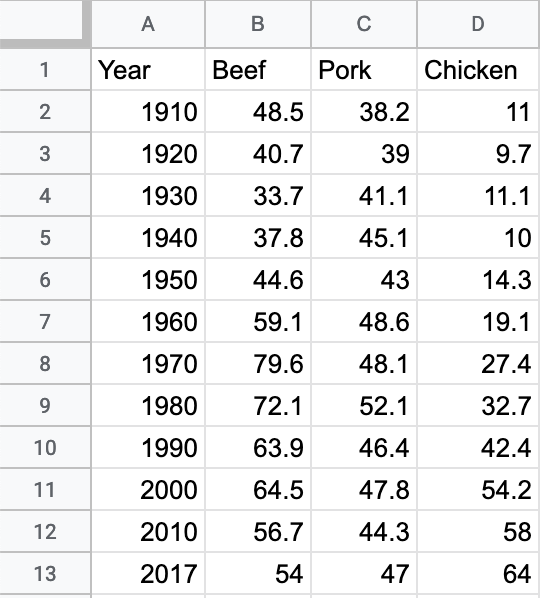
```

(ref:line) Line chart: Explore the [interactive version](https://docs.google.com/spreadsheets/d/e/2PACX-1vS38EC_34L8gKK9NStS8S322BzvBRbnRNpu9KXQ4oHHpaDmVMBAhEu4SXtCC6CD2yv_V6brX8s386Nf/pubchart?oid=2073830845&format=interactive). Data from [US Department of Agriculture](https://docs.google.com/spreadsheets/d/1wkWxxZ2-N5hqkcp7in8bxwdEcT1-XMnt1A8qUXxUSjw/edit?usp=sharing).

```{r line, fig.cap="(ref:line)"}
if(knitr::is_html_output()) knitr::include_url("https://docs.google.com/spreadsheets/d/e/2PACX-1vS38EC_34L8gKK9NStS8S322BzvBRbnRNpu9KXQ4oHHpaDmVMBAhEu4SXtCC6CD2yv_V6brX8s386Nf/pubchart?oid=2073830845&amp;format=interactive") else knitr::include_graphics("images/05-chart/line.png")
```

Create your own version using our [Line Chart in Google Sheets template](https://docs.google.com/spreadsheets/d/1wkWxxZ2-N5hqkcp7in8bxwdEcT1-XMnt1A8qUXxUSjw/). The steps are similar to those in prior Google Sheets chart tutorials in this chapter. Go to *File > Make a Copy* to create a version you can edit in your Google Drive. Select the data, and choose *Insert > Chart*. If Google Sheets does not correctly guess that you wish to create a line chart, in the Chart editor, Setup tab, select *Line chart* from the Chart type dropdown list.

### Stacked Area Charts {-}
Area charts resemble line charts with filled space underneath. The most useful type is a stacked area chart, which is best for combining two concepts from above: showing parts of the whole (like a pie chart) and continuous data over time (like a line chart). For example, the line chart above shows how the availability of three different meats changed over time. However, if you also wish to show how the total availability of these combined meats went up or down over time, it's hard to see this in a line chart. Instead, use a stacked line chart to visualize the availability of each meat *and* the total combined availability per capita over time. Stacked line charts show both aspects of your data simultaneously.

To create a stacked area chart, organize the data in the same way as you did for the line chart in Figure \@ref(fig:line-data). Now you can easily create a stacked line chart that displays the availability of each meat---and their combined total---over time, as shown in Figure \@ref(fig:stacked-area). Overall, we can see that total available meat per capita increased after the 1930s Depression, and chicken steadily became a larger portion of the total after 1970.

(ref:stacked-area) Stacked area chart: Explore the [interactive version](https://docs.google.com/spreadsheets/d/e/2PACX-1vSotrM_zZDo0MT--JgXwA3nBQudzIwmt8TGwmZxvUxNUzPrfBgqso5glLn05ObJxdTTmKoT_fQWQMx-/pubchart?oid=1976471326&format=interactive). Data from [US Department of Agriculture](https://docs.google.com/spreadsheets/d/16QR4prVUoztW6bFVyj_q0n8GjNWqkcW6sgAkIyHQIJc/edit?usp=sharing).

```{r stacked-area, fig.cap="(ref:stacked-area)"}
if(knitr::is_html_output()) knitr::include_url("https://docs.google.com/spreadsheets/d/e/2PACX-1vSotrM_zZDo0MT--JgXwA3nBQudzIwmt8TGwmZxvUxNUzPrfBgqso5glLn05ObJxdTTmKoT_fQWQMx-/pubchart?oid=1976471326&amp;format=interactive") else 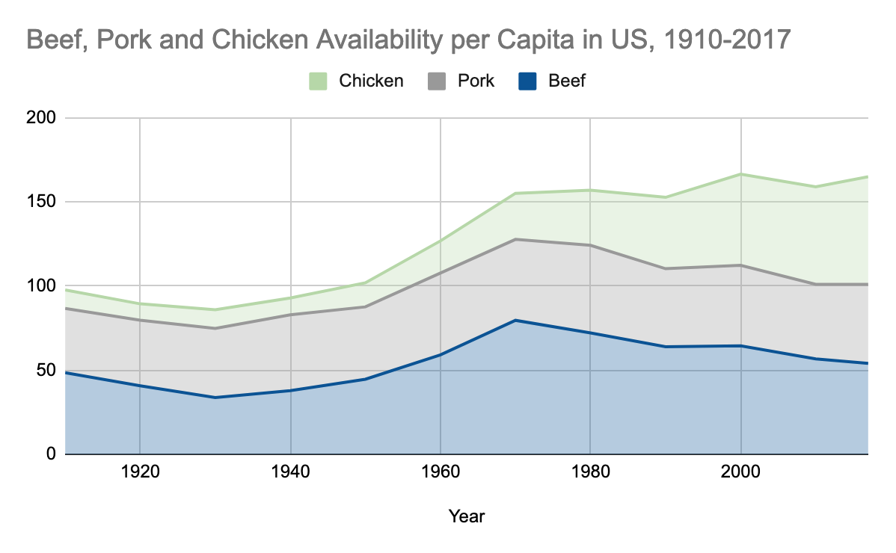
```

Create your own version using our [Stacked Area Chart in Google Sheets template](https://docs.google.com/spreadsheets/d/16QR4prVUoztW6bFVyj_q0n8GjNWqkcW6sgAkIyHQIJc/). The steps are similar to those in prior Google Sheets chart tutorials in this chapter. Go to *File > Make a Copy* to create a version you can edit in your Google Drive. Set up the data exactly as you would for a line chart, with the first column for time units in the X-axis, and place each data series in its own column. Select the data, and choose *Insert > Chart*. In the Chart editor, in tab Setup, select  *Stacked area chart* from the Chart type dropdown list.


## Datawrapper Charts {- #chart-datawrapper}
TODO: Introduce Datawrapper, discuss pros and cons over Google Sheets charts... preview next sections.

REWRITE: tutorial was adapted from the [Datawrapper training materials](https://www.datawrapper.de/training-materials/) and [gallery of examples](https://www.datawrapper.de/tables/), which we highly recommend.

https://academy.datawrapper.de/

If Datawrapper or these chart types do not meet your needs, refer back to Table \@ref(tab:chart-types) for other tools and tutorials.

## --Annotated Charts {- #annotated-datawrapper}
TODO: maybe annotated line chart?

## --Range Charts {- #range-datawrapper}
TODO


## --Scatter and Bubble Charts {- #scatter-bubble-datawrapper}
Scatter charts (also known as XY charts or scatter plots) are best to show the relationship between two datasets, by displaying dots on a grid to represent their XY coordinates. In the scatter chart example below, each dot represents a nation, with its life expectancy on the horizontal X axis and its fertility rate on the vertical Y axis. The overall dot pattern illustrates a correlation between these two datasets: life expectancy increases while fertility decreases.

Bubble charts go further than scatter charts by adding two more visual elements---dot size and color---to represent a third or fourth dataset. The bubble chart example further below begins with the same life expectancy and fertility data for each nation that we previously saw in the scatter chart, but now the size of each circular dot represents a third dataset (population) and its color indicates a fourth dataset (region of the world). As a result, bubble charts are scatter charts on steroids, because they pack more information into the visualization.

Fancier bubble charts introduce one more visual element---animation---to represent a fifth dataset, such as change over time. Although creating an animated bubble chart is beyond the scope of this book, watch a famous [TED talk by Hans Rosling](https://www.ted.com/talks/hans_rosling_the_best_stats_you_ve_ever_seen),
a renowned Swedish professor of global health, to see animated bubble charts in action, and learn more about his work at the [Gapminder Foundation](https://www.gapminder.org/).

In this section, you'll learn why and how to create a scatter chart and a bubble chart in Datawrapper. Be sure to read about the [pros and cons of designing charts with Datawrapper in the prior section](chart-datawrapper.html).

### Scatter Charts {-}
A scatter chart is best to show the relationship between two sets of data as XY coordinates on a grid. Imagine you wish to compare life expectancy and fertility data for different nations. Organize your data in three columns, as shown in Figure \@ref(fig:scatter-data). The first column contains the *Country* labels, and the second column, *Life Expectancy*, will appear on the horizontal x-axis, while the third column, *Fertility*, will appear on the vertical y-axis. Now you can easily create a scatter chart that displays a relationship between these datasets, as shown in Figure \@ref(fig:scatter). One way to summarize the chart is that nations with lower fertility rates (or fewer births per woman) tend to have high life expectancy rates. But another way to phrase it is that nations with higher life expectancy at birth have lower fertility. Remember that correlation is not causation, so you cannot use this chart to argue that fewer births produce longer lives, or that longer-living females create fewer children.

(ref:scatter-data) To create a scatter chart in Datawrapper, format data in three columns: labels, x-values, and y-values.

```{r scatter-data, out.width=350, fig.cap="(ref:scatter-data)"}
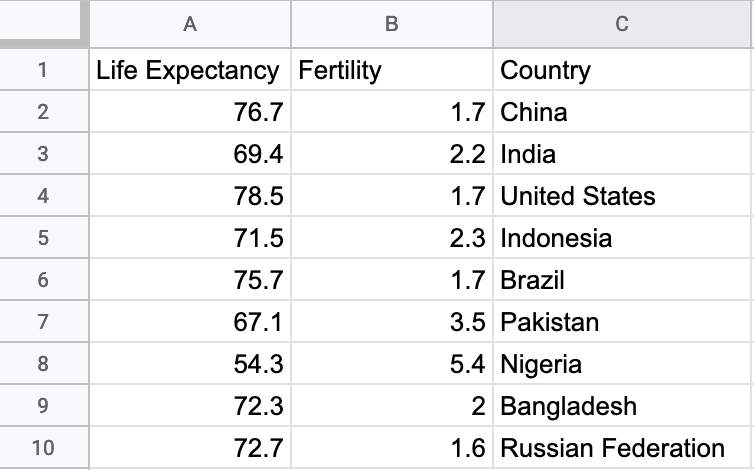
```

(ref:scatter) Scatter chart: Explore the [interactive version](https://datawrapper.dwcdn.net/8OQz7/1/). Data from the [World Bank](https://docs.google.com/spreadsheets/d/1LJCj3RaVgaQsAZriV_JDQhBrIBSvnH_N1LBCkZK1bqs/).

```{r scatter, fig.cap="(ref:scatter)"}
if(knitr::is_html_output()) knitr::include_url("https://datawrapper.dwcdn.net/8OQz7/1/") else knitr::include_graphics("images/05-chart/scatter.png")
```

Create your own interactive scatter chart in Datawrapper, and edit the tooltips to properly display your data:

1. Open our [Scatter Chart sample data in Google Sheets](https://docs.google.com/spreadsheets/d/1bKY6RSNOXnwUMbLclEwHC_E9meLmwlfTcnxOF85wUjA/edit#gid=0), or use your own data in a similar format.

2. Open [Datawrapper](https://datawrapper.de) and click to start a new chart.

3. In the Datawrapper *Upload Data* screen, either copy and paste the link to the data tab of the Google Sheet above, or copy and directly paste in the data. Click *Proceed*.

4. In the *Check and Describe* screen, inspect your data and make sure that the *Life Expectancy* and *Fertility* columns are blue, which indicates numeric data. Click *Proceed*.

5. In the *Visualize* screen, under the *Chart type* tab, select *Scatter Plot*. Float your cursor over the scatter chart that appears in the right-hand window, and you'll notice that we still need to edit the tooltips to properly display data for each point.

6. In the *Visualize* screen, under the *Annotate* tab, scroll down to *Customize tooltip*, and click *edit tooltip template*. In the *Customize tooltip HTML* window, click inside the *Title* field and click on the blue column name *Country* to add it there. The *Title* field now appears as `{{ Country }}`, which means that the proper country name will appear in the tooltip when you hover over each point. In addition, click inside the *Body* field, type `Life expectancy: `, then click the blue column with the same name to add it, so that `{{ Life_expectancy }}` appears after it. Press *return* twice on your keyboard, then type `Fertility: ` and click on the blue column with the same name to add it, so that `{{ Fertility }}` appears right after it, as shown in Figure \@ref(fig:scatter-tooltip-editor). Press *Save* to close the tooltip editor window.

(ref:scatter-tooltip-editor) In the tooltip editor window, type and click column headers to customize the display.

```{r scatter-tooltip-editor, fig.cap="(ref:scatter-tooltip-editor)"}
knitr::include_graphics("images/05-chart/scatter-tooltip-editor.png")
```

7. Back in the *Visualize* screen, when you hover your cursor over a point, the tooltip will properly display its data according to your editor settings above, as shown in Figure Figure \@ref(fig:scatter-tooltip).

(ref:scatter-tooltip) Hover over a data point to inspect the edited tooltip display.

```{r scatter-tooltip, out.width=400, fig.cap="(ref:scatter-tooltip)"}
knitr::include_graphics("images/05-chart/scatter-tooltip.png")
```

8. Finish the annotations to add your title and data source, then proceed to publish and embed your chart, as described in [Chapter 8: Embed on Your Web](embed.html).

### Bubble Charts {-}
In your scatter chart above, you learned how to visualize the relationship between two datasets: life expectancy (the X-axis coordinate) and fertility (the Y-axis coordinate). Now let's expand on this concept by creating a bubble chart that adds two more datasets: population (shown by the size of each point, or bubble) and region of the world (shown by the color of each bubble). We'll use similar World Bank data as before, with two additional columns, as shown in Figure \@ref(fig:bubble-data). Note that we're using numeric data (population) for bubble size, but categorical data (regions) for color. Now you can easily create a bubble chart that displays a relationship between these four datasets, as shown in Figure \@ref(fig:bubble).

(ref:bubble-data) To create a bubble chart in Datawrapper, organize the data into five columns: labels, x-axis, y-axis, bubble size, bubble color.

```{r bubble-data, out.width=400, fig.cap="(ref:bubble-data)"}
knitr::include_graphics("images/05-chart/bubble-data.png")
```

(ref:bubble) Bubble chart: Explore the [interactive version](https://datawrapper.dwcdn.net/ZX9QR/1/). Data from the [World Bank](https://docs.google.com/spreadsheets/d/1yiZ975_uXOTOd0OCAdrR_s-bQFs7za3dar69IXPo6Xg).

```{r bubble, fig.cap="(ref:bubble)"}
if(knitr::is_html_output()) knitr::include_url("https://datawrapper.dwcdn.net/ZX9QR/1/") else 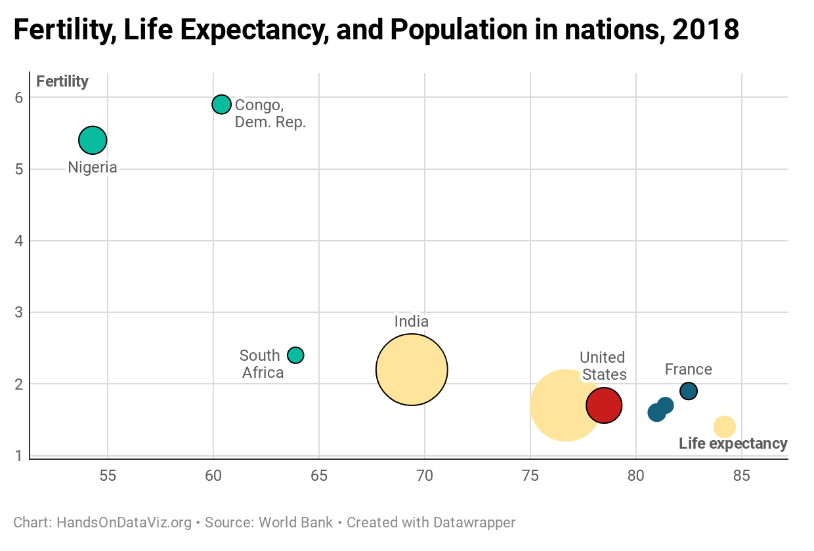
```

Create your own interactive bubble chart in Datawrapper, and edit the tooltips, bubble sizes, and colors to display your data:

1. Open our [Scatter Chart sample data in Google Sheets](https://docs.google.com/spreadsheets/d/1yiZ975_uXOTOd0OCAdrR_s-bQFs7za3dar69IXPo6Xg/edit#gid=0), or use your own data in a similar format.

2. Open [Datawrapper](https://datawrapper.de) and click to start a new chart.

3. Follow steps 3-5 above to upload, check, and visualize the data as a *Scatter Plot* chart type.

4. In the *Visualize* screen, under the *Annotate* tab, scroll down to *Customize tooltip*, and click *edit tooltip template*. In the *Customize tooltip HTML* window, type in the fields and click on the blue column names to customize your tooltips to display country, life expectancy, fertility, and population, as shown in Figure \@ref(fig:bubble-tooltip-editor). Press *Save* to close the tooltip editor window.

(ref:bubble-tooltip-editor) In the tooltip editor window, type and click column headers to customize the display.

```{r bubble-tooltip-editor, fig.cap="(ref:bubble-tooltip-editor)"}
knitr::include_graphics("images/05-chart/bubble-tooltip-editor.png")
```

5. Back in the *Visualize* screen, under the *Refine* tab, scroll down to *Color*, select column for *Region*, and click the *customize colors* button to assign a unique color to each. Then scroll down to *Size*, check the box to change size to *variable*, select column for *Population*, and increase the max size slider, as shown in Figure \@ref(fig:bubble-color-size). Click *Proceed*.


(ref:bubble-color-size) In the *Visualize* screen, modify the bubble colors and set size to variable.

```{r bubble-color-size, fig.cap="(ref:bubble-color-size)"}
knitr::include_graphics("images/05-chart/bubble-color-size.png")
```

6. Test your visualization tooltips. Then finish the annotations to add your title and data source, and proceed to publish and embed your chart, as described in [Chapter 8: Embed on Your Web](embed.html).

For more information about creating scatter and bubble charts, see the [Datawrapper Academy support site](https://academy.datawrapper.de/). In the next section, you'll learn how to create an interactive filtered line chart using a different visualization tool, Tableau Public.


## Tableau Public Charts {- #chart-tableau}
TODO: Start again here

Tableau is powerful data visualization software used by many professionals and organizations
to analyze and present data. Tableau can combine multiple datasets to show in a single chart (or a map),
and allows to create dashboards with multiple visualizations. Individual visualizations
and dashboards can be published and embedded on your website through an iframe.

This book focuses on the free [Tableau Public tool](https://public.tableau.com), available to download for Mac or Windows. This free version of Tableau Public is very similar to the pricier versions that the company sells, but one constraint is that the data visualizations you create will be public, as the name suggests, so do not use it for any sensitive or confidential data that should not be shared with others.

TODO: REFRAME into pros and cons...

You might be overwhelmed
by the amount of options and features Tableau provides through its interface.
We will show you the very basics enough to get started, and if you want to
dive further, there are many great books on Tableau available.

You can download Tableau Public for Windows or Mac from Tableau's [official
website](https://public.tableau.com). You will need to provide your email address.

In this book, we will show you how to add datasets to Tableau Public, and how to [create a scatterplot](scatter-chart-tableau.html)
and a [filtered line chart](filtered-line-chart-tableau.html).

Just to remind you, scatter charts plot two variables
against each other, on x- and y-axis, revealing possible correlations.
With Tableau Public, you can create an interactive scatter chart,
letting users hover over points to view specific details.

Figure \@ref(fig:tableau-xy-demo) illustrates a
strong relationship between Connecticut school district income and
test scores.

(ref:tableau-xy-demo) This scatterplot is made in Tableau Public an shows the relationship between household income and test scores in Connecticut school districts.

```{r tableau-xy-demo, fig.cap="(ref:tableau-xy-demo)"}
if(knitr::is_html_output()) knitr::include_url("https://public.tableau.com/views/CTSchoolDistrictsbyIncomeandGradeLevels2009-13/Sheet1?:showVizHome=no&:embed=true", height="500px") else knitr::include_graphics("images/05-chart/tableau-xy-demo.png")
```

## REMOVE????--XY Scatter Chart {- #scatter-chart-tableau}

If you wish to use the dataset from the scatter plot in Figure \@ref(fig:tableau-xy-demo),
you can [download the sample Excel file](data/ct-districts-income-grades-2009-13.xlsx).
This data file consists of three columns: district, median household income, and grade levels
(above/below national average for 6th grade Math and English test scores).
The Notes tab explains how this data is based on the work of Sean Reardon et al.
at the [Stanford Education Data Archive](http://purl.stanford.edu/db586ns4974),
Motoko Rich et al. at [The New York Times](http://www.nytimes.com/interactive/2016/04/29/upshot/money-race-and-success-how-your-school-district-compares.html),
Andrew Ba Tran at [TrendCT](http://trendct.org/2016/05/06/wealth-and-grades-compare-connecticuts-school-districts/),
and the American Community Survey 2009-13 via [Social Explorer](http://socialexplorer.com).

#### Connect Data and Create a Scatterplot {-}

Tableau Public's welcome page includes three sections: Connect, Open, and Discover.

1. Under Connect, choose Microsoft Excel if you decided to use the sample dataset
or your own Excel file. To load a CSV file, choose *Text file*.
If your data is in Google Sheets, click *More...* and choose Google Sheets.
Once you successfully connect to your data source, you will see it under Connections
in the Data Source tab. Under Sheets, you will see two tables, `data` and `notes`.

2.  Drag `data` sheet into *Drag tables here* area, like is shown in Figure \@ref(fig:tableau-connect).
You will see the preview of the table under the drag-and-drop area.
You have successfully connected one data source to Tableau Public, and you are ready
to build your first chart.

(ref:tableau-connect) Drag `data` sheet into *Drag tables here* area.

```{r tableau-connect, fig.cap="(ref:tableau-connect)"}
knitr::include_graphics("images/05-chart/tableau-connect-annotated.png")
```

<!-- TODO: Let's find out whether real first-time users can follow these steps! -->

3. Go to *Sheet 1* tab (in the lower-left corner of the window) to view your worksheet.
Although it may feel overwhelming at first, the key is learning
where to drag items from the Data pane (left) into the main worksheet.
Tableau marks all data fields as blue (discrete values, mostly text fields or numeric labels)
or green (continuous values, mostly numbers).

4. Drag the *Grade Levels* field into the *Rows* field above the charting area, which
for now is just empty space. You can consult Figure \@ref(fig:tableau-xy-dragging) for this
and two following steps.
Tableau will apply a summation function to it, and you will see the `SUM(Grade Levels)` appearing
in the Rows row, and a blue bar in the charting area. It makes little sense so far, so let's
plot another data field.

5. Drag *Median Household Income* to the *Columns* field (just above the Rows field).
Tableau will once again apply the summation function, so you will see `SUM(Median Household Income)`
in the Columns. The bar chart will transform into a scatter chart with just one data point
in the upper-right corner. That is because the data for both is aggregated (remember the `SUM` function).

6. We want to tell Tableau to disaggregate the household and grade levels variables. To do so,
drag *District* dimension into the *Detail* box of the Marks card. You will now see
a real scatter chart in the charting area. If you hover over points, you will see all three
values associated with it.

(ref:tableau-xy-dragging) Drag data fields to the right places in Tableau.

```{r tableau-xy-dragging, fig.cap="(ref:tableau-xy-dragging)"}
knitr::include_graphics("images/05-chart/tableau-xy-dragging-annotated.png")
```

#### Add Title and Caption, and Publish {-}

Give your scatter chart a meaningful title by double-clicking on default *Sheet 1* title
above the charting area.

You will normally need to provide additional information about the chart,
such as source of the data, who built the visualization and when, and other
important things. You can do so inside a Caption, a text block that accompanies
your Tableau visualization. In the menu, go to *Worksheet > Show Caption*. Double-click
the Caption block that appeared, and edit the text.

As a result, your final worksheet will look like shown in Figure \@ref(fig:tableau-xy-final).

(ref:tableau-xy-final) This scatter chart is ready to be published.

```{r tableau-xy-final, fig.cap="(ref:tableau-xy-final)"}
knitr::include_graphics("images/05-chart/tableau-xy-final-annotated.png")
```

Tip: In the dropdown above Columns section, change *Standard* to *Fit Width*
to ensure your chart occupies 100% of available horizontal space.

To publish the chart to the web,

1. Go to *File > Save to Tableau Public As...*. A window to sign in to your account will pop up.
If you don't have an account, click *Create one now for free* at the bottom.

2. Once signed in, a window to set the workbook title will appear. Change the default *Book1* title
to something meaningful, as this name will appear in the URL for your published work. Click Save.

3. Once the dashboard is saved, Tableau Public will open up a window in your default browser
with the visualization. In the green ribbon above the chart, click *Edit Details*
to edit the title or description. Under *Toolbar Settings*, see checkbox to
*Allow others to download or explore and copy this workbook and its data*
(Figure \@ref(fig:tableau-toolbar-settings)), and enable/disable
it as you think is appropriate. As advocates for open and accessible data, we recommend
leaving the box checked.

(ref:tableau-toolbar-settings) This scatter chart is ready to be published.

```{r tableau-toolbar-settings, fig.cap="(ref:tableau-toolbar-settings)"}
knitr::include_graphics("images/05-chart/tableau-toolbar-settings-annotated.png")
```

See the [Embed Tableau Public on Your Website](embed-tableau.html) section of this book to insert the interactive version of your chart on a web page that you control.

Tip: Your entire portfolio of Tableau Public visualizations is online at `https://public.tableau.com/profile/USERNAME`,
where `USERNAME` is your unique username.

To learn more, see [Tableau Public resources page](https://public.tableau.com/en-us/s/resources).


## --Filtered Line Chart {- #filtered-line-chart-tableau}

One of the advantages of interactive visualizations over static (including printed)
is the ability to store a lot more data, and show it only when required.
In other words, an interactive visualization can be made into a data-exploration tool
that won't overwhelm the viewer at first sight, but will allow the viewer
to "dig" and find specific data points and patterns.

In this tutorial, we will build an interactive filtered line chart with Tableau Public
like is shown in Figure \@ref(fig:tableau-filtered-demo).
The filter will be a collection of checkboxes that allow to add/remove lines
from the chart. Viewers can hover over each line to identify the school
name and data attached to it.

We will use % Population with Internet Access by the World Bank. You can download the dataset
[here](data/world-bank-internet-users-1995-2018.csv).

(ref:tableau-filtered-demo) Internet Access by Country, 1995–2018.

```{r tableau-filtered-demo, fig.cap="(ref:tableau-filtered-demo)"}
if(knitr::is_html_output()) knitr::include_url("https://public.tableau.com/views/InternetAccessbyCountry/Sheet1?:showVizHome=no&:embed=true", height="500px") else knitr::include_graphics("images/05-chart/tableau-filtered-demo.png")
```

We assume that you have Tableau installed. If not, see the previous tutorial, [Create XY Scatter Chart with Tableau Public](scatter-chart-tableau.html).

#### Connect Text File and Build a Line Chart {-}

Open Tableau Public, and under Connect menu, choose *Text file*.
Tableau may or may not have imported the table automatically. If you see the preview of the table
with three columns: *Country Name*, *Year*, and *Percent Internet Users*, you can proceed to Sheet 1.

If not, drag and drop the file (under Files section in the left) to the *Drag tables here* area.
Once you see the preview, go to Sheet 1.

Your variables will be listed under Tables in the left-hand side. The original variables
are displayed in normal font, the *generated* variables will be shown in *italics*
(such as *Latitude* and *Longitude* that Tableau guessed from the country names).

To build a line chart,

1. Drag Year variable to *Columns*.
2. Drag Percent Internet Users variable to *Rows*. The variable will change to `SUM(Percent Internet Users)`.
You should see a single line chart that sums up percentages for each year. That is completely incorrect, so let's fix it.
3. In order to "break" aggregation, drag and drop Country Name to the Color box of the Marks card.
Tableau will warn you that the recommended number of colors should not exceed 20. Since we will be adding filtering,
we don't care about it much. So go ahead and press *Add all members* button.
4. Now you should see an absolute spaghetti plate of lines and colors. To add filtering,
drag *Country Name* to the Filters card. In the Filter window, make sure all countries
are checked, and click *OK*.
5. Right-click on *Country Name* pill in Filters card, and check Show Filter (see Figure \@ref(fig:tableau-filtered-show-filter))
6. You will see a list of options with all checkboxes on have appeared to the right of the visualization.
Click *(All)* to add/remove all options, and add a few of your favorite countries to see
how the interactive filtering works.

(ref:tableau-filtered-show-filter) After you drag Country Name to the Filters card, make sure the Filter is displayed.

```{r tableau-filtered-show-filter, out.width="220px", fig.cap="(ref:tableau-filtered-show-filter)"}
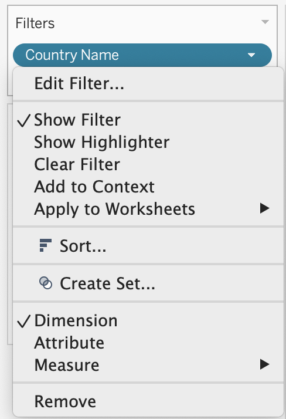
```

#### Add Title and Caption, and Publish {-}

Replace *Sheet 1* title (above the chart) with "Internet Access by Country, 1995–2018" by double-clicking on it.
In the menu, go to *Worksheet > Show Caption* to add a Caption block under the chart.
Use this space to add source of your data (World Bank), and perhaps credit yourself as
the author of this visualization.

Change *Standard* to *Fit Width* in the dropdown above the Columns field.

You may notice that the x-axis (Year) starts with 1994 and ends with 2020,
although our data is for 1995–2018. Double-click on the x-axis, and change
*Range* from *Automatic* to *Fixed*, with the Fixed start of `1995`, and the Fixed end of `2018`.
Close the window and see that the empty space on the edges has disappeared.

Once your filtered line chart looks like the one shown in Figure \@ref(fig:tableau-filtered-ready),
you are ready to publish.

(ref:tableau-filtered-ready) This workbook is ready to be published.

```{r tableau-filtered-ready, fig.cap="(ref:tableau-filtered-ready)"}
knitr::include_graphics("images/05-chart/tableau-filtered-ready.png")
```

To publish the filtered line chart to the web, go to *File > Save to Tableau Public As...*.
You may be prompted with the window to log in to your account (or create one if you don't have it yet).
The next steps are fairly self-explanatory, and you can consult
[the previous tutorial](scatter-chart-tableau.html) for more information on publishing.

See the [Embed Tableau Public on Your Website](embed-tableau.html) section of this
book to insert the interactive version of your chart on a web page that you control.

### Summary {- #summary5}

Congratulations on creating interactive charts that pull readers deeper into your story, and encourage them to explore the underlying data! As you continue to create more, always match the chart type to your data format and the story you wish to emphasize. Also, design your charts based on the principles and aesthetic guidelines in this chapter.
While anyone can click a few buttons to quickly create a chart nowadays, your audiences will greatly appreciate well-designed charts that thoughtfully call their attention to meaningful patterns in the data.

The next chapter on [Map Your Data](map.html) follows a similar format to introduce different map types, design principles, and hands-on tutorials to create interactive visualizations with spatial data. Later you'll learn how to [embed interactive charts on your web](embed.html) in chapter 8.

To learn about more powerful charting tools, see [Chart.js and Highcharts templates](chartcode.html) in chapter 9, which give you ever more control over how your design and display your data, but also requires learning how to [edit and host code templates with GitHub](github.html) in chapter 9.
