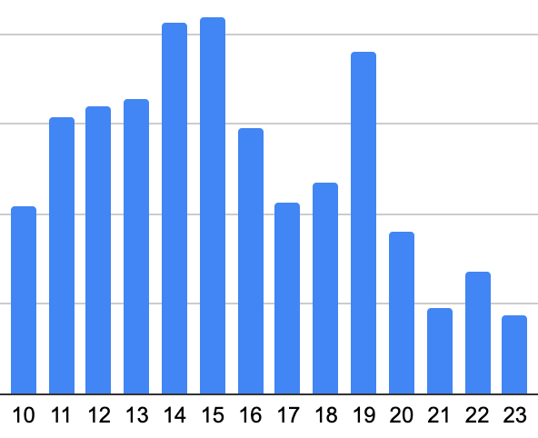
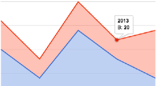
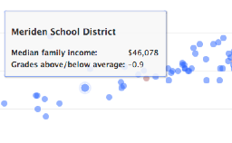
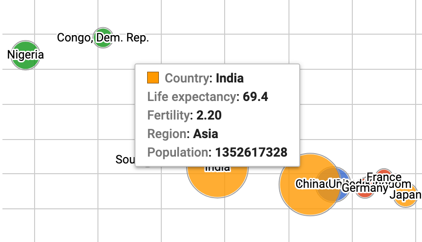

# Chart Your Data {#chart}
*by [Jack Dougherty and Ilya Ilyankou](authors), last updated March 6, 2020*

Charts pull readers deeper into your story. Even if your data contains geographical information, sometimes a chart tells your story better than a map. But designing meaningful, interactive charts requires careful thought about how to communicate your data story with your audience. In this chapter, you will learn how to:

- Practice [principles of chart design](chart-design). Learn to identify good charts from bad ones.
- Choose a chart type that matches your story and data format, and follow tutorials in the table below. Beginners may start with easy-to-learn tools such as [Google Sheets](chart-google-sheets) or [Tableau Public](tableau-public), then move up to more powerful tools, such as [Chart.js](chartjs), which require you to [Modify and Host Code Templates with GitHub](github) or another web host.

See also related chapters in this book:

- [Draw and write your data story](draw) to capture your ideas on paper
- [Improve spreadsheet skills](spreadsheet), [Find and know your data](find), and [Clean your data](clean)
- [Embed your interactive chart on your website](embed)
- [Detect bias in data stories](detect), including [How to lie with charts](how-to-lie-with-charts)
- [Tell your data story](story), including its most meaningful insights and limitations

| Basic chart types | Best use and tutorial chapters |
| --- | --- |
| Grouped column or bar   | Best to compare categories side-by-side. Vertical columns, or horizontal bars for long labels.  Easy tool: [Google Sheets bar and column tutorial](column-bar-google) Power tool: [Chart.js templates](chartjs) |
| Separated column or bar   | Best to compare categories in separate clusters. Vertical columns, or horizontal bars for long labels. Easy tool: [Google Sheets bar and column tutorial](column-bar-google) Power tool: [Chart.js templates](chartjs) |
| Stacked column or bar   | Best to compare sub-categories, or parts of a whole. Vertical columns, or horizontal bars for long labels. Easy tool: [Google Sheets bar and column tutorial](column-bar-google) Power tool: [Chart.js templates](chartjs) |
| Histogram   | Best to show distribution of raw data, with number of values in each bucket. Easy tool: [Google Sheets bar and column tutorial](column-bar-google) Power tool: [Chart.js templates](chartjs) |
| Pie chart   | Best to show parts of a whole, but hard to estimate size of slices. Easy tool: [Google Sheets pie chart tutorial](pie-line-area-google) Power tool: [Chart.js templates](chartjs) |
| Line chart   | Best to show continuous data, such as change over time. Easy tool: [Google Sheets line chart tutorial](pie-line-area-google) Power tool: [Chart.js templates](chartjs) |
| Filtered line chart    | Best to show multiple lines of continuous data, with on-off toggle buttons.  Easy tool: [Tableau Public filtered line chart tutorial](filtered-line-chart-tableau) |
| Stacked area chart   | Best to show parts of a whole, with change over time.  Easy tool: [Google Sheets stacked area tutorial](pie-line-area-google) Power tool: [Chart.js templates](chartjs) |
| Scatter chart    | Best to show relationship between two sets of data. Also called an XY chart.  Easy tool: [Google Sheets scatter chart tutorial](scatter-bubble-google) or [Tableau Public scatter chart tutorial](scatter-chart-tableau) Power tool: [Chart.js templates](chartjs) |
| Bubble chart    | Best to show relationship between three or four sets of data, using bubble size and color. Easy tool: [Google Sheets bubble chart tutorial](scatter-bubble-google) Power tool: [Chart.js templates](chartjs) |

#### For more advanced chart types and tutorials {-}
- [Google Sheets Chart types help page](https://support.google.com/docs/answer/190718)
- [Tableau Public resources page](https://public.tableau.com/en-us/s/resources)
- [Chart.js samples page](https://www.chartjs.org/samples/latest/)
