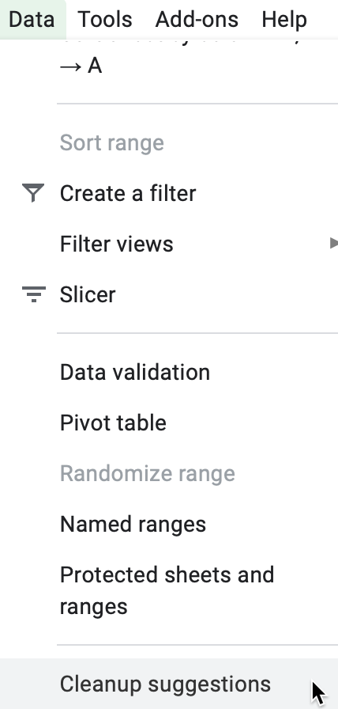
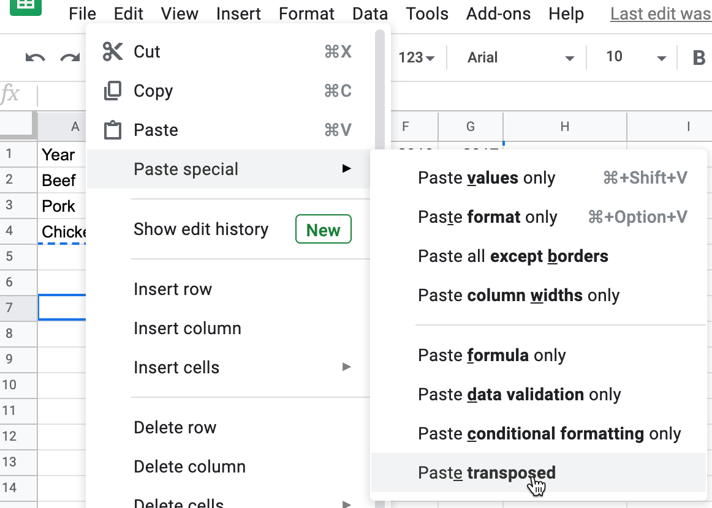
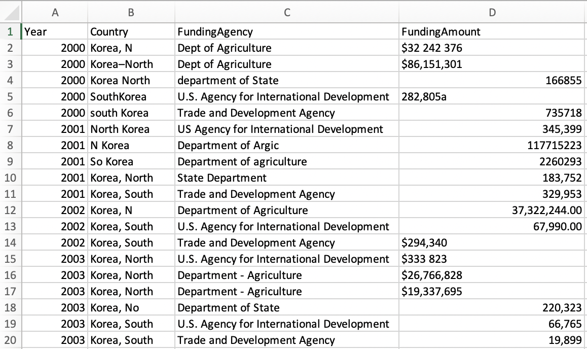
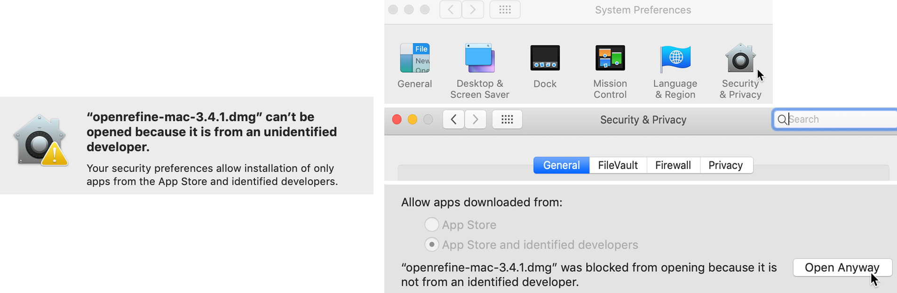

# Clean Up Messy Data {#clean}

More often than not, datasets will be messy and hard to visualize right away.
They will have missing values, dates in different formats, text in numeric-only columns, multiple items in the same columns, various spellings of the same name, and other unexpected things. See Figure \@ref(fig:clean-up-messy-data) for inspiration. Don't be surprised if you find yourself spending more time cleaning up data than you do analyzing and visualizing it.

(ref:clean-up-messy-data) More often than not, raw data looks messy.

```{r clean-up-messy-data, out.width=500, fig.cap="(ref:clean-up-messy-data)"}
knitr::include_graphics("images/05-clean/clean-up-messy-data.png")
```

In this chapter you'll learn about different tools, in order to help you make decisions about which one to use to clean up your data efficiently. First, we'll start with basic cleanup methods using Google Sheets, such as its [Smart Cleanup feature](smart-cleanup.html) to fix inconsistent data and remove duplicates, [find and replace with a blank](find-and-replace.html), [tranpose rows and columns of data](transpose.html), [split data into separate columns](split-data.html), and [combine columns into one](combine-data.html). While we feature Google Sheets in our examples, many of these principles (and in some cases the same formulas) apply to Microsoft Excel, LibreOffice Calc, Mac's Numbers, or other spreadsheet packages. Next, you will learn how to [extract table data from text-based PDF documents with Tabula](tabula.html), a free tool used by data journalists and researchers worldwide to analyze spending data, health reports, and all sorts of other datasets that get trapped in PDFs. Finally, we will [introduce OpenRefine, a powerful and versatile tool to clean up the messiest spreadsheets](open-refine.html), such as those containing dozens of different spellings of the same name.

## Smart Cleanup with Google Sheets {- #smart-cleanup}

One of the newest reasons to work with your data in Google Sheets is to utilize their Smart Cleanup feature, which helps to identify and suggest corrections for inaccurate data. The tool opens a sidebar menu that spots potential problems, and you decide whether or not to accept its suggestion.

Learn what types of issues Smart Cleanup catches, and which ones it misses, using our sample data on the ten most populated nations in the world, which contains some problems that we intentionally added.

1. Open the [Smart Cleanup sample data file in Google Sheets](https://docs.google.com/spreadsheets/d/1N06Xv87K9A-veKyQ2FPlT68fzbsN9q6lWv8hAb36K_E/edit#gid=0), sign in with your account, and go to *File > Make a Copy* to create a version you can edit in your Google Drive.

2. Go to *Data > Cleanup suggestions* and view items that appear in the sidebar, as shown in Figure \@ref(fig:sheets-cleanup-suggestions).

(ref:sheets-cleanup-suggestions) Go to *Data - Cleanup Suggestions* to review potential errors.

```{r sheets-cleanup-suggestions, out.width=650, fig.cap="(ref:sheets-cleanup-suggestions)"}

```

The Smart Cleanup feature successfully caught a duplicate entry (row 12), and whitespaces in cells A4 and A5. Click the green *Remove* and *Trim all* buttons to confirm that Google Sheets should clean them up.

But can you spot these other errors that Smart Cleanup missed?

- In cell A10, *Russsia* is misspelled with an extra *s*.
- In cell C6, Pakistan's share of the world population appears in decimal form, not percentage.
- In cell D4, the US date appears in a format unlike the other entries. If you're familiar with different international date formats, you'll also wonder if `12/10/2020` is meant to be MM/DD/YYYY format that's commonly used in the US, or the DD/MM/YYYY format that's commonly used elsewhere. Smart Cleanup cannot answer this for you.

The Google Sheets Smart Cleanup feature is a good place to start. But if your data is really messy, you may need to turn to more sophisticated tools described later in this chapter, such as [OpenRefine](open-refine.html). In the next section you'll learn another clean-up method that works in any spreadsheet: find and replace with a blank entry.

## Find and Replace with Blank {- #find-and-replace}

One of the simplest and most powerful cleanup tools inside every spreadsheet is the *Find and Replace* command. You can also use it to bulk-change different spellings of the same name, such as shortening a country's name (from *Republic of India* to *India*), or expanding a name (from *US* to *United States*), or translating names (from *Italy* to *Italia*). Also, you can use find and replace with a blank entry to remove units of measurement that sometimes reside in the same cells as the numbers (such as changing *321 kg* to *321*).

Let's look at *Find and Replace* in practice. A common problem with US Census data is that geographic names contain unnecessary words. For example, when you download data on the population of Connecticut towns, the location column will contain the word "town" after every name:

```
Hartford town
New Haven town
Stamford town
```

But usually you want a clean list of towns, either to display in a chart or to merge with another dataset, like this:

```
Hartford
New Haven
Stamford
```

Let's use *Find and Replace* on a sample US Census file we downloaded with 169 Connecticut town names and their populations, to remove the unwanted "town" label after each place name.

1. Open the [CT Town Geonames file in Google Sheets](https://docs.google.com/spreadsheets/d/1kJI0xFedPUQBRfT9CEMAfIsggOmJv4wz_AdenraFDP4/edit#gid=1055822816), sign in with your account, and go to *File > Make a Copy* to create a version you can edit in your Google Drive.

2. Select the column you want to modify by clicking its header. If you don't select a column,
you will be searching and replacing in the entire spreadsheet.

3. In the *Edit* menu, choose *Find and replace*. You will see the window like is shown in Figure \@ref(fig:sheets-find-replace).

4. In the *Find* field, type ` town`, and be sure to *insert a blank space* before the word. If you do not insert a space, you will accidentally remove *town* from places such as *Newtown*. Also, you'll accidentally create trailing spaces, or whitespace at the end of a line without any other characters following it, which can cause troubles in the future.

5. Leave the *Replace with* field blank. Do not insert a space. Just leave it empty.

6. The *Search* field should be set to the range you selected in step 2, or *All sheets* if you didn't select anything.

7. You have the option to *match case*. If checked, `town` and `Town` and `tOwN` will be treated differently. For our purpose, you can leave *match case* unchecked.

8. Press the *Replace all* button. Since this sample file contains 169 towns, the window
will state that 169 instances of "town" have been replaced.

9. Inspect the resulting sheet. Make sure that places that include *town* in their name, such as *Newtown*, remained untouched.

(ref:sheets-find-replace) Find and Replace window in Google Sheets.

```{r sheets-find-replace, out.width=500, fig.cap="(ref:sheets-find-replace)"}
knitr::include_graphics("images/05-clean/sheets-find-replace-annotated.png")
```

## Transpose Rows and Columns {- #transpose}
Sometimes you download good data, but your visualization tool requires you to transpose, or swap the rows and the columns, in order to create the chart or map you desire. This problem often arises when working with time-series or historical data, because tables and charts approach them in opposite directions. When designing a table, the proper method is to place dates horizontally as column headers, so that we read them from left-to-right, like this:^[@fewShowMeNumbers2012, p. 166]

```
| Year    | 2000 | 2010 | 2020 |
|---------|------|------|------|
| Series1 |  333 |  444 |  555 |
| Series2 |  777 |  888 |  999 |
```

But when designing a line chart in Google Sheets and similar tools, which you'll learn in [Chapter 7: Chart Your Data](chart.html), we need to transpose the data so that dates run vertically down the first column, in order for the software to read them as labels for a data series, like this:

```
| Year | Series1 | Series2 |
|------|---------|---------|
| 2000 |     333 |     777 |
| 2010 |     444 |     888 |
| 2020 |     555 |     999 |
```

Learn how to transpose rows and columns in our sample data:

1. Open the [Transpose sample data file in Google Sheets](https://docs.google.com/spreadsheets/d/1s7MwJMY_vNkvNNJDAl0HJMO6fzxCNj4eMA5fBZ1pZgU/edit#gid=0), sign in with your account, and go to *File > Make a Copy* to create a version you can edit in your Google Drive.

2. Select all of the rows and columns you wish to transpose, and go to *Edit > Copy*.

3. Scroll further down the spreadsheet and click on a cell, or open a new spreadsheet tab, and go to *Edit > Paste Special > Paste Transposed*, as shown in Figure \@ref(fig:sheets-transpose).

(ref:sheets-transpose) Go to *Edit - Paste Special - Paste Transposed* to swap rows and columns.

```{r sheets-transpose, out.width=450, fig.cap="(ref:sheets-transpose)"}

```

Now that you know how to clean up data by transposing rows and columns, in the next section you'll learn how to split data into separate columns.

## Split Data into Separate Columns {- #split-data}

Sometimes multiple pieces of data appear in a single cell,
such as first and last names (`John Doe`), geographic coordinates (`40.12,-72.12`),
or addresses (`300 Summit St, Hartford, CT, 06106`). For your analysis,
you might want to split them into separate entities, so that your *FullName*
column (with `John Doe` in it) becomes *FirstName* (`John`) and *LastName* (`Doe`) columns,
coordinates become *Latitude* and *Longitude* columns, and your *FullAddress* column becomes
4 columns, *Street*, *City*, *State*, and *Zip* (postcode).

### Example 1: Simple Splitting {-}

Let's begin with a simple example of splitting pairs of geographic coordinates, separated by commas, into separate columns.

1. Open the [Split Coordinate Pairs sample data in Google Sheets](https://docs.google.com/spreadsheets/d/1VmY9aS7I7UstXeI2xsJ-Ep2Q0CW8tnFHWTCga4EaJRk/edit#gid=1670822958), sign in with your account, and go to *File > Make a Copy* to create a version you can edit in your Google Drive.

2. Select the data you wish to split, either the full column or just several rows.
Note that you can only split data from one column at a time.

3. Make sure there is no data in the column to the right of the one you're splitting, because
all data there will be written over.

4. Go to *Data* and select *Split text to columns*, as in Figure \@ref(fig:sheets-split).

5. Google Sheets will automatically try to guess your separator. You will see that your coordinates
are now split with the comma, and the Separator is set to *Detect automatically* in the dropdown.
You can manually change it to a comma (`,`), a semicolon (`;`), a period (`.`), a space character,
or any other custom character (or even a sequence of characters, which we'll discuss in Example 2 of this section).

6. You can rename the new columns into *Longitude* (first number) and *Latitude* (second number).

(ref:sheets-split) Select *Data - Split text to columns* to automatically separate data.

```{r sheets-split, out.width=350, fig.cap="(ref:sheets-split)"}
knitr::include_graphics("images/05-clean/sheets-split.png")
```

### Example 2: Complex Splitting {-}
Now, let's look at a slightly more complicated example. Each cell contains a full address, which you want to split into four columns: street, city, state, and zipcode (postcode). But notice how the separators differ: a comma between street and city, a space between city and state, and two dashes between state and the zipcode. In this case, you'll need to manually add some instructions to properly split the text into four columns.

```
| Location                          |
| --------------------------------- |
| 300 Summit St, Hartford CT--06106 |
| 1012 Broad St, Hartford CT--06106 |
| 37 Alden St, Hartford CT--06114   |
```

1. Open the [Split Complex Address sample file in Google Sheets](https://docs.google.com/spreadsheets/d/1XkWrHBCK5HedAWskkb5lligWoozBVXc6w7_FRuYebPI/edit#gid=0), sign in to your account, and go to *File > Make a Copy* to save a version in your Google Drive that you can edit.

2. Select the column and go to *Data* > *Split text to columns* to start splitting from left to right.

3. Google Sheets will automatically split your cell into two parts, `300 Summit St` and `Hartford CT--06106`, using comma as a separator. (If it didn't, just select *Comma* from the dropdown menu that appeared).

4. Now select only the second column and perform *Split text to columns* again. Google Sheets will automatically separate the city from the state and zip code, because it automatically chose a space as the separator. (If it did not, choose *Space* from the dropdown menu).

4. Finally, select only the third column and perform *Split text to columns* again. Google Sheets won't recognize the two dashes as a separator, so you need to manually select *Custom*, type those two dashes (`--`) in the *Custom separator* field, as shown in Figure \@ref(fig:sheets-split-complex), and press Enter. Now you have successfully split the full address into four columns.

(ref:sheets-split-complex) To split the last column, select a *Custom* separator and manually type in two dashes.

```{r sheets-split-complex, out.width=550, fig.cap="(ref:sheets-split-complex)"}
knitr::include_graphics("images/05-clean/sheets-split-complex.png")
```

Tip: Google Sheets will treat zip codes as numbers and will delete leading zeros (so 06106 will become 6106). To fix that, select the column, and go to *Format > Number > Plain text*. Now you can manually re-add zeros. If your dataset is large, consider adding zeros using the formula introduced in the [following section](#combine-separate-columns).

## Combine Data into One Column {- #combine-data}
Let's perform the reverse action by combining data into one column with a spreadsheet formula, also called concatenation, using the ampersand symbol (`&`). Imagine you receive address data in four separate columns: street address, city, state, and zip code.

```
| Street        | City       | State  | Zip   |
| ------------- | ---------- | ------ | ----- |
| 300 Summit St | Hartford   | CT     | 06106 |
```

But imagine you need to [geocode the addresses using a tool like the one we introduced in Chapter 3](geocode.html), which requires all of the data to be combined into one column like this:

```
| Location                          |
| --------------------------------- |
| 300 Summit St, Hartford, CT 06106 |
```

Using any spreadsheet, you can write a simple formula to combine (or concatenate) terms
using the ampersand (`&`) symbol. Also, you can add separators into your formula, such as quoted space (`" "`), or spaces with commas (`", "`), or any combination of characters. Let's try it with some sample data.

1. Open the [Combine Separate Columns sample data in Google Sheets](https://docs.google.com/spreadsheets/d/1DGKYquQ0nKiBCE_KbQk24Zvjrxb0zKk8gC-FpObY7LM/edit#gid=0), sign in with your account, and go to *File > Make a Copy* to create a version you can edit in your Google Drive. The sheet contains addresses that are separated into four columns: street, city, state, and zip.

2. In column E, type a new header named *location*.

3. In cell E2, type in `=A2 & ", " & B2 & ", " & C2 & " " & D2`. This formula combines the four items using ampersands, and separates them with quoted commas and spaces, as shown in Figure \@ref(fig:sheets-combine). Then press *Enter*.

4. Click cell E2 and drag the bottom-right corner cross-hair downward to fill in the rest of the column.

(ref:sheets-combine) Use ampersands to combine items, and insert quoted spaces with commas as separators.

```{r sheets-combine, fig.cap="(ref:sheets-combine)"}
 knitr::include_graphics("images/05-clean/sheets-combine.png")
```

Now that you have successfully combined the terms into one location column, you can use the [Geocoding by SmartMonkey Google Sheets Add-on we described in Chapter 3](geocode.html) to find the latitude and longitude coordinates, in order to [map your data as we'll discuss in Chapter 8](map.html)

For further reading, we recommend Lisa Charlotte Rost's brilliant [Datawrapper blog post](https://blog.datawrapper.de/prepare-and-clean-up-data-for-data-visualization/)
about cleaning and preparing your spreadsheet data for analysis and visualization.^[@rostHowPrepareYour2019]

Spreadsheets are great tools to find and replace data, split data into separate columns, or combine data into one column. But what if your data table is trapped inside a PDF? In the next section, we will introduce Tabula and show you how to convert tables from text-based PDF documents into tables that you can analyze in spreadsheets.

## Extract Tables from PDFs with Tabula {- #tabula}
It sometimes happens that the dataset you are interested in is only available as a PDF document. Don't despair, you can *likely* use Tabula to extract tables and save them as CSV files. Keep in mind that PDFs generally come in two flavors: text-based and image-based. If you can use cursor to select and copy-paste text in your PDF, then it's text-based, which is great because you can process it with Tabula. But if you cannot select and copy-paste items inside a PDF, then it's image-based, meaning it was probably created as a scanned version of the original document. You need to use optical character recognition (OCR) software, such as Adobe Acrobat Pro or another OCR tool, to convert an image-based PDF into a text-based PDF. Furthermore, Tabula can only extract data from tables, not charts or other types of visualizations.

Tabula is a free tool that runs on Java in your browser, and is available for Mac, Windows, and Linux computers. It runs on your local machine and does not send your data to the cloud, so you can also use it for sensitive documents.

To get started, [download the newest version of Tabula](https://tabula.technology/).
You can use download buttons on the left-hand side, or scroll down to the *Download & Install Tabula* section to download a copy for your platform. Unlike most other programs, Tabula does not require installation. Just unzip the downloaded archive, and double-click the icon.

On a Mac, you may see this warning when launching Tabula for the first time: "Tabula is an app downloaded from the internet. Are you sure you want to open it?" If so, click *Open*, as shown in Figure \@ref(fig:tabula-mac-alert).

(ref:tabula-mac-alert) Mac users may need to confirm that they wish to open Tabula the first time.

```{r tabula-mac-alert, out.width=350, fig.cap="(ref:tabula-mac-alert)"}
 knitr::include_graphics("images/05-clean/tabula-mac-alert.png")
```

When you start up Tabula, it opens your default browser as a localhost with a URL similar to `http://127.0.0.1/`, with or without an additional port number such as with `:8080`, as shown in Figure \@ref(fig:tabula-welcome). Tabula runs on your local computer, not the internet. If your default browser (such as Safari or Edge) does not play nicely with Tabula, you can copy-and-paste the URL into a different browser (such as Firefox or Chrome).

(ref:tabula-welcome) Tabula welcome page.

```{r tabula-welcome, fig.cap="(ref:tabula-welcome)"}
knitr::include_graphics("images/05-clean/tabula-welcome.png")
```

Now let's upload a sample text-based PDF and detect any tables we wish to extract. In the beginning of the Covid-19 pandemic, the Department of Public Health in Connecticut
issued data on cases and deaths only in PDF document format.
For this demonstration, you can use [our sample text-based PDF](data/ct-dph-covid-2020-05-31.pdf)
from May 31, 2020, or provide your own.

1. Select the PDF you want to extract data from by clicking the blue *Browse...* button.

2. Click *Import*. Tabula will begin analyzing the file.

3. As soon as Tabula finishes loading the PDF, you will see a PDF viewer with individual pages. The interface is fairly clean, with only four buttons in the header.

4. Click the *Autodetect Tables* button to let Tabula look for relevant data. The tool highlights each table it detects in red, as shown in Figure \@ref(fig:tabula-autodetect).

(ref:tabula-autodetect) Click *Autodetect Tables*, which Tabula will highlight in red.

```{r tabula-autodetect, fig.cap="(ref:tabula-autodetect)"}
knitr::include_graphics("images/05-clean/tabula-autodetect.png")
```

Now let's manually adjust our selected tables and export the data.

5. Click *Preview & Export Extracted Data* green button to see how Tabula thinks the data should be exported.

6. If the preview tables don't contain the data you want, try switching between *Stream* and *Lattice* extraction methods in the left-hand-side bar.

7. If the tables still don't look right, or you with to remove some tables that Tabula auto-detected, hit *Revise selection* button. That will bring you back to the PDF viewer.

8. Now you can *Clear All Selections* and manually select
tables of interest. Use drag-and-drop movements to select tables of interest (or parts of tables).

9. If you want to "copy" selection to some or all pages, you can use *Repeat this Selection* dropdown, which appears in the lower-right corner of your selections, to propagate changes. This is extremely useful if your PDF consists of many similarly-formatted pages.

10. Once you are happy with the result, you can export it. If you have only one table, we recommend using CSV as export format. If you have more than one table, consider switching export format in the drop-down menu to *zip of CSVs*.This way each table will be saved as an individual file, rather than all tables inside one CSV file.

After you have exported your data to your computer, navigate to the file and open it with a spreadsheet tool to analyze and visualize.

Now that you have extracted a table from a PDF document, the results may be messy. In the next section, we will clean up messy datasets with a very powerful tool called OpenRefine.

## Clean Data with OpenRefine {- #open-refine}

Open the [US Foreign Aid sample dataset in Google Sheets format](https://docs.google.com/spreadsheets/d/19BilYJxd0fgi7MTAa2y9NUF65Xqf2_y_dVr1jPbmWeg/edit#gid=1983762503) as shown in Figure \@ref(fig:openrefine-dataset). Can you spot any problems with it? This data excerpt is from [US Overseas Loans and Grants (Greenbook) dataset](https://catalog.data.gov/dataset/u-s-overseas-loans-and-grants-greenbook), which shows US economic and military assistance to various countries.
We chose to only include assistance to South Korea and North Korea for the years between 2000 and 2018. We added deliberate misspellings and formatting issues for demonstration purposes, but we did not alter values.

(ref:openrefine-dataset) Can you spot any problems with this sample data?

```{r openrefine-dataset, out.width=600, fig.cap="(ref:openrefine-dataset)"}

```

Notice how the *Country* column various spellings of North and South Korea. Also note how the *FundingAmount* column is not standardized. Some amounts use commas to separate thousands, while some uses spaces. Some amounts start with a dollar sign, and some do not. Datasets like this can be an absolute nightmare to analyze. Luckily, OpenRefine provides powerful tools to clean up and standardize data.

### Set up OpenRefine {-}

Let's use OpenRefine to clean up this messy data. Download [OpenRefine](https://openrefine.org/download.html) for Windows, Mac, or Linux. Just like Tabula, it runs in your browser and no
data leaves your local machine, which is great for confidentiality.

To launch OpenRefine in Windows, unzip the downloaded file, double-click the *.exe* file, and the tool should open in your default browser.

To launch OpenRefine on a Mac, double-click the downloaded *.dmg* file to install it. You will likely see a security warning that prevents OpenRefine from automatically launching because Apple does not recognize the developer for this open-source project. To resolve the problem, go to *System Preferences > Security and Privacy > General tab*, and click the *Open Anyway* button in the lower half of the window, as shown in Figure \@ref(fig:openrefine-mac-alert-combined). If prompted with another window, click *Open*.

(ref:openrefine-mac-alert-combined) If your Mac displays a warning about launching OpenRefine (on left), go to *System Preferences - Security and Privacy - General tab* and click *Open Anyways* (on right).

```{r openrefine-mac-alert-combined, fig.cap="(ref:openrefine-mac-alert-combined)"}

```

When you start up OpenRefine, it will open your default browser with the localhost `127.0.0.1` address, with or without the additional port number `:3333`, as shown in Figure \@ref(fig:openrefine-welcome). If your regular browser (such as Safari) does not behave nicely with OpenRefine, copy and paste the localhost address into a different browser (such as Firefox or Chrome).

(ref:openrefine-welcome) The OpenRefine welcome page.

```{r openrefine-welcome, out.width=500, fig.cap="(ref:openrefine-welcome)"}
knitr::include_graphics("images/05-clean/openrefine-welcome.png")
```

### Load Data and Start a New Project {-}

To start cleaning up messy dataset, we need to load it into a new project. OpenRefine lets you upload a dataset from your local machine, or a remote web address (such as a Google Sheet). OpenRefine also can extract data directly from SQL databases, but this is beyond the scope of this book.

1. Open the [US Foreign Aid sample dataset in Google Sheets](https://docs.google.com/spreadsheets/d/19BilYJxd0fgi7MTAa2y9NUF65Xqf2_y_dVr1jPbmWeg/edit#gid=1983762503), sign in with your account, and go to *File > Download* to save a version in comma-separated values (CSV) format to your computer.

2. In OpenRefine, under *Get data from: This computer*, click *Browse...* and select the CSV file you downloaded above. Click *Next*.

3. Before you can start cleaning up data, OpenRefine allows you to make sure data is *parsed* properly.
In our case, parsing means the way the data is split into columns. Make sure OpenRefine assigned values to the right columns, or change setting in *Parse data as* block at the bottom of the page until it starts looking meaningful, as shown in Figure \@ref(fig:openrefine-parse). Then press *Create Project* in the upper-right corner.

(ref:openrefine-parse) OpenRefine parsing options.

```{r openrefine-parse, fig.cap="(ref:openrefine-parse)"}
knitr::include_graphics("images/05-clean/openrefine-parse.png")
```

Now when you've successfully read the data into a new project, let's start
the fun part: converting text into numbers, removing unnecessary characters,
and fixing the spellings for North and South Koreas.

### Convert Dollar Amounts from Text to Numbers {-}

Once your project is created, you will see the first 10 rows of the dataset.
You can change it to 5, 10, 25, or 50 by clicking the appropriate number in the header

Each column header has its own menu, which you can select by clicking its arrow-down button.
Left-aligned numbers in a column are likely represented as text, as is our case with the *FundingAmount* column, and they need to be transformed into numeric format.

1. To transform text into numbers, select the *FundingAmount* column menu, and go to *Edit cells > Common transforms > To number*, as shown in Figure \@ref(fig:openrefine-edit-common).

(ref:openrefine-edit-common) In the *FundingAmount* column menu, select *Edit cells - Common transforms - To number*.

```{r openrefine-edit-common, out.width=450, fig.cap="(ref:openrefine-edit-common)"}
knitr::include_graphics("images/05-clean/openrefine-edit-common.png")
```

You will see that *some* numbers became green and right-aligned, which signals partial success, but most did not change. That is because dollar sign (`$`) and commas (`,`) confuse OpenRefine and prevent values to be converted into numbers.

2. Let's remove `$` and `,` from the *FundingAmount* column. In the column menu, this time select *Edit cells > Transform*, because we need to manually enter the edit we wish to make. In the Expression window, type `value.replace(',', '')` and notice how commas
disappear in the preview window, as shown in Figure \@ref(fig:openrefine-edit-expression). When you confirm your formula has no syntax errors, click *OK*

(ref:openrefine-edit-expression) Type the expression into the screen, preview the change, and confirm that there are no syntax errors.

```{r openrefine-edit-expression, fig.cap="(ref:openrefine-edit-expression)"}
knitr::include_graphics("images/05-clean/openrefine-edit-expression.png")
```

3. Now, repeat the previous step, but instead of a comma, remove the `$` character by typing a different expression: `value.replace('$', '')`), confirm the formula, and click *OK*.

4. In steps 2 and 3, we replaced text (or string) values with other text values,
making OpenRefine think this column is no longer numeric. As a result, all values
are once again left-aligned and in black. Perform step 1 again. This time, nearly all of the cells will have turned green, meaning they successfully converted to numeric. But few non-numeric black cells remain.

5. To fix the remaining non-numeric black cells, we need to remove spaces and an `a` character at the end of one number. Fix these manually by hovering over a cell, click the *Edit* button, and in the new popup window, change *Data type* to *number*, and press *Apply*, as shown in Figure \@ref(fig:openrefine-manual-edit).

(ref:openrefine-manual-edit) Manually edit to remove spaces and extra characters, and change data type to number.

```{r openrefine-manual-edit, out.width=550, fig.cap="(ref:openrefine-manual-edit)"}
knitr::include_graphics("images/05-clean/openrefine-manual-edit-combined.png")
```

At this point, all funding amounts should be clean numbers, right-aligned and colored in green.
We're ready to move on to the *Country* column and fix different spellings of Koreas.

### Cluster Similar Spellings {-}

When you combine different data sources, or process survey data where respondents
wrote down their answers as opposed to selecting them from a dropdown menu, you might end up
with multiple spellings of the same word (town name, education level – you name it!).
One of the most powerful features of OpenRefine is the ability to cluster similar responses.

If you use our original sample file, take a look at the *Country* column and
all variations of North and South Korea spellings.
From *Country* column's dropdown menu, go to *Facet* > *Text facet*. This will open up a window
in the left-hand side with all spellings (and counts) of column values. 26 choices for a column
that should have just two distinct values, North Korea and South Korea!

1. To begin standardizing spellings, click on the arrow-down button of the *Country* column header,
and choose *Edit cells > Cluster and edit*. You will see a window like the one shown in Figure
\@ref(fig:openrefine-cluster).


(ref:openrefine-cluster) Cluster similar text values.

```{r openrefine-cluster, fig.cap="(ref:openrefine-cluster)"}
knitr::include_graphics("images/05-clean/openrefine-cluster-annotated.png")
```

You will have a choice of two clustering methods, *key collision* or *nearest neighbor*. Key collision
clustering is a much faster technique that is appropriate for larger datasets, but it is less flexible.
Nearest neighbor is a more computationally expensive approach and will be slow on larger datasets,
but it allows for greater fine-tuning and precision. Both methods can be powered by different functions,
which you can read about [on the project's Wiki page](https://github.com/OpenRefine/OpenRefine/wiki/Clustering-In-Depth). For the purpose of this exercise, let's leave the default *key collision* method with *fingerprint* function.

OpenRefine will calculate a list of clusters. The *Values in Cluster* column contains grouped spellings
that OpenRefine considers the same.

2. If you agree with a grouping, check the *Merge?* box, and assign the *true* value to the *New Cell Value* input box, as shown in the first cluster in Figure \@ref(fig:openrefine-cluster). In our example, this would be either `North Korea` or `South Korea`.

3. You can go through all groupings, or stop after one or two and click the *Merge Selected & Re-Cluster* button. The clusters you selected will be merged, and grouping will be re-calculated.
(Don't worry, the window won't go anywhere.) Keep regrouping until you are happy with the result.

Spend some time playing with *Keying function* parameters, and notice
how they produce clusters of different sizes and accuracy.

4. After you are done cleaning up and clustering data, save the clean dataset
by clicking *Export* button in the upper-right corner of OpenRefine window.
You can choose your format (we recommend CSV, or comma-separated value).
Now you have a clean dataset that is ready to be analyzed and visualized.

### Summary {- #summary5}

In this chapter, we looked at cleaning up tables in Google Sheets,
liberating tabular data trapped in PDFs using Tabula, and using
OpenRefine to clean up very messy datasets.
You will often find yourself using several of these tools on the same dataset
before it becomes good enough for your analysis. We encourage you to
learn more formulas in Google Sheets, and explore extra functionality of OpenRefine
in your spare time. The more clean-up tools and techniques you know, the more able and adaptable
you become to tackle more complex cases.

You now know how to clean up your data, so let's proceed to visualizing it.
In the following chapter, we will introduce you to a range of free data visualization
tools that you can use to build interactive charts and embed them in your website.
