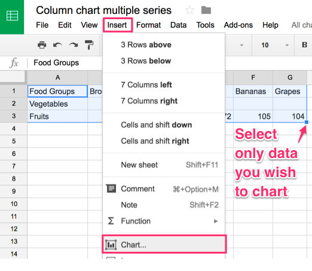

## Column and Bar Charts with Google Sheets {#column-bar-google}
*last updated April 4, 2017*

Follow these tutorials to create different types of column and bar charts with Google Sheets <http://sheets.google.com> on the Google Drive platform. Requires free account.

- Grouped
- Separated
- Stacked
- Histograms

#### Grouped Column and Bar Charts {-}
Best to compare categories side-by-side. Vertical columns, or horizontal bars for long labels.

**Try it:** This grouped column chart shows differences in obesity between men and women in each age bracket. Float your cursor over columns to view data details.

<iframe width="600" height="371" seamless frameborder="0" scrolling="no" src="https://docs.google.com/spreadsheets/d/1ltA9siijVSDkTE3fzB3UaWHO7dotBIrGH4R9wI_Qyqw/pubchart?oid=787918829&amp;format=interactive"></iframe><a href="https://docs.google.com/spreadsheets/d/1ltA9siijVSDkTE3fzB3UaWHO7dotBIrGH4R9wI_Qyqw/edit#gid=1017658845"><br>View data from CDC and StateOfObesity.org</a>

**Tutorial:**

1) Right-click to open link in new tab: [Google Sheet Column chart with grouped data template](https://docs.google.com/spreadsheets/d/1ltA9siijVSDkTE3fzB3UaWHO7dotBIrGH4R9wI_Qyqw/)

2) Sign in to your Google Drive or [sign up for a free account](http://sheets.google.com)

3) Select File > Make a Copy to save your own version to your Google Drive.


4) To remove the current chart from your copy of the spreadsheet, select it and press the delete.

5) Format your data in a similar way as shown below. Each row is a data series, which displays as a separate color in the chart.


6)  Use your cursor to select only the data you wish to chart, then select Insert > Chart.



7) In the Chart Editor > Recommendations tab, choose your preferred Column chart (or horizontal Bar chart for longer labels), or see more options in Chart Types tab. Press the Insert button.


8) To customize title, labels, and more, click the editing controls in the upper-right corner.


9) To make your data public, select the blue Share button > Advanced, then Change from Private to Public On the Web, with Anyone Can View.

```{r share-sheet}
if(knitr::is_html_output()) knitr::include_url("images/05-chart/column-share.gif") else knitr::include_graphics("images/placeholder.jpg")
```

10) To embed your chart in another website, click the upper-right chart editing controls, select Publish Chart, select Embed, and press the Publish button. Copy the iframe code and see the [Embed on Your Web](embed.html) chapter in this book.

11) Reminder: Currently, there is no easy way to cite or link to your source data inside a Google Sheets chart. Instead, cite and link to your source data in the text of the web page, as shown in the example at the top.

#### Separated Column and Bar Charts {-}
Best to compare categories in separate clusters. Vertical columns, or horizontal bars for long labels.

**Try it:** This separated bar chart shows calorie counts of fast food items, separated by restaurant chains. The horizontal bar offers more space for longer labels. Float your cursor over bars to explore data details.

<iframe width="700" height="432" seamless frameborder="0" scrolling="no" src="https://docs.google.com/spreadsheets/d/1LGUYaVLoRcOiB8KcXb3Rn7LRj0exnUQYOy58LrkGPAk/pubchart?oid=1270431574&amp;format=interactive"></iframe><a href="https://docs.google.com/spreadsheets/d/1LGUYaVLoRcOiB8KcXb3Rn7LRj0exnUQYOy58LrkGPAk/edit#gid=956322126"><br>View data from Starbucks and McDonalds</a>

** Tutorial:**

1) Right-click to open this link in a new tab: [Google Sheet Column chart with separated data template](https://docs.google.com/spreadsheets/d/1LGUYaVLoRcOiB8KcXb3Rn7LRj0exnUQYOy58LrkGPAk/)

2) Follow similar steps in the first tutorial above.

3) Format your data in a similar way as shown below. Each column is a data series, which displays as a separate color in the chart.


4) In the Chart Editor > Recommendations tab, choose your preferred Bar chart, or see more options in Chart Types tab.

#### Stacked Column and Bar Charts {-}
Best to compare sub-categories, or parts of a whole. Vertical columns, or horizontal bars for long labels.

**Try it:** This stacked column chart compares the percentage of overweight residents across nations. Float your cursor over columns to view data details.

<iframe width="600" height="371" seamless frameborder="0" scrolling="no" src="https://docs.google.com/spreadsheets/d/1WS11EK33JCmvCRzSDh9UpP6R7Z2sHglF7ve5iJL6eZk/pubchart?oid=307057605&amp;format=interactive"></iframe><a href="https://docs.google.com/spreadsheets/d/1WS11EK33JCmvCRzSDh9UpP6R7Z2sHglF7ve5iJL6eZk/edit#gid=735710691"><br>View data from WHO and CDC</a>

**Tutorial:**

1) Begin by opening this link in a new tab: [Google Sheets Stacked column chart template](https://docs.google.com/spreadsheets/d/1WS11EK33JCmvCRzSDh9UpP6R7Z2sHglF7ve5iJL6eZk/)

2) Follow most of the same steps in first tutorial above.

3) Format your data in a similar way as shown below. Each column is a data series, which displays as a separate color in the chart.


4) In the Chart Editor > Recommendations tab, choose Stacked column chart (or Stacked bar chart if you prefer a horizontal orientation), or see more options in Chart Types tab.

#### Histograms {-}
Best to show the distribution of raw data, with number of values in each bucket. Typically displayed in vertical columns.

**Try it**   to come*

**Tutorial:**  to come *

- Format data into two columns
  - data labels in the first column
  - numeric values in second column
