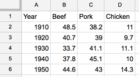

## Pie, Line, and Area Charts with Google Sheets {#pie-line-area-google}
*last updated February 12, 2017*

#### Pie Chart {-}
Best to show parts of a whole, but hard to estimate size of slices.

Try it -- to come

Tutorial - to come

#### Line Chart {-}
Best to show change over time with continuous data.

**Try it:** In this line chart, the level of chicken (shown in orange) rises steadily and surpasses beef (red) and pork (blue). Float your cursor over lines to view data details.

<iframe width="600" height="371" seamless frameborder="0" scrolling="no" src="https://docs.google.com/spreadsheets/d/1wkWxxZ2-N5hqkcp7in8bxwdEcT1-XMnt1A8qUXxUSjw/pubchart?oid=2073830845&amp;format=interactive"></iframe><a href="https://docs.google.com/spreadsheets/d/1wkWxxZ2-N5hqkcp7in8bxwdEcT1-XMnt1A8qUXxUSjw/edit#gid=894957893">View source data from USDA</a>

**Tutorial:**

- Begin by opening this link in a new tab: [Google Sheet Line chart template](https://docs.google.com/spreadsheets/d/1wkWxxZ2-N5hqkcp7in8bxwdEcT1-XMnt1A8qUXxUSjw/)
- Follow most of the same steps in first tutorial above.
- Format your data in a similar way as shown below. Each column is a data series, which displays as a separate color in the chart. 

- In the Chart Editor > Recommendations tab, choose Line chart, or see more options in Chart Types tab.

#### Stacked Area Chart {-}
Best to show part-to-whole relationships that change over time.

**Try it:** to come

**Tutorial:** to come
