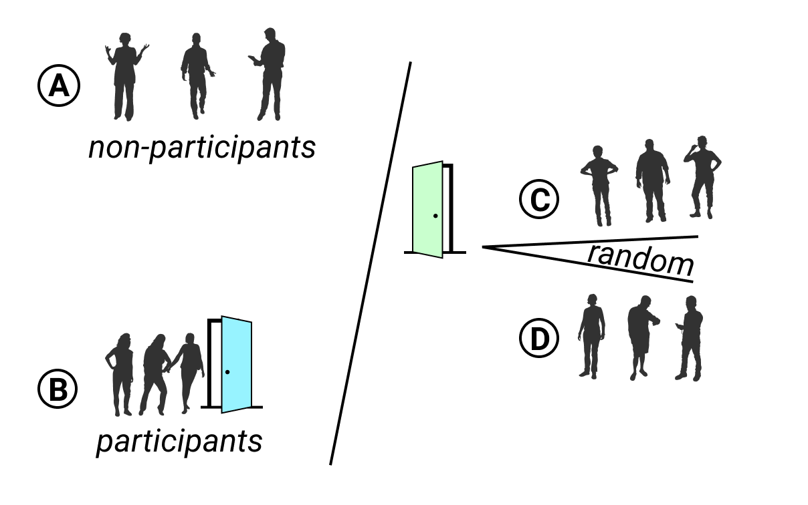

# Make Meaningful Comparisons {#comparisons}
Now that you've [refined your data story](choose.html), [improved your spreadsheet skills](spreadsheet.html), [found and questioned your data](find.html), and [cleaned up any messy parts](clean.html), this chapter focuses on the key question to ask while analyzing your evidence: "Compared to what?" That's how statistician Edward Tufte defined the "heart of quantitative reasoning."^[@tufteEnvisioningInformation1990, p. 67]. We search for insightful findings in our data by judging their significance against each other, to identify those that truly stand out. Sometimes we need to adjust our scales to ensure that we're weighing data fairly, or as the saying goes, comparing apples to apples, not apples to oranges. Before you communicate your findings in any format---text, tables, charts, or maps---be sure that you're making meaningful comparisons, because without this, your work may become meaningless.

This book does not intend to cover statistical data analysis, since many excellent resources already address this expansive field of study.^[For a reader-friendly introduction to statistical logic and its limits, see  @wheelanNakedStatisticsStripping2013; @spiegelhalterArtStatisticsHow2019] Instead, this chapter offers several common-sense strategies to make meaningful comparisons while you analyze your data, in order to help you design true and insightful visualizations that tell your story. You will learn to [precisely choose words when describing comparisons](describe-comparisons.html), why and how [to normalize your data](normalize.html), and advice on watching out for [biased comparisons](biased-comparisons.html).

## Precisely Describe Comparisons {- #describe-comparisons}
Sometimes we make poor comparisons because we fail to clarify our meaning of commonly-used words that can have different definitions. Three troublesome words are *average*, *percent*, and *causes*. We use them loosely in everyday conversation, but they require more precision when working with data.

Imagine a series of numbers: 1, 2, 3, 4, 5. When calculating the *average*, by hand or [with a built-in spreadsheet formula as described in chapter 3](calculate.html), we add up the sum and divide by the count of numbers. A more precise term is the *mean*, which in this case equals 3. A different term is the *median*, which refers to the number in the middle of the ordered series, also known as the *50th percentile*, which in this case is also 3.

When working with data, the terms *median* and *percentile* are more useful terms when making comparisons because they resist the influence of *outliers* at the extreme ends of the series. For example, imagine the same numbers as above, but replace the 5 with 100 to serve as an outlier. Suddenly the mean jumps up to 22, but the median remains the same at 3, as shown in Figure \@ref(fig:mean-vs-median). There's an old joke that when a billionaire walks into a room, everyone becomes a millionaire---on average---but the median remains the same. Since we ordinary people don't actually become richer by the presence of the billionaire outlier among us, the median is a better term to make meaningful comparisons about the overall distribution of the data.

(ref:mean-vs-median) The *median* is a more useful comparative term than *average* or *mean* because it resists the influence of outliers.

```{r mean-vs-median, out.width=350, fig.cap="(ref:mean-vs-median)"}
knitr::include_graphics("images/06-comparisons/mean-vs-median.png")
```

*Percentage* is another common term, which nearly everyone intuitively grasps as a *ratio* of parts per hundred. For example, an [old 1970s commercial for Trident gum](https://en.wikipedia.org/wiki/Trident_gum) claimed that "4 out of 5 dentists surveyed recommend sugarless gum for their patients who chew gum".^[@newmanSellingGumHealth2009] Even if you're too young to remember that slogan, or wonder how that survey was actually conducted, or are puzzling over how the fifth dentist resisted such intense peer pressure, we all understand that 4 out of 5 dentists is equivalent to `4/5 = 0.8 = 80%`.

But confusion arises sometimes when people hastily compare percentages, so we need to carefully choose our words. One term is *percent change* (also called relative change), which works best when comparing *old versus new values*. Percent change is calculated by the difference between new and old values, divided by the absolute value of the old value, or `(New value - Old value) / |Old value|`. For example, if 4 dentists recommended sugarless gum in 1960, but peer pressure finally prevailed and 5 dentists recommend it in 2020, we calculate the percent change as `(5-4)/4 = 1/4 = 0.25 = 25%`.

Another term is *percentage point difference*, which works best when comparing *old versus new percentages* and is calculated by subtracting one from the other. For example, if 80 percent of dentists recommended sugarless gum in 1960, but 100 percent recommended it in 2020, we could compare the two figures by calculating the difference as `New percentage - Old percentage = 100% - 80%  = 20 percentage point difference`.

When we precisely use each term, there are two correct ways to compare these figures. One way is to state that "The number of dentists who recommended sugarless gum increased 25 percent over time." Another way is to state that "The percentage of dentists who recommended sugarless gum increased 20 percentage points over time." Both statements are accurate. Even if someone confuses the two terms, there's not a big gap between a "25 percent change" and a "20 percent point increase" in this particular example.

But consider a different example where someone intentionally misleads you with imprecise wording about percentages. Imagine a politician who proposes to raise the sales tax on products and services you purchase from 5 to 6 percent. If that politician says, "it's only a 1 percent increase," they're wrong. Instead, there are two truthful ways describe this change. One way is to state that the tax "will increase 20 percent" because `(6-5)/5 = 0.20`. Another way is to state that the tax "will increase by 1 percentage point" because `6% - 5% = 1 percentage point difference`. See why the politician preferred to say it in their misleading way, rather than either of the two correct ways? Don't let anyone fool you by describing how percentages change with very loose wording, and be precise about its meaning in your own work to avoid confusing other people.

A final recommendation about using more precise language is to be cautious with words that suggest a *cause-and-effect relationship* in your data. In everyday conversation, there are many ways that we loosely imply that a causal relationship, where an action directly results in a reaction. For example, when we say one thing "leads to" another, or "promotes" growth, or "sparks" change, those words suggest causality. While that's fine in daily conversation, we need to choose our words more carefully when discussing data, using three concepts. The first step is to describe any *correlation* between two variables, which means to show how they are associated or related interdependently. But statisticians always warn us that [correlation does not imply causation](https://en.wikipedia.org/wiki/Correlation_does_not_imply_causation). The fact that two things are related does not necessarily mean that one causes the other to happen. In order to show causation, we must take the second step of proving both correlation and demonstrating a *persuasive theory* for how one factor (sometimes called the independent variable) creates a change in another factor (called the dependent variable). Third, we need to identify and isolate any *confounding variables* that we have not considered that may also influence the cause-and-effect relationship. While the details are beyond the scope of this book, be mindful of the concepts---and choose your words carefully---when working with data.

See also [table design recommendations for showing data correlations and possible causal relationships](table-design.html) in Chapter 9: Table Your Data.

Now that you have a clearer understanding of how to use key words to describe data relationships more precisely, in the next section you'll build on this knowledge and adjust data to create more meaningful comparisons.

## Normalize Your Data {- #normalize}
When we work with data expressed in *counts*, such as 3,133 motor vehicle crash deaths in Florida in 2018, it usually makes no sense to compare these numbers until we *normalize* them. This means to adjust data that has been collected using different scales into a common reference scale, or in other words to convert *raw data* into *rates* to make more meaningful comparisons. Even if you've never heard the term, perhaps you're already normalizing data without realizing it.

Here's an example about motor vehicle safety that was inspired by visualization expert Alberto Cairo, with [updated 2018 data](https://www.iihs.org/topics/fatality-statistics/detail/state-by-state) from the Insurance Institute for Highway Safety (IIHS) and the US Department of Transportation.^[@cairoTruthfulArtData2016, pp. 71-74.] Over 36,000 people died in motor vehicle crashes in 2018, including car and truck drivers and occupants, motorcyclists, pedestrians, and bicyclists. Although only a small fraction of this data appears in the tables below, you can [view all of the data in Google Sheets format](https://docs.google.com/spreadsheets/d/1N7_pHdmXdE3Y4ECnnDyBTSXkklv-u1hLULSO-YaotpA/edit#gid=0), and save an editable copy to your Google Drive, to follow along in this exercise.

Let's start with what appears to be a simple question, and see where our search for more meaningful comparisons takes us.

1. *Which US states had the lowest number of motor vehicle crash deaths?* When we sort the data by the numbers of deaths, the District of Columbia *appears* to be the safest state with only 31 deaths, as shown in Table \@ref(tab:deaths), even though Washington DC is not legally recognized as a state.

Table: (\#tab:deaths) US States with lowest number of motor vehicle crash deaths, 2018

| State | Deaths |
|:----|--:|
| District of Columbia | 31  |
| Rhode Island         | 59  |
| Vermont              | 68  |
| Alaska               | 80  |
| North Dakota         | 105 |

But wait---this isn't a fair comparison. Take another look at the five states above and you'll may notice that all of them have smaller populations than larger states, such as California and Texas, which appear at the very bottom of the full dataset. To paint a more accurate picture, let's rephrase the question to adjust for population differences.

2. *Which US states had the lowest number of motor vehicle crash deaths when adjusted for population?* Now let's *normalize* the death data by taking into account the total population of each state. In our spreadsheet, we calculate it as `Deaths / Population * 100,000`. While it's also accurate to divide deaths by population to find a *per capita* rate, those very small decimals would be difficult for most people to compare, so we multiply by 100,000 to present the results more clearly. When we sort the data, Washington DC *appears* to be the safest once again, with only 4.4 motor vehicle crash deaths per 100,000 residents, as shown in Table \@ref(tab:deaths-population)

Table: (\#tab:deaths-population) US States with lowest number of motor vehicle crash deaths per population, 2018

| State | Deaths | Population | Deaths per 100,000 population |
|:---|---:|---:|---:|
| District of Columbia | 31  | 702,455    | 4.4 |
| New York             | 943 | 19,542,209 | 4.8 |
| Massachusetts        | 360 | 6,902,149  | 5.2 |
| Rhode Island         | 59  | 1,057,315  | 5.6 |
| New Jersey           | 564 | 8,908,520  | 6.3 |

But wait---this still isn't a fair comparison. Look at the five states on the list and you'll notice that all of them are located along the Northeastern US corridor, which has a high concentration of public transit, such as trains and subways. If people in urban areas like New York and Boston are less likely to drive motor vehicles, or take shorter trips than people in rural states where homes are more distantly spread out, that might affect our data. Let's strive for a better comparison and rephrase the question again, this time to adjust for differences in mileage, not population.

3. *Which US states had the lowest number of motor vehicle crash deaths when adjusted for vehicle mileage?* Once again, we *normalize* the death data by adjusting it to account for a different factor: vehicle miles traveled (VMT), the estimated total number of miles (in millions) traveled by cars, vans, trucks, and motorcycles, on all roads and highways in the state, in 2018. In our spreadsheet, we calculate it as `Deaths / Vehicle Miles * 100`, with the multiplier to present the results more clearly. This time Massachusetts *appears* to be the safest state, with only 0.54 motor vehicle crash deaths per 100 million miles traveled, as shown in as shown in Table \@ref(tab:deaths-miles). Also, note that the District of Columbia has fallen further down the list and been replaced by Minnesota.

Table: (\#tab:deaths-miles) US States with lowest number of motor vehicle crash deaths per miles traveled, 2018

| State | Deaths | Vehicle miles traveled (millions) | Deaths per 100 million vehicle miles traveled |
|:---|---:|---:|---:|
| Massachusetts | 360 | 66,772  | 0.54 |
| Minnesota     | 381 | 60,438  | 0.63 |
| New Jersey    | 564 | 77,539  | 0.73 |
| Rhode Island  | 59  | 8,009   | 0.74 |
| New York      | 943 | 123,510 | 0.76 |

Have we finally found the *safest* state as judged by motor vehicle crash deaths? Not necessarily. While we normalized the raw data relative to the population and amount of driving, the IIHS reminds us that several other factors may influence these numbers, such as vehicle types, average speed, traffic laws, weather, and so forth. But as Alberto Cairo reminds us, every time we refine our calculations to make a more meaningful comparison, our interpretation becomes a closer representation of the truth. "It's unrealistic to pretend that we can create a *perfect* model," Cairo reminds us. "But we can certainly come up with a *good enough* one."^[@cairoTruthfulArtData2016, p. 95]

As we demonstrated above, the most common way to normalize data is to adjust raw counts into relative rates, such as percentages or per capita. But there are many other ways to normalize data, so make sure you're familiar with different methods when you [find and question your data, as described in chapter 4](find.html). When working with historical data (also called time-series or longitudinal data), you may need to *adjust for change over time*. For example, it's not fair to directly compare median household income in 1970 versus 2020, because $10,000 US dollars had far more purchasing power a half-century ago than it does today, due to inflation and related factors. Similarly, economists distinguish between *nominal data* (unadjusted) versus *real data* (adjusted over time), typically by converting figures into "constant dollars" for a particular year that allow better comparisons by accounting for purchasing power.^[@WhatRealWages2018] Also, economic data is often *seasonally adjusted* to improve comparisons for data that regularly varies across the year, such as employment or revenue during the summer tourism season versus the winter holiday shopping season. Another normalization method is to create an *index* to measure how values have risen or fallen in relation to a given reference point over time. Furthermore, statisticians often normalize data collected using different scales by calculating its *standard score*, also known as its *z-score*, to make better comparisons. While these methods are beyond the scope of this book, it's important to be familiar the broader concept: everyone agrees that it's better to compare apples to apples, rather than apples to oranges.

Finally, you do *not* always need to normalize your data, because sometimes its format already does this for you. Unlike raw numbers or simple counts, most *measured variables* do not need normalization because they already appear on a common scale. One example of a measured variable is *median age*, the age of the "middle" person in a population, when sorted from youngest to oldest. Since we know that humans live anywhere between 0 and 120 years or so, we can directly compare the median age among different populations. Similarly, another measured variable is *median income*, if measured in the same currency and in the same time period, because this offers a common scale that allows direct comparisons across different populations.

Now that you have a better sense of why, when, and how to normalize data, the next section will warn you to watch out for biased comparisons in data sampling methods.

## Beware of Biased Comparisons {- #biased-comparisons}
Everyone knows not to *cherry-pick* your data, which means to select only the evidence that supports a pre-determined conclusion, while ignoring the remainder. When we make a commitment to tell true and meaningful data stories, we agree to keep an open mind, examine all of the relevant evidence, and weigh the merits of competing interpretations. If you agree to these principles, then also watch out for biased data comparisons, especially *sampling biases*, which refers to data collection procedures that may appear legitimate on the surface, but actually include partially-hidden factors that skew the results. While we may believe we're operating with open minds, we might overlook methods that effectively cherry-pick our evidence without our knowledge.

First, look out for *selection bias*, which means that the sample chosen for your study differs systematically from the larger population. "What you see depends on where you look," cautions professors Carl Bergstrom and Jevin West, authors of a book with an unforgettable title, *Calling Bullshit*.^[@bergstromCallingBullshitArt2020, pp. 79, 104-133] If you randomly measured the height of people who happened to be leaving the gym after basketball practice, your artificially taller results would be due to selection bias, as shown in Figure \@ref(fig:selection-bias).

(ref:selection-bias) If you randomly measured the height of people who happened to be leaving the gym after basketball practice, your artificially taller results would be due to selection bias.

```{r selection-bias, out.width=500, fig.cap="(ref:selection-bias)"}

```

Second, beware of *non-response bias*. If you send a survey to a broad population, but not everyone responds, you need to be aware that those who chose to participate may possess certain qualities that make them less representative of the whole population. For example, US Census researchers discovered that the non-response rate for lower-income people was significantly higher than usual for the 2020 Current Population Survey supplement, which they determined by comparing individual survey results to prior years. Since richer people were more likely to respond, this artificially raised the reported median income level, which researchers needed to correct.^[@rothbaumCoronavirusInfectsSurveys2020] See also the [US Census Bureau Hard to Count 2020 map](https://www.censushardtocountmaps2020.us) that visualizes self-response rates by states, counties, and tracts. If you conduct a survey that does not correct for non-response bias, you may have biased results.

Third, watch out for *self-selection bias*, which often arises when attempting to evaluate the effectiveness of a particular program or treatment where people applied or volunteered to participate, as shown in Figure \@ref(fig:self-selection-bias). If your job is to judge whether a weight-loss program actually works, this requires a deep understanding of how data samples were chosen, because self-selection bias can secretly shape the composition of both groups and result in a meaningless comparison. For example, you would be mistaken to compare the progress of non-participants (group A) versus participants who signed up for this program (group B), because those two groups were *not* randomly chosen. Participants differ because they took the initiative to join a weight-loss program, and most likely have higher motivation to improve their diet and exercise more often than non-participants. It's surprising how often we fool ourselves and forget to consider how voluntary participation skews program effectiveness, whether the subject is weight-loss clinics, social services, or school choice programs.

How can we reduce self-selection bias in program evaluation data? As you learned in [Chapter 4, it's important to question your data](question.html) by looking below the surface level to fully comprehend how terms have been defined, and how data was collected and recorded. By contrast, a well-designed program evaluation will reduce self-selection bias by *randomly dividing* all volunteer participants (group B) into two sub-groups: half will be assigned to participate in one weight-loss program (group C) and the other half will be assigned to a different weight-loss program (group D), as shown in Figure \@ref(fig:self-selection-bias). Since sub-groups C and D were selected by chance from the same larger group of volunteers, we can be more confident when comparing their progress because there is no reason to suspect any difference in motivation or other hard-to-see factors. Of course, there are many more research design details that are beyond the scope of this book, such as ensuring that sample sizes are sufficiently large, and comparing participants before, during, and after the weight-loss activity, and so forth. But the logic of avoiding selection bias is simple: randomly divide people who apply or volunteer to participate into sub-groups, to better compare program effectiveness among people with similar motivations and other hard-to-see characteristics.

(ref:self-selection-bias) To evaluate program effectiveness, do not compare program non-participants (A) versus those who apply or volunteer to participate (B). Instead, randomly split all participants into two sub-groups (C and D).

```{r self-selection-bias, out.width=700, fig.cap="(ref:self-selection-bias)"}
knitr::include_graphics("images/06-comparisons/self-selection-bias.png")
```

Bias warnings appear in several chapters of this book, because we continually need to be aware of different types that negatively influence our work at various stages of the data visualization process. Later in [Chapter 15 you'll learn how to recognize and reduce other types of biases](data-bias.html) when working with data, such as cognitive biases, algorithmic biases, intergroup biases, and mapping biases.

### Summary {- #summary6}

Although we do not claim to teach you statistical data analysis in this book, in this chapter we discussed several common-sense strategies to make meaningful comparisons while analyzing your data. You learned how to use words more precisely for comparing data, why and how to normalize data, and advice on watching out for biased comparisons. In prior chapters you built up your skills on refining your data story, working with spreadsheets, finding and questioning data, and cleaning up messy data. Now you can combine all of this knowledge and begin to create interactive charts and maps in the next few chapters.
