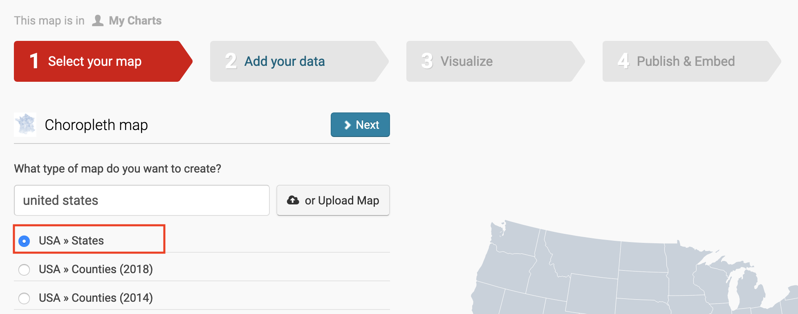
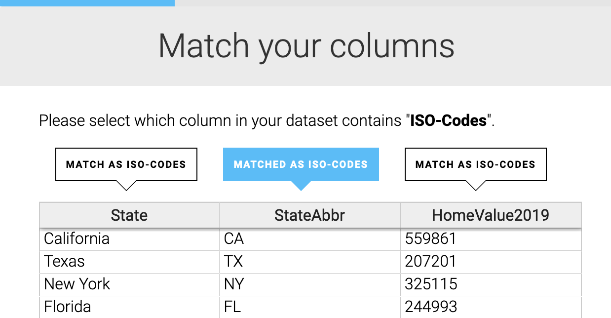
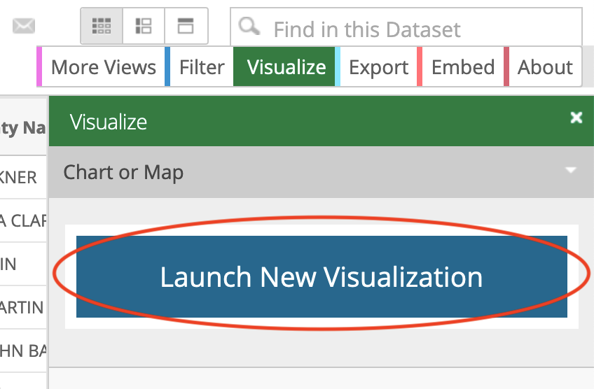
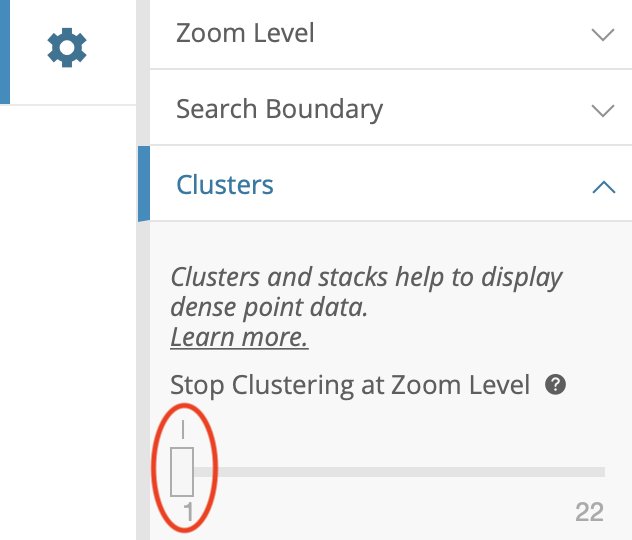
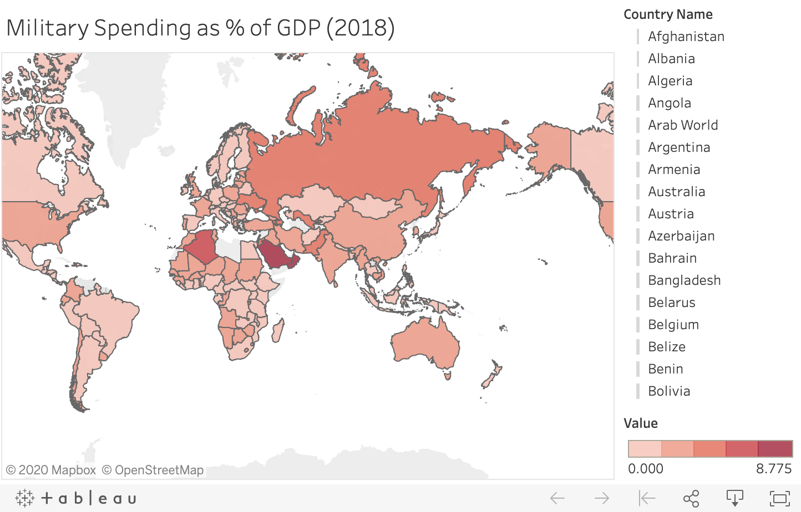
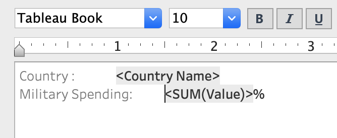

# Map Your Data {#map}

Maps entice readers to explore your data story and develop a stronger sense of place.
But good maps require careful thought about how to clearly communicate spatial
concepts with your audience.

We will begin this chapter by introducing key principles and definitions related to maps.
We will then practice making interactive maps using free online tools, including Google My Maps,
Socrata, Tableau, and Datawrapper. We will build two point maps and two choropleth maps.
By the end of this chapter, you will be able to use four powerful tools to map your data.


Table: (\#tab:map-types) Basic Map Types and Tutorials

| Map | Best use and tutorials in this book |
| --- | --- |
| Point map        <br>  | Best to show specific locations, such as addresses with geocoded coordinates, with colors for different categories. <br>Easy tool: [Google My Maps tutorial](mymaps.html)<br>Power tool: [Leaflet Maps with Google Sheets](leaflet-maps-with-google-sheets.html) and other [Leaflet templates](leaflet.html) |
| Polygon map      <br>  | Best to show regions (such as nations or neighborhoods), with colors or shading to represent data values. Also known as choropleth map. <br>Easy tool: n/a <br>Power tools: [Tableau Public](tableau-polygon.html) or [Leaflet Maps with Google Sheets](leaflet-maps-with-google-sheets.html) and other [Leaflet templates](leaflet.html) |
| Polyline map     <br>  | Best to show routes (such as trails or transit), with colors for different categories. <br>Easy tool: n/a <br>Power tool: [Leaflet Maps with Google Sheets](leaflet-maps-with-google-sheets.html) and other [Leaflet templates](leaflet.html)|
| Combination map   <br>  | Best to show any combination of points, polygons, or polylines. <br>Easy tool: n/a <br>Power tool: [Leaflet Maps with Google Sheets](leaflet-maps-with-google-sheets.html) and other [Leaflet templates](leaflet.html)  |
| Storymap <br>  | Best for guided point-by-point journey through a historical narrative, with optional photos, audio, or video on an interactive map. <br> Easy tool: [Knight Lab's StoryMap](https://storymap.knightlab.com/), [ESRI Story Maps](https://storymaps.arcgis.com/en/) <br> Power tool: [Leaflet Storymaps with Google Sheets](leaflet-storymaps-with-google-sheets.html) |

TODO ABOVE: 

- UPDATE table to match chapter contents.
- Add tab-view map for historical change template?
- Add synchronized side-by-side map template?

## Map Design Principles {- #map-design}

Most of the data collected today comes with some sort of geospatial component.
People's home and places of business have addresses associated with them, such as `1012 Broad St, Hartford, CT`.
When we track our runs or bike journeys on Strava, they come with latitude and longitude components.
National statistical agencies across the world collect data about regions and territories,
such as average income or population counts, making it possible to compare countries
and other geographical entities.

However, just because data *can* be mapped does not mean it *should* be mapped.
Before you decide to create a map, ask yourself: Does location really matter to your story?
If precise values are more important to your story than spatial patterns,
consider using a simple table to show values. Most people are familiar with the table,
and can easily retrieve information from it as long as you arrange it logically (for example,
alphabetically or sorted by value).
If you want to show change over time for various geographies, consider using a line chart
instead. Sometimes even a simple bar chart can be a much better alternative to a map.

An effective map should show interesting geospatial patterns and
should be easy to read in both black-and-white (as is often the case with printed materials)
and color.

### Understand the Vocabulary {-}

Take a look at Figure \@ref(fig:map-principles-map) to get familiar with main
basic elements of an interactive map. Similar to a chart, a good maps should have a title and a description that
gives a bit of context about what the map is showing.

(ref:map-principles-map) Map elements.

```{r map-principles-map, fig.cap="(ref:map-principles-map)"}
knitr::include_graphics("images/06-map/map-principles-map.png")
```

The data in the map is presented as layers. A base layer is often satellite imagery of the earth
or vector representations of buildings and streets (also known as vector tiles).
A base layer provides the foundation of the map. The data displayed on the maps
can be generally described as points (such as marker locations of nearby restaurants),
polylines (connected points, such as roads or trails), and polygons (polylines
where the final point is connected with the initial one). Polygons represent areas,
such as building footprints or country boundaries.

The legend provides the mapping between shapes and colors and the values they represent.
For example, you may wish to use blue markers to represent restaurants, and
orange markers to represent bars, and legend will be the right place to explain that difference.

Interactive maps often "hide" data inside popups or tooltips – boxes with information
that appear when you click or hover over map elements.

Interactive web maps often have zoom controls (`+` and `-` buttons) to allow
users to inspect data from various "distances".


### Color Palettes: Sequential, Diverging, and Qualitative {-}

If you build a choropleth map, the choice of colors is very important
as color is the main way to represent values. So let's talk about color palettes.

Color palettes can be grouped into sequential, diverging, and qualitative.
The examples are shown in Figure \@ref(fig:map-principles-color-schemes).

(ref:map-principles-color-schemes) Examples of sequential, diverging, and qualitative color schemes from [ColorBrewer](https://colorbrewer2.org/).

```{r map-principles-color-schemes, fig.cap="(ref:map-principles-color-schemes)"}
knitr::include_graphics("images/06-map/map-principles-color-schemes.png")
```

Sequential palettes are used to represent continuous numeric values, in other words, anything that can be placed
on a scale. For example, average income, population counts, percent unemployed, etc.
Usually such palettes are single-hue (for example, different shades of blue), and
typically darker colors represent higher values (but not always).

Diverging palettes also represent continuous values.
Unlike sequential palettes, however, diverging colors represent "direction" from some reference value,
such as below or above zero, or below or above the average value.
Diverging palettes typically have two distinct hues for "positive" and "negative" values,
with a neutral color in the middle.

Qualitative palettes typically consist of distinct hues that represent distinct classes.
For example, the US Department of State issues travel advisory to foreign destinations
ranging from "exercise normal precautions" to "do not travel" relying on a series of qualitative
and quantitative measures, such as the likelihood of terror attacks, political and criminal situation, etc.
But classes can also be derived from numerical values, as is the case with the World Bank's classification
of countries by income. The organization groups countries and territories into "low", "lower-middle",
"higher-middle", and "high" income categories based on gross national income per capita.

It is important you choose an appropriate classification for your choropleth map.
While the nature of certain datasets will make the choice of a color palette obvious,
most of the time you will have to actively choose *how* to display your data.

In Figure \@ref(fig:map-principles-classification)a, we presented the same dataset using three
differnet color palettes. The map in Figure \@ref(fig:map-principles-classification)a
represents per capita income for the contiguous US states using a sequential color scheme
consisting of five shades of blue. The darker the color, the higher the income. You can quickly
see that states in the north-east, such as Connecticut, Massachusettes, New Jersey,
and Maryland have the highest per capita income.

In Figure \@ref(fig:map-principles-classification)b, we used a divergent color scheme to show
whether states have higher or lower per capita incomes than the United States as a whole.
We subtracted the US per capita income value of $33,831 from each state's value. This new relative measure
is positive for states with higher per capita income, and negative for the states whose per capita income
is lower than in the US. In the map, sub-zero values are painted in orange, and above-zero values are
in purple. Such color palette could be appropriate for a story about the north-south divide.

You can also split the 48 states into three groups of 16 based on their per capita income, and group them in three
thirds, as "low", "middle", and "top" third. This is what we did in the map shown in
Figure \@ref(fig:map-principles-classification)c.

(ref:map-principles-classification) Representing per capita income in US states using three different classifications.

```{r map-principles-classification, fig.cap="(ref:map-principles-classification)"}
knitr::include_graphics("images/06-map/map-principles-classification.png")
```

### ColorBrewer {-}

One of the most useful color picking tools for meaningful choropleth
maps is [ColorBrewer](https://colorbrewer2.org/), created by Cynthia Brewer and
Mark Harrower. You can see ColorBrewer's interface in Figure \@ref(fig:map-principles-colorbrewer).

(ref:map-principles-colorbrewer) ColorBrewer interface.

```{r map-principles-colorbrewer, fig.cap="(ref:map-principles-colorbrewer)"}
knitr::include_graphics("images/06-map/map-principles-colorbrewer-annotated.png")
```

ColorBrewer can generate color palettes for a specified number of classes - between three
and nine for sequential, three and elevel for diverging, and three and twelve for qualitative.
You can also choose palettes that are colorblind safe and print friendly.

Remember that more colors (or "buckets") does not equal better maps.
People are quite bad at distinguishing hues, and an excessive number of
buckets will make it harder for reader to compare map values with the legend.
If you build a sequential color palette, we recommend you start with *five* buckets,
then try four and six and decide what is appropriate for your data *and* your story.

Fewer colors create a *coarse* map with differences in colored ranges becoming more visible.
More colors create a more *granular* map, but differences in
colored ranges become less visible.

At this point, you should have some understanding of how maps work.
So let's move to the first practical exercise of creating a point map
with Google My Maps.

## Point Map with Google My Maps {- #mymaps}

[My Maps](https://www.google.com/maps/about/mymaps/) is Google's service
that allows users to create custom maps using Google Maps platform.
It is perhaps the fastest ways of building point and basic polygon maps, although
it limits your styling options.

My Maps is most powerful when it comes to collaboration. The platform functions
within Google Drive, and so allows you to invite
other users with Google accounts to work on the map.

In this section, we will look at building a point map of airports in Nigeria, as is shown
in Figure \@ref(fig:mymaps-final). We will
create a map, change a baselayer, import point data, style points, and share the map.

(ref:mymaps-final) A map of airports in Nigeria built using Google My Maps.

```{r mymaps-final, fig.cap="(ref:mymaps-final)"}
if(knitr::is_html_output()) knitr::include_url("https://www.google.com/maps/d/u/0/embed?mid=1v1ZNrpfBtq_p4wTRyj2hIKBtTnkmhnMF", height="500px") else knitr::include_graphics("images/06-chart/mymaps-final.png")
```

### Create a New Map in My Maps {-}

Navigate to [Google My Maps](https://www.google.com/mymaps/).
In the upper-right corner, click `+ Create a New Map` button,
as shown in Figure \@ref(fig:mymaps-create-new).

(ref:mymaps-create-new) A map of airports in Nigeria built using Google My Maps.

```{r mymaps-create-new, out.width=300, fig.cap="(ref:mymaps-create-new)"}
knitr::include_graphics("images/06-map/mymaps-create-new.png")
```

You will see a typical Google Maps with no data. Click on the current title (`Untitled map`),
and add appropriate title and description in the modal window that appeared
(see Figure \@ref(fig:mymaps-edit-title) for inspiration).

(ref:mymaps-edit-title) Add title and description to your map.

```{r mymaps-edit-title, out.width=300, fig.cap="(ref:mymaps-edit-title)"}
knitr::include_graphics("images/06-map/mymaps-edit-title.png")
```

Before we add any points, let's change the basemap to something less boring.
At the bottom of the control window, open *Base map* dropdown, and pick one of nine available
basemaps. For this tutorial, we chose *Dark Landmass*.

Let's now proceed to the most important step—adding data. You can [download](data/nigeria-airports.csv)
a dataset of Nigerian airports that we got [from the World Bank](https://datacatalog.worldbank.org/dataset/nigeria-airports)
as a Shapefile and then converted to a CSV.

Under *Untitled layer* item, click *Import* button, and drag-and-drop the CSV file.
Once the data file is uploaded, My Maps will ask which columns contain location data.
In our case, these are *LATITUDE* and *LONGITUDE* columns, as shown in Figure \@ref(fig:mymaps-lat-lon).

(ref:mymaps-lat-lon) Check LATITUDE and LONGITUDE as your location columns.

```{r mymaps-lat-lon, out.width=300, fig.cap="(ref:mymaps-lat-lon)"}
knitr::include_graphics("images/06-map/mymaps-lat-lon-annotated.png")
```

Once the two boxes are checked, click *Continue*. Another window will pop up, asking
which column to use to annotate points. Choose *City*, as shown in Figure \@ref(fig:mymaps-column-title),
and then *Finish*.

(ref:mymaps-column-title) Choose City as the title for your markers.

```{r mymaps-column-title, out.width=300, fig.cap="(ref:mymaps-column-title)"}
knitr::include_graphics("images/06-map/mymaps-column-title-annotated.png")
```

It will take a few moments for My Maps to create a new layer, which
will be added to the layer menu as *nigeria-airports.csv*.
Once the layer is created, My Maps will center the map to fit the points.

Let's replace the original blue markers to orange airport symbols.
In layers menu, hover over *All items* and click the paint bucket symbol
on the right. Change "All items" text to "Airports",
choose orange color, and click on *More icons* to find an airport symbol
(we recommend using Filter to search for "airport", or simply scroll down to Transportation section).
The marker in the layers menu will change to an orange airplane,
as shown in Figure \@ref(fig:mymaps-color).

(ref:mymaps-color) In My Maps, you can change marker colors and icons.

```{r mymaps-color, out.width=300, fig.cap="(ref:mymaps-color)"}
knitr::include_graphics("images/06-map/mymaps-color-annotated.png")
```

Click on the layer name, which by default is set to the name of imported file (`nigeria-airports.csv`),
and change it to *Nigerian Airports*. Alternatively open a kebab menu to the right of the layer name, and choose *Rename this layer*.

You can accompany each marker with a label. Click *Uniform style* under the layer, and choose *Alt_name*
in the *Set labels* dropdown menu. You will see alternative airport names, such as *BENIN*, displayed
to the right of the markers.

Click *Preview* to see how the map looks like outside of the My Maps editing studio.

### Share Your Google Map {-}

If you are happy with the result, click *Share*, and click *Change to anyone with the link*
(see Figure \@ref(fig:mymaps-share)),
just as you would with any other Google Drive document.

(ref:mymaps-share) Make sure anyone with the link can view your map before you share it.

```{r mymaps-share, out.width=400, fig.cap="(ref:mymaps-share)"}
knitr::include_graphics("images/06-map/mymaps-share.png")
```

You can now generate a code snippet to embed the map as an iframe.
From the main kebab menu to the right of the map title, choose *Embed on my site* (Figure \@ref(fig:mymaps-embed)).
You can use now use this iframe code to embed your map to
your Wordpress, Squarespace, or any other website.

(ref:mymaps-embed) My Maps can generate an iframe code to include the map on your own website.

```{r mymaps-embed, out.width=300, fig.cap="(ref:mymaps-embed)"}
knitr::include_graphics("images/06-map/mymaps-embed-annotated.png")
```

### Going Beyond Points {-}

Google My Maps has more powerful features for map making.
Instead of uploading datasets with latitude/longitude pairs,
you can use simple addresses (and My Maps will take care of geocoding),
or add markers by clicking on the map using *Add marker* feature.
You can classify points based on a property, and use different colors
to represent them.

You are not limited to just point maps. You can also draw your own shapes, including
lines and polygons. You can add data to multiple layers.
Unfortunately, Google My Maps has no comprehensive documentation,
so you have to explore the studio yourself if you want to create
more complex projects.


## Choropleth Map with Datawrapper {- #map-with-datawrapper}

In addition to creating wonderful interactive charts, Datawrapper lets you create
stylish and interactive point and polygon maps.
In this section, we will create a choropleth map of average home values in US states
in 2019 according to [Zillow data](https://www.zillow.com/research/data/),
as shown in Figure \@ref(fig:datawrapper-map-final).

We calculated average 2019 prices for 50 US states and DC, and put them in a spreadsheet, which
[you can download](data/us-states-home-values-zillow-2019.csv) for this tutorial.

(ref:datawrapper-map-final) This choropleth map is created in Datawrapper

```{r datawrapper-map-final, fig.cap="(ref:datawrapper-map-final)"}
if(knitr::is_html_output()) knitr::include_url("https://datawrapper.dwcdn.net/uX2Yx/2/", height="513px") else knitr::include_graphics("images/06-chart/mymaps-final.png")
```

### Create a New Choropleth Map {-}

Sign in to your [Datawrapper account](https://app.datawrapper.de/signin)
and click *New Map* in the header. Datawrapper will offer a choice of
a *Choropleth*, *Symbol*, and *Locator* maps, as shown in Figure \@ref(fig:datawrapper-map-choose).
Go ahead and choose *choropleth*.

(ref:datawrapper-map-choose) Sign in to Datawrapper, click *New Map*, and choose *Choropleth*.

```{r datawrapper-map-choose, fig.cap="(ref:datawrapper-map-choose)"}
knitr::include_graphics("images/06-map/datawrapper-map-choose-annotated.png")
```

Datawrapper splits the process of creating a map into four steps.
In step one, you need to choose your map boundaries. Datawrapper has a
wide collection of most common geographical boundaries, including
states and counties and municipalities for most countries in the world,
and zip code and census tract areas for the United States. But you are not limited
to the boundaries that Datawrapper already has. You can also upload your own custom geographies
as a TopoJSON or GeoJSON file (more about that in
[Chapter 11](https://handsondataviz.org/convert-geojson.html)).
Because we are mapping average home prices by US state, choose *United States > States*,
as shown in Figure \@ref(fig:datawrapper-map-us-states), and hit *Next* to go to step 2.

(ref:datawrapper-map-us-states) To map home prices by US state, choose appropriate boundaries.

```{r datawrapper-map-us-states, fig.cap="(ref:datawrapper-map-us-states)"}

```

In the second step, you can attach data to the chosen boundaries.
You can set values manually in the interactive table that Datawrapper offers.
This is fine for several values, but is too time-consuming for all 50 values
(District of Columbia is not a US state, so is not present in the boundaries).
Instead, click *Import your dataset* button under the table.

Datawrapper will warn you that you need either *Names* (full state names, such as `Connecticut`),
or *ISO-Codes* (the standardized two-letter codes for the state, such as `CT` for Connecticut)
columns in order to perform merging.
Since the dataset that we prepared contains both columns (titled *State* and *StateAbbr*),
you can confidently press the *Start import* button.

In the following window, you can either copy/paste values from the spreadsheet,
or upload a CSV file. We recommend uploading a file, so click the link and choose the file
`us-states-home-values-zillow-2019.csv`. The table will then get populated,
and Datawrapper will ask for help identifying the relevant column with geographical names.
Make sure your *Matched as ISO-Codes* tooltip is blue above the *StateAbbr* column,
scroll down and click *Next*, as shown in Figure \@ref(fig:datawrapper-map-match).

(ref:datawrapper-map-match) Tell Datawrapper which column contains geography names (ISO-Codes of states).

```{r datawrapper-map-match, out.width=350, fig.cap="(ref:datawrapper-map-match)"}

```

In a similar fashion, you will then be asked to identify a column that contains *values* to be mapped.
Make sure it is *HomeValue2019* that is *Matched As Values*.

### Style and publish your map {-}

When finished uploading data, go to step 3 to begin visualizing. Start with the *Refine* tab and choose
a diverging color palette, from reds to blues. Make sure your "middle" color value
corresponds to the state with the median home price by choosing *min/median/max* value
from the Stops dropdown, as shown in Figure \@ref(fig:datawrapper-map-color).

(ref:datawrapper-map-color) Choose red/blues divergent color scheme, and make sure to match median with the neutral (middle) value.

```{r datawrapper-map-color, out.width=350, fig.cap="(ref:datawrapper-map-color)"}
knitr::include_graphics("images/06-map/datawrapper-map-color.png")
```

When finished with colors, scroll down to **Tooltips** section and
clikc *Customize tooltips* button. In a popup window, set Title to the state name
and Body to the average home value, as shown in Figure \@ref(fig:datawrapper-map-tooltip).
Note that references to variables are put in double curly brackets (`{{ ColumnNameGoesHere }}`).
Make sure your dollar symbol (`$`) in outside of the curly brackets. Click *Save*,
and hover over the map to make sure your tooltip displays the state name and the average home price.

(ref:datawrapper-map-tooltip) To reference values from the spreadsheet, add column names in double curly brackets.

```{r datawrapper-map-tooltip, out.width=450, fig.cap="(ref:datawrapper-map-tooltip)"}
knitr::include_graphics("images/06-map/datawrapper-map-tooltip-annotated.png")
```

You can now move to the *Annotate* tab and set values for the map's title and description,
which is the line just below the title. Make sure you reference *Zillow Data* as data source.
Being transparent about your sources and methods adds credibility to your work.

In the final, fourth step, you can publish the chart and copy the iframe code that
Datawrapper generated for you.

In the following section, we will create a point map inside Socrata data platform.

## Filtered Point Map with Socrata {- #filtered-point-map-socrata}

[Socrata](https://www.tylertech.com/products/socrata) is a database service that is used by government agencies,
cities and countries to make open data available to the public. It offers user-friendly ways to view, filter,
and export data. In addition, the Socrata platform includes built-in support to create interactive charts and maps,
which can be embedded in other websites (including your own).

One advantage of creating data visualizations directly on an open data platform is that the chart
or map is linked to the data repository. For example, if the Socrata platform administrator updates
the data table, then a Socrata dataviz based on that data will be automatically updated, too.
This may be especially useful for "live" data that is continuously updated by agency administrators
such as fires, crimes, and property data.

In this section, we will build an interactive point map of hospitals in Texas
using [General Hospital Information](https://data.medicare.gov/Hospital-Compare/Hospital-General-Information/xubh-q36u/data) dataset by Medicare,
which you can see in Figure \@ref(fig:socrata-final).

(ref:socrata-final) In this tutorial, we will build a point map of hospitals in Texas using Socrata.

```{r socrata-final, fig.cap="(ref:socrata-final)"}
if(knitr::is_html_output()) knitr::include_url("https://data.medicare.gov/dataset/Texas-Hospitals/cvhn-bsmn/embed?width=100%25&height=500", height="500px") else knitr::include_graphics("images/06-chart/socrata-final.png")
```

Generally, in order to create a map in Socrata, you need to be a registered user,
and the dataset you wish to visualize has to contain a column with location data.
This is not just an address column (such as `3500 Gaston Avenue, Dallas, TX`), but
a geocoded column that contains latitude and longitude values.

### Sign Up for Socrata Account {-}

Navigate to [Data.Medicare.gov](https://data.medicare.gov/) click *Sign In* button
in the upper-right corner. Scroll down to *Sign Up* link. Follow the instructions,
including setting up two-step authentication, to create a free account.

Note: You can still practice creating a map in Socrata without being logged in.
You won't be able to save or share it, however.

Once you have an account, log in using your credentials. Navigate to your profile
by clicking your username in the upper-right corner and make sure you **Accept Terms and Conditions**,
otherwise you won't be able to save your draft map.

This username and password are only valid for Data.Medicare.gov, not other websites
that use Socrata.


### Create Your First Socrata Point Map {-}

Navigate to the [Hospital General Dataset](https://data.medicare.gov/Hospital-Compare/Hospital-General-Information/xubh-q36u/data),
and in the menu on the right-hand side choose *Visualize > Launch New Visualization*, as shown in Figure \@ref(fig:socrata-launch-new-viz). This will open up
a *Configure Visualization* studio where you can create the map.

(ref:socrata-launch-new-viz) Go to Visualize > Launch New Visualization.

```{r socrata-launch-new-viz, out.width=300, fig.cap="(ref:socrata-launch-new-viz)"}

```

In the top menu, click *Map* (globe icon between a scatter chart icon and a calendar). You will
see an updated layout of the studio, with the map in the middle, and *Map Layers* and *Map Settings*
items in the side menu on the left.

Socrata was able to determine which column contains geospatial value, and automatically
set Geo Column value to *Location* in the *Layer List* menu. By default, points are clustered (grouped together),
so instead of seeing individual hospital locations, you see bubbles with numbers (such as `12` in Alaska).

Let's first select only hospitals that are located in the southern state of Texas.
To do so, go to *Filters > Add filter*. The dropdown menu lists all columns (or fields) of the dataset,
where we should choose *State*. In the newly appeared State dropdown, choose TX (for Texas) as shown in Figure \@ref(fig:socrata-filter), and scroll down
and click Apply. Socrata should zoom in on the map and center on Texas. Close *Filters* window to free screen space.

(ref:socrata-filter) Select Texas as the only value for State field.

```{r socrata-filter, out.width=300, fig.cap="(ref:socrata-filter)"}
knitr::include_graphics("images/06-map/socrata-filter-annotated.png")
```

Let's now **disaggregate** the map so that we can see individual hospitals instead of clusters.
Go to *Map Settings > Cluster*, and bring the *Stop Clustering at Zoom Level* slider to 1,
as shown in Figure \@ref(fig:socrata-uncluster).
You will see the map now shows individual points.

(ref:socrata-uncluster) To show individual points instead of clusters, set Stop Clustering at Zoom Level to 1.

```{r socrata-uncluster, out.width=300, fig.cap="(ref:socrata-uncluster)"}

```

In the same accordion menu, change *Basemap > Type* to *Dark* to bring the map a fashionable 2020 look.
In *General*, set Title to *Texas Hospitals*, and hide data table below the map by unchecking the
*Show data table below visualization* box. Under *Map Controls*, uncheck *Show Search Bar* and *Show Locate Button*
to get rid of unnecessary elements. Feel free to experiment with other settings as well.

Now, let's return back to **Map Layers** menu and choose our *Hospitals General Information*
point layer. You can notice that in *Data Selection* accordion menu, *Resize Points by Value*
is grayed out. That is because the dataset doesn't contain columns with continuous variables
that can be transformed to point sizes. Instead, we can use *Style by Value* option to
classify categorical points. The dataset contains multiple variables that can be effectively visualized,
such as *Hospital Type*, *Emergency Services* (a yes/no category), *Mortality national comparison* and others.
Let's stick with *Hospital Type*, as is illustrated in Figure \@ref(fig:socrata-style).

(ref:socrata-style) Let's display different types of hospitals in different colors.

```{r socrata-style, out.width=300, fig.cap="(ref:socrata-style)"}
knitr::include_graphics("images/06-map/socrata-style-annotated.png")
```

If you look at the bottom-right corner of the map, you should notice a minimized *Legend* control.
Click on it to see what each color represents.

Change the color palette (in *Color* menu) from *Categorical 1* to *Categorical 2*,
which includes a wider range of unique colors. You can also use *Custom...*
item to set individual colors, as well as change the order of categories in the legend.

To change what is shown in tooltips when you hover or click on points,
go to **Flyout Details**, and set Flyout Title to *Facility Name*,
adding city and phone number as additional flyout values, as is shown in Figure
\@ref(fig:socrata-flyout).

(ref:socrata-flyout) To edit tooltip information, use Flyout Details menu item.

```{r socrata-flyout, out.width=300, fig.cap="(ref:socrata-flyout)"}
knitr::include_graphics("images/06-map/socrata-flyout.png")
```

At this point you should have a fully-functional interactive map
showing all hospitals in Texas, colored according to their type.
Before you can share it, you need to save it as a draft, and publish.

#### Save Draft and Publish {-}

In the lower-right corner, click *Save Draft* button. Give your map a name,
and hit *Save*. The gray ribbon at the top will tell you it is still a draft,
and you can go ahead and *Publish...* it.

Now you can embed the map on your website as an iframe. To do so, click the *Share* button in the upper-right side of your map (see Figure \@ref(fig:socrata-share)),
and copy the generated code from *Embed Code* text area (Figure \@ref(fig:socrata-share-embed)).
See Chapter 7 of this book for further instructions about embedding.

(ref:socrata-share) Click *Share* button to bring up *Share and Embed* window.

```{r socrata-share, out.width=400, fig.cap="(ref:socrata-share)"}
knitr::include_graphics("images/06-map/socrata-share-annotated.png")
```

(ref:socrata-share-embed) Copy iframe code to embed this map in another website.

```{r socrata-share-embed, fig.cap="(ref:socrata-share-embed)"}
knitr::include_graphics("images/06-map/socrata-share-embed.png")
```

### Limitations of Socrata {-}

But there are limitations to creating your chart or map on an open data repository platform.
First, if the agency stops using the platform, or changes the structure of the underlying data,
your online map (or chart) may stop functioning. Second, you are generally limited to using datasets
and geographic boundaries that already exist on that platform.

If these limitations concern you, a simple alternative is to export data from the
open repository (which means that any "live" data would become "static"), and
import it into your preferred dataviz tool, such as Tableau.

A second, more advanced alternative, is to learn to pull live data from Socrata using
an API (Application Programming Interface). That requires
coding skills that are beyond the scope of this book.
Visit the [official documentation](https://dev.socrata.com/) to learn more about Socrata API.


## Polygon Map with Tableau Public {- #tableau-polygon}

In the previous chapter, we looked at using Tableau Public to build
[scatterplots](#scatter-chart-tableau) and [filtered line charts](#filtered-line-chart-tableau).
Tableau can also be used to create point and polygon maps.

In this tutorial, we will create a choropleth map of military spending per country
as percentage of gross dometic product as shown in Figure \@ref(fig:tableau-polygon-final).
Remember that choropleth maps work best when
they show relative, not absolute numbers.
Displaying total spending per country is a bad idea, as bigger countries tend
to have larger populations and as a result larger values for a lot of measures,
including military spending.

(ref:tableau-polygon-final) This choropleth map is made in Tableau Public

```{r tableau-polygon-final, fig.cap="(ref:tableau-polygon-final)"}
if(knitr::is_html_output()) knitr::include_url("https://public.tableau.com/views/MilitarySpending_15965362101320/Sheet1?:showVizHome=no&:embed=true", height="500px") else 
```

To create maps in Tableau, you do not always need geospatial files. Tableau can recognize
of a lot of locations, including boundaries for countries and territories, counties within countries,
states, US zip codes, airport codes, city locations, and some others. A simple spreadsheet that references
these locations can suffice. In this tutorial, we will rely on Tableau to automatically recognize country
names. If you require custom boundaries or points (such as town names in your local language),
take a look at [Create Tableau Maps from Spatial Files](https://help.tableau.com/current/pro/desktop/en-us/maps_shapefiles.htm)
article from the official Tableau documentation.

Before we begin, [download the 2018 data](data/military-spending-2018.csv) that we obtained from the World Bank.

### Create a Choropleth Map in Tableau {-}

Launch Tableau. In **Connect** section on start up, choose *Text file*, and select `military-spending-2018.csv`.
From Data Source tab, inspect the dataset contents. It contains four columns: Country Name, which includes
countries and territories defined by the World Bank, the three-digit Country Code,
Indicator Name (same for all rows), and percent value, as shown in Figure \@ref(fig:tableau-polygon-connect).
Notice that some values are set to *null* (not available).

(ref:tableau-polygon-connect) When finished inspecting the connected file, go to Sheet 1.

```{r tableau-polygon-connect, fig.cap="(ref:tableau-polygon-connect)"}
knitr::include_graphics("images/06-map/tableau-polygon-connect-annotated.png")
```

In the variables list on the left, notice how Tableau generated *Latitude* and *Longitude*
fields based on country names and country codes (by the way, you only need one or the other, not both).

Drag and drop Longitude to **Columns**, and *Latitude* to **Rows**,
as shown in Figure \@ref(fig:tableau-polygon-drag).
You should see that the chart area shows an empty map of the world
(if not, double-check that Latitude is indeed in Rows, not Columns).
In Marks box, change *Automatic* to *Map*, and drag *Country Name* variable
to the **Size** box of the Marks card. You will see that country outlines turned blue.

(ref:tableau-polygon-drag) Drag and drop variables to the right places.

```{r tableau-polygon-drag, fig.cap="(ref:tableau-polygon-drag)"}
knitr::include_graphics("images/06-map/tableau-polygon-drag-annotated.png")
```

We want colors to represent military spending values, so drag *Value* variable to
the **Color** box of the Marks card. You should now see a proper choropleth map.

Places like Greenland and Libya do not have available values, but they are still
painted with the lightest color, which is misleading. To remove countries with *null* values
from the map, drag *Values* to the *Filters* card. A popup window will ask you how
you want to filter, just leave everything unchanged. This will leave the whole range of values,
and exclude *null* values (see the checkbox in the lower-right corner of the Filter window
in Figure \@ref(fig:tableau-polygon-filter)).

(ref:tableau-polygon-filter) Filter values to remove countries with no data from display.

```{r tableau-polygon-filter, out.width=400, fig.cap="(ref:tableau-polygon-filter)"}
knitr::include_graphics("images/06-map/tableau-polygon-filter-annotated.png")
```

You can change the color scheme by clicking the Color box of the Marks card, and
then *Edit colors*. Change the palette to *Reds*, and make it stepped rather than continuous,
as shown in Figure \@ref(fig:tableau-polygon-color).

(ref:tableau-polygon-color) Change the color scheme to Reds with 5 steps.

```{r tableau-polygon-color, out.width=400, fig.cap="(ref:tableau-polygon-color)"}
knitr::include_graphics("images/06-map/tableau-polygon-color.png")
```

You may notice the tooltip calls values *Value* when hovering over countries.
Click the Tooltip box of the Marks card to change text to *Military spending*,
and add a percentage sign after the value itself, as shown in Figure \@ref(fig:tableau-polygon-tooltip).
Make sure not to change values between
`<` and `>`, as these are references to variables.

(ref:tableau-polygon-tooltip) Change tooltip text to make it more user-friendly.

```{r tableau-polygon-tooltip, out.width=400, fig.cap="(ref:tableau-polygon-tooltip)"}

```

And finally, let's add a proper title to the map. Double-click the default *Sheet 1* name
to bring up the *Edit Title* window, and change the name of your chart to a more meaningful
*Military Spending as % of GDP (2018)*.

### Publish Your Tableau Map {-}

Once you are ready to publish and share the map, go to *File > Save to Tableau Public*.
In the pop-up window, log in to your account if requested. Give it a title, such
as *Military Spending*, and click Save.

### Summary {- #summary6}

In this chapter, we looked at free mapping platforms to create simple point and polygon maps.
Google My Maps is a good choice for point maps that can be created in collaboration with others.
If the data you are interested in lives on Socrata platform, you might be able to create a point
map within the platform itself, and embed it as an iframe in your own website.
Tableau is another very powerful tool to build and share polygon and point maps.

In reviewing all these tools, we only scratched the surface and showed simple examples
to get you started quickly. All platforms allow layering data to create powerful exploration
mapping visualizations.

None of the platforms required special geospatial data, as all were smart enough to perform
geocoding and know the boundaries and coordinates of objects given to them.
In [Chapter 11](#transform), we will talk more about geospatial data,
how it can be obtained, stored, modified, and shared.
