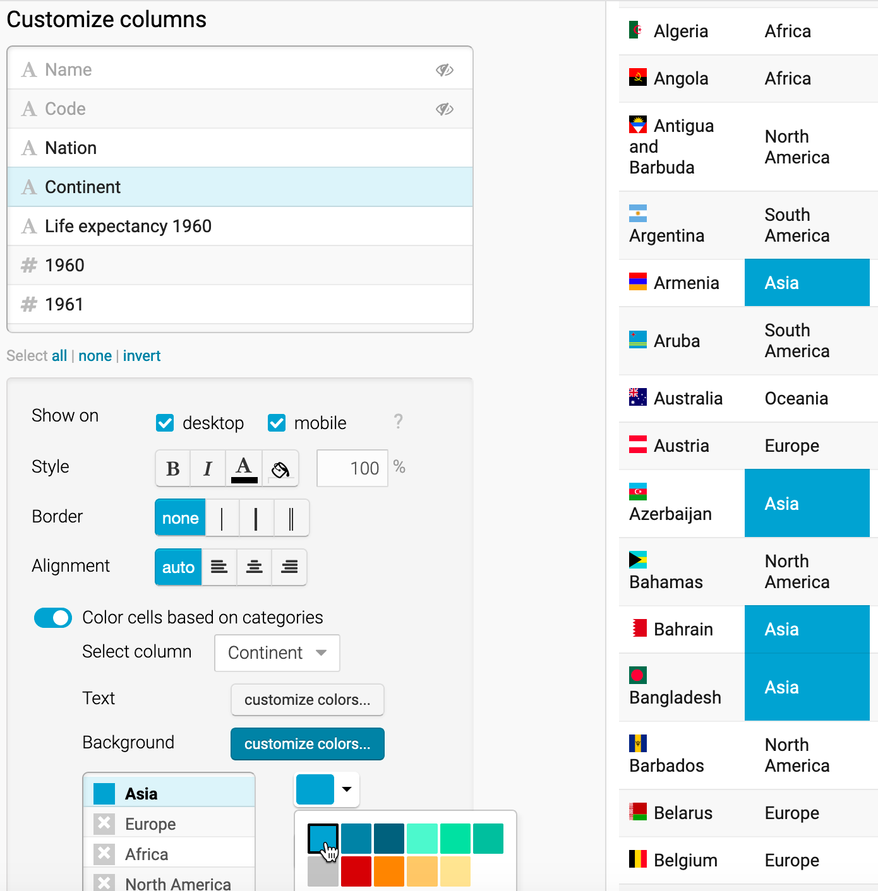

# Table Your Data {#table}

You might be surprised that a data visualization book which emphasizes charts and maps also includes a chapter on creating tables. We don't normally think about data tables as a type of visualization. But depending on your data and the story you wish to tell about it, sometimes a table is the best way to present detailed information. Tables make sense when readers want to look up a specific row of data that's highly relevant to them, such as their local community or an organization they belong to, which can be too hard to identify inside a large chart or map. Also, tables work best when readers want to precisely compare individual values to one another, but not necessarily to the rest of the dataset. Finally, tables may be more appropriate than charts when there is no broad visual pattern you wish to emphasize, and more appropriate than maps when there is no spatial pattern to highlight. Before you start designing a chart or map, consider whether it makes more sense to create a table.

In this chapter, you'll learn about table design principles and how to use [Datawrapper](http://datawrapper.de), a tool we introduced in [Chapter 5: Chart Your Data](chart.html) and [Chapter 6: Map Your Data](map.html), to create an interactive table. Interactive tables have many advantages over static tables when you publish your information online rather than print-only. First, interactive tables allow readers to search by keyword for specific details that interest them, which is vital when you present long tables with lots of rows. Second, readers can sort interactive tables in ascending or descending order for any column, which enables them to quickly scan those near the top or bottom of a long list. Finally, you'll also learn how to insert *sparklines*, or tiny charts that visually summarize data trends in each row, and automatically place them inside your Datawrapper table. Sparklines blend the best qualities of tables and charts by making it easier for readers to visually scan for patterns while skimming down the rows and columns of your data table. Later in [Chapter 8: Embed On Your Web](embed.html), you'll learn how to integrate your interactive table into your website.

## Table Design Principles {- #table-design}

Let's begin with some principles of good table design, similar to how we learned about [chart design in chapter 5](chart-design.html) and [map design in chapter 6](map-design.html). Jonathan Schwabish, an economist who specializes in creating policy-relevant data visualizations, offers his advice in recent publications about creating tables that communicate well with multiple audiences.^[@schwabishThreadSummarizingTen2020; @schwabishTenGuidelinesBetter2020; @schwabishBetterDataVisualizations2021]. Here's a summary of several of his key points, which also appear in Figure \@ref(fig:table-design).

1. Make column headers stand out above the data.
2. Use light shading to separate rows or columns.
3. Left-align text and right-align numbers for easier reading.
4. Avoid unnecessary repetition by placing labels only in the first row.
5. Group and sort data to show meaningful patterns.

(ref:table-design) A sample table that illustrates selected design principles.

```{r table-design, fig.cap="(ref:table-design)"}
knitr::include_graphics("images/07-table/table-design.png")
```

In addition, Schwabish and others recommend using color to highlight key items or outliers in your data, and we'll return to this theme in [Chapter 14: Tell Your Data Story](story.html).

Several of these table design principles are built into Datawrapper, the tool we feature in the next section.

## Datawrapper Table with Sparklines {- #datawrapper-table}

In this tutorial, you'll learn how to create an interactive table with sparklines, which makes it easier to spot different changes in this life expectancy dataset from 1960 to 2018 for over 195 nations around the world. While it's possible to present this data in a [filtered line chart as shown in chapter 5](filtered-line-chart-tableau.html), it would be difficult for readers to spot differences when shown over 180 lines at the same time. Likewise, it's possible to present this data in a [choropleth map as shown in chapter 6](map-with-datawrapper.html), but it would be hard for readers to identify data for nations with smaller geographies compared to larger ones. In this case, we'll blend sparklines for longitudinal data trends into our interactive table to help readers spot subtle differences in changes over time for life expectancy by nation, categorized by continent. This tutorial was adapted from the [Datawrapper training materials](https://www.datawrapper.de/training-materials/) and [gallery of examples](https://www.datawrapper.de/tables/), which we highly recommend.

To simplify this tutorial, we downloaded [World Bank data on life expectancy at birth from 1960 to 2018 by nation](https://data.worldbank.org/indicator/SP.DYN.LE00.IN), one of the open data repositories we listed in [Chapter 3: Find and Question Your Data](find.html). Then we cleaned up the data, such as removing nations with 5 or fewer years of data reported over a half-century, as described in the Notes. Using the [VLookup spreadsheet method from chapter 2](vlookup.html), we merged in columns of [two-letter nation codes and continents from Datawrapper](https://github.com/datawrapper/datawrapper/wiki/Country-flag-icons). We also created two new columns: one named *Life Expectancy 1960* (intentionally blank for the sparkline to come) and *Difference* (which calculates the difference between the earliest and the most recent year of data available, in most cases from 1960 to 2018). See the Notes tab for more details.

1. Open our [cleaned-up World Bank data on life expectancy at birth, 1960 to 2018, in this Google Sheet](https://docs.google.com/spreadsheets/d/1Wev14VaXyq7d7yuYo-7FwRoAjyyaY1v6z_qBoo_4VSo/edit#gid=3466257).

2. Go to [Datawrapper](https://datawrapper.de) and select *New Table*. You are not required to sign in, but if you wish to save your work, we recommend that you create a free account.

3. In the *Upload Data* screen, select that you wish to import your data from a Google Spreadsheet. Paste in the web address of our cleaned-up Google Sheet and click *Proceed.*

4. Inspect the data in the *Check and Describe* screen. Make sure that the *First row as label* box is checked, then click *Proceed*.

5. In the *Visualize* screen, under *Customize Table*, check two additional boxes: *Make Searchable* (so that users can search for nations by keyword) and *Stripe Table* (to make lines more readable).

6. Let's use a special Datawrapper code to display tiny flags before each country's name. In the *Nation* column, each entry begins with a two-letter country code, surrounded by colons, followed by the country name, such as `:af: Afghanistan`. We created the *Nation* column according to the [Combine Data into One Column section of Chapter 4: Clean Up Messy Data](combine-data.html). To learn more flag icons, read the [Datawrapper post on this topic](https://academy.datawrapper.de/article/144-how-to-insert-flag-icons-in-tables) and their [list of country codes and flags on GitHub](https://github.com/datawrapper/datawrapper/wiki/Country-flag-icons).

In the *Visualize* screen, under *Customize columns*, select the third line named *Nation*. Then scroll down and push the slider to *Replace country codes with flags*, as shown in Figure \@ref(fig:datawrapper-flag).

(ref:datawrapper-flag) Customize the *Nation* column and push slider to replace codes with flags.

```{r datawrapper-flag, fig.cap="(ref:datawrapper-flag)"}
knitr::include_graphics("images/07-table/datawrapper-flag.png")
```

7. Let's hide the first two columns, since they're no longer necessary to display. In the *Visualize* screen under *Customize columns*, select the *Name* column, then scroll down and un-check the boxes to *Show on desktop and mobile*. Repeat this step for the *Code* column. A "not visible" symbol (an eye with a slash through it) appears next to each customized column to remind us that we've hidden it.

8. Now let's color-code the *Continent* column to make it easier for readers to sort by category it in the interactive table. In the *Visualize* screen under *Customize columns*, select the *Continent* column, then scroll down and push the slider to select *Color cells based on categories*. In the drop-down menu, select the column *Continent*, and click on the *Background: customize colors* button. Select each continent and assign them different colors, as shown in Figure \@ref(fig:datawrapper-colors).

(ref:datawrapper-colors) Customize the *Continent* column and push slider to color cells based on categories.

```{r datawrapper-colors, fig.cap="(ref:datawrapper-colors)"}

```

9. Now let's prepare our data for sparklines, or tiny line charts, to visually represent change in the *Life expectancy 1960* column, which we intentionally left blank. Before you begin, you must change this column from textual data (represented by the A symbol in the *Customize columns* window) to numerical data (represented by the # symbol). At the top of the screen, click on the *2. Check and Describe* arrow to go back a step. (Datawrapper will save your work.) Now click on the table header to edit the properties for *column E: Life Expectancy 1960*. On the left side, use the drop-down menu to change its properties from *auto (text)* to *Number*, as shown in Figure \@ref(fig:datawrapper-edit-column). Then click *Proceed* to return to the *Visualize* window.

(ref:datawrapper-edit-column) Go back to *Check & Describe* to change the properties of column E from textual to numerical data.

```{r datawrapper-edit-column, fig.cap="(ref:datawrapper-edit-column)"}
knitr::include_graphics("images/07-table/datawrapper-edit-column.png")
```

10. To create the sparklines, in the *Visualize* screen under *Customize columns*, select *all* of the columns from *Life expectancy 1960* down to *2018*. To select all at once, click on one column, then scroll down and shift-click on the next-to-last column. Then scroll down the page and click the *Show selected columns as tiny chart* button, as shown in Figure \@ref(fig:datawrapper-tiny-chart). These steps will create the sparklines in the column, renamed *Life expectancy 1960--2018*, as shown in Figure \@ref(fig:datawrapper-bar-chart).

Tip: By design, we initially named this column *Life expectancy 1960*, because when we selected several columns to create sparklines, the tool added *--2018* to the end of the new column name.

(ref:datawrapper-tiny-chart) Shift-click to select all columns from *Life expectancy 1960--2018* down to *2018*, then click on *Show selected columns as tiny chart*.

```{r datawrapper-tiny-chart, out.width=300, fig.cap="(ref:datawrapper-tiny-chart)"}
knitr::include_graphics("images/07-table/datawrapper-tiny-chart.png")
```

11. Let's add one more visual element: a bar chart to visually represent the *Difference* column in the table. In the *Visualize* screen under *Customize columns*, select *Difference*. Then scroll down and push the slider to select *Show as bar chart*, as shown in Figure \@ref(fig:datawrapper-bar-chart).

(ref:datawrapper-bar-chart) Select the *Difference* column and *Show as bar chart*.

```{r datawrapper-bar-chart, fig.cap="(ref:datawrapper-bar-chart)"}
knitr::include_graphics("images/07-table/datawrapper-bar-chart.png")
```

12. In the *Visualize* screen, click the *Annotate* tab to add a title, data source, and byline.

13. Click on *Publish & Embed* to share the link to your visualization, which is also shown in Figure \@ref(fig:datawrapper-table). In the [interactive version of the table](https://datawrapper.dwcdn.net/0HK4f/2/), readers can explore the data in several ways:

- Search by keyword to display a specific nation or an entire continent.
- Sort each column in ascending or descending order.
- Scroll through pages of sparklines to quickly identify differences that would be hard to spot in the raw data table. Overall, life expectancy gradually rises in most nations, but a few display "dips" that stand out in the tiny line charts. For example, Cambodia and Vietnam both experienced a significant decrease in life expectancy, which corresponds with the deadly wars and refugee crises in both nations from the late 1960s to the mid-1970s. Sparklines help us to visually detect patterns like these, which anyone can investigate further by downloading the raw data through the link at the bottom of the interactive table.

(ref:datawrapper-table) Explore the [interactive table with sparklines](https://datawrapper.dwcdn.net/0HK4f/2/).

```{r datawrapper-table, fig.cap="(ref:datawrapper-table)"}
if(knitr::is_html_output()) knitr::include_url("https://datawrapper.dwcdn.net/0HK4f/2/", height = "1007px") else
knitr::include_graphics("images/07-table/datawrapper-table.png")
```

Also on the *Publish & Embed* screen, you'll see a blue *Publish chart* button to obtain the embed code to place your visualization on the web, which you'll learn about in [Chapter 8: Embed On Your Web](embed.html).

### Summary {- #summary7}

In this chapter you reviewed principles about table design, and how to create an interactive table with sparklines using Datawrapper. In the next chapter, you'll learn how to embed interactive charts, maps, and tables on your website so that readers can explore your data and engage with your stories.
