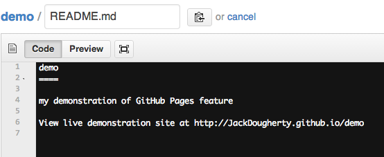

# Modify and Host Code with GitHub {#github}
In the first half of this book, we explored free web services that offer easy drag-and-drop tools to create interactive charts and maps, such as Google Sheets, Google My Maps, Carto, and Tableau Public. But these web services have limited options for designing and customizing your visualizations, and also make you dependent on their web servers to host your work. In this second half of the book, we'll explore how to copy, edit, and host code templates, meaning pre-written software instructions to create visualizations. With templates, no prior coding skills are necessary. You will learn how to make simple edits to insert your data, customize its appearance, and display it on the web on a site you control.

Enroll in our [free online course](https://www.edx.org/course/data-visualization-for-all), which introduces these topics in the brief video below, and offers more exercises and opportunities to interact with instructors and other learners.

#### Video overview {-}
<iframe width="560" height="315" src="https://www.youtube.com/embed/w6dQ-RIQ5bc?rel=0" frameborder="0" allow="autoplay; encrypted-media" allowfullscreen></iframe>

#### Tool Review {-}
GitHub (http://github.com) is a versatile tool to share, edit, and host simple code templates on the public web. Requires a free account. Although advanced coders use more powerful command-line versions of this tool, this introduction demonstrates all of the basic steps using GitHub in the web browser.

- Pros:
  - Free and easy-to-learn tool that beginners can use in the web browser.
  - Popular tool to share, copy, and edit open-source code repositories (project folders).
  - Host simple code (such as HTML/CSS/JavaScript) on the live web with GitHub Pages.
  - Built-in support to quickly display open-data formats: CSV tables and GeoJSON geography.
  - Easy to migrate code repositories to a different web server.
- Cons:
  - By default, all work on GitHub is public. Private repositories require payment.
  - New users often confuse web addresses for code repository versus published web page.

In this chapter, you will learn how to:

- [Fork and edit a simple Leaflet map with GitHub](fork-leaflet.html)
- [Fork and edit a Highcharts scatter chart with GitHub](fork-highcharts.html)
- [Create a new repository and upload code with GitHub](create-repo.html)
- [Choose an open-source code license](choose-license.html)
- [Pull request to merge changes on GitHub](pull-request.html)
- [Work more efficiently with Atom editor and GitHub Desktop](atom-desktop.html)
- [Fix Common Code and GitHub Errors](fix-code.html)

## Fork and Edit a Simple Leaflet Map with GitHub {- #fork-leaflet}
This tutorial introduces the **basic steps** of working with code templates, using a simple Leaflet map code (http://leafletjs.com) and GitHub in your browser (http://github.com). You will learn how to:

- A) Fork (copy) Leaflet template to your GitHub account
- B) Publish your live map to public web with GitHub Pages
- C) Modify your map title and add layer controls
- D) Geocode addresses [in a Google Sheet](https://docs.google.com/spreadsheets/d/1z_0hKbw8Ff_fdp-XRoRL4YWe6ue0c0EpITveZ2rz1e8/) and upload points from data.csv

Code templates help us to move beyond the limits of drag-and-drop web mapping services (such as Google MyMaps) and to create more customized visualizations on a web server that you control. Before you begin, learn the broad concepts in the chapter introduction [Modify and Host Code Templates with GitHub](github.html). For more advanced examples, see the [Leaflet Map Templates](leaflet.html) chapter in this book. If you have problems with this tutorial, go to the [Fix Common GitHub and Code Errors](fix-code.html) chapter in this book.

#### Try it {-}
You will begin this tutorial with a simple interactive map that includes one pop-up point:
<iframe src="https://handsondataviz.github.io/leaflet-map-simple/" width="90%" height="350"></iframe>

By the end of this tutorial, you will learn how to modify the map, then geocode and upload more data points:
<iframe src="https://handsondataviz.github.io/leaflet-map-simple-instructor-sample/" width="90%" height="350"></iframe>

#### Video with step-by-step tutorial {-}
<iframe width="560" height="315" src="https://www.youtube.com/embed/7iUocaxTYqk?rel=0" frameborder="0" allow="autoplay; encrypted-media" allowfullscreen></iframe>

#### A) Fork (copy) Leaflet template to your GitHub account {-}
Before you begin, sign up for a free GitHub account: http://github.com

1) Right-click to open this GitHub code template in a new tab: https://github.com/handsondataviz/leaflet-map-simple

2) In the upper-right corner of the code template, sign in to your free GitHub account

3) In the upper-right corner, click Fork to copy the template (also called a code repository, or repo) into your GitHub account. The web address (URL) of the new copy in your account will follow this format:
```markdown
https://github.com/USERNAME/REPOSITORY
```

Reminder: You can only fork a GitHub repo **one time**. If needed, see how to make a second copy in the [Create a New Repo in GitHub](create-repo.html) chapter in this book.

#### B) Publish your live map to public web with GitHub Pages {-}

4) In your new copy of the code repo, click on Settings, scroll down to the GitHub Pages area, select Master, and Save. This publishes your code template to a live map on a public website that you control.

5) Scroll down to GitHub Pages section again, to select and copy the link to your published web site, which will follow this format:
```markdown
https://USERNAME.github.io/REPOSITORY
```

6) Scroll up to the top, and click on your repo name to go back to its main page.

7) At the top level of your repo main page, click on README.md, and click the pencil icon to edit this file, written in easy-to-read Markdown code.

8) Delete the link to the current live site, and paste in the link to your site. Scroll down and Commit to save your edits.

9) On your repo main page, right-click on the link to your published site to open in a new tab. **Be patient** during busy periods, because your website may take up to 1 minute to appear the first time.

#### C) Modify your map title and add layer controls {-}

10) Go back to your browser tab for your code repo. Click on the index.html file (which contains the map code), and click the pencil icon to edit it.

11) Explore the map code, which contains HTML, CSS, and JavaScript. Look for sections that begin with "EDIT" for items that you can easily change. Scroll down to Commit your changes.

12) Go to your live website browser tab and refresh the page to view your edits. **Be patient** during busy periods, when some edits may take up to 1 minute to appear.

13) To change your map title in the index.html file, click the pencil symbol (to edit) and go to lines 23-25. Replace "EDIT your map title" with your new title:
```HTML
<!-- Display the map and title with HTML division tags  -->
<div id="map-title">EDIT your map title</div>
<div id="map"></div>
```

14) To change your initial map zoom level, edit the index.html file and go to line 33. The zoom range for this map is from 1 (max zoom out) to 18 (max zoom in).
```JavaScript
// Set up initial map center and zoom level
var map = L.map('map', {
  center: [41.77, -72.69], // EDIT latitude, longitude to re-center map
  zoom: 12,  // EDIT from 1 to 18 -- decrease to zoom out, increase to zoom in
  scrollWheelZoom: false
});
```

15) To change the default basemap, edit lines 46 and 52 to delete “.addTo(map)” from the Carto light layer, then add it to the Stamen colored terrain layer. DO NOT erase the semicolons!

Your original code looks like this (scroll to right to see all):
```JavaScript
/* Carto light-gray basemap tiles with labels */
  var light = L.tileLayer('https://cartodb-basemaps-{s}.global.ssl.fastly.net/light_all/{z}/{x}/{y}.png', {
    attribution: '&copy; <a href="http://www.openstreetmap.org/copyright">OpenStreetMap</a>, &copy; <a href="https://carto.com/attribution">CARTO</a>'
  }).addTo(map); // EDIT - insert or remove ".addTo(map)" before last semicolon to display by default
  // controlLayers.addBaseLayer(light, 'Carto Light basemap');
  /* Stamen colored terrain basemap tiles with labels */
  var terrain = L.tileLayer('https://stamen-tiles.a.ssl.fastly.net/terrain/{z}/{x}/{y}.png', {
    attribution: 'Map tiles by <a href="http://stamen.com">Stamen Design</a>, under <a href="http://creativecommons.org/licenses/by/3.0">CC BY 3.0</a>. Data by <a href="http://openstreetmap.org">OpenStreetMap</a>, under <a href="http://www.openstreetmap.org/copyright">ODbL</a>.'
  }); // EDIT - insert or remove ".addTo(map)" before last semicolon to display by default
  // controlLayers.addBaseLayer(terrain, 'Stamen Terrain basemap');
```

After you edit the code, it should look like this (scroll to right to see all):
```JavaScript
/* Carto light-gray basemap tiles with labels */
var light = L.tileLayer('https://cartodb-basemaps-{s}.global.ssl.fastly.net/light_all/{z}/{x}/{y}.png', {
  attribution: '&copy; <a href="http://www.openstreetmap.org/copyright">OpenStreetMap</a>, &copy; <a href="https://carto.com/attribution">CARTO</a>'
}); // EDIT - insert or remove ".addTo(map)" before last semicolon to display by default
// controlLayers.addBaseLayer(light, 'Carto Light basemap');
/* Stamen colored terrain basemap tiles with labels */
var terrain = L.tileLayer('https://stamen-tiles.a.ssl.fastly.net/terrain/{z}/{x}/{y}.png', {
  attribution: 'Map tiles by <a href="http://stamen.com">Stamen Design</a>, under <a href="http://creativecommons.org/licenses/by/3.0">CC BY 3.0</a>. Data by <a href="http://openstreetmap.org">OpenStreetMap</a>, under <a href="http://www.openstreetmap.org/copyright">ODbL</a>.'
}).addTo(map); // EDIT - insert or remove ".addTo(map)" before last semicolon to display by default
// controlLayers.addBaseLayer(terrain, 'Stamen Terrain basemap');
```

16) To add a control panel that turns on/off map layers, delete the code comment symbols (//) that appear in front of lines 38-41, 47, and 53 to activate these sections. When you remove code comments in GitHub, the color changes from gray text (inactive code) to colored text (active code). After you remove the code comments, your file should look like this (scroll to right to see all):
```JavaScript
/* Control panel to display map layers */
 var controlLayers = L.control.layers( null, null, {
  position: "topright",
  collapsed: false
 }).addTo(map);

/* Carto light-gray basemap tiles with labels */
var light = L.tileLayer('https://cartodb-basemaps-{s}.global.ssl.fastly.net/light_all/{z}/{x}/{y}.png', {
  attribution: '&copy; <a href="http://www.openstreetmap.org/copyright">OpenStreetMap</a>, &copy; <a href="https://carto.com/attribution">CARTO</a>'
}); // EDIT - insert or remove ".addTo(map)" before last semicolon to display by default
 controlLayers.addBaseLayer(light, 'Carto Light basemap');
/* Stamen colored terrain basemap tiles with labels */
var terrain = L.tileLayer('https://stamen-tiles.a.ssl.fastly.net/terrain/{z}/{x}/{y}.png', {
  attribution: 'Map tiles by <a href="http://stamen.com">Stamen Design</a>, under <a href="http://creativecommons.org/licenses/by/3.0">CC BY 3.0</a>. Data by <a href="http://openstreetmap.org">OpenStreetMap</a>, under <a href="http://www.openstreetmap.org/copyright">ODbL</a>.'
}).addTo(map); // EDIT - insert or remove ".addTo(map)" before last semicolon to display by default
 controlLayers.addBaseLayer(terrain, 'Stamen Terrain basemap');
```
17) To change one point on the map, you could edit the latitude and longitude coordinates of the single marker in lines 55-57. To find coordinates for any location and to learn more, go to http://www.latlong.net

```JavaScript
/* Display a blue point marker with pop-up text */
L.marker([41.77, -72.69]).addTo(map) // EDIT latitude, longitude to re-position marker
.bindPopup("Insert pop-up text here"); // EDIT pop-up text message
```
But a better way to display several points is to remove the code comment symbols (//) in front of lines 60-69 to activate this section of code, which pulls map points from the data.csv file in your GitHub repository. After your edits, this section should look like this (scroll right to see all):
```JavaScript
/* Upload Latitude/Longitude markers from data.csv file, show Title in pop-up, and override initial center and zoom to fit all in map */
 var customLayer = L.geoJson(null, {
  onEachFeature: function(feature, layer) {
    layer.bindPopup(feature.properties.Title);
  }
 });
 var runLayer = omnivore.csv('data.csv', null, customLayer)
 .on('ready', function() {
  map.fitBounds(runLayer.getBounds());
 }).addTo(map);
 controlLayers.addOverlay(customLayer, 'Markers from data.csv');
```

#### D) Geocode addresses in Google Sheet and upload points from data.csv {-}

18) A better way to display multiple points on your map is to prepare and upload a new data.csv file to your GitHub repository. First, right-click to open this Google Sheets template in a new tab: [Leaflet Maps Simple data points with Geocoder](https://docs.google.com/spreadsheets/d/1z_0hKbw8Ff_fdp-XRoRL4YWe6ue0c0EpITveZ2rz1e8/)

19) Since this sheet is view-only, you cannot edit it. Instead, sign in to your Google account in the upper-right corner.

20) Go to File > Make a Copy, which will save a duplicate version to your Google Drive, which you can edit.

21) In your copy of the Google Sheet, select any cells and press Delete on your keyboard to erase contents. Type new titles and addresses into columns A and B.

22) To geocode your new addresses (which means converting them into latitude and longitude coordinates), select all of the contents across 6 columns, from Address (B) to Source (G).

23) Go to the Geocoder menu that appears in this special Google Sheet template, and select any service, such as US Census (for US addresses) or Google Maps. The first time you run the geocoder, the script will ask for permission.

24) After you have geocoded your addresses, go to File > Download As > Comma-separated values (.CSV format) to save the file to your computer.

25) In your computer, right-click the downloaded file to rename it to: data.csv

26) In your GitHub repository, click Upload Files, then drag-and-drop your new data.csv file, and Commit to upload it. Go to your live map browser tab and refresh to view changes. **Be patient* during busy periods, when some edits may take up to 1 minute to appear.**

#### Learn more {-}
- To solve problems, see [Fix Common GitHub and Code Errors](fix-code.html) chapter in this book.
- See more [advanced Leaflet Map Templates](leaflet.html) in this book
- About Leaflet https://leafletjs.com
- GitHub Pages features and tutorial, https://pages.github.com

## Fork and Edit a Highcharts Scatter Chart with GitHub {- #fork-highcharts}
TODO: Decide whether to keep or replace with Chart.js

This tutorial introduces the **basic steps** of working with code templates, using a simple Highcharts scatter chart code (http://highcharts.com) and GitHub in your browser (http://github.com). You will learn how to:

- A) Fork (copy) the Highcharts template to your GitHub account
- B) Publish your live chart to the public web with GitHub Pages
- C) Modify the chart title, subtitle, and axis labels
- D) Upload new data points from a comma-separated values (.csv) spreadsheet

Code templates help us to move beyond the limits of drag-and-drop web tools (such as Google Sheets and Tableau Public) and to create more customized visualizations on a web server that you control. Before you begin, learn the broad concepts in the chapter introduction [Modify and Host Code Templates with GitHub](github.html). For more advanced examples, see the [Highcharts Templates](highcharts.html) chapter in this book. If you have problems with this tutorial, go to the [Fix Common GitHub and Code Errors](fix-code.html) chapter in this book.

#### Try it {-}
You will begin this tutorial with a basic chart template that includes only 7 points. Right-click to open [full-size chart in new tab](https://handsondataviz.github.io/highcharts-scatter-csv/).

<iframe src="https://handsondataviz.github.io/highcharts-scatter-csv/" width="90%" height=425></iframe>

By the end of this tutorial, you will learn how to modify the chart and add a new CSV spreadsheet with over 160 points. Right-click to open [full-size chart in new tab](https://handsondataviz.github.io/highcharts-scatter-csv-instructor-sample).

<iframe src="https://handsondataviz.github.io/highcharts-scatter-csv-instructor-sample/" width="90%" height=425></iframe>

#### Video with step-by-step tutorial {-}
<iframe width="560" height="315" src="https://www.youtube.com/embed/72pgCZqWg7Q?rel=0" frameborder="0" allow="autoplay; encrypted-media" allowfullscreen></iframe>

#### A) Fork (copy) the Highcharts template to your GitHub account {-}

Before you begin, sign up for a free GitHub account: http://github.com

1) Right-click to open this GitHub code template in a new tab: https://github.com/handsondataviz/highcharts-scatter-csv

2) In the upper-right corner of the code template, sign in to your free GitHub account

3) In the upper-right corner, click Fork to copy the template (also called a code repository, or repo) into your GitHub account. The web address (URL) of the new copy in your account will follow this format:
```markdown
https://github.com/USERNAME/REPOSITORY
```

Reminder: You can only fork a GitHub repo **one time**. If needed, see how to make a second copy in the [Create a New Repo in GitHub](create-repo) chapter in this book.

#### B) Publish your live chart to the web with GitHub Pages {-}
4) In your new copy of the code repo, click on Settings, scroll down to the GitHub Pages area, select Master, and Save. This publishes your code template to a live map on a public website that you control.

5) Scroll down to GitHub Pages section again, to select and copy the link to your published web site, which will follow this format:
```markdown
https://USERNAME.github.io/REPOSITORY
```

6) Scroll up to the top, and click on your repo name to go back to its main page.

7) At the top level of your repo main page, click on README.md, and click the pencil icon to edit this file, written in easy-to-read Markdown code.

8) Delete the existing link to the live site, and paste in the link to your site. Scroll down and Commit to save your edits.

9) On your repo main page, right-click on the link to your published site to open in a new tab. **Be patient** during busy periods, when your website may take up to 1 minute to appear the first time.

#### C) Modify the chart title, subtitle, and axis labels {-}
10) Go back to your browser tab for your code repo. Click on the index.html file (which contains the chart code), and click the pencil icon to edit it.

11) Explore the chart code, which contains HTML, CSS, and JavaScript. Look for code comments that begin with "EDIT" for sections that you can easily change, such as title, subtitle, x-axis and y-axis labels, and tooltip data labels. Scroll down to Commit your changes.

12) Go to your live website browser tab and refresh the page to view your edits. **Be patient** during busy periods, when some edits may take up to 1 minute to appear.

#### D) Upload new data points from a .CSV spreadsheet {-}

13) Go to your GitHub code repository tab and click to view the file named: data-scatter.csv

14) GitHub automatically opens CSV files. Although it's possible to edit the file inside GitHub, let's upload a larger data file with the same name. Click this link and Save to download to your computer: [data-scatter in CSV format](data/data-scatter.csv).

15) In your GitHub code repo, click Upload Files, and drag the new data-scatter.csv into the folder, and Commit changes to replace the existing file with the same name.

16) In your GitHub repo, click the new data-scatter.csv file to inspect the changes. Then go to your live website tab and refresh to see the updated scatter chart. ** Be patient** during busy periods, when changes make take up to 1 minute to appear.

#### Learn more {-}
- To solve problems, see the [Fix Common GitHub and Code Errors](fix-code.html) chapter in this book.
- See more [Highcharts Templates](highcharts.html) in this book
- Highcharts Demos http://highcharts.com/demo and Highcharts Docs http://www.highcharts.com/docs
- GitHub Pages features and tutorial, https://pages.github.com

## Create a New Repo and Upload Code with GitHub {- #create-repo}
Question: If I already forked one copy of a GitHub code repository, GitHub will not allow me to fork it a second time. So how do I make a second copy of a repo?

Answer: GitHub has a "one-fork" rule for good reasons, but here's a simple way for beginners to work around it, using only your web browser and any computer (such as Mac, Windows, or Chromebook).

- Create a brand-new repository on GitHub in your browser
- Download an existing code repository and unzip the folder
- Upload the contents of that folder to your new repository and Commit Changes

#### Video with step-by-step tutorial {-}
<iframe width="560" height="315" src="https://www.youtube.com/embed/Hev2UcoLtfw?rel=0" frameborder="0" allow="autoplay; encrypted-media" allowfullscreen></iframe>

1) Follow these steps if you have already forked a GitHub repository and wish to make a second copy of it. For example, imagine that you have already forked a copy of the Leaflet Maps with Google Sheets repository from <https://github.com/handsondataviz/leaflet-maps-with-google-sheets> **TO DO change repo address**

2) If you try to "fork" it again, GitHub will simply send you back to the first forked copy you already made. Clicking the "fork" button a second time is useless here.

3) Instead, go to your GitHub account and Create a New Repository. Give it a different name, and click the box to create a README.md file, then scroll down to click the Create button.

4) Go to the original repository where you wish to make a second copy, and click the Clone or Download button, and Download a zipped (compressed) file to your computer.

5) In your computer downloads folder, unzip the compressed file, typically by double-clicking it.

6) Go to the top level of your brand-new GitHub repository, and click the Upload Files button. Drag-and-drop all of the contents of the code repo you downloaded, EXCEPT the README.md file, because you have already created a new one. Click the Commit Changes button and be patient. During busy periods, a large upload may take 1 minute or more for GitHub to process.

7) When the upload is done, inspect the contents that you copied into your brand-new repository. To publish your new repo to the live web, go to Settings > GitHub Pages > select Master branch > Save. Then copy the link to your published live site and paste into your README.md file for future reference. If you need to review these last steps, see Part B: Publish section of the [Fork and Edit a Leaflet Map](fork-leaflet.html) chapter in this book.

## Choose an Open-Source Code License {- #choose-license}
Whether you create a new code repository on GitHub, or fork a copy of someone else's code, you should understand the basic concepts of a software license. Developers have the option to add a `LICENSE` file to their GitHub repo, which explains what other people can (or cannot) do with their code.

On GitHub, free repos are publicly viewable and forkable by other users, so the platform encourages the use of open-source licenses. One example that is commonly used for code templates linked to this book is the MIT License: it allows anyone to copy, modify, and redistribute the code, as long as they credit the author(s) and do not hold them liable. Learn more about different types of open-source code licenses at http://choosealicense.com

#### Learn more {-}
Licensing a Repository, GitHub Help page, https://help.github.com/articles/licensing-a-repository/

## Pull Request to Merge Changes on GitHub {- #pull-request}
TODO: REWRITE this out-of-date page to focus solely on pull requests, branches, and merge changes

Sign up for a [free GitHub account](http://github.com), a free multi-purpose tool that allows you to:

- View and fork a copy of open-source code from other users
- Make simple edits to your code directly in the browser
- Share your code and receive or suggest revisions to others
- Host a live version of your web code with GitHub Pages

GitHub is free if you publicly share your work. Private accounts require a subscription.

This chapter shows the basic steps to use GitHub **entirely in your browser**, which works well for new users on nearly any computer (Mac, Windows, Chromebook, etc.) Intermediate users will want to read the next chapter with supplemental tools: GitHub Desktop and Atom editor. Advanced users may prefer to use GitHub command-line instructions, which are beyond the scope of this book.

**TO DO:** REWRITE directions below to point users to GitHub Desktop and Atom Editor for editing on personal computer

Newcomers can host their code on GitHub, and publish to the web using the GitHub Pages feature, by following step-by-step instructions or this [YouTube video screencast](http://youtu.be/ZVejLE8qtOI).

<iframe width="560" height="315" src="https://www.youtube.com/embed/ZVejLE8qtOI?rel=0" frameborder="0" allow="autoplay; encrypted-media" allowfullscreen></iframe>

This basic tutorial demonstrates how to work with GitHub entirely through the browser. More advanced GitHub users may download other free tools (such as [GitHub for Mac](https://mac.github.com) or [GitHub for Windows](https://windows.github.com) or use other methods (such as the terminal command line) to work more efficiently.

1) Inside your free GitHub account, create a new repository (also known as a repo) to host your project's code (such as an index.html file and more).


2) Enter a repository name and description and check the box to automatically add a README file. If desired, select an open-source license (such as MIT), and click the Create Repository button.


3) Your new repository automatically starts opens the "master" branch. Use the drop-down menu to create a new branch, and name it "gh-pages" (which is short for GitHub Pages), and press enter or return on your keyboard.


In this tutorial, we do all of our editing and testing work in the gh-pages branch, which automatically appears on the public web. When we're done, we will pull a copy (or sync) our completed work to the master branch for safekeeping and open sharing.

4) To add ONE NEW FILE to the gh-pages branch, click the + button next to the repository name and enter the file name. For example, index.html is the default file name for most web projects.


5) Select the "soft wrap" option (which makes long code strings more readable), and paste code into the editor. In this example, I pasted HTML code that was generated by publishing an interactive chart from a Google Spreadsheet.


6) At the bottom, select the "commit" button (which means you are making a code change). Optionally, name and describe your commit, if you wish to track changes to your work.


7) Edit an existing file in the gh-pages branch by selecting its title. For example, select the README filename (which should have been automatically generated when you created the repository and the gh-pages branch). On the next screen, select the Edit button.


8) When editing the README file, type a link to the live web version of this repository, so that visitors may easily click to view it. The GitHub generic public web address is a combination of your username and ".github.io/" and your repository name, like this: `http://USERNAME.github.io/REPOSITORYNAME`

In my README file, I typically write it this way so that visitors know to click the link:
View live demonstration site at *TO DO: insert link*

Commit your change to the README file in the gh-pages branch by pressing the green button at the bottom of the editor page.



Hint: If you named your file "index.html" then you don't need to add anything else to the web address, because the site will automatically point to this default file. But if you entered a different file name, such as "sample.html", then you need to add it to the web address in this way:  `http://Username.github.io/Repositoryname/sample.html`

9) Select the repository name to go to the upper-most file in the gh-pages branch.

10) To view your live index.html code on the public web, click the link you created in your README file. (Hint: use the right-click feature to open in a new tab/window). Important: The very first time you create a gh-pages branch, it may take up to 10 minutes for its content to appear on the open web. Afterwards, when you add or edit files in this branch, they should appear nearly instantly on the web, though you may need to refresh your browser to view any changes you have made.


11) To add MULTIPLE FILES to the gh-pages branch, you could copy and paste each one individually as shown above, or choose one of these labor-saving options:


If a code template already exists somewhere on GitHub, "fork" a copy of the repository to your own account, create a gh-pages branch for the live web, and edit/modify the files as desired.

To sync and upload multiple files from your desktop to a GitHub repository, use the free GitHub for Mac or GitHub for Windows tool, which features a graphical user interface to do tasks above very easily.
Advanced coders may use command-line instructions to upload and sync files to GitHub most efficiently.

12) To BACKUP and SHARE your work: After adding or editing files in the gh-pages branch, create a "pull request" (to merge files) to the master branch.


13) Use the drop-down menus to CAREFULLY select the direction of the merge in this TO-FROM format:
TO master branch FROM gh-pages branch


14) Follow these steps to finish the pull request, which merges all content TO the master branch FROM gh-pages branch:

- Create the pull request (select green button)
- Give it a title (such as "updated index and ReadMe")
- Send pull request (green button)
- Merge pull request (another green button)
- Confirm merge (and another green button!)
- Always double-check your repository branch names to do editing and live web testing in the gh-pages branch, then make sync a copy to public share in the master branch.

To embed an interactive data visualization from a GitHub Pages host site into a secondary website (such as an organization's WordPress.org site), see the [Embed iframe with WordPress tutorial in this book](iframe-wordpress.html).

See my sample repositories, with links to live demo sites, at https://github.com/?tab=repositories. Learn more about GitHub general features to share and collaborate on other users' public code repositories.

**TO DO**
Reminder: GitHub allows users to create **one fork** of a repo to your account. To create a second copy, go to the repo of your first copy, click Settings, and rename it. But if you rename your repo, you also will need to change any links you created to its live version in the next section.


## Work more efficiently with Atom editor and GitHub Desktop {- #atom-desktop}
TODO: REVISE outdated page: While you can do **nearly** everything in this book with GitHub in your browser, several steps will be faster and more efficient with two related free tools:

- download Atom Editor from GitHub (https://atom.io)
- download GitHub Desktop for Mac or Windows (https://desktop.github.com)

**UPDATE OLD INSTRUCTIONS**

Download the free GitHub Desktop tool to sync and  additional GitHub repos on your local Mac or Windows computer.
GitHub allows users to create one fork of the basic Searchable Map template repository. To create a second template, or to move and edit multiple files for more advanced versions, download the GitHub for Mac/Windows tool.
1. Download the free tool: [GitHub for Mac](https://mac.github.com/) or [GitHub for Windows](https://windows.github.com/)
1. In the Searchable Map Template in GitHub, click __Clone__ and save to your hard drive
1. In your GitHub browser, create a new repository for your second template, and select options to create a README.MD and license (recommended: MIT).
1. Clone your second template repository to your hard drive
1. In your hard drive, copy and paste the files from the cloned Searchable Map Template to your cloned second template. Replace the existing README.MD and license files.
1. In your GitHub for Mac/Windows tool, __Commit and Sync__ your second template to your GitHub online account. Title the commit before clicking the button.
1. Refresh your browser to view the synced files in your GitHub account. Start at the top of these directions to remove an old gh-pages branch, create a new gh-pages branch, and edit files.

## Fix Common GitHub and Code Errors {- #fix-code}
What happens if you cannot view your published GitHub repository, or if your code breaks and no longer displays what it was designed to show? These are common problems, especially for newer students, because accidentally clicking the wrong box or mistakenly erasing a single character (such as a semicolon) can make your visualization seem to vanish, even though your work is usually still there. Breaking your code---and figuring out how to fix it---is a great way to learn, even if it requires trial and error.

#### Safely Delete your GitHub Repo and Start Over {-}
If you need to delete your GitHub repo and start over, here's a simple way to safely save your work:

- Go to the top-level of your GitHub repository, similar to `https://github.com/USERNAME/REPOSITORY`
- Click the green "Clone or Download" button, and select Download Zip to receive a compressed folder of your repo contents on your computer.
- In your GitHub repo, click on Settings (upper-right area) and scroll down to Delete This Repository.
- To prevent accidental deletions, GitHub requires you to type in the REPOSITORY name.
- Now you can start over in one of these ways:
  - If you wish to [Create a Simple Web Page with GitHub Pages](github-pages.html), follow that tutorial again.
  - OR
  - Fork another copy of the original GitHub repository to your account. After you create your copy, if you wish to add selected files that you previously downloaded to your computer, follow directions to [Upload Code with GitHub](create-repo) in the second half of this tutorial in this book

#### Problems with Creating a Simple Web Page with GitHub Pages {-}
If you followed the [Create a Simple Web Page with GitHub Pages tutorial](github-pages.html), it should have created two web links (or URLs):

- your code repository, in this format: `https://github.com/USERNAME/REPOSITORY`
- your published web page, in this format: `https://USERNAME.github.io/REPOSITORY`

Be sure to insert your GitHub username, and your GitHub repository name, in the general formats above.

These URLs are NOT case-sensitive, which means that `https://github.com/USERNAME` and `https://gitub.com/username` point to the same location.

##### My simple GitHub web page does not appear {-}
- Make sure that you are pointing to the correct URL for your published web page, in the format shown above.
- Be patient. During busy periods on GitHub, it may take up to 1 minute for new content to appear in your browser.
- Do a "hard refresh" to [bypass any saved content in your browser cache](https://en.wikipedia.org/wiki/Wikipedia:Bypass_your_cache).
  - Ctrl + F5 (most Windows-Linux browsers)
  - Command + Shift + R (Chrome or Firefox for Mac)
  - Shift + Reload button toolbar (Safari for Mac)
- Test the link to your published web page in a different browser. If you normally use Chrome, try Firefox.
- On rare occasions, the GitHub service or GitHub Pages feature may be down. Check <https://status.github.com>.

##### My simple GitHub web page does not display my iframe {-}
- If you followed the [Create a Simple Web Page with GitHub Pages tutorial](github-pages) and inserted an iframe in the README.md file, it will appear in your published web page, under these conditions:
  - Ideally, your README.md should be the ONLY file in this GitHub repository
  - Any other files in your repo (such as index.html, default.html, or index.md) will block the iframe HTML code in your README.md from being published on the web. If you accidentally selected a GitHub Pages Theme, you need to delete any extra files it created: click each file, select trash can to delete it, and commit changes.


#### Problems with iframes {-}

##### My iframe does not appear in my web page {-}
- Go back to the [Embed tutorials in this book](embed.html) to double-check the directions
- Items listed in your iframe (such as the URL, width, or height) should be enclosed inside straight quotation marks (single or double)
  - BROKEN iframe (missing quotation marks for width and height)
  ```
  <iframe src="https://handsondataviz.github.io/leaflet-map-simple" width=90% height=350></iframe>
  ```
  - FIXED iframe (with correct quotation marks)
  ```
  <iframe src="https://handsondataviz.github.io/leaflet-map-simple" width="90%" height="350"></iframe>
  ```
- Use only `https` (the extra 's' means 'secure'), not `http`. Some web browsers will block content if it mixes http and https resources, and some code templates in this book require https.


- Use only straight quotes, not curly quotes. Avoid pasting text from a word-processor into GitHub, which can accidentally carry over curly quotes. Typing directly into the GitHub editor will create straight quotes.


#### Problems with Leaflet Maps with Google Sheets template {-}

##### My map does not appear {-}
1) Confirm that you have completed all of the key steps in the [Leaflet Maps with Google Sheets](leaflet-with-google-sheets) tutorial in this book, especially these:
  - Sign in to Google and File > Make a Copy of the Google Sheet to your Google Drive.
  - File > Publish your Google Sheet (Jack often forgets this key step!)
  - Copy your Google Sheet web address from top of your browser (usually ends with `...XYZ/edit#gid=0`) and paste into your `google-doc-url.js` file in your GitHub repo. Do NOT copy the *Published* web address (which usually ends with `...XYZ/pubhtml`)
  - When you paste your Google Sheet web address into `google-doc-url.js`, be careful not to erase single-quote marks or semicolon
  - Go to your live map link, which should follow this format: `https://USERNAME.github.io/REPOSITORY`, refresh the browser, and wait at least 30 seconds.

2) Check your Google Sheet for errors:
- Do NOT rename column headers (in row 1) of any sheet, because the Leaflet Map code looks for these exact words.


- Do NOT rename row labels (in column A) of any sheet, due to the same reason above.


- In your Points tab, DO NOT leave any blank rows

3) Confirm on GitHub Status (https://status.github.com/) that all systems are operational.

4) If you cannot find the problem, go to the top of this page to Safely Delete Your GitHub Repo and Start Over. Also, make a new copy of the Google Sheet template, give it a new name, and copy data from your old sheet using File > Paste Special > Values Only.

#### Problems with Chart.js code templates {-}

##### Chart displays old data {-}
If you upload new data to your Chart.js code template on GitHub Pages, and it does not appear in your browser after refreshing and waiting up to one minute, then GitHub Pages is probably not the cause of the problem. Instead, some browsers continue to show "old" Chart.js in the web cache. The simplest solution is to File > Quit your browser and re-open the link to your Chart.js

#### Problems with Mac Computers {-}

##### No file extensions {-}

Several tools in this book will not work properly if your Mac Finder does not display file extensions. In other words, every file should include a period followed by several letters (such as data.csv and map.geojson). If you do not see these extensions at the end of each file name, then go to Finder > Preferences > Advanced and check the box to turn them on, as show below:


#### Solve Problems with Browser Developer Tools {-}
Peek inside any website and view the web code under the hood with the browser developer tools.

In Chrome for Mac, go to View > Developer > Developer Tools


In Firefox for Mac, go to Tools > Web Developer > Inspector


