# Edit and Host Code with GitHub {#github}
In the first half of this book, you created interactive charts and maps on free drag-and-drop tool platforms created by companies such as Google and Tableau. These platforms are great for beginners, but their pre-set tools limit your options for designing and customizing your visualizations, and they also require you to depend upon their web servers and terms of service to host your data and work products. If these companies change their tools or terms, you have little choice in the matter, other than deleting your account and switching services, which means that your online charts and maps would appear to audiences as dead links.

In the second half of this book, get ready to make a big leap---and we'll help you through every step---by learning how to copy, edit, and host code templates. These templates are pre-written software instructions that allow you to upload your data, customize its appearance, and display your interactive charts and maps on a web site that you control. No prior coding experience is required, but it helps if you're *code-curious* and willing to experiment with your computer.

Code templates are similar to cookbook recipes. Imagine you're in your kitchen, looking at our favorite recipe we've publicly shared to make brownies (yum!), which begins with these three steps: `Melt butter, Add sugar, Mix in cocoa.` Recipes are templates, meaning that you can follow them precisely, or modify them to suit your tastes. Imagine that you copy our recipe (or "fork" it, as coders say) and insert a new step: `Add walnuts`. If you also publicly share your recipe, now there will be two versions of instructions, to suit both those who strongly prefer or dislike nuts in their brownies. (We do not take sides in this deeply polarizing dispute.)

Currently, the most popular cookbook among coders is [GitHub](https://github.com), with more than 40 million users and over 100 million recipes (or "code repositories" or "repos"). You can sign up for a free account and choose to make your repos private (like Grandma's secret recipes) or public (like the ones we share below). Since GitHub was designed to be public, think twice before uploading any confidential or sensitive information that should not be shared with others. GitHub encourages sharing *open-source code*, meaning the creator grants permission for others to freely distribute and modify it, based on the conditions of the type of license they have selected.

When you create a brand-new repo, GitHub invites you to [Choose a License](https://choosealicense.com/). Two of the most popular open-source software licenses are the [MIT License](https://choosealicense.com/licenses/mit/), which is very permissive, and the [GNU General Public License version 3](https://choosealicense.com/licenses/gpl-3.0/), which mandates that any modifications be shared under the same license. The latter version is often described as a *copyleft* license that requires any derivatives of the original code to remain publicly accessible, in contrast to traditional *copyright* that favors private ownership. When you fork a copy of someone's open-source code on GitHub, look at the type of license they've chosen (if any), keep it in your version, and respect its terms.

To be clear, the GitHub platform is also owned by a large company (Microsoft purchased it in 2018), and when using it to share or host code, you're also dependent on its tools and terms. But the magic of code templates is that you can migrate and host your work anywhere on the web. You could move to a competing repository-hosting service such as [GitLab](http://gitlab.com), or purchase your own domain name and server space through one of many web hosting services. Or you can choose a hybrid option, such as hosting your code on GitHub and choosing its custom domain option, to display it under a domain name that you've purchased, just like the web version of this book is hosted on GitHub under our domain name, https://HandsOnDataViz.org. If we choose to move the code away from GitHub, we have the option to repoint our domain to a different web host.

In the next section of this chapter, we will introduce basic steps to [fork, edit, and host a simple Leaflet map code template on GitHub](fork-leaflet.html).

Later you'll learn how to [create a new GitHub repo and upload code files](create-repo.html).

This chapter introduces GitHub using its web browser interface, which works best for beginners. Later you'll learn about more advanced tools, such as [GitHub Desktop and Atom Editor to work more efficiently](github-desktop-atom.html) on your personal computer.

If problems arise, turn to the [Fix Common Code Errors](fix-code.html) section in the appendix. All of us make mistakes and accidentally "break our code" from time to time, and it's a great way to learn how things work---and what to do when it doesn't work!

## Fork, Edit, and Host a Simple Leaflet Map Template {- #fork-leaflet}
Now that you understand how [GitHub](http://github.com) code repositories are like a public cookbook of recipes, which anyone can copy and modify, let's get into the kitchen and start baking! In this section, we'll introduce you to a very simple code template that creates an interactive map using [Leaflet](http://leafletjs.com), an open-source code library that's very popular with coders, journalists, businesses, and government agencies. Many people chose Leaflet because the code is freely available to everyone, relatively easy to use, and has an active community of supporters who regularly update it. But unlike drag-and-drop tools that we covered in previous chapters, such as Google My Maps or Tableau Public, Leaflet requires you to write (or copy and paste) several lines of code, which need to be hosted on a web server so that other people can view your map in their web browser. Fortunately, we can do all of these steps in our web browser on GitHub. This means you can do this on any type of computer: Mac, Windows, Chromebook, etc.

Here's an overview of the key steps we'll cover in this section:

- Get a free GitHub account and fork your copy of a simple Leaflet map code template
- Edit the Leaflet map title, starting position, background layer, and marker
- Host a live online version of your modified map code on the public web

Your goal is to create your own version of this simple interactive map, with your edits, as shown in Figure \@ref(fig:leaflet-simple).

(ref:leaflet-simple) Create your own version of this [simple interactive Leaflet map](https://handsondataviz.github.io/leaflet-map-simple/).

```{r leaflet-simple, fig.cap="(ref:leaflet-simple)"}
if(knitr::is_html_output()) knitr::include_url("https://handsondataviz.github.io/leaflet-map-simple/") else knitr::include_graphics("images/08-github/leaflet-simple.png")
```

Before you begin, create your own free account on [GitHub](http://github.com). It may ask you to do a simple quiz to prove you're a human! If you don't see a confirmation message in your email, check your spam folder.

Tip: Choose a GitHub username that's relatively short, and one that you'll be happy seeing in the web address of charts and maps you'll publish online. In other words, `DrunkBrownieChef6789` may not be the wisest choice for a username, if `BrownieChef` is also available.

1. After you log into your GitHub account in your browser, go to our simple Leaflet map template at https://github.com/HandsOnDataViz/leaflet-map-simple

2. To create your own copy of our template, click the Fork button as shown in Figure \@ref(fig:leaflet-simple-fork).

(ref:leaflet-simple-fork) Click the Fork button to make your own copy of the code template.

```{r leaflet-simple-fork, fig.cap="(ref:leaflet-simple-fork)"}
 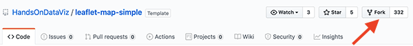
```

When you fork someone else's repo, in the upper-right corner of your browser you should see something like `USERNAME/leaflet-map-simple` forked from `HandsOnDataViz/leaflet-map-simple`, where `USERNAME` refers to your GitHub account username. This proves that you copied our template into your GitHub account. This very simple repo includes only three files: `LICENSE` shows that we've selected the MIT License, which allows anyone to copy and modify the code as they wish; `README.md` provides a simple description and link to the live demo, which we'll come back to later; `index.html` is the key file that contains the map code.

Tip: By design, GitHub allows you to fork a repo *one time*, so that you don't accidentally create two versions with the same name. If you wish to create a second version, go to the [Create a New Repo and Upload Files on GitHub](create-repo.html) section of this chapter.

3. Click on the `index.html` file to view the code, as shown in Figure \@ref(fig:leaflet-simple-index).

(ref:leaflet-simple-index) Click the Index file to view the code.

```{r leaflet-simple-index, fig.cap="(ref:leaflet-simple-index)"}
 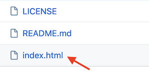
```

In case this is the first time you're looking at computer code, we've inserted several "code comments" to explain what's happening. The first block you see is written in HyperText Markup Language (HTML) that tells web browsers the formatting to read the rest of the page of code. The second block instructs the browser to load the [Leaflet](http://leafletjs.com) code library, the open-source software that constructs the interactive map. The third block describes where the map and title should be positioned on the screen, written in a language called Cascading Style Sheet (CSS). The good news is that you don't need to touch any of those blocks of code, so leave them as-is. But you do want to modify a few lines further below.

4. To edit the code, click on the the pencil symbol in the upper-right corner, as shown in Figure \@ref(fig:leaflet-simple-edit).

(ref:leaflet-simple-edit) Click the pencil button to edit the code.

```{r leaflet-simple-edit, fig.cap="(ref:leaflet-simple-edit)"}
 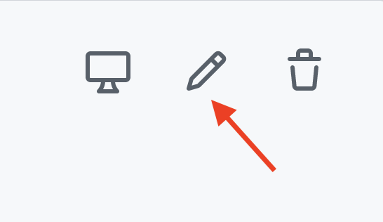
```

Let's start by making one simple change to prove to everyone that you're now editing *your* map, by modifying the map title, which appears in the HTML division tag block around lines 21-23.

5. In this line `<div id="map-title">EDIT your map title</div>`, type your new map title in place of the words `EDIT your map title`. Be careful not to erase the HTML tags which appear on both ends inside the `< >` symbols.

6. To save your edit, scroll to the bottom of the page and click the green `Commit Changes` button, as shown in Figure \@ref(fig:leaflet-simple-commit).

(ref:leaflet-simple-commit) Click the green Commit Changes button to save your edits.

```{r leaflet-simple-commit, fig.cap="(ref:leaflet-simple-commit)"}
 knitr::include_graphics("images/08-github/leaflet-simple-commit.png")
```

In the language of coders, we "commit" our changes in the same way that most people "save" a document, and later you'll see how GitHub tracks each code commit so that you can roll them back if needed. By default, GitHub inserts a short description of your commit as "Update index.html", and you have the option to customize that description when you start making lots of commits to keep track of your work. Also by default, GitHub commits your changes directly to the `master` branch of your code, which we'll explain later.

**TODO:** At this writing, GitHub is considering changing the default branch from "master" to "main". Stay tuned for updates!

Now let's publish your edited map to the public web to see how it looks in a web browser. GitHub not only stores open-source code, but its built-in [GitHub Pages](https://pages.github.com/) feature allows you to host a live online version of your HTML-based code, which anyone with the web address can view in their browser. While GitHub Pages is free to use, there are [some restrictions on size and content](https://help.github.com/en/github/working-with-github-pages/about-github-pages) and it is not intended for running an online business or commercial transactions. But one advantage of code templates is that you can host them on any web server you control. Since we're already using GitHub to store and edit our code template, it's easy to turn on GitHub Pages to host it online.

7. To access GitHub Pages, scroll to the top of your repo page and click the Settings button as shown in Figure \@ref(fig:leaflet-simple-settings).

(ref:leaflet-simple-settings) Click the Settings button to access GitHub Pages and publish your work on the web.

```{r leaflet-simple-settings, fig.cap="(ref:leaflet-simple-settings)"}
 knitr::include_graphics("images/08-github/leaflet-simple-settings.png")
```

8. In the Settings screen, scroll down to the GitHub Pages area, and use the drop-down menu to change Source from `None` to `Master Branch`, as shown in Figure \@ref(fig:leaflet-github-pages). There is no *commit* or *save* button here, and the change will happen automatically. This step tells GitHub to publish a live version of your map on the public web, where anyone can access it in their browser, if they have the web address.

(ref:leaflet-github-pages) Under GitHub Pages, switch the source from None to Master as shown in this [animated GIF](https://handsondataviz.org/images/08-github/leaflet-github-pages.gif).

```{r leaflet-github-pages, fig.cap="(ref:leaflet-github-pages)"}
if(knitr::is_html_output()) knitr::include_url("images/08-github/leaflet-github-pages.gif", height = "325px") else 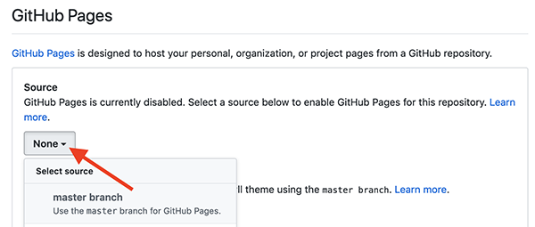
```

<!-- TODO: for the Web edition, Jack can redo the animated GIFs above and below in Camtasia, and insert a fade-out to clearly define its ending. -->

9. Scroll back down to the GitHub Pages area to see the web address where your live map has been published online, and right-click it to open in a new browser tab, as shown in Figure \@ref(fig:leaflet-github-pages2).

(ref:leaflet-github-pages2) Under GitHub Pages, double-click your published map link as shown in this [animated GIF](https://handsondataviz.org/images/08-github/leaflet-github-pages2.gif).

```{r leaflet-github-pages2, fig.cap="(ref:leaflet-github-pages2)"}
if(knitr::is_html_output()) knitr::include_url("images/08-github/leaflet-github-pages2.gif", height = "250px") else 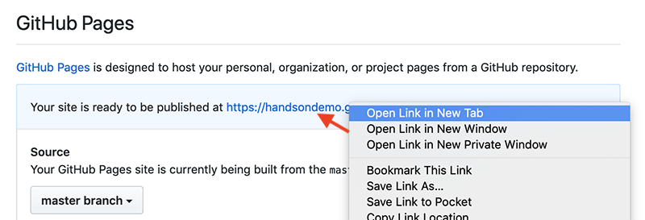
```

10. Click on the new tab to view your live map, with your new title at the top. GitHub Pages automatically generates a public web address for your repo in this format, `https://USERNAME.github.io/leaflet-map-simple`, where `USERNAME` is your GitHub account username. Remember why we told you not to create your account with a username like `DrunkBrownieChef6789`? Here's why.

<!-- TODO: Check final draft to ensure that this long Tip + Note + Tip appears correctly. -->

Tip: If your map does *not* appear right away, wait up to 30 seconds for GitHub Pages to finish processing, then do a "hard" browser refresh to contact the web server again. **TODO: Link to hard-refresh instructions in Fix section in this chapter**

Note: GitHub creates two different types of web addresses, where you should replace `USERNAME` and `REPOSITORY` with your own:

- The GitHub repo address, where you can edit your code:
  - `https://github.com/USERNAME/REPOSITORY`
- The GitHub Pages address, which publishes a live version of your code:
  - `https://USERNAME.github.io/REPOSITORY`

The live version of your code points to the `index.html` page by default, so you do not need to include it in the web address.

Finally, web addresses are *not* case sensitive, meaning that you can type all of it in lower-case to save time!


Tip: When working with the GitHub web interface, keep two browser tabs open. The first tab contains your GitHub repo, where you can edit your code. The second tab contains your GitHub Pages live version, where you can view the results of your edits. By opening your live map in a new tab, you can easily go back to edit your code repo in the first tab, and flip back to view the live results in the second tab.

Let's go back to your GitHub repo and edit the GitHub Pages links so that they point to *your* live map, in place of *our* live map.

11. Go back to your first browser tab with your GitHub repo, and click on the repo title to return to its home page, as shown in Figure \@ref(fig:leaflet-click-title).

(ref:leaflet-click-title) On your first browser tab, click the repo title.

```{r leaflet-click-title, fig.cap="(ref:leaflet-click-title)"}
 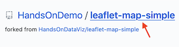
```

If you can't find your first browser tab, you can retype your repo home page address in this format, and insert your GitHub username: `https://github.com/USERNAME/leaflet-map-simple`.

12. Copy the web address of your live map (in your second browser tab) and paste it into two places on your repo home page (in your first tab). First, click the `Edit` button near the top-right corner of your repo, paste your link there, and save. Second, open the `README.md` file or scroll down to the bottom of the repo home page, click the pencil symbol to edit it, paste your link under the label "(replace with link to your site)", and scroll down to commit the change. See both steps in Figure \@ref(fig:leaflet-paste-links).

(ref:leaflet-paste-links) Paste the link to your live map at the top of your repo page, and also in your README page.

```{r leaflet-paste-links, fig.cap="(ref:leaflet-paste-links)"}
 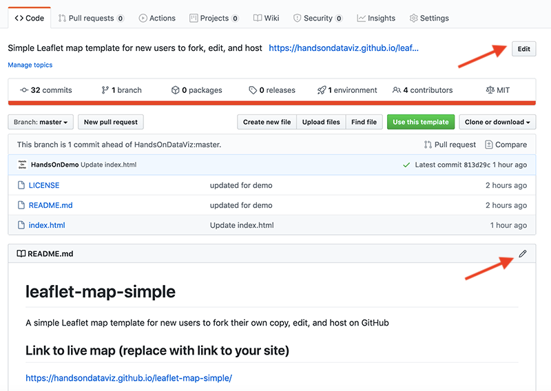
```

Pasting both of these links helps point people who discover your GitHub repo to *your* live map, rather than *our* version for this book.

Now that you've successfully made simple edits and published your live map, let's make more edits to jazz it up and help you learn more about how Leaflet code works.

13. On your repo home page, click to open the `index.html` file, and click the pencil symbol to edit more code.

Wherever you see the `EDIT` code comment, this points out a line that you can easily modify. For example, look for the code block shown below that sets up the initial center point of the map and its zoom level. Insert a new latitude and longitude coordinate to set a new center point, and find your coordinates with online tools such as [LatLong.net](https://www.latlong.net/) or Google Maps. **TODO:** Show how to find coords in GMaps here, or link if it appears earlier in the book.

```
  var map = L.map('map', {
    center: [41.77, -72.69], // EDIT latitude, longitude to re-center map
    zoom: 12,  // EDIT from 1 to 18 -- decrease to zoom out, increase to zoom in
    scrollWheelZoom: false
  });
```

The next code block displays the basemap tile layer that serve as the map background. Our template uses a light map with all labels, publicly provided by CARTO, with credit to OpenStreetMap. One simple edit is to change `light_all` to `dark_all`, which will substitute a different CARTO basemap with inverted coloring. Or see many other Leaflet basemap code options that you can paste in at https://leaflet-extras.github.io/leaflet-providers/preview/. Make sure to attribute the source, and also keep `}).addTo(map);` at the end of this code block, which displays the basemap.

```
 L.tileLayer('https://{s}.basemaps.cartocdn.com/light_all/{z}/{x}/{y}{r}.png', {
   attribution: '&copy; <a href="http://www.openstreetmap.org/copyright">OpenStreetMap</a>,
   &copy; <a href="https://carto.com/attribution">CARTO</a>'
 }).addTo(map);
```

The last code block displays a single point marker on the map, colored blue by default in Leaflet, with a pop-up message when users click it. You can edit the marker coordinates, insert the pop-up text, or copy and paste the code block to create a second marker.

```
L.marker([41.77, -72.69]).addTo(map) // EDIT latitude, longitude to re-position marker
.bindPopup("Insert pop-up text here"); // EDIT pop-up text message
```

14. After making edits, remember to scroll down and press the Commit button to save changes. Then go to your browser tab with the live map, and do a hard-refresh to view changes. If your map edits do not appear right away, remember that GitHub Pages sometimes requires 30 seconds to process code edits. If you have problems, see the [Fix Common Code Errors](fix-code.html) section in the appendix.

Congratulations! If this is the first time that you've edited computer code and hosted it online, you can now call yourself a "coder". The process is similar to following and modifying a cookbook recipe, just like you also can call yourself a "chef" after baking your first batch of brownies! Although no one is likely to hire you as a full-time paid coder (or chef) at this early stage, you now understand several of the basic skills needed to copy, edit, and host code online, and you're ready to dive into the more advanced versions, such as [Chart.js code templates in chapter 9](chartjs.html) and [Leaflet map code templates in chapter 10](leaflet.html).

The next section describes how to enhance your GitHub skills by creating new repos and uploading your files. These are essential steps to create a second copy of a code template or to work with more advanced templates in the next two chapters.

## Create a New Repo and Upload Files on GitHub {- #create-repo}
Now that you've forked an existing repo on GitHub, the next step is to learn how to create a brand-new repo and upload different types of files. These skills will be helpful for several scenarios later in this book. First, since GitHub allows you to create only *one fork* of an existing repository, if you wish to make a *second* copy, you'll need to download the code and upload it into a new repo. Second, [Chapter 9 on Chart.js code templates](chartjs.html) and [chapter 10 on Leaflet map code templates](leaflet.html) allow you to upload your own files to create data visualizations. Once again, we'll demonstrate how to do all of these steps in GitHub's beginner-level browser interface.

Let's start with GitHub's *one fork* rule. Imagine that you wish to create a second copy of the [leaflet-map-simple template](https://github.com/HandsOnDataViz/leaflet-map-simple) described in the prior section. If you attempt to create a second fork, GitHub will "gray out" the Fork button and display an error message stating that you "Cannot fork because you own this repository..." as shown in Figure \@ref(fig:repo-cannot-fork). There's a good reason for GitHub's one-fork rule: it's designed to prevent you from accidentally creating a second copy, with the same name as your first fork, which would overwrite and erase your previous work.

(ref:repo-cannot-fork) GitHub's one-fork rule prevents you from creating a second fork of a repo.

```{r repo-cannot-fork, fig.cap="(ref:repo-cannot-fork)"}
 knitr::include_graphics("images/08-github/repo-cannot-fork.png")
```

So how do you create a second copy of a GitHub repo? We'll show you two solutions. The first solution, if it exists in your case, is easy. Look for a green "Use this template" button in the upper-right screen, as shown in Figure \@ref(fig:repo-template-download), and if you see it, click it. GitHub will ask you to create a brand-new repository name for the second copy of this template, to avoid confusing it with the first copy you made. The "Use this template" button will appear only if the people who created the GitHub repo set it up as a template, and that's exactly what we, the authors of this book, did to make it super-simple for all of you to create multiple copies of our GitHub repos.

(ref:repo-template-download) If a green "Use this template" button appears, click it to work around GitHub's one-fork rule.

```{r repo-template-download, fig.cap="(ref:repo-template-download)"}
 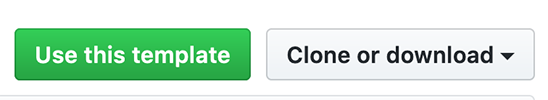
```

But what if you're trying to make a second copy of a GitHub repo where the Fork button is grayed-out and there's no green "Use this template" button? Here's a recommended workaround that follows three general steps:

- Download the existing GitHub repo to your local computer
- Create a brand-new GitHub repo, with a new name
- Upload the existing code repo files to your brand-new repo

Imagine that you've already created one fork of the [leaflet-map-simple](https://github.com/HandsOnDataViz/leaflet-map-simple) repo, as we did in the prior section. You wish to create a second copy, but the "Use this template" green button does not appear, either because the repo was created before that feature existed, or the people who created the repo didn't set it up that way.

1. Click on the "Clone or download" gray drop-down menu button on the right-side of the screen, as shown in Figure \@ref(fig:repo-template-download), and select "Download ZIP." Your browser will download a zipped compressed folder with the contents of the repo to your local computer, and it may ask you where you wish to save it. Decide on a location and click OK.

2. Navigate to the location on your computer where you saved the folder. Its file name should end with `.zip`, which means you need to double-click to "unzip" or de-compress the folder. After you unzip it, a new folder will appear named `leaflet-map-simple-master` with three files: `index.html` and `LICENSE` and `README.md`. The word `master` refers to the master branch of your repo.

3. Go back to your GitHub account in your web browser, click on the "+" plus symbol in the upper-right corner of your account, and select "New repository", as shown in Figure \@ref(fig:repo-create-new).

(ref:repo-create-new) Click the "+" plus symbol in upper-right corner to create a new repo.

```{r repo-create-new, fig.cap="(ref:repo-create-new)"}
 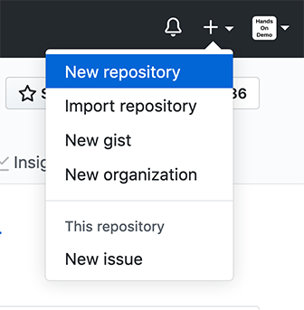
```

4. On the next screen, GitHub will ask you to create a new repo name. Choose a short one, preferably all lower-case, and separate words with hyphens if needed. Let's name it `practice` because we'll delete it at the end of this tutorial.

Check the box to "Initialize this repository with a README" to simplify the next steps. Also, "Add a license" that matches the code you plan to upload, which in this case is "MIT License." Other fields are optional. Click the green "Create Repository" button at the bottom when done, as shown in Figure \@ref(fig:repo-create-options).

(ref:repo-create-options) After naming your new repo, check the box to "Initialize this repo with a README" and "Add a license" to match the code (select "MIT").

```{r repo-create-options, fig.cap="(ref:repo-create-options)"}
 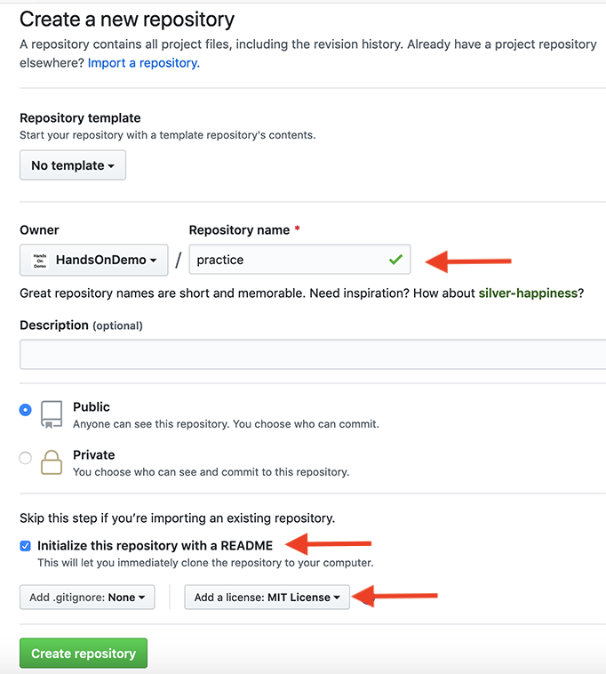
```

Your new repo will have a web address similar to `https://github.com/USERNAME/practice`.

5. On your new repo home page, click the Upload Files button, near the middle of the screen, as shown in Figure \@ref(fig:repo-upload-files).

(ref:repo-upload-files) Click the Upload Files button.

```{r repo-upload-files, fig.cap="(ref:repo-upload-files)"}
 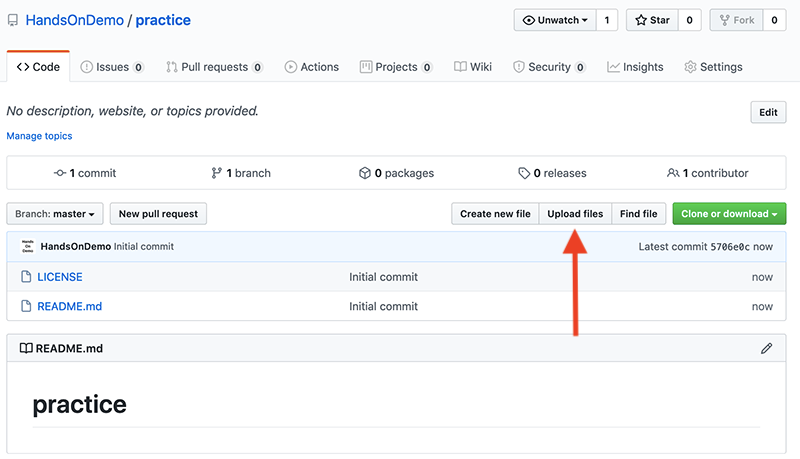
```

6. Upload the `index.html` file that you previously downloaded to your local computer by dragging-and-dropping it into the upload area of your GitHub repo in your browser, as shown in Figure \@ref(fig:repo-drag-index). Do not upload `LICENSE` or `README.md` because your new repo already contains those two files. Scroll down to click the green Commit Changes button.

(ref:repo-drag-index) Drag-and-drop the file to the upload screen.

```{r repo-drag-index, fig.cap="(ref:repo-drag-index)"}
 knitr::include_graphics("images/08-github/repo-drag-index.png")
```

When the upload is complete, your repo should contain three files, now including a copy of the `index.html` code that you previously downloaded from the `leaflet-map-simple` template. This achieved our goal of working around GitHub's one-fork rule, by creating a new repo and manually uploading a second copy of the code.

Optionally, you could use GitHub Pages to publish a live version of the code online, and paste the links to the live version at the top of your repo and your README.md file, as described in the [Fork, Edit, and Host a Simple Leaflet Map Template](fork-leaflet.html) section of this chapter.

7. Since this was only a `practice` repo, let's delete it from GitHub. In the repo screen of your browser, click the top-right Settings button, scroll all the way down to the "Danger Zone," and click "Delete this repository," as shown in Figure \@ref(fig:repo-delete). GitHub will ask you to type in your username and repo name to ensure that you really want to delete the repo, and are not a drunken brownie chef.

(ref:repo-delete) After clicking the Delete Repository button, GitHub will ask you to type your username and repo name to confirm.

```{r repo-delete, fig.cap="(ref:repo-delete)"}
 knitr::include_graphics("images/08-github/repo-delete.png")
```

<!-- TODO: Will that "drunken brownie chef" joke work here? Or is it inappropriate, or too distant from the "DrunkenBrownieChef6789" reference in the prior section?  -->

So far, you've learned how to copy, edit, and host code using the GitHub web interface, which is a great introduction for beginners. Now you're ready to move up to tools that will allow you to work more efficiently with GitHub, such as GitHub Desktop and Atom Editor, to quickly move entire repos to your local computer, edit the code, and move them back online.

## GitHub Desktop and Atom Editor to Code Efficiently {- #github-desktop-atom}
Editing your code through the GitHub web interface is a good way to start, but it can be very slow, especially if you need to modify or upload multiple files in your repo. To speed up your work, we recommend that you download two free tools---[GitHub Desktop](https://desktop.github.com) and [Atom Text Editor](https://atom.io)---which run on Mac or Windows computers. When you connect your GitHub web account to GitHub Desktop, it allows you to "pull" the most recent version of the code to your local computer's hard drive, make and test your edits, and "push" your commits back to your GitHub web account. Atom Text Editor, which is also created by the makers of GitHub, allows you to view and edit code repos on your local computer more easily than the GitHub web interface. While there are many text editors for coders, Atom is designed to work well with GitHub Desktop.

Tip: Currently, neither GitHub Desktop nor Atom Editor are supported for Chromebooks, but [Google's Web Store](https://chrome.google.com/webstore) offers several text editors, such as Text and Caret, which offer some of the functionality described below.)

Let's use GitHub Desktop to pull a copy of your `leaflet-map-simple` template to your local computer, make some edits in Atom Editor, and push your commits back up to GitHub.

1. Go to the GitHub web repo you wish to copy to your local computer. In your browser, navigate to `https://github.com/USERNAME/leaflet-map-simple`, using your GitHub username, to access the repo you created in the [Fork, Edit, and Host a Simple Leaflet Map Template](fork-leaflet.html) section of this chapter. Click the "Clone or download" button on the right side, and select "Open in Desktop," as shown in Figure \@ref(fig:desktop-open). The next screen will show a link to the GitHub Desktop web page, and you should download and install the application.

(ref:desktop-open) In your GitHub web repo, click "Clone or download" and "Open in Desktop" to download and install GitHub Desktop.

```{r desktop-open, fig.cap="(ref:desktop-open)"}
 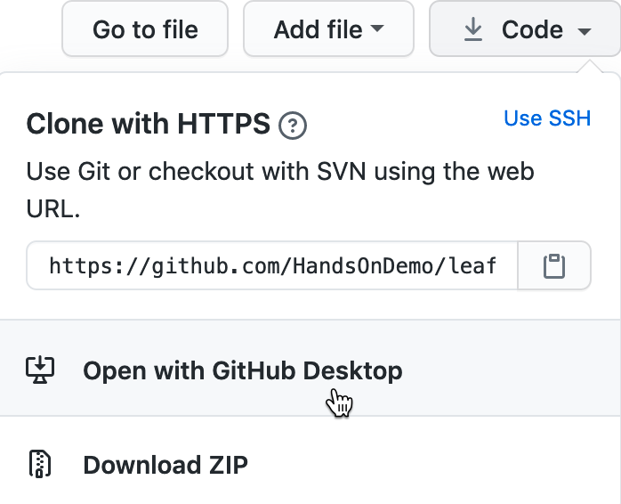
```

2. When you open GitHub Desktop for the first time, you'll need to connect it to the GitHub web account you previously created in this chapter. On the welcome screen, click the blue "Sign in to GitHub.com" button, as shown in Figure \@ref(fig:desktop-signin), and login with your GitHub username and password. On the next screen, GitHub will ask you to click the green "Authorize desktop" button to confirm that you wish to connect to your account.

(ref:desktop-signin) Click the blue "Sign in to GitHub.com" button to link GitHub Desktop to your GitHub account.

```{r desktop-signin, fig.cap="(ref:desktop-signin)"}
 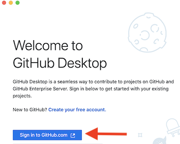
```

3. In the next setup screen, GitHub Desktop asks you to configure Git, the underlying software that runs GitHub. Confirm that it displays your username and click Continue, as shown in Figure \@ref(fig:desktop-configure).

(ref:desktop-configure) Click the Continue button to authorize GitHub Desktop to send commits to your GitHub account.

```{r desktop-configure, fig.cap="(ref:desktop-configure)"}
 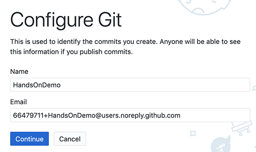
```

4. On the "Let's Get Started" with GitHub Desktop screen, click on "Your Repositories" on the right side to select your `leaflet-map-sample`, and further below click the blue button to "Clone" it to your local computer, as shown in Figure \@ref(fig:desktop-start).

(ref:desktop-start) Select your "leaflet-map-simple" repo and click the Clone button to copy it to your local computer.

```{r desktop-start, fig.cap="(ref:desktop-start)"}
 knitr::include_graphics("images/08-github/desktop-start.png")
```

5. When you clone a repo, GitHub Desktop asks you to select the Local Path, meaning the location where you wish to store a copy of your GitHub repo on your local computer, as shown in Figure \@ref(fig:desktop-clone-path). Before you click the Clone button, remember the path to this location, since you'll need to find it later.

(ref:desktop-clone-path) Select the Local Path where your repo will be stored on your computer, then click Clone.

```{r desktop-clone-path, fig.cap="(ref:desktop-clone-path)"}
 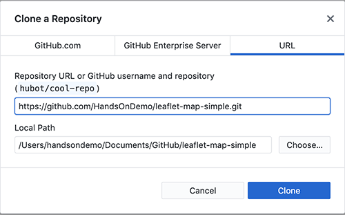
```

6. On the next screen, GitHub Desktop may ask, "How are you planning to use this fork?" Select the default entry "To contribute to the parent project," which means you plan to send your edits back to your GitHub web account, and click Continue, as shown in Figure \@ref(fig:desktop-fork).

(ref:desktop-fork) If asked how you plan to use this fork, select the default "To contribute to the parent project" and click Continue.

```{r desktop-fork, fig.cap="(ref:desktop-fork)"}
 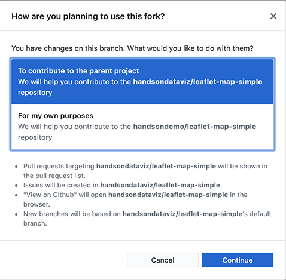
```

7. Now you have copies of your GitHub repo in two places---in your GitHub web account and on your local computer---as shown in Figure \@ref(fig:desktop-finder). Your screen may look different, depending on whether you use Windows or Mac, and the Local Path you selected to store your files.

(ref:desktop-finder) Now you have two copies of your repo: in your GitHub web account (on the left) and on your local computer (on the right, as shown in the Mac Finder). Windows screens will look different.

```{r desktop-finder, fig.cap="(ref:desktop-finder)"}
 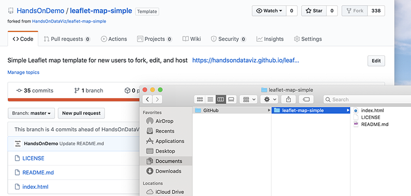
```

8. Before we can edit the code in your local computer, [download and install the Atom Editor application](https://atom.io). Then go to your GitHub Desktop screen, confirm that the Current Repository is `leaflet-map-simple`, and click the "Open in Atom" button as shown in Figure \@ref(fig:desktop-atom).

(ref:desktop-atom) In GitHub Desktop, confirm the Current Repo and click the "Open in Atom" button to edit the code.

```{r desktop-atom, fig.cap="(ref:desktop-atom)"}
 knitr::include_graphics("images/08-github/desktop-atom.png")
```

9. Since Atom Editor is integrated with GitHub Desktop, it opens up your entire repo as a "project," where you can click files in the left window to open as new tabs to view and edit code, as shown in Figure \@ref(fig:atom-project). Open your `index.html` file and edit the title of your map, around line 22, then save your work.

(ref:atom-project) Atom Editor opens your repo as a "project," where you can click files to view code. Edit your map title.

```{r atom-project, fig.cap="(ref:atom-project)"}
 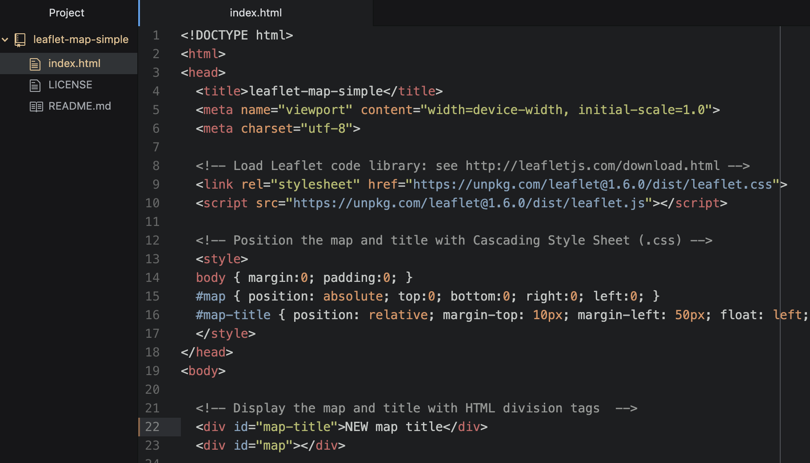
```

10. After saving your code edit, it's a good habit to clean up your Atom Editor workspace. Right-click on the current Project and select Remove Project Folder in the menu, as shown in Figure \@ref(fig:atom-remove-project). Next time you open up Atom Editor, you can right-click to Add Project Folder, and choose any GitHub repo that you have copied to your local computer.

(ref:atom-remove-project) To clean up your Atom Editor workspace, right-click to Remove Project Folder.

```{r atom-remove-project, fig.cap="(ref:atom-remove-project)"}
 knitr::include_graphics("images/08-github/atom-remove-project.png")
```

11. Now that you've edited the code for your map on your local computer, let's test how it looks before uploading it to GitHub. Go to the location where you saved the repo on your local computer, and right-click the `index.html` file, select Open With, and choose your preferred web browser, as shown in Figure \@ref(fig:finder-open-with).  

(ref:finder-open-with) Right-click the index.html file on your local computer and open with a browser to check your edits.

```{r finder-open-with, fig.cap="(ref:finder-open-with)"}
 knitr::include_graphics("images/08-github/finder-open-with.png")
```

Note: Since your browser is displaying only the *local computer* version of your code, the web address will begin with `file:///...` rather than `https://...`, as appears in your GitHub Pages online map. Also, if your code depends on online elements, those features may not function when viewing it locally. But for this simple Leaflet map template, your updated map title should appear, allowing you to check its appearance before pushing your edits to the web.

Now let's transfer your edits from your local computer to your GitHub web account, which you previously connected when you set up GitHub Desktop.

11. Go to GitHub Desktop, confirm that your Current Repo is `leaflet-map-simple`, and you will see your code edits summarized on the screen. In this two-step process, first click the blue "Commit to Master" button at the bottom of the page to save your edits to your local copy of your repo. (If you edit multiple files, GitHub Desktop will ask you write a summary of your edit, to help you keep track of your work.) Second, click the blue "Push origin" button to transfer those edits to the parent copy of your repo on your GitHub web account. Both steps are shown in Figure \@ref(fig:desktop-commit-push).

(ref:desktop-commit-push) In this two-step process, click "Commit to Master," then click "Push origin" to save and copy your edits from your local computer to your GitHub web account, as shown in this [animated GIF](https://handsondataviz.org/images/08-github/desktop-commit-push.gif).

```{r desktop-commit-push, fig.cap="(ref:desktop-commit-push)"}
if(knitr::is_html_output()) knitr::include_url("images/08-github/desktop-commit-push.gif") else 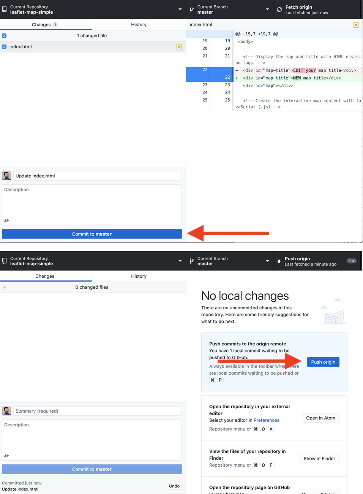
```

Congratulations! You've successfully navigated a round-trip journey of code, from your GitHub account to your local computer, and back again to GitHub. Since you previously used the GitHub Pages settings to create an online version of your code, go see if your edited map title now appears on the public web. The web address you set up earlier follows this format `https://USERNAME.github.io/REPOSITORY`, substituting your GitHub username and repo name.

While you could have made the tiny code edit above in the GitHub web interface, hopefully you've begun to see many advantages of using GitHub Desktop and Atom Editor to edit code and push commits from your local computer. First, you can make more complex code modifications with Atom Editor, which includes search, find-and-replace, and other features to work more efficiently. Second, when you copy the repo to your local computer, you can quickly drag-and-drop multiple files and subfolders for complex visualizations, such as data, geography, and images. Third, depending on the type of code, you may be able to test how it works locally with your browser, before uploading your commits to the public web.

Tip: Atom Editor has many built-in features that recognize and help you edit code, plus the option to install more [packages](https://atom.io/packages) in the Preferences menu. One helpful built-in tool is Edit > Toggle Comments, which automatically detects the coding language and converts the selected text from executable code to non-executed code comments. Another built-in tool is Edit > Lines > Auto Indent, which automatically cleans up selected text or an entire page of code for easier reading.

GitHub also offers a powerful platform for collaborative projects, such as *Hands-On Data Visualization*. As co-authors, we composed the text of these book chapters and all of the sample code templates on GitHub. Jack started each day by "pulling" the most recent version of the book from our shared GitHub account to his local computer using GitHub Desktop, where he worked on sections and "pushed" his commits (aka edits) back to GitHub. At the same time, Ilya "pulled" the latest version and "pushed" his commits back to GitHub as well. Both of us see the commits that each other made, line-by-line in green and red (showing additions and deletions), by selecting the GitHub repo "Code" tab and clicking on one of our commits, as shown in Figure \@ref(fig:compare-commits).

(ref:compare-commits) Drag-and-drop the file to the upload screen.

```{r compare-commits, fig.cap="(ref:compare-commits)"}
 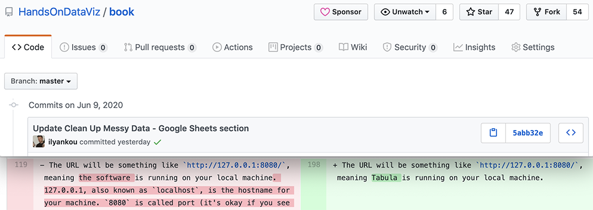
```

Although GitHub does not operate like Google Documents, which displays live edits, the platform has several advantages when working collaboratively with code. First, since GitHub tracks every commit we make, it allows us to go back and restore a very specific past version of the code if needed. Second, when GitHub repos are public, anyone can view your code and submit an "issue" to notify the owner about an idea or problem, or send a "pull request" of suggested code edits, which the owner can accept or reject. Third, GitHub allows collaborators to create different "branches" of a repo (the default is called "master") in order to make edits, and then "merge" the branches back together if desired. Occasionally, if two or more coders attempt to push incompatible commits to the same repo, GitHub will warn about a "Merge Conflict." To resolve this conflict and preserve everyone's work, you may need to use the Command Line Interface (CLI) version of GitHub, which means typing commands directly into the Terminal application on Mac or Windows. Many professional coders regularly work on the Command Line with GitHub, but this requires memorizing a list of commands and is beyond the scope of this introductory book.

## Summary {-}

If this is the first time you've forked, edited, and hosted live code on the public web, welcome to the coding family! We hope you agree that GitHub is a powerful platform for engaging in this work and sharing with others. While beginners will appreciate the web interface, you'll find that the GitHub Desktop and Atom Editor tools makes it much easier to work with [Chart.js code templates in Chapter 9](chartjs.hmtl) and the [Leaflet map code templates in Chapter 10](leaflet.html). Let's build on your brand-new coding skills to create more customized charts and maps in the next two chapters.
