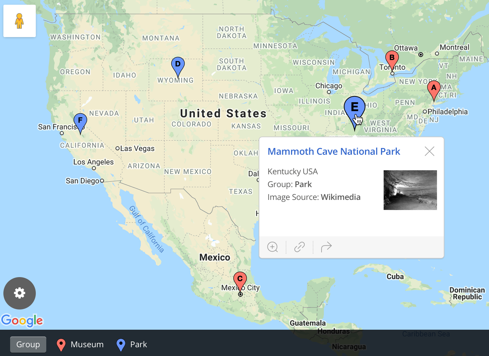
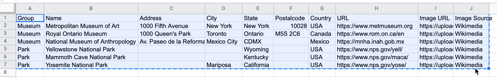
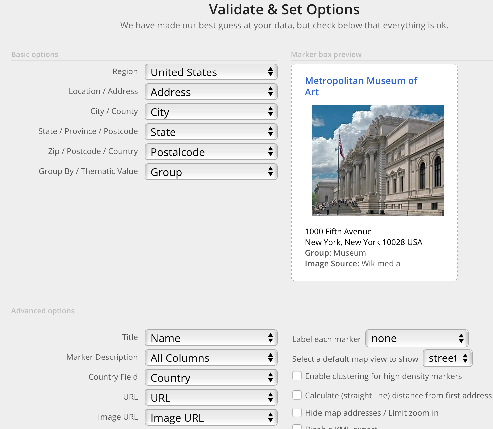
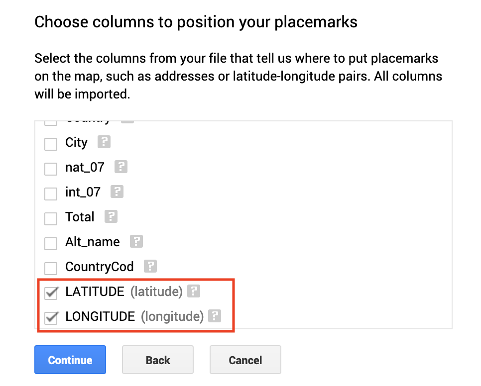
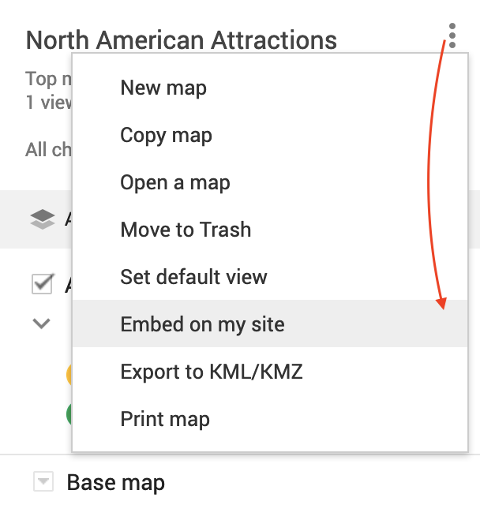

# Map Your Data {#map}
Maps draw your readers into data that includes a spatial dimension, while also developing a stronger sense of place. Seeing the relative distance between points on a map, or identifying geographic patterns in a *choropleth* map (where colored polygons represent data values), relays information to readers' eyes more effectively than text, tables, or charts. But creating meaningful maps that draw our attention to key insights in your data requires clear thinking about design choices.

In this chapter, we will examine [principles of map design](map-design.html) and distinguish between good and bad maps. You will learn about rules that apply to all maps, and specific guidelines for creating choropleth maps. While many tools allow you to download maps as *static* images, our book also demonstrates how to construct *interactive* charts that invite readers to zoom in and explore the data in their web browsers. Later you'll learn how to [embed interactive charts on your website in Chapter 10](embed.html).

Learn about different types of maps you can create in this book in Table \@ref(tab:map-types). Decisions about map types are based on two main factors: the format of your data, and the kind of story you wish to tell. For example, point maps work best to show specific locations with colored markers to represent categories (such as hospitals), while choropleth maps are best suited to display relative values for regions (such as birth rates across US states). After selecting your map type, follow our tool recommendations and step-by-step tutorials. This chapter features *Easy Tools* with drag-and-drop menus, such as [Google My Maps](mymaps.html), [Datawrapper](symbolmap-datawrapper.html), and [Tableau Public](map-tableau.html). But the table also points you to *Power Tools* that give you more control to customize and host your visualizations, such as [Leaflet code templates in Chapter 13](leaflet.html). These advanced tools require prior knowledge on how to [edit and host code templates with GitHub in Chapter 11](github.html).

TODO: Improve and standardize map images

Table: (\#tab:map-types) Basic Map Types, Best Uses, and Tutorials

| Map | Best use and tutorials in this book |
| --- | --- |
| Point map with custom icons<br>  | Best to show specific locations (such as addresses or geocoordinates) with colored markers for categories, or custom icons, plus text and images in popup windows. <br>Easy tool: [BatchGeo tutorial](batchgeo.html) or [Google My Maps tutorial](mymaps.html)<br>Power tool: [Ch 13: Leaflet Maps with Google Sheets tutorial](leaflet-maps-with-google-sheets.html) |
| Symbol point map<br>  | Best to show specific locations (such as cities), with variable-sized shapes or colors to represent data values (such as population growth).<br>Easy tool: [Symbol Point Map with Datawrapper tutorial](symbolmap-datawrapper.html) |
| Choropleth (colored polygon) map <br>  | Best to show patterns across geographic areas (such as neighborhoods or nations) by coloring polygons to represent data values. <br>Easy tool: [Choropleth map with Datawrapper tutorial](choropleth-datawrapper.html) or [Choropleth map with Tableau Public tutorial](map-tableau.html) <br>Power tools: [Ch 13: Leaflet Maps with Google Sheets tutorial](leaflet-maps-with-google-sheets.html) |
| Heat point map <br>  | Best to show clusters of points as colored hotspots to emphasize high frequency or density of cases. <br>Power tool: [Ch 13: Leaflet Heatmap code template](leaflet-heatmap.html) |
| Story map <br>  | Best to show a point-by-point guided tour, with a scrolling narrative to display text, images, audio, video, and scanned map backgrounds. <br> Power tool: [Ch 13: Leaflet Storymaps with Google Sheets tutorial](leaflet-storymaps-with-google-sheets.html) |
| Polyline map <br>  | Best to show routes (such as trails or transit), with colors for different categories. <br>Easy Tool: [Google My Maps tutorial](mymaps.html) <br>Power tool: [Ch 13: Leaflet Maps with Google Sheets tutorial](leaflet-maps-with-google-sheets.html)|
| Customized point-polyline-polygon map <br>  | Best to show any combination of points, polylines, or polygons, with customized icons for categories, and colored regions to represent data values. <br>Power tool: [Ch 13: Leaflet Maps with Google Sheets tutorial](leaflet-maps-with-google-sheets.html) |
| Searchable point map<br>  | Best to show specific locations for users to search by name or proximity, or filter by category, with optional list view.<br> Power Tool: [Ch 13: Leaflet Searchable Point Map code template](leaflet-searchable-map.html) |
| Current map from open-data repository<br>  | Best to show the most current information pulled directly from an open-data repository such as Socrata and others. <br>Easy tool: [Current map with Socrata open data tutorial](map-socrata.html)<br>Power tool: [Ch 13: Leaflet Maps with Open Data API code template](leaflet-maps-open-data-apis.html) |

## Map Design Principles {- #map-design}

Much of the data collected today includes a spatial component that can be mapped. When you look up an address on a city street, or take a photo of a tree in a rural forest, both can be geocoded into latitude and longitude coordinates, such as `42.76, -72.69`, and placed as *points* on a map. When we walk, bike, drive, or ride mass transit, our route can be recorded as strings of geocoordinates  and shown as *lines* on a map. When we draw lines to designate the geographic borders of neighborhoods or nations, we can display those *polygons* on a map, and also color them to represent different values, such as population or income.  

However, just because data *can* be mapped does not always mean it *should* be mapped. Before creating a map, stop and ask yourself: *Does location really matter to your story?* Even when your data includes geographic information, sometimes a chart tells your story better than a map. For example, you can clearly show differences between geographic areas in a bar chart, or trace how they rise and fall on different rates over time with a line chart, or compare two variables for each area in a scatter chart. Sometimes a simple table, or even text alone, communicates your point more effectively to your audience. Since creating a well-designed map requires time and energy, make sure it actually enhances your data story.

As you learned in the previous chapter about charts, data visualization is not a science, but comes with a set of principles and best practices that serve as a foundation for creating true and meaningful maps. In this section, we'll identify a few rules about map design, but you may be surprised to learn that some rules are less rigid than others, and can be "broken" when necessary to emphasize a point, as long as you are honestly interpreting the data. To begin to understand the difference, let's start by establishing a common vocabulary about maps.

### Deconstruct a Map {-}

Take a look at Figure \@ref(fig:map-principles-map) to get familiar with main
basic elements of maps, especially interactive ones featured in this book. Similar to a chart, good maps should include a title and brief description to provide context about what the map is showing.

(ref:map-principles-map) Map elements.

```{r map-principles-map, fig.cap="(ref:map-principles-map)"}
knitr::include_graphics("images/08-map/map-principles-map.png")
```

Map data is presented in layers. The top layer can be generally described as any combination of point, polyline, or polygon data. *Points* represent latitude and longitude coordinates, which may be illustrated by location markers. *Polylines* are connected strings of points, and we place the "poly-" prefix before "lines" to remind us that they may contain multiple branches, not just straight segments. *Polygons* represent areas defined by lines, such as building footprints or national boundaries. On interactive maps, any of these top-layer elements may display a hidden *tooltip* (when you hover the cursor over them) or a *popup* (when you click on them) that reveals additional information about its properties. Below these top data layers is the *basemap* layer, usually displayed as a seamless grid of tiles that cover the globe. Typically a basemap displays either satellite imagery (also known as raster tiles) or pictorial displays of streets and buildings (also known as vector tiles). Interactive maps often include zoom controls (`+` and `-` buttons) that allow you to view data from various "distances," which change the display of the tile layer.
The *legend* identifies the meaning of shapes or colors on the map. Maps may include a *north arrow* or *scale* to orient readers to direction and relative distance. Good maps also add the data sources, clarifying notes, and credits to the individuals or organizations that created them.

We spell out these definitions to help newer mapmakers to learn some general rules and to avoid making common mistakes. Many of the our guidelines about map design are inspired by excellent resources such as Datawrapper Academy posts about symbol maps and [choropleth maps](https://academy.datawrapper.de/article/134-what-to-consider-when-creating-choropleth-maps)

### Clarify Point versus Polygon Data {-}

Before you start to create a map, make sure you understand your data format and what it represents. Avoid mistakes commonly made by novices by pausing to ask these questions. First, *Can your data be mapped?* Sometimes the information we collect has no geographic component, or no consistent one, which makes it difficult or impossible to place on a map. If the answer is yes, then proceed to the second question: *Can the data be mapped as points or polygons?* These are the two most likely cases (which are sometimes confused), in contrast to the less-common third option, *polylines*, which represent paths and routes.

What type of data do you see listed below: points or polygons?

1. 36.48, -118.56 (latitude and longitude for Joshua Tree National Park, CA)
2. 2800 E Observatory Rd, Los Angeles, CA
3. Haight and Ashbury Street, San Francisco, CA
4. Balboa Park, San Diego, CA
5. Census tract 4087, Alameda County, CA
6. City of Los Angeles, CA
7. San Diego County, CA
8. State of California

In most cases, numbers 1-4 represent *point* data because each normally refers to a *specific location* that can be displayed as a marker on a map. These usually work best in point-data maps, such as:

- a *point map* to show locations with colored or custom icons
- a *symbol point map* to shows locations with variable-sized images to represent data (such as circles for population size)
- a *heat point map* to show clusters of locations as hotspots of high frequency or density
- a *story map* to show a point-by-point guided tour with a scrolling narrative

In most cases, numbers 5-8 represent *polygon* data because each normally refers to a *geographic boundary* that can be displayed as a shape on a map. These usually work best in *choropleth* maps, which show spatial patterns across regions by coloring polygons to represent data values.

TODO DISCUSS: Do we need to include small abstract map type images here to reinforce the concept? Or are the maps images in Table 8.1 above sufficient?

These point-versus-polygon rules apply *most* of the time, but not always, and exceptions can be made depending on your data story. First, it is *possible*, but not common, to represent all items 1-8 as *point* data, and display them on any of the point-style maps above. For example, to tell a data story about population growth for California cities, it would make sense to create a symbol point map with different-sized circles to represent data for each city. To do this, your map tool would need to find the center-point of the City of Los Angeles polygon boundary in order to place its population circle on a specific point on the map. A second way the point-versus-polygon rule gets blurry is because some places we normally consider to be map points *also* have polygon-shaped borders. For example, if you enter "Balboa Park" into Google Maps, it will display the result as a map marker, which suggests it is point data. But Balboa Park also has a geographic boundary that covers 1.8 square miles (4.8 square kilometers). If you told a data story about how much land in San Diego was devoted to public space, it would make sense to create a choropleth map that displays Balboa Park as a polygon rather than a point. Third, it's also possible to transform points into polygon data with [pivot tables, a topic we introduced in Chapter 3](pivot.html). For example, to tell a data story about the number of hospital beds each California county, you could obtain point-level data about beds in each hospital, then pivot them to sum up the total number of beds in each county, and display these polygon-level results in a choropleth map. See a more detailed example in the [Pivot Points into Polygon Data section of Chapter 14: Transform Your Map Data](pivot-point-to-polygon.html)

In summary, clarify if your spatial data should represent points or polygons, since those two categories are sometimes confused. If you envision them as points, then create a point-style map; or if polygons, then create a choropleth map. Those are the most common methods used by mapmakers, but there are plenty of exceptions, depending on your data story.

### Avoid Two Variables on One Map {-}
Newcomers to data visualization sometimes are so proud of placing one variable on a map that they figure two variables must be twice as good. But this usually is not true. In general, we recommend against placing two variables on the same map, because it's very difficult for most readers to recognize patterns that help them to grasp your data story. For example, look at what happens when you try to place one variable (using a symbol point map) on top of another variable (using a choropleth map), as shown with imaginary data in Figure \@ref(fig:map-two-variables). It's difficult to recognize patterns when a symbol point map is placed on a choropleth map.

(ref:map-two-variables) Avoid placing a symbol point map on top of a choropleth map, because it's hard to see the relationship between two variables.

```{r map-two-variables, out.width=400, fig.cap="(ref:map-two-variables)"}
knitr::include_graphics("images/08-map/map-two-variables.png")
```

Consider alternative ways to visualize the relationship between two variables. Rather than a map, you could create a scatter chart to show any relationship between variables X and Y. This type of chart works best if the relationship between variables is more important to your data story than any geographic patterns. Or, if geographic patterns matter for one of the variables, you could pair a choropleth map of that variable next to a scatterchart of both variables. Finally, you could create two choropleth maps, one for each variable, and place them side-by-side with text to explain their similarities or differences.

TODO: decide if the figure works above; also decide if supplemental images are needed, perhaps as "bad viz" and "better viz" examples

### Usually Choose Smaller Geographies for Choropleth Maps {-}
Choropleth maps are best for showing geographic patterns across regions by coloring polygons to represent data values. Therefore, we generally recommend selecting *smaller* geographies to display more *granular* patterns, since larger geographies display aggregated data that may hide what's happening at lower levels. Geographers refer to this concept as the [modifiable aerial unit problem](https://en.wikipedia.org/wiki/Modifiable_areal_unit_problem), which means that the way you slice up your data affects how we analyze its appearance on the map. Stacking together lots of small slices reveals more detail than one big slice.

For example, compare the two choropleth maps of typical home values in the Northeastern United States in according to [Zillow research data](https://www.zillow.com/research/data/) for August 2020. Zillow defines typical values as a smoothed, seasonally adjusted measure of all single-family residences, condos, and coops in the 35th to 65th percentile range, similar to the median value at the 50th percentile, with some additional lower- and higher-value homes. Both choropleth maps use the same scale. The key difference is the size of the geographic units: the first map shows home values at the larger state level, while the second map shows home values at the smaller county level, as shown in Figure \@ref(fig:choropleth-use-smaller-geos).

(ref:choropleth-use-smaller-geos) Zillow typical home values in August 2020 shown at the state level (left) and county level (right).

```{r choropleth-use-smaller-geos, fig.cap="(ref:choropleth-use-smaller-geos)"}
knitr::include_graphics("images/08-map/choropleth-use-smaller-geos.png")
```

Which map is best? Since both are truthful depictions of the data, the answer depends on the story you wish to tell. If you want to emphasize state-to-state differences, choose the first map because it clearly highlights how typical Massachusetts home prices are higher than those in surrounding Northeastern states. Or if you want to emphasize variation inside states, choose the second map, which demonstrates higher price levels in the New York City and Boston metropolitan regions, in comparison to more rural counties in those two states. If you're unsure, it's usually better to map smaller geographies, because it's possible to see both state-level and within-state variations at the same time, if the design includes appropriate labels and geographic outlines. But don't turn *smaller is better* into a rigid rule, since it doesn't work as you move further down the scale. For example, if we created a third map to display every individual home sale in the Northeastern US, it would be *too detailed* to see meaningful patterns. Sometimes larger-level geography tells a simple story more clearly.

TODO Above: add "New York City" and "Boston" labels to the county-level map. Decide if we should add state-level outlines and state names to county-level map. Do we wish to add a third map that's too detailed to illustrate the Goldilocks effect?

## Design Choropleth Colors & Intervals {- #design-choropleth}

When you build a choropleth map, your choices about how to represent data with colors will determine its overall appearance, so it's important to learn key principles. Good choropleth maps make true and insightful geographic patterns clearly visible to readers, whether they are printed in black-and-white on paper or displayed in color on a computer screen. Furthermore, the best choropleth maps are designed to be interpreted correctly by people with colorblindness. For an excellent overview of visualization colors in general, see Lisa Charlotte Rost's "[A Friendly Guide to Colors in Data Visualization](https://blog.datawrapper.de/colorguide/)" and "[How to Pick More Beautiful Colors for Your Data Visualizations](https://blog.datawrapper.de/beautifulcolors/index.html)," both on the Datawrapper blog.^[@rostYourFriendlyGuide2018; @rostHowPickMore2020]

To illustrate key concepts about colors in choropleth map design, let's explore a wonderful tool called [ColorBrewer](https://colorbrewer2.org/), created by Cynthia Brewer and Mark Harrower.^[See also @brewerDesigningBetterMaps2016] See the interface in Figure \@ref(fig:map-colorbrewer). Since ColorBrewer is a design assistant, do not expect to upload your data into it to create a map. Instead, ColorBrewer will recommend color palettes that work best with our map data and the type of story we wish to tell, and allow us to export those color codes into our preferred mapping tool.

(ref:map-colorbrewer) The ColorBrewer interface: data classes, type of color scheme, and recommended color codes.

```{r map-colorbrewer, fig.cap="(ref:map-colorbrewer)"}
knitr::include_graphics("images/08-map/map-colorbrewer-annotated.png")
```

In this section, we'll focus on two important decisions you'll need to make when designing choropleth maps: choosing the type of color palette (sequential, divergent, or qualitative) and the intervals to group together similar-colored data points.

When you open [ColorBrewer](https://colorbrewer2.org/), the top row asks you to select the number of data classes in your choropleth map, which means the number of intervals or steps in your color range. This design tool can recommend distinct colors for up to twelve data classes, depending on the type of scheme you select. But for now, use the default setting of 3, and we'll return to this topic later when we discuss intervals in more detail further below.

### Choose Choropleth Palettes to Match Your Data {-}
One of the most important decisions you'll make when designing a choropleth map is to select the type of palette. You're not simply choosing a color, but the *arrangement of colors* to help readers correctly interpret your information. The rule is straightforward: choose an appropriate color palette that matches your data format, and the story you wish to tell.

ColorBrewer groups palettes into three types---sequential, diverging, and qualitative---as shown in Figure \@ref(fig:map-principles-color-schemes).

(ref:map-principles-color-schemes) Sequential, diverging, and qualitative color palettes from [ColorBrewer](https://colorbrewer2.org/).

```{r map-principles-color-schemes, fig.cap="(ref:map-principles-color-schemes)"}
knitr::include_graphics("images/08-map/map-principles-color-schemes.png")
```

*Sequential palettes* work best to show low-to-high numeric values. Examples include anything that can be placed in sequence on a scale, such as median income, amount of rainfall, or percent of the population who voted in the prior election. Sequential palettes can be single-hue (such as different shades of blue) or multi-hue (such as yellow-orange-red). Darker colors *usually* represent higher values, but not always.

*Diverging palettes* work best to show numbers above and below a standard level (such as zero, the average, or median value). They typically have two distinct hues to represent positive and negative directions, with darker colors at the extremes, and a neutral color in the middle. Examples include income above or below the median level, rainfall above or below seasonal average, or percentage of voters above or below the norm.

*Qualitative palettes* work best to show categorical data, rather than numeric scales. They typically feature unique colors that stand apart from one another to emphasize differences. Examples include different types of land use (residential, commercial, open space, water). They also can represent categories such as a warning system that resembles a stoplight (green, yellow, and red), as these specific colors must be manually assigned to be correctly interpreted.

Choose an appropriate palette that matches your data format and story you wish to tell. For example, we began with the same data on income per capita in the contiguous US states in 2018, but modified it demonstrate the interpretive strengths of each palette, as shown in Figure \@ref(fig:map-principles-classification).

The first map shows a *sequential* color scheme with five shades of blue to illustrate the low-to-high range of income levels. This map works best for a data story that emphasizes the highest income levels, shown by the darker blue colors along the Northeastern coast from Maryland to Massachusetts.

The second map shows a *diverging* color scheme to illustrate income levels at the low and high extremes. We modified the data by subtracting the average US per capita income value of $33,381 from each state's value. This new relative measure is dark orange for states far below the average, and dark purple for states far above it, while a neutral color represents the middle. This map works best for a data story that emphasizes an economic division between lower-income Southern states versus higher-income East Coast and West Coast states.

The third map shows a *qualitative* color scheme that divides the 48 contiguous states into 3 equal groups based on their per capita incomes, and paints them in the colors of a stoplight (red, yellow, and green) to represent low, middle, and top thirds.

TODO: Decide if we should keep or remove the third map, since it's not an ideal representation of qualitative data.

(ref:map-principles-classification) Representing per capita income in US states using three different classifications.

```{r map-principles-classification, out.width=500, fig.cap="(ref:map-principles-classification)"}
knitr::include_graphics("images/08-map/map-principles-classification.png")
```

After you select data classes and a color palette, ColorBrewer displays alphanumeric codes that web browsers translate into colors. You can select hexadecimal codes (`#ffffff` is white), RGB codes (`255,255,255` is white), or CMYK codes (`0,0,0,0` is white), and export them in different formats, as shown in Figure \@ref(fig:colorbrewer-export), if your preferred map tool allows you to import color palettes.

(ref:colorbrewer-export) Click open the *Export* tab to display your color palette codes in various formats.

```{r colorbrewer-export, out.width=435, fig.cap="(ref:colorbrewer-export)"}
knitr::include_graphics("images/08-map/colorbrewer-export.png")
```

### Choose Color Intervals to Group Choropleth Map Data {-}

Another important design choice for choropleth maps is the color intervals, which determine how you group and display data by using similar colors. Since your ability to set intervals varies across different mapping tools, this section will explain broad concepts, and specific map tutorials will demonstrate how to apply them.

Some mapping tools allow you to choose two different *types of color intervals* to show movement up or down a data scale, as shown in Figure \@ref(fig:interval-types). *Steps* are clearly-marked color dividers, like a staircase, while *continuous* is a gradual change in hue, like a ramp.

(ref:interval-types) Two types of color intervals: steps and continuous.

```{r interval-types, out.width=300, fig.cap="(ref:interval-types)"}
knitr::include_graphics("images/08-map/interval-types.png")
```

If both options exist, which one is best? There is no clear map design rule about this. On one hand, some recommend using continuous intervals to show greater geographical diversity, except when it's important to your data story to display a threshold, where steps make sense to show areas above or below a certain line. On the other hand, some point out that people are quite bad at distinguishing different hues on a continuous scale, so recommend using clearly-defined steps to help readers match colors to data values in your legend. Therefore, our general advice is to make design choices that are both honest and insightful: tell the truth about the data and also draw our attention to what matters about this interpretation.[TODO: is this sufficient or should we add examples or cite different designers here? Cite Datawrapper Academy on "honesty and usefulness" https://academy.datawrapper.de/article/117-color-palette-for-your-map]

Some mapping tools also allow you to choose how to *interpolate* your data, meaning the method for grouping numbers to represent similar colors on your map. This may involve a two-part decision about step dividers and numerical methods.

First, if you choose *steps*, how many dividers should you use to slice up your data? Once again, there is no clear rule. Fewer steps creates a *coarse* map that highlights broad differences, while more steps creates a *granular* map that emphasizes geographic diversity between areas. But adding more steps also makes differences less visible. Remember that simply adding more colors does not necessarily make a better map. We recommend experimenting with [ColorBrewer](https://colorbrewer2.org) to raise or lower the *Number of data classes* (also known as steps or dividers) for different types of color palettes, to visualize the consequences of your possible design choices, as shown in Figure \@ref(fig:colorbrewer-steps). Make decisions with the best interests of your readers in mind, to represent your data in honest and insightful ways.

(ref:colorbrewer-steps) Experiment with ColorBrewer data classes (or steps) and color palettes.

```{r colorbrewer-steps, out.width=400, fig.cap="(ref:colorbrewer-steps)"}
knitr::include_graphics("images/08-map/colorbrewer-steps.png")
```

Second, whether you choose steps or continuous, which *interpolation* method is the best way to group your data into similar colors on your scale? Map tools may display the options in different ways, as seen in Figure \@ref(fig:intervals-datawrapper-tableau), and they also may vary depending on whether you selected steps or continuous colors.

(ref:intervals-datawrapper-tableau) Interpolation options in two map tools: Datawrapper (left) and Tableau Public (right).

```{r intervals-datawrapper-tableau, fig.cap="(ref:intervals-datawrapper-tableau)"}
knitr::include_graphics("images/08-map/intervals-datawrapper-tableau.png")
```

- *Linear* means that the values are placed in a straight line, from lowest to highest. This method works best when the data are evenly distributed, because the colors draw attention to the outliers at the low and high ends of the scale.
- *Quantiles* means that the values are divided into groups of an equal number. More specifically, *quartiles*, *quintiles*, and *deciles* mean dividing the values into four, five, or ten groups of equal quantity. This method works best when the data are not evenly distributed, because it uses colors to draw more attention to the diversity of groups inside the scale, not just the low and high ends.
- *Rounded values* are similar to quantiles, but decimals in the scale are replaced with rounded numbers that look nicer to readers' eyes.
- *Natural breaks (Jenks)* offers a compromise between linear (which emphasizes the extreme ends) and quantiles (which emphasize internal diversity).
- *Custom* allows you to manually place dividers wherever you wish along the color scale. We generally recommend to *not* use custom settings because they are more likely to create a misleading map, as you'll learn in [Chapter 15: Detect Lies and Reduce Data Bias](detect.html).

TODO: CONFIRM definitions above; add max/mid/min as an option? decide if these definitions are sufficient, or consider adding small maps to visually contrast the differences, as shown in https://academy.datawrapper.de/article/117-color-palette-for-your-map; cite this source

Which interpolation method is best? While there are no rigid rules, some methods above work better for different types of data stories. If you wish to emphasize the lows and highs in your data, choose linear because it uses color to draw attention to the extreme ends of the scale. Or if you wish to emphasize geographic diversity in your data, consider quantiles (or any of its cousins) because they use color to differentiate the middle portions of the scale. Or if you're not sure what your data looks like, [create a histogram like you learned in Chapter 7: Chart Your Data](chart-google.html) to visualize it and help make wise map design choices. [TODO: demonstrate a histogram with map data here? https://academy.datawrapper.de/article/294-how-to-customize-stepped-color-scales]

In any case, be very aware of how color palettes and interpolation dramatically shape the appearance of choropleth maps and how the data appears in readers' eyes. Always create maps show us the story and tell the truth.  [TODO: ADD THIS? In general, Datawrapper recommends choosing ranges to make sure readers "see all the differences in the data," rather than hiding them out of sight.... cite https://academy.datawrapper.de/article/134-what-to-consider-when-creating-choropleth-maps]
TODO ALSO: Review all of the recommendations in the Datawrapper Academy post above and decide ones to include as rules versus recommendations vs neither. For example: "use the same intervals... 0, 25, 50 instead of 0, 15, 50..." runs counter to other advice we give about interpolation.

## Normalize Choropleth Map Data {- #normalize-choropleth}

We introduced the concept of [normalizing data in Chapter 6: Make Meaningful Comparisons](normalize.html). Normalization means adjusting data that was collected using different scales into a common scale, in order to make more appropriate comparisons. For example, it makes little sense to compare the total number of Covid cases between nations with very different populations, such as XXX and YYY (TODO: fill in examples). A better strategy is to normalize the data by comparing cases per capita (such as A per 100,000 in XXX versus B per 100,000 in YYY) to adjust for prior differences in population.

In the same way, choropleth maps work best when they display relative values (such as percentages or per capita rates) rather than absolute values (such as the raw number of people). If you ignore normalization when creating a choropleth map and display raw numbers, you'll essentially recreate a population map, which doesn't tell us anything new. For example, compare two maps shown in Figure \@ref(fig:normalize-map-data). They both are about Covid-19 cases in the continental US as of June 26, 2020. Figure \@ref(fig:normalize-map-data)a shows total number of recorded cases per state, and Figure \@ref(fig:normalize-map-data)b shows Covid-19 cases adjusted by the state's population. Darker colors represent higher values. Do you notice any differences in spatial patterns?

(ref:normalize-map-data) Choropleth maps work best with normalized values.

```{r normalize-map-data, fig.cap="(ref:normalize-map-data)"}
knitr::include_graphics("images/08-map/normalize-map-data-annotated.png")
```

Both maps show Covid-19 data collected by the New York Times and published [on GitHub](https://github.com/nytimes/covid-19-data). In the map in Figure \@ref(fig:normalize-map-data)b, we normalized values by dividing the total number of cases by the population in each state, according to the 2018 US Census American Community Survey, the most recent data available on the day of writing. We did not add legends and other important cartographic elements so that you can better focus on interpreting spatial patterns. In both cases, we used Jenks natural breaks for classification.

What are the worst-hit states according to the map showing total Covid-19 counts (shown in Figure \@ref(fig:normalize-map-data)a)? If you are familiar with the US geography, you can quickly tell that these are New York, New Jersey, Massachusetts, Florida, Illinois, Texas, and California. But five of these happen to be some of the most populous states in the US,
so it makes sense that they will also have higher Covid-19 cases.

Now, how about the map in Figure \@ref(fig:normalize-map-data)b? You can see that New York and its neighbors, including New Jersey and Massachusetts, have by far the highest rates per capita (per person), which we saw in the first map. But you can also see that in fact California, Texas, and Florida were impacted to a lesser extent than the map on the left had suggested. So the map with per-capita values is a much better illustration to the story about New York being the *first* epicenter of the Covid-19 crisis in the United States.

TODO: Include a very simple normalization calculation to demonstrate absolute data versus normalized data (Cases / Population = Cases Per Capita) for two states, such as Texas and New York. Decide whether to show data at a specific moment (May 1 2020 near peak for NYC) or most up-to-date figure at this writing (which will show higher case rates elsewhere). Either way, clearly label the date in the caption.

At this point, you should have a better idea of key principles in map design, and what makes them work (or not) when communicating data images to our eyes. In the next section, we'll begin our first hands-on tutorial with creating a point map. Later in the chapter we'll return to exercises in creating choropleth maps.  

## Point Map with BatchGeo {- #batchgeo}
Although BatchGeo is not the most powerful mapping tool available, its easy-to-learn interface stands out as one of the fastest ways to create an interactive point map. With the free version, organize up to 250 rows of data in a spreadsheet template, copy and paste them into the platform. BatchGeo will geocode your data and display map markers with colored categories on a Google Map base layer, which can be clicked to show linked titles, text, and small photos (which must be hosted online elsewhere) categories, descriptions, and links (including images hosted elsewhere online). Since the free version does *not* include an account login, enter your email to receive a link to the finished map, like the sample shown in Figure \@ref(fig:batchgeo-map).

(ref:batchgeo-map) Point map of museums and parks with BatchGeo: Explore the [interactive version](https://batchgeo.com/map/a36a85afb293fd0a7160997f0ff83e0c).

```{r batchgeo-map, fig.cap="(ref:batchgeo-map)"}
if(knitr::is_html_output(excludes="markdown")) knitr::include_url("https://batchgeo.com/map/a36a85afb293fd0a7160997f0ff83e0c", height="550px") else 
```

To create your own point map with BatchGeo, follow this quick tutorial.

1. Open this [BatchGeo data template in Google Sheets](https://docs.google.com/spreadsheets/d/1IA0J4Z9C0_zsvgcunD2kHtR__sdQqUPzNHNjqCLYBRQ/edit#gid=312385679), log into your Google account, and go to *File > Make a Copy* to create a version you can edit in your Google Drive.

2. You can delete and enter your own data into the template, as shown in Figure \@ref(fig:batchgeo-template). Not every address field is required, but adding more will improve the accuracy of the geocoder. Several columns are optional and can be deleted (such as URL, Image URL, Image Source). If you enter a URL, its active link will appear in the Name field. Also, you can enter an Image URL if a photo is hosted elsewhere online, with an ideal size of 200x200 pixels.

(ref:batchgeo-template) Enter your data into the template, then select all and copy it.

```{r batchgeo-template, fig.cap="(ref:batchgeo-template)"}

```

3. Select and copy your data from the template, open the [BatchGeo](https://batchgeo.com) site, click the large field, and paste in your data, as shown in Figure \@ref(fig:batchgeo-paste).

(ref:batchgeo-paste) Click the large field and paste in your data from the template.

```{r batchgeo-paste, fig.cap="(ref:batchgeo-paste)"}
knitr::include_graphics("images/08-map/batchgeo-paste.png")
```

4. Click the *Validate and Set Options* button to inspect or adjust how BatchGeo will upload your data fields and preview a pop-up window, as shown in Figure \@ref(fig:batchgeo-validate). Click the *Advanced* button to see additional options to change the basemap layer or point symbols. Then click the *Make Map* button.

(ref:batchgeo-validate) Click the *Validate* button to inspect and preview your data and advanced options.

```{r batchgeo-validate, out.width=500, fig.cap="(ref:batchgeo-validate)"}

```

5. In the *Map* window, click the *Save and Continue* button to enter a title and set other options, such making your map *public* or *unlisted*, as well as customizing the layout, as shown in Figure \@ref(fig:batchgeo-save). Insert your email address to receive a link to your online map. Click *Save Map*.

(ref:batchgeo-save) Be sure to enter your email address to receive a link to your online map.

```{r batchgeo-save, out.width=500, fig.cap="(ref:batchgeo-save)"}
knitr::include_graphics("images/08-map/batchgeo-save.png")
```

6. Check your email for a message from BatchGeo with a link to your live map, and another link to make edits, as shown in Figure \@ref(fig:batchgeo-email). The email also will include a code to [embed your live map on the web, which you'll learn about in Chapter 10](embed.html).

(ref:batchgeo-email) Save the BatchGeo email with links and an embed code for your map.

```{r batchgeo-email, out.width=500, fig.cap="(ref:batchgeo-email)"}
knitr::include_graphics("images/08-map/batchgeo-email-annotated.png")
```

Overall, BatchGeo is a free and easy-to-learn point map tool, but one with several limitations. You can only create maps with 250 points or less, and only a few options to customize their appearance, unless you upgrade to the paid version. Also, while the tool geocodes your location data, it does not show you the latitude and longitude coordinates, but see the [Geocode section of Chapter 3 for a Google Sheets add-on](geocode.html) that will show you the geocoordinates. See more info on the [BatchGeo support page](http://support.batchgeo.com) and also their [post about power-user tips](https://blog.batchgeo.com/5-steps-to-become-a-batchgeo-power-user/).

Now that you've learned about one tool to create point maps, let's compare it with a second tool, Google My Maps, which includes some additional features.

## Point Map with Google My Maps {- #mymaps}

TODO BELOW: Explain how Google My Maps is different from Google Maps; mention at the top there are more options than points; DECIDE if this sample data about Nigerian airports is the best fit, since it's great to have international examples but unsure if Shapefile-to-CSV transormation makes sense here, as new users probably need the tool to geocode their data.

[My Maps](https://www.google.com/maps/about/mymaps/) is Google's service
that allows users to create custom maps using Google Maps platform.
It is perhaps the fastest ways of building point and basic polygon maps, although
it limits your styling options.

My Maps is most powerful when it comes to collaboration. The platform functions
within Google Drive, and so allows you to invite
other users with Google accounts to work on the map.

In this section, we will look at building a point map of airports in Nigeria, as is shown
in Figure \@ref(fig:mymaps-final). We will
create a map, change a baselayer, import point data, style points, and share the map.

(ref:mymaps-final) A map of airports in Nigeria built using Google My Maps.

```{r mymaps-final, fig.cap="(ref:mymaps-final)"}
if(knitr::is_html_output(excludes="markdown")) knitr::include_url("https://www.google.com/maps/d/u/0/embed?mid=1v1ZNrpfBtq_p4wTRyj2hIKBtTnkmhnMF", height="500px") else knitr::include_graphics("images/08-map/mymaps-final.png")
```

### Create a New Map in My Maps {-}

Navigate to [Google My Maps](https://www.google.com/mymaps/).
In the upper-right corner, click `+ Create a New Map` button,
as shown in Figure \@ref(fig:mymaps-create-new).

(ref:mymaps-create-new) A map of airports in Nigeria built using Google My Maps.

```{r mymaps-create-new, out.width=300, fig.cap="(ref:mymaps-create-new)"}
knitr::include_graphics("images/08-map/mymaps-create-new.png")
```

You will see a typical Google Maps with no data. Click on the current title (`Untitled map`),
and add appropriate title and description in the modal window that appeared
(see Figure \@ref(fig:mymaps-edit-title) for inspiration).

(ref:mymaps-edit-title) Add title and description to your map.

```{r mymaps-edit-title, out.width=300, fig.cap="(ref:mymaps-edit-title)"}
knitr::include_graphics("images/08-map/mymaps-edit-title.png")
```

Before we add any points, let's change the basemap to something less boring.
At the bottom of the control window, open *Base map* dropdown, and pick one of nine available
basemaps. For this tutorial, we chose *Dark Landmass*.

Let's now proceed to the most important step—adding data. You can [download](data/nigeria-airports.csv)
a dataset of Nigerian airports that we got [from the World Bank](https://datacatalog.worldbank.org/dataset/nigeria-airports)
as a Shapefile and then converted to a CSV.

Under *Untitled layer* item, click *Import* button, and drag-and-drop the CSV file.
Once the data file is uploaded, My Maps will ask which columns contain location data.
In our case, these are *LATITUDE* and *LONGITUDE* columns, as shown in Figure \@ref(fig:mymaps-lat-lon).

(ref:mymaps-lat-lon) Check LATITUDE and LONGITUDE as your location columns.

```{r mymaps-lat-lon, out.width=300, fig.cap="(ref:mymaps-lat-lon)"}

```

Once the two boxes are checked, click *Continue*. Another window will pop up, asking
which column to use to annotate points. Choose *City*, as shown in Figure \@ref(fig:mymaps-column-title),
and then *Finish*.

(ref:mymaps-column-title) Choose City as the title for your markers.

```{r mymaps-column-title, out.width=300, fig.cap="(ref:mymaps-column-title)"}
knitr::include_graphics("images/08-map/mymaps-column-title-annotated.png")
```

It will take a few moments for My Maps to create a new layer, which
will be added to the layer menu as *nigeria-airports.csv*.
Once the layer is created, My Maps will center the map to fit the points.

Let's replace the original blue markers to orange airport symbols.
In layers menu, hover over *All items* and click the paint bucket symbol
on the right. Change "All items" text to "Airports",
choose orange color, and click on *More icons* to find an airport symbol
(we recommend using Filter to search for "airport", or simply scroll down to Transportation section).
The marker in the layers menu will change to an orange airplane,
as shown in Figure \@ref(fig:mymaps-color).

(ref:mymaps-color) In My Maps, you can change marker colors and icons.

```{r mymaps-color, out.width=300, fig.cap="(ref:mymaps-color)"}
knitr::include_graphics("images/08-map/mymaps-color-annotated.png")
```

Click on the layer name, which by default is set to the name of imported file (`nigeria-airports.csv`),
and change it to *Nigerian Airports*. Alternatively open a kebab menu to the right of the layer name, and choose *Rename this layer*, and then click *Save*.

You can accompany each marker with a label. Click *Uniform style* under the layer, and choose *Alt_name*
in the *Set labels* dropdown menu. You will see alternative airport names, such as *BENIN*, displayed
beneath the markers.

Click *Preview* to see how the map looks like outside of the My Maps editing studio. Additionally, you can add photos, directions, lines, etc., and display or hide columns by checking or unchecking them when clicking on a map point.

### Share Your Google My Map {-}

If you are happy with the result, click *Share*, and click *Change to anyone with the link*
(see Figure \@ref(fig:mymaps-share)),
just as you would with any other Google Drive document.

(ref:mymaps-share) Make sure anyone with the link can view your map before you share it.

```{r mymaps-share, out.width=400, fig.cap="(ref:mymaps-share)"}
knitr::include_graphics("images/08-map/mymaps-share.png")
```

You can now generate a code snippet to embed the map as an iframe.
From the main kebab menu to the right of the map title, choose *Embed on my site* (Figure \@ref(fig:mymaps-embed)).
You can use now use this iframe code to embed your map to
your Wordpress, Squarespace, or any other website.

(ref:mymaps-embed) My Maps can generate an iframe code to include the map on your own website.

```{r mymaps-embed, out.width=300, fig.cap="(ref:mymaps-embed)"}

```

### Going Beyond Points {-}

Google My Maps has more powerful features for map making.
Instead of uploading datasets with latitude/longitude pairs,
you can use simple addresses (and My Maps will take care of geocoding),
or add markers by clicking on the map using *Add marker* feature.
You can classify points based on a property, and use different colors
to represent them.

You are not limited to just point maps. You can also draw your own shapes, including
lines and polygons. You can add data to multiple layers.
Unfortunately, Google My Maps has no comprehensive documentation,
so you have to explore the studio yourself if you want to create
more complex projects.

## Symbol Point Map with Datawrapper {- #symbolmap-datawrapper}
We first introduced you to the free and easy-to-learn [Datawrapper tool in Chapter 7: Chart Your Data](chart-datawrapper.html). It's also offers powerful features to create different types of maps, with professional-looking design elements. With Datawrapper you can start to work right away in your browser, with no account required unless you wish to save and share your work online.

In this section, you'll learn how to create a symbol point map, which displays specific locations using variable-sized shapes or colors to represent their data values. Our sample symbol map displays about 300 major US cities as point locations with two variables: the 2019 estimated population (using circle size) and the percent change in population since 2010 (using circle color), as shown in Figure \@ref(fig:datawrapper-symbolmap). Remember that we use *point* data to create symbol maps, but *polygon* data to create choropleth maps, and you'll learn how to design those  with Datawrapper in the subsequent section. Later in the book, we'll explain [how to embed your interactive Datawrapper maps on the web in Chapter 10](embed.html).

(ref:datawrapper-symbolmap) Symbol point map of US city population growth with Datawrapper. Explore the [interactive version](https://datawrapper.dwcdn.net/V0V9Y).

```{r datawrapper-symbolmap, fig.cap="(ref:datawrapper-symbolmap)"}
if(knitr::is_html_output(excludes="markdown")) knitr::include_url("https://datawrapper.dwcdn.net/V0V9Y", height="550px") else knitr::include_graphics("images/08-map/datawrapper-symbolmap.png")
```

Datawrapper splits the process of creating a map into four steps: select map, add data, visualize, then publish and embed. To create your own symbol point map, follow this tutorial.

1. Open the [US Cities Population Change 2010-2019 data in Google Sheets](https://docs.google.com/spreadsheets/d/1XOhNtvYWaebP4izr0PDJfToRIbl2vki_1JNMYTKCCn0/edit#gid=1709919231). Read the notes to understand its origin and some data issues. We downloaded [city population data for 2010-2019 from the US Census](https://www.census.gov/data/tables/time-series/demo/popest/2010s-total-cities-and-towns.html). But during this time period, some cities were newly incorporated or merged with outlying areas, which skews their population data over time. Also, we collected data for 5 major cities in Puerto Rico, a US territory, but they do not appear in the Datawrapper map for reasons explained in step 4.

Good maps often require [cleaning up messy data as described in Chapter 5](clean.html). In our spreadsheet we narrowed the original list down to about 300 cities with more than 100,000 residents in either 2010 or 2019. Also, since we're relying on Datawrapper to correctly identify *place names*, we combined *city* and *state* into one column to improve geocoding accuracy. Learn more about [place name geocoding at the Datawrapper Academy](https://academy.datawrapper.de/article/193-symbol-location-accuracy-using-addresses-place-names). Also, we created a new column named *Percent Change*, which we calculated this way: `(2019 - 2010) / 2010 * 100`.

2. In the Google Sheet, go to *File > Download* and select the Comma-Separated Values (CSV) format to save the data to your local computer.

3. Open [Datawrapper](https://datawrapper.de), click on *Start Creating*, then the *New Map* button, and select *Symbol map* as shown in Figure \@ref(fig:datawrapper-symbolmap-start).

(ref:datawrapper-symbolmap-start) Start to create a symbol map in Datawrapper.

```{r datawrapper-symbolmap-start, out.width=600, fig.cap="(ref:datawrapper-symbolmap-start)"}
knitr::include_graphics("images/08-map/datawrapper-symbolmap-start.png")
```

4. In the *Select your map* screen, enter *USA* and search for options. Note that we selected *USA > *States* as our best current option, because *USA > States and Territories* does not yet correctly display geocoded locations for Puerto Rico, a US territory. Proceed to the next screen.

5. In the *Add your data* screen, click the *Import your dataset* button. In the next window, click the *Addresses and Place Names* button because our data is organized this way. In the *Import* window, click to *Upload a CSV file*, and select the file you downloaded above.

6. In the *Match your columns* screen, select the *City-State* column to be *Matched as Address*, then scroll down to click the *Next* button, as shown in Figure \@ref(fig:datawrapper-symbolmap-match). In the next screen click *Go*, then see your geocoded data displayed on a map in the following screen.

(ref:datawrapper-symbolmap-match) Select the *City-State* column to be matched as the *Address*.

```{r datawrapper-symbolmap-match, out.width=400, fig.cap="(ref:datawrapper-symbolmap-match)"}
knitr::include_graphics("images/08-map/datawrapper-symbolmap-match.png")
```

7. Click the *Visualize* button to *Refine* your map. Our goal is to display two variables: 2019 population as the circle size, and percent change as the circle color. Under *Symbol shape and size*, select the *circle* symbol, to be sized by *Pop Estimate 2019*, with a maximum symbol size of 25 pixels. Under *Symbol colors*, select the *Percent Change 2010-2019* column, as shown in Figure \@ref(fig:datawrapper-symbolmap-refine).

(ref:datawrapper-symbolmap-refine) Refine your map by selecting data to display symbol shapes, sizes, and colors.

```{r datawrapper-symbolmap-refine, fig.cap="(ref:datawrapper-symbolmap-refine)"}
knitr::include_graphics("images/08-map/datawrapper-symbolmap-refine.png")
```

8. If you wish to customize the color palette and intervals to match our example, click the *wrench symbol* next to the palette. Click the *Import colors* button and paste in five hexadecimal codes from ColorBrewer, as described in the [Choropleth Design section](design-choropleth.html). The first code is dark pink, followed by a 4-class sequential green: `#d01c8b,#bae4b3,#74c476,#31a354,#006d2c`. See Figure \@ref(fig:datawrapper-symbolmap-colors).

(ref:datawrapper-symbolmap-colors) Create a new color palette by importing five hexadecimal color codes from ColorBrewer.

```{r datawrapper-symbolmap-colors, out.width=600, fig.cap="(ref:datawrapper-symbolmap-colors)"}
knitr::include_graphics("images/08-map/datawrapper-symbolmap-colors.png")
```

9. To continue customizing intervals to match our example, set the steps to *5* and *Custom*. Manually type in custom intervals for below 0% (bright pink), 0 to 5% (light green), and so forth up the scale. Click the *More options* button, and under *Legend*, change *Labels* to *custom*, and click each label to edit the text that appears on the map menu, as shown in Figure \@ref(fig:datawrapper-symbolmap-intervals). Learn more about these options in the [Datawrapper Academy post on customizing your symbol map](https://academy.datawrapper.de/article/120-customizing-your-symbol-map).

(ref:datawrapper-symbolmap-intervals) Customize the interval ranges and edit the legend.

```{r datawrapper-symbolmap-intervals, out.width=500, fig.cap="(ref:datawrapper-symbolmap-intervals)"}
knitr::include_graphics("images/08-map/datawrapper-symbolmap-intervals.png")
```

10. Under the *Visualize* screen, click the *Annotate* tab to insert a title, source notes, credits, and [customize the tooltips as described by Datawrapper Academy](https://academy.datawrapper.de/article/237-i-want-to-change-how-my-data-appears-in-tooltips#change-the-number-format).

11. Click *Proceed* or advance to the *Publish & Embed* screen to share your work with others. If you logged into your free Datawrapper account, your work is automatically saved online in the *My Charts* menu in the top-right corner of the screen. Also, you can click the blue *Publish* button to generate the code to embed your interactive map on your website, as you'll learn about in [Chapter 10: Embed on the Web](embed.html). In addition, you can *add your chart to River* if you wish to share your work more widely by allowing other Datawrapper users to adapt and reuse it. Furthermore, scroll all the way down and click the *Download PNG* button to export a static image of your map. Additional exporting and publishing options require a paid Datawrapper account. Or, if you prefer not to create an account, you can enter your email to receive the embed code.

For assistance and additional options, see the [Datawrapper Academy support pages on symbol maps](https://academy.datawrapper.de/category/278-symbol-maps).

Now that you've created a symbol point map with Datawrapper, in the next section we'll build our skills with this tool to create a choropleth map.

## Choropleth Map with Datawrapper {- #choropleth-datawrapper}

Now that you've learned how to use [Datawrapper to create charts](chart-datawrapper.html) and [symbol maps](datawrapper-symbolmap.html), now let's design a choropleth map. These maps are best to show patterns across geographic areas by coloring polygons to represent data values. Datawrapper offers a wide collection of common geographical boundaries, including world regions, states and provinces, and also hexagons (cartograms), counties, congressional districts, and census tracts for the United States.

In this section, you'll create a choropleth map of typical home values for US states in August 2020 according to the [Zillow Home Value Index](https://www.zillow.com/research/data/), as shown in Figure \@ref(fig:datawrapper-map-final). The index reflects typical home values (meaning those in the 35th to 65th percentile range, around the median) for single-family residences, condos, and co-ops, and it is smoothed and seasonally adjusted.

(ref:datawrapper-map-final) Choropleth map of 2020 home values in US states with Datawrapper. Explore the [interactive version](https://datawrapper.dwcdn.net/kSYrw/).

```{r datawrapper-map-final, fig.cap="(ref:datawrapper-map-final)"}
if(knitr::is_html_output(excludes="markdown")) knitr::include_url("https://datawrapper.dwcdn.net/kSYrw/", height="530px") else knitr::include_graphics("images/08-map/datawrapper-map-final.png")
```

Datawrapper splits the process of creating a map into four steps: select map, add data, visualize, then publish and embed. To create your own choropleth map, follow this tutorial.

1. Open the [Home Value Index data in Google Sheets](https://docs.google.com/spreadsheets/d/1Rdaf_buH629NmO1BL_x7PMrD0wpuAeAaw0PMIkYqu1U/edit#gid=283507276), which we downloaded from the [Zillow research site](https://www.zillow.com/research/data/). Read the notes to understand its origin and some data issues. For example, Washington DC was included in the data, but it does not yet appear in the Datawrapper map of US states, because the District of Columbia is not a state.

Good maps often require [cleaning up messy data as described in Chapter 5](clean.html). In our spreadsheet we removed all of the columns except two, August 2019 and August 2020, and we also inserted a *Percent Change* column, which we calculated this way: `(2020 - 2019) / 2019 * 100`. Also, we're fortunate that Datawrapper easily recognizes US state names and abbreviations. If you're mapping other types of geographic areas, learn more about [international ISO codes](https://en.wikipedia.org/wiki/List_of_ISO_3166_country_codes) and [place name geocoding at the Datawrapper Academy](https://academy.datawrapper.de/article/193-symbol-location-accuracy-using-addresses-place-names).

TODO: DECIDE whether to keep basemap or change to one of the others that now reflect DC. DECIDE whether to mention other types of codes recognized by Datawrapper, which vary with map type, such as FIPS and ANSI.

2. In the Google Sheet, go to *File > Download* and select the Comma-Separated Values (CSV) format to save the data to your local computer.

3. Open [Datawrapper](https://datawrapper.de), click on *Start Creating*, then click the *New Map* button, and select *Choropleth map* as shown in Figure \@ref(fig:datawrapper-map-choose). No login is required to create a map, but you should sign up for a free account in order to save your work and publish your map online.

(ref:datawrapper-map-choose) In Datawrapper, click *New Map*, and choose *Choropleth*.

```{r datawrapper-map-choose, out.width=500, fig.cap="(ref:datawrapper-map-choose)"}
knitr::include_graphics("images/08-map/datawrapper-map-choose-annotated.png")
```

4. In the *Select your map* screen, choose your geographic boundaries, and in this case choose *USA > States*,
as shown in Figure \@ref(fig:datawrapper-map-us-states), then click *Proceed*. Since Washington, DC is not a state, it does not appear in this map of US States.

(ref:datawrapper-map-us-states) Choose *USA - States* for your map outline.

```{r datawrapper-map-us-states, out.width=500, fig.cap="(ref:datawrapper-map-us-states)"}
knitr::include_graphics("images/08-map/datawrapper-map-us-states-annotated.png")
```

Hint: If Datawrapper does not list your preferred map outline, you can upload your own custom geography data in GeoJSON or TopoJSON format, which you will learn more about in the [GeoJSON and geospatial data formats section of Chapter 14](geojson.html).

5. In the *Add your data* screen, you can manually enter data for each area, which would be fine for just a few, but not for 50 states. Instead, scroll down and click the *Import your dataset* button, as shown in Figure \@ref(fig:datawrapper-import-dataset). Datawrapper will explain that your data must include either *Names* (such as `California`) or *ISO-Codes* (standardized two-letter codes for states, such as `CA`, or three-letter codes for nations, such as `USA`). Since we prepared our data this way, click *Start Import*.

(ref:datawrapper-import-dataset) Scroll down below the *add data* table to import your dataset.

```{r datawrapper-import-dataset, out.width=200, fig.cap="(ref:datawrapper-import-dataset)"}
knitr::include_graphics("images/08-map/datawrapper-import-dataset.png")
```

TODO: Decide whether to include screenshot of names/codes drop-down menu, which is helpful because it shows how Datawrapper labels each geography, and one could copy and paste this into a spreadsheet and use VLookup. Decide if it's important to include an image of this import button, since I believe it's hidden far below the table that most users see.

6. On the *Import your dataset* screen, instead of pasting your data, we recommend that you click to *upload a CSV file* and select the file you downloaded in step 2.

7. In the *Match your columns* screen, click the column that matches up with ISO codes, as shown in Figure \@ref(fig:datawrapper-map-match). You may need to scroll down a bit to click the *Next* button, then *Continue*.

(ref:datawrapper-map-match) Select the data column that contains matching ISO codes.

```{r datawrapper-map-match, out.width=500, fig.cap="(ref:datawrapper-map-match)"}
knitr::include_graphics("images/08-map/datawrapper-map-match.png")
```

8. In a similar way on the next screen, click the column of data values that you initially want to map, and click *Matched as values*. For this tutorial, select *Aug2020 Home Values*, then scroll down to click *Next*, then *Go*, then *Proceed*. You'll be able to map other data values in a later step.

TODO Above: Reviewer wants screenshot of Aug2020 Home Values column.

9. In the *Visualize* screen, under the *Refine* tab, click the *wrench symbol* next to the color palette to review the *default* map settings, as shown in Figure \@ref(fig:datawrapper-map-default). Never automatically accept the default map, but it's a good place to start and explore how factors shape its appearance.

(ref:datawrapper-map-default) Under the *Refine* tab, click the *wrench symbol* to see the default map settings.

```{r datawrapper-map-default, out.width=600, fig.cap="(ref:datawrapper-map-default)"}
knitr::include_graphics("images/08-map/datawrapper-map-default.png")
```

Let's review key concepts we first introduced in the [Design Choropleth Colors & Intervals section](design-choropleth.html) of this chapter. The default map shows a *continuous* green-to-blue color palette, with *linear* interpolation, which means the home values are distributed in a straight line up the scale. These colors and intervals work better for a data story that emphasizes the low and high extremes.

10. In the *Refine* tab, experiment with different types of interpolation to change how values are assigned to colors. For example, change from *linear* to *quartiles*, which groups the data into four groups of equal size, as shown in Figure \@ref(fig:datawrapper-map-quartiles). This map works better for a data story that emphasizes geographic diversity, since we see more contrast between states in the middle range.

(ref:datawrapper-map-quartiles) Under the *Refine* tab, change the interpolation from *linear* to *quartiles* and see how the map changes.

```{r datawrapper-map-quartiles, out.width=400, fig.cap="(ref:datawrapper-map-quartiles)"}
knitr::include_graphics("images/08-map/datawrapper-map-quartiles.png")
```

11. Experiment with other colors, intervals, and data columns. Change the palette from *sequential* to *diverging* colors, which display a neutral color in the middle range and two dark colors at the extremes. Change from a *continuous* gradient to *steps*, and choose different numbers of dividers. Change the data column to *Pct Change 2019-20* to [normalize the choropleth map data](normalize-choropleth.html) as discussed earlier in this chapter, since home values are so different across the country. For example, see the map of percent change in home value from 2019 to 2020, with a diverging red-to-blue palette, 5 steps, and rounded values in Figure \@ref(fig:datawrapper-map-percentchange).

(ref:datawrapper-map-percentchange) Experiment with other colors, intervals, and data columns to find true and meaningful stories.

```{r datawrapper-map-percentchange, out.width=650, fig.cap="(ref:datawrapper-map-percentchange)"}
knitr::include_graphics("images/08-map/datawrapper-map-percentchange.png")
```

Which data columns, colors, and intervals make the best map? There's no easy answer, since there's more than one way to make a true and meaningful map. But keep two principles in mind. First, make sure that you honestly show the data, rather than hide or disguise it. Second, reflect on what kind of data story you believe is important to tell, since design choices emphasize different interpretations of the data. Review our guidance in the [Design Choropleth Colors & Intervals section](design-choropleth.html).

Let's move on to finalize the labels and styling of the map before we publish and share it with others.

12. Under the *Refine* tab, customize the legend format. For example, to convert long numbers (such as 107762) into abbreviated dollars ($ 108 k), we selected *custom format* and inserted the code `($ 0 a)`.

TODO above: Reviewer wants screenshot of where to enter codes in legend format

13. Under the *Annotate* tab, add a title, description, and source credits, to add credibility to your work. You can also add map labels and customize tooltips that will display when readers hover their cursor over different states. The easiest way to edit tooltips is to click on blue column names, or format them using their drop-down menus, to make the proper codes appear in double curly brackets, as shown in Figure \@ref(fig:datawrapper-map-tooltip). Learn more about [customizing tooltips from Datawrapper Academy](https://academy.datawrapper.de/article/116-how-to-create-useful-tooltips-for-your-maps).

(ref:datawrapper-map-tooltip) To edit tooltips, click the blue column names or use drop-down menus to format the codes.

```{r datawrapper-map-tooltip, out.width=600, fig.cap="(ref:datawrapper-map-tooltip)"}
knitr::include_graphics("images/08-map/datawrapper-map-tooltip.png")
```

TODO above: Reviewer wants example of how to customize tooltips and add labels (annotations?) here


14. Finally, click *Proceed* or advance to the *Publish & Embed* screen to share your work with others. Follow the prompts, or the more detailed Datawrapper tutorial above, to obtain an embed code to your interactive map, and learn more about your next steps in [Chapter 10: Embed on the Web](embed.html).

Learn more about [choropleth map design in this excellent series of posts by the Datawrapper Academy](https://academy.datawrapper.de/category/93-maps).

Now that you've learned how to create a choropleth map using one tool, Datawrapper, let's compare the process using a different tool, Tableau Public.

## Choropleth Map with Tableau Public {- #map-tableau}

We first introduced you to the free Tableau Public desktop application (for Mac or Windows) when building [scattercharts](scatter-tableau.html) and [filtered line charts](filtered-line-tableau.html) in Chapter 7. Now let's use the same tool to create an interactive choropleth map, and compare the process with the Datawrapper tool we learned in the prior section. Tableau Public can create many different types of map for geographical place names or ISO codes it already recognizes, such as nations, states, counties, and airports. But Tableau Public cannot geocode street addresses by itself, so you'll need to obtain their latitude and longitude with another tool, such as those described in the [geocode section of Chapter 3](geocode.html). Furthermore, if you want to upload customized map boundaries, learn how to [Create Tableau Maps from Spatial Files](https://help.tableau.com/current/pro/desktop/en-us/maps_shapefiles.htm)
on the support page.

In this section, we will create a choropleth map of military spending per country as a percentage of their gross domestic product (GDP), as shown in Figure \@ref(fig:tableau-polygon-final). Remember that choropleth maps work best when we [normalize the data](normalize-choropleth.html) to show relative, rather than absolute, numbers. Creating a map of total military spending per country would not be very meaningful, as larger nations tend to have larger economies, so we'll base our map on the percentage of their economy that is spent on the military.

<!-- TODO: reminder that this Tableau visualization is stored in Ilya's account at https://public.tableau.com/profile/ilya7257#!/vizhome/MilitarySpending_15965362101320/Sheet1 -->

(ref:tableau-polygon-final) Choropleth map of military spending with Tableau Public. Explore the [interactive version](https://public.tableau.com/profile/ilya7257#!/vizhome/MilitarySpending_15965362101320/Sheet1). Data from the World Bank.

```{r tableau-polygon-final, fig.cap="(ref:tableau-polygon-final)"}
if(knitr::is_html_output(excludes="markdown")) knitr::include_url("https://public.tableau.com/views/MilitarySpending_15965362101320/Sheet1?:showVizHome=no&:embed=true", height="500px") else knitr::include_graphics("images/08-map/tableau-polygon-final.png")
```

TODO above: update the demo map to match our current data and instructions (without filters?), after we make decisions about how to address interpolation in the note at the bottom of this section.

To create your own choropleth map with Tableau Public, follow this tutorial.

1. Open the [Military Spending by Nation as Percent of GDP data in Google Sheets](https://docs.google.com/spreadsheets/d/1tr9VrqKnO5tf55_YUCk441bFsZSI4zgMzW5ow3-wioo/edit#gid=490588019), which we downloaded from the [World Bank](https://data.worldbank.org/indicator/MS.MIL.XPND.GD.ZS?view=chart). Examine the data and the notes.

Good maps often require [cleaning up messy data as described in Chapter 5](clean.html). In our spreadsheet we removed rows for nations that did not report any data. Tableau Public recognizes many different types of geographic names (such as cities and nations), so we will rely on the tool to deal with any spelling issues and properly place all of them on the map.

2. Go to *File > Download* in CSV format (comma-separated values) to save the data to your local computer.

3. Download, install, and launch the [free Tableau Public desktop application](https://public.tableau.com/en-us/s/download), available for Mac or Windows. It will require you to enter an email address.

4. In the *Connect* screen, select *Text file*, and upload the military spending CSV data file you downloaded above.

5. In the *Data Source* screen, inspect the dataset, which contains three columns: Country, Most Year Year of the data, and Military Spending as Percent of GDP. Notice that a small globe appears at the top of the Country column, which shows that Tableau Public successfully recognized it as geographic data, rather than string or text data. If that globe was not there, you can select its menus to set its proper geographic role, as shown in Figure \@ref(fig:tableau-data-geographic).

(ref:tableau-data-geographic) Confirm that Tableau Public recognizes your geographic place names.

```{r tableau-data-geographic, out.width=400, fig.cap="(ref:tableau-data-geographic)"}
knitr::include_graphics("images/08-map/tableau-data-geographic.png")
```

6. In the bottom-left corner, click the orange *Sheet 1* button to go to the Worksheet to create your map, as shown in Figure \@ref(fig:tableau-go-to-worksheet).

(ref:tableau-go-to-worksheet) Click the orange button to go to the worksheet to create your map.

```{r tableau-go-to-worksheet, out.width=400, fig.cap="(ref:tableau-go-to-worksheet)"}
knitr::include_graphics("images/08-map/tableau-go-to-worksheet.png")
```

7. In the *Worksheet*, create your choropleth map using a two-step process, as shown in Figure \@ref(fig:tableau-drag). First, drag-and-drop the *Country* geographic data into the middle of the worksheet to create the map, which will temporarily appear as a point symbol map. Second, drag-and-drop the *Military Pct GDP* data values into the *Color* box of the *Marks* area to transform it into a choropleth map.

(ref:tableau-drag) Drag and drop *Country* to the center of the sheet, then *Military Pct GDP* to the *Color* box in the *Marks* area.

```{r tableau-drag, fig.cap="(ref:tableau-drag)"}
knitr::include_graphics("images/08-map/tableau-drag-annotated.png")
```

8. Tableau Public hides your map legend menu behind the *Show Me* menu, so click the menu to shrink it and display your legend.

9. You can change the color palette by clicking the Color box of the Marks card, and
then *Edit colors*. Change the palette to *Reds*, and change it from continuous to steps,
as shown in Figure \@ref(fig:tableau-polygon-color).

(ref:tableau-polygon-color) Change the color scheme to Reds with 5 steps.

```{r tableau-polygon-color, out.width=400, fig.cap="(ref:tableau-polygon-color)"}
knitr::include_graphics("images/08-map/tableau-polygon-color.png")
```

10. You may notice the tooltip calls values *Value* when hovering over countries.
Click the Tooltip box of the Marks card to change text to *Military spending*,
and add a percentage sign after the value itself, as shown in Figure \@ref(fig:tableau-polygon-tooltip).
Make sure not to change values between
`<` and `>`, as these are references to variables.

(ref:tableau-polygon-tooltip) Change tooltip text to make it more user-friendly.

```{r tableau-polygon-tooltip, out.width=400, fig.cap="(ref:tableau-polygon-tooltip)"}
knitr::include_graphics("images/08-map/tableau-polygon-tooltip.png")
```

11. Add a proper title to the map. Double-click the default *Sheet 1* name
to bring up the *Edit Title* window, and change the name of your chart to a more meaningful
*Military Spending as % of GDP (most recent year)*.

12. TODO: Improve these instructions.... Create Dashboard and Publish Your Map... change color range menu to floating, place on top of map, add title and sources...

13. Once you are ready to publish and share the map, go to *File > Save to Tableau Public*.
In the pop-up window, log in to your account if requested. Give it a title, such
as *Military Spending*, and click Save.

Now that you understand how to create maps using *static* data from a spreadsheet, let's explore how to create a map using the most current data available from an open-data repository.


TODO above to DISCUSS: We might have a mismatch between the data and the tool here. If you do a quick histogram of the military data, most values are clustered around the median, but there's a few really high-spending outliers. This makes it difficult for novices to map in Tableau Public, because the default interpolation is *linear*, and the outliers dominate the appearance of the map. It's not clear to me how to change this to *quartiles* or *natural breaks*, as we do in Datawrapper. Perhaps there are some ideas here: https://help.tableau.com/current/pro/desktop/en-us/maps_howto_choropleth.htm   OR one of these Tableau books by Ryan Sleeper https://learning.oreilly.com/search/?query=author%3A%22Ryan%20Sleeper (but I don't see anything right away that's relevant)  OR another idea is to reconsider the filter instructions below, which I removed because our sample dataset no longer has null values.

Places like Greenland and Libya do not have available values, but they are still
painted with the lightest color, which is misleading. To remove countries with *null* values
from the map, drag *Values* to the *Filters* card. A popup window will ask you how
you want to filter, just leave everything unchanged. This will leave the whole range of values,
and exclude *null* values (see the checkbox in the lower-right corner of the Filter window
in Figure \@ref(fig:tableau-polygon-filter)).

(ref:tableau-polygon-filter) Filter values to remove countries with no data from display.

```{r tableau-polygon-filter, out.width=400, fig.cap="(ref:tableau-polygon-filter)"}
knitr::include_graphics("images/08-map/tableau-polygon-filter-annotated.png")
```

## Current Map with Socrata Open Data {- #map-socrata}
TODO: revise to emphasize how the map continuously pulls the most current information directly from the open-data repository; in this case, happens to be filtered point map of hospitals in Texas.... TODO: replace with a better example of frequently-updated "live" data?

[Socrata](https://www.tylertech.com/products/socrata) is a database service that is used by government agencies,
cities and countries to make open data available to the public. It offers user-friendly ways to view, filter,
and export data. In addition, the Socrata platform includes built-in support to create interactive charts and maps,
which can be embedded in other websites (including your own).

One advantage of creating data visualizations directly on an open data platform is that the chart
or map is linked to the data repository. For example, if the Socrata platform administrator updates
the data table, then a Socrata dataviz based on that data will be automatically updated, too.
This may be especially useful for "live" data that is continuously updated by agency administrators
such as fires, crimes, and property data.

In this section, we will build an interactive point map of hospitals in Texas
using [General Hospital Information](https://data.medicare.gov/Hospital-Compare/Hospital-General-Information/xubh-q36u/data) dataset by Medicare,
which you can see in Figure \@ref(fig:socrata-final).

(ref:socrata-final) In this tutorial, we will build a point map of hospitals in Texas using Socrata.

```{r socrata-final, fig.cap="(ref:socrata-final)"}
if(knitr::is_html_output(excludes="markdown")) knitr::include_url("https://data.medicare.gov/dataset/Texas-Hospitals/cvhn-bsmn/embed?width=100%25&height=500", height="500px") else knitr::include_graphics("images/08-map/socrata-final.png")
```

Generally, in order to create a map in Socrata, you need to be a registered user,
and the dataset you wish to visualize has to contain a column with location data.
This is not just an address column (such as `3500 Gaston Avenue, Dallas, TX`), but
a geocoded column that contains latitude and longitude values.

### Sign Up for Socrata Account {-}

Navigate to [Data.Medicare.gov](https://data.medicare.gov/) click *Sign In* button
in the upper-right corner. Scroll down to *Sign Up* link. Follow the instructions,
including setting up two-step authentication, to create a free account.

Note: You can still practice creating a map in Socrata without being logged in.
You won't be able to save or share it, however.

Once you have an account, log in using your credentials. Navigate to your profile
by clicking your username in the upper-right corner and make sure you **Accept Terms and Conditions**,
otherwise you won't be able to save your draft map.

This username and password are only valid for Data.Medicare.gov, not other websites
that use Socrata.

### Create Your First Socrata Point Map {-}

Navigate to the [Hospital General Dataset](https://data.medicare.gov/Hospital-Compare/Hospital-General-Information/xubh-q36u/data),
and in the menu on the right-hand side choose *Visualize > Launch New Visualization*, as shown in Figure \@ref(fig:socrata-launch-new-viz). This will open up
a *Configure Visualization* studio where you can create the map.

(ref:socrata-launch-new-viz) Go to Visualize > Launch New Visualization.

```{r socrata-launch-new-viz, out.width=300, fig.cap="(ref:socrata-launch-new-viz)"}
knitr::include_graphics("images/08-map/socrata-launch-new-viz-annotated.png")
```

In the top menu, click *Map* (globe icon between a scatter chart icon and a calendar). You will
see an updated layout of the studio, with the map in the middle, and *Map Layers* and *Map Settings*
items in the side menu on the left.

Socrata was able to determine which column contains geospatial value, and automatically
set Geo Column value to *Location* in the *Layer List* menu. By default, points are clustered (grouped together),
so instead of seeing individual hospital locations, you see bubbles with numbers (such as `12` in Alaska).

Let's first select only hospitals that are located in the southern state of Texas.
To do so, go to *Filters > Add filter*. The dropdown menu lists all columns (or fields) of the dataset,
where we should choose *State*. In the newly appeared State dropdown, choose TX (for Texas) as shown in Figure \@ref(fig:socrata-filter), and scroll down
and click Apply. Socrata should zoom in on the map and center on Texas. Close *Filters* window to free screen space.

(ref:socrata-filter) Select Texas as the only value for State field.

```{r socrata-filter, out.width=300, fig.cap="(ref:socrata-filter)"}
knitr::include_graphics("images/08-map/socrata-filter-annotated.png")
```

Let's now **disaggregate** the map so that we can see individual hospitals instead of clusters.
Go to *Map Settings > Cluster*, and bring the *Stop Clustering at Zoom Level* slider to 1,
as shown in Figure \@ref(fig:socrata-uncluster).
You will see the map now shows individual points.

(ref:socrata-uncluster) To show individual points instead of clusters, set Stop Clustering at Zoom Level to 1.

```{r socrata-uncluster, out.width=300, fig.cap="(ref:socrata-uncluster)"}
knitr::include_graphics("images/08-map/socrata-uncluster-annotated.png")
```

In the same accordion menu, change *Basemap > Type* to *Dark* to bring the map a fashionable 2020 look.
In *General*, set Title to *Texas Hospitals*, and hide data table below the map by unchecking the
*Show data table below visualization* box. Under *Map Controls*, uncheck *Show Search Bar* and *Show Locate Button*
to get rid of unnecessary elements. Feel free to experiment with other settings as well.

Now, let's return back to **Map Layers** menu and choose our *Hospitals General Information*
point layer. You can notice that in *Data Selection* accordion menu, *Resize Points by Value*
is grayed out. That is because the dataset doesn't contain columns with continuous variables
that can be transformed to point sizes. Instead, we can use *Style by Value* option to
classify categorical points. The dataset contains multiple variables that can be effectively visualized,
such as *Hospital Type*, *Emergency Services* (a yes/no category), *Mortality national comparison* and others.
Let's stick with *Hospital Type*, as is illustrated in Figure \@ref(fig:socrata-style).

(ref:socrata-style) Let's display different types of hospitals in different colors.

```{r socrata-style, out.width=300, fig.cap="(ref:socrata-style)"}
knitr::include_graphics("images/08-map/socrata-style-annotated.png")
```

If you look at the bottom-right corner of the map, you should notice a minimized *Legend* control.
Click on it to see what each color represents.

Change the color palette (in *Color* menu) from *Categorical 1* to *Categorical 2*,
which includes a wider range of unique colors. You can also use *Custom...*
item to set individual colors, as well as change the order of categories in the legend.

To change what is shown in tooltips when you hover or click on points,
go to **Flyout Details**, and set Flyout Title to *Facility Name*,
adding city and phone number as additional flyout values, as is shown in Figure
\@ref(fig:socrata-flyout).

(ref:socrata-flyout) To edit tooltip information, use Flyout Details menu item.

```{r socrata-flyout, out.width=300, fig.cap="(ref:socrata-flyout)"}
knitr::include_graphics("images/08-map/socrata-flyout.png")
```

At this point you should have a fully-functional interactive map
showing all hospitals in Texas, colored according to their type.
Before you can share it, you need to save it as a draft, and publish.

#### Save Draft and Publish {-}

In the lower-right corner, click *Save Draft* button. Give your map a name,
and hit *Save*. The gray ribbon at the top will tell you it is still a draft,
and you can go ahead and *Publish...* it.

Now you can embed the map on your website as an iframe. To do so, click the *Share* button in the upper-right side of your map (see Figure \@ref(fig:socrata-share)),
and copy the generated code from *Embed Code* text area (Figure \@ref(fig:socrata-share-embed)).
Learn more in [Chapter 10: Embed on the Web](embed.html).

(ref:socrata-share) Click *Share* button to bring up *Share and Embed* window.

```{r socrata-share, out.width=400, fig.cap="(ref:socrata-share)"}
knitr::include_graphics("images/08-map/socrata-share-annotated.png")
```

(ref:socrata-share-embed) Copy iframe code to embed this map in another website.

```{r socrata-share-embed, fig.cap="(ref:socrata-share-embed)"}
knitr::include_graphics("images/08-map/socrata-share-embed.png")
```

### Limitations of Socrata {-}

But there are limitations to creating your chart or map on an open data repository platform.
First, if the agency stops using the platform, or changes the structure of the underlying data,
your online map (or chart) may stop functioning. Second, you are generally limited to using datasets
and geographic boundaries that already exist on that platform.

If these limitations concern you, a simple alternative is to export data from the
open repository (which means that any "live" data would become "static"), and
import it into your preferred dataviz tool, such as Tableau.

A second, more advanced alternative, is to learn to pull live data from Socrata using
an API (Application Programming Interface). That requires
coding skills that are beyond the scope of this book.
Visit the [official documentation](https://dev.socrata.com/) to learn more about Socrata API.

### Summary {- #summary8}

In this chapter, we looked at free mapping platforms to create simple point and polygon maps.
Google My Maps is a good choice for point maps that can be created in collaboration with others.
If the data you are interested in lives on Socrata platform, you might be able to create a point
map within the platform itself, and embed it as an iframe in your own website.
Tableau is another very powerful tool to build and share polygon and point maps.

In reviewing all these tools, we only scratched the surface and showed simple examples
to get you started quickly. All platforms allow layering data to create powerful exploration
mapping visualizations.

None of the platforms required special geospatial data, as all were smart enough to perform
geocoding and know the boundaries and coordinates of objects given to them.
In [Chapter 14](transform.html), we will talk more about geospatial data,
how it can be obtained, stored, modified, and shared.
