# Map Your Data {#map}
Maps draw your readers into data that includes a spatial dimension, while also developing a stronger sense of place. Seeing the relative distance between points on a map, or identifying geographic patterns in a *choropleth* map (where colored polygons represent data values), relays information to readers' eyes more effectively than text, tables, or charts. But creating meaningful maps that draw our attention to key insights in your data requires clear thinking about design choices.

In this chapter, we will examine [principles of map design](map-design.html) and distinguish between good and bad maps. You will learn about rules that apply to all maps, and specific guidelines for creating choropleth maps. While many tools allow you to download maps as *static* images, our book also demonstrates how to construct *interactive* charts that invite readers to zoom in and explore the data in their web browsers. Later you'll learn how to [embed interactive charts on your website in Chapter 10](embed.html).

Decisions about map types are based on two main factors: the format of your data, and the kind of story you wish to tell. Learn about different types of maps you can create in this book in Table \@ref(tab:map-types). For example, point maps work best to show specific locations with colored markers to represent categories (such as hospitals), while choropleth maps are best suited to display relative values for regions (such as birth rates across US states). After selecting your map type, follow our tool recommendations and step-by-step tutorials that appear in the sections that follow. This chapter features *Easy Tools* with drag-and-drop menus, such as [Google My Maps](mymaps.html), [Datawrapper](symbolmap-datawrapper.html), [Tableau Public](map-tableau.html), and the [Socrata Open Data platform](map-socrata.html) to create continually-updated maps. But the table also points you to *Power Tools* that give you more control to customize and host your visualizations, such as [Leaflet code templates in Chapter 13](leaflet.html). These advanced tools require prior knowledge on how to [edit and host code templates with GitHub in Chapter 11](github.html).

Table: (\#tab:map-types) Basic Map Types, Best Uses, and Tutorials

| Map | Best use and tutorials in this book |
| --- | --- |
| Point map with custom icons<br> 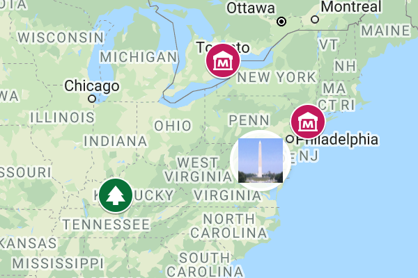 | Best to show specific locations (such as addresses) with customized colored markers for categories, plus text and images in popup windows. <br>Easy tool: [Google My Maps tutorial](mymaps.html). <br>Power tool: [Ch 13: Leaflet Maps with Google Sheets tutorial](leaflet-maps-with-google-sheets.html) |
| Symbol point map<br> 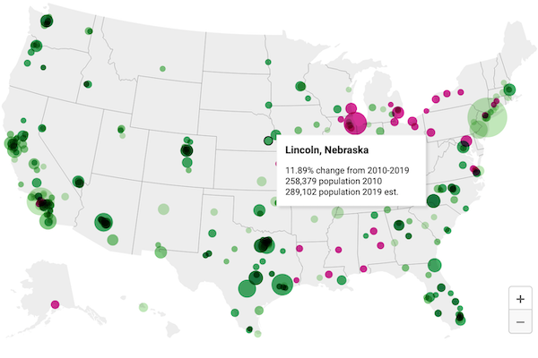 | Best to show specific locations (such as cities), with variable-sized shapes or colors to represent data values (such as population growth). <br>Easy tool: [Symbol Point Map with Datawrapper tutorial](symbolmap-datawrapper.html) |
| Choropleth (colored polygon) map <br>  | Best to show patterns across geographic areas (such as neighborhoods or nations) by coloring polygons to represent data values. <br>Easy tool: [Choropleth map with Datawrapper tutorial](choropleth-datawrapper.html) or [Choropleth map with Tableau Public tutorial](map-tableau.html) <br>Power tools: [Ch 13: Leaflet Maps with Google Sheets tutorial](leaflet-maps-with-google-sheets.html) |
| Heat point map <br>  | Best to show clusters of points as colored hotspots to emphasize high frequency or density of cases. <br>Power tool: [Ch 13: Leaflet Heatmap code template](leaflet-heatmap.html) |
| Story map <br>  | Best to show a point-by-point guided tour, with a scrolling narrative to display text, images, audio, video, and scanned map backgrounds. <br> Power tool: [Ch 13: Leaflet Storymaps with Google Sheets tutorial](leaflet-storymaps-with-google-sheets.html) |
| Polyline map <br>  | Best to show routes (such as trails or transit), with colors for different categories. <br>Easy Tool: [Google My Maps tutorial](mymaps.html) <br>Power tool: [Ch 13: Leaflet Maps with Google Sheets tutorial](leaflet-maps-with-google-sheets.html)|
| Customized point-polyline-polygon map <br>  | Best to show any combination of points, polylines, or polygons, with customized icons for categories, and colored regions to represent data values. <br>Power tool: [Ch 13: Leaflet Maps with Google Sheets tutorial](leaflet-maps-with-google-sheets.html) |
| Searchable point map<br>  | Best to show specific locations for users to search by name or proximity, or filter by category, with optional list view.<br> Power Tool: [Ch 13: Leaflet Searchable Point Map code template](leaflet-searchable-map.html) |
| Current map from open-data repository<br>  | Best to show the most current information pulled directly from an open-data repository such as Socrata and others. <br>Easy tool: [Current map with Socrata open data tutorial](map-socrata.html)<br>Power tool: [Ch 13: Leaflet Maps with Open Data API code template](leaflet-maps-open-data-apis.html) |

## Map Design Principles {- #map-design}
Much of the data collected today includes a spatial component that can be mapped. Whether you look up a city address or take a photo of a tree in the forest, both can be geocoded as points on a map. We also can draw lines and shapes to illustrate geographical boundaries of neighborhoods or nations, and color them to represent different values, such as population and income.  

However, just because data *can* be mapped does not always mean it *should* be mapped. Before creating a map, stop and ask yourself: *Does location really matter to your story?* Even when your data includes geographic information, sometimes a chart tells your story better than a map. For example, you can clearly show differences between geographic areas in a bar chart, or trace how they rise and fall on different rates over time with a line chart, or compare two variables for each area in a scatter chart. Sometimes a simple table, or even text alone, communicates your point more effectively to your audience. Since creating a well-designed map requires time and energy, make sure it actually enhances your data story.

As you learned in the previous chapter about charts, data visualization is not a science, but comes with a set of principles and best practices that serve as a foundation for creating true and meaningful maps. In this section, we'll identify a few rules about map design, but you may be surprised to learn that some rules are less rigid than others, and can be "broken" when necessary to emphasize a point, as long as you are honestly interpreting the data. To begin to understand the difference, let's start by establishing a common vocabulary about maps by breaking one down into its elements.

### Deconstructing a Map {-}
Our book features how to create *interactive* web maps, also called *tiled maps* or *slippy maps*, because users can zoom into and pan around to explore map data layers on top of a seamless set of basemap tiles. Basemaps that display aerial photo imagery are known as *raster* tiles, while those that display pictorial images of streets and buildings are tiles that are built from *vector* data. Raster map data is limited by the resolution of the original image, which gets fuzzier as we get closer. By contrast, you can zoom in very close to vector map data without diminishing its visual quality, as shown in Figure \@ref(fig:raster-vs-vector-zoom). You'll learn more about these concepts in the [GeoJSON and Geospatial Data](geojson.html) section of Chapter 14.

(ref:raster-vs-vector-zoom) Raster map data from Esri World Imagery (on the left), and vector map data from OpenStreetMap (on the right), both showing co-author Ilyankou's childhood neighborhood in Mogilev, Belarus. Zooming into raster map data makes it fuzzier, while vector map data retains its sharpness.

```{r raster-vs-vector-zoom, out.width=750, fig.cap="(ref:raster-vs-vector-zoom)"}
knitr::include_graphics("images/08-map/raster-vs-vector-zoom.png")
```

Look at Figure \@ref(fig:map-principles-map) to learn about basic elements in the interactive maps you'll create in this chapter. The top layer usually displays some combination of *points*, *polylines*, and *polygons*. Points show specific places, such as the street address of a home or business, sometimes with a location marker, and each point is represented by a pair of latitude and longitude coordinates. For example, `40.69, -74.04` marks the location of the Statue of Liberty in New York City. Polylines are connected strings of points, such as roads or transportation networks, and we place the “poly-” prefix before “lines” to remind us that they may contain multiple branches. Polygons are collections of lines that create a closed shape, such as building footprints, census tracts, or state or national boundaries. Since points, polylines, and polygons fundamentally consist of latitude and longitude coordinates, all of them are vector data.

(ref:map-principles-map) Key elements of an interactive map.

```{r map-principles-map, fig.cap="(ref:map-principles-map)"}
knitr::include_graphics("images/08-map/map-principles-map.png")
```

Interactive maps usually include *zoom controls* (`+` and `-` buttons) to change the display of the basemap tiles and give the appearance of viewing the surface from different distances. Top-layer map data may display a hidden *tooltip* (when you hover the cursor over them) or a *popup* (when you click on them) that reveals additional information about its properties. Like a traditional static map, the *legend* identifies the meaning of symbols, shapes, and colors. Maps also may include a *north arrow* or *scale* to orient readers to direction and relative distance. Similar to a chart, good maps should include a title and brief description to provide context about what it shows, along with its data sources, clarifying notes, and credit to the individuals or organizations that helped to create them.  

### Clarify Point versus Polygon Data {-}

Before you start to create a map, make sure you understand your data format and what it represents. Avoid novice mistakes by pausing to ask these questions. First, *Can your data be mapped?* Sometimes the information we collect has no geographic component, or no consistent one, which makes it difficult or impossible to place on a map. If the answer is yes, then proceed to the second question: *Can the data be mapped as points or polygons?* These are the two most likely cases (which are sometimes confused), in contrast to the less-common third option, polylines, which represent paths and routes.

To help you understand the difference, let's look at some examples. What type of data do you see listed below: points or polygons?

1. 36.48, -118.56 (latitude and longitude for Joshua Tree National Park, CA)
2. 2800 E Observatory Rd, Los Angeles, CA
3. Haight and Ashbury Street, San Francisco, CA
4. Balboa Park, San Diego, CA
5. Census tract 4087, Alameda County, CA
6. City of Los Angeles, CA
7. San Diego County, CA
8. State of California

In most cases, numbers 1-4 represent *point* data because they usually refer to a *specific locations* that can be displayed as point markers on a map. By contrast, numbers 5-8 generally represent *polygon* data because they usually refer to *geographic boundaries* that can be displayed as closed shapes on a map. See examples of both point and polygon maps in previous Table \@ref(tab:map-types).

This point-versus-polygon distinction applies *most* of the time, but not always, with exceptions depending on your data story. First, it is possible, but not common, to represent all items 1-8 as *point* data on a map. For example, to tell a data story about population growth for California cities, it would make sense to create a symbol point map with different-sized circles to represent data for each city. To do this, your map tool would need to find the center-point of the City of Los Angeles polygon boundary in order to place its population circle on a specific point on the map. A second way the point-versus-polygon distinction gets blurry is because some places we normally consider to be specific points *also* have polygon-shaped borders. For example, if you enter "Balboa Park, San Diego CA" into Google Maps, it will display the result as a map marker, which suggests it is point data. But Balboa Park also has a geographic boundary that covers 1.8 square miles (4.8 square kilometers). If you told a data story about how much land in San Diego was devoted to public space, it would make sense to create a choropleth map that displays Balboa Park as a polygon rather than a point. Third, it's also possible to transform points into polygon data with [pivot tables, a topic we introduced in Chapter 3](pivot.html). For example, to tell a data story about the number of hospital beds in each California county, you could obtain point-level data about beds in each hospital, then pivot them to sum up the total number of beds in each county, and display these polygon-level results in a choropleth map. See a more detailed example in the [Pivot Points into Polygon Data section of Chapter 14: Transform Your Map Data](pivot-point-to-polygon.html)

In summary, clarify if your spatial data should represent points or polygons, since those two categories are sometimes confused. If you envision them as points, then create a point-style map; or if polygons, then create a choropleth map. Those are the most common methods used by mapmakers, but there are plenty of exceptions, depending on your data story. Later in this chapter you'll learn how to make a [basic point map in Google MyMaps](mymaps.html) and a [symbol point map in Datawrapper](symbolmap-datawrapper.html), then we'll demonstrate how to visualize polygon-level data with a [choropleth map in Datawrapper](choropleth-datawrapper.html) and [also in Tableau Public](map-tableau.html).

### Map One Variable, Not Two {-}
Newcomers to data visualization sometimes are so proud of placing one variable on a map that they figure two variables must be twice as good. But this usually is not true. Here is the thought process that leads to this mistaken conclusion. Imagine you want to compare the relationship between income and education in eight counties of your state. First, you choose create a choropleth map of income, where darker blue areas represent areas with higher levels in the northwest corner, as shown in Figure \@ref(fig:map-two-variables)(a). Second, you decide to create a symbol point map, where larger circle sizes represents a higher share of the population with a university degree, as shown in Figure \@ref(fig:map-two-variables)(b). Both of those maps are fine, but they still do not highlight the relationship between income and education.

A common mistake is to place the symbol point layer on top of the choropleth map layer, as shown in Figure \@ref(fig:map-two-variables)(c). And this is where your map becomes overloaded. We generally recommend against displaying two variables with different symbologies on the same map, because it overloads the visualization and makes it very difficult for most readers to recognize patterns that help them to grasp your data story.

(ref:map-two-variables) To compare two variables, such as income and education, avoid placing a symbol point map on top of a choropleth map. Instead, create a scatter chart, and consider pairing it with a choropleth map of one variable.

```{r map-two-variables, out.width=450, fig.cap="(ref:map-two-variables)"}
knitr::include_graphics("images/08-map/map-two-variables.png")
```

Instead, if the relationship between two variables is the most important aspect of your data story, create a scatter chart as shown in Figure \@ref(fig:map-two-variables)(d). Or if geographic patterns matter for one of the variables, you could pair a choropleth map of that variable next to a scatter chart of both variables, by combining Figure \@ref(fig:map-two-variables)(a and d). Overall, remember that just because data *can* be mapped does not always mean it *should* be mapped. Pause to reflect on whether or not location matters, because sometimes a chart tells your data story better than a map.

### Choose Smaller Geographies for Choropleth Maps {-}
Choropleth maps are best for showing geographic patterns across regions by coloring polygons to represent data values. Therefore, we generally recommend selecting *smaller* geographies to display more *granular* patterns, since larger geographies display aggregated data that may hide what's happening at lower levels. Geographers refer to this concept as the [modifiable aerial unit problem](https://en.wikipedia.org/wiki/Modifiable_areal_unit_problem), which means that the way you slice up your data affects how we analyze its appearance on the map. Stacking together lots of small slices reveals more detail than one big slice.

For example, compare the two choropleth maps of typical home values in the Northeastern United States, according to [Zillow research data](https://www.zillow.com/research/data/) for September 2020. Zillow defines typical values as a smoothed, seasonally adjusted measure of all single-family residences, condos, and coops in the 35th to 65th percentile range, similar to the median value at the 50th percentile, with some additional lower- and higher-value homes. Both choropleth maps use the same scale. The key difference is the size of the geographic units. In Figure \@ref(fig:zillow-northeast), the map on the left shows home values at the larger state level, while the map on the right shows home values at the smaller county level.

(ref:zillow-northeast) Zillow typical home values in September 2020 shown at the larger state level (left) versus the smaller county level (right).

```{r zillow-northeast, out.width=500, fig.cap="(ref:zillow-northeast)"}
knitr::include_graphics("images/08-map/zillow-northeast.png")
```

Which map is best? Since both are truthful depictions of the data, the answer depends on the story you wish to tell. If you want to emphasize state-to-state differences, choose the first map because it clearly highlights how typical Massachusetts home prices are higher than those in surrounding Northeastern states. Or if you want to emphasize variation inside states, choose the second map, which demonstrates higher price levels in the New York City and Boston metropolitan regions, in comparison to more rural counties in those two states. If you're unsure, it's usually better to map smaller geographies, because it's possible to see both state-level and within-state variations at the same time, if the design includes appropriate labels and geographic outlines. But don't turn *smaller is better* into a rigid rule, since it doesn't work as you move further down the scale. For example, if we created a third map to display every individual home sale in the Northeastern US, it would be *too detailed* to see meaningful patterns. Look for just the right level of geography to clearly tell your data story.

## Design Choropleth Colors & Intervals {- #design-choropleth}

This section takes a deeper dive into map design principles for choropleth maps. Your choices about how to represent data with colors dramatically shapes their appearance, so it's very important to learn key concepts to ensure that your maps tell true and meaningful stories. Good choropleth maps make true and insightful geographic patterns clearly visible to readers, whether they are printed in black-and-white on paper or displayed in color on a computer screen. Furthermore, the best choropleth maps are designed to be interpreted correctly by people with colorblindness. For an excellent overview of visualization colors in general, see Lisa Charlotte Rost's "[A Friendly Guide to Colors in Data Visualization](https://blog.datawrapper.de/colorguide/)" and "[How to Pick More Beautiful Colors for Your Data Visualizations](https://blog.datawrapper.de/beautifulcolors/index.html)," both on the Datawrapper blog.^[@rostYourFriendlyGuide2018; @rostHowPickMore2020]

The best way to illustrate how color choices affect choropleth map design is with a wonderful online design assistant called [ColorBrewer](https://colorbrewer2.org/), created by Cynthia Brewer and Mark Harrower.^[See also @brewerDesigningBetterMaps2016] Unlike other tools in this book, you do not upload data directly into ColorBrewer to generate your visualization. Instead, you select the type of data you wish to display in your choropleth map, and ColorBrewer will assist you by recommending color palettes that work best with your data story. Then you can export those color codes into your preferred choropleth mapping tool, as shown in the [Datawrapper](choropleth-datawrapper.html) and [Tableau Public](map-tableau.html) tutorials below. See the ColorBrewer interface in Figure \@ref(fig:map-colorbrewer).

(ref:map-colorbrewer) The ColorBrewer design assistant interface: data classes, type of color scheme, and recommended color codes.

```{r map-colorbrewer, fig.cap="(ref:map-colorbrewer)"}
knitr::include_graphics("images/08-map/map-colorbrewer-annotated.png")
```

In this section, we'll focus on two important decisions that ColorBrewer can assist you with when designing choropleth maps: choosing the type of color palette (sequential, divergent, or qualitative) and the intervals to group together similar-colored data points.

When you open [ColorBrewer](https://colorbrewer2.org/), the top row asks you to select the number of data classes (also known as intervals or steps) in the color range of your choropleth map. ColorBrewer can recommend distinct colors for up to twelve data classes, depending on the type of scheme you select. But for now, use the default setting of 3, and we'll return to this topic later when we discuss intervals in more detail further below.

### Choose Choropleth Palettes to Match Your Data {-}
One of the most important decisions you'll make when designing a choropleth map is to select the type of palette. You're not simply choosing a color, but the *arrangement of colors* to help readers correctly interpret your information. The rule is straightforward: choose an appropriate color palette that matches your data format, and the story you wish to tell.

ColorBrewer groups palettes into three types---sequential, diverging, and qualitative---as shown in Figure \@ref(fig:map-principles-color-schemes).

(ref:map-principles-color-schemes) Sequential, diverging, and qualitative color palettes from [ColorBrewer](https://colorbrewer2.org/).

```{r map-principles-color-schemes, fig.cap="(ref:map-principles-color-schemes)"}
knitr::include_graphics("images/08-map/map-principles-color-schemes.png")
```

*Sequential palettes* work best to show low-to-high numeric values. Examples include anything that can be placed in sequence on a scale, such as median income, amount of rainfall, or percent of the population who voted in the prior election. Sequential palettes can be single-hue (such as different shades of blue) or multi-hue (such as yellow-orange-red). Darker colors *usually* represent higher values, but not always.

*Diverging palettes* work best to show numeric values above and below a standard level (such as zero, the average, or the median). They typically have two distinct hues to represent positive and negative directions, with darker colors at the extremes, and a neutral color in the middle. Examples include income above or below the median level, rainfall above or below seasonal average, or percentage of voters above or below the norm.

*Qualitative palettes* work best to show categorical data, rather than numeric scales. They typically feature unique colors that stand apart from one another to emphasize differences. Examples include different types of land use (residential, commercial, open space, water) or categories such as a stoplight-colored warning system (green, yellow, and red).

To illustrate the difference between *sequential* and *diverging* numeric values, compare the two maps that display the same data on income per capita in the contiguous US states in 2018 in Figure \@ref(fig:map-principles-classification). The sequential color palette shows five shades of blue to represent the low-to-high range of income levels, and it works best for a data story that emphasizes the highest income levels, shown by the darker blue colors along the Northeastern coast from Maryland to Massachusetts. By contrast, the diverging color palette shows dark orange for below-average states, dark purple for above-average states, and a neutral color in the middle, and it works best for a data story that emphasizes an economic division between lower-income Southern states versus higher-income East Coast and West Coast states.

(ref:map-principles-classification) Sequential versus diverging color palettes to illustrate per capita income in US dollars in the contiguous states, from American Community Survey, 2018.

```{r map-principles-classification, out.width=750, fig.cap="(ref:map-principles-classification)"}
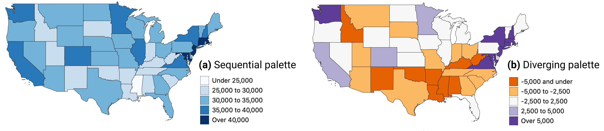
```

After you select data classes and a color palette, ColorBrewer displays alphanumeric codes that web browsers translate into colors. You can select hexadecimal codes (`#ffffff` is white), RGB codes (`255,255,255` is white), or CMYK codes (`0,0,0,0` is white), and export them in different formats, as shown in Figure \@ref(fig:colorbrewer-export), if your preferred map tool allows you to import color palettes.

(ref:colorbrewer-export) Click open the *Export* tab to display your color palette codes in various formats.

```{r colorbrewer-export, out.width=435, fig.cap="(ref:colorbrewer-export)"}
knitr::include_graphics("images/08-map/colorbrewer-export.png")
```

### Choose Color Intervals to Group Choropleth Map Data {-}

Another important design choice is color intervals, which determine how you group and display data on your choropleth map. This powerful set of decisions will dramatically shape how your map appears in readers' eyes, and the message conveyed by your data story. You will need to consider several options in this multi-step decision-making process, and although there are few uniform design rules, we will offer guidance and recommendations. Since options for selecting intervals vary across different mapping tools, we will explain broad concepts in this section, with occasional screenshots from Datawrapper and Tableau Public, but will save the details for those specific tutorials later in the chapter.

Some mapping tools allow you to choose between two different *types of color intervals* to show movement up or down a data scale, as shown in Figure \@ref(fig:intervals-type-combined). *Steps* are clearly-marked color dividers, like a staircase, while *continuous* is a gradual change in color, like a ramp. Both go upward, but take you there in different ways.

(ref:intervals-type-combined) Steps versus continuous color intervals in Datawrapper (left) and Tableau Public (right).

```{r intervals-type-combined, out.width=500, fig.cap="(ref:intervals-type-combined)"}
knitr::include_graphics("images/08-map/intervals-type-combined.png")
```

If both options exist, which type of color interval is best: steps or continuous? There is no uniform map design rule about this, but consider these factors. On one hand, steps work best for data stories that show areas below or above a specific line or threshold, such as zones that will flood if the sea level rises by one meter. Also, since human eyes are not always good at distinguishing between hues, steps can help readers to quickly match colors from your map legend to your data. On the other hand, continuous works best for data stories that draw attention to subtle differences between neighboring areas, such as the wide range of values on an income scale. Read this Datawrapper Academy article on [what to consider when creating choropleth maps](https://academy.datawrapper.de/article/134-what-to-consider-when-creating-choropleth-maps). Overall, we advise you to make design choices that are both honest and insightful: tell the truth about the data and also draw attention to what matters in your data story.

If you choose *steps*, how many dividers should you use to slice up your data? Once again, there is no uniform rule, but reflect on these options and outcomes. Fewer steps creates a *coarse* map that highlights broad differences, while more steps creates a *granular* map that emphasizes geographic diversity between areas. However,  simply adding more steps does not necessarily make a better map, because differences between steps become less visible to the human eye. Since the [ColorBrewer](https://colorbrewer2.org) design assistant was created specifically for steps (and does not show continuous options), we recommend experimenting by raising or lowering the *Number of data classes* (also known as steps) to visualize the appearance of different design choices, as shown in Figure \@ref(fig:colorbrewer-steps). Make decisions with the best interests of your readers in mind, to represent your data in honest and insightful ways.

(ref:colorbrewer-steps) If you choose steps, experiment with ColorBrewer data classes and color palettes.

```{r colorbrewer-steps, out.width=300, fig.cap="(ref:colorbrewer-steps)"}
knitr::include_graphics("images/08-map/colorbrewer-steps.png")
```

Some choropleth mapping tools also allow you to choose how to *interpolate* your data, meaning the method for grouping numbers to represent similar colors on your map. For example, Datawrapper displays two different sets of drop-down menus for interpolation options, depending on whether you chose steps or continuous, as shown in Figure \@ref(fig:interpolation-datawrapper-combined).

(ref:interpolation-datawrapper-combined) Interpolation options for steps (left) and continuous (right) in Datawrapper.

```{r interpolation-datawrapper-combined, out.width=650, fig.cap="(ref:interpolation-datawrapper-combined)"}
knitr::include_graphics("images/08-map/interpolation-datawrapper-combined.png")
```

Before choosing how to interpolate, create a [histogram chart in Google Sheets described in chapter 7](histogram-google.html) to gain a deeper understanding of how your data is distributed. Is your histogram evenly distributed with a symmetrical shape around the mean? Or is it skewed to one side, with one tail of outliers that is longer than the other? Compare the simplified histograms in Figure \@ref(fig:interpolation-histograms), which may influence your decision about how to interpolate, as described below.

(ref:interpolation-histograms) Histogram of evenly-distributed data (on right) versus skewed data with a longer tail to one side (on left).

```{r interpolation-histograms, out.width=500, fig.cap="(ref:interpolation-histograms)"}
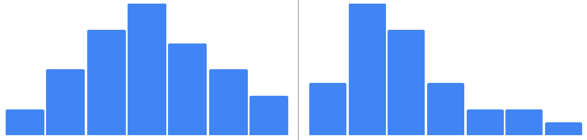
```

In this introductory book, we can simplify the most common interpolation options in three basic categories:

- *Linear* places your data values in a straight line, from lowest to highest. This method works best when the data are evenly distributed, or if you wish to draw attention to the low and high extremes in your data, since they will stand out in light and dark colors.

- *Quantiles* divide your data values into groups of an equal number. More specifically, *quartiles*, *quintiles*, and *deciles* divide the values into four, five, or ten groups of equal quantity. This method works best when the data are skewed to one side, because the regrouping allows you to draw attention to diversity inside the data, rather than the extremes. *Rounded values* are similar to quantiles, but the decimals are replaced with rounded numbers that look nicer to readers' eyes.

- *Natural breaks (Jenks)* offers a compromise between linear and quantile methods. It groups data values that are close together, but maximizes differences with other groups. This method may work best with skewed data where you wish to draw attention to both internal diversity and extremes.

Which interpolation method is best? There are no uniform design rules, except that we advise *against* using *Custom* settings to manually place color intervals wherever you wish, since they are more likely to create misleading maps, as you'll learn in [Chapter 15: Detect Lies and Reduce Bias](detect.html). Our best advice is to experiment with different interpolation methods, especially when working with skewed data, to better understand how these options shape the appearance of your choropleth maps and the data stories you tell with them.

Overall, [Datawrapper Academy recommends](https://academy.datawrapper.de/article/134-what-to-consider-when-creating-choropleth-maps) that you make color intervals choices to help readers "see all the differences in the data" by fully utilizing all of the colors in your range, as shown in Figure \@ref(fig:intervals-datawrapper-montage). In other words, if your map displays only the lightest and darkest colors, you're not sufficiently using the middle portion of your color range to highlight geographic patterns and diversity within your data. To do this, you'll need to explore beyond the default map settings and test which options do the best job of telling an honest and insightful data story.

(ref:intervals-datawrapper-montage) Use the full color range to show all of the differences in the data. Image by [Datawrapper Academy](https://academy.datawrapper.de/article/134-what-to-consider-when-creating-choropleth-maps), reprinted with permission.

```{r intervals-datawrapper-montage, out.width=500, fig.cap="(ref:intervals-datawrapper-montage)"}
knitr::include_graphics("images/08-map/intervals-datawrapper-montage.png")
```

Designing true and meaningful choropleth maps is challenging work. You will improve your skills the same way we did, by reading widely, looking at different maps, and testing various ways to visualize your data. Become more aware of how your decisions about color intervals can dramatically alter how the data appears to readers. Most important, create maps that focus on telling your story and truthfully representing the data.

## Normalize Choropleth Map Data {- #normalize-choropleth}

We introduced the concept of [normalizing data in Chapter 6: Make Meaningful Comparisons](normalize.html). Normalization means adjusting data that was collected using different scales into a common scale, in order to make more appropriate comparisons. For example, it makes little sense to compare the total number of Covid cases between nations with very different populations, such as 9.61 million cases in the United States (estimated population 328.2 million) and 0.49 million cases in Belgium (estimated population 11.5 million) as of November 6, 2020. A better strategy is to normalize the data by comparing cases per capita (such as 2,928 cases per 100,000 in the United States versus 4,260 per 100,000 in Belgium) to adjust for prior differences in population.

If you forget to normalize data for a choropleth map, and display raw counts rather than relative values (such as percentages or rates per capita), you'll often end up recreating a meaningless map of population centers, rather than the phenomenon you're trying to measure.  you often end up showing population centers, instead of the phenomenon that you're trying to measure.  For example, compare two maps shown in Figure \@ref(fig:normalize-map-data). They both are about Covid-19 cases in the continental US as of June 26, 2020. Figure \@ref(fig:normalize-map-data)a shows total number of recorded cases per state, and Figure \@ref(fig:normalize-map-data)b shows Covid-19 cases adjusted by the state's population. Darker colors represent higher values. Do you notice any differences in spatial patterns?

(ref:normalize-map-data) Choropleth maps work best with normalized values.

```{r normalize-map-data, fig.cap="(ref:normalize-map-data)"}
knitr::include_graphics("images/08-map/normalize-map-data-annotated.png")
```

Both maps show Covid-19 data collected by the New York Times and published [on GitHub](https://github.com/nytimes/covid-19-data). In the map in Figure \@ref(fig:normalize-map-data)b, we normalized values by dividing the total number of cases by the population in each state, according to the 2018 US Census American Community Survey, the most recent data available on the day of writing. We did not add legends and other important cartographic elements so that you can better focus on interpreting spatial patterns. In both cases, we used Jenks natural breaks for classification.

What are the worst-hit states according to the map showing total Covid-19 counts (shown in Figure \@ref(fig:normalize-map-data)a)? If you are familiar with the US geography, you can quickly tell that these are New York, New Jersey, Massachusetts, Florida, Illinois, Texas, and California. But five of these happen to be some of the most populous states in the US, so it makes sense that they will also have higher Covid-19 cases.

Now, how about the map in Figure \@ref(fig:normalize-map-data)b? You can see that New York and its neighbors, including New Jersey and Massachusetts, have by far the highest rates per capita (per person), which we saw in the first map. But you can also see that in fact California, Texas, and Florida were impacted to a lesser extent than the map on the left had suggested. So the map with per-capita values is a much better illustration to the story about New York being the *first* epicenter of the Covid-19 crisis in the United States.

At this point, you should have a better idea of key principles and best practices in map design. Now that we've covered key concepts for interactive maps in general, and choropleth maps in particular, we will pivot to a series of hands-on tutorials with our recommended tools. In our first tutorial, we will create a [point map with custom icons in Google MyMaps](mymaps.html) to show information about specific locations with pop-up windows. In our second tutorial, we will build a [symbol point map in Datawrapper](symbolmap-datawrapper.html) that uses colored circles of varying sizes to represent population change for specific cities. Our final tutorials in this chapter will return to the topic of designing [choropleth maps in Datawrapper](choropleth-datawrapper.html) and also [in Tableau Public](map-tableau.html) in order to compare these two tools.

## Point Map with Google My Maps {- #mymaps}

Most people are already familiar with [Google Maps](https://www.google.com/maps/), the web mapping service that allows users to look up locations and directions around the world. In this section you'll learn about [Google My Maps](https://www.google.com/maps/about/mymaps/), a related tool that allows you to display groups of points on top of the Google Maps platform, which users can click on to reveal more data, including photos, websites, or directions. You can customize the colors and icons for your point markers, and all of the map layer content you create will reside in your [Google Drive](https://drive.google.com), where you can edit and collaborate with others. Although Google My Maps has limited features, it's an easy-to-learn tool to build a basic interactive point map, along with simple polylines and polygons if desired. Finally, you can share a public link to your map or embed it on your website, a step that you'll learn more about in [Chapter 10: Embed on the Web](embed.html).

In this section, we will construct a point map of museums and parks in North America, with two different groups of styled markers and a custom photo icon. When users click on a marker, additional text, links, and images appear in the pop-up window, as shown in Figure \@ref(fig:mymaps-final).

(ref:mymaps-final) Point map of parks and museums created with Google My Maps. Explore the [interactive version](https://www.google.com/maps/d/u/1/edit?mid=1W6VujVZzB1Y1D1tktLVhO99ZabyOZABr&usp=sharing).

```{r mymaps-final, fig.cap="(ref:mymaps-final)"}
if(knitr::is_html_output(excludes="markdown")) knitr::include_url("https://www.google.com/maps/d/u/3/embed?mid=1W6VujVZzB1Y1D1tktLVhO99ZabyOZABr", height="500px") else 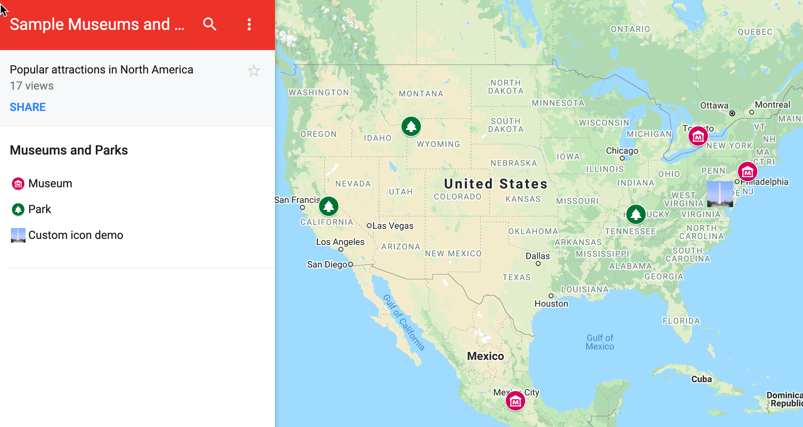
```

To create your own interactive point map with custom icons, follow this tutorial:

1. Open the [Parks and Museums data in Google Sheets](https://docs.google.com/spreadsheets/d/11nSoyGUxDJiBe5VZflDnaaqgWMdWyIUNnjNLMlGOPLk/edit#gid=312385679), which contains six popular locations in North America. Each row includes a *Group*, *Name*, *Address*, and *URL*. Log into your Google account and go to *File > Make a Copy* to create a version you can edit in your Google Drive.

2. Navigate to [Google My Maps](https://www.google.com/mymaps/). In the upper-left corner, click the *+ Create a New Map* button, as shown in Figure \@ref(fig:mymaps-create-new). This will create an empty map with familiar Google Maps style.

(ref:mymaps-create-new) Navigate to https://www.google.com/mymaps/ and create a new map.

```{r mymaps-create-new, out.width=300, fig.cap="(ref:mymaps-create-new)"}
knitr::include_graphics("images/08-map/mymaps-create-new.png")
```

3. Add a relevant title and description by clicking its current title, *Untitled map*, and typing in the new information, as shown in Figure \@ref(fig:mymaps-edit-title).

(ref:mymaps-edit-title) Add title and description to your map.

```{r mymaps-edit-title, out.width=300, fig.cap="(ref:mymaps-edit-title)"}
knitr::include_graphics("images/08-map/mymaps-edit-title.png")
```

4. To add data to your map, click the *Import* button under the *Untitled layer* item, as shown in Figure \@ref(fig:mymaps-import).

(ref:mymaps-import) Click the *Import* button to add a data layer to your map.

```{r mymaps-import, out.width=300, fig.cap="(ref:mymaps-import)"}
knitr::include_graphics("images/08-map/mymaps-import.png")
```

5. In the *Choose a file to import* screen, there are several ways to upload data. Choose *Google Drive*, since our sample data is already in that format, and select the *Recent* button to locate the *Museums and Parks* file you saved to your Google Drive, as shown in Figure \@ref(fig:mymaps-import-gdrive). Press *Select*.

(ref:mymaps-import-gdrive) After you choose to import your data through *Google Drive*, select the *Recent* button to find the file.

```{r mymaps-import-gdrive, out.width=750, fig.cap="(ref:mymaps-import-gdrive)"}
knitr::include_graphics("images/08-map/mymaps-import-gdrive.png")
```

6. In the *Choose columns to position your placemarks* screen, select the *Address* column to place your point data on the map, as shown in Figure \@ref(fig:mymaps-placemarks). Press *Continue*.

(ref:mymaps-placemarks) Select *Address* to place your data on the map.

```{r mymaps-placemarks, out.width=350, fig.cap="(ref:mymaps-placemarks)"}
knitr::include_graphics("images/08-map/mymaps-placemarks.png")
```

Hint: You can select multiple boxes if your address is split across several columns, such as *Address*, *City*, *State*, *Zipcode*. Also, if your point data is already geocoded, you can upload latitude and longitude pairs, such as `41.76, -72.69`.

7. In the *Choose a column to title your markers* window, select the *Name* column to title your point markers, as shown in Figure \@ref(fig:mymaps-marker-titles). Then click *Finish*.

(ref:mymaps-marker-titles) Select the *Name* column to title your point markers.

```{r mymaps-marker-titles, out.width=350, fig.cap="(ref:mymaps-marker-titles)"}
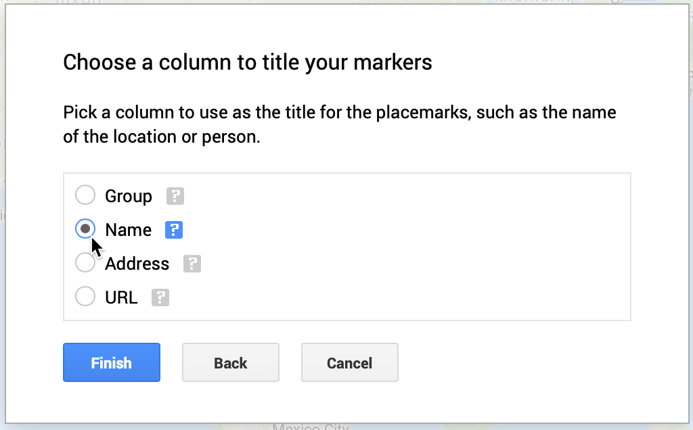
```

Google My Maps will automatically [geocode your address data as we discussed in chapter 3](geocode.html), display them using its default blue markers, and center the map to fit all of the points.

8. Click the three-dot kebab menu next to the *Museums and Parks...* layer to *Rename* and shorten its name, since the full name of the file is imported by default, as shown in Figure \@ref(fig:mymaps-rename-layer).

(ref:mymaps-rename-layer) Click the 3-dot kebab menu next to the layer to shorten its name.

```{r mymaps-rename-layer, out.width=300, fig.cap="(ref:mymaps-rename-layer)"}
knitr::include_graphics("images/08-map/mymaps-rename-layer.png")
```

9. Since our map contains two groups---museums and parks---let's create a custom color marker for each group to replace the default blue markers. Click on *Individual styles*, and in the *Group places by* dropdown, change the value to *Style data by column: Group*, as show in Figure \@ref(fig:mymaps-group-places). This option is available because we intentionally created the *Group* column for museums and parks when setting up the sample data. Close this window by clicking the upper-right *X* symbol.

(ref:mymaps-group-places) Change *Individual styles* to *Group places by: Group*.

```{r mymaps-group-places, out.width=300, fig.cap="(ref:mymaps-group-places)"}
knitr::include_graphics("images/08-map/mymaps-group-places.png")
```

10. Under *Styled by group*, float your cursor over the *Museum* label to reveal the bucket styling symbol, and click it, as shown in Figure \@ref(fig:mymaps-customize-marker).

(ref:mymaps-customize-marker) Float your cursor over a label to reveal the bucket styling symbol.

```{r mymaps-customize-marker, out.width=295, fig.cap="(ref:mymaps-customize-marker)"}
knitr::include_graphics("images/08-map/mymaps-customize-marker.png")
```

11. Assign a new color for *Museums*, and click *More icons* to find a more appropriate point marker symbol, as shown in Figure \@ref(fig:mymaps-colors-icons).

(ref:mymaps-colors-icons) Select point marker colors and icons.

```{r mymaps-colors-icons, out.width=295, fig.cap="(ref:mymaps-colors-icons)"}
knitr::include_graphics("images/08-map/mymaps-colors-icons.png")
```

12. In the *Choose an icon* screen, use the upper-right *Filter* to search for icon types by name, such as "Museum" as shown in Figure \@ref(fig:mymaps-choose-icon). Repeat this process for *Parks*.

(ref:mymaps-choose-icon) Search by filter in the *Choose an icon* screen.

```{r mymaps-choose-icon, out.width=750, fig.cap="(ref:mymaps-choose-icon)"}
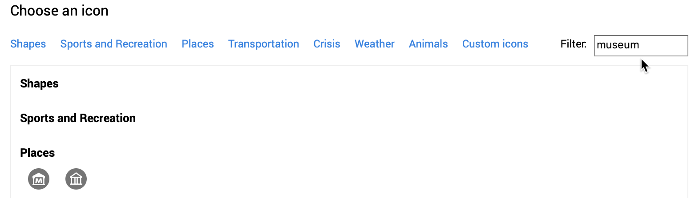
```

13. In the *Choose an icon* screen, you can click the lower-left *Custom icon* button to upload an image, which will be transformed into a thumbnail image icon, as shown in Figure \@ref(fig:mymaps-custom-icon). This custom icon was created from a [Wikimedia image of the Washington Monument](https://commons.wikimedia.org/wiki/File:Washington_Monument_Panorama.jpg).

(ref:mymaps-custom-icon) Upload a photo to create a custom thumbnail icon image.

```{r mymaps-custom-icon, out.width=180, fig.cap="(ref:mymaps-custom-icon)"}
knitr::include_graphics("images/08-map/mymaps-custom-icon.png")
```

14. Click on any map marker to edit its data, insert a photo to appear in its pop-up window, or add Google Map directions, as shown in Figure \@ref(fig:mymaps-edit-point). This photo came from a [Wikimedia image of the Metropolitan Museum of Art](https://commons.wikimedia.org/wiki/File:Metropolitan_Museum_of_Art_entrance_NYC.JPG). However, you must add photos or directions manually, since these links cannot be pre-loaded into the data spreadsheet.

(ref:mymaps-edit-point) Click any map marker to edit its data, add a photo, or directions.

```{r mymaps-edit-point, out.width=345, fig.cap="(ref:mymaps-edit-point)"}
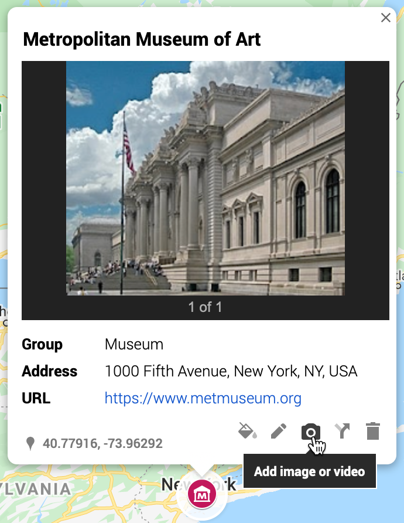
```

15. You can change the style of the basemap to one of nine different versions offered by Google, as shown in the drop-down menu in Figure \@ref(fig:mymaps-style-basemap). Choose high-contrast colors for marker icons and basemap backgrounds.

(ref:mymaps-style-basemap) Change the style of the Google basemap.

```{r mymaps-style-basemap, out.width=300, fig.cap="(ref:mymaps-style-basemap)"}
knitr::include_graphics("images/08-map/mymaps-style-basemap.png")
```

16. At the top of the map, see buttons to manually add more point markers, draw a line, add directions, or measure distance, as shown in Figure \@ref(fig:mymaps-draw-line). However, Google My Maps has limited support for polylines and polygons, and you cannot easily create a choropleth map with colored boundaries that represent data values.

(ref:mymaps-draw-line) Manually add more point markers, lines, and directions, or measure distance.

```{r mymaps-draw-line, out.width=235, fig.cap="(ref:mymaps-draw-line)"}
knitr::include_graphics("images/08-map/mymaps-draw-line.png")
```

17. Click *Preview* to see how you map will appear to other people. When you finish editing your map, click the *Share* button underneath the map's title and description, and in the next screen, make sure *Enable link sharing* is activated, as shown in Figure \@ref(fig:mymaps-share), and copy the generated link. You can share with link with anyone, with or without a Google account. You also have the option to make your map publicly appear in web search results, if desired.

(ref:mymaps-share) Before sharing your map, make sure anyone with the link can view it.

```{r mymaps-share, out.width=400, fig.cap="(ref:mymaps-share)"}
knitr::include_graphics("images/08-map/mymaps-share.png")
```

18. If you wish to embed your map as an iframe on a web page, click the 3-button kebab menu to the right of the map title and select *Embed on my site*, as shown in Figure \@ref(fig:mymaps-embed). This will generate an HTML embed code, which we will explain in [Chapter 10: Embed on the Web](embed.html).

(ref:mymaps-embed) Select *Embed on my site* to copy the HTML iframe code.

```{r mymaps-embed, out.width=315, fig.cap="(ref:mymaps-embed)"}
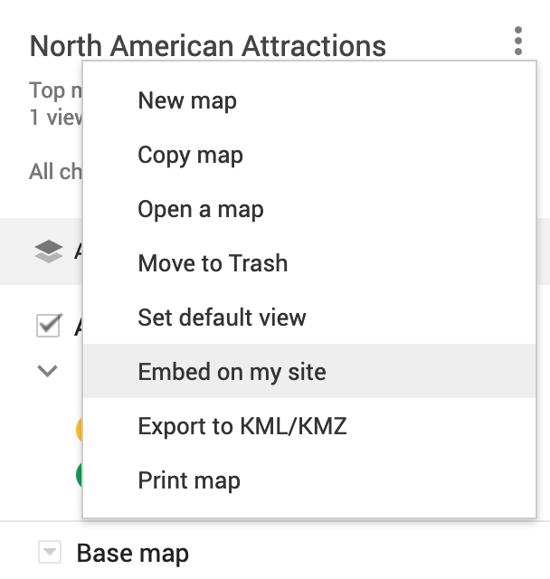
```

19. If you wish to edit your map in the future, here are two ways to access it when logged into your Google account. One way is to [open the Google My Maps platform](https://www.google.com/mymaps/) to view all of your maps. A second way is to go to your [Google Drive](https://drive.google.com) and search for your Google My Maps by keyword. When you create a Google My Map from data in a Google Sheet, we recommend that you keep the My Map and Sheet files together in the same folder in your Google Drive, as shown in Figure \@ref(fig:mymaps-gdrive), to help you make edits more easily in the future.

(ref:mymaps-gdrive) Keep your Google My Maps and Sheets files together in a Google Drive folder.

```{r mymaps-gdrive, out.width=500, fig.cap="(ref:mymaps-gdrive)"}
knitr::include_graphics("images/08-map/mymaps-gdrive.png")
```

Google My Maps is a good first tool to learn for making interactive maps, especially point maps with custom icons. You can design maps with multiple layers of points, polylines, and basic polygons, if desired. But the overall map design and features are limited to what the Google My Maps platform offers. Learn more at the [Google My Maps support page](https://support.google.com/mymaps).

In the next section, we will explore a more powerful tool called Datawrapper to create symbol point maps, where the size and color of each circle (or other shapes) represents data values for that specific point.

## Symbol Point Map with Datawrapper {- #symbolmap-datawrapper}
We first introduced you to the free and easy-to-learn [Datawrapper tool in Chapter 7: Chart Your Data](chart-datawrapper.html). It's also offers powerful features to create different types of maps, with professional-looking design elements. With Datawrapper you can start to work right away in your browser, with no account required unless you wish to save and share your work online.

In this section, you'll learn how to create a symbol point map. Unlike the [basic point map in the Google MyMaps tutorial](mymaps.html), a symbol point map shows data for specific locations through shapes of varying size or color. In Figure \@ref(fig:datawrapper-symbolmap), sample symbol map displays population change for 300 major US cities as point locations with two variables: circle size (for 2019 population size) and circle color (for percent change since 2010). Remember that we use *point* data to create symbol maps, but *polygon* data to create choropleth maps, which you'll learn how to create in the following sections. Later we'll explain [how to embed your interactive Datawrapper maps on the web in Chapter 10](embed.html).

(ref:datawrapper-symbolmap) Symbol point map of US city population growth with Datawrapper. Explore the [interactive version](https://datawrapper.dwcdn.net/V0V9Y).

```{r datawrapper-symbolmap, fig.cap="(ref:datawrapper-symbolmap)"}
if(knitr::is_html_output(excludes="markdown")) knitr::include_url("https://datawrapper.dwcdn.net/V0V9Y", height="550px") else 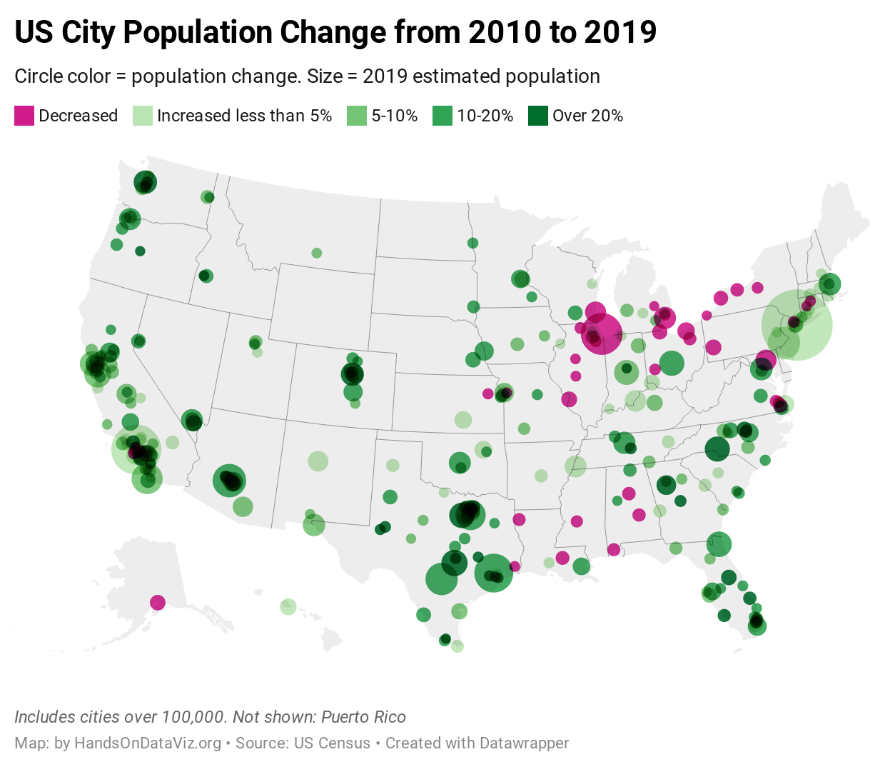
```

Datawrapper splits the process of creating a map into four steps: select map, add data, visualize, then publish and embed. To create your own symbol point map, follow this tutorial.

1. Open the [US Cities Population Change 2010-2019 data in Google Sheets](https://docs.google.com/spreadsheets/d/1XOhNtvYWaebP4izr0PDJfToRIbl2vki_1JNMYTKCCn0/edit#gid=1709919231). Read the notes to understand its origin and some data issues. We downloaded [city population data for 2010-2019 from the US Census](https://www.census.gov/data/tables/time-series/demo/popest/2010s-total-cities-and-towns.html). But during this time period, some cities were newly incorporated or merged with outlying areas, which skews their population data over time. Note also that we included data for Washington, DC (a major city not located in a US state) and for 5 major cities in Puerto Rico (not a state, but a US territory where residents are US citizens), so we'll select an appropriate map to include them below.

Good maps often require [cleaning up messy data as described in Chapter 5](clean.html). In our spreadsheet we narrowed the original list down to about 300 cities with more than 100,000 residents in either 2010 or 2019. Also, since we're relying on Datawrapper to correctly identify *place names*, we combined *city* and *state* into one column to improve geocoding accuracy. Learn more about [place name geocoding at the Datawrapper Academy](https://academy.datawrapper.de/article/193-symbol-location-accuracy-using-addresses-place-names). Also, we created a new column named *Percent Change*, which we calculated this way: `(2019 - 2010) / 2010 * 100`.

2. In the Google Sheet, go to *File > Download* and select the Comma-Separated Values (CSV) format to save the data to your local computer.

3. Open [Datawrapper](https://datawrapper.de), click on *Start Creating*, then the *New Map* button, and select *Symbol map* as shown in Figure \@ref(fig:datawrapper-symbolmap-start).

(ref:datawrapper-symbolmap-start) Start to create a symbol map in Datawrapper.

```{r datawrapper-symbolmap-start, out.width=600, fig.cap="(ref:datawrapper-symbolmap-start)"}
knitr::include_graphics("images/08-map/datawrapper-symbolmap-start.png")
```

4. In the *Select your map* screen, search for *USA > States and Territories* to include Puerto Rico, rather than the *USA > *States* option that appears closer to the top of the list. Proceed to the next screen.

5. In the *Add your data* screen, click the *Import your dataset* button. In the next window, click the *Addresses and Place Names* button to inform Datawrapper that our information is organized this way. In the *Import* window, click to *Upload a CSV file*, and select the file you downloaded above.

6. In the *Match your columns* screen, select the *City-State* column to be *Matched as Address*, then scroll down to click the *Next* button, as shown in Figure \@ref(fig:datawrapper-symbolmap-match). In the next screen click *Go*, then see your geocoded data displayed on a map in the following screen.

(ref:datawrapper-symbolmap-match) Select the *City-State* column to be matched as the *Address*.

```{r datawrapper-symbolmap-match, out.width=400, fig.cap="(ref:datawrapper-symbolmap-match)"}
knitr::include_graphics("images/08-map/datawrapper-symbolmap-match.png")
```

7. Click the *Visualize* button to *Refine* your map. Our goal is to display two variables: 2019 population as the circle size, and percent change as the circle color. Under *Symbol shape and size*, select the *circle* symbol, to be sized by *Pop Estimate 2019*, with a maximum symbol size of 25 pixels. Under *Symbol colors*, select the *Percent Change 2010-2019* column, as shown in Figure \@ref(fig:datawrapper-symbolmap-refine).

(ref:datawrapper-symbolmap-refine) Refine your map by selecting data to display symbol shapes, sizes, and colors.

```{r datawrapper-symbolmap-refine, fig.cap="(ref:datawrapper-symbolmap-refine)"}
knitr::include_graphics("images/08-map/datawrapper-symbolmap-refine.png")
```

8. Optionally, to customize the color palette and intervals to match our example, click the *wrench symbol* next to the palette. Click the *Import colors* button and you can paste in the five hexadecimal codes listed below from ColorBrewer, as described in the [Choropleth Design section](design-choropleth.html). The first code is dark pink, followed by a 4-class sequential green: `#d01c8b,#bae4b3,#74c476,#31a354,#006d2c`. See Figure \@ref(fig:datawrapper-symbolmap-colors).

(ref:datawrapper-symbolmap-colors) Create a new color palette by importing five hexadecimal color codes from ColorBrewer.

```{r datawrapper-symbolmap-colors, out.width=600, fig.cap="(ref:datawrapper-symbolmap-colors)"}
knitr::include_graphics("images/08-map/datawrapper-symbolmap-colors.png")
```

9. To continue customizing intervals to match our example, set the steps to *5* and *Custom*. Manually type in custom intervals for below 0% (bright pink), 0 to 5% (light green), and so forth up the scale. Click the *More options* button, and under *Legend*, change *Labels* to *custom*, and click each label to edit the text that appears on the map menu, as shown in Figure \@ref(fig:datawrapper-symbolmap-intervals). Learn more about these options in the [Datawrapper Academy post on customizing your symbol map](https://academy.datawrapper.de/article/120-customizing-your-symbol-map).

(ref:datawrapper-symbolmap-intervals) Customize the interval ranges and edit the legend.

```{r datawrapper-symbolmap-intervals, out.width=500, fig.cap="(ref:datawrapper-symbolmap-intervals)"}
knitr::include_graphics("images/08-map/datawrapper-symbolmap-intervals.png")
```

10. Under the *Visualize* screen, click the *Annotate* tab to insert a title, source notes, credits, and [customize the tooltips as described by Datawrapper Academy](https://academy.datawrapper.de/article/237-i-want-to-change-how-my-data-appears-in-tooltips#change-the-number-format).

11. Click *Proceed* or advance to the *Publish & Embed* screen to share your work with others. If you logged into your free Datawrapper account, your work is automatically saved online in the *My Charts* menu in the top-right corner of the screen. Also, you can click the blue *Publish* button to generate the code to embed your interactive map on your website, as you'll learn about in [Chapter 10: Embed on the Web](embed.html). In addition, you can *add your chart to River* if you wish to share your work more widely by allowing other Datawrapper users to adapt and reuse it. Furthermore, scroll all the way down and click the *Download PNG* button to export a static image of your map. Additional exporting and publishing options require a paid Datawrapper account. Or, if you prefer not to create an account, you can enter your email to receive the embed code.

For assistance and additional options, see the [Datawrapper Academy support pages on symbol maps](https://academy.datawrapper.de/category/278-symbol-maps).

Now that you've created a symbol point map with Datawrapper, in the next section we'll build our skills with this tool to create a choropleth map.

## Choropleth Map with Datawrapper {- #choropleth-datawrapper}

Now let's pivot from point maps to polygon maps. Since you've already learned how to use [Datawrapper to design charts](chart-datawrapper.html) and [symbol maps](datawrapper-symbolmap.html), let's use this tool to create a choropleth map, which look like colored polygons. Choropleth maps are best for showing patterns across geographic areas by coloring polygons to represent data values. Datawrapper offers a wide collection of common geographical boundaries, including world regions, states and provinces, and also hexagons (cartograms), counties, congressional districts, and census tracts for the United States.

In this section, you'll create a choropleth map of typical home values for US states in August 2020 according to the [Zillow Home Value Index](https://www.zillow.com/research/data/), as shown in Figure \@ref(fig:datawrapper-map-final). The index reflects typical home values (meaning those in the 35th to 65th percentile range, around the median) for single-family residences, condos, and co-ops, and it is smoothed and seasonally adjusted.

(ref:datawrapper-map-final) Choropleth map of 2020 home values in US states with Datawrapper. Explore the [interactive version](https://datawrapper.dwcdn.net/kSYrw/).

```{r datawrapper-map-final, fig.cap="(ref:datawrapper-map-final)"}
if(knitr::is_html_output(excludes="markdown")) knitr::include_url("https://datawrapper.dwcdn.net/kSYrw/", height="530px") else 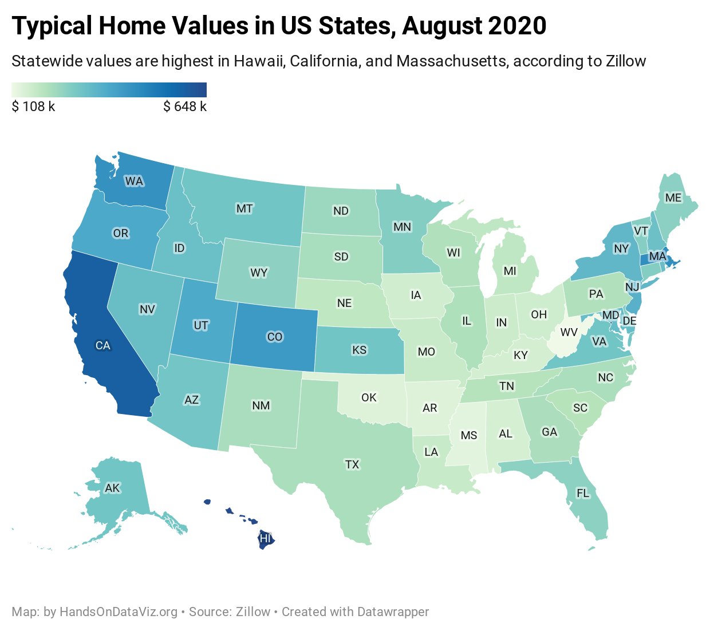
```

Datawrapper splits the process of creating a map into four steps: select map, add data, visualize, then publish and embed. To create your own choropleth map, follow this tutorial.

1. Open the [Home Value Index data in Google Sheets](https://docs.google.com/spreadsheets/d/1Rdaf_buH629NmO1BL_x7PMrD0wpuAeAaw0PMIkYqu1U/edit#gid=283507276), which we downloaded from the [Zillow research site](https://www.zillow.com/research/data/). Read the notes to understand its origin and definitions.

Good maps often require [cleaning up messy data as described in Chapter 5](clean.html). In our spreadsheet we removed all of the columns except two, August 2019 and August 2020, and we also inserted a *Percent Change* column, which we calculated this way: `(2020 - 2019) / 2019 * 100`. Also, we're fortunate that Datawrapper easily recognizes US state names and abbreviations.

2. In the Google Sheet, go to *File > Download* and select the Comma-Separated Values (CSV) format to save the data to your local computer.

3. Open [Datawrapper](https://datawrapper.de), click on *Start Creating*, then click the *New Map* button, and select *Choropleth map* as shown in Figure \@ref(fig:datawrapper-map-choose). No login is required to create a map, but you should sign up for a free account in order to save your work and publish your map online.

(ref:datawrapper-map-choose) In Datawrapper, click *New Map*, and choose *Choropleth*.

```{r datawrapper-map-choose, out.width=500, fig.cap="(ref:datawrapper-map-choose)"}
knitr::include_graphics("images/08-map/datawrapper-map-choose-annotated.png")
```

4. In the *Select your map* screen, choose your geographic boundaries. In this case, search and select *USA > States and Territories* in order to include data for Washington DC, which is not a state, as shown in Figure \@ref(fig:datawrapper-map-us-states-territories), then click *Proceed*.

(ref:datawrapper-map-us-states-territories) Choose *USA - States and Territories* for your map outline.

```{r datawrapper-map-us-states-territories, out.width=500, fig.cap="(ref:datawrapper-map-us-states-territories)"}
knitr::include_graphics("images/08-map/datawrapper-map-us-states-territories.png")
```

Tip: If Datawrapper does not list your preferred map outline, you can upload your own custom geography data in GeoJSON or TopoJSON format, which you will learn more about in the [GeoJSON data section of Chapter 14](geojson.html).

5. In the *Add your data* screen, you can manually enter data for each area, which would be fine for just a few, but not for 50 states. Instead, scroll down below the *add data* table and click the *Import your dataset* button, as shown in Figure \@ref(fig:datawrapper-import-dataset).

(ref:datawrapper-import-dataset) Scroll down below the *add data* table to import your dataset.

```{r datawrapper-import-dataset, out.width=200, fig.cap="(ref:datawrapper-import-dataset)"}
knitr::include_graphics("images/08-map/datawrapper-import-dataset.png")
```

Datawrapper will explain that when uploading data to the *USA > States and Territories map*, your data must include one of these columns:

- Names, such as `California`.
- FIPS-Codes, the Federal Information Processing Series numeric codes for US states and smaller geographies, where California is `06`.
- ANSI-Codes, the American National Standards Institute alphabetical or numeric codes for US states and smaller geographies, where California is `CA`. Learn more from the [US Census Bureau about ANSI and FIPS codes](https://www.census.gov/library/reference/code-lists/ansi.html).

Codes vary by the type of map. For example, a world map may accept country names (which vary in spelling) or [ISO three-letter codes](https://en.wikipedia.org/wiki/List_of_ISO_3166_country_codes). To view all of the codes for your selected geography, go back one screen in Datawrapper and select the Geo-code drop-down menu, as shown in Figure \@ref(fig:datawrapper-import-codes). If necessary, you could copy and paste names and their code equivalents into your spreadsheet to prepare your data. Learn more about [place name geocoding at the Datawrapper Academy](https://academy.datawrapper.de/article/193-symbol-location-accuracy-using-addresses-place-names).

(ref:datawrapper-import-codes) To view all codes for your selected map, go back one screen to the *Geo-Code* drop-down menu.

```{r datawrapper-import-codes, out.width=250, fig.cap="(ref:datawrapper-import-codes)"}
knitr::include_graphics("images/08-map/datawrapper-import-codes.png")
```

6. Since our data includes columns for both Names and ANSI-Codes, go ahead and click *Start Import*.

7. On the *Import your dataset* screen, rather than paste your data, we recommend that you click to *upload a CSV file* and select the file you downloaded in step 2.

8. In the *Match your columns* screen, click the column that matches up with ANSI codes, as shown in Figure \@ref(fig:datawrapper-map-match). You may need to scroll down a bit to click the *Next* button, then *Continue*.

(ref:datawrapper-map-match) Select the data column that contains matching ANSI codes.

```{r datawrapper-map-match, out.width=500, fig.cap="(ref:datawrapper-map-match)"}
knitr::include_graphics("images/08-map/datawrapper-map-match.png")
```

9. Proceed to the next screen, select the column of data values that you initially wish to map, and click *Matched as values*, as shown in Figure \@ref(fig:datawrapper-map-match-values). For this tutorial, select *Aug2020 Home Values*, then scroll down to click *Next*, then *Go*, then *Proceed*. You'll be able to map other data values in a later step.

(ref:datawrapper-map-match-values) Select the data column that contains the values that you wish to map.

```{r datawrapper-map-match-values, out.width=500, fig.cap="(ref:datawrapper-map-match-values)"}
knitr::include_graphics("images/08-map/datawrapper-map-match-values.png")
```

10. In the *Visualize* screen, under the *Refine* tab, click the *wrench symbol* next to the color palette to review the *default* map settings, as shown in Figure \@ref(fig:datawrapper-map-default). Do not blindly accept the default map, but it's a good place to start and explore how factors shape its appearance.

(ref:datawrapper-map-default) Under the *Refine* tab, click the *wrench symbol* to see the default map settings.

```{r datawrapper-map-default, out.width=600, fig.cap="(ref:datawrapper-map-default)"}
knitr::include_graphics("images/08-map/datawrapper-map-default.png")
```

Let's review key concepts we first introduced in the [Design Choropleth Colors & Intervals section](design-choropleth.html) of this chapter. The default map shows a *continuous* green-to-blue color palette, with *linear* interpolation, which means the home values are distributed in a straight line up the scale. These colors and intervals work better for a data story that emphasizes the low and high extremes.

11. In the *Refine* tab, experiment with different types of interpolation to change how values are assigned to colors. For example, change from *linear* to *quartiles*, which groups the data into four groups of equal size, as shown in Figure \@ref(fig:datawrapper-map-quartiles). This map works better for a data story that emphasizes geographic diversity, since we see more contrast between states in the middle range.

(ref:datawrapper-map-quartiles) Under the *Refine* tab, change the interpolation from *linear* to *quartiles* and see how the map changes.

```{r datawrapper-map-quartiles, out.width=400, fig.cap="(ref:datawrapper-map-quartiles)"}
knitr::include_graphics("images/08-map/datawrapper-map-quartiles.png")
```

12. Experiment with other colors, intervals, and data columns. Change the palette from *sequential* to *diverging* colors, which display a neutral color in the middle range and two dark colors at the extremes. Change from a *continuous* gradient to *steps*, and choose different numbers of dividers. Change the data column to *Pct Change 2019-20* to [normalize the choropleth map data](normalize-choropleth.html) as discussed earlier in this chapter, since home values are so different across the country. For example, see the map of percent change in home value from 2019 to 2020, with a diverging red-to-blue palette, 5 steps, and rounded values in Figure \@ref(fig:datawrapper-map-percentchange).

(ref:datawrapper-map-percentchange) Experiment with other colors, intervals, and data columns to find true and meaningful stories.

```{r datawrapper-map-percentchange, out.width=650, fig.cap="(ref:datawrapper-map-percentchange)"}
knitr::include_graphics("images/08-map/datawrapper-map-percentchange.png")
```

Which data columns, colors, and intervals make the best map? There's no easy answer, since there's more than one way to make a true and meaningful map. But keep two principles in mind. First, make sure that you honestly show the data, rather than hide or disguise it. Second, reflect on what kind of data story you believe is important to tell, since design choices emphasize different interpretations of the data. Review our guidance in the [Design Choropleth Colors & Intervals section](design-choropleth.html).

Let's move on to finalize the labels and styling of the map before we publish and share it with others.

13. Under the *Refine* tab, customize the legend format. For example, to convert long numbers (such as 107762) into abbreviated dollars ($ 108 k), we selected *custom format* and inserted the code `($ 0 a)`, as shown in Figure \@ref(fig:datawrapper-map-legend-custom). Learn more about Datawrapper custom formats in their link to the [numeral.js documentation](http://numeraljs.com/#format).

(ref:datawrapper-map-legend-custom) Change how numbers appear in the legend by entering a custom format.

```{r datawrapper-map-legend-custom, out.width=350, fig.cap="(ref:datawrapper-map-legend-custom)"}
knitr::include_graphics("images/08-map/datawrapper-map-legend-custom.png")
```

14. Under the *Annotate* tab, add a title, description, and source credits, to add credibility to your work. You can also add map labels and customize tooltips that will display when readers hover their cursor over different states. The easiest way to edit tooltips is to click on blue column names, or format them using their drop-down menus, to make the proper codes appear in double curly brackets, as shown in Figure \@ref(fig:datawrapper-map-tooltip). Learn more about [customizing tooltips from Datawrapper Academy](https://academy.datawrapper.de/article/116-how-to-create-useful-tooltips-for-your-maps).

(ref:datawrapper-map-tooltip) To edit tooltips, click the blue column names or use drop-down menus to format the codes.

```{r datawrapper-map-tooltip, out.width=600, fig.cap="(ref:datawrapper-map-tooltip)"}
knitr::include_graphics("images/08-map/datawrapper-map-tooltip.png")
```

15. Finally, click *Proceed* or advance to the *Publish & Embed* screen to share your work with others. Follow the prompts, or the more detailed Datawrapper tutorial above, to obtain an embed code to your interactive map, and learn more about your next steps in [Chapter 10: Embed on the Web](embed.html).

Tip: Learn more about [choropleth map design in this excellent series of posts by the Datawrapper Academy](https://academy.datawrapper.de/category/93-maps).

Now that you've learned how to create a choropleth map using one tool, Datawrapper, let's compare the process using a different tool, Tableau Public.

## Choropleth Map with Tableau Public {- #map-tableau}

We first introduced you to the free Tableau Public desktop application (for Mac or Windows) when building [scattercharts](scatter-tableau.html) and [filtered line charts](filtered-line-tableau.html) in Chapter 7. Now let's use the same tool to create an interactive choropleth map, and compare the process with the Datawrapper tool we learned in the prior section. We're showing you how to create the same type of map with both tools, in order to show you the difference. On one hand, Datawrapper gives you more control over interpolating data and shaping the appearance of color intervals in your choropleth map. On the other hand, some people prefer Tableau Public because they're already familiar with its interface.

Tableau Public can create many different types of map for geographical place names or ISO codes it already recognizes, such as nations, states, counties, and airports. But Tableau Public cannot geocode street addresses by itself, so you'll need to obtain their latitude and longitude with another tool, such as those described in the [geocode section of Chapter 3](geocode.html). Furthermore, if you want to upload customized map boundaries, learn how to [Create Tableau Maps from Spatial Files](https://help.tableau.com/current/pro/desktop/en-us/maps_shapefiles.htm)
on the support page.

In this section, we will create a choropleth map of healthcare spending per country as a percentage of their gross domestic product (GDP), as shown in Figure \@ref(fig:tableau-polygon-final). Remember that choropleth maps work best when we [normalize the data](normalize-choropleth.html) to show relative, rather than absolute, numbers. Creating a map of total health spending per country would not be very meaningful, as larger nations tend to have larger economies, so we'll base our map on the percentage of their economy that is spent on healthcare.

Before we start, you should obtain and install the [free Tableau Public desktop application](https://public.tableau.com/en-us/s/download) if you don't have it yet. It is available for Mac or Windows. You will need to enter an email address to download the application.

(ref:tableau-polygon-final) Choropleth map of healthcare spending with Tableau Public. Explore the [interactive version](https://public.tableau.com/profile/ilya7257#!/vizhome/2017HealthcareSpendingbyCountryasofGDP/Dashboard1). Data from the World Bank.

```{r tableau-polygon-final, fig.cap="(ref:tableau-polygon-final)"}
if(knitr::is_html_output(excludes="markdown")) knitr::include_url("https://public.tableau.com/views/2017HealthcareSpendingbyCountryasofGDP/Dashboard1?:showVizHome=no&:embed=true", height="500px") else 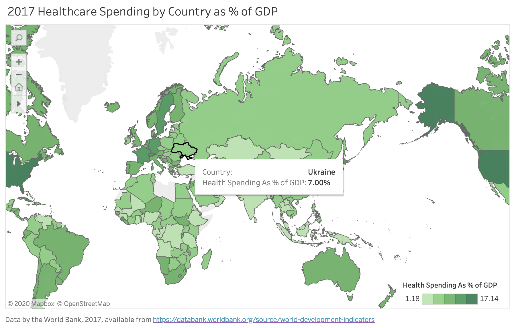
```

Let's look at the steps involved to create a choropleth from Figure \@ref(fig:tableau-polygon-final) in detail.

1. Open the [Healthcare Spending by Nation as Percent of GDP data in Google Sheets](https://docs.google.com/spreadsheets/d/1tr9VrqKnO5tf55_YUCk441bFsZSI4zgMzW5ow3-wioo/edit#gid=490588019), which we downloaded from the [World Bank](https://databank.worldbank.org/source/world-development-indicators). Examine the data and the notes.

Good maps often require [cleaning up messy data as described in Chapter 5](clean.html). In our spreadsheet we removed rows for nations that did not report any data. Tableau Public recognizes many different types of geographic names (such as cities and nations), so we will rely on the tool to deal with any spelling issues and properly place all of them on the map.

2. In the Google Sheet, go to *File > Download* and select Comma-Separated Values (CSV) format to save the data to your local computer.

3. Launch Tableau Public. When you first open it, you will see the *Connect* menu on the left-hand side that displays file formats you can upload. Choose the *Text file* format and upload the healthcare spending CSV data file you've just downloaded in the previous step.

Note: Tableau lets you access data directly from Google Sheets that live in your Drive using *Connect > To a Server* option. So instead of downloading a CSV file in step 2, you could have made a copy of the sheet, and connected to it directly.

4. In the *Data Source* screen, inspect the dataset, which contains three columns: Country Name, Country Code, and Health Spending As % of GDP. Notice that a small globe appears at the top of the Country Name and Country Code columns, which shows that Tableau Public successfully recognized these as geographic data, rather than string or text data. Sometimes Tableau does not recognize location data automatically, so you need to manually change the data type. To do so, click the data type icon (e.g. globe or a green `#` for numeric values), and then choose *Geographic Role > Country/Region* as shown in Figure \@ref(fig:tableau-data-geographic).

(ref:tableau-data-geographic) Make sure Tableau Public knows that the Country Name column contains geographic data.

```{r tableau-data-geographic, out.width=400, fig.cap="(ref:tableau-data-geographic)"}
knitr::include_graphics("images/08-map/tableau-data-geographic.png")
```

5. In the bottom-left corner, click the orange *Sheet 1* button to create a worksheet with your first visualization, as shown in Figure \@ref(fig:tableau-go-to-worksheet).

(ref:tableau-go-to-worksheet) Click the orange button to go sheet 1 where you can create your map.

```{r tableau-go-to-worksheet, out.width=400, fig.cap="(ref:tableau-go-to-worksheet)"}
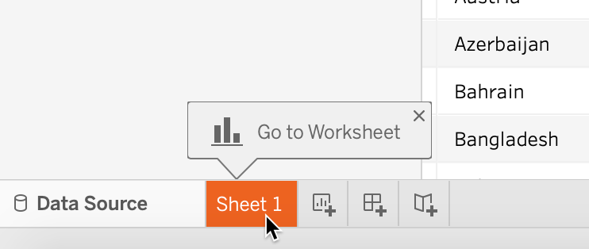
```

6. In *Sheet 1*, create your choropleth map using a two-step process, as shown in Figure \@ref(fig:tableau-drag). First, drag-and-drop the *Country Name* field into the middle of the worksheet (alternatively to the Detail box of the Marks card) to create the map. The default view is the symbol map, which we need to replace with a polygon map. To add colored polygons, drag-and-drop the *Health Spending As % of GDP* field into the *Color* box of the *Marks* card to transform it into a choropleth map.

(ref:tableau-drag) Drag and drop *Country Name* to the center of the sheet, then *Health Spending As % of GDP* to the *Color* box in the *Marks* card.

```{r tableau-drag, fig.cap="(ref:tableau-drag)"}
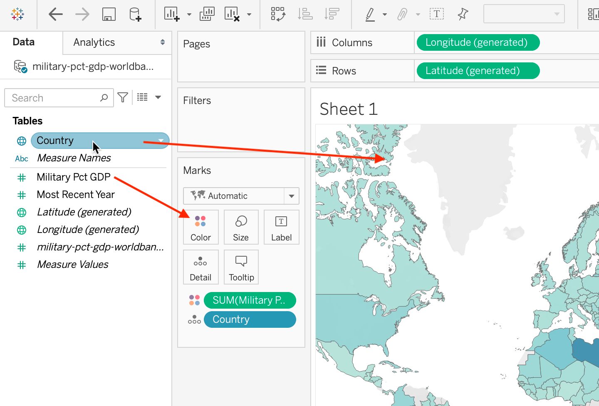
```

7. Tableau Public may hide the map legend behind the *Show Me* menu in the upper-right corner, so click the menu to shrink it and display your legend.

8. You can change the color palette by clicking the Color box of the Marks card, and
then *Edit colors*. Change the palette to *Green*, and change it from continuous to steps,
as shown in Figure \@ref(fig:tableau-polygon-color).

(ref:tableau-polygon-color) Change the color scheme to Green with 5 steps.

```{r tableau-polygon-color, out.width=400, fig.cap="(ref:tableau-polygon-color)"}
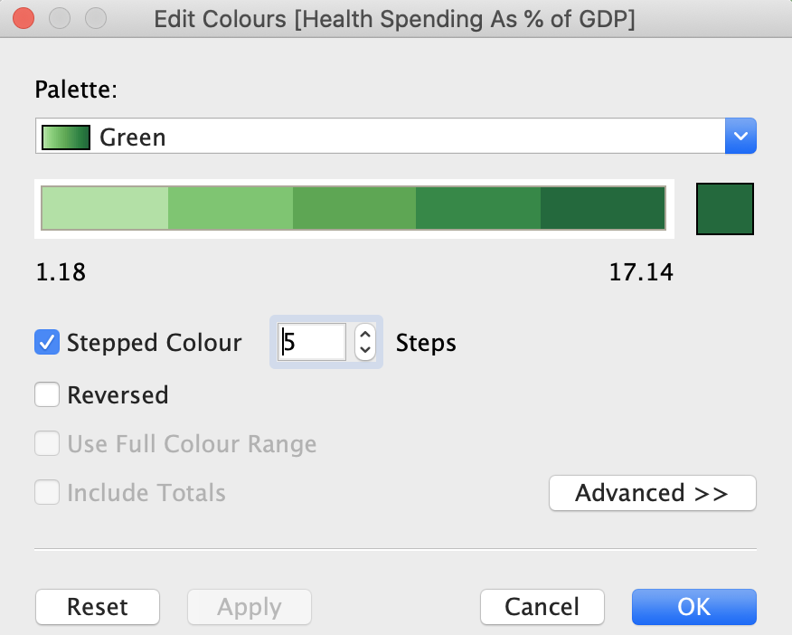
```

9. When you hover over countries, you will notice a tooltip that tells you the name of the country and gives you the percent value. It is generally well-formatted as our initial data table had proper column headers. But we can make the toolitp even better. Click the Tooltip box of the Marks card, change the first instance of `Country Name` to just `Country` (do not change the grayed-out text inside `<` and `>` as these are variable names), and add a `%` sign at the end of the second row, as shown in Figure \@ref(fig:tableau-polygon-tooltip).

(ref:tableau-polygon-tooltip) Change tooltip text to make it more user-friendly.

```{r tableau-polygon-tooltip, out.width=400, fig.cap="(ref:tableau-polygon-tooltip)"}
knitr::include_graphics("images/08-map/tableau-polygon-tooltip.png")
```

10. Let's make our map title more meaningful. Double-click the default *Sheet 1* name just above the map
to bring up the *Edit Title* window, and change the name of your chart to
*2017 Healthcare Spending by Country as % of GDP*.

11. At this point the data is loaded and should be displayed correctly, so we are going to create the final layout that include map's title and credits, the legend, and is appropriate for sharing. At the bottom-left of the program, create a *New Dashboard*, as shown in Figure \@ref(fig:tableau-dashboard-create). Dashboards in Tableau are layouts that can contain visualizations from multiple sheets, as well as text boxes, images, and other elements, creating rich exploratory interfaces. In this tutorial, we will stick to just a single sheet that contains our choropleth map.

(ref:tableau-dashboard-create) Before you publish the map, create a new dashboard to finalize your layout.

```{r tableau-dashboard-create, out.width=400, fig.cap="(ref:tableau-dashboard-create)"}
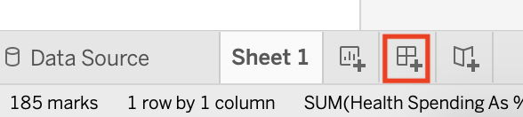
```

12. In your Dashboard 1 tab, change the size of the dashboard to Automatic so that the map is responsive and occupies 100% of the width on all devices. Drag and drop Sheet 1 to the *Drop sheets here* area, as shown in Figure \@ref(fig:tableau-dashboard). This will copy the map, the title, and the legend from Sheet 1.

(ref:tableau-dashboard) To create a responsive dashboard, change the Size to Automatic.

```{r tableau-dashboard, out.width=400, fig.cap="(ref:tableau-dashboard)"}
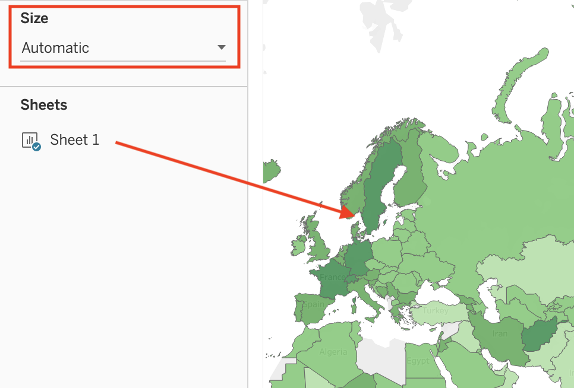
```

13. Right-click the upper part of the map legend, and select *Floating*, as shown in Figure \@ref(fig:tableau-dashboard-legend). Now you are able to place your legend directly on top of the map to save space. Drag and drop it to one of the map's corners.

(ref:tableau-dashboard-legend) To place the legend on top of the map, make sure it is floating.

```{r tableau-dashboard-legend, out.width=400, fig.cap="(ref:tableau-dashboard-legend)"}
knitr::include_graphics("images/08-map/tableau-dashboard-legend.png")
```

14. Finally, let's add a text block with data source underneath the map. From the Objects menu in the left-hand side, drag and drop *Text* to the lower half of the map. In the *Edit Text* window that appears, type *Data by the World Bank, 2017*, and click OK. Initially the text area will occupy half the height of the screen, so resize it like you would resize any window on your computer.

And we're done! Make sure you position your map's center and zoom level as you want it to be visible by others. In this case, the best would be to have a world view as we are showing data for most countries, although you may want to zoom in to a specific continent. Once you are ready to publish and share the map, go to *File > Save to Tableau Public*. In the pop-up window, log in to your account if requested. Give it a title, such as Healthcare Spending, and click Save. See how to [embed the map as an iframe in Chapter 10](embed-code.html).

Warning: Tableau may not be the best tool to create choropleth maps where you want to have full control of color breaks. By default, Tableau uses a linear color scheme that, as we've learned earlier in the chapter, is prone to highlighting outliers, and there is no straightforward way to change the intervals to non-linear methods such as quantiles. If you are not happy with the way the linear scale represents your data, you can [filter your data to remove outliers from the map](https://help.tableau.com/current/pro/desktop/en-us/filtering.htm), or see [Andy Kriebel's VizWiz tutorial to use table calculations to group items into quantiles](https://www.vizwiz.com/2018/07/rankpercentile.html), or create your [choropleth map in Datawrapper](choropleth-datawrapper.html), which gives you more control over color intervals and interpolation.

In all of the prior tutorials, you created interactive maps using *static data*, meaning it came from a spreadsheet. In the next tutorial, you'll learn how to build a map using *continuously-updated data* from a Socrata open data repository, which will always display the most current information.

## Current Map with Socrata Open Data {- #map-socrata}

This type of map shows current data because it continuously pulls the most up-to-date from an [open data repository, which you learned about in chapter 4](opendata.html). The advantage of creating visualizations directly on an open data platform is that your chart or map is directly linked to the source. Some government agencies frequently update selected open data repositories where current information matters, such as fire or police calls, property data, or public finances. Whenever an administrator revises the contents of an open data repository, your chart or map will automatically display the most current information. However, if the government agency stops updating the repository or switches to a different platform, your visualization will no longer show current information or it may break entirely.

[Socrata](https://www.tylertech.com/products/socrata) is a company that provides an open data repository service that many government agencies use to make open data available to the public. It offers user-friendly ways to view, filter, and export data. In addition, the Socrata platform includes built-in support to create interactive charts and maps, which can be embedded in other websites (including your own). You can search for publicly-available datasets on Socrata's [Open Data Network](https://www.opendatanetwork.com/).

In this section, we will build an interactive point map of fatal crashes involving cars in New York City, which continuously updates to display points over the past 365 days, as shown in Figure \@ref(fig:socrata-final). Our interactive map pulls data from the [Motor Vehicle Collisions - Crashes](https://data.cityofnewyork.us/Public-Safety/Motor-Vehicle-Collisions-Crashes/h9gi-nx95/data) public repository on New York City's OpenData Portal, based on the Socrata platform. As long as government administrators continue to update this dataset on this platform, your map should always display the most recent data for the past 12 months.

(ref:socrata-final) Map of fatal crashes in NYC during the past year, continuously updated from a Socrata open data repository. See [interactive version](https://data.cityofnewyork.us/dataset/Fatal-NYC-Crashes/nx4u-jy9t/embed?width=100%25&height=500).

```{r socrata-final, fig.cap="(ref:socrata-final)"}
if(knitr::is_html_output(excludes="markdown")) knitr::include_url("https://data.cityofnewyork.us/dataset/Fatal-NYC-Crashes/nx4u-jy9t/embed?width=100%25&height=500", height="500px") else knitr::include_graphics("images/08-map/socrata-final.png")
```

To build your own continuously-updated point map with this Socrata open data repository, follow this tutorial. Anyone can create a map using public data hosted by Socrata, but you need to be a registered Socrata user in order to save and share your map. Only datasets that have a special location column can be mapped, which is different from traditional location columns (such as Address or City) that you see in the dataset. Consider reaching out to dataset administrators if datasets you wish to map are missing geocoded locations.

1. Register for your account on the [NYC OpenData](https://opendata.cityofnewyork.us/) by clicking the *Sign In* button in the upper-right corner. Where it says "Don't have an account yet? Sign Up", proceed to sign up. Follow the instructions, including confirming that you are not a robot, and accepting the License Agreement to create your free account. This account, including your username and password, are valid for NYC OpenData portal, but *not* other websites that use Socrata.

2. Navigate to the [Motor Vehicle Collisions - Crashes](https://data.cityofnewyork.us/Public-Safety/Motor-Vehicle-Collisions-Crashes/h9gi-nx95/data) dataset. In the menu on the right-hand side choose *Visualize > Launch New Visualization*, as shown in Figure \@ref(fig:socrata-launch-new-viz). This will open a *Configure Visualization* studio where you can create the map.

(ref:socrata-launch-new-viz) Go to Visualize > Launch New Visualization.

```{r socrata-launch-new-viz, out.width=300, fig.cap="(ref:socrata-launch-new-viz)"}
knitr::include_graphics("images/08-map/socrata-launch-new-viz-annotated.png")
```

3. In the top menu, select *Map* (the globe icon between a scatter chart icon and a calendar) as the visualization type. In a few seconds a basemap will appear, with *Map Layers* and *Map Settings* items in the side menu on the left, as shown in Figure \@ref(fig:socrata-configure).

(ref:socrata-configure) Your studio should look similar to this once you choose Map as the visualization type.

```{r socrata-configure, out.width=500, fig.cap="(ref:socrata-configure)"}
knitr::include_graphics("images/08-map/socrata-configure-annotated.png")
```

Socrata was able to determine which column contains geospatial value, and automatically set the *Geo Column* value to *LOCATION* (see *Layer List > Data Selection*). By default, points are clustered together. That's why instead of individual crashes you see bubbles with numbers, which represent how many points are clustered in that bubble. Clusters will change when you zoom in and out.

4. We need to limit our map to display only crashes with fatalities. In the upper-right corner, click *Filters > Add filter*. The dropdown menu lists all columns (or fields) of the dataset, where you should choose *NUMBER OF PERSONS KILLED*. In the newly appeared dropdown, choose *Is greater than*, and set the value to 0, as shown in Figure \@ref(fig:socrata-filter). Alternatively you can set it to *Is greater than or equal to*, and set the value to 1.

5. We need to clean up the data. Zoom out and you'll notice that not all crashes were geocoded properly. Several appear on the imaginary Null Island in the Atlantic Ocean, where the latitude and longitude are both 0. You learned how to recognize and deal with [bad data in chapter 4](bad-data.html). To remove many of these incorrectly geocoded crashes, let's add another filter on *LATITUDE* column and set it to *Is greater than* with the value of 0. This way we show crashes located in the northern hemisphere, north of the Null Island, where New York City is located. After you correctly set both filters , the map will fly over and focus on New York City. If you wish, you can continue to clean up the data by adding more filters.

6. Instead of showing all recorded crashes since 2012, let's display crashes that happened over the past year, to be updated continuously. Add a third filter for *CRASH DATE* column, and set it to *Relative Date > Custom > Last 365 day(s)*. You will see a lot of points disappearing from the map as they don't fall in the selected dates range. You can now close *Filters* window to free up screen space.

(ref:socrata-filter) Add filters for number of persons killed (>0), location (latitude > 0), and date (last 365 days).

```{r socrata-filter, out.width=300, fig.cap="(ref:socrata-filter)"}
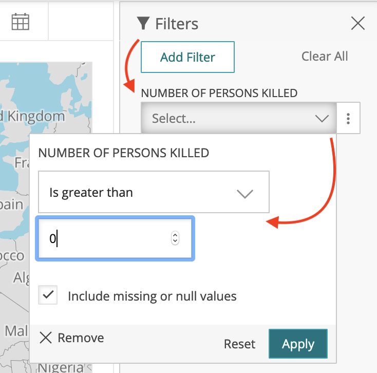
```

7. Let's ensure that crash locations appear as individual points and are never clustered together. Go to *Map Settings > Clusters*, and bring the *Stop Clustering at Zoom Level* slider to 1, as shown in Figure \@ref(fig:socrata-uncluster). You should now see individual crash locations at all zoom levels.

(ref:socrata-uncluster) To always show individual points instead of clusters, set *Stop Clustering at Zoom Level* to 1.

```{r socrata-uncluster, out.width=300, fig.cap="(ref:socrata-uncluster)"}
knitr::include_graphics("images/08-map/socrata-uncluster-annotated.png")
```

8. In the same accordion menu, change *Basemap > Type* from default *Basic* to *Dark* to give points maximum visibility, and to give the map a more fashionable look. In *General*, set Title to *Fatal Crashes in New York City, Last 365 Days*, and hide data table below the map by unchecking the *Show data table below visualization* box. Under *Map Controls*, uncheck *Show Locate Button* as it is only relevant for those accessing the map from NYC. Under *Legend Options*, uncheck *Show Legend*. Feel free to experiment with other settings.

9. Finally, let's create meaningful tooltips for points. Return back to the *Map Layers* menu and choose our *Motor Vehicle Collisions - Crashes* point layer. To change what is shown in tooltips when you hover or click on points, navigate to *Flyout Details*, and set *Flyout Title* to *ON STREET NAME*, adding *CRASH DATE*, *CRASH DATE*, *NUMBER OF PERSONS INJURED*, and *NUMBER OF PERSONS KILLED* as additional flyout values, as shown in Figure \@ref(fig:socrata-flyout).

(ref:socrata-flyout) To edit tooltip information, use the *Flyout Details* menu item.

```{r socrata-flyout, out.width=250, fig.cap="(ref:socrata-flyout)"}
knitr::include_graphics("images/08-map/socrata-flyout.png")
```

There are more more ways to modify the map that we will not demonstrate in this tutorial. For example, you could use *Resize Points by Value* functionality in the *Data Selection* menu to transform your point map into a symbol map, where larger circles represent larger numeric values (such as more people injured in a crash). You can also visualize textual categorical data, such as that stored in *CONTRIBUTING FACTOR VEHICLE 1* column of the dataset (with values such as: passing too closely, driver inexperience, etc.), by applying *Style by Value* functionality to use different colors for different crash categories.

At this point you should have a functional interactive point map that continuously updates to show fatal crashes in New York City in the past 365 days, and it should continue to work as long as administrators continue to update the database on this platform. Before you can share the map with others, you need to save it as a draft, and publish.

10. In the lower-right corner, click *Save Draft* button. Give your map a name (which is different from map's title that users will see), and hit *Save*. The gray ribbon at the top will tell you it is still a draft. When you are ready to make it public, go ahead and hit *Publish...*.

Now you can embed the map on your website as an iframe. To do so, click the *Share* button in the upper-right side of your map (see Figure \@ref(fig:socrata-share)), and copy the generated code from *Embed Code* text area (Figure \@ref(fig:socrata-share-embed)). We will talk about embedding visualizations in detail in [Chapter 10: Embed on the Web](embed.html).

(ref:socrata-share) Click *Share* button to bring up *Share and Embed* window.

```{r socrata-share, out.width=400, fig.cap="(ref:socrata-share)"}
knitr::include_graphics("images/08-map/socrata-share-annotated.png")
```

(ref:socrata-share-embed) Copy iframe code to embed this map in another website.

```{r socrata-share-embed, out.width=400, fig.cap="(ref:socrata-share-embed)"}
knitr::include_graphics("images/08-map/socrata-share-embed.png")
```

There are limitations to creating your chart or map on an open data repository platform. First, if the agency stops using the platform, or changes the structure of the underlying data, your online map (or chart) may stop functioning. In fact, we had to rewrite this tutorial when it referred to a different Socrata platform that administrators stopped supporting. Second, you are limited to using datasets and geographic boundaries that exist on that platform. If these limitations concern you, a simple alternative is to export data from the open repository (which means that any "live" data would become "static"), and import it into your preferred data visualization tool, such as Datawrapper, Google Sheets, or Tableau. A second, more advanced alternative, is to learn to pull live data from Socrata using an API (Application Programming Interface), as described in the [Leaflet Maps with Open Data APIs tutorial in Chapter 13](leaflet-maps-open-data-apis.html).

### Summary {- #summary8}

In this chapter, we reviewed map design principles and explored recommended tools and tutorials for telling different types of data stories. When creating maps, think carefully about whether you are working with point or polygon data, the two most common options. If the latter, remember that well-designed choropleth maps required normalized data and careful thought about color intervals.

We only scratched the surface and showed simple examples to help you quickly create some sample maps. See more advanced designs using [Leaflet map code templates in Chapter 13](leaflet.html), and how to [find and transform geospatial data in Chapter 14](transform.html)
