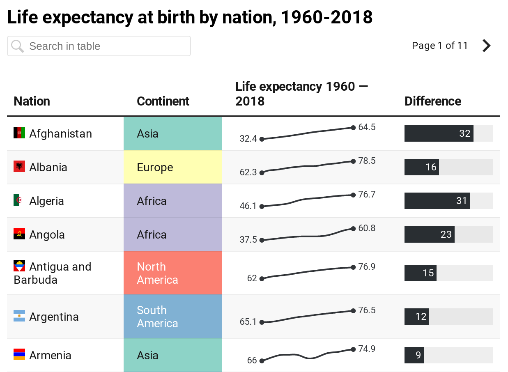
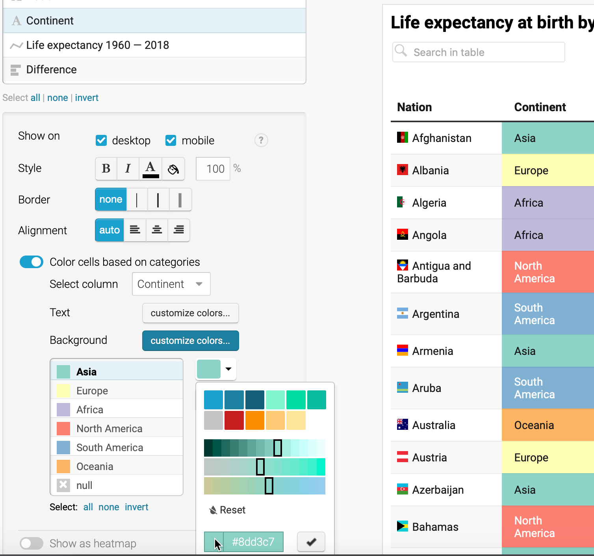
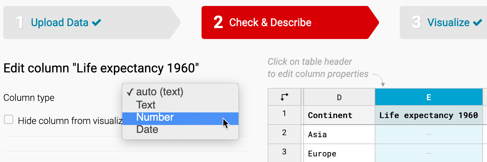

# Table Your Data {#table}

You might be surprised that a data visualization book which emphasizes charts and maps also includes a chapter on creating tables. We don't normally think about data tables as a type of visualization. But depending on your data and the story you wish to tell about it, sometimes a table is the most appropriate way to present information, especially when it's an interactive table on the web. Tables make sense when readers want to look up a specific row of data that's highly relevant to them, such as their local community or an organization they belong to, which can be too hard to identify inside a large chart or map. Also, tables work best when readers wish to precisely compare individual values to one another, but not necessarily to the rest of the dataset. Finally, tables work better than charts when there is no broad visual pattern to emphasize, and work better than maps when there is no particular spatial pattern. Before you start designing a chart or map, consider whether it makes more sense to create a table instead. Sometimes the best visualization is simply a good table.

In this chapter, you'll learn about table design principles and how to use [Datawrapper](http://datawrapper.de), a tool we introduced in [Chapter 7: Chart Your Data](chart.html) and [Chapter 8: Map Your Data](map.html) to create an interactive table with sparklines. Of course, if you need to quickly make a short table, then a static version usually makes sense, which you can create with a spreadsheet as described in the [other table-making tools section](other-table-tools.html) further below. But this chapter focuses on interactive tables because they have many advantages over static tables, especially when you need to publish large amounts of tabular content online, rather than only in print. First, interactive tables allow readers to search by keyword for specific details that interest them, which is vital when you present long tables with lots of rows. Second, readers can sort interactive tables in ascending or descending order for any column, which enables them to quickly scan those near the top or bottom of a long list. Finally, you'll also learn how to insert *sparklines*, or tiny charts that visually summarize data trends in each row, and automatically place them inside your interactive table. Sparklines blend the best qualities of tables and charts by making it easier for readers to visually scan for trends while skimming down columns of your data table. Later in [Chapter 10: Embed on the Web](embed.html), you'll learn how to integrate your interactive table into your website.

## Table Design Principles {- #table-design}

Let's begin with some principles of good table design, similar to how we learned about [chart design in Chapter 7](chart-design.html) and [map design in Chapter 8](map-design.html). Jonathan Schwabish, an economist who specializes in creating policy-relevant data visualizations, offers advice on creating tables that communicate clearly with multiple audiences.^[@schwabishThreadSummarizingTen2020; @schwabishTenGuidelinesBetter2020; @schwabishBetterDataVisualizations2021] Here's a summary of several of his key points, which also appear in Figure \@ref(fig:table-design).

1. Make column headers stand out above the data.

2. Use light shading to separate rows or columns.

3. Left-align text and right-align numbers for easier reading.

4. Avoid repetition by placing labels only in the first row.

5. Group and sort data to highlight meaningful patterns.

(ref:table-design) A sample table that illustrates selected design principles.

```{r table-design, out.width=600, fig.cap="(ref:table-design)"}
knitr::include_graphics("images/09-table/table-design.png")
```

In addition, Schwabish and others recommend using color to highlight key items or outliers in your data, a topic we'll discuss later in [Chapter 16: Tell and Show Your Data Story](story.html).

When creating cross-tabulations to illustrate data correlations and possible causal relationships, statistician Joel Best offers two more design recommendations.^[@bestMoreDamnedLies2004, pp. 31-35.]

6. Place the independent variable (the suspected cause) at the top in the column headers, and the dependent variable (the possible effect) on the side for each row.

7. Calculate percentages from raw numbers in a vertical direction going downward, so that each value of the independent variable (the suspected cause) totals 100 percent.

Let's apply these latter design principles by constructing two different tables that calculate percentages, the bad way versus the better way, with data from the Pfizer coronavirus vaccine trial study results that were reported in November 2020. In this blind trial, 43,661 volunteers were randomly divided into two groups, about 21,830 each. One group received the vaccine and the other group received a placebo, so these were the independent variables (the suspected causal factors). Researchers watched closely and observed these dependent variables (the possible effects): 162 people in the placebo group became infected with the virus, compared to 8 people in the vaccine group.^[@zimmerCompaniesSayTheir2020, @young-saverWhatDoes952020].

Table \@ref(tab:vaccine-bad) calculates the percentages of this trial in the *wrong* direction---horizontally---and confuses the reader about the relationship between cause and effect, especially in the last row.

Table: (\#tab:vaccine-bad) **Bad** Because It Calculates Percentages Horizontally

|  | Vaccine | Placebo | Total |
|-|-:|-:|-:|
| Infected | 4.7% (8) | 95.3% (162) | 100% (170) |
| Not infected | 50.2% (21,822) | 49.8% (21,668) | 100% (43,490) |

But Table \@ref(tab:vaccine-better) calculates percentages in the *correct* direction---vertically---which more clearly shows how the vaccine is correlated with lower infection rates. Researchers determined that this was a strong causal relationship, and received approval to distribute the vaccine.

Table: (\#tab:vaccine-better) **Better** Because It Calculates Percentages Vertically

|  | Vaccine | Placebo |
|-|-:|-:|
| Infected | 0.04% (8) | 0.74% (162) |
| Not infected | 99.96% (21,822) | 99.26% (21,668) |
| Total | 100% (21,830) | 100% (21,830) |

Overall, the core principles of table design reflect similar concepts we previously discussed in chart and map design. Organize your presentation of the data with the readers' eyes in mind, to focus their attention on the most important elements of your interpretation, to help them take away the key points. Do the visualization work for them, so that you don't have to rely on them to draw the same mental connections in their own minds. Remove any clutter or unnecessary repetition that stands in the way of these goals. Most importantly, tell true and meaningful stories about the data.

Now that you understand several key principles of table design, see how several are built directly into the Datawrapper tool featured in the next section.

## Datawrapper Table with Sparklines {- #table-datawrapper}

In this section, you'll learn how to create an interactive table with [Datawrapper](https://datawrapper.de), the free online drag-and-drop visualization tool we previously introduced [to create charts in Chapter 7](chart-design.html) and [maps in Chapter 8](map-design.html). You can start creating in Datawrapper right away in your browser, even without an account, but signing up for a free one will help you to keep your visualizations organized. Remember that you'll probably still need a spreadsheet tool, such as Google Sheets, to compile and clean up data for large tables, but Datawrapper is the best tool to create and publish the interactive table online.

You'll also learn how to create sparklines, or tiny line charts that quickly summarize data trends. This chart type was refined by Edward Tufte, a Yale professor and data visualization pioneer, who described sparklines as "datawords... intense, simple, word-sized graphics."^[@tufteBeautifulEvidence2006, pp. 46-63.] While Tufte envisioned sparklines on a static sheet of paper or PDF document, you'll create them inside an interactive table, as shown in Figure \@ref(fig:datawrapper-table). Readers can search by keyword, sort columns in ascending or descending order, and scroll through pages of sparklines to quickly identify data trends that would be difficult to spot in a traditional numbers-only table.

(ref:datawrapper-table) Table with sparklines. Explore the [interactive version](https://datawrapper.dwcdn.net/0HK4f/).

```{r datawrapper-table, fig.cap="(ref:datawrapper-table)"}
if(knitr::is_html_output(excludes="markdown")) knitr::include_url("https://datawrapper.dwcdn.net/0HK4f/", height = "1007px") else

```

In this tutorial, you'll create an interactive table with sparklines to visualize differences in life expectancy at birth from 1960 to 2018 for over 195 nations around the world. Overall, life expectancy gradually rises in most nations, but a few display "dips" that stand out in the tiny line charts. For example, Cambodia and Vietnam both experienced a significant decrease in life expectancy, which corresponds with the deadly wars and refugee crises in both nations from the late 1960s to the mid-1970s. Sparklines help us to visually detect patterns like these, which anyone can investigate further by downloading the raw data through the link at the bottom of the interactive table.

While it's possible to present the same data in a [filtered line chart as shown in Chapter 7](filtered-line-chart-tableau.html), it would be difficult for readers to spot differences when shown over 180 lines at the same time. Likewise, it's also possible to present this data in a [choropleth map as shown in Chapter 8](choropleth-datawrapper.html), though it would be hard for readers to identify data for nations with smaller geographies compared to larger ones. In this particular case, when we want readers to be able to search, sort, or scroll through sparklines for all nations, the best visualization is a good table.

To create your own interactive table with sparklines, follow this tutorial, which we adapted from  [Datawrapper training materials](https://www.datawrapper.de/training-materials/) and their [gallery of examples](https://www.datawrapper.de/tables/):

1. Open our [cleaned-up World Bank data on life expectancy at birth, 1960 to 2018 in Google Sheets](https://docs.google.com/spreadsheets/d/1Wev14VaXyq7d7yuYo-7FwRoAjyyaY1v6z_qBoo_4VSo/edit#gid=3466257).

To simplify this tutorial, we downloaded [life expectancy at birth from 1960 to 2018 by nation, in CSV format, from the World Bank](https://data.worldbank.org/indicator/SP.DYN.LE00.IN), one of the open data repositories we listed in [Chapter 4: Find and Question Your Data](find.html). In our spreadsheet, we cleaned up the data, such as removing nations with 5 or fewer years of data reported over a half-century, as described in the Notes tab in the Google Sheet. Using the [VLookup spreadsheet method from Chapter 3](vlookup.html), we merged in columns of [two-letter nation codes and continents from Datawrapper](https://github.com/datawrapper/datawrapper/wiki/Country-flag-icons). We also created two new columns: one named *Life Expectancy 1960* (intentionally blank for the sparkline to come) and *Difference* (which calculates the difference between the earliest and the most recent year of data available, in most cases from 1960 to 2018). See the Notes tab in the Google Sheet for more details.

2. Go to [Datawrapper](https://datawrapper.de), click on *Start Creating*, and select *New Table* in the top navigation. You are not required to sign in, but if you wish to save your work, we recommend that you create a free account.

3. In the first *Upload Data* tab, select *Import Google Spreadsheet*, paste in the web address of our cleaned-up Google Sheet, and click *Proceed.* Your Google Sheet must be *shared* so that others can view it.

4. Inspect the data in the *Check and Describe* tab. Make sure that the *First row as label* box is checked, then click *Proceed*.

5. In the *Visualize* screen, under *Customize Table*, check two additional boxes: *Make Searchable* (so that users can search for nations by keyword) and *Stripe Table* (to make lines more readable).

6. Let's use a special Datawrapper code to display tiny flags before each country's name. In the *Nation* column, each entry begins with a two-letter country code, surrounded by colons, followed by the country name, such as `:af: Afghanistan`. We created the *Nation* column according to the [Combine Data into One Column section of Chapter 5: Clean Up Messy Data](combine-data.html).

Note: To learn more about flag icons, read the [Datawrapper post on this topic](https://academy.datawrapper.de/article/144-how-to-insert-flag-icons-in-tables) and their [list of country codes and flags on GitHub](https://github.com/datawrapper/datawrapper/wiki/Country-flag-icons).

7. In the *Visualize* screen, under *Customize columns*, select the third line named *Nation*. Then scroll down and push the slider to *Replace country codes with flags*, as shown in Figure \@ref(fig:datawrapper-flag).

(ref:datawrapper-flag) Customize the *Nation* column and push slider to replace codes with flags.

```{r datawrapper-flag, fig.cap="(ref:datawrapper-flag)"}
knitr::include_graphics("images/09-table/datawrapper-flag.png")
```

8. Let's hide the first two columns, since they're no longer necessary to display. In the *Visualize* screen under *Customize columns*, select the *Name* column, then scroll down and un-check the boxes to *Show on desktop and mobile*. Repeat this step for the *Code* column. A "not visible" symbol (an eye with a slash through it) appears next to each customized column to remind us that we've hidden it.

9. Now let's color-code the *Continent* column to make it easier for readers to sort by category it in the interactive table. In the *Visualize* screen under *Customize columns*, select the *Continent* column, then scroll down and push the slider to select *Color cells based on categories*. In the drop-down menu, select the column *Continent*, and click on the *Background: customize colors* button. Select each continent and assign them different colors, as shown in Figure \@ref(fig:datawrapper-colors).

(ref:datawrapper-colors) Customize the *Continent* column and push slider to color cells based on categories.

```{r datawrapper-colors, out.width=600, fig.cap="(ref:datawrapper-colors)"}

```

Tip: To choose colors for the six continents, we used the [ColorBrewer design tool as described in Chapter 8](design-choropleth.html), and selected a 6-class qualitative scheme. Although this tool is designed primarily for choropleth maps, you can also use it to choose table and chart colors.

10. Now let's prepare our data to add sparklines, or tiny line charts, to visually represent change in the *Life expectancy 1960* column, which we intentionally left blank for this step. Before you begin, you must change this column from textual data (represented by the A symbol in the *Customize columns* window) to numerical data (represented by the # symbol). At the top of the screen, click on the *2. Check and Describe* arrow to go back a step. (Datawrapper will save your work.) Now click on the table header to edit the properties for *column E: Life Expectancy 1960*. On the left side, use the drop-down menu to change its properties from *auto (text)* to *Number*, as shown in Figure \@ref(fig:datawrapper-edit-column). Then click *Proceed* to return to the *Visualize* window.

(ref:datawrapper-edit-column) Go back to *Check & Describe* to change the properties of column E from textual to numerical data.

```{r datawrapper-edit-column, fig.cap="(ref:datawrapper-edit-column)"}

```

11. To create the sparklines, in the *Visualize* screen under *Customize columns*, select *all* of the columns from *Life expectancy 1960* down to *2018*. To select all at once, click on one column, then scroll down and shift-click on the next-to-last column. Then scroll down the page and click the *Show selected columns as tiny chart* button, as shown in Figure \@ref(fig:datawrapper-tiny-chart). These steps will create the sparklines in the column and automatically rename it to *Life expectancy 1960--2018*, as shown in Figure \@ref(fig:datawrapper-bar-chart).

Tip: By design, we initially named this column *Life expectancy 1960*, because when we selected several columns to create sparklines, the tool added *--2018* to the end of the new column name.

(ref:datawrapper-tiny-chart) Shift-click to select all columns from *Life expectancy 1960--2018* down to *2018*, then click on *Show selected columns as tiny chart*.

```{r datawrapper-tiny-chart, out.width=300, fig.cap="(ref:datawrapper-tiny-chart)"}
knitr::include_graphics("images/09-table/datawrapper-tiny-chart.png")
```

12. Let's add one more visual element: a bar chart to visually represent the *Difference* column in the table. In the *Visualize* screen under *Customize columns*, select *Difference*. Then scroll down and push the slider to select *Show as bar chart*, as shown in Figure \@ref(fig:datawrapper-bar-chart). Also, select a different bar color, such as black, to distinguish it from the continent colors.

(ref:datawrapper-bar-chart) Select the *Difference* column and *Show as bar chart*.

```{r datawrapper-bar-chart, fig.cap="(ref:datawrapper-bar-chart)"}
knitr::include_graphics("images/09-table/datawrapper-bar-chart.png")
```

13. In the *Visualize* screen, click the *Annotate* tab to add a title, data source, and byline.

14. Click on *Publish & Embed* to share the link to your [interactive table](https://datawrapper.dwcdn.net/0HK4f/2/), as previously shown in Figure \@ref(fig:datawrapper-table). If you logged into your free Datawrapper account, your work is automatically saved online in the *My Charts* menu in the top-right corner of the screen. Also, you can click the blue *Publish* button to generate the code to embed your interactive chart on your website, as you'll learn about in [Chapter 10: Embed on the Web](embed.html). In addition, you can *add your chart to River* if you wish to share your work more widely by allowing other Datawrapper users to adapt and reuse your chart. Furthermore, scroll all the way down and click the *Download PNG* button to export a static image of your chart. Additional exporting and publishing options require a paid Datawrapper account. Or, if you prefer not to create an account, you can enter your email to receive the embed code.

To learn more, we highly recommend the [Datawrapper Academy support pages](https://academy.datawrapper.de/), the extensive [gallery of examples](https://www.datawrapper.de/tables/), and well-designed [training materials](https://www.datawrapper.de/training-materials/).

## Other Table-Making Tools {- #other-table-tools}

While Datawrapper is a good choice for creating interactive tables with long content and sparklines, there are many other tools for making less complex tables to publish in print or online.

To quickly make a short static table, look to your preferred spreadsheet tool. For example, in Google Sheets you can lay out your table data and download it as a PDF document. Then use any image editor to convert the PDF to a PNG or JPG file and crop it to size, then insert the final version in a static document or a web page. Also, remember the [spreadsheet pivot table feature you learned in Chapter 3](pivot.html) to create a more sophisticated cross-tabulation, and export it as an image to insert in a document or website.

In Datawrapper, you can also create a simple static table as a *Chart* type, and publish it to download the PNG version.

In Google Sheets, you can can also publish any of your tables online, and [embed them on a web page as we'll discuss in Chapter 10](embed.html), so that whenever you update your Google Sheet, the current data will automatically appear on the web page.

In Tableau Public, a tool we previously introduced in [Chapter 7](chart-tableau.html) and [Chapter 8](map-tableau.html), you can also create a highlight table, which automatically colors the backgrounds of cells to draw your eye to higher versus lower values.

Finally, if you're designing tables primarily for web pages, consider using the online [Tables Generator tool](https://www.tablesgenerator.com/html_tables), which converts tabular content into HTML and other formats.

### Summary {- #summary9}

In this chapter, we reviewed principles about table design, and how to create an interactive table with sparklines using Datawrapper, as well as other tools. In the next chapter, you'll learn how to embed interactive charts, maps, and tables on your website so that readers can explore your data and engage with your stories.
