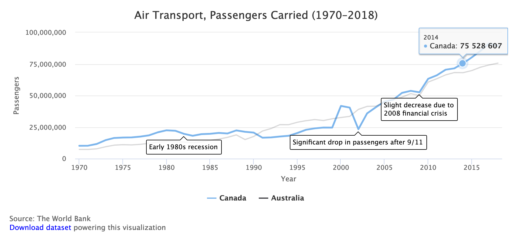

# Chart.js and Highcharts Templates {#chartcode}

We recommend that you start creating interactive charts with easy drag-and-drop tools we described in [Chapter 5: Chart Your Data](chart.html), such as [Google Sheets](chart-google.html), [Datawrapper](chart-tableau-public.html) and [Tableau Public](chart-tableau-public.html). But when you're ready to explore more powerful tools, this chapter features Chart.js and Highcharts code templates, which offer many benefits for more advanced users. By copying and modifying our templates, you can customize the appearance and interactivity of your visualizations, upload your data in CSV format, and freely publish it with your code on GitHub Pages or any server you choose, without relying on a drag-and-drop tool platform to continue its service into the future. But in order to work with our templates, you first need to learn how to [edit and host code with GitHub in chapter 9](github.html).

Most of the templates we feature are designed with [Chart.js](https://www.chartjs.org/), an open-source code library that is freely distributed under an MIT license, which anyone can use and modify. This means that the code library is extensible by other users, who have created [awesome Chart.js resources](https://github.com/chartjs/awesome), such as additional chart types and plugins that provide more features. Also, we include some templates designed with [Highcharts](https://highcharts.com) to expand the range of chart types and features not fully covered by Chart.js. Although Highcharts code is open-source, its licensing terms differ. [Highcharts is free for non-commerical use](https://www.highcharts.com/products/highcharts/#non-commercial), such as a personal, school, or non-profit organization website. But if you create charts for commercial or governmental use, you'll need to purchase a [Highcharts license](https://shop.highsoft.com/). In either case, we designed our Chart.js and Highcharts code templates to make them easier for beginners to understand. See the various types of charts and follow the links to the templates and tutorials in Table \@ref(tab:chart-templates).

Table: (\#tab:chart-templates) Chart Code Templates and Tutorials

| Chart | Best use and tutorials in this book |
| --- | --- |
| Bar or Column Chart<br>  | Best to compare categories side-by-side. If labels are long, use horizontal bars instead of vertical columns. <br>Power tool: [Bar or Column Chart with CSV data in Chart.js code template and tutorial](chartjs-bar-csv.html)  |
| Error Bar or Column Chart<br>  | Best to show margin of error bars when comparing categories side-by-side. If labels are long, use horizontal bars instead of vertical columns. <br>Power tool: [Error Bar or Column Chart with CSV data in Chart.js code template and tutorial](chartjs-error-bar-csv.html)  |
| Line Chart<br>  | Best to show continuous data, such as change over time.<br>Power tool: [Line Chart with CSV data in Chart.js code template and tutorial](chartjs-line-csv.html) |
| Annotated Line Chart<br>  | Best to add contextual notes inside chart of continuous data, such as change over time.<br>Power tool: [Annotated Line Chart with CSV data in Highcharts code template and tutorial](highcharts-annotated-line-csv.html) |
| Scatter Chart<br>  | Best to show the relationship between two datasets as XY coordinates to reveal possible correlations.<br>Power tool: [Scatter Chart with CSV data in Chart.js code template and tutorial](chartjs-scatter-csv.html) |
| Bubble Chart<br>  | Best to show the relationship between three or four sets of data, with XY coordinates, bubble size, and color. <br>Power tool: [Bubble Chart with CSV data in Chart.js code template and tutorial](chartjs-bubble-csv.html) |

<!-- TODO: update all chart images to show tooltips; decide if we're happy with names and labels -->

For additional chart types, see [Chart.js samples](https://www.chartjs.org/samples/latest/) and [Highcharts Demos](https://www.highcharts.com/demo).

These code templates vary from simple to complex, but all of them rely on four basic pillars:

  * HTML: language to structure content on the web (example: index.html)
  * CSS, or Cascading Style Sheet: to shape how content appears on the web (example: style.css)
  * JavaScript: code to create the chart and interactivity (example: script.js)
  * CSV: data that powers the visualization that is expressed in comma-separated format (example: data.csv)

Also, these templates refer to other code elements:

  * library: link to online instructions to complete routine tasks (example: Chart.js)
  * data: content to appear in chart, typically in CSV format (example: data.csv)


## Bar or Column Chart with Chart.js {- #chartjs-bar-csv}

<!-- TODO: Ilya, here's the general format I recommend for each template below, which I have matched up with the README file and the code comments, but only for the first demo: https://github.com/handsondataviz/chartjs-templates/tree/master/bar-chart. While I really like how you combined all of the chart.js templates into one repo, it adds a bit of complexity for GitHub web-interface users who wish to use the template to make one chart type, since it's a subfolder. Either we need to add extra steps between #1 and #2 below, or we need to split the unified repo into separate ones. What do you think? -->

Bar or column charts are best to compare categories side-by-side. If labels are long, use horizontal bars instead of vertical columns. Always start the x-axis (for a horizontal bar chart) or y-axis (for a vertical column chart) at zero. This interactive Chart.js code template pulls the data from a CSV file, as shown in Figure \@ref(fig:chartjs-demo-bar).

(ref:chartjs-demo-bar) Bar chart with Chart.js: explore the [interactive version](https://handsondataviz.github.io/chartjs-templates/bar-chart/index.html).

```{r chartjs-demo-bar, fig.cap="(ref:chartjs-demo-bar)"}
if(knitr::is_html_output()) knitr::include_url("https://handsondataviz.github.io/chartjs-templates/bar-chart/index.html", height="500px") else knitr::include_graphics("images/10-chartcode/chartjs-demo-bar.png")
```

To create your own bar or column chart with CSV data using our Chart.js template:

1. Go to [our GitHub repo for Chart.js templates](https://github.com/HandsOnDataViz/chartjs-templates), log into your GitHub account, and click *Use this template* to create a copy that you can edit, as described in [Chapter 9: Edit and Host Code with GitHub](github.html).

2. Prepare your data in CSV format and upload into a `data.csv` file. Place labels that will appear along the axis in the first column, and each data series in its own column. Your CSV must contain at least two columns (labels and one data series). You can add as many data series columns as you wish.

```
| district  | nonlearner | learner |
| Hartford  | 15656      | 4111    |
| New Haven | 17730      | 3534    |
```

3. In `script.js`, customize the values of variables shown in the code snippet below:

```javascript
  var HORIZONTAL = false;   // `false` for vertical column chart, `true` for horizontal bar chart
  var STACKED = false;  // `false` for individual bars, `true` for stacked bars

  var TITLE = 'English Learners by Select School Districts in Connecticut, 2018-19';

  var LABELS = 'district';  // Column to define 'bucket' names on x-axis (for vertical column chart) or y-axis (for horizontal bar chart)

  var SERIES = [  // For each column representing a data series, define its name and color
    {
      column: 'nonlearner',
      name: 'Non-Learners',
      color: 'grey'
    },
    {
      column: 'learner',
      name: 'Learners',
      color: 'blue'
    }
  ];

  var X_AXIS = 'School Districts';  // x-axis label and label in tooltip
  var Y_AXIS = 'Number of Enrolled Students'; // y-axis label and label in tooltip

  var SHOW_GRID = true; // `true` to show the grid, `false` to hide
  var SHOW_LEGEND = true; // `true` to show the legend, `false` to hide
```

For more customization, see [Chart.js documentation](https://www.chartjs.org/docs/latest/).

### Error Bar or Column Chart with Chart.js {- #chartjs-error-bar-csv}
If your data comes with uncertainty (margins of error), we recommend you
show it in your visualizations. The bar chart template shown in Figure \@ref(fig:chartjs-demo-bar-error-bars)
shows median and mean (average) income for different-sized geographies: the US state of Colorado, Boulder County, Boulder city, and a census tract in the city. Upload data to CSV file...

(ref:chartjs-demo-bar-error-bars) Interactive bar chart with error bars in Chart.js. See [detailed instructions on GitHub](https://github.com/handsondataviz/chartjs-templates/tree/master/bar-chart-with-error-bars).

```{r chartjs-demo-bar-error-bars, fig.cap="(ref:chartjs-demo-bar-error-bars)"}
if(knitr::is_html_output()) knitr::include_url("https://handsondataviz.github.io/chartjs-templates/bar-chart-with-error-bars/index.html", height="500px") else knitr::include_graphics("images/10-chartcode/chartjs-demo-bar-error-bars.png")
```

## Line Chart with Chart.js {- #chartjs-line-csv}
TODO: Match formatting above

Line charts are often used to show temporal data (trends).
The x-axis often represents time intervals.
Unlike column or bar charts, y-axes of line charts do not necessarily start at 0. Upload data to CSV file...

(ref:chartjs-demo-line) Interactive line chart with Chart.js. See [detailed instructions on GitHub](https://github.com/handsondataviz/chartjs-templates/tree/master/line-chart).

```{r chartjs-demo-line, fig.cap="(ref:chartjs-demo-line)"}
if(knitr::is_html_output()) knitr::include_url("https://handsondataviz.github.io/chartjs-templates/line-chart/index.html", height="500px") else knitr::include_graphics("images/10-chartcode/chartjs-demo-line.png")
```

## Annotated Line Chart with Highcharts {- #highcharts-annotated-line-csv}
TODO: Match formatting above

Annotated charts are best for displaying additional notes directly inside the chart to provide more context, such as key events in a line chart about change over time. TODO: add more detail here... Upload data to CSV file...

(ref:highcharts-demo-annotated-line) Interactive annotated chart with Highcharts. See [detailed instructions on GitHub](https://github.com/HandsOnDataViz/highcharts-line-annotated).

```{r highcharts-demo-annotated-line, fig.cap="(ref:highcharts-demo-annotated-line)"}
if(knitr::is_html_output()) knitr::include_url("https://handsondataviz.github.io/highcharts-line-annotated/index.html", height="500px") else 
```

## Scatter Chart with Chart.js {- #chartjs-scatter-csv}
TODO: Match formatting above

Scatter charts (also *scatterplots*) are used to display data of 2 or more dimensions.
The scatter chart below shows the relationship between household income and test performance
for school districts in Connecticut. Using x- and y-axes to show two dimensions, it is
easy to see that test performance improves as household income goes up. Upload data to CSV file...

(ref:chartjs-demo-scatter) Interactive scatter chart with Chart.js. See [detailed instructions on GitHub](https://github.com/handsondataviz/chartjs-templates/tree/master/scatter-chart).

```{r chartjs-demo-scatter, fig.cap="(ref:chartjs-demo-scatter)"}
if(knitr::is_html_output()) knitr::include_url("https://handsondataviz.github.io/chartjs-templates/scatter-chart/index.html", height="500px") else knitr::include_graphics("images/10-chartcode/chartjs-demo-scatter.png")
```

#### Going beyond two dimensions {-}
TODO: Match formatting above

To show more than two dimensions in scatter charts, one can:

* **color** each data point differently to show third dimension, eg use shades of red and green to show 5-year trend in test performance;
* **resize** each data point to display fourth dimension, eg number of students in each school district;
* use different **icons or glyphs** to display fifth dimension, eg circles for male students and squares for female students.

Remember not to overwhelm the viewer and communicate only the data that are necessary to prove or illustrate your idea.

## Bubble Chart with Chart.js {- #chartjs-bubble-csv}
TODO: Match formatting above

Bubble charts are similar to [scatter plots](chartjs-scatter-csv.html). The size of each dot (marker) is used to represent an additional dimension.

In the demo below, the bubble chart shows the relationship between median household income (x-axis) and test performance (y-axis) in 6 school districts in Connecticut. The size of data point (marker) corresponds to the number of students enrolled in the school district: bigger circles represent larger school districts. Upload data to CSV file...

(ref:chartjs-demo-bubble) Interactive bubble chart with Chart.js. See [detailed instructions on GitHub](https://github.com/handsondataviz/chartjs-templates/tree/master/bubble-chart).

```{r chartjs-demo-bubble, fig.cap="(ref:chartjs-demo-bubble)"}
if(knitr::is_html_output()) knitr::include_url("https://handsondataviz.github.io/chartjs-templates/bubble-chart/index.html", height="500px") else knitr::include_graphics("images/10-chartcode/chartjs-demo-bubble.png")
```

#### Tip: Use semi-transparent circles {-}
Data points may obstruct each other. To avoid this, play with color transparency. For example, `rgba(160, 0, 0, 0.5)` is a semi-transparent red in RGBA color model. The `a` stands for `alpha`, and is a number between 0 and 1, where 1 is solid, and 0 is completely transparent. Using transparency, you will be able to see data points that are hidden behind bigger neighbors.

#### Going beyond three dimensions {-}
To show more than three dimensions in bubble charts, one can:

* **color** each data point differently to show fourth dimension, eg use shades of red and green to show 5-year trend in test performance;
* use different **icons or glyphs** to display fifth dimension, eg circles for male students and squares for female students.

Remember not to overwhelm the viewer and communicate only the data that are necessary to prove or illustrate your idea.

### Summary {- #summary10}
TODO
