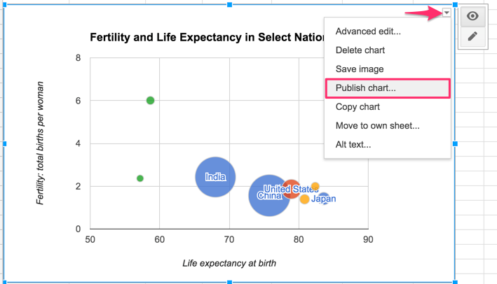

# Embed On the Web {#embed}
So far you've learned how to create [charts in chapter 7](chart.html) and [maps in chapter 8](map.html). Our book emphasizes the benefits of designing *interactive* visualizations that engage broad audiences on the internet by inviting them to interact with your data, investigate new patterns, download files if desired, and easily share your work on social media. In this chapter, you'll learn about a computer code tag called an *iframe*. Like a picture frame, an iframe displays one web page (such as your interactive data visualization) inside a second web page that you control (such as your personal or organizational web site), and makes the content appear seamlessly so that audiences can still interact with it. Several of the visualization tools you've learned so far, such as Google Sheets, Datawrapper, and Tableau Public, generate an *embed code* that contains an iframe to the online chart or map you've created on their platform. We will demonstrate how to [get the embed code](embed-code.html) from your visualization tool site, and [paste the code into a second website](paste-code.html) to seamlessly display your interactive content. No coding skills are required in this introductory book, but it certainly helps to be *code-curious*.

TODO: Discuss whether we should add an abstract diagram of an iframe inside a web page, like a picture frame on a wall, to visually reinforce this concept for new users here

## Static Image vs Interactive iframe {- #static}
First, let's clarify the difference between *static* versus *interactive* visualizations. A static picture of a chart or map is a frozen image. Many visualization tools allow you to download static images of your charts or maps in .JPG or .PNG or .PDF format. Static images are useful when that's all that you want to insert in a document, a presentation slide, or even a web page. Another option is to paste a static image, and add a link [or custom shortlink](share.html) with the web address to an interactive chart or map, and invite audiences to explore it online.

Also, you capture a static image of any web page on your computer by taking a [screenshot](https://en.wikipedia.org/wiki/Screenshot) with these built-in commands:

- Chromebook: Press key combination *Ctrl + Shift + F5* for rectangular select tool.
- Macintosh: Press key combination *Shift + Command + 4* then click-and-drag the cross-hair capture tool.
- Windows: Press key combination *Windows key + Shift + S* to call up the *Snip & Sketch* tool.

An animated GIF file is a series of static images that captures motion on the screen. You can insert an animated GIF on a web page to illustrate a short sequence of steps while using an interactive visualization, but audiences cannot interact with it, other than to play the animated loop over again. Paid software tools such as [Snagit](https://www.techsmith.com/screen-capture.html) allow you to create screenshots including drop-down menus and cursors, animated GIFs, and more.

By contrast, *interactive* visualizations allow audiences to directly engage with your data story through their web browsers. Visitors usually can float their cursor over a chart to view tooltips or underlying information, or zoom into a map and pan around, or search terms or sort columns in an interactive table. Interactive visualizations are usually hosted online, such as a chart or map tool platform, and are primarily designed to be viewed online, though in some cases it's possible for you to download and interact with them on your local computer.

Now let's turn to the central question: how can we make an interactive visualization, which resides on its online host (the primary site), appear seamlessly on a different website that we control (the secondary site)?. While it's possible to insert a link on our secondary site to the charts or maps on the primary site, that's inconvenient for our audiences because it requires them to click away from the web page they were reading. A better solution is to insert an embed code that usually contains an [iframe tag](https://www.w3schools.com/tags/tag_iframe.asp), written in Hypertext Markup Language (HTML), the code that displays content inside our web browsers. While you don't need any coding experience, you'll benefit in the long run by learning how to recognize the core features of an embed code and how it works.

In its simplest form, an iframe instructs the secondary site to display a web page address from the primary site, known as the source, as if it were a seamless picture frame on the wall of a room. In the iframe example below, the source (abbreviated as `src`) refers to the interactive chart about US income inequality that is hosted on the Datawrapper platform, and first appeared in the [Introduction to this book](introduction.html), as shown in Figure \@ref(fig:iframe-sample).

```
<iframe src='https://https://datawrapper.dwcdn.net/LtRbj/'></iframe>
```

(ref:iframe-sample) Depending on the format of your book, a static chart may appear above, but you can also [view the interactive version](https://datawrapper.dwcdn.net/LtRbj/).

```{r iframe-sample, fig.cap="(ref:iframe-sample)"}
if(knitr::is_html_output(excludes="markdown")) knitr::include_url("https://datawrapper.dwcdn.net/LtRbj/") else knitr::include_graphics("images/10-embed/iframe-sample.png")
```

Sometimes iframe tags include other attributes, such as the `width` or `height` (in pixels or a percentage) of its dimensions on the secondary site. You may also see other code abbreviations, such as `allowfullscreen`, which allows users to increase the view to full-screen mode, and other code references that you may not fully understand. That's okay, because all of these are optional add-ons to improve the appearance of the iframe in the secondary site. Only the `src` is required, so always look for it.

Now that you have a clearer definition of an interactive visualization and iframe tags, in the next section we'll learn how to copy the embed code from different visualization platforms.

TODO above: confirm the screenshot commands for non-Mac platforms and if they are the simplest versions, and if older Windows commands are still needed

## Get the Embed Code {- #embed-code}
In this section, you'll learn how to copy the embed code that is generated by various visualization platforms featured in this book, such as Datawrapper, Google Sheets, Tableau Public, and others [TODO add more]. These embed codes contain the iframe tag with instructions to display your interactive chart or map on a secondary site. We'll also demonstrate how to create an iframe for [code templates you host on your GitHub Pages site](github.html), a topic you'll learn about in Chapter 11. After you've copied your embed code, jump to the next section to learn how to paste it properly in different types of websites.


### from Datawrapper {-}
TODO: Make this first because it's easiest!

Add tip to change datawrapper iframe refs from specific (/#) to general (/)

Now jump to the [paste code to website section](paste-code.html) to see how to properly embed it into your preferred web platform.

### from Google Sheets {-}
TODO: Update these old instructions to publish chart and get interactive embed code

1) Create a Google Sheets chart, which requires a free Google Drive account. Learn more in the [Google Sheets Charts tutorial](chart-google.html) in this book.

2) Click the drop-down menu in the upper-right corner of the interactive chart and select Publish chart. Click OK on next screen.



3) Select the Embed tab, select the Interactive version, and click the blue Publish button. If you make changes to the chart, they will continue to be published to the web automatically, unless you click the Stop button or checkbox at the bottom.


4) Copy the iframe embed code.


No coding skills are necessary, but it helps to be code-curious. This iframe is a line of HTML code that contains these instructions:

- iframe tags to mark the beginning and end
- width and height: to display your chart in a second site, in pixels
- seamless frameborder: "0" means no border will appear around the chart in the second site
- scrolling: "no" means the chart will not include its own web scrolling feature
- src: the web address (or URL) of the visualization to be displayed in the second site

Now jump to the [paste code to website section](paste-code.html) to see how to properly embed it into your preferred web platform.

### from Tableau Public {-}
TODO: Update these old (but popular!) instructions and DECIDE if we still are going to recommend two different methods, or can we just do one?

Tableau Public supports two embedding methods, and your choice depends on your type of website.

- A) Embed code: if you can paste directly into an HTML web page
- B) Convert Link to iframe: to paste into WordPress.org, Wix, SquareSpace, Weebly, and many other web platforms

Try it:

Both methods produce an embedded visualization like the one below. Float your cursor over points to view data details.

TODO: convert to code-chunk iframe: https://public.tableau.com/views/CTSchoolDistrictsbyIncomeandGradeLevels2009-13/Sheet1?:showVizHome=no&:embed=true

#### A) Embed code method for HTML web pages {-}

1) Use this method if you can paste HTML and JavaScript code directly into a website with HTML pages.

2) Go to the public web page of any Tableau Public visualization, such as this sample: https://public.tableau.com/profile/jackdougherty#!/vizhome/CTSchoolDistrictsbyIncomeandGradeLevels2009-13/Sheet1

3) Before you begin the embed process, click the upper-right Edit Details button to make any final modifications to the title or toolbar settings.

4) Click the bottom-right Share button, click inside the **Embed Code** field, and copy its contents. A typical embed code is a long string of HTML and JavaScript instructions to display the visualization.


5) Open an HTML page on your website and paste the embed code in the body section. Below is an example of a sample Tableau Public embed code pasted between the body tags of a simple HTML page.

TODO: find a way to replace this triple backtic code snippet, since it may throw errors into Markdown output.

```html
<!DOCTYPE html>
<html>
<head>
  <title>sample web page</title>
  <meta name="viewport" content="width=device-width, initial-scale=1.0">
  <meta charset="utf-8">
</head>
<body>
  <div class='tableauPlaceholder' id='viz1489158014225' style='position: relative'><noscript><a href='https:&#47;&#47;handsondataviz.org&#47;chart&#47;scatter-chart-tableau&#47;'></a></noscript><object class='tableauViz'  style='display:none;'><param name='host_url' value='https%3A%2F%2Fpublic.tableau.com%2F' /> <param name='site_root' value='' /><param name='name' value='CTSchoolDistrictsbyIncomeandGradeLevels2009-13&#47;Sheet1' /><param name='tabs' value='no' /><param name='toolbar' value='yes' /><param name='static_image' value='https:&#47;&#47;public.tableau.com&#47;static&#47;images&#47;CT&#47;CTSchoolDistrictsbyIncomeandGradeLevels2009-13&#47;Sheet1&#47;1.png' /> <param name='animate_transition' value='yes' /><param name='display_static_image' value='yes' /><param name='display_spinner' value='yes' /><param name='display_overlay' value='yes' /><param name='display_count' value='yes' /></object></div>                <script type='text/javascript'>                    var divElement = document.getElementById('viz1489158014225');                    var vizElement = divElement.getElementsByTagName('object')[0];                    vizElement.style.width='100%';vizElement.style.height=(divElement.offsetWidth*0.75)+'px';                    var scriptElement = document.createElement('script');                    scriptElement.src = 'https://public.tableau.com/javascripts/api/viz_v1.js';                    vizElement.parentNode.insertBefore(scriptElement, vizElement);                </script>
</body>
</html>
```

#### B) Convert Link to iframe method {-}

1) Use this method if you need to paste an iframe into common web authoring platforms (such as WordPress.org, Squarespace, Wix, Weebly, etc.), since these platforms typically do not support HTML and JavaScript code pasted directly into content.

2) Go to the public web page of any Tableau Public visualization, such as this sample: <https://public.tableau.com/profile/jackdougherty#!/vizhome/CTSchoolDistrictsbyIncomeandGradeLevels2009-13/Sheet1>

3) Before you begin the embed process, click the upper-right Edit Details button to make any final modifications to the title or toolbar settings.

4) Click the bottom-right Share button, click inside the **Link** field (NOT the Embed Code field), and copy its contents.


5) A typical link will look similar to this example (scroll to right to see all):

`https://public.tableau.com/views/CTSchoolDistrictsbyIncomeandGradeLevels2009-13/Sheet1?:embed=y&:display_count=yes`

6) We need to edit the link to convert it into an iframe format. First, delete any code that appears after the question mark, to make it look like this (scroll to right to see all):

`https://public.tableau.com/views/CTSchoolDistrictsbyIncomeandGradeLevels2009-13/Sheet1?`

7) Add this snippet of code to the end, to replace what you deleted above:

`:showVizHome=no&:embed=true`

8) Now your edited link should look similar to this (scroll to right to see all):

`https://public.tableau.com/views/CTSchoolDistrictsbyIncomeandGradeLevels2009-13/Sheet1?:showVizHome=no&:embed=true`

9) Enclose the link inside an iframe source tag `src=` with quotes, to make it look similar to this (scroll to right to see all):

`src="https://public.tableau.com/views/CTSchoolDistrictsbyIncomeandGradeLevels2009-13/Sheet1?:showVizHome=no&:embed=true" `

10) Add iframe tags for `width` and `height` in percentages or pixels (default), to make it look similar to this (scroll to right to see all):

`src="https://public.tableau.com/views/CTSchoolDistrictsbyIncomeandGradeLevels2009-13/Sheet1?:showVizHome=no&:embed=true" width="90%" height="500" `

Hint: Insert 90% width, rather than 100, to help readers easily scroll down your web page

11) Add iframe tags at the beginning and end, to make it look similar to this (scroll to right to see all):

`<iframe src="https://public.tableau.com/views/CTSchoolDistrictsbyIncomeandGradeLevels2009-13/Sheet1?:showVizHome=no&:embed=true" width="90%" height="500"></iframe>`

Exceptions to the last step above. As described in the [Embed iframe on WordPress](embed.html#iframe-wordpress) chapter in this book, in a self-hosted WordPress.org site, with the iframe plugin, insert iframe brackets rather than HTML tags to make a shortcode like this (scroll to right to see all):

`[iframe src="https://public.tableau.com/views/CTSchoolDistrictsbyIncomeandGradeLevels2009-13/Sheet1?:showVizHome=no&:embed=true" width="90%" height="500"]`

Learn more:
Embedding Tableau Public Views in iframe, Tableau Support page <http://kb.tableau.com/articles/howto/embedding-tableau-public-views-in-iframes>


Now jump to the [paste code to website section](paste-code.html) to see how to properly embed it into your preferred web platform.

### from GitHub Pages {-}
TODO: Update these older instructions

If you published your visualization from a code template (such as Leaflet or Chart.js) with GitHub Pages, follow these easy steps:

1) Copy the URL of your published visualization on GitHub, which will be in this format:
```html
https://USERNAME.github.io/REPOSITORY
```

2) Add `iframe` tags to the beginning and end, insert `src=` and enclose the URL inside quotation marks, like this:

`<iframe src="https://USERNAME.github.io/RESPOSITORY"></iframe>`

3) Optional: Insert preferred width and height (in pixels by default, or percentages), like this:

`<iframe src="https://USERNAME.github.io/RESPOSITORY" width="90%" height="400"></iframe>`

Now jump to the [paste code to website section](paste-code.html) to see how to properly embed it into your preferred web platform.

## Paste Code to Website {- #paste-code}
In the prior section, you copied the embed code (or created an iframe) for your interactive visualization that is hosted online by the primary site. In this section, we'll demonstrate ways to properly paste the embed code (and sometimes modify it) to seamlessly display your interactive chart or map in the secondary site. You must have administrative (or at least editing control) over this secondary site to insert an embed code or iframe.

### to Practice HTML Site {-}
What if you don't currently have your own website? Anyone can paste an embed code into this [W3Schools HTML Try It iframe practice page](https://www.w3schools.com/tags/tryit.asp?filename=tryhtml_iframe) and press the *Run* button to see how it works. While it's less common today for people to directly edit their websites in HTML, it's the quickest way to see how it works. Also, you can copy and paste the HTML code into sites that accept it, such as GitHub Pages....

TODO: insert more details and screenshot

### to WordPress Site {-}
TODO: Update these older instructions and clarify WordPress.com versus self-hosted WordPress sites at the top.

To embed your dataviz in a self-hosted Wordpress.org site, the [iframe plugin](http://wordpress.org/plugins/iframe/) must be installed and activated. This plugin allows authors to embed iframe codes inside posts/pages, in a modified "shortcode" format surrounded by square brackets. Without the plugin, self-hosted WordPress.org sites will usually "strip out" iframe codes for all users except the site administrator. **I have already installed and activated** the iframe plugin on my site, and the Dashboard view looks like this:


Note that most WordPress.com sites do NOT support an iframe embed code. But details vary, so read and experiment with the examples that follow.

5) To embed the iframe in a WordPress.org site, the iframe plugin must be installed, as explained in the [Embed with iframe on WordPress.org](iframe-wordpress.html) chapter. **TO DO** fix self-reference

6) Log into your Wordpress.org site and create a new post. In the editor window, switch from the Visual to the Text tab, which allows users to modify the code behind your post. Paste the iframe code from your interactive dataviz.


7) Initially, the code you pasted includes HTML iframe tags at the front `<iframe...` and the end `...></iframe>`, which looks like this:

`<iframe width="600" height="371" seamless frameborder="0" scrolling="no" src="https://docs.google.com/spreadsheets/d/1fwnl5hvkkwz-YDZrogyGnx274BqmozGlIeXyjJ2TKmE/pubchart?oid=462316012&amp;format=interactive"></iframe>`

8) Modify the front end of the iframe code by replacing the less-than symbol ( < ) with a square opening bracket ( [ ). Modify the back end by erasing the greater-than symbol ( > ) and the end tag ( </iframe> ). Replace the back end with a square closing bracket ( ] ).


Your modified code should look like this:

`[iframe width="600" height="371" seamless frameborder="0" scrolling="no" src="https://docs.google.com/spreadsheets/d/1fwnl5hvkkwz-YDZrogyGnx274BqmozGlIeXyjJ2TKmE/pubchart?oid=462316012&amp;format=interactive"]`

9) Click Preview or Publish/View Post to see how it appears on the web.

10) If desired, continue to modify the iframe code to improve the display of your dataviz on your website. For example, the initial code was 600 pixels wide (width="600"). To display the dataviz across the full width of your website, change this part of the code to 100% (width="100%").

The goal is to embed an interactive chart inside your website, so that users can explore the data. This tutorial displays a *very basic chart* to simplify the process, and the end result will appear like the one below. Try it.

TODO: Convert to code-chunk iframe: https://docs.google.com/spreadsheets/d/1fwnl5hvkkwz-YDZrogyGnx274BqmozGlIeXyjJ2TKmE/pubchart?oid=462316012&amp;format=interactive


### to SquareSpace, Wix, or Weebly Sites {-}
TODO


### Summary {- #summary10}
TODO
