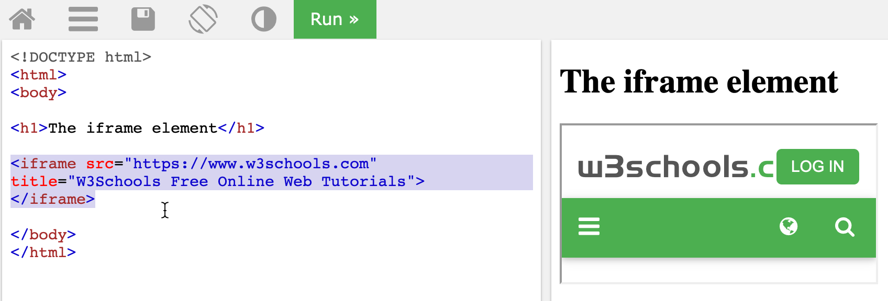
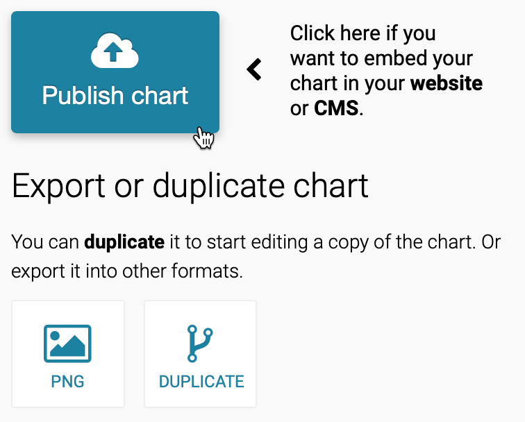
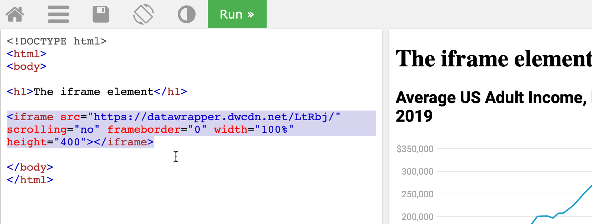
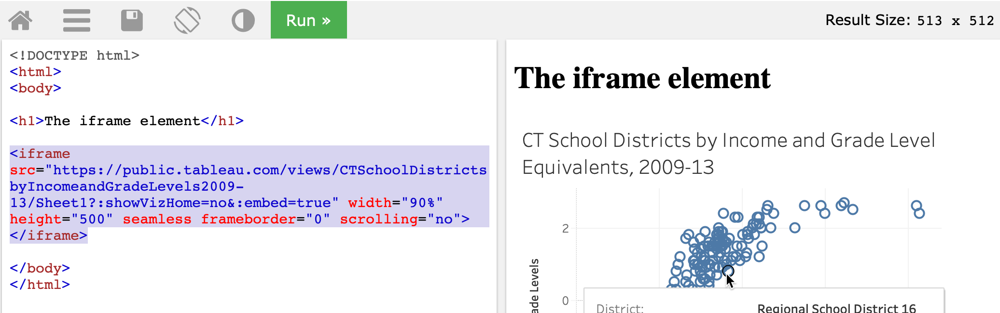

# Embed On the Web {#embed}
So far you've learned how to create [charts in chapter 7](chart.html) and [maps in chapter 8](map.html). Our book emphasizes the benefits of designing *interactive* visualizations that engage broad audiences on the internet by inviting them to interact with your data, investigate new patterns, download files if desired, and easily share your work on social media. In this chapter, you'll learn about a computer code tag called an *iframe*. Like a picture frame, an iframe displays one web page (such as your interactive data visualization) inside a second web page that you control (such as your personal or organizational web site), and makes the content appear seamlessly so that audiences can still interact with it. Several of the visualization tools you've learned so far, such as Google Sheets, Datawrapper, and Tableau Public, generate an *embed code* that contains an iframe to the online chart or map you've created on their platform. We will demonstrate how to [get the embed code or link](embed-code.html) from your visualization tool site, and [paste the code into a second website](paste-code.html) to seamlessly display your interactive content. No coding skills are required in this introductory book, but it certainly helps to be *code-curious*.

TODO: Discuss whether we should add an abstract diagram of an iframe inside a web page, like a picture frame on a wall, to visually reinforce this concept for new users here

## Static Image vs Interactive iframe {- #static}
First, let's clarify the difference between *static* versus *interactive* visualizations. A static picture of a chart or map is a frozen image. Many visualization tools allow you to download static images of your charts or maps in .JPG or .PNG or .PDF format. Static images are useful when that's all that you want to insert in a document, a presentation slide, or even a web page. Another option is to paste a static image, and add a link [or custom shortlink](share.html) with the web address to an interactive chart or map, and invite audiences to explore it online.

Also, you capture a static image of any web page on your computer by taking a [screenshot](https://en.wikipedia.org/wiki/Screenshot) with these built-in commands:

- Chromebook: Press key combination *Ctrl + Shift + F5* for rectangular select tool.
- Macintosh: Press key combination *Shift + Command + 4* then click-and-drag the cross-hair capture tool.
- Windows: Press key combination *Windows key + Shift + S* to call up the *Snip & Sketch* tool.

An animated GIF file is a series of static images that captures motion on the screen. You can insert an animated GIF on a web page to illustrate a short sequence of steps while using an interactive visualization, but audiences cannot interact with it, other than to play the animated loop over again. Paid software tools such as [Snagit](https://www.techsmith.com/screen-capture.html) allow you to create screenshots including drop-down menus and cursors, animated GIFs, and more.

By contrast, *interactive* visualizations allow audiences to directly engage with your data story through their web browsers. Visitors usually can float their cursor over a chart to view tooltips or underlying information, or zoom into a map and pan around, or search terms or sort columns in an interactive table. Interactive visualizations are usually hosted online, such as a chart or map tool platform, and are primarily designed to be viewed online, though in some cases it's possible for you to download and interact with them on your local computer.

Now let's turn to the central question: how can we make an interactive visualization, which resides on its online host (the primary site), appear seamlessly on a different website that we control (the secondary site)?. While it's possible to insert a link on our secondary site to the charts or maps on the primary site, that's inconvenient for our audiences because it requires them to click away from the web page they were reading. A better solution is to insert an embed code that usually contains an [iframe tag](https://www.w3schools.com/tags/tag_iframe.asp), written in Hypertext Markup Language (HTML), the code that displays content inside our web browsers. While you don't need any coding experience, you'll benefit in the long run by learning how to recognize the core features of an embed code and how it works.

In its simplest form, an iframe instructs the secondary site to display a web page address from the primary site, known as the source, as if it were a seamless picture frame on the wall of a room. The sample iframe code below begins with a start tag `<iframe ... >`, which contains the source `src='https://...'` with either single- or double-quotes around the primary site URL, then concludes with an end tag `</iframe>`. This sample iframe refers to an interactive US income inequality chart on the Datawrapper platform, which first appeared in the [Introduction](introduction.html) to this book, as shown in Figure \@ref(fig:iframe-sample).

`<iframe src='https://https://datawrapper.dwcdn.net/LtRbj/'></iframe>`

(ref:iframe-sample) Depending on the format of your book, if a static chart appears above, but you can also [view the interactive version](https://datawrapper.dwcdn.net/LtRbj/).

```{r iframe-sample, fig.cap="(ref:iframe-sample)"}
if(knitr::is_html_output(excludes="markdown")) knitr::include_url("https://datawrapper.dwcdn.net/LtRbj/") else knitr::include_graphics("images/10-embed/iframe-sample.png")
```

Sometimes embed codes or their iframe tags are *much longer* than the simple example above. For example, an iframe tag might include other attributes, such as `width` or `height`, measured in pixels (`px`) or a percentage of its dimensions on the secondary site. Also, you may see other iframe tag elements, such as `seamless` or `frameborder="0"` or `scrolling="no"`, which create a seamless appearance between the iframe content and its surroundings. Finally, you may see *really long* embed codes that contain a dozen or more lines of code that even we don't fully understand. That's okay, because all of these are optional add-ons to improve the appearance of the iframe in the secondary site. The most essential ingredient of an embed code is the iframe and its three core parts: the iframe start tag, source web address, and end tag. When in doubt, look for those key ingredients.

Now that you have a clearer definition of an interactive visualization, embed codes, and iframe tags, in the next section we'll learn how to copy the embed code from different visualization platforms.

TODO above: confirm the screenshot commands for non-Mac platforms and if they are the simplest versions, and if older Windows commands are still needed

## Get the Embed Code or iframe Tag {- #embed-code}
In this section, you'll learn how to copy the embed code or iframe tag that is automatically generated when you publish a chart or map on different visualization platforms featured in this book. Remember that embed codes contain the essential iframe tag, along with other bits of code to display the chart or map from the primary site and make it appear seamlessly on the secondary site.

We'll break this down into three steps for each visualization platform. First, we will demonstrate how to copy your embed code or iframe tag from Google Sheets, Datawrapper, Tableau Public, and other platforms listed below. [TODO: add others like BatchGeo or rewrite that sentence?] Second, we'll show you how to *practice paste* the embed code or iframe tag into the [W3Schools TryIt iframe page](https://www.w3schools.com/tags/tryit.asp?filename=tryhtml_iframe), as shown in Figure \@ref(fig:w3schools-tryit-iframe), to help you understand what's happening behind-the-scenes and to modify the code if needed. Third, we'll point you to the next section to learn how to properly paste the embed code in your preferred website, such as WordPress [and others TODO].

(ref:w3schools-tryit-iframe) For each embed code below, you will *practice paste* it in place of the selected text of the W3Schools TryIt iframe page to see how it works.

```{r w3schools-tryit-iframe, out.width=750, fig.cap="(ref:w3schools-tryit-iframe)"}
 
```

### from Google Sheets {-}
1. After you create a [Google Sheets chart in Chapter 7](chart-google.html), click the 3-dot kebab menu in the upper-right corner of the chart to publish it, as shown in Figure \@ref(fig:google-sheets-publish).

(ref:google-sheets-publish) In your chart, click the three-dot kebab menu to publish it.

```{r google-sheets-publish, out.width=150, fig.cap="(ref:google-sheets-publish)"}
 knitr::include_graphics("images/10-embed/google-sheets-publish.png")
```

2. In the next screen, select the *Embed* tab and *Interactive* chart, and click the *Publish* button to share it online. Select and copy the embed code, as shown in Figure \@ref(fig:google-sheets-embed-code).

(ref:google-sheets-embed-code) Click *Embed* and *Interactive* and *Publish*, then select and copy the embed code.

```{r google-sheets-embed-code, out.width=500, fig.cap="(ref:google-sheets-embed-code)"}
 knitr::include_graphics("images/10-embed/google-sheets-embed-code.png")
```

3. To better understand how the embed code works, open the [W3Schools TryIt iframe page](https://www.w3schools.com/tags/tryit.asp?filename=tryhtml_iframe). Select the current iframe tag, paste in your embed code to replace it, and press the green *Run* button. The result should be similar to Figure \@ref(fig:google-sheets-tryit), but instead will display your embed code and interactive visualization.

(ref:google-sheets-tryit) Paste your Google Sheets embed code to place of the current iframe tag in the TryIt page and click *Run*.

```{r google-sheets-tryit, out.width=750, fig.cap="(ref:google-sheets-tryit)"}
 knitr::include_graphics("images/10-embed/google-sheets-tryit.png")
```

At first glance, the Google Sheets embed code may appear long, but it's actually a straightforward iframe tag with a long source link. Look closely and you'll see iframe settings such as `width` and `height` (measured here in pixels), and `seamless` and `frameborder='0'` and `scrolling='no'` to improve its appearance.

4. Now jump to the [paste code to website section](paste-code.html) of this chapter to learn how to properly insert your embed code into your preferred platform.

### from Datawrapper {-}
1. After you create a [Datawrapper chart in Chapter 7](chart-datawrapper.html) or [map in Chapter 8](map.html) or [interactive table in Chapter 9](table.html), proceed to the final screen and click the *Publish* button, as shown in Figure \@ref(fig:datawrapper-publish). This publishes the interactive version of your chart or map online. Further down on the same screen you can also export a static image, if desired.

(ref:datawrapper-publish) Proceed to the final screen and click the *Publish* button.

```{r datawrapper-publish, out.width=300, fig.cap="(ref:datawrapper-publish)"}
 
```

2. On the next screen, click *copy* to get the Datawrapper embed code, as shown in Figure \@ref(fig:datawrapper-embed-code). The default *responsive iframe* version of the embed code contains additional instructions to improve its appearance on both small and large device screens.

(ref:datawrapper-embed-code) Copy the responsive iframe version of the Datawrapper embed code.

```{r datawrapper-embed-code, out.width=300, fig.cap="(ref:datawrapper-embed-code)"}
 knitr::include_graphics("images/10-embed/datawrapper-embed-code.png")
```

3. To better understand how the embed code works, open the [W3Schools TryIt iframe page](https://www.w3schools.com/tags/tryit.asp?filename=tryhtml_iframe). Select the current iframe tag, paste in your embed code to replace it, and press the green *Run* button. The result should be similar to Figure \@ref(fig:datawrapper-tryit), but instead will display your embed code and interactive visualization.

(ref:datawrapper-tryit) Paste your Datawrapper embed code in place of the current iframe tag in the TryIt page and click *Run*.

```{r datawrapper-tryit, out.width=750, fig.cap="(ref:datawrapper-tryit)"}
 knitr::include_graphics("images/10-embed/datawrapper-tryit.png")
```

The Datawrapper embed code is *long*, but if you look closely, the first half contains a relatively straightforward iframe tag that includes familiar-looking attributes such `src`,`scrolling`, and `frameborder`, and `width` and `height` inside a style tag. The second half of the embed code contains JavaScript instructions to make the iframe appear responsive depending on the size of the device screen.

4. Always try to paste the *full embed code* in your desired web platform. Jump to the [paste code to website section](paste-code.html) of this chapter to learn how to properly insert your embed code into common websites.

5. But if it doesn't work, go back to step 3 and experiment. Try to edit the embed code down to a *simple iframe*, and run it again to see how it looks, as shown in Figure \@ref(fig:datawrapper-tryit-simple). Sometimes a simple iframe works better on your website than a complex embed code.

(ref:datawrapper-tryit-simple) If a complex embed code does not work in your website, go back and try to edit it down into a simple iframe.

```{r datawrapper-tryit-simple, out.width=750, fig.cap="(ref:datawrapper-tryit-simple)"}
 
```

Hint: The Datawrapper iframe tag source follows this general format: `https://datawrapper.dwcdn.net/abcdef/1/`, where the `1` refers to the first version of the chart or map you published. If you make edits and re-publish your visualization, Datawrapper will increase the last digit (to `2` and so forth), and *automatically redirect* older links to the *current version*, which keeps your work up-to-date for your audience.

### from Tableau Public {-}
1. After you create a [Tableau Public chart in Chapter 7](chart-tableau.html) or [map in Chapter 8](map-tableau.html), publish your worksheet, dashboard, or story online by selecting *File > Save to Tableau Public* in the desktop application menu, as shown in Figure \@ref(fig:tableau-public-publish).

(ref:tableau-public-publish) In the Tableau Public desktop application, select *File--Save to Tableau Public* to publish to the online server.

```{r tableau-public-publish, out.width=428, fig.cap="(ref:tableau-public-publish)"}
 knitr::include_graphics("images/10-embed/tableau-public-publish.png")
```

Also, you can log into the [Tableau Public server](https://public.tableau.com) to view all of the visualizations you have published online under your username account profile.

2. In your online Tableau Public account profile page, click to *View* the details of any of your published visualizations, as shown in Figure \@ref(fig:tableau-public-view).

(ref:tableau-public-view) In your Tableau Public online profile page, click to *View* the details of a published visualization.

```{r tableau-public-view, out.width=289, fig.cap="(ref:tableau-public-view)"}
 knitr::include_graphics("images/10-embed/tableau-public-view.png")
```

3. When viewing details for a published visualization in your Tableau Public online account, scroll down and click on the *Share* symbol in the lower-right corner. Select and copy its embed code, as shown in Figure \@ref(fig:tableau-public-embed-code).

(ref:tableau-public-embed-code) Scroll down in the online published visualization details, click the *Share* button, and copy the embed code.

```{r tableau-public-embed-code, out.width=469, fig.cap="(ref:tableau-public-embed-code)"}
 knitr::include_graphics("images/10-embed/tableau-public-embed-code-annotated.png")
```

4. To better understand how the embed code works, open the [W3Schools TryIt iframe page](https://www.w3schools.com/tags/tryit.asp?filename=tryhtml_iframe). Select the current iframe tag, paste in your embed code to replace it, and press the green *Run* button. The result should be similar to Figure \@ref(fig:tableau-public-tryit), but instead will display your embed code and interactive visualization.

(ref:tableau-public-tryit) Paste your Tableau public embed code in place of the current iframe tag in the TryIt page and click *Run*.

```{r tableau-public-tryit, out.width=750, fig.cap="(ref:tableau-public-tryit)"}
 knitr::include_graphics("images/10-embed/tableau-public-tryit.png")
```

The Tableau Public embed code is *very long* and does not fit in one image. Even we don't fully understand what's happening in this complex batch of code.

5. Always try to paste the *full embed code* in your desired web platform. Jump to the [paste code to website section](paste-code.html) of this chapter to learn how to properly insert on different common websites.

6. But if it doesn't work, go back to step 3 and 4 and experiment. For example, you can copy the Tableau Public link to your visualization, *instead* of the embed code, try to convert it into a simple iframe tag, and run it again to see how it looks.

Here's some hints from the [Tableau Public support page](https://kb.tableau.com/articles/howto/embedding-tableau-public-views-in-iframes) when trying to create iframes from links like this example:

`https://public.tableau.com/views/CTSchoolDistrictsbyIncomeandGradeLevels2009-13/Sheet1?:language=en&:display_count=y&:origin=viz_share_link`

6. Paste the link into the W3Schools TryIt page, and delete all of the code that appears *after* the question mark (`?`), so that it looks like this:

`https://public.tableau.com/views/CTSchoolDistrictsbyIncomeandGradeLevels2009-13/Sheet1?`

7. At the end, attach this code snippet to replace what you deleted above:

`:showVizHome=no&:embed=true`

8. Now your edited link should look like this:

`https://public.tableau.com/views/CTSchoolDistrictsbyIncomeandGradeLevels2009-13/Sheet1?:showVizHome=no&:embed=true`

9. Enclose your edit link inside an iframe source tag `src=` with quotes, to make it look similar to this:

`src="https://public.tableau.com/views/CTSchoolDistrictsbyIncomeandGradeLevels2009-13/Sheet1?:showVizHome=no&:embed=true" `

10. Add iframe start and end tags, and also attributes for `width`, `height`, `seamless`, `frameborder="0"`, and `scrolling="no"`, to make it look similar to this:

`<iframe src="https://public.tableau.com/views/CTSchoolDistrictsbyIncomeandGradeLevels2009-13/Sheet1?:showVizHome=no&:embed=true" width="90%" height="500" seamless frameborder="0" scrolling="no"></iframe>`

Hint: Insert `width="90%"`, rather than 100%, to help readers to scroll more easily down your web page with a margin.

11. Press *Run* to see how it looks, as shown in Figure \@ref(fig:tableau-public-tryit-simple). Sometimes a simple iframe works better on your website than a complex embed code.

(ref:tableau-public-tryit-simple) If a complex embed code does not work in your website, go back and copy the link to the visualization, and try to convert it into a simple iframe.

```{r tableau-public-tryit-simple, out.width=750, fig.cap="(ref:tableau-public-tryit-simple)"}
 
```

Now that you have a better sense of how to copy embed codes, and edit them down to simple iframes if needed, in the next section you'll learn how to paste them into common websites such as WordPress.

## Paste Code or iframe to Website {- #paste-code}
In the prior section, you copied the embed code (or created an iframe) for your interactive visualization that is hosted online by the primary site. In this section, we'll demonstrate ways to properly paste the embed code or iframe to seamlessly display your interactive chart or map in the secondary site.

### to WordPress.com sites {-}
If you own *free* or personal or premium [WordPress.com](https://wordpress.com) site, with a web address in the format `anyone.wordpress.com`, you *cannot* insert an embed code that contains an iframe or Javascript due to security concerns, as described on their [support page](https://wordpress.com/support/troubleshooting-embed-links-and-shortcodes/). This means that if wish to show data visualizations created from this book on a WordPress.com site, you have two options. First, with your free or personal or premium plan, you can still insert a *static image* of a chart or map and a link to its interactive site, but that's clearly not ideal. Second, WordPress.com suggests that you can [update to their paid Business or eCommerce plan](https://wordpress.com/support/plan-features/), which supports embed codes that contain iframes or Javascript, following instructions similar to the self-hosted WordPress sites below.

### to Self-hosted WordPress sites {-}
Make sure you [understand the difference](https://wordpress.com/support/com-vs-org/) between a WordPress.com site above versus a self-hosted WordPress site. The latter is sometimes called WordPress.org site because anyone can freely download the software from that address and *host it on their own webserver*, or more commonly, have access to a self-hosted WordPress server through their school or work, or by renting space on a vendor's webserver. But the web address of a self-hosted WordPress site does *not* necessarily need to end in `.org`. It also could be `.com` or `.edu` or any other ending, so don't let that confuse you.

There are several ways to insert an embed code or iframe in a self-hosted WordPress site, but your success may depend on your WP version, your access level, and the complexity of the code.

For the first method, assume that you're using WordPress 5.0 or above with the newer block editor, and you have editor or administrator access to your site. TODO: Check whether less-than-admin privileges strips out iframe codes, as it used to before WP 5.0

In your block editor, select a *custom HTML* block, and directly insert the embed code or the iframe, as shown in Figure \@ref(fig:wordpress-custom-html).  

(ref:wordpress-custom-html) Paste an embed code or iframe into a custom HTML block.

```{r wordpress-custom-html, out.width=700, fig.cap="(ref:wordpress-custom-html)"}
 knitr::include_graphics("images/10-embed/wordpress-custom-html.png")
```

For the second method, assume that you're using WordPress with either the classic or block editor, and that you have administrator access to the site.

1. Install and activate the [iframe plugin](http://wordpress.org/plugins/iframe/), as shown in Figure \@ref(fig:wordpress-iframe-plugin). This plugin allows authors to embed iframe codes in a modified "shortcode" format surrounded by square brackets. Without the plugin, self-hosted WordPress.org sites will usually "strip out" iframe codes for all users except the site administrator. TODO: update this image

(ref:wordpress-iframe-plugin) Install and activate the *iframe plugin* on a self-hosted WP site.

```{r wordpress-iframe-plugin, out.width=300, fig.cap="(ref:wordpress-iframe-plugin)"}
 knitr::include_graphics("images/10-embed/wordpress-iframe-plugin.jpg")
```

2. In the WordPress editor, click to the *text* tab to view the code, and paste the embed code or iframe, as shown in Figure \@ref(fig:wordpress-text-paste-iframe). Initially, the code you pasted includes iframe tags at the start (`<iframe...`) and the end ()`...></iframe>`).

(ref:wordpress-text-paste-iframe) Install and activate the *iframe plugin* on a self-hosted WP site.

```{r wordpress-text-paste-iframe, out.width=700, fig.cap="(ref:wordpress-text-paste-iframe)"}
 knitr::include_graphics("images/10-embed/wordpress-text-paste-iframe.png")
```

3. Modify the start tag by replacing the less-than symbol (`<`) with a square opening bracket (`[`). Modify the back end by erasing the greater-than symbol (`>`) and the entire end tag (`</iframe>`), and replace both of them with one square closing bracket (`]`), as shown in Figure \@ref(fig:wordpress-insert-brackets).

(ref:wordpress-insert-brackets) Modify the front and back end with square brackets.

```{r wordpress-insert-brackets, out.width=700, fig.cap="(ref:wordpress-insert-brackets)"}
 knitr::include_graphics("images/10-embed/wordpress-insert-brackets.png")
```

TODO ABOVE: check method with more complex embed codes, check with non-admin privileges, and update images

### to SquareSpace, Wix, or Weebly Sites {-}
TODO

### Summary {- #summary10}
TODO
