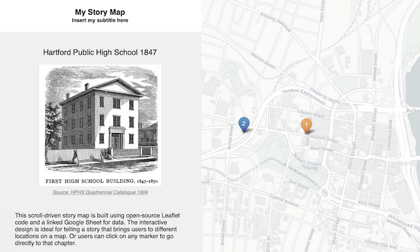
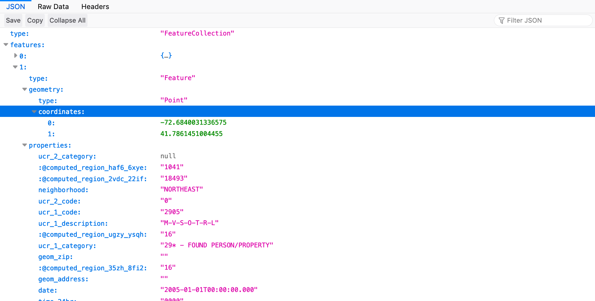

# Leaflet Map Templates {#leaflet}
While beginners appreciate the drag-and-drop map tools and tutorials described earlier in this book, [Google My Maps](mymaps.html) and [Carto](carto.html), more advanced users may wish to customize their visualizations, add more complex data and interactivity, and control exactly how and where their work appears on the web. A more powerful and relatively easy-to-learn solution is to use code templates built with Leaflet <https://leafletjs.com>, an open-source library, which you can [modify and host on GitHub](github.html), as described in this book.

#### Working with Leaflet
Pros:

- Open-source code, which anyone can freely use online, download, modify, or expand with plugins
- Easier for beginners to understand than some other map code libraries
- Compact code library (less than 40 KB) that runs on JavaScript in all modern web browsers

Cons:

- Must host your own code repositories to publish to the web (with a free service such as GitHub Pages)
- Must rely on open-source community of developers to maintain the core code or specific plugins

#### Leaflet Map Templates {-}

TODO: add and clean up Leaflet Map CSV <https://github.com/HandsOnDataViz/leaflet-map-csv> to serve as a fuller tutorial for Leaflet Maps, and explain how this will teach more principles of modifying Leaflet code


| Template | Best use and tutorial chapter |
| --- | --- |
| Leaflet Maps with Google Sheets<br>  | Best to show points, polygons, polylines, or point table data. Upload your GeoJSON data and modify settings in linked Google Sheet (or CSV) and GitHub repo. <br>Template with tutorial: [Leaflet Maps with Google Sheets](leaflet-maps-with-google-sheets.html) |
| Leaflet Storymaps with Google Sheets<br>  | Create a scrolling narrative with points, text, images, and links. <br>Template with tutorial: [Leaflet Storymaps with Google Sheets](leaflet-storymaps-with-google-sheets.html) |
| Leaflet Maps with Socrata API<br>  | Create a Leaflet map powered by data from any Socrata data portal. <br>Template with tutorial: [Leaflet Maps with Socrata](leaflet-maps-with-socrata.html) |

#### Inside Leaflet code templates {-}
The templates featured below vary from simple to complex, but all of them include three basic types of code:

- HTML: to structure content on the web (example: index.html)
- CSS, or Cascading Style Sheet: to shape how content appears on the web (example: style.css)
- JavaScript: to create the map and interactivity  (example: script.js)

Also, these templates refer to other types of code:

- library: link to online instructions to complete routine tasks (examples: Leaflet, jQuery)
- basemap tiles: link to online background map (example: Carto Positron, a light-gray street map)
- data: content to appear on map, typically in CSV or GeoJSON format (examples: data.csv, data.geojson)

## Fork and Edit Leaflet Map with CSV Data {- #leaflet-csv}
TODO: REWRITE this to serve as a more advanced version (with repo leaflet-map-csv) than the prior chapter (with leaflet-map-simple)

This tutorial introduces more sophisticated Leaflet map code templates (http://leafletjs.com) that you can modify and host online with GitHub in your browser (http://github.com). You will learn how to:

- A) Fork (copy) Leaflet template to your GitHub account
- B) Publish your live map to public web with GitHub Pages
- C) Modify your map title and add layer controls
- D) Geocode addresses [in a Google Sheet](https://docs.google.com/spreadsheets/d/1z_0hKbw8Ff_fdp-XRoRL4YWe6ue0c0EpITveZ2rz1e8/) and upload points from data.csv

Code templates help us to move beyond the limits of drag-and-drop web mapping services (such as Google MyMaps) and to create more customized visualizations on a web server that you control. Before you begin, learn the broad concepts in the chapter introduction [Modify and Host Code Templates with GitHub](github.html). If you have problems with this tutorial, go to the [Fix Common GitHub and Code Errors](fix-code.html) chapter in this book.

TODO: add demo, remove unnecessary basic steps from below (covered in prior chapter)

#### Video with step-by-step tutorial {-}
<iframe width="560" height="315" src="https://www.youtube.com/embed/7iUocaxTYqk?rel=0" frameborder="0" allow="autoplay; encrypted-media" allowfullscreen></iframe>

#### A) Fork (copy) Leaflet template to your GitHub account {-}
Before you begin, sign up for a free GitHub account: http://github.com

1) Right-click to open this GitHub code template in a new tab: https://github.com/handsondataviz/leaflet-map-simple

2) In the upper-right corner of the code template, sign in to your free GitHub account

3) In the upper-right corner, click Fork to copy the template (also called a code repository, or repo) into your GitHub account. The web address (URL) of the new copy in your account will follow this format:
```markdown
https://github.com/USERNAME/REPOSITORY
```

Reminder: You can only fork a GitHub repo **one time**. If needed, see how to make a second copy in the [Create a New Repo in GitHub](create-repo.html) chapter in this book.

#### B) Publish your live map to public web with GitHub Pages {-}

4) In your new copy of the code repo, click on Settings, scroll down to the GitHub Pages area, select Master, and Save. This publishes your code template to a live map on a public website that you control.

5) Scroll down to GitHub Pages section again, to select and copy the link to your published web site, which will follow this format:
```markdown
https://USERNAME.github.io/REPOSITORY
```

6) Scroll up to the top, and click on your repo name to go back to its main page.

7) At the top level of your repo main page, click on README.md, and click the pencil icon to edit this file, written in easy-to-read Markdown code.

8) Delete the link to the current live site, and paste in the link to your site. Scroll down and Commit to save your edits.

9) On your repo main page, right-click on the link to your published site to open in a new tab. **Be patient** during busy periods, because your website may take up to 1 minute to appear the first time.

#### C) Modify your map title and add layer controls {-}

10) Go back to your browser tab for your code repo. Click on the index.html file (which contains the map code), and click the pencil icon to edit it.

11) Explore the map code, which contains HTML, CSS, and JavaScript. Look for sections that begin with "EDIT" for items that you can easily change. Scroll down to Commit your changes.

12) Go to your live website browser tab and refresh the page to view your edits. **Be patient** during busy periods, when some edits may take up to 1 minute to appear.

13) To change your map title in the index.html file, click the pencil symbol (to edit) and go to lines 23-25. Replace "EDIT your map title" with your new title:
```HTML
<!-- Display the map and title with HTML division tags  -->
<div id="map-title">EDIT your map title</div>
<div id="map"></div>
```

14) To change your initial map zoom level, edit the index.html file and go to line 33. The zoom range for this map is from 1 (max zoom out) to 18 (max zoom in).
```JavaScript
// Set up initial map center and zoom level
var map = L.map('map', {
  center: [41.77, -72.69], // EDIT latitude, longitude to re-center map
  zoom: 12,  // EDIT from 1 to 18 -- decrease to zoom out, increase to zoom in
  scrollWheelZoom: false
});
```

15) To change the default basemap, edit lines 46 and 52 to delete “.addTo(map)” from the Carto light layer, then add it to the Stamen colored terrain layer. DO NOT erase the semicolons!

Your original code looks like this (scroll to right to see all):
```JavaScript
/* Carto light-gray basemap tiles with labels */
  var light = L.tileLayer('https://cartodb-basemaps-{s}.global.ssl.fastly.net/light_all/{z}/{x}/{y}.png', {
    attribution: '&copy; <a href="http://www.openstreetmap.org/copyright">OpenStreetMap</a>, &copy; <a href="https://carto.com/attribution">CARTO</a>'
  }).addTo(map); // EDIT - insert or remove ".addTo(map)" before last semicolon to display by default
  // controlLayers.addBaseLayer(light, 'Carto Light basemap');
  /* Stamen colored terrain basemap tiles with labels */
  var terrain = L.tileLayer('https://stamen-tiles.a.ssl.fastly.net/terrain/{z}/{x}/{y}.png', {
    attribution: 'Map tiles by <a href="http://stamen.com">Stamen Design</a>, under <a href="http://creativecommons.org/licenses/by/3.0">CC BY 3.0</a>. Data by <a href="http://openstreetmap.org">OpenStreetMap</a>, under <a href="http://www.openstreetmap.org/copyright">ODbL</a>.'
  }); // EDIT - insert or remove ".addTo(map)" before last semicolon to display by default
  // controlLayers.addBaseLayer(terrain, 'Stamen Terrain basemap');
```

After you edit the code, it should look like this (scroll to right to see all):
```JavaScript
/* Carto light-gray basemap tiles with labels */
var light = L.tileLayer('https://cartodb-basemaps-{s}.global.ssl.fastly.net/light_all/{z}/{x}/{y}.png', {
  attribution: '&copy; <a href="http://www.openstreetmap.org/copyright">OpenStreetMap</a>, &copy; <a href="https://carto.com/attribution">CARTO</a>'
}); // EDIT - insert or remove ".addTo(map)" before last semicolon to display by default
// controlLayers.addBaseLayer(light, 'Carto Light basemap');
/* Stamen colored terrain basemap tiles with labels */
var terrain = L.tileLayer('https://stamen-tiles.a.ssl.fastly.net/terrain/{z}/{x}/{y}.png', {
  attribution: 'Map tiles by <a href="http://stamen.com">Stamen Design</a>, under <a href="http://creativecommons.org/licenses/by/3.0">CC BY 3.0</a>. Data by <a href="http://openstreetmap.org">OpenStreetMap</a>, under <a href="http://www.openstreetmap.org/copyright">ODbL</a>.'
}).addTo(map); // EDIT - insert or remove ".addTo(map)" before last semicolon to display by default
// controlLayers.addBaseLayer(terrain, 'Stamen Terrain basemap');
```

16) To add a control panel that turns on/off map layers, delete the code comment symbols (//) that appear in front of lines 38-41, 47, and 53 to activate these sections. When you remove code comments in GitHub, the color changes from gray text (inactive code) to colored text (active code). After you remove the code comments, your file should look like this (scroll to right to see all):
```JavaScript
/* Control panel to display map layers */
 var controlLayers = L.control.layers( null, null, {
  position: "topright",
  collapsed: false
 }).addTo(map);

/* Carto light-gray basemap tiles with labels */
var light = L.tileLayer('https://cartodb-basemaps-{s}.global.ssl.fastly.net/light_all/{z}/{x}/{y}.png', {
  attribution: '&copy; <a href="http://www.openstreetmap.org/copyright">OpenStreetMap</a>, &copy; <a href="https://carto.com/attribution">CARTO</a>'
}); // EDIT - insert or remove ".addTo(map)" before last semicolon to display by default
 controlLayers.addBaseLayer(light, 'Carto Light basemap');
/* Stamen colored terrain basemap tiles with labels */
var terrain = L.tileLayer('https://stamen-tiles.a.ssl.fastly.net/terrain/{z}/{x}/{y}.png', {
  attribution: 'Map tiles by <a href="http://stamen.com">Stamen Design</a>, under <a href="http://creativecommons.org/licenses/by/3.0">CC BY 3.0</a>. Data by <a href="http://openstreetmap.org">OpenStreetMap</a>, under <a href="http://www.openstreetmap.org/copyright">ODbL</a>.'
}).addTo(map); // EDIT - insert or remove ".addTo(map)" before last semicolon to display by default
 controlLayers.addBaseLayer(terrain, 'Stamen Terrain basemap');
```
17) To change one point on the map, you could edit the latitude and longitude coordinates of the single marker in lines 55-57. To find coordinates for any location and to learn more, go to http://www.latlong.net

```JavaScript
/* Display a blue point marker with pop-up text */
L.marker([41.77, -72.69]).addTo(map) // EDIT latitude, longitude to re-position marker
.bindPopup("Insert pop-up text here"); // EDIT pop-up text message
```
But a better way to display several points is to remove the code comment symbols (//) in front of lines 60-69 to activate this section of code, which pulls map points from the data.csv file in your GitHub repository. After your edits, this section should look like this (scroll right to see all):
```JavaScript
/* Upload Latitude/Longitude markers from data.csv file, show Title in pop-up, and override initial center and zoom to fit all in map */
 var customLayer = L.geoJson(null, {
  onEachFeature: function(feature, layer) {
    layer.bindPopup(feature.properties.Title);
  }
 });
 var runLayer = omnivore.csv('data.csv', null, customLayer)
 .on('ready', function() {
  map.fitBounds(runLayer.getBounds());
 }).addTo(map);
 controlLayers.addOverlay(customLayer, 'Markers from data.csv');
```

#### D) Geocode addresses in Google Sheet and upload points from data.csv {-}

18) A better way to display multiple points on your map is to prepare and upload a new data.csv file to your GitHub repository. First, right-click to open this Google Sheets template in a new tab: [Leaflet Maps Simple data points with Geocoder](https://docs.google.com/spreadsheets/d/1z_0hKbw8Ff_fdp-XRoRL4YWe6ue0c0EpITveZ2rz1e8/)

19) Since this sheet is view-only, you cannot edit it. Instead, sign in to your Google account in the upper-right corner.

20) Go to File > Make a Copy, which will save a duplicate version to your Google Drive, which you can edit.

21) In your copy of the Google Sheet, select any cells and press Delete on your keyboard to erase contents. Type new titles and addresses into columns A and B.

22) To geocode your new addresses (which means converting them into latitude and longitude coordinates), select all of the contents across 6 columns, from Address (B) to Source (G).

23) Go to the Geocoder menu that appears in this special Google Sheet template, and select any service, such as US Census (for US addresses) or Google Maps. The first time you run the geocoder, the script will ask for permission.

24) After you have geocoded your addresses, go to File > Download As > Comma-separated values (.CSV format) to save the file to your computer.

25) In your computer, right-click the downloaded file to rename it to: data.csv

26) In your GitHub repository, click Upload Files, then drag-and-drop your new data.csv file, and Commit to upload it. Go to your live map browser tab and refresh to view changes. **Be patient* during busy periods, when some edits may take up to 1 minute to appear.**


## Leaflet Maps with Google Sheets template {- #leaflet-maps-with-google-sheets}
Question: If you have moved beyond simple drag-and-drop point map tool, such as [Google My Maps](mymaps.html) tutorials in this book, and want to create point and/or polygon and/or polyline maps, where should you go?

Answer: Copy and customize our open-source template for Leaflet Maps with Google Sheets. Control the map options display data that you upload to your Google Sheet and GitHub repository. No coding skills required, other than pasting one line of code to link your map with your sheet. Requires two free accounts: Google and GitHub.

#### Video and list of features {-}
<iframe width="560" height="315" src="https://www.youtube.com/embed/kUEfB8wD3Vk?rel=0" frameborder="0" allow="autoplay; encrypted-media" allowfullscreen></iframe>

- Best to show points, polygons, and/or polylines, with table of points in map view
- Free and open-source code template, built on Leaflet and linked to Google Sheets
- Fork the code and host your live map on the web for free with GitHub Pages
- Geocode location data with US Census or Google, using script inside the Google Sheet
- Easy-to-modify data labels and map options in Google Sheet tabs or uploaded CSV files
- Upload your polygon and polyline GeoJSON files, and custom markers, to your GitHub repo
- Show multiple polygon layers, each with their own color legend and ranges (numerical or text)
- Responsive design resizes your maps to display inside most mobile devices

#### Try it {-}
Explore the map or right-click to [view full-screen map in a new tab](https://handsondataviz.github.io/leaflet-maps-with-google-sheets/)
<iframe src="https://handsondataviz.github.io/leaflet-maps-with-google-sheets/" width="90%" height=500></iframe>

The map pulls the point data and settings from a linked Google Sheet, which you can explore below or right-click to [view full-screen Sheet in a new tab](https://docs.google.com/spreadsheets/d/1ZxvU8eGyuN9M8GxTU9acKVJv70iC3px_m3EVFsOHN9g)
<iframe src="https://docs.google.com/spreadsheets/d/1ZxvU8eGyuN9M8GxTU9acKVJv70iC3px_m3EVFsOHN9g/pubhtml?widget=true&amp;headers=false" width="90%" height=500></iframe>

#### Part 1: Create and customize your map {-}
In the first part of this tutorial, you will learn how to create your own copy of the Leaflet Maps with Google Sheets template, publish your Google Sheet, and paste its web address into your GitHub repo.

- A) Fork (copy) the code template and publish your version with GitHub Pages
- B) File > Make a Copy of Google Sheet template, Share, and File > Publish
- C) Paste your Google Sheet URL in two places in your GitHub repo
- D) Modify your map settings in the Options tab and test your live map

<iframe width="560" height="315" src="https://www.youtube.com/embed/-nGdrzMuUnI?rel=0" frameborder="0" allow="autoplay; encrypted-media" allowfullscreen></iframe>

#### Part 2: Upload and display your map data {-}
In the second part of this tutorial, you will learn how to geocode and customize your own point markers, and either hide or upload your own polygon and/or polyline GeoJSON data.

- E) Geocode locations and customize new markers in the Points tab
- F) Hide the polygon and polyline legends and default GeoJSON data
- G) Upload and display your own polygon GeoJSON data
- H) Upload and display your own polyline GeoJSON data
- I) Upload and display customized marker icons
- J) Optional: Save Google Sheets as CSV and upload to GitHub
-
** TO DO: second half video**

To solve problems, see [Fix Common GitHub and Code Errors](fix-code.html) chapter in this book.

#### A) Fork (copy) the code template and publish your version with GitHub Pages {-}

**Before you begin**, this tutorial assumes that you:

- have a [free Google Drive account](http://drive.google.com), and learned the [File > Make a Copy in Google Sheets](copy.html) tutorial in this book
- have a [free GitHub account](http://github.com), and understand concepts from the [Modify and Host Code with GitHub](github.html) chapter in this book

1) Right-click to open this GitHub code template in a new tab: https://github.com/handsondataviz/leaflet-maps-with-google-sheets

2) In the upper-right corner of the code template, sign in to your free GitHub account

3) In the upper-right corner, click Fork to copy the template (also called a code repository, or repo) into your own account.
The web address (URL) of the new copy in your account will follow this format:
```markdown
https://github.com/USERNAME/leaflet-maps-with-google-sheets
```

Reminder: You can only fork a GitHub repo **one time**. If needed, see how to make a second copy in the [Create a New Repo in GitHub](create-repo.html) chapter in this book.

4) In your new copy of the code repo, click on Settings, scroll down to the GitHub Pages area, select Master, and Save. This publishes your code to a live map on a public website that you control.

5) Scroll down to GitHub Pages section again, and copy the link to your published web site, which will follow this format:
```markdown
https://USERNAME.github.io/leaflet-maps-with-google-sheets
```

```{r lmwgs-1, fig.cap="Screencast: Fork"}
if(knitr::is_html_output()) knitr::include_url("images/10-leaflet/lmwgs-1-fork-640.gif") else knitr::include_graphics("images/placeholder.jpg")
```

6) Scroll up to the top, and click on your repo name to go back to its main page.

7) At the top level of your repo main page, click on README.md, and click the pencil icon to edit this file, written in easy-to-read Markdown code.

8) Delete the link to the current live site, and paste in the link to YOUR site. Scroll down and Commit to save your edits.

9) On your repo main page, right-click the link to your live map to open in a new tab. **Be patient** during busy periods on GitHub, when your website may take up to 1 minute to appear the first time.

#### B) File > Make a Copy of Google Sheet template, Share, and File > Publish {-}

1) Right-click to open this Google Sheets template in a new tab: https://docs.google.com/spreadsheets/d/1ZxvU8eGyuN9M8GxTU9acKVJv70iC3px_m3EVFsOHN9g

2) Sign into your Google account

3) File > Make a Copy of the Google Sheet template to your Google Drive

4) Click the blue Share button, click Advanced, click to change Private to Anyone with the link > Can View the Sheet. This will make your public data easier to view in your map.

```{r lmwgs-2, fig.cap="Screencast: Share Google Sheet"}
if(knitr::is_html_output()) knitr::include_url("images/10-leaflet/lmwgs-2-make-copy-640.gif") else knitr::include_graphics("images/placeholder.jpg")
```

5) File > Publish the Link to your Google Sheet to the public web, so the Leaflet map code can read it.


6) At the top of your browser, copy your Google Sheet web address or URL (which usually ends in `...XYZ/edit#gid=0`). Do NOT copy the published URL (which usually ends in `...XYZ/pubhtml`).


#### C) Paste your Google Sheet URL in two places in your GitHub repo {-}

1) First, connect your Google Sheet directly to your Leaflet Map code. In your Github code repo, click to open this file: `google-doc-url.js`

2) Click the pencil symbol to edit the file.

3) Paste your Google Sheet URL into the code to replace the current URL. Do not delete the single-quotation marks or semicolon.

4) Scroll to bottom of page and press Commit to save your changes. Now the Leaflet Map code can locate your published Google Sheet.

```{r lmwgs-paste, fig.cap="Screencast: Copy Google Sheet URL and paste into GitHub code"}
if(knitr::is_html_output()) knitr::include_url("images/10-leaflet/lmwgs-paste-google-sheet-into-code.gif") else knitr::include_graphics("images/placeholder.jpg")
```

5) Next, let's paste your Google Sheet URL in a second place to keep track of it. Go to the README.md file in your GitHub repo, click to open and edit, and paste your Google Sheet web address to replace the existing link near the top. Commit to save your changes.

#### D) Modify your map settings in the Options tab and test your live map {-}

In the top-level of your GitHub repo, test the new links to your map and your Google Sheet to make sure they work and point to your versions.

** TO DO - redo GIF **

In your linked Google Sheet, go to the Options Tab and modify these items:

1) Map Title -- insert your own title

2) Map Subtitle -- insert your own version

3) Author Name -- insert your own name, or first name, or initials (will be public)

4) Author Email or Website -- insert your own (will be public), or delete the current name to make it blank

Open the link to your live map in a new browser tab and refresh to see your changes.

#### E) Geocode locations and customize new markers in the Points tab {-}

In your new map, our next goal is to add and modify the appearance of a new set of point markers, based on new addresses that you will enter and geocode.

In the Points tab of your Google Sheet:

1) Think of a simple data story that involves at least four geocodeable locations, divided into at least two groups. If you need an example, use this sample table of “Famous Places in New York City”:

| Group     | Name     | Location |
| :-------- | :------- | :------  |
| Landmark  | Empire State Building | 350 5th Ave, New York, NY 10118 |
| Landmark  | Metropolitan Museum of Art | 1000 5th Ave, New York, NY 10028 |
| Transit   | Grand Central Terminal | 89 E 42nd St, New York, NY 10017 |
| Transit   | Penn Station | 159 West 33rd Street, New York, NY 10120 |

2) Enter your Group, Name, and Location data into new rows below the current data.

3) Go to the Font Awesome Icons site, http://fontawesome.io/icons, scroll down to Search Icons, find your desired icon code name, and insert this into the Marker Icon (column B) of your Points sheet. For example, search for and insert the icon code "train" or "building" to display markers with either of these symbols in your map. (To upload your own customized marker, see section H further below.)

4) In Marker Color (column C), use the drop-down menu to select a marker color.

5) In Icon Color (column D), insert a color word (example: white) or hex code (example: #fff) to color the icon symbol inside your marker. Recommended: use white icon colors with dark marker colors.

6) Leave Custom Size (column E) blank.

7) Optional:
  - In Image (column G), insert the URL (preferably https://, not http://) of a small-to-medium sized image on the web
  - In Description (column G), insert text and/or a web link enclosed with an [HTML a href tag with target set to blank](https://www.w3schools.com/tags/tag_a.asp)

8) Do NOT delete or rename any column headers. However, you have the option to add new column headers to display in your map table.

9) Geocode your new data inside your Google Sheet by dragging your cursor to select 6 columns of data: Location - Latitude - Longitude - Found - Quality - Source

10) In the Geocoder menu that appears in this Google Sheet template, select one of the geocoding services. If one service cannot locate your data, try the other. Always inspect the accuracy of the Found column.

Open the link to your live map in a new browser tab and refresh to see your changes. If your new markers appear correctly, then delete the existing rows that came with this template.

#### F) Hide the polygon and polyline legends and default GeoJSON data {-}

To show a simple point map, learn how to turn off and hide the polygon and polyline legend and default data that came with this template. (See how to add your own GeoJSON data in section G below.)

In your linked Google Sheet:

1) In the Options tab, Polyline Legend Position (cell B 35) -- select Off to hide the legend

2) In the Polygons tab, Polygon Legend Position (cell B 4) -- select Off to hide the legend

3) In the Polygons tab, Polygon GeoJSON URL (cell B 6) -- delete contents to remove polygons

4) Go to the next tab, named Polygons1, in its drop-down menu, select Delete to remove sheet

5) In the Polylines tab, delete the entire row (rows 2 and 3) to remove the existing lines

Go to the browser tab with your new map, and refresh the page to see your changes.

Optional:

- in the Options tab, Display Table (cell B 29), turn off to hide the table in your map
- or modify the list of item in Table Columns (cell B 30) to change the display in your table

#### G) Upload and display your own polygon GeoJSON data {-}

1) Prepare your polygon file in GeoJSON format. View or modify the GeoJSON file properties (such as name, data fields, etc.) with one of these tools:

- GeoJSON.io, http://geojson.io -- Drag-and-drop your file, and select the Table tab to view or rename properties. See [GeoJSON.io tutorial](geojsonio.html) in this book, OR
- MapShaper, http://mapshaper.org -- Drag-and-drop your file. To edit, see [MapShaper tutorial](mapshaper.html) in this book

2) In your GitHub repo, click to open the Geometry subfolder, then click Upload Files, drag-and-drop your geojson file, and Commit changes

** TO DO ** - turn on settings that you turned off in step F above

3) In your linked Google sheet, go to Polygons tab to adjust these settings:
- change Polygon GeoJSON URL (cell B 6) to match the pathname of the file you uploaded above
- change Polygon GeoJSON Name (cell B 5) to the title to be displayed for this polygon layer
- change Polygon Legend Title (cell B 3) for the title in the polygon legend box

4) To adjust the polygon legend colors and range, see the Polygon Data and Color Settings sections of the Polygon tab in Google Sheets.

5) The code supports multiple polygon layers, which you can add (or delete) by duplicating the Polygons tab. Name them Polygons1, Polygons2, etc.

* TO DO *
-  Explain: To use both the automatic ColorBrewer Palette and manual colors, insert blanks (goes to automatic palette above), separated by semicolons.

#### H) Upload and display your own polyline GeoJSON data {-}

Follow similar steps as described in the Polygon section above, but adjust settings in the Polylines tab of your linked Google Sheet.

#### I) Upload and display customized marker icons {-}

** TO DO **

#### J) Optional: Save Google Sheets as CSV and upload to GitHub {-}

If desired, you can save your table data with your code, rather than in a separate Google Sheet. Go to each Sheet tab and File > Save As in CSV format, with these file names:

- options.csv
- points.csv
- polygons.csv (also: polygons1.csv, polygons2.csv, etc.)
- polylines.csv
- notes.csv  (or .txt)

Upload these files into the main level of your GitHub code repository, where the template will process them automatically.

#### Learn more {-}
To solve problems, see [Fix Common GitHub and Code Errors](fix-code.html) chapter in this book.

## Leaflet Storymaps with Google Sheets and Scrolling Narrative {- #leaflet-storymaps-with-google-sheets}
TODO: Add intro text

#### Try it {-}
Explore the map or right-click to [view full-screen map in a new tab](https://handsondataviz.github.io/leaflet-storymaps-with-google-sheets/)
<iframe src="https://handsondataviz.github.io/leaflet-storymaps-with-google-sheets/" width="90%" height=500></iframe>

The map pulls the point data and settings from a linked Google Sheet, which you can explore below or right-click to [view full-screen Sheet in a new tab](https://docs.google.com/spreadsheets/d/1AO6XHL_0JafWZF4KEejkdDNqfuZWUk3SlNlQ6MjlRFM/)
<iframe src="https://docs.google.com/spreadsheets/d/e/2PACX-1vSqxGs67j80rAPDZdQaS5jI0avn1qs2y5N8fOaeHUGvyrnIwBmWomlfAuujtvPrxtF-5FBZxi_KdTUm/pubhtml?widget=true&amp;headers=false" width="90%" height=500></iframe>

#### Features {-}
- Show map points, text, images, and links with scrolling narrative
- Free and open-source code template, built on Leaflet and linked to Google Sheets
- Fork the code and host your live map on the web for free with GitHub Pages
- Geocode location data with US Census or Google, using script inside the Google Sheet
- Easy-to-modify data and map options in Google Sheet tabs or uploaded CSV files
- Responsive design resizes your maps to display inside most mobile devices

#### Create Your Own {-}
- A) Fork (copy) the code template and publish your version with GitHub Pages
- B) File > Make a Copy of Google Sheet template, Share, and File > Publish
- C) Paste your Google Sheet URL in two places in your GitHub repo
- D) Modify your map settings in the Options tab and test your live map
- E) Geocode locations in the Points tab

To solve problems, see [Fix Common GitHub and Code Errors](fix-code.html) in this book.

#### A) Fork (copy) the code template and publish your version with GitHub Pages {-}

**Before you begin**, this tutorial assumes that you:

- have a [free Google Drive account](http://drive.google.com), and learned the [File > Make a Copy in Google Sheets](copy.html) tutorial in this book
- have a [free GitHub account](http://github.com), and understand concepts from the [Modify and Host Code with GitHub](github.html) chapter in this book

1) Right-click to open this GitHub code template in a new tab: https://github.com/handsondataviz/leaflet-storymaps-with-google-sheets

2) In the upper-right corner of the code template, sign in to your free GitHub account

3) In the upper-right corner, click Fork to copy the template (also called a code repository, or repo) into your own account.
The web address (URL) of the new copy in your account will follow this format:
```
https://github.com/USERNAME/leaflet-storymaps-with-google-sheets
```

Reminder: You can only fork a GitHub repo **one time**. If needed, see how to make a second copy in the [Create a New Repo in GitHub](create-repo.html) chapter in this book.

4) In your new copy of the code repo, click on Settings, scroll down to the GitHub Pages area, select Master, and Save. This publishes your code to a live map on a public website that you control.

5) Scroll down to GitHub Pages section again, and copy the link to your published web site, which will follow this format:
```
https://USERNAME.github.io/leaflet-storymaps-with-google-sheets
```

6) Scroll up to the top, and click on your repo name to go back to its main page.

7) At the top level of your repo main page, click on README.md, and click the pencil icon to edit this file, written in easy-to-read Markdown code.

8) Delete the link to the current live site, and paste in the link to YOUR site. Scroll down and Commit to save your edits.

9) On your repo main page, right-click the link to your live map to open in a new tab. **Be patient** during busy periods on GitHub, when your website may take up to 1 minute to appear the first time.

#### B) File > Make a Copy of Google Sheet template, Share, and File > Publish {-}

1) Right-click to open this Google Sheets template in a new tab: https://docs.google.com/spreadsheets/d/1AO6XHL_0JafWZF4KEejkdDNqfuZWUk3SlNlQ6MjlRFM/

2) Sign into your Google account

3) File > Make a Copy of the Google Sheet template to your Google Drive

4) Click the blue Share button, click Advanced, click to change Private to Anyone with the link > Can View the Sheet. This will make your public data easier to view in your map.

5) File > Publish the Link to your Google Sheet to the public web, so the Leaflet map code can read it.


6) At the top of your browser, copy your Google Sheet web address or URL (which usually ends in `...XYZ/edit#gid=0`). Do NOT copy the published URL (which usually ends in `...XYZ/pubhtml`).


#### C) Paste your Google Sheet URL in two places in your GitHub repo {-}

1) First, connect your Google Sheet directly to your Leaflet Map code. In your Github code repo, click to open this file: `google-doc-url.js`

2) Click the pencil symbol to edit the file.

3) Paste your Google Sheet URL into the code to replace the current URL. Do not delete the single-quotation marks or semicolon.

4) Scroll to bottom of page and press Commit to save your changes. Now the Leaflet Map code can locate your published Google Sheet.

5) Next, let's paste your Google Sheet URL in a second place to keep track of it. Go to the README.md file in your GitHub repo, click to open and edit, and paste your Google Sheet web address to replace the existing link near the top. Commit to save your changes.

#### D) Modify your map settings in the Options tab and test your live map {-}

In the top-level of your GitHub repo, test the new links to your map and your Google Sheet to make sure they work and point to your versions.

** TO DO - redo GIF **

In your linked Google Sheet, go to the Options Tab and modify these items:

1) Map Title -- insert your own title

2) Map Subtitle -- insert your own version

3) Author Name -- insert your own name, or first name, or initials (will be public)

4) Author Email or Website -- insert your own (will be public), or delete the current name to make it blank

Open the link to your live map in a new browser tab and refresh to see your changes.

#### E) Geocode locations and customize new markers in the Points tab {-}

In your new map, our next goal is to add and modify the appearance of a new set of point markers, based on new addresses that you will enter and geocode.

In the Points tab of your Google Sheet:

1) Do NOT delete or rename any column headers. However, you have the option to add new column headers to display in your map table.

2) Geocode your new data inside your Google Sheet by dragging your cursor to select 6 columns of data: Location - Latitude - Longitude - Found - Quality - Source

3) In the Geocoder menu that appears in this Google Sheet template, select one of the geocoding services. If one service cannot locate your data, try the other. Always inspect the accuracy of the Found column.

Open the link to your live map in a new browser tab and refresh to see your changes. If your new markers appear correctly, then delete the existing rows that came with this template.

#### TODO {-}
Add documentation for new features added in 2020

Markers

I added a new column to the Chapter tab called “Marker”. It has a dropdown with currently three options: Numerated (defaults to that, even if empty value), Plain (with no number), and No marker. The latter is what you want.
It can be potentially extended to colours, types of markers, etc.
https://github.com/handsondataviz/leaflet-storymaps-with-google-sheets/blob/master/scripts/storymap.js#L121-L131

Overlay GeoJSONs

I added two columns, GeoJSON Overlay with the URL to the GeoJSON, and GeoJSON Feature Properties, which is CSS that defines style of features.
List the styles separated by semicolon, and no quotation marks required. Eg
fillColor: orange; weight:2, opacity: 0.5, color: red, fillOpacity: 0.1
In the code, you will see two vertical lines: they mean “or”. If the value of the left-most expression is not undefined, it uses it. If not, it keeps moving to the right until there is a value that is not an empty string. For example,
https://github.com/handsondataviz/leaflet-storymaps-with-google-sheets/blob/master/scripts/storymap.js#L310
color: feature.properties.COLOR || props.color || 'silver’,

Will first attempt to extract the color from the COLOR property of each geoJson feature (useful for choropleth). If not found, it tries the GeoJSON Feature Properties “color”. If that is not set, it uses silver.
https://github.com/handsondataviz/leaflet-storymaps-with-google-sheets/blob/master/scripts/storymap.js#L288-L316

Data in local CSV files

If googleDocURL variable does not exist (eg you delete the file) or is an empty string, it reads two spreadsheets: Options.csv and Chapters.csv from the /csv folder.
Otherwise, it reads from the google sheet.
https://github.com/handsondataviz/leaflet-storymaps-with-google-sheets/blob/master/scripts/storymap.js#L13-L35
When data is read from a .CSV, it links that in the attribution (https://github.com/handsondataviz/leaflet-storymaps-with-google-sheets/blob/master/scripts/storymap.js#L393-L396)

#### Learn more {-}
To solve problems, see [Fix Common GitHub and Code Errors](fix-code.html) chapter in this book.

## Leaflet Maps with Socrata API Open Data {- #leaflet-maps-with-socrata}
TODO: Decide whether to keep or not, and if so, add intro

<iframe src="https://handsondataviz.github.io/leaflet-socrata/index.html" style="width: 100%; height: 450px; border: 0 none;"></iframe>
Source: [Current Class 1 - Class 4 Food Establishments](https://data.hartford.gov/Public-Health/Current-Class-1-Class-4-Food-Establishments/xkvv-76v8), City of Hartford

#### Why pair Leaflet maps with Socrata data? {-}
Leaflet, a friendly and flexible open-source code library for creating interactive web maps, plays nicely with Socrata, an open data platform used by several government agencies and organizations. Benefits of pairing Leaflet and Socrata:

- Although the Socrata data platform includes built-in visualization tools for anyone to create charts and maps, Leaflet gives you more control over your map design. Furthermore, Leaflet allows you to create maps that bring together data from both Socrata and non-Socrata sources.
- Socrata datasets include an API (application program interface) endpoint, in the form of a web address. This endpoint enables other computers to easily access the most recent data online, instead of a static version that was manually downloaded.
- Newer Socrata datasets that include locations (such as latitude and longitude coordinates) also provide endpoints in GeoJSON format. Since Leaflet maps easily process GeoJSON data, only a few lines of code are required.

- However, Socrata GeoJSON endpoints do not currently support "real-time" data, such as up-to-the-minute locations of public transportation, etc. In these cases, you may need to access data through a provider other than Socrata, most likely in a different format, which may require more coding skills.

#### About Socrata API endpoints {-}

Go to any Socrata open data platform, find a dataset, and click the API tab. As an example, you can use City of Hartford's [Police Incidents dataset](https://data.hartford.gov/Public-Safety/Police-Incidents-01012005-to-Current/889t-nwfu).


Copy the API endpoint. The default version is JSON.

If you're new to APIs, test the endpoint by pasting it into your browser address line. Ideally you would see a formatted JSON view (use Chrome or Firefox for better results).


If your browser does not support JSON view, you will see the raw JSON stream only, like the one shown below.


Test if this Socrata endpoint supports GeoJSON format by changing the extention in the API dropdown menu from `JSON` to `GeoJSON`. GeoJSON format works best with Leaflet because the coding is simpler.

If your endpoint supports GeoJSON format, your browser will display a data stream similar to the one below.



If your Socrata endpoint only supports JSON format, but includes data columns with latitude and longitude, see other Leaflet examples further below.

#### Register for Socrata App Token {-}
- Socrata requires developers to register for a free app token at https://opendata.socrata.com/signup

#### Demonstration Maps {-}

#### GeoJSON endpoint with circle markers and tooltips {-}
- map https://handsondataviz.github.io/leaflet-socrata/index.html
- code https://github.com/handsondataviz/leaflet-socrata/index.html
- data https://data.hartford.gov/Public-Health/Current-Class-1-Class-4-Food-Establishments/xkvv-76v8
- note: location data appears as latitude and longitude coordinates in the `geom` column

- steps to create your own   (MORE TODO HERE)

  - select API button, copy endpoint, and change suffix from .json to .geojson

  - copy this Leaflet map template, which includes this key section of code:

  - paste and explain the code

#### GeoJSON endpoint with simple data filter, default marker styling and pop-up info {-}
- map https://handsondataviz.github.io/leaflet-socrata/index-geojson-filter
- code https://github.com/handsondataviz/leaflet-socrata/
- data https://data.ct.gov/Environment-and-Natural-Resources/Agricultural-Commoditites-Grown-By-Farmer/y6p2-px98

#### Multiple Socrata datasets with Leaflet control layers legend {-}
- map https://handsondataviz.github.io/leaflet-socrata/index-control-layers.html
- code https://github.com/handsondataviz/leaflet-socrata/index-control-layers.html

#### Older JSON-only endpoint, with separate columns for latitude, longitude {-}
- map https://handsondataviz.github.io/leaflet-socrata/index-json.html
- code https://github.com/handsondataviz/leaflet-socrata/index-json.html
- data https://opendata.demo.socrata.com/Government/Kentucky-Farmers-Market-Map/3bfj-rqn7

#### Learn more {-}
- https://dev.socrata.com/
- https://github.com/chriswhong/simpleSodaLeaflet

#### Thanks to {-}
- Chris Metcalf https://github.com/chrismetcalf
- Tyler Klyeklamp https://data.ct.gov/

## Pull Open Data into Leaflet Map with APIs {- #leaflet-maps-open-apis}
TODO: Decide whether to keep or not. Up to this point in the book, we’ve built charts and maps using static data that you have downloaded from other sites. But some open data repositories have APIs, or application program interfaces, which means the software that allows computers to communicate with one another. Below is a Leaflet Map template that uses APIs to pull in the most current data from three different open repository platforms: Socrata, Esri ArcGIS Online, and USGS.

#### Try it {-}
Explore the map below or [view full-screen version in a new tab](https://handsondataviz.github.io/leaflet-data-apis)

<iframe src="https://handsondataviz.github.io/leaflet-data-apis/" width="90%" height=550></iframe>

#### How it works {-}

1) Go to the GitHub repo for the map above: https://github.com/handsondataviz/leaflet-data-apis

2) Explore the code to see how different APIs work. For example, see the first map overlay, which pulls Connecticut School Directory data from the CT Open Data repository on a Socrata open data platform: https://data.ct.gov/resource/v4tt-nt9n

3) Inside the open data repo, look for an API button and copy the endpoint.


4) Paste the endpoint link into your browser, change the suffix from `.json` to `.geojson` and press return. In order to show the endpoint data as points on a map in this simple Leaflet template, the points must already be geocoded inside the open data repo, and the platform must support a GeoJSON endpoint. In your browser, one sign of success is a long stream of GeoJSON data like this:


5) In this section of the Leaflet map template, the code includes a jQuery function `$.getJSON` to call the open data endpoint in GeoJSON format: `https://data.ct.gov/resource/v4tt-nt9n.geojson`. It also requires a Socrata app token, and you can get your own token for free at: https://dev.socrata.com/register. Each geocoded school in the Socrata data repository is displayed as a blue circle, with data properties (such as: name) in a clickable pop-up.

```javascript
// load open data from Socrata endpoint in GeoJSON format
// with simple marker styling: blue circles
// register your own Socrata app token at https://dev.socrata.com/register
// Connecticut School Directory, CT Open Data, https://data.ct.gov/resource/v4tt-nt9n
$.getJSON("https://data.ct.gov/resource/v4tt-nt9n.geojson?&$$app_token=QVVY3I72SVPbxBYlTM8fA7eet", function (data){
  var geoJsonLayer = L.geoJson(data, {
    pointToLayer: function( feature, latlng) {
      var circle = L.circleMarker(latlng, {
        radius: 6,
        fillColor: "blue",
        color: "blue",
        weight: 2,
        opacity: 1,
        fillOpacity: 0.7
      });
      circle.bindPopup(feature.properties.name + '<br>' + feature.properties.district_name); // replace last term with property data labels to display from GeoJSON file
      return circle;
    }
  }).addTo(map); // display by default
  controlLayers.addOverlay(geoJsonLayer, 'Public Schools (CT Open Data-Socrata)');
});
```

5) Fork a copy of this repo, play with the code, and try to insert GeoJSON endpoints from other open data repositories.


## Leaflet Thematic Polygon Map with Clickable Info Window template {- #leaflet-polygon-map-click}
TODO: Decide whether to keep or not

#### Try it {-}
<iframe src="https://handsondataviz.github.io/leaflet-map-polygon-click/" width="100%" height=550></iframe>

#### View demo in new page {-}
- https://handsondataviz.github.io/leaflet-map-polygon-click/

**To Do**

- Insert internal references to prior steps in this book. See the Edit and Host Code Templates section in this book.
- Requires a free GitHub account to host your own version on the web.

#### Create Your Own: Fork a copy of the code template on GitHub {-}
- https://github.com/handsondataviz/leaflet-map-polygon-click
- Remember, if you have already forked one copy, go to your GitHub repository Settings to rename it, or create a new GitHub repo and use GitHub Desktop to upload template Files

#### Obtain a polygon boundary map in GeoJSON format {-}
- Find open data repositories to download maps in geojson and other formats
- If map is in shapefile or KML or other format, convert with http://geojson.io or http://mapshaper.org
- Import polygon map into http://mapshaper.org. In this example, map filename is: ct-towns-simple.geojson
  - See tutorial on Mapshaper.org to delete unwanted data columns or simplify file size
  - Export as CSV to create generic spreadsheet of polygon names. In this example, column header is "town"

#### Prepare your spreadsheet data and join with the polygon map {-}
- Open CSV with any spreadsheet tool to view data column of polygon names.
- Download or prepare your new spreadsheet data in rows to match polygon names.
- Insert columns of data into the CSV sheet. Use VLOOKUP function if needed.
- Save CSV with new name. In this example: ct-towns.csv
- Import ct-towns.csv as second layer into MapShaper.org.
- Use the drop-down to select the polygon map (ct-towns-simple.geojson) as the active, displayed layer.
- Click the Console and enter command to join the CSV table to the GeoJSON polygon, where the matching data columns are both named "town"
  ```
  -join ct-towns.csv keys=town,town
  ```
- Export the newly joined map with a new filename in GeoJSON format
- Change the file suffix from .json to .geojson to avoid confusion. The new joined map data file is now named: ct-towns-density.geojson

#### Upload your map data and edit template in your GitHub repo {-}
- The GitHub repo you created in the first step contains these files:
  - ct-towns-density-2010.csv (the spreadsheet joined into the polygon map)
  - ct-towns-density.geojson  (the joined map data file)
  - index.html  (the primary web page)
  - script.js   (code to operate the map, to be modified below)
  - style.css   (code that styles the map)
  - README.md   (edit to insert a link to your own version)
  - LICENSE     (terms of use for this free and open-source code)

- Upload your own map data geojson file
- Recommended: upload your own CSV spreadsheet file to
- In the script.js file, look for code comments labeled "Edit" to change references to geojson map data and its column headers, and also colors and ranges for the polygons and legend
- In GitHub, go to Branches and delete the existing "gh-pages" branch
- In GitHub, go to drop-down menu for Master branch, and type "gh-pages" to create new branch
- Content in the gh-pages branch will be hosted on the live web
- Edit the README.md link to point to your own gh-pages branch, in this format:
  `https://USERNAME.github.io/REPO-NAME/`


## Leaflet Thematic Polygon Map with Hover Info Window template {- #leaflet-polygon-map-hover}
TODO: Decide whether to keep or not

#### Try it {-}
<iframe src="https://handsondataviz.github.io/leaflet-map-polygon-hover/" width="100%" height=550></iframe>

#### View demo in new page {-}
- https://handsondataviz.github.io/leaflet-map-polygon-hover/

**To Do**

- Insert internal references to prior steps in this book. See the Edit and Host Code Templates section in this book.
- Requires a free GitHub account to host your own version on the web.

#### Create Your Own: Fork a copy of the code template on GitHub {-}
- https://github.com/handsondataviz/leaflet-map-polygon-hover/
- Remember, if you have already forked one copy, go to your GitHub repository Settings to rename it, or create a new GitHub repo and use GitHub Desktop to upload template Files

**TO DO**
- describe all steps, which are similar to click version

## Leaflet Thematic Polygon Map with Multi-Year Tabs template {- #leaflet-polygon-map-multi-year-tabs}
TODO: decide whether to keep or not

#### Try it {-}
<iframe src="https://handsondataviz.github.io/leaflet-map-polygon-tabs/" width="100%" height=550></iframe>

#### View demo in new page {-}
- https://handsondataviz.github.io/leaflet-map-polygon-tabs/

** To Do **

- Insert internal references to prior steps in this book. See the Edit and Host Code Templates section in this book.
- Requires a free GitHub account to host your own version on the web.
- describe all steps, which are similar to the prior chapter

#### Create Your Own: Fork a copy of the code template on GitHub {-}
- https://github.com/handsondataviz/leaflet-map-polygon-tabs/
- Remember, if you have already forked one copy, go to your GitHub repository Settings to rename it, or create a new GitHub repo and use GitHub Desktop to upload template Files
