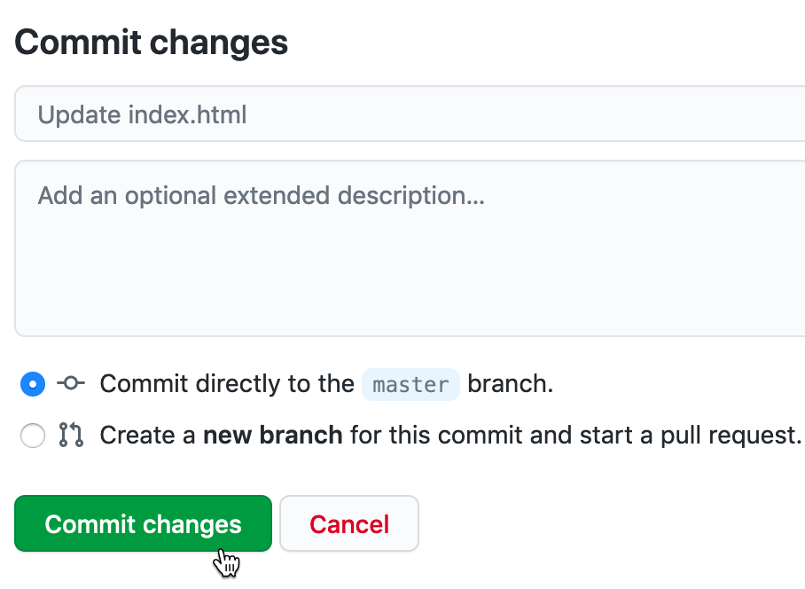
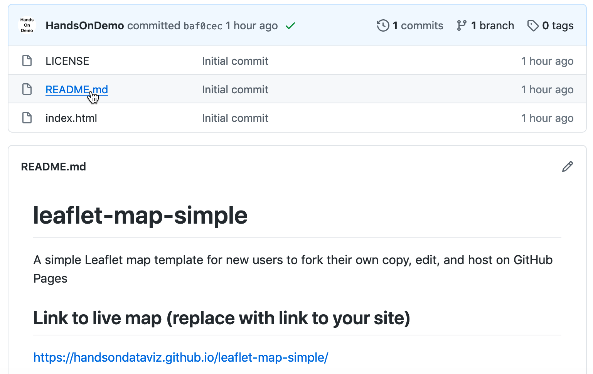
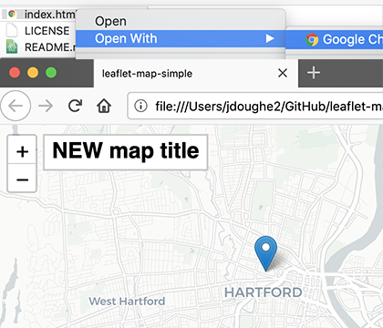
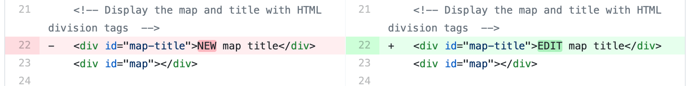

# Edit and Host Code with GitHub {#github}
In the first half of this book, you created interactive charts and maps on free drag-and-drop tool platforms created by companies such as Google and Tableau. These platforms are great for beginners, but their pre-set tools limit your options for designing and customizing your visualizations, and they also require you to depend upon their web servers and terms of service to host your data and work products. If these companies change their tools or terms, you have little choice in the matter, other than deleting your account and switching services, which means that your online charts and maps would appear to audiences as dead links.

In the second half of this book, get ready to make a big leap---and we'll help you through every step---by learning how to copy, edit, and host code templates. These templates are pre-written software instructions that allow you to upload your data, customize its appearance, and display your interactive charts and maps on a web site that you control. No prior coding experience is required, but it helps if you're *code-curious* and willing to experiment with your computer.

Code templates are similar to cookbook recipes. Imagine you're in your kitchen, looking at our favorite recipe we've publicly shared to make brownies (yum!), which begins with these three steps: `Melt butter, Add sugar, Mix in cocoa.` Recipes are templates, meaning that you can follow them precisely, or modify them to suit your tastes. Imagine that you copy our recipe (or "fork" it, as coders say) and insert a new step: `Add walnuts`. If you also publicly share your recipe, now there will be two versions of instructions, to suit both those who strongly prefer or dislike nuts in their brownies. (We do not take sides in this deeply polarizing dispute.)

Currently, the most popular cookbook among coders is [GitHub](https://github.com), with more than 40 million users and over 100 million recipes (or "code repositories" or "repos"). You can sign up for a free account and choose to make your repos private (like Grandma's secret recipes) or public (like the ones we share below). Since GitHub was designed to be public, think twice before uploading any confidential or sensitive information that should not be shared with others. GitHub encourages sharing *open-source code*, meaning the creator grants permission for others to freely distribute and modify it, based on the conditions of the type of license they have selected.

When you create a brand-new repo, GitHub invites you to [Choose a License](https://choosealicense.com/). Two of the most popular open-source software licenses are the [MIT License](https://choosealicense.com/licenses/mit/), which is very permissive, and the [GNU General Public License version 3](https://choosealicense.com/licenses/gpl-3.0/), which mandates that any modifications be shared under the same license. The latter version is often described as a *copyleft* license that requires any derivatives of the original code to remain publicly accessible, in contrast to traditional *copyright* that favors private ownership. When you fork a copy of someone's open-source code on GitHub, look at the type of license they've chosen (if any), keep it in your version, and respect its terms.

To be clear, the GitHub platform is also owned by a large company (Microsoft purchased it in 2018), and when using it to share or host code, you're also dependent on its tools and terms. But the magic of code templates is that you can migrate and host your work anywhere on the web. You could move to a competing repository-hosting service such as [GitLab](http://gitlab.com), or purchase your own domain name and server space through one of many web hosting services. Or you can choose a hybrid option, such as hosting your code on GitHub and choosing its custom domain option, to display it under a domain name that you've purchased from an internet service provider.

In the next section of this chapter, we will introduce basic steps to [copy, edit, and host a simple Leaflet map code template on GitHub](copy-leaflet.html). When you publish any chart or map code template by hosting it on GitHub Pages, you can easily [transform its online link into an iframe](gh-pages-link-to-iframe.html) that you can [embed on a secondary website, which we discussed in Chapter 10](embed.html). Later you'll learn how to [create a new GitHub repo and upload code files](create-repo.html).

This chapter introduces GitHub using its web browser interface, which works best for beginners. Later you'll learn about intermediate-level tools, such as [GitHub Desktop and Atom Editor](github-desktop-atom.html), to work more efficiently with code repos on your personal computer.

If problems arise, turn to the [Fix Common Mistakes](fix.html) section in the appendix. All of us make mistakes and accidentally "break our code" from time to time, and it's a great way to learn how things work---and what to do when it doesn't work!

## Copy, Edit, and Host a Simple Leaflet Map Template {- #copy-leaflet}
Now that you understand how [GitHub](http://github.com) code repositories are like a public cookbook of recipes, which anyone can copy and modify, let's get into the kitchen and start baking! In this section, we'll introduce you to a very simple code template based on [Leaflet](http://leafletjs.com), an open-source code library for creating interactive maps that are very popular in journalism, business, government, and higher education. Many people choose Leaflet because the code is freely available to everyone, relatively easy to use, and has an active community of supporters who regularly update it. But unlike drag-and-drop tools that we previously covered in [Chapter 8: Map Your Data](map.html), working with our Leaflet templates requires you to copy and edit a few lines of code before hosting it on the web. While no prior coding experience is necessary, it's helpful to know that these code templates as based on the three core languages that communicate with browsers: HyperText Markup Language (HTML), Cascading Style Sheets (CSS), and JavaScript. Furthermore, we can edit these code templates using the GitHub web interface, which means you can do this on any type of computer (Mac, Windows, Chromebook, etc.) with any modern web browser.

Here's an overview of the key steps you'll learn about GitHub in this section:

- Make a copy of our simple Leaflet map code template
- Edit the map title, start position, background layer, and marker
- Host a live online version of your modified map code on the public web

Your goal is to create your own version of this simple interactive map, with your edits, as shown in Figure \@ref(fig:leaflet-simple).

(ref:leaflet-simple) Create your own version of this [simple interactive Leaflet map](https://handsondataviz.github.io/leaflet-map-simple/).

```{r leaflet-simple, fig.cap="(ref:leaflet-simple)"}
if(knitr::is_html_output(excludes="markdown")) knitr::include_url("https://handsondataviz.github.io/leaflet-map-simple/") else knitr::include_graphics("images/11-github/leaflet-simple.png")
```

1. Create your own free account on [GitHub](http://github.com). It may ask you to do a simple quiz to prove you're a human! If you don't see a confirmation message in your email, check your spam folder.

Tip: Choose a GitHub username that's relatively short, and one that you'll be happy seeing in the web address of charts and maps you'll publish online. In other words, `DrunkBrownieChef6789` may not be the wisest choice for a username, if `BrownieChef` is also available.

2. After you log into your GitHub account in your browser, go to our simple Leaflet map template at https://github.com/HandsOnDataViz/leaflet-map-simple

3. Click the green *Use this template* button to make your own copy of our repo, as shown in Figure \@ref(fig:leaflet-simple-template).

(ref:leaflet-simple-template) Click *Use this template* to make your own copy.

```{r leaflet-simple-template, fig.cap="(ref:leaflet-simple-template)"}
 knitr::include_graphics("images/11-github/leaflet-simple-template.png")
```

4. On the next screen, your account will appear as the owner. Name your copy of the repo `leaflet-map-simple`, the same as ours, as shown in Figure \@ref(fig:leaflet-simple-name). Click the green *Create repository from template* button.

(ref:leaflet-simple-name) Name your copied repo `leaflet-map-simple`.

```{r leaflet-simple-name, out.width=600, fig.cap="(ref:leaflet-simple-name)"}
 knitr::include_graphics("images/11-github/leaflet-simple-name.png")
```

Note: We set up our repo using GitHub's template feature to make it easier for users to create their own copies. If you're trying to copy someone else's GitHub repo and don't see a *Template* button, then click the *Fork* button, which makes a copy a different way. Here's the difference: *Template* allows you to make *multiple* copies of the same repo by giving them different names, while *Fork* allows you to create *only one copy* of a repo because it uses the same name as the original, and GitHub prevents you from creating two repos with the same name. If you need to create a second fork of a GitHub repo, go to the [Create a New Repo and Upload Files on GitHub](create-repo.html) section of this chapter.

The upper-left corner of the next screen will say `USERNAME/leaflet-map-simple` generated from `HandsOnDataViz/leaflet-map-simple`, where `USERNAME` refers to your GitHub account username. This confirms that you copied our template into your GitHub account, and it contains only three files:

- `LICENSE` shows that we've selected the MIT License, which allows anyone to copy and modify the code as they wish.
- `README.md` provides a simple description and link to the live demo, which we'll come back to later.
- `index.html` is the key file in this particular, because it contains the map code.

5. Click on the `index.html` file to view the code, as shown in Figure \@ref(fig:leaflet-simple-index).

(ref:leaflet-simple-index) Click the index.html file to view the code.

```{r leaflet-simple-index, out.width=200, fig.cap="(ref:leaflet-simple-index)"}
 knitr::include_graphics("images/11-github/leaflet-simple-index.png")
```

If this is the first time you're looking at computer code, it may feel overwhelming, but relax! We've inserted several "code comments" to explain what's happening. The first block tells web browsers the formatting to read the rest of the page of code. The second block instructs the browser to load the [Leaflet](http://leafletjs.com) code library, the open-source software that constructs the interactive map. The third block describes where the map and title should be positioned on the screen. The good news is that you don't need to touch any of those blocks of code, so leave them as-is. But you do want to modify a few lines further below.

6. To edit the code, click on the the pencil symbol in the upper-right corner, as shown in Figure \@ref(fig:leaflet-simple-edit).

(ref:leaflet-simple-edit) Click the pencil button to edit the code.

```{r leaflet-simple-edit, fig.cap="(ref:leaflet-simple-edit)"}
 knitr::include_graphics("images/11-github/leaflet-simple-edit.png")
```

Let's start by making one simple change to prove to everyone that you're now editing *your* map, by modifying the map title, which appears in the HTML division tag block around lines 21-23.

7. In this line `<div id="map-title">EDIT your map title</div>`, type your new map title in place of the words `EDIT your map title`. Be careful not to erase the HTML tags that appear on both ends inside the `< >` symbols.

8. To save your edit, scroll to the bottom of the page and click the green *Commit Changes* button, as shown in Figure \@ref(fig:leaflet-simple-commit).

(ref:leaflet-simple-commit) Click the green *Commit Changes* button to save your edits.

```{r leaflet-simple-commit, out.width=450, fig.cap="(ref:leaflet-simple-commit)"}
 
```

In the language of coders, we "commit" our changes in the same way that most people "save" a document, and later you'll see how GitHub tracks each code commit so that you can roll them back if needed. By default, GitHub inserts a short description of your commit as "Update index.html", and you have the option to customize that description when you start making lots of commits to keep track of your work. Also, GitHub commits your changes directly to the default branch of your code, which we'll explain later.

Now let's publish your edited map to the public web to see how it looks in a web browser. GitHub not only stores open-source code, but its built-in [GitHub Pages](https://pages.github.com/) feature allows you to host a live online version of your HTML-based code, which anyone with the web address can view in their browser. While GitHub Pages is free to use, there are [some restrictions on usage, file size, and content](https://help.github.com/en/github/working-with-github-pages/about-github-pages) and it is not intended for running an online business or commercial transactions. But one advantage of code templates is that you can host them on any web server you control. Since we're already using GitHub to store and edit our code template, it's easy to turn on GitHub Pages to host it online.

Tip: If you wish to store your code on GitHub but need to scale up to a larger commercial-level web host, see freemium services such as [Netlify](https://www.netlify.com), which automatically detects any changes you push to your GitHub repository, then deploys them to your online site.

9. To access GitHub Pages, scroll to the top of your repo page and click the *Settings* button as shown in Figure \@ref(fig:leaflet-simple-settings).

(ref:leaflet-simple-settings) Click the *Settings* button to access GitHub Pages and publish your work on the web.

```{r leaflet-simple-settings, fig.cap="(ref:leaflet-simple-settings)"}
 knitr::include_graphics("images/11-github/leaflet-simple-settings.png")
```

10. In the Settings screen, scroll way down to the GitHub Pages area. In the drop-down menu, change *Source* from *None* to *Main*, keep the default */(root)* option in the middle, and press *Save* as shown in Figure \@ref(fig:leaflet-github-pages-main). This step tells GitHub to publish a live version of your map on the public web, where anyone can access it in their browser, if they have the web address.

(ref:leaflet-github-pages-main) In *Settings*, go to *GitHub Pages*, and switch the source from *None* to *Main*.

```{r leaflet-github-pages-main, out.width=300, fig.cap="(ref:leaflet-github-pages-main)"}
knitr::include_graphics("images/11-github/leaflet-github-pages-main.png")
```

Tip: In response to the Black Lives Matter movement in 2020, [GitHub renamed its default branch](https://github.com/github/renaming) from *master* to *main* to eliminate its master-slave metaphor.

11. Scroll back down to *Settings > GitHub Pages* to see the web address where your live map has been published online, and right-click it to open in a new browser tab, as shown in Figure \@ref(fig:leaflet-github-pages-link).

(ref:leaflet-github-pages-link) In *Settings* for *GitHub Pages*, right-click your published map link to open in a new tab.

```{r leaflet-github-pages-link, out.width=600, fig.cap="(ref:leaflet-github-pages-link)"}
knitr::include_graphics("images/11-github/leaflet-github-pages-link.png")
```

Now you should have at least two tabs open in your browser. The first tab contains your GitHub repo, where you edit your code, with a web address in this format, and replace `USERNAME` and `REPOSITORY` with your own:

`https://github.com/USERNAME/REPOSITORY`

The second tab contains your GitHub Pages live website, where your edited code appears online. GitHub Pages automatically generates a public web address in this format:

`https://USERNAME.github.io/REPOSITORY`

Remember how we told you not to create your account with a username like `DrunkBrownieChef6789`? GitHub automatically places your username automatically in the public web address.

Keep both tabs open so you can easily go back and forth between editing your code and viewing the live results online.

Note: The live version of your code points to the `index.html` page by default, so it's not necessary to include it in the web address. Also, web addresses are *not* case sensitive, meaning you can save time by typing all of it in lower-case.

Tip: If your live map does *not* appear right away, wait up to 30 seconds for GitHub Pages to finish processing your edits. Then give your browser a "hard refresh" to [bypass any saved content in your cache](https://en.wikipedia.org/wiki/Wikipedia:Bypass_your_cache) and re-download the entire web page from the server, using one of these key combinations:

  - Ctrl + F5 (most browsers for Windows or Linux)
  - Command + Shift + R (Chrome or Firefox for Mac)
  - Shift + Reload button toolbar (Safari for Mac)
  - Ctrl + Shift + Backspace (on Chromebook)

Now let's edit your the GitHub repo so that the link points to *your* live map, instead of *our* live map.

12. Copy the web address of your live map from your second browser tab.

13. Go back to your first browser tab with your GitHub repo, and click on the repo title to return to its home page, as shown in Figure \@ref(fig:leaflet-click-title).

(ref:leaflet-click-title) On your first browser tab, click the repo title.

```{r leaflet-click-title, out.width=450, fig.cap="(ref:leaflet-click-title)"}
 knitr::include_graphics("images/11-github/leaflet-click-title.png")
```

14. On your repo page, click to open the `README.md` file, and click the pencil again to edit it, as shown in Figure \@ref(fig:leaflet-paste-link). Paste your live web link under the label *(replace with link to your site)* and scroll down to commit the change.

(ref:leaflet-paste-link) Open and edit the `README` file to paste the link to your live map.

```{r leaflet-paste-link, out.width=600, fig.cap="(ref:leaflet-paste-link)"}
 
```

Now that you've successfully made simple edits and published your live map, let's make more edits to jazz it up and help you learn more about how Leaflet code works.

15. On your repo home page, click to open the `index.html` file, and click the pencil symbol to edit more code.

Wherever you see the `EDIT` code comment, this points out a line that you can easily modify. For example, look for the code block shown below that sets up the initial center point of the map and its zoom level. Insert a new latitude and longitude coordinate to set a new center point. To find coordinates, right-click on any point in [Google Maps](https://google.com/maps) and select *What's here?*, as described in the [geocoding section in Chapter 3](geocode.html).

```
  var map = L.map('map', {
    center: [41.77, -72.69], // EDIT latitude, longitude to re-center map
    zoom: 12,  // EDIT from 1 to 18 -- decrease to zoom out, increase to zoom in
    scrollWheelZoom: false
  });
```

The next code block displays the basemap tile layer that serve as the map background. Our template uses a light map with all labels, publicly provided by CARTO, with credit to OpenStreetMap. One simple edit is to change `light_all` to `dark_all`, which will substitute a different CARTO basemap with inverted coloring. Or see many other Leaflet basemap code options that you can paste in at https://leaflet-extras.github.io/leaflet-providers/preview/. Make sure to attribute the source, and also keep `}).addTo(map);` at the end of this code block, which displays the basemap.

```
 L.tileLayer('https://{s}.basemaps.cartocdn.com/light_all/{z}/{x}/{y}{r}.png', {
   attribution: '&copy; <a href="http://www.openstreetmap.org/copyright">OpenStreetMap</a>,
   &copy; <a href="https://carto.com/attribution">CARTO</a>'
 }).addTo(map);
```

The last code block displays a single point marker on the map, colored blue by default in Leaflet, with a pop-up message when users click it. You can edit the marker coordinates, insert the pop-up text, or copy and paste the code block to create a second marker.

```
L.marker([41.77, -72.69]).addTo(map) // EDIT latitude, longitude to re-position marker
.bindPopup("Insert pop-up text here"); // EDIT pop-up text message
```

Warning: Be careful when editing your code. Accidentally removing or adding extra punctuation (such as quotation marks, commas, or semicolons) can stop your map from working. But breaking your code---and fixing it---can also be a great way to learn.

15. After making edits, remember to scroll down and press the *Commit* button to save changes. Then go to your browser tab with the live map, and do a hard-refresh to view changes. If your map edits do not appear right away, remember that GitHub Pages sometimes requires up to 30 seconds to process code edits. If you have problems, see the [Fix Common Mistakes](fix.html) section in the appendix.

Congratulations! If this is the first time that you've edited computer code and hosted it online, you can now call yourself a "coder". The process is similar to following and modifying a cookbook recipe, just like you also can call yourself a "chef" after baking your first batch of brownies! Although no one is likely to hire you as a full-time paid coder (or chef) at this early stage, you now understand several of the basic skills needed to copy, edit, and host code online, and you're ready to dive into the more advanced versions, such as [Chart.js and Highcharts templates in Chapter 12](chartcode.html) and [Leaflet map templates in Chapter 13](leaflet.html).

## Convert GitHub Pages Link to iframe {- #gh-pages-link-to-iframe}
In [Chapter 10: Embed on the Web](embed.html), we discussed the benefits of displaying interactive content from a primary site and making it appear seamlessly in a secondary site. You also learned how to convert very long Datawrapper and Tableau Public embed codes into shorter iframe tags when needed, so that you can embed them more easily on a secondary website.

The same concept applies to GitHub Pages. When you publish a code template for a chart or map (or any content) on GitHub Pages, it generates an online link that you can convert into an iframe tag, using the same principles as above, to embed it on a secondary website. Follow these steps:

1. For any GitHub repository you have published online, go to its *Settings* page and scroll down to copy its GitHub Pages web address, which will appear in this general format:

`https://USERNAME.github.io/REPOSITORY`

2. Convert it into an iframe by enclosing the link inside quotation marks as the source, and adding both start and end tags, in this general format:

`<iframe src="https://USERNAME.github.io/RESPOSITORY"></iframe>`

3. If desired, improve the iframe appearance on the secondary site by adding any of these optional attributes, such as `width` or `height` (measured in pixels by default, or percentages), or `seamless` or `frameborder="0"` or `scrolling="no"`, in this general format:

`<iframe src="https://USERNAME.github.io/RESPOSITORY" width="100%" height="400" seamless frameborder="0" scrolling="no"></iframe>`

Hint: Either single-quote (`'`) marks (also called an apostrophe) or double-quote (`"`) marks are acceptable in your iframe code, but be consistent and avoid accidentally pasting in curly-quotes.

Now you are ready to [paste your iframe into your preferred website](paste-code.html), using methods described in Chapter 10, to display your interactive chart or map template from published repository using GitHub Pages.

Now you should have a better sense of how to edit and host code repositories on GitHub. The next section describes how to enhance your GitHub skills by creating new repos and uploading your files. These are essential steps to create a second copy of a code template or to work with more advanced templates in the next two chapters.

## Create a New Repo and Upload Files on GitHub {- #create-repo}
Now that you've made a copy of our GitHub template, the next step is to learn how to create a brand-new repo and upload files. These skills will be helpful for several scenarios. First, if you have to fork a repo, which GitHub allows you to do only one time, this method will allow you to create additional copies. Second, you'll need to upload some of your own files when creating data visualizations using [Chart.js and Highcharts templates in Chapter 12](chartcode.html) and [Leaflet map templates in Chapter 13](leaflet.html). Once again, we'll demonstrate how to do all of these steps in GitHub's beginner-level browser interface, but see the next section on [GitHub Desktop](github-desktop-atom.html) for an intermediate-level interface that's more efficient for working with code templates.

In the previous section, you created a copy of our GitHub repo with the *Use this template* button, and we intentionally set up our repos with this newer feature because it allows the user to make *multiple* copies and assign each one a different name. Many other GitHub repos do not include a *Template* button, so to copy those you'll need to click the *Fork* button, which automatically generates a copy with the same repo name as the original. But what if you wish to fork someone's repo a second time? GitHub prevents you from creating a second fork to avoid violating one of its important rules: every repo in your account must have a unique name, to avoid overwriting and erasing your work.

So how do you make a second fork of a GitHub repo, if there's no *Use this template* button? Follow our recommended workaround that's summarized in these three steps:

- Download the existing GitHub repo to your local computer
- Create a brand-new GitHub repo with a new name
- Upload the existing code repo files to your brand-new repo

1. Click on the *Code > Download Zip* drop-down menu button on any repo, as shown in Figure \@ref(fig:repo-code-download). Your browser will download a zipped compressed folder with the contents of the repo to your local computer, and it may ask you where you wish to save it. Decide on a location and click OK.

(ref:repo-code-download) Click *Code* and select *Download Zip* to create a compressed folder of a repo on your computer.

```{r repo-code-download, out.width=350, fig.cap="(ref:repo-code-download)"}
 knitr::include_graphics("images/11-github/repo-code-download.png")
```

2. Navigate to the location on your computer where you saved the folder. Its file name should end with `.zip`, which means you need to double-click to "unzip" or de-compress the folder. After you unzip it, a new folder will appear named in this format, `REPOSITORY-BRANCH`, which refers to the repository name (such as `leaflet-map-simple`) and the branch name (such as `main`), and it will contain the repo files. One of those files is named `index.html`, which you'll use in a few steps below.

3. Go back to your GitHub account in your web browser, click on the plus (+) symbol in the upper-right corner of your account, and select *New repository*, as shown in Figure \@ref(fig:repo-create-new).

(ref:repo-create-new) Click the plus (+) symbol in upper-right corner to create a new repo.

```{r repo-create-new, out.width=300, fig.cap="(ref:repo-create-new)"}
 knitr::include_graphics("images/11-github/repo-create-new.png")
```

4. On the next screen, GitHub will ask you to enter a new repo name. Choose a short one, preferably all lower-case, and separate words with hyphens if needed. Let's name it `practice` because we'll delete it at the end of this tutorial.

Check the box to *Initialize this repository with a README* to simplify the next steps.

Also, select *Add a license* that matches the code you plan to upload, which in this case is *MIT License*. Other fields are optional. Click the green *Create Repository* button at the bottom when done, as shown in Figure \@ref(fig:repo-create-options).

(ref:repo-create-options) Name your new repo *practice*, check the box to *Initialize this repo with a README*, and *Add a license* (select *MIT*) to match any code you plan to upload.

```{r repo-create-options, out.width=400, fig.cap="(ref:repo-create-options)"}
 knitr::include_graphics("images/11-github/repo-create-options.png")
```

Your new repo will have a web address similar to `https://github.com/USERNAME/practice`.

5. On your new repo home page, click the *Add File > Upload Files* drop-down menu button, near the middle of the screen, as shown in Figure \@ref(fig:repo-upload-files).

(ref:repo-upload-files) Click the *Upload Files* button.

```{r repo-upload-files, out.width=350, fig.cap="(ref:repo-upload-files)"}
 knitr::include_graphics("images/11-github/repo-upload-files.png")
```

6. Inside the repo folder that you previously downloaded and unzipped on your local computer, drag-and-drop the `index.html` file to the upload screen of your GitHub repo in your browser, as shown in Figure \@ref(fig:repo-drag-index). Do not upload `LICENSE` or `README.md` because your new repo already contains those two files. Scroll down to click the green *Commit Changes* button.

(ref:repo-drag-index) Drag-and-drop the `index.html` file to the upload screen.

```{r repo-drag-index, fig.cap="(ref:repo-drag-index)"}
 knitr::include_graphics("images/11-github/repo-drag-index-annotated.png")
```

When the upload is complete, your repo should contain three files, now including a copy of the `index.html` code that you previously downloaded from the `leaflet-map-simple` template. This achieved our goal of working around GitHub's one-fork rule, by creating a new repo and manually uploading a second copy of the code.

Optionally, you could use GitHub Pages to publish a live version of the code online, and paste the links to the live version at the top of your repo and your README.md file, as described in the [Copy, Edit, and Host a Simple Leaflet Map Template](copy-leaflet.html) section of this chapter.

7. Since this was only a `practice` repo, let's delete it from GitHub. In the repo screen of your browser, click the top-right *Settings* button, scroll all the way down to the *Danger Zone*, and click *Delete this repository*, as shown in Figure \@ref(fig:repo-delete). GitHub will ask you to type in your username and repo name to ensure that you really want to delete the repo, to prove you are not a drunken brownie chef.

(ref:repo-delete) After clicking the Delete Repository button, GitHub will ask you to type your username and repo name to confirm.

```{r repo-delete, out.width=600, fig.cap="(ref:repo-delete)"}
 knitr::include_graphics("images/11-github/repo-delete.png")
```

So far, you've learned how to copy, edit, and host code using the GitHub web interface, which is a great introduction for beginners. Now you're ready to move up to tools that will allow you to work more efficiently with GitHub, such as GitHub Desktop and Atom Editor, to quickly move entire repos to your local computer, edit the code, and move them back online.

## GitHub Desktop and Atom Editor to Code Efficiently {- #github-desktop-atom}
Editing your code through the GitHub web interface is a good way to start, especially if you only need to make a few edits or upload a couple of files to your repo. But the web interface will feel very slow if you edit or upload multiple files in your repo. To speed up your work, we recommend that you download two free tools---[GitHub Desktop](https://desktop.github.com) and [Atom Text Editor](https://atom.io)---which run on Mac or Windows computers. When you connect your GitHub web account to GitHub Desktop, it allows you to "pull" the most recent version of the code to your local computer's hard drive, make and test your edits, and "push" your commits back to your GitHub web account. Atom Text Editor, which is also created by the makers of GitHub, allows you to view and edit code repos on your local computer more easily than the GitHub web interface. While there are many text editors for coders, Atom is designed to work well with GitHub Desktop.

Tip: Currently, neither GitHub Desktop nor Atom Editor are supported for Chromebooks, but [Google's Web Store](https://chrome.google.com/webstore) offers several text editors, such as Text and Caret, which offer some of the functionality described below.

Let's use GitHub Desktop to pull a copy of your `leaflet-map-simple` template to your local computer, make some edits in Atom Editor, and push your commits back up to GitHub.

1. Go to the GitHub web repo you wish to copy to your local computer. In your browser, navigate to `https://github.com/USERNAME/leaflet-map-simple`, using your GitHub username, to access the repo you created in the [Copy, Edit, and Host a Simple Leaflet Map Template](copy-leaflet.html) section of this chapter. Click the *Code > Open with GitHub Desktop* drop-down menu button near the middle of your screen, as shown in Figure \@ref(fig:desktop-open). The next screen will show a link to the GitHub Desktop web page, and you should download and install the application.

(ref:desktop-open) In your GitHub repo on the web, click *Code* to *Open with GitHub Desktop* to download and install GitHub Desktop.

```{r desktop-open, out.width=350, fig.cap="(ref:desktop-open)"}
 knitr::include_graphics("images/11-github/desktop-open.png")
```

2. When you open GitHub Desktop for the first time, you'll need to connect it to the GitHub web account you previously created in this chapter. On the welcome screen, click the blue *Sign in to GitHub.com* button, as shown in Figure \@ref(fig:desktop-signin), and login with your GitHub username and password. On the next screen, GitHub will ask you to click the green *Authorize desktop* button to confirm that you wish to connect to your account.

(ref:desktop-signin) Click the blue *Sign in to GitHub.com* button to link GitHub Desktop to your GitHub account.

```{r desktop-signin, out.width=500, fig.cap="(ref:desktop-signin)"}
 knitr::include_graphics("images/11-github/desktop-signin.png")
```

3. In the next setup screen, GitHub Desktop asks you to configure Git, the underlying software that runs GitHub. Confirm that it displays your username and click *Continue*, as shown in Figure \@ref(fig:desktop-configure).

(ref:desktop-configure) Click the *Continue* button to authorize GitHub Desktop to send commits to your GitHub account.

```{r desktop-configure, out.width=500, fig.cap="(ref:desktop-configure)"}
 knitr::include_graphics("images/11-github/desktop-configure.png")
```

4. On the "Let's Get Started" with GitHub Desktop screen, click on *Your Repositories* on the right side to select your `leaflet-map-sample`, and further below click the blue button to *Clone* it to your local computer, as shown in Figure \@ref(fig:desktop-start).

(ref:desktop-start) Select your *leaflet-map-simple* repo and click the *Clone* button to copy it to your local computer.

```{r desktop-start, fig.cap="(ref:desktop-start)"}
 knitr::include_graphics("images/11-github/desktop-start-annotated.png")
```

5. When you clone a repo, GitHub Desktop asks you to select the Local Path, meaning the location where you wish to store a copy of your GitHub repo on your local computer, as shown in Figure \@ref(fig:desktop-clone-path). Before you click the *Clone* button, remember the path to this location, since you'll need to find it later.

(ref:desktop-clone-path) Select the Local Path where your repo will be stored on your computer, then click *Clone*.

```{r desktop-clone-path, out.width=500, fig.cap="(ref:desktop-clone-path)"}
 knitr::include_graphics("images/11-github/desktop-clone-path.png")
```

6. On the next screen, GitHub Desktop may ask, "How are you planning to use this fork?" Select the default entry "To contribute to the parent project," which means you plan to send your edits back to your GitHub web account, and click *Continue*, as shown in Figure \@ref(fig:desktop-fork).

(ref:desktop-fork) If asked how you plan to use this fork, select the default *To contribute to the parent project* and click *Continue*.

```{r desktop-fork, out.width=500, fig.cap="(ref:desktop-fork)"}
 knitr::include_graphics("images/11-github/desktop-fork.png")
```

7. Now you have copies of your GitHub repo in two places---in your GitHub web account and on your local computer---as shown in Figure \@ref(fig:desktop-finder). Your screen may look different, depending on whether you use Windows or Mac, and the Local Path you selected to store your files.

(ref:desktop-finder) Now you have two copies of your repo: in your GitHub online account (on the left) and on your local computer (on the right, as shown in the Mac Finder). Windows screens will look different.

```{r desktop-finder, out.width=500, fig.cap="(ref:desktop-finder)"}
 knitr::include_graphics("images/11-github/desktop-finder.png")
```

8. Before we can edit the code in your local computer, [download and install the Atom Editor application](https://atom.io). Then go to your GitHub Desktop screen, confirm that the Current Repository is `leaflet-map-simple`, and click the *Open in Atom* button as shown in Figure \@ref(fig:desktop-atom).

(ref:desktop-atom) In GitHub Desktop, confirm the Current Repo and click the *Open in Atom* button to edit the code.

```{r desktop-atom, fig.cap="(ref:desktop-atom)"}
 knitr::include_graphics("images/11-github/desktop-atom-annotated.png")
```

9. Since Atom Editor is integrated with GitHub Desktop, it opens up your entire repo as a "project," where you can click files in the left window to open as new tabs to view and edit code, as shown in Figure \@ref(fig:atom-project). Open your `index.html` file and edit the title of your map, around line 22, then save your work.

(ref:atom-project) Atom Editor opens your repo as a *project*, where you can click files to view code. Edit your map title.

```{r atom-project, fig.cap="(ref:atom-project)"}
 knitr::include_graphics("images/11-github/atom-project-annotated.png")
```

10. After saving your code edit, it's a good habit to clean up your Atom Editor workspace. Right-click on the current Project and select *Remove Project Folder* in the menu, as shown in Figure \@ref(fig:atom-remove-project). Next time you open up Atom Editor, you can right-click to *Add Project Folder*, and choose any GitHub repo that you have copied to your local computer.

(ref:atom-remove-project) To clean up your Atom Editor workspace, right-click to *Remove Project Folder*.

```{r atom-remove-project, fig.cap="(ref:atom-remove-project)"}
 knitr::include_graphics("images/11-github/atom-remove-project-annotated.png")
```

11. Now that you've edited the code for your map on your local computer, let's test how it looks before uploading it to GitHub. Go to the location where you saved the repo on your local computer, and right-click the `index.html` file, select Open With, and choose your preferred web browser, as shown in Figure \@ref(fig:finder-open-with).  

(ref:finder-open-with) Right-click the index.html file on your local computer and open with a browser to check your edits.

```{r finder-open-with, fig.cap="(ref:finder-open-with)"}
 
```

Note: Since your browser is displaying only the *local computer* version of your code, the web address will begin with `file:///...` rather than `https://...`, as appears in your GitHub Pages online map. Also, if your code depends on online elements, those features may not function when viewing it locally. But for this simple Leaflet map template, your updated map title should appear, allowing you to check its appearance before pushing your edits to the web.

Warning: To fully view more complex code templates in your local browser, including some [Chart.js or Highcharts templates in Chapter 12](chartcode.html) or [Leaflet templates in Chapter 13](leaflet.html), you may need to temporarily disable [Cross-Origin Resource Sharing](https://en.wikipedia.org/wiki/Cross-origin_resource_sharing) (CORS) restrictions, an internet security mechanism that limits how web pages access content from other domains. Methods for doing this vary across operating systems and browsers. For example, [to disable CORS on Safari for Mac](https://stackoverflow.com/questions/4556429/disabling-same-origin-policy-in-safari), first go to *Preferences > Advanced* to enable the *Developer* menu, then in this new menu select *Disable Cross-Origin Restrictions*. After you are done testing your code, restart Safari to reset the setting to its default safety position. See also ways to [run the Chrome browser without CORS on various computers](https://alfilatov.com/posts/run-chrome-without-cors/) or this [popular Stackoverflow page](https://stackoverflow.com/questions/3102819/disable-same-origin-policy-in-chrome). If you temporarily disable this safety mechanism in your browser, be sure to re-enable it before browsing sites on the public web.

Now let's transfer your edits from your local computer to your GitHub web account, which you previously connected when you set up GitHub Desktop.

11. Go to GitHub Desktop, confirm that your Current Repo is `leaflet-map-simple`, and you will see your code edits summarized on the screen. In this two-step process, first click the blue *Commit* button at the bottom of the page to save your edits to your local copy of your repo. (If you edit multiple files, GitHub Desktop will ask you write a summary of your edit, to help you keep track of your work.) Second, click the blue *Push origin* button to transfer those edits to the parent copy of your repo on your GitHub web account. Both steps are shown in Figure \@ref(fig:desktop-commit-push).

(ref:desktop-commit-push) In this two-step process, click *Commit*, then click *Push origin* to save and copy your edits from your local computer to your GitHub web account, as shown in this [animated GIF](https://handsondataviz.org/images/11-github/desktop-commit-push.gif).

```{r desktop-commit-push, fig.cap="(ref:desktop-commit-push)"}
if(knitr::is_html_output(excludes="markdown")) knitr::include_url("images/11-github/desktop-commit-push.gif", height = "500px") else knitr::include_graphics("images/11-github/desktop-commit-push-annotated.png")
```

Congratulations! You've successfully navigated a round-trip journey of code, from your GitHub account to your local computer, and back again to GitHub. Since you previously used the GitHub Pages settings to create an online version of your code, go see if your edited map title now appears on the public web. The web address you set up earlier follows this format `https://USERNAME.github.io/REPOSITORY`, substituting your GitHub username and repo name.

While you could have made the tiny code edit above in the GitHub web interface, hopefully you've begun to see many advantages of using GitHub Desktop and Atom Editor to edit code and push commits from your local computer. First, you can make more complex code modifications with Atom Editor, which includes search, find-and-replace, and other features to work more efficiently. Second, when you copy the repo to your local computer, you can quickly drag-and-drop multiple files and subfolders for complex visualizations, such as data, geography, and images. Third, depending on the type of code, you may be able to test how it works locally with your browser, before uploading your commits to the public web.

Tip: Atom Editor has many built-in features that recognize and help you edit code, plus the option to install more [packages](https://atom.io/packages) in the Preferences menu. One helpful built-in tool is *Edit > Toggle Comments*, which automatically detects the coding language and converts the selected text from executable code to non-executed code comments. Another built-in tool is *Edit > Lines > Auto Indent*, which automatically cleans up selected text or an entire page of code for easier reading.

GitHub also offers a powerful platform for collaborative projects. When two people work on a shared repository, one co-worker can "pull" the most recent version of the code to their local computer using GitHub Desktop, then "push" their edits (also called commits) back to the online GitHub repo. The other co-worker can "pull" and "push" from the same repo at the same time, though it's simpler if they work on different files or sections of code. Both can see the changes that the other person made by selecting the GitHub repo *Code* tab and selecting a specific commit, which can be viewed line-by-line in green (additions) or red (deletions), as shown in Figure \@ref(fig:compare-commits).

(ref:compare-commits) View commits made by co-workers on a shared GitHub repo.

```{r compare-commits, out.width=750, fig.cap="(ref:compare-commits)"}
 
```

Although GitHub does not operate like Google Documents, which displays live edits, the platform has several advantages when working collaboratively with code. First, since GitHub tracks every commit, it allows you to go back and restore a very specific past version of the code if needed. Second, when GitHub repos are public, anyone can view your code and submit an "issue" to notify the owner about an idea or problem, or send a "pull request" of suggested code edits, which the owner can accept or reject. Third, GitHub allows you to create different "branches" of a repo in order to make edits, and then "merge" the branches back together if desired. Occasionally, if two collaborators attempt to push incompatible commits to the same repo, GitHub will warn about a "Merge Conflict" and ask you to resolve it in order to preserve everyone's work.

Many coders prefer to work on GitHub using its Command Line Interface (CLI), which means memorizing and typing specific commands directly into the Terminal application on Mac or Windows, but this is beyond the scope of this introductory book.

### Summary {- #summary11}
If this is the first time you've forked, edited, and hosted live code on the public web, welcome to the coding family! We hope you agree that GitHub is a powerful platform for engaging in this work and sharing with others. While beginners will appreciate the web interface, you'll find that the GitHub Desktop and Atom Editor tools makes it much easier to work with [Chart.js and Highcharts code templates in Chapter 12](chartcode.html) and the [Leaflet map code templates in Chapter 13](leaflet.html). Let's build on your brand-new coding skills to create more customized charts and maps in the next two chapters.
