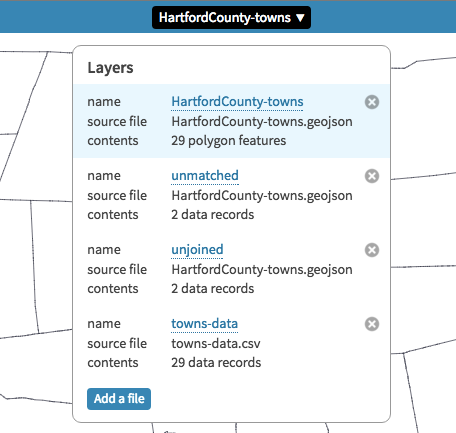

# Transform Your Map Data {#transform}
Interactive web maps are made up of different layers, such as background basemaps, colored or shaded polygons, and/or colored point markers. This chapter describes how to transform your data into layers that you can upload into online map tools and templates. Specifically, you will learn how to:

- [Geocode locations into coordinates with US Census or Google](geocode.html)
- [Pivot address-level point data into polygon data](pivot-point-to-polygon.html)
- [Normalize data to create more meaningful polygon maps](normalize.html)
- [Convert map data](convert-geojson.html) with [GeoJSON.io](geojsonio.html) or [Mapshaper.org](mapshaper.html)
- [Join spreadsheets and polygon boundaries with MapShaper.org](mapshaper.html)

Enroll in our free online course **TO DO add link**, which introduces these topics in the brief video below, and offers more exercises and opportunities to interact with instructors and other learners.

<iframe width="560" height="315" src="https://www.youtube.com/embed/3sjjVEJY4MY?rel=0" frameborder="0" allow="autoplay; encrypted-media" allowfullscreen></iframe>

## Geocode Locations into Coordinates with US Census or Google {- #geocode}
Many free map tools geocode locations by placing them on a map, such as [Google My Maps tutorials](mymaps.html) in this book. But those tools typically do not allow you to easily extract the latitude-longitude coordinates for each point.

We created two free Google Sheets Geocoder scripts that have several advantages:

- convert locations (Hartford CT) or addresses (300 Summit St, Hartford CT) into latitude-longitude coordinates (41.748, -72.692) inside your Google Sheet
- show the location found in the geocoding database, and match quality, to review your results
- convert US addresses into US Census geography, such as census tracts, block groups, and blocks

As with any geocoding service, accuracy is not guaranteed. Inspect your results in the Found and Quality columns.

#### Google Sheets Geocoder: US Census or Google {-}
- Geocode locations into latitude, longitude, with source and match quality, inside a Google Sheet
- Go to Google Sheet template, sign in to your account, and File > Make a Copy to your Google Drive <https://docs.google.com/spreadsheets/d/1XvtkzuVyQ_7Ud47ypDJ4KOmz_5lOpC9sqeEDBbJ5Pbg/edit#gid=0>
- Insert locations, select 6 columns, and select Geocoder menu: US Census or Google (limit 1000 daily per user)
- Google Sheets script will ask for permission to run the first time
- Note: The [Leaflet Maps with Google Sheets template](leaflet-maps-with-google-sheets.html) in this book includes this Geocoder script.

```{r googlesheets-geocoder, fig.cap="Screencast: Google Sheets Geocoder: US Census or Google"}
if(knitr::is_html_output()) knitr::include_url("images/11-transform/google-sheets-geocoder-census-google.gif") else knitr::include_graphics("images/placeholder.jpg")
```

#### Google Sheets Geocoder: US Census Geographies {-}
- Geocode US addresses into latitude, longitude, GeoID, census tract, inside a Google Sheet
- Go to Google Sheet template, sign in to your account, and File > Make a Copy to your Google Drive
https://docs.google.com/spreadsheets/d/1x_E9KwZ88c_kZvhZ13IF7BNwYKTJFxbfDu77sU1vn5w/edit#gid=0
- Insert locations, select 8 columns, and select Geocoder menu: US Census 2010 Geographies
- Google Sheets script will ask for permission to run the first time

```{r googlesheets-geocoder2, fig.cap="Screencast: Google Sheets Geocoder: US Census Geographies"}
if(knitr::is_html_output()) knitr::include_url("images/11-transform/google-sheets-geocoder-census-geographies.gif") else knitr::include_graphics("images/placeholder.jpg")
```

##### About US Census 15-character GeoID {-}
- Make sure that column G is formatted as text (to preserve leading zeros), not number
- Break down a sample GeoID: 090035245022001
  - state = 09
  - county = 003
  - tract = 524502 = 5245.02
  - block group = 2
  - block = 001

##### How it works {-}
The Google Sheet Geocoder runs from a script insert in the Google Sheet, which calls one of two free geocoding services:

- US Census Geocoder https://geocoding.geo.census.gov/geocoder. See more detailed documentation at http://www.census.gov/geo/maps-data/data/geocoder.html
- Geocode with Google Apps: The Maps Service of Google Apps allows users to geocode street addresses without using the Google Maps API, with a limit of 1,000 searches daily per user, https://developers.google.com/apps-script/reference/maps/geocoder

##### How to insert the Geocoder Script into any Google Sheet {-}
If you do not wish to File > Make a Copy of the Google Sheet templates above, you can insert the open-source Geocoder Scripts into your own Google Sheet:

- Go to [Google Sheets Geocoder repo on GitHub](https://github.com/handsondataviz/google-sheets-geocoder)
- Sign in to your Google Sheets, then select Tools > Script Editor
- File > Create New Script File
- Open and copy a script (such as geocoder-census-google.gs) and paste into your Script Editor
- Save and rename to geocoder-census-google.gs
- Refresh your Google Sheet and look for new Geocoder menu

##### TODO {-}
- Also describe and link back how to split columns to form multi-columns addresses
- also describe and link back to how to unify columns to form a one-column address
- add this https://developers.google.com/maps/faq#geocoder_queryformat

#### See also: Batch upload to US Census {-}
- Available at US Census Geocoder https://geocoding.geo.census.gov/geocoder/
- Upload CSV table with up to 1000 rows for faster processing, in this format, WITHOUT column headers:

| AnyID  | Street | City | State | Zip   |
| :----- | :----- | :--- | :---- | : --- |
| 1      | 300 Summit St  | Hartford | CT | 06106 |

- Find Locations using > Address Batch (returns latitude, longitude coordinates)
- Find Geographies using > Address Batch (returns lat, lng, census geographies)
- Limitations:
  - Inputs and outputs have no column headers, which may confuse novices
  - Large batches may be delayed a few minutes during peak time periods
  - Unmatched addresses need to be manually corrected and re-submitted

#### Try it: Batch Upload to US Census {-}
1) Right-click and Save this CSV file to your computer: [sample-addresses-50](sample-addresses-50.csv). CSV means comma-separated values, a generic spreadsheet format that most data tools can easily open.

2) Use any spreadsheet tool to organize your address data into five columns: any ID number, street, city, state, zip code. **Remove all column headers**.

  

Hints:

- If your data lacks ID numbers, quickly [create a column of consecutive numbers](calculate.html), as shown in this book.
- If your address data includes apartment numbers, leave them in.
- Only the ID and address fields are required. City, state, and zip code may be blank if you lack any of this information, but fewer matches will be exact.
- If your address data is combined into one cell, such as: 300 Summit St, Hartford, CT 06106
  - then try to [clean your data with the split column method](clean-spreadsheets.html) in this book.
- If you need to temporarily move other non-address data columns into a second spreadsheet, remember to paste the column of ID numbers into the second sheet. After geocoding, sort both sheets by the ID column, then paste to rematch the data.

3) Save the file in CSV generic spreadsheet format, in batches of no more than 1,0000 rows per file. Learn more about [saving in CSV format](csv.html) in this book.

4) Go to US Census Geocoder (https://www.census.gov/geo/maps-data/data/geocoder.html)

5) Select the Find Geographies Using...Address Batch button for maximum results, including lat-long coordinates and census geography (tracts and block groups). *If census geography is not needed, select Find Locations Using...Address Batch.*

6) Click the Choose button to upload your CSV file. Use the default benchmark and vintage settings for the most current data. Click the Get Results button, and be patient if using the service during busy weekday hours.

  

7) Census Geocoder will download the results through your web browser in a file named: GeocodeResults.csv. Since these results do not contain column headers, use the screenshot below for guidance, or [read the Census Geocoder documentation](http://www.census.gov/geo/maps-data/data/geocoder.html) for more details.

  

8) Use a spreadsheet tool to open the CSV file. Sort results by the match quality (columns C and D), with these entries: match exact, match non-exact, tie, no-match.

9) For results without an exact match, check the address for typos, and try to re-geocode in a separate CSV file. The US Census Geocoder tool is very good, but not perfect. For a few rows of hard-to-match data, use a different geocoding tool, such as the Google Maps > What's Here feature described at the top of this page, to look up individual addresses and coordinates.

#### Learn more {-}
- Aggregate individual rows of data into groups by census area with [pivot tables](pivot.html).
- [Download census data](find.html) by tract or block group, and use the [VLOOKUP formula](vlookup.html) to join or merge this rows of data that you have geocoded by census tract or block group.

## Pivot Address-Level Point Data into Polygon Data {- #pivot-point-to-polygon}
Problem: If I begin with address-level point data, how can I transform this into polygon map data?

One solution: In any spreadsheet, split your address data into separate columns (such as Street, City, State), then create a pivot table to aggregate rows into groups (such as the number of addresses in each City or State).

If your location data is combined into one column (example: 300 Summit St, Hartford CT), then see the [Spreadsheets: Split Data Columns tutorial](clean-spreadsheets.html) in this book.

Here's an example using a long list of US hospitals from the Medicare open data repository, which is already split into separate columns: https://data.medicare.gov/Hospital-Compare/Hospital-General-Information/xubh-q36u

1) Open the link above, see columns of data (Address, City, State, etc.), and click the blue Export button to download in the CSV generic spreadsheet format.


2) Open the file with any spreadsheet tool, and create a pivot table to count up the number of hospitals in each state. For help, see the [Pivot Table tutorial](pivot.html) in this book.


3) Now you can copy and paste the pivot table raw data of hospitals by US states. See the [Normalize Data tutorial](normalize.html) and also the [Edit and Join Spreadsheet with Polygon Map using Mapshaper](mapshaper.html) tutorial in this book.

#### Other Solutions {-}
- use the [Google Sheets Geocoder: US Census Geographies tutorial](geocode.html) in this book to convert addresses into census tracts, etc., and then pivot
- do a polygons-to-points spatial join with Mapshaper.org ** TO DO **

## Normalize Data to Create Meaningful Polygon Maps {- #normalize}
When preparing polygon maps, normalize your data to create more meaningful comparisons. Learn the difference between:

- **Raw data:** absolute values, such as the population of each US state (example: Connecticut population in 2015 = 3,590,886 people)
- **Normalized data:** represented on a standard scale (also known as standardized data), such as the population density of each US state (example: Connecticut 2015 population density = 3,590,886 people / 4,482 square miles = 742 people per square mile, equivalent to 1,922 people per square kilometer)

The difference between raw versus normalized data matters, especially in polygon maps. For example, the US states of Connecticut and Iowa have similar populations of about 3 million people each. But the rural midwestern state of Iowa has a much larger land area of over 55,000 square miles, while the more urbanized eastern state of Connecticut has a smaller land area of around 4,000 square miles. We can display all of this data in a table (as show below), but when making a polygon map, it makes most sense to show a normalized value, such as population density.

| US State  | Population 2015 | Land Area (in square miles) | Density (pop per square mile) |
| :----- | :----- | :----- | :----- |
| Iowa   |  3,123,899	 | 55,857 | 56 |
| Connecticut | 3,590,886	| 4,842 | 741 |

But raw data still matters, too. Although normalized data allows for easier comparisons across regions of different size, it can hide very low raw data values. For example, imagine two city neighborhoods with equally high unemployment rates of 20%, a normalized value. But if one neighborhood has a labor market population of 5,000 people while the other has only 500, the actual number of unemployed people in the second neighborhood is much smaller, as shown in the table below.

| Neighborhood  | Labor Market Population  | Unemployment Rate | Actual Unemployed People |
| :----- | :----- | :----- | :----- |
| First  |  5,000 | 20% | 1,000 |
| Second | 500	| 20%| 100 |

#### Different ways to normalize data {-}
After you understand the basic concept, also think about different ways to normalize the same data. Your method depends on the type of data story you wish to emphasize. Look at the table excerpt below on US population and land area by state in 2015:


There are at least two acceptable ways to normalize this raw data:

- Normalized by area: Population per square mile in each state (calculate = pop / square miles)
- Normalized by total: Percent of total US population in each state (calculate = state pop / total US pop)

For example:

| US State  | Population 2015 | Land Area (sq. mi) | Density (per square mile) | Percent of total US pop |
| :----- | :----- | :----- | :----- |
| Connecticut | 3,590,886	| 4,842 | 741 | 1.1% |

## Convert to GeoJSON format {- #convert-geojson}
When you find map data, it may be stored in one of these common data formats below:

#### GeoJSON {-}
GeoJSON is newer, popular open format for map data, and works across many tools, so is our top recommendation in this book. GeoJSON files can be used with Leaflet map code, Google Maps JS API code, Carto map tools, and more. Also, your GitHub repository will automatically display any GeoJSON files in a map view.

GeoJSON data must follow a [structured format](http://geojson.org/), but the file name may end with either `.geojson` or `.json`. The GeoJSON structured format orders coordinates in *longitude-latitude* format, the same as X-Y coordinates in mathematics. This is the opposite of Google Maps and several other web map tools, which order points in *latitude-longitude* format. For example, Hartford Connecticut is located at (-72.67, 41.76) in GeoJSON, but (41.76, -72.67) in Google Maps.

#### Shapefiles {-}
The shapefile format was created in the 1990s by ESRI, the company that developed ArcGIS software. Shapefiles typically appear as a folder of subfiles with suffixes such as `.shp`, `.shx`, `.dbf`, and others. Although government agencies commonly distribute map data in shapefile format, the standard tools for editing these files---ArcGIS and its free and open-source cousin, QGIS---are not as easy to learn as other tools in this book. For this reason, this book recommends converting shapefiles into one of the more friendlier formats below.

#### Keyhole Markup Language (or KML) {-}
The KML format rose in popularity during the late 2000s. Google Earth, a free and user-friendly tool, allowed many people to view and edit geographic data. KML files are commonly used in the Google Fusion Tables maps described in this book. Sometimes `.kml` files are distributed in a compressed `.kmz` format. See the chapter on [converting from KMZ to KML format](convert-kmz) in this book.


## GeoJson.io to Convert, Edit, and Create Map Data {- #geojsonio}
TODO:

- rewrite into tool review and tutorial format
- place polygon conversion at top and specify import-export formats

Go to http://geojson.io to explore this open-source web tool to convert, edit, and create GeoJSON map data. The tool was originally developed by Tom MacWright, and is supported by Mapbox.com.

#### Convert a CSV spreadsheet of point data into GeoJSON {-}
Use any spreadsheet tool and prepare a list of coordinate points (known as features). You must include column headers **lat** and **lon**, or a fuller spelling, such as *latitude* and *longitude*. The order of the columns does not matter. Also, you can add more headers to identify each point (example: name) and include more details (known as the properties of the features).


Save your spreadsheet in generic CSV format. *Hint:* see [Save Spreadsheet as CSV chapter](csv.html) in this book.

Try it! Click this link and Save to download this sample file to your computer: [name-lat-lon-info in CSV format](data/name-lat-lon-info.csv). CSV means comma-separated values, a generic spreadsheet format that most data tools can easily open.

Drag the CSV file into the GeoJSON.io map window. Flip between the JSON and Table tabs to view or edit the data.

```{r geojsonio, fig.cap="Screencast: GeoJson.io"}
if(knitr::is_html_output()) knitr::include_url("images/11-transform/dataviz-geojsonio-640.gif") else knitr::include_graphics("images/placeholder.jpg")
```

Select the Save menu and export into GeoJSON format.

Optional: Login to GeoJSON.io with your GitHub account and save directly to your repository.

#### Convert Shapefile or KML polygons into GeoJSON {-}
Polygon boundary data is often shared as ArcGIS Shapefiles (.shp) or Keyhole Markup Language (.kml) files. Drag any of these (and other) files into the <http://GeoJSON.io> map window. Flip between the JSON and Table tabs to view or edit the data.

Select the Save menu and export into GeoJSON format.


#### Create GeoJSON data with drawing tools {-}
Use the <http://GeoJSON.io> drawing tools to create points, polygons, and polylines. Flip between the JSON and Table tabs to view or edit the data.

#### Learn more about GeoJSON.io {-}
Read about more advanced features and view the code at https://github.com/mapbox/geojson.io


## MapShaper.org to Convert, Edit, and Join Data {- #mapshaper}
TODO:

- rewrite into tool review/tutorial format
- put conversion at top and clarify import-export formats
- recommended browsers: Firefox or Chrome
- Mac users: go to Finder > Preferences > Advanced > turn on Show file extensions

MapShaper (http://MapShaper.org) is another versatile open-source mapping tool, developed and maintained by [Matthew Bloch on GitHub](https://github.com/mbloch/mapshaper). Using the web interface, users can:

- Import and export map layers in multiple formats: Shapefile, GeoJSON, CSV, and more
- Simplify (or smooth out) geographic details to reduce map file size
- Edit geography with powerful commands (dissolve, clip, join files, etc.)

This free and easy-to-learn MapShaper.org web tool has replaced *many* of my map preparation tasks that previously required expensive and hard-to-learn ArcGIS software, or its free but still-challenging-to-learn cousin, QGIS. Even advanced GIS users may discover MapShaper.org to be a quick alternative for some common time-consuming tasks.

The examples below focus on polygon boundary data to illustrate common map editing tasks. But MapShaper.org also works with other data layers, such as tables, points, and lines.

#### Import and convert map boundary files {-}
Try it! Right-click the link and Save to download this sample file to your computer: [ct-towns in GeoJSON format](data/ct-towns.geojson). If you accidentally open a page of GeoJSON code in your browser, select File > Save Page As to download to your computer.

1. Drag-and-drop any map layer into the <http://MapShaper.org> browser window.
  - Import GeoJSON (.geojson or .json), TopoJSON, CSV, or Shapefile formats
  - For Shapefiles, import the .shp (features), .dbf (attribute data), and .prj (projection) files. Reminder: the WGS84 projection is most portable across multiple platforms.
  - KML/KMZ files are not compatible. To convert these into a format that Mapshaper can import, see the [Convert KMZ to KML](convert-kmz.html) and [Geojson.io](geojsonio.html) chapters in this book.

2. Click the Export button and select your preferred format:
  - Shapefile (best for ArcGIS/QGIS software)
  - GeoJSON (best for Leaflet and GitHub tools in this book)
  - TopoJSON (similar to GeoJSON, with topographical data)
  - SVG (Scalable Vector Graphics, for print or online)
  - CSV (Comma Separated Values, generic spreadsheet format)

  ```{r mapshaper-convert, fig.cap="Screencast: Mapshaper convert"}
  if(knitr::is_html_output()) knitr::include_url("images/11-transform/mapshaper-convert-640.gif") else knitr::include_graphics("images/placeholder.jpg")
  ```

#### Edit data for specific polygons {-}
To edit data for any polygon in MapShaper.org:

- Click the "i" information button
- Select the polygon
- Click inside its pop-up info window to directly edit the data

  

#### Simplify map boundaries to reduce file size {-}
If your data visualization project displays a zoomed-out state or national or world map, small geographic details that are invisible at these zoom levels may not be necessary. Consider using the Simplify command to reduce the file size, which may help your interactive web map to load faster for web visitors. The example below began with a detailed map of Connecticut town boundaries (1:100,000 scale) at 2MB, which MapShaper simplified -- without visibly sacrificing details at the statewide zoom level -- to a reduced size of about 200KB.

1. Try it! Download and upload the sample GeoJSON file as described in the Import section above.

2. Click the Simplify button to review options, and in most cases, accept the default settings. Click Next.

3. Slide the Simplify button from 100 percent down to an appropriate number for your map zoom level. If important geographic details disappear, you may have gone too far.

4. Look in the upper-left corner and click on recommended Repairs to your map file.

5. Complete the process by clicking Simplify once again. Export your file in the preferred format for your project.


#### Dissolve internal polygons to create an outline map {-}
MapShaper.org also includes a Console button to type in commands for common map editing tasks. Imagine that you begin with a boundary map that includes internal polygons, but your goal is to remove all of them to create an outline map.

Click the Console button, which opens a window to type in commands. Enter the command below, then press return. Close the Console window and Export your outline map.

```markdown
-dissolve
```

```{r mapshaper-dissolve, fig.cap="Screencast: Mapshaper dissolve"}
if(knitr::is_html_output()) knitr::include_url("images/11-transform/mapshaper-dissolve-simple-640.gif") else knitr::include_graphics("images/placeholder.jpg")
```

#### Clip a map to match an outline layer {-}
Imagine that you start with a polygon map of all towns in Connecticut, and an outline map of Hartford County, a larger region that includes some (but not all) of those smaller towns. Your goal is to create a polygon map of all towns inside Hartford County. In other words, we will "clip" the statewide town map using the county outline map.

Try it! Right-click the link and Save to download both sample files to your computer:

  - [ct-towns in GeoJSON format](data/ct-towns.geojson)
  - [hartfordcounty-outline in GeoJSON format](data/hartfordcounty-outline.geojson)
  - If you accidentally open a page of GeoJSON code in your browser, select File > Save Page As to download to your computer.

Refresh the browser to start a new session in http://MapShaper.org.

1. Drag-and-drop the ct-towns.geojson file to import to MapShaper.

2. Drag-and-drop the hartfordcounty-outline.geojson map to MapShaper, and click Import to add this second layer.

3. In the drop-down menu, select the first map (ct-towns) to display it as the active layer.

4. Click the Console button, type or paste in the command below, and press enter.
```markdown
-clip hartfordcounty-outline.geojson
```

5. The command above instructs MapShaper to clip the active map layer (ct-towns) using the second layer (hartfordcounty-outline).

6. Sometimes the boundaries of the clip layer do not precisely match up with your active layer, due to differences between their sources. If necessary, add the `cleanup` command to remove any null features or small "slivers" that remain after the clip.

```markdown
- clip hartfordcounty-outline.geojson cleanup
Removed 3 null features and 5 slivers
```
**TO DO** fix animation to match new file names

```{r mapshaper-clip, fig.cap="Screencast: Mapshaper clip"}
if(knitr::is_html_output()) knitr::include_url("images/11-transform/mapshaper-clip-640.gif") else knitr::include_graphics("images/placeholder.jpg")
```

#### Remove unwanted data columns {-}
Sometimes your polygon map contains several columns of unwanted data. To quickly remove them, enter the "-filter-fields" Console command to keep only the columns you list. The example below deletes all columns *except* "town":

```markdown
-filter-fields town
```

#### Join spreadsheet data with polygon map {-}
** TO DO **
- fix images and animations to map the new file names and column headers

A common mapping task is to join (or merge) new data columns into a polygon boundary map, and MapShaper.org makes this very easy. Imagine that you have two files:

- Connecticut town boundary map
- a spreadsheet of town population data

Your goal is to unite these files, so that you can later display them in a thematic polygon map. Since these two files share a common column of data -- the town names -- you can join them together into one merged file.


Try it! Right-click each link and Save to download two sample files to your computer:

- [ct-towns in GeoJSON format](data/ct-towns.geojson)
- [ct-towns-popdensity in CSV format](data/ct-towns-popdensity.csv)

If you accidentally open a page of GeoJSON code in your browser, select File > Save Page As to download to your computer.

Refresh the browser to start a new session in http://MapShaper.org.

1. Drag-and-drop the ct-towns.geojson boundary file into MapShaper. Select the "i" info button and click on any polygon to confirm that the column header is "name".

2. Open the ct-towns-popdensity.csv file with any spreadsheet tool and confirm that first column header also is "name". Close this file.

3. Drag-and-drop the ct-towns-popdensity.csv file into MapShaper.org, and select the Import button to add it as a second layer. This table layer will appear as rectangular cells, because it does not contain geographic information.

4. Click the drop-down menu and select the map to display it as the active layer.

  

5. Click the Console button, type this command, and press return:
```markdown
-join ct-towns-popdensity.csv keys=name,name
```
Type this precisely, with **no spaces** between the words in your keys. This command instructs MapShaper to join the active map layer to the CSV table layer, based on their shared column of data, labeled as "name" in both files. In this example, 169 rows are merged together.

  

6. Click the Console button to close the command window. Select the "i" info button and click any polygon to confirm that it now contains the new table data. Export the file in your preferred format.

  

#### More about joins {-}

1. If you don't have a CSV table that matches the columns in your boundary map data, you can easily create one. Upload the boundary map to MapShaper.org, and export in CSV format, and open with any spreadsheet tool. To match data columns in the CSV spreadsheet, use the [VLOOKUP method in this book](vlookup.html).

2. The simple join example above uses identical keys (name,name) because the two columns headers are the same. But if you need to join data where the headers are not the same, enter the first key (the polygon map) and the second key (the CSV table).

3. Mapshaper also helps you to keep track of data that are not properly joined or matched. For example, if the polygon map contains 169 rows (one for each town in Connecticut), but the CSV table contains only 168 rows of data, Mapshaper will join all of those with matching keys, and then display this message:
```markdown
Joined 168 data records
1/169 target records received no data
```

To capture data records that are not properly joined, add these terms at the end of your join command: `unjoined unmatched -info`. The first term saves a copy of each unmatched record from the target table to a new layer named "unmatched," and the second term saves a copy of each unjoined record from the source table into another layer named "unjoined." In the example below, see the console command and results, and a screenshot of the two new layers.

```markdown
$ -join towns-data.csv keys=name,name unmatched unjoined -info
Joined 27 data records
2/29 target records received no data
2/29 source records could not be joined
Layer 1 ...
```



#### Merge selected polygons with join and dissolve commands {-}

** TO DO ** fix screenshots to match new data files and column headers

 Another common task is to merge selected polygons in a boundary map, which you can do in MapShaper with the join and dissolve commands you learned above. Imagine that you wish to create regional "cluster" boundaries from smaller polygon areas. For example, the [Connecticut Department of Public Health](http://www.ct.gov/dph/cwp/view.asp?a=3123&q=397740) has grouped individual towns, such as Bloomfield and West Hartford, into regional health districts. Your task is to begin with a statewide polygon map of all town boundaries, and to create a new polygon map that displays these regional clusters.

Try it! Right-click the link and Save to download the sample files to your computer: [ct-towns in GeoJSON format](data/ct-towns.geojson). If you accidentally open a page of GeoJSON code in your browser, select File > Save Page As to download to your computer.

 Refresh the browser to start a new session in http://MapShaper.org.

1. Import the ct-towns.geojson map file into http://MapShaper.org.

2. Export in CSV format. This steps creates a spreadsheet that lists all of the polygon town names, without geographic details.

  

3. Open the CSV file with any spreadsheet tool. Copy the contents of the "name" column, paste it into a second column, and change the header of this second column to "merged".

4. In the new "merged" column, create new listings for towns you wish to merge together. In this example, Bloomfield and West Hartford are merged into Bloomfield-West Hartford. Leave other towns unchanged.

  

5. Save this spreadsheet in CSV format with a new file name, such as: ct-towns-merged.csv.

6. Drag this new ct-towns-merged.csv file into MapShaper, and click Import.

7. Use the drop-down menu to manage multiple layers in MapShaper. Since the CSV file has no geography, it appears as a series of rectangular cells. Instead, select the ct-towns.geojson map to display it as the active layer.

  

8. Click on the Console button, type in both of the commands below, and press Return at the end of each line:

```markdown
-join CT-towns-merged.csv keys=name,name
-dissolve merged
```

How to understand the commands above:

- The first line "joins" the active layer (the polygon map) to the CSV spreadsheet, with "keys" to match their shared data columns, which are both labeled as "name".
- The second line dissolves the polygons of towns listed in the "merged" column of the CSV file. In this simple example, only Bloomfield and West Hartford are dissolved into a combined "Bloomfield-West Hartford" regional health district, and all of the other polygons remain the same.

  

Click the Console button to close its window. Select the "i" information button to inspect your merged polygons. Export the map in your preferred format.

#### Learn more advanced MapShaper methods {-}

- See the MapShaper GitHub project wiki (https://github.com/mbloch/mapshaper/wiki/) for more command references and tips about map simplification

**TO DO**: illustrate concept of a point-to-polygon spatial join. When using the join command, "If the keys= option is missing, Mapshaper will perform a point-to-polygon or polygon-to-point spatial join."

## Convert a Compressed KMZ file to KML format {- #convert-kmz}
Sometimes KML files are distributed in compressed KMZ format. One easy conversion method:

- Install the free [Google Earth tool](https://www.google.com/earth/)
- Double-click on any .kmz file to open it in Google Earth
- Right-click (or control-click) on the .kmz layer and select *Save As*

  {.center}

- Use the *Save As* drop down menu to select .kml format

  {.center}

Or use any zip-utility and simply unzip the kmz file. Kmz is simply a 'zipped' version of a kml file!
