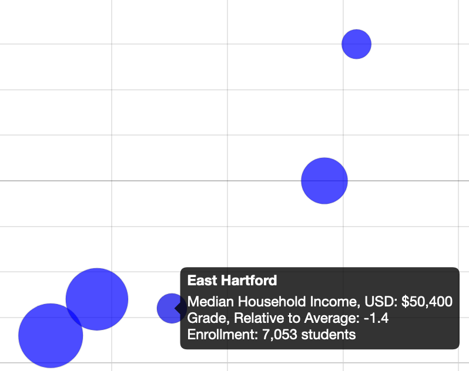

# Chart.js and Highcharts Templates {#chartcode}

We recommend that you start creating interactive charts with easy drag-and-drop tools we described in [Chapter 7: Chart Your Data](chart.html), such as [Google Sheets](chart-google.html), [Datawrapper](chart-tableau-public.html) and [Tableau Public](chart-tableau-public.html). But when you're ready to explore more powerful tools, this chapter features Chart.js and Highcharts code templates, which offer many benefits for more advanced users. By copying and modifying our templates, you can customize the appearance and interactivity of your visualizations, upload your data in CSV format, and freely publish it with your code on GitHub Pages or any server you choose, without relying on a drag-and-drop tool platform to continue its service into the future. But in order to work with our templates, you first need to learn how to [edit and host code with GitHub in Chapter 11](github.html).

Most of the templates we feature are designed with [Chart.js](https://www.chartjs.org/), an open-source code library that is freely distributed under an MIT license, which anyone can use and modify. This means that the code library is extensible by other users, who have created [awesome Chart.js resources](https://github.com/chartjs/awesome), such as additional chart types and plugins that provide more features. Also, we include some templates designed with [Highcharts](https://highcharts.com) to expand the range of chart types and features not fully covered by Chart.js. Although Highcharts code is open-source, its licensing terms differ. [Highcharts is free for non-commerical use](https://www.highcharts.com/products/highcharts/#non-commercial), such as a personal, school, or non-profit organization website. But if you create charts for commercial or governmental use, you'll need to purchase a [Highcharts license](https://shop.highsoft.com/). In either case, we designed our Chart.js and Highcharts code templates to make them easier for beginners to understand. See the various types of charts and follow the links to the templates and tutorials in Table \@ref(tab:chart-templates).

Table: (\#tab:chart-templates) Chart Code Templates and Tutorials

| Chart | Best use and tutorials in this book |
| --- | --- |
| Bar or Column Chart<br>  | Best to compare categories side-by-side. If labels are long, use horizontal bars instead of vertical columns. <br>Power tool: [Bar or Column Chart with CSV data in Chart.js code template and tutorial](chartjs-bar-column.html)  |
| Error Bars in a Bar/Column Chart<br>  | Best to show margin of error bars when comparing categories side-by-side. If labels are long, use horizontal bars instead of vertical columns. <br>Power tool: [Error Bars in Bar/Column Chart with CSV data in Chart.js code template and tutorial](chartjs-error-bars.html)  |
| Line Chart<br>  | Best to show continuous data, such as change over time.<br>Power tool: [Line Chart with CSV data in Chart.js code template and tutorial](chartjs-line.html) |
| Annotated Line Chart<br>  | Best to add contextual notes inside chart of continuous data, such as change over time.<br>Power tool: [Annotated Line Chart with CSV data in Highcharts code template and tutorial](highcharts-annotated-line.html) |
| Scatter Chart<br>  | Best to show the relationship between two datasets as XY coordinates to reveal possible correlations.<br>Power tool: [Scatter Chart with CSV data in Chart.js code template and tutorial](chartjs-scatter.html) |
| Bubble Chart<br>  | Best to show the relationship between three or four sets of data, with XY coordinates, bubble size, and color. <br>Power tool: [Bubble Chart with CSV data in Chart.js code template and tutorial](chartjs-bubble.html) |

For additional chart types, see [Chart.js samples](https://www.chartjs.org/samples/latest/) and [Highcharts Demos](https://www.highcharts.com/demo).

These code templates vary from simple to complex, but all of them rely on four basic pillars:

  * HTML: language to structure content on the web (example: index.html)
  * CSS, or Cascading Style Sheet: to shape how content appears on the web (example: style.css)
  * JavaScript: code to create the chart and interactivity (example: script.js)
  * CSV: data that powers the visualization that is expressed in comma-separated format (example: data.csv)

Also, these templates refer to other code elements:

  * library: link to online instructions to complete routine tasks (example: Chart.js)
  * data: content to appear in chart, typically in CSV format (example: data.csv)


## Bar or Column Chart with Chart.js {- #chartjs-bar-column}

Bar or column charts are best to compare categories side-by-side. If labels are long, use horizontal bars instead of vertical columns. Always start the x-axis (for a horizontal bar chart) or y-axis (for a vertical column chart) at zero. This interactive Chart.js code template pulls the data from a CSV file, as shown in Figure \@ref(fig:chartjs-demo-bar).

(ref:chartjs-demo-bar) Bar chart with Chart.js: explore the [interactive version](https://handsondataviz.github.io/chartjs-bar/index.html).

```{r chartjs-demo-bar, fig.cap="(ref:chartjs-demo-bar)"}
if(knitr::is_html_output(excludes="markdown")) knitr::include_url("https://handsondataviz.github.io/chartjs-bar/index.html", height="500px") else knitr::include_graphics("images/12-chartcode/chartjs-demo-bar.png")
```

To create your own bar or column chart with CSV data using our Chart.js template:

1. Go to [our GitHub repo for Chart.js template](https://github.com/HandsOnDataViz/chartjs-templates) that contains the code for the chart in Figure \@ref(fig:chartjs-demo-bar), log into your GitHub account, and click *Use this template* to create a copy that you can edit, as described in [Chapter 11: Edit and Host Code with GitHub](github.html).

2. Prepare your data in CSV format and upload into a `data.csv` file. Place labels that will appear along the axis in the first column, and each data series in its own column. Your CSV must contain at least two columns (labels and one data series). You can add as many data series columns as you wish.

```
| district  | nonlearner | learner |
| Hartford  | 15656      | 4111    |
| New Haven | 17730      | 3534    |
```

3. In `script.js`, customize the values of variables shown in the code snippet below:

```javascript
var TITLE = 'English Learners by Select School Districts in CT, 2018-19';

// `false` for vertical column chart, `true` for horizontal bar chart
var HORIZONTAL = false;

// `false` for individual bars, `true` for stacked bars
var STACKED = false;  

// Which column defines 'bucket' names?
var LABELS = 'district';  

// For each column representing a data series, define its name and color
var SERIES = [  
  {
    column: 'nonlearner',
    name: 'Non-Learners',
    color: 'grey'
  },
  {
    column: 'learner',
    name: 'Learners',
    color: 'blue'
  }
];

// x-axis label and label in tooltip
var X_AXIS = 'School Districts';

// y-axis label, label in tooltip
var Y_AXIS = 'Number of Enrolled Students';

// `true` to show the grid, `false` to hide
var SHOW_GRID = true;

// `true` to show the legend, `false` to hide
var SHOW_LEGEND = true;
```

For more customization, see [Chart.js documentation](https://www.chartjs.org/docs/latest/).

## Error Bars with Chart.js {- #chartjs-error-bars}
If your data comes with uncertainty (margins of error), we recommend you
show it in your visualizations. The bar chart template shown in Figure \@ref(fig:chartjs-demo-error-bars)
shows median and mean (average) income for different-sized geographies: the US state of Colorado, Boulder County, Boulder city, and a census tract in the city.

(ref:chartjs-demo-error-bars) Interactive bar chart with error bars in Chart.js. Explore the [interactive version](https://handsondataviz.github.io/chartjs-error-bars/index.html).

```{r chartjs-demo-error-bars, fig.cap="(ref:chartjs-demo-error-bars)"}
if(knitr::is_html_output(excludes="markdown")) knitr::include_url("https://handsondataviz.github.io/chartjs-templates/bar-chart-with-error-bars/index.html", height="500px") else knitr::include_graphics("images/12-chartcode/chartjs-demo-error-bars.png")
```

To create your own bar or column chart with error bars, with data loaded from a CSV file, using our Chart.js template:

1. Go to [our GitHub repo for this Chart.js template](https://github.com/HandsOnDataViz/chartjs-error-bars) that contains the code for the chart in Figure \@ref(fig:chartjs-demo-error-bars), log into your GitHub account, and click *Use this template* to create a copy that you can edit, as described in [Chapter 11: Edit and Host Code with GitHub](github.html).

2. Prepare your data in CSV format and upload into a `data.csv` file. Place labels that will appear along the axis in the first column, and each data series in its own column (accompanied by a column with uncertainty values). Your CSV must contain at least three columns (labels and one data series with associated uncertainty values). You can add as many data series columns as you wish.

```
| geo            | median | median_moe | mean   | mean_moe |
| Colorado       | 68811  | 364        | 92520  | 416      |
| Boulder County | 78642  | 1583       | 109466 | 2061     |
| Boulder city   | 66117  | 2590       | 102803 | 3614     |
| Tract 121.02   | 73396  | 10696      | 120588 | 19322    |
```

3. In `script.js`, customize the values of variables shown in the code snippet below:

```javascript
var TITLE = 'Household Income for Select US Geographies, 2018';

// `false` for vertical (column) chart, `true` for horizontal bar
var HORIZONTAL = false;

// `false` for individual bars, `true` for stacked bars
var STACKED = false;  

// Which column defines "bucket" names?
var LABELS = 'geo';

// For each column representing a series, define its name and color
var SERIES = [
  {
    column: 'median',
    name: 'Median Income',
    color: 'grey',
    errorColumn: 'median_moe'
  },
  {
    column: 'mean',
    name: 'Mean Income',
    color: '#cc9999',
    errorColumn: 'mean_moe'
  }
];

// x-axis label and label in tooltip
var X_AXIS = 'Geography';

// y-axis label and label in tooltip
var Y_AXIS = 'US Dollars';

// `true` to show the grid, `false` to hide
var SHOW_GRID = true;

// `true` to show the legend, `false` to hide
var SHOW_LEGEND = true;
```

For more customization, see [Chart.js documentation](https://www.chartjs.org/docs/latest/).


## Line Chart with Chart.js {- #chartjs-line}

Line charts are often used to show temporal data, or change of values over time.
The x-axis represents time intervals, and the y-axis represents observed values.
Note that unlike column or bar charts, y-axes of line charts do not have to start at zero.
The line chart in Figure \@ref(fig:chartjs-demo-line) shows the number of students
in select school districts in Connecticut from 2012-2013 to 2018-19 academic years.
Each line has a distinct color, and the legend helps establish the color-district relations.

(ref:chartjs-demo-line) Interactive line chart with Chart.js. Explore the [interactive version](https://handsondataviz.github.io/chartjs-line/).

```{r chartjs-demo-line, fig.cap="(ref:chartjs-demo-line)"}
if(knitr::is_html_output(excludes="markdown")) knitr::include_url("https://handsondataviz.github.io/chartjs-line/", height="500px") else knitr::include_graphics("images/12-chartcode/chartjs-demo-line.png")
```

To create your own line chart with Chart.js, with data loaded from a CSV file, you can:

1. Go to [our GitHub repo for the Chart.js template](https://github.com/HandsOnDataViz/chartjs-line) that contains the code of the line chart shown in Figure \@ref(fig:chartjs-demo-line), log into your GitHub account, and click *Use this template* to create a copy that you can edit, as described in [Chapter 11: Edit and Host Code with GitHub](github.html).

2. Prepare your data in CSV format and upload into a `data.csv` file. Place labels that will appear along the axis in the first column, and each data series in its own column. Your CSV must contain at least two columns (labels and one data series). You can add as many data series columns as you wish, but do not overload your chart with lines as humans can distinguish a limited number of colors.

```
| year    | Hartford | New Haven | Bridgeport | Stamford | Waterbury |
| 2013-14 | 21820    | 21420     | 20929      | 15927    | 18706     |
| 2014-15 | 21953    | 21711     | 21244      | 16085    | 18878     |
| 2015-16 | 21463    | 21725     | 21191      | 15946    | 18862     |
| 2016-17 | 20891    | 21981     | 21222      | 16100    | 19001     |
| 2017-18 | 20142    | 21518     | 20896      | 15931    | 19007     |
| 2018-19 | 19767    | 21264     | 20572      | 16053    | 18847     |
```

3. In `script.js`, customize the values of variables shown in the code snippet below:

```javascript
var TITLE = 'Hartford School District is No Longer Largest in Connecticut';

// x-axis label and label in tooltip
var X_AXIS = 'Academic Year';

// y-axis label and label in tooltip
var Y_AXIS = 'Number of Students';

// Should y-axis start from 0? `true` or `false`
var BEGIN_AT_ZERO = false;

// `true` to show the grid, `false` to hide
var SHOW_GRID = true;

 // `true` to show the legend, `false` to hide
var SHOW_LEGEND = true;
```

For more customization, see [Chart.js documentation](https://www.chartjs.org/docs/latest/).

## Annotated Line Chart with Highcharts {- #highcharts-annotated-line}

Although annotations are common elements of various type charts, they are especially
important in line charts. Annotations help give historic context to the lines,
explain sudden dips or raises in values. Figure \@ref(fig:highcharts-demo-annotated-line)
shows change in air passenger traffic for Australia and Canada between 1970
and 2018 (according to the World Bank). You can notice that both countries experienced
a dip in 2009, the year after the 2008 financial crisis as suggested by the annotation.

(ref:highcharts-demo-annotated-line) Interactive annotated chart with Highcharts. Explore the [interactive version](https://handsondataviz.github.io/highcharts-line-annotated/).

```{r highcharts-demo-annotated-line, fig.cap="(ref:highcharts-demo-annotated-line)"}
if(knitr::is_html_output(excludes="markdown")) knitr::include_url("https://handsondataviz.github.io/highcharts-line-annotated/index.html", height="400px") else knitr::include_graphics("images/12-chartcode/highcharts-demo-annotated-line.png")
```

To create your own annotated line chart with Highcharts, with data loaded from a CSV file, you can:

1. Go to [our GitHub repo](https://github.com/HandsOnDataViz/highcharts-line-annotated) that contains code for the chart shown in Figure \@ref(fig:highcharts-demo-annotated-line), log into your GitHub account, and click *Use this template* to create a copy that you can edit, as described in [Chapter 11: Edit and Host Code with GitHub](github.html).

2. Prepare your data in CSV format and upload into a `data.csv` file. Place labels that will appear along the axis in the first column, and each data series in its own column. Your CSV must contain at least three columns (labels, one data series, and notes). You can add as many data series columns as you wish, but you can only have one annotation (final column) per row.

```
| Year | Canada   | Australia | Note                  |
| 1980 | 22453000 | 13648800  |                       |
| 1981 | 22097100 | 13219500  |                       |
| 1982 | 19653800 | 13187900  | Early 1980s recession |
```

3. In `script.js`, customize the values of variables shown in the code snippet below:

```javascript
var TITLE = 'Air Transport, Passengers Carried (1970–2018)';

// Caption underneath the chart
var CAPTION = 'Source: The World Bank';

// x-axis label and label in tooltip
var X_AXIS = 'Year';

// y-axis label and label in tooltip
var Y_AXIS = 'Passengers';

// Should y-axis start from 0? `true` or `false`
var BEGIN_AT_ZERO = true;

// `true` to show the legend, `false` to hide
var SHOW_LEGEND = true;
```

For additional customization, see [Highcharts API reference](https://api.highcharts.com/highcharts/).


## Scatter Chart with Chart.js {- #chartjs-scatter}

Scatter charts (also *scatterplots*) are used to display data of 2 or more dimensions.
The scatter chart in Figure \@ref(fig:chartjs-demo-scatter) shows the relationship between household income and test performance
for school districts in Connecticut. Using x- and y-axes to show two dimensions, it is
easy to see that test performance improves as household income goes up.

(ref:chartjs-demo-scatter) Interactive scatter chart with Chart.js. Explore the [interactive version](https://handsondataviz.github.io/chartjs-scatter/).

```{r chartjs-demo-scatter, fig.cap="(ref:chartjs-demo-scatter)"}
if(knitr::is_html_output(excludes="markdown")) knitr::include_url("https://handsondataviz.github.io/chartjs-scatter/", height="450px") else knitr::include_graphics("images/12-chartcode/chartjs-demo-scatter.png")
```

To create your own scatter plot with Chart.js, with data loaded from a CSV file, you can:

1. Go to [our GitHub repo](https://github.com/HandsOnDataViz/chartjs-scatter) that contains the code for the chart shown in Figure \@ref(fig:chartjs-demo-scatter), log into your GitHub account, and click *Use this template* to create a copy that you can edit, as described in [Chapter 11: Edit and Host Code with GitHub](github.html).

2. Prepare your data in CSV format and upload into a `data.csv` file. The first two columns should contain x- and y-values respectively, and the third column should contain the point name that will appear on mouse hover.

```
| income | grades | district |
| 88438  | 1.7    | Andover  |
| 45505  | -0.4   | Ansonia  |
| 75127  | 0.5    | Ashford  |
| 115571 | 2.6    | Avon     |
```

3. In `script.js`, customize the values of variables shown in the code snippet below:

```javascript
var TITLE = 'Income and Test Scores in Connecticut School Districts, 2009-13';

var POINT_X = 'income'; // column name for x values in data.csv
var POINT_X_PREFIX = '$'; // prefix for x values, eg '$'
var POINT_X_POSTFIX = ''; // postfix for x values, eg '%'

var POINT_Y = 'grades'; // column name for y values in data.csv
var POINT_Y_PREFIX = ''; // prefix for x values, eg 'USD '
var POINT_Y_POSTFIX = ''; // postfix for x values, eg ' kg'

var POINT_NAME = 'district'; // point names that appear in tooltip
var POINT_COLOR = 'rgba(0,0,255,0.7)'; // eg `black` or `rgba(10,100,44,0.8)`
var POINT_RADIUS = 5; // radius of each data point

var X_AXIS = 'Median Household Income, USD'; // x-axis label, label in tooltip
var Y_AXIS = 'Grade, Relative to Average'; // y-axis label, label in tooltip

var SHOW_GRID = true; // `true` to show the grid, `false` to hide
```

For more customization, see [Chart.js documentation](https://www.chartjs.org/docs/latest/).


#### Going beyond two dimensions {-}

To show more than two dimensions in scatter charts, one can:

* **color** each data point differently to show third dimension, eg use shades of red and green to show 5-year trend in test performance;
* **resize** each data point to display fourth dimension, eg number of students in each school district;
* use different **icons or glyphs** to display fifth dimension, eg circles for male students and squares for female students.

Remember not to overwhelm the viewer and communicate only the data that are necessary to prove or illustrate your idea.

## Bubble Chart with Chart.js {- #chartjs-bubble}

Bubble charts are similar to [scatter plots](chartjs-scatter-csv.html), but it adds one more dimension: the size of each point (marker) also represents a value.

The bubble chart in Figure \@ref(fig:chartjs-demo-bubble) shows how median household income (x-axis) and test performance (y-axis) in 6 school districts in Connecticut are related. The size of data point corresponds to the number of students enrolled in the school district: bigger circles represent larger school districts.

(ref:chartjs-demo-bubble) Interactive bubble chart with Chart.js. Explore the [interactive version](https://handsondataviz.github.io/chartjs-bubble/).

```{r chartjs-demo-bubble, fig.cap="(ref:chartjs-demo-bubble)"}
if(knitr::is_html_output(excludes="markdown")) knitr::include_url("https://handsondataviz.github.io/chartjs-bubble/", height="500px") else knitr::include_graphics("images/12-chartcode/chartjs-demo-bubble.png")
```

To create your own bubble chart with Chart.js, with data loaded from a CSV file, you can:

1. Go to [our GitHub repo for this template](https://github.com/HandsOnDataViz/chartjs-bubble), log into your GitHub account, and click *Use this template* to create a copy that you can edit, as described in [Chapter 11: Edit and Host Code with GitHub](github.html).

2. Prepare your data in CSV format and upload into a `data.csv` file. The first two columns should contain x- and y-values respectively. The third column should contain bubble names that will appear on mouse hover. The final, fourth column, represents the size of your bubble.

```
| income | grades | district      | enrollment |
| 29430  | -1.7   | Hartford      | 21965      |
| 82322  | 1.5    | West Hartford | 10078      |
| 50400  | -1.4   | East Hartford | 7053       |
```

3. In `script.js`, customize the values of variables shown in the code snippet below:

```javascript
var TITLE = 'Income, Test Scores, and Enrollment in Select \
  Connecticut School Districts, 2009-13';

var POINT_X = 'income'; // column name for x values in data.csv
var POINT_X_PREFIX = '$'; // prefix for x values, eg '$'
var POINT_X_POSTFIX = ''; // postfix for x values, eg '%'

var POINT_Y = 'grades'; // column name for y values in data.csv
var POINT_Y_PREFIX = ''; // prefix for x values, eg 'USD '
var POINT_Y_POSTFIX = ''; // postfix for x values, eg ' kg'

var POINT_R = 'enrollment'; // column name for radius in data.csv
var POINT_R_DESCRIPTION = 'Enrollment'; // description of radius value
var POINT_R_PREFIX = ''; // prefix for radius values, eg 'USD '
var POINT_R_POSTFIX = ' students'; // postfix for radius values, eg ' kg'
var R_DENOMINATOR = 800;  // use this to scale the dot sizes, or set to 1
                          // if your dataset contains precise radius values

var POINT_NAME = 'district'; // point names that appear in tooltip
var POINT_COLOR = 'rgba(0,0,255,0.7)'; // eg `black` or `rgba(10,100,44,0.8)`

var X_AXIS = 'Median Household Income, USD'; // x-axis label, label in tooltip
var Y_AXIS = 'Grade, Relative to Average'; // y-axis label, label in tooltip

var SHOW_GRID = true; // `true` to show the grid, `false` to hide
```

Tip: To display smaller data points that may be hidden behind larger neighbors, use semi-transparent circles with RGBA color codes. The first three characters represent red, green, and blue, while the `a` stands for `alpha` and represents the level of transparency on a scale from 0.0 (full transparent) to 1.0 (fully opaque). For example, `rgba(160, 0, 0, 0.5)` creates a red color that is semi-transparent. Learn more by playing with [RGBA color values at W3Schools](https://www.w3schools.com/css/css_colors_rgb.asp).

#### Going beyond three dimensions {-}
To show more than three dimensions in bubble charts, one can:

* **color** each data point differently to show fourth dimension, eg use shades of red and green to show 5-year trend in test performance;
* use different **icons or glyphs** to display fifth dimension, eg circles for male students and squares for female students.

Remember not to overwhelm the viewer and communicate only the data that are necessary to prove or illustrate your idea.

### Summary {- #summary11}

In this chapter, we introduced Chart.js and Highcharts templates for basic chart types.
You can use them as a base to kickstart your interactive visualization. Both
Chart.js and Highcharts have many more customizations than we suggested in code snippets.
Look at the additional documentation

In the next chapter, we will introduce Leaflet.js map templates that you can as easily
copy from GitHub to develop your own.
