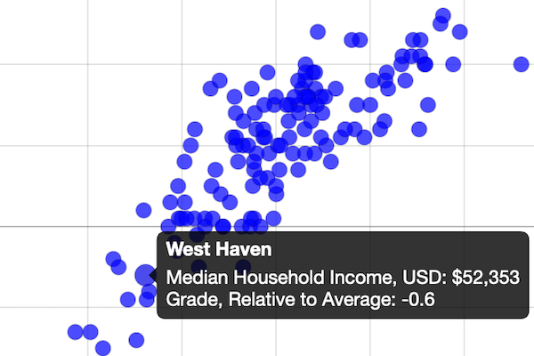
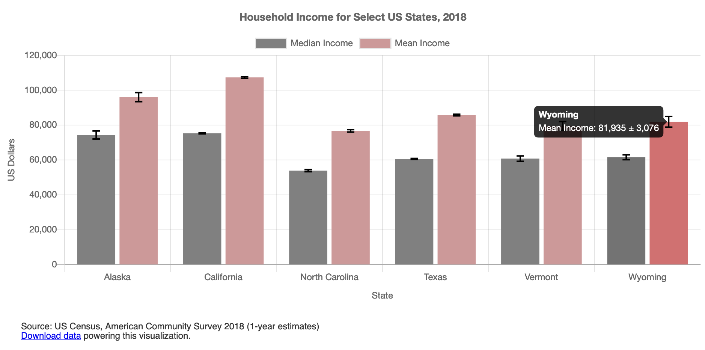
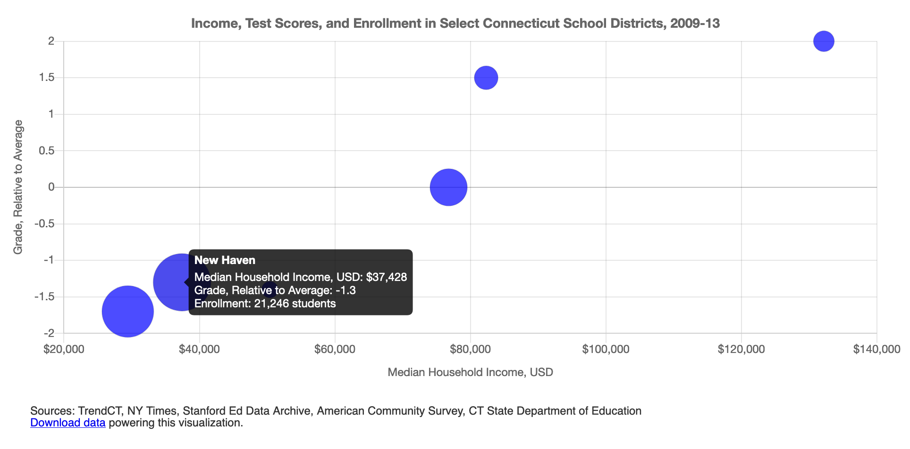

# Chart.js and Highcharts Templates {#chartcode}

In [Chapter 7: Chart Your Data](chart.html), we looked at powerful drag-and-drop tools,
such as [Google Sheets](chart-google.html), [Datawrapper](chart-tableau-public.html)
and [Tableau Public](chart-tableau-public.html) to build interactive charts.

In this chapter, we will look into creating interactive charts using two popular
JavaScript libraries, [Chart.js](https://www.chartjs.org/) and [Highcharts](https://www.highcharts.com/).
Since we don't expect our readers to be proficient in JavaScript or any
other programming language, we designed templates that you can copy
to your own GitHub account, substitute data files, and publish them to the web
without writing a single line of code. But for those of you who are code-curious,
we will show how the JavaScript code in these templates can be customized.

Now, why would anyone prefer JavaScript to easy-to-use Datawrapper or Tableau, you may wonder? Well, a few reasons. Although JavaScript code may seem overwhelming and intimidating at first, it allows for greater customization in terms of colors, padding, interactivity, and data handling than most third-party tools can offer. In addition, you can never be sure that third-party apps will remain free, or at least have a free tier, forever, whereas open-source tools are here to stay, free of charge, as long as someone maintains the code.

Note: Although both libraries are open-source, Highcharts comes [with a stricter license](https://www.highcharts.com/products/highcharts/#non-commercial) which allows it to be used for free for non-commercial projects only, such as personal, school, or non-profit organization website. Keeping that in mind, we primarily focus on Chart.js, which is distributed under MIT license that lets you use the library for commercial projects as well.

Table \@ref(tab:chart-templates) lists all types of charts that we will look at in this chapter. Both libraries include many more default chart types that you can explore
in [Chart.js Samples](https://www.chartjs.org/samples/latest/) and [Highcharts Demos](https://www.highcharts.com/demo). However, we strongly advise against using some chart types, such as three-dimensional ones, for reasons we discussed in the [Chart Design Principles section of Chapter 7](chart-design).

Table: (\#tab:chart-templates) Chart Code Templates, Best Uses, and Tutorials

| Chart | Best use and tutorials in this book |
| --- | --- |
| Bar or Column Chart<br>  | Best to compare categories side-by-side. If labels are long, use horizontal bars instead of vertical columns. <br>Power tool: [Bar or Column Chart with CSV data in Chart.js code template and tutorial](chartjs-bar-column.html)  |
| Error Bars in a Bar/Column Chart<br>  | Best to show margin of error bars when comparing categories side-by-side. If labels are long, use horizontal bars instead of vertical columns. <br>Power tool: [Error Bars in Bar/Column Chart with CSV data in Chart.js code template and tutorial](chartjs-error-bars.html)  |
| Line Chart<br>  | Best to show continuous data, such as change over time.<br>Power tool: [Line Chart with CSV data in Chart.js code template and tutorial](chartjs-line.html). See tutorial note to modify line chart into stacked area chart. |
| Annotated Line Chart<br>  | Best to add contextual notes inside chart of continuous data, such as change over time.<br>Power tool: [Annotated Line Chart with CSV data in Highcharts code template and tutorial](highcharts-annotated-line.html) |
| Scatter Chart<br>  | Best to show the relationship between two datasets as XY coordinates to reveal possible correlations.<br>Power tool: [Scatter Chart with CSV data in Chart.js code template and tutorial](chartjs-scatter.html) |
| Bubble Chart<br>  | Best to show the relationship between three or four sets of data, with XY coordinates, bubble size, and color. <br>Power tool: [Bubble Chart with CSV data in Chart.js code template and tutorial](chartjs-bubble.html) |


## Bar or Column Chart with Chart.js {- #chartjs-bar-column}
In this section, we will show you how to create bar or column charts using a Chart.js. To do so, we will be using a Chart.js come template that pulls data from a CSV file, as shown in Figure \@ref(fig:chartjs-demo-bar). This column chart shows how many students in five school districts in Connecticut were English-language learners in 2018-2019 academic year.

(ref:chartjs-demo-bar) Bar chart with Chart.js: explore the [interactive version](https://handsondataviz.github.io/chartjs-bar/index.html).

```{r chartjs-demo-bar, fig.cap="(ref:chartjs-demo-bar)"}
if(knitr::is_html_output(excludes="markdown")) knitr::include_url("https://handsondataviz.github.io/chartjs-bar/index.html", height="500px") else knitr::include_graphics("images/12-chartcode/chartjs-demo-bar.png")
```

To create your own bar or column chart with CSV data using our Chart.js template:

1. Go to [our GitHub repo](https://github.com/HandsOnDataViz/chartjs-bar) that contains the code for the chart in Figure \@ref(fig:chartjs-demo-bar), log into your GitHub account, and click *Use this template* to create a copy that you can edit.

Note: If you don't remember how to use GitHub, we recommend you revisit [Chapter 11: Edit and Host Code with GitHub](github.html).


The repo contains three files that are directly related to the chart:

* `index.html` contains HTML (markdown) and CSS (stylesheets) that tell the browser how to style the document that contains the chart, and what libraries to load,
* `script.js` contains the JavaScript code that reads data from the CSV file and constructs the interactive chart, and
*  `data.csv` is the comma-separated file that keeps all the data in the chart, and can be edited in a text editor, or Google Sheets/Excel etc.

The two remaining files are a `README.md` that describes the contents of the repo, and `bar.png` that is just an image that you can see in the README. All other GitHub templates in this chapter will be similarly structured.

2. Prepare your data in CSV format and upload into a `data.csv` file. Place labels that will appear along the axis in the first column, and each data series in its own column. Your CSV must contain at least two columns (labels and one data series). You can add as many data series columns as you wish.

```
| district  | nonlearner | learner |
| Hartford  | 15656      | 4111    |
| New Haven | 17730      | 3534    |
```

3. In `script.js`, customize the values of variables. Since you may not be familiar with JavaScript, let's take a look at the code snippet that describes a single variable in the file:

```javascript
// `false` for vertical column chart, `true` for horizontal bar chart
var HORIZONTAL = false;
```

The first line starts with `//` and is a comment to help you understand what the variable in the next line is responsible for. It does not affect the code. As you can see, if the variable HORIZONTAL is set to `false`, the chart would have vertical bars (also known as columns). If set to `true`, the chart will contain horizontal bars. The second line contains the variable declaration itself. The equal sign (`=`) assigns the value that you see on the right (*false*) to the variable (`var`) called `HORIZONTAL` to the left. This line ends with the semicolon (`;`).

Below are some of the variables available for you to customize in `script.js`:

```javascript
var TITLE = 'English Learners by Select School Districts in CT, 2018-19';

// `false` for vertical column chart, `true` for horizontal bar chart
var HORIZONTAL = false;

// `false` for individual bars, `true` for stacked bars
var STACKED = false;  

// Which column defines 'bucket' names?
var LABELS = 'district';  

// For each column representing a data series, define its name and color
var SERIES = [  
  {
    column: 'nonlearner',
    name: 'Non-Learners',
    color: 'grey'
  },
  {
    column: 'learner',
    name: 'Learners',
    color: 'blue'
  }
];

// x-axis label and label in tooltip
var X_AXIS = 'School Districts';

// y-axis label, label in tooltip
var Y_AXIS = 'Number of Enrolled Students';

// `true` to show the grid, `false` to hide
var SHOW_GRID = true;

// `true` to show the legend, `false` to hide
var SHOW_LEGEND = true;
```

These basic variables should be enough to get you started. It is natural that you will want to move the legend, edit the appearance of the tooltip, or change the colors of the grid lines. We recommend you look at the official [Chart.js documentation](https://www.chartjs.org/docs/latest/) to get help with that.

## Error Bars with Chart.js {- #chartjs-error-bars}
If your data comes with uncertainty (margins of error), we recommend you show it in your visualizations with the use of error bars. The bar chart template shown in Figure \@ref(fig:chartjs-demo-error-bars)
shows median and mean (average) income for different-sized geographies: the US state of Colorado, Boulder County, Boulder city, and a census tract in the city.

(ref:chartjs-demo-error-bars) Interactive bar chart with error bars in Chart.js. Explore the [interactive version](https://handsondataviz.github.io/chartjs-error-bars/index.html).

```{r chartjs-demo-error-bars, fig.cap="(ref:chartjs-demo-error-bars)"}
if(knitr::is_html_output(excludes="markdown")) knitr::include_url("https://handsondataviz.github.io/chartjs-templates/bar-chart-with-error-bars/index.html", height="500px") else 
```

To create your own bar or column chart with error bars, with data loaded from a CSV file, using our Chart.js template follow the steps below:

1. Go to [our GitHub repo for this Chart.js template](https://github.com/HandsOnDataViz/chartjs-error-bars) that contains the code for the chart in Figure \@ref(fig:chartjs-demo-error-bars), log into your GitHub account, and click *Use this template* to create a copy that you can edit.

2. Prepare your data in CSV format and upload into a `data.csv` file. Place labels that will appear along the axis in the first column, and each data series in its own column (accompanied by a column with uncertainty values). Your CSV must contain at least three columns (labels and one data series with associated uncertainty values). You can add as many data series columns as you wish.

```
| geo            | median | median_moe | mean   | mean_moe |
| Colorado       | 68811  | 364        | 92520  | 416      |
| Boulder County | 78642  | 1583       | 109466 | 2061     |
| Boulder city   | 66117  | 2590       | 102803 | 3614     |
| Tract 121.02   | 73396  | 10696      | 120588 | 19322    |
```

3. In `script.js`, customize the values of variables shown in the code snippet below:

```javascript
var TITLE = 'Household Income for Select US Geographies, 2018';

// `false` for vertical (column) chart, `true` for horizontal bar
var HORIZONTAL = false;

// `false` for individual bars, `true` for stacked bars
var STACKED = false;  

// Which column defines "bucket" names?
var LABELS = 'geo';

// For each column representing a series, define its name and color
var SERIES = [
  {
    column: 'median',
    name: 'Median Income',
    color: 'grey',
    errorColumn: 'median_moe'
  },
  {
    column: 'mean',
    name: 'Mean Income',
    color: '#cc9999',
    errorColumn: 'mean_moe'
  }
];

// x-axis label and label in tooltip
var X_AXIS = 'Geography';

// y-axis label and label in tooltip
var Y_AXIS = 'US Dollars';

// `true` to show the grid, `false` to hide
var SHOW_GRID = true;

// `true` to show the legend, `false` to hide
var SHOW_LEGEND = true;
```

For more customization, see [Chart.js documentation](https://www.chartjs.org/docs/latest/).


## Line Chart with Chart.js {- #chartjs-line}

Line charts are often used to show temporal data, or change of values over time.
The x-axis represents time intervals, and the y-axis represents observed values.
Note that unlike column or bar charts, y-axes of line charts do not have to start at zero because we rely on the position and slope of the line to interpret its meaning.
The line chart in Figure \@ref(fig:chartjs-demo-line) shows the number of students
in select school districts in Connecticut from 2012-2013 to 2018-19 academic years.
Each line has a distinct color, and the legend helps establish the color-district relations.

(ref:chartjs-demo-line) Interactive line chart with Chart.js. Explore the [interactive version](https://handsondataviz.github.io/chartjs-line/).

```{r chartjs-demo-line, fig.cap="(ref:chartjs-demo-line)"}
if(knitr::is_html_output(excludes="markdown")) knitr::include_url("https://handsondataviz.github.io/chartjs-line/", height="500px") else knitr::include_graphics("images/12-chartcode/chartjs-demo-line.png")
```

To create your own line chart with Chart.js, with data loaded from a CSV file, you can:

1. Go to [our GitHub repo for the Chart.js template](https://github.com/HandsOnDataViz/chartjs-line) that contains the code of the line chart shown in Figure \@ref(fig:chartjs-demo-line), log into your GitHub account, and click *Use this template* to create a copy that you can edit.

2. Prepare your data in CSV format and upload into a `data.csv` file. Place labels that will appear along the axis in the first column, and each data series in its own column. Your CSV must contain at least two columns (labels and one data series).

Tip: You can add as many data series columns as you wish, but choose a reasonable number of lines, since humans can distinguish only a limited number of colors. If you need to display multiple lines, consider using only one color to highlight the most significant line in your data story, and color others in gray, as you will learn in the [Draw Attention to Meaning section of Chapter 16](draw-attention.html).

```
| year    | Hartford | New Haven | Bridgeport | Stamford | Waterbury |
| 2013-14 | 21820    | 21420     | 20929      | 15927    | 18706     |
| 2014-15 | 21953    | 21711     | 21244      | 16085    | 18878     |
| 2015-16 | 21463    | 21725     | 21191      | 15946    | 18862     |
| 2016-17 | 20891    | 21981     | 21222      | 16100    | 19001     |
| 2017-18 | 20142    | 21518     | 20896      | 15931    | 19007     |
| 2018-19 | 19767    | 21264     | 20572      | 16053    | 18847     |
```

3. In `script.js`, customize the values of variables shown in the code snippet below:

```javascript
var TITLE = 'Hartford School District is No Longer Largest in Connecticut';

// x-axis label and label in tooltip
var X_AXIS = 'Academic Year';

// y-axis label and label in tooltip
var Y_AXIS = 'Number of Students';

// Should y-axis start from 0? `true` or `false`
var BEGIN_AT_ZERO = false;

// `true` to show the grid, `false` to hide
var SHOW_GRID = true;

 // `true` to show the legend, `false` to hide
var SHOW_LEGEND = true;
```

Note: To change a Chart.js line chart into a stacked area chart, make sure each `dataset` comes with a `fill: true` property, and that yAxis `stacked` property is set to `true`.

Remember to look at the official [Chart.js documentation](https://www.chartjs.org/docs/latest/) if you want to add more features. If something isn't working as desired, visit [StackOverflow](https://stackoverflow.com/search?q=chartjs) to see if anyone had already solved your problem.

## Annotated Line Chart with Highcharts {- #highcharts-annotated-line}

Although annotations are common elements of various type charts, they are especially
important in line charts. Annotations help give historic context to the lines,
explain sudden dips or raises in values. Figure \@ref(fig:highcharts-demo-annotated-line)
shows change in air passenger traffic for Australia and Canada between 1970
and 2018 (according to the World Bank). You can notice that both countries experienced
a dip in 2009, the year after the 2008 financial crisis as suggested by the annotation.

(ref:highcharts-demo-annotated-line) Interactive annotated chart with Highcharts. Explore the [interactive version](https://handsondataviz.github.io/highcharts-line-annotated/).

```{r highcharts-demo-annotated-line, fig.cap="(ref:highcharts-demo-annotated-line)"}
if(knitr::is_html_output(excludes="markdown")) knitr::include_url("https://handsondataviz.github.io/highcharts-line-annotated/index.html", height="400px") else knitr::include_graphics("images/12-chartcode/highcharts-demo-annotated-line.png")
```

Unfortunately, Chart.js is not great at showing annotations. This is why we are switching to Highcharts for this particular example. But don't worry -- you will see that the process is hardly different from the previous Chart.js examples.

To create your own annotated line chart with Highcharts, with data loaded from a CSV file, do the following:

1. Go to [our GitHub repo](https://github.com/HandsOnDataViz/highcharts-line-annotated) that contains code for the chart shown in Figure \@ref(fig:highcharts-demo-annotated-line), log into your GitHub account, and click *Use this template* to create a copy that you can edit.

2. Prepare your data in CSV format and upload into a `data.csv` file. Place labels that will appear along the axis in the first column, and each data series in its own column. Your CSV must contain at least three columns (labels, one data series, and notes). You can add as many data series columns as you wish, but you can only have one annotation (final column) per row.

```
| Year | Canada   | Australia | Note                  |
| 1980 | 22453000 | 13648800  |                       |
| 1981 | 22097100 | 13219500  |                       |
| 1982 | 19653800 | 13187900  | Early 1980s recession |
```

3. In `script.js`, customize the values of variables shown in the code snippet below:

```javascript
var TITLE = 'Air Transport, Passengers Carried (1970–2018)';

// Caption underneath the chart
var CAPTION = 'Source: The World Bank';

// x-axis label and label in tooltip
var X_AXIS = 'Year';

// y-axis label and label in tooltip
var Y_AXIS = 'Passengers';

// Should y-axis start from 0? `true` or `false`
var BEGIN_AT_ZERO = true;

// `true` to show the legend, `false` to hide
var SHOW_LEGEND = true;
```

If you wish to further customize your chart, use the [Highcharts API reference](https://api.highcharts.com/highcharts/) that lists all available features.


## Scatter Chart with Chart.js {- #chartjs-scatter}

Now when you've seen Highcharts in action, let's get back to Chart.js and see how to build an interactive scatter chart. Remember that scatter charts (also *scatterplots*) are used to display data of 2 or more dimensions. Figure \@ref(fig:chartjs-demo-scatter) shows the relationship between household income and test performance
for school districts in Connecticut. Using x- and y-axes to show two dimensions, it is easy to see that test performance improves as household income goes up.

(ref:chartjs-demo-scatter) Interactive scatter chart with Chart.js. Explore the [interactive version](https://handsondataviz.github.io/chartjs-scatter/).

```{r chartjs-demo-scatter, fig.cap="(ref:chartjs-demo-scatter)"}
if(knitr::is_html_output(excludes="markdown")) knitr::include_url("https://handsondataviz.github.io/chartjs-scatter/", height="450px") else knitr::include_graphics("images/12-chartcode/chartjs-demo-scatter.png")
```

To create your own scatter plot with Chart.js, with data loaded from a CSV file, you can:

1. Go to [our GitHub repo](https://github.com/HandsOnDataViz/chartjs-scatter) that contains the code for the chart shown in Figure \@ref(fig:chartjs-demo-scatter), log into your GitHub account, and click *Use this template* to create a copy that you can edit.

2. Prepare your data in CSV format and upload into a `data.csv` file. The first two columns should contain x- and y-values respectively, and the third column should contain the point name that will appear on mouse hover.

```
| income | grades | district |
| 88438  | 1.7    | Andover  |
| 45505  | -0.4   | Ansonia  |
| 75127  | 0.5    | Ashford  |
| 115571 | 2.6    | Avon     |
```

3. In `script.js`, customize the values of variables shown in the code snippet below:

```javascript
var TITLE = 'Income and Test Scores in Connecticut School Districts, 2009-13';

var POINT_X = 'income'; // column name for x values in data.csv
var POINT_X_PREFIX = '$'; // prefix for x values, eg '$'
var POINT_X_POSTFIX = ''; // postfix for x values, eg '%'

var POINT_Y = 'grades'; // column name for y values in data.csv
var POINT_Y_PREFIX = ''; // prefix for x values, eg 'USD '
var POINT_Y_POSTFIX = ''; // postfix for x values, eg ' kg'

var POINT_NAME = 'district'; // point names that appear in tooltip
var POINT_COLOR = 'rgba(0,0,255,0.7)'; // eg `black` or `rgba(10,100,44,0.8)`
var POINT_RADIUS = 5; // radius of each data point

var X_AXIS = 'Median Household Income, USD'; // x-axis label, label in tooltip
var Y_AXIS = 'Grade, Relative to Average'; // y-axis label, label in tooltip

var SHOW_GRID = true; // `true` to show the grid, `false` to hide
```

A similarly good-looking interactive chart [can be constructed in Highcharts](https://www.highcharts.com/demo/scatter), although it is up to you to undertake that challenge. In the meanwhile, remember to refer to the official [Chart.js documentation](https://www.chartjs.org/docs/latest/) if you want to further tweak your chart.

You may want to show an additional third variable, such as enrollment in each school district, in the same scatter chart. You can do so by resizing each dot so that larger school districts are marked with a larger circle, and smaller districts are shown using a smaller dot. Such use of size will result in a *bubble chart*, which we will look at next.

## Bubble Chart with Chart.js {- #chartjs-bubble}

Bubble charts are similar to [scatter plots](chartjs-scatter-csv.html), but it adds one more variable (also known as dimension): the size of each point (marker) also represents a value.

The bubble chart in Figure \@ref(fig:chartjs-demo-bubble) shows how median household income (x-axis) and test performance (y-axis) in 6 school districts in Connecticut are related. The size of data point corresponds to the number of students enrolled in the school district: bigger circles represent larger school districts.

(ref:chartjs-demo-bubble) Interactive bubble chart with Chart.js. Explore the [interactive version](https://handsondataviz.github.io/chartjs-bubble/).

```{r chartjs-demo-bubble, fig.cap="(ref:chartjs-demo-bubble)"}
if(knitr::is_html_output(excludes="markdown")) knitr::include_url("https://handsondataviz.github.io/chartjs-bubble/", height="500px") else 
```

To create your own bubble chart with Chart.js, with data loaded from a CSV file, you can:

1. Go to [our GitHub repo for this template](https://github.com/HandsOnDataViz/chartjs-bubble), log into your GitHub account, and click *Use this template* to create a copy that you can edit.

2. Prepare your data in CSV format and upload into a `data.csv` file. The first two columns should contain x- and y-values respectively. The third column should contain bubble names that will appear on mouse hover. The final, fourth column, represents the size of your bubble.

```
| income | grades | district      | enrollment |
| 29430  | -1.7   | Hartford      | 21965      |
| 82322  | 1.5    | West Hartford | 10078      |
| 50400  | -1.4   | East Hartford | 7053       |
```

3. In `script.js`, customize the values of variables shown in the code snippet below:

```javascript
var TITLE = 'Income, Test Scores, and Enrollment in Select \
  Connecticut School Districts, 2009-13';

var POINT_X = 'income'; // column name for x values in data.csv
var POINT_X_PREFIX = '$'; // prefix for x values, eg '$'
var POINT_X_POSTFIX = ''; // postfix for x values, eg '%'

var POINT_Y = 'grades'; // column name for y values in data.csv
var POINT_Y_PREFIX = ''; // prefix for x values, eg 'USD '
var POINT_Y_POSTFIX = ''; // postfix for x values, eg ' kg'

var POINT_R = 'enrollment'; // column name for radius in data.csv
var POINT_R_DESCRIPTION = 'Enrollment'; // description of radius value
var POINT_R_PREFIX = ''; // prefix for radius values, eg 'USD '
var POINT_R_POSTFIX = ' students'; // postfix for radius values, eg ' kg'
var R_DENOMINATOR = 800;  // use this to scale the dot sizes, or set to 1
                          // if your dataset contains precise radius values

var POINT_NAME = 'district'; // point names that appear in tooltip
var POINT_COLOR = 'rgba(0,0,255,0.7)'; // eg `black` or `rgba(10,100,44,0.8)`

var X_AXIS = 'Median Household Income, USD'; // x-axis label, label in tooltip
var Y_AXIS = 'Grade, Relative to Average'; // y-axis label, label in tooltip

var SHOW_GRID = true; // `true` to show the grid, `false` to hide
```

Tip: To display smaller data points that may be hidden behind larger neighbors, use semi-transparent circles with RGBA color codes. The first three characters represent red, green, and blue, while the `a` stands for `alpha` and represents the level of transparency on a scale from 0.0 (full transparent) to 1.0 (fully opaque). For example, `rgba(160, 0, 0, 0.5)` creates a red color that is semi-transparent. Learn more by playing with [RGBA color values at W3Schools](https://www.w3schools.com/css/css_colors_rgb.asp).

If you have more than three variables that you would like to show in your bubble chart, you can use *color* and *glyphs* (instead of simple dots) to represent two extra dimentions. For example, you may want to use the blue color to only show school districts in Fairfield County (generally a richer part of CT) and gray color to represent all other districts. You may want to use circles, squares, and triangles to represent results for males, females, and non-binary students. We won't be showing you how to achieve this, but we can assure you that it can be done in 5-10 extra lines of code.

Chart.js is pretty limitless when it comes to customization, but remember not to overwhelm the viewer and communicate only the data that are necessary to prove or illustrate your idea.

### Summary {- #summary12}

In this chapter, we introduced Chart.js and Highcharts templates that can be used to construct rich and interactive charts that you can host in your own GitHub account, and embed them anywhere on the web. You can use these templates as a base to kickstart your interactive visualizations. You can refer to [Chart.js Samples](https://www.chartjs.org/samples/latest/) and [Chart.js documentation](https://www.chartjs.org/docs/latest/) for more information on Chart.js customization and troubleshooting. [Highcharts Demos](https://www.highcharts.com/demo) gallery shows plenty of charts along with the code that you can copy, and [Highcharts API Reference](https://api.highcharts.com/highcharts/) lists all features available to refine your visualizations. Just remember that you need to [obtain a license](https://shop.highsoft.com/) to use Highcharts in commercial projects.

In the next chapter, we will introduce Leaflet.js map templates that were designed in a similar fashion to the chart templates we have just looked at. Leaflet is a leading open-source JavaScript library for web mapping, and will let you create stunning interactive maps that live in your GitHub account and can be shared across the web.
