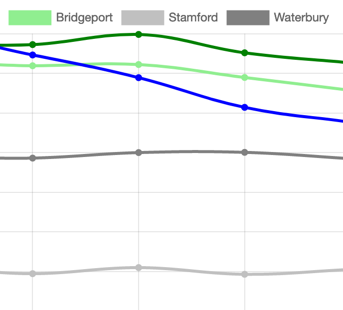

# Chart.js Code Templates {#chartjs}
*by [Ilya Ilyankou and Jack Dougherty](authors), last updated August 11, 2019*

While beginners appreciate the drag-and-drop chart tools and tutorials described earlier in this book, such as [Google Sheets](google-sheets) and [Tableau Public](tableau-public), more advanced users may wish to customize their visualizations, add more complex data, and control exactly how and where their work appears on the web. A more powerful and relatively easy-to-learn solution is to use code templates built with Chart.js <https://www.chartjs.org/>, an open-source library, which you can [modify and host on GitHub](github), as described in this book.

#### Working with Chart.js

##### Pros

* Open-source code that is distributed under MIT license and is free for all and
* Easier for beginners to understand than more complex visualization code libraries such as D3.js

##### Cons
* Must host your own code repositories to publish to the web (with a free service such as GitHub Pages)

#### List of Chart.js templates

| Templates     | Best use and tutorial chapters |
| --- | --- |
| Chart.js Bar Chart   | Bar charts (vertical bar charts are often called column charts) can be used to compare categorical data.  Template with tutorial: [Bar Chart with CSV Data](chartjs-bar-csv) |
| Chart.js Line Chart   | Line charts are normally used to show trends (temporal data).  Template with tutorial: [Line Chart with CSV Data](chartjs-line-csv) |
| Chart.js Scatter Chart   | Scatter charts (also scatterplots) are used to display data of 2 or more dimensions.  Template with tutorial: [Scatter Chart with CSV Data](chartjs-scatter-csv) |
| Chart.js Bubble Chart   | Bubble charts are used to display data of 3 or more dimensions.  Template with tutorial: [Bubbble Chart with CSV Data](chartjs-bubble-csv) |

#### Inside the templates {-}
The templates featured above vary from simple to complex, but all of them rely on four basic pillars:

  * HTML: language to structure content on the web (example: index.html)
  * CSS, or Cascading Style Sheet: to shape how content appears on the web (example: style.css)
  * JavaScript: code to create the chart and interactivity (example: script.js)
  * CSV: data that powers the visualization that is expressed in comma-separated format (example: data.csv)

Also, these templates refer to other code elements:

  * library: link to online instructions to complete routine tasks (example: Chart.js)
  * data: content to appear in chart, typically in CSV format (example: data.csv) or pulled from Google Sheets

#### Learn more {-}
- Chart.js Samples, https://www.chartjs.org/samples/latest/
