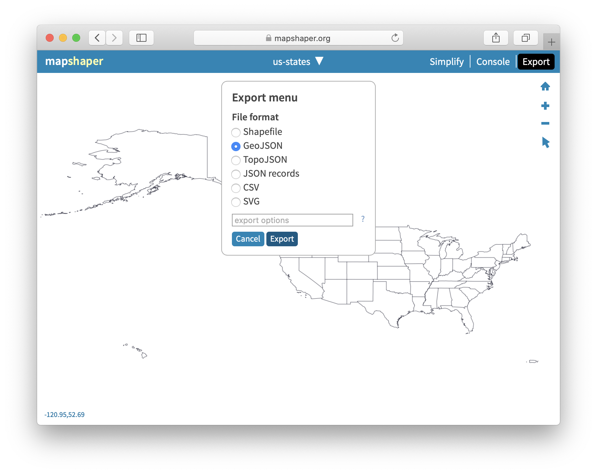
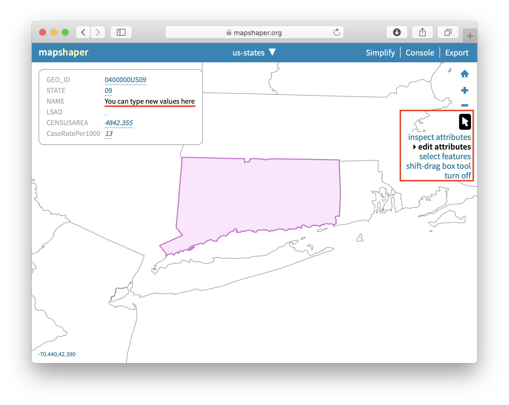
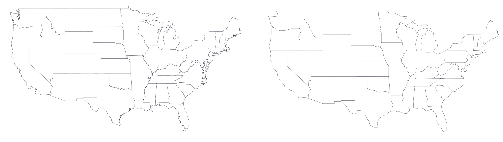
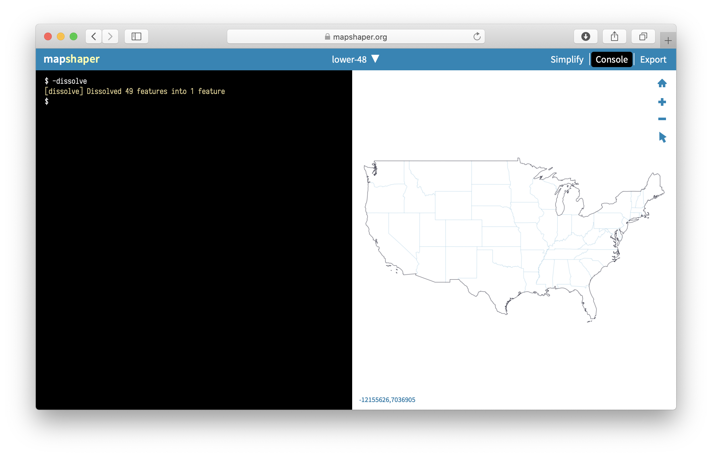

# Transform Your Map Data {#transform}

All maps, including interactive web maps, are made up of different layers.
These are background basemaps, colored or shaded polygons (also known as *choropleth* layers), lines,
and point data that are often represented as markers.

In this chapter, we will look at multiple ways to convert and edit geospatial data
to create layers (files) that you can use in your favorite mapping tools.

We will begin by looking at strategies to geocode large datasets, such as 10,000 addresses, with US Census tools.
We will then talk about polygons and why you should normalize your data before creating choropleth maps.
These map transformations happen inside spreadsheets, so you won't directly deal
with map data until you are halfway through the chapter.

Before you can dive into creating shapes and dealing with boundaries in the map, we will
introduce various file formats (most notably GeoJSON) and talk about geospatial data in general.
You will learn that map data can be raster and vector, that geospatial data consists of location
and attribute components, and how GeoJSON is different from Shapefiles and other geographical data formats.

With our tutorials, you will learn how to convert or draw your own layer of map polygons or polylines on top of satellite imagery
using [the GeoJson.io tool](geojsonio.html), and also how to edit geospatial data and join it with spreadsheet data using [the Mapshaper tool](mapshaper.html).
Both are powerful, web-based open-source geodata tools that for common tasks can substitute for more complex geographic information system tools, such as ArcGIS or QGIS.
Finally, you'll also learn how to georectify a digitized map to display as a background overlay using [the MapWarper tool](mapwarper.html).

By the end of this chapter, you should feel much more confident navigating the
overwhelming world of geospatial data.

## Bulk Geocode with the US Census {- #bulk-geocode}
In Chapter 2: Strengthen Your Spreadsheet Skills, you learned [how to geocode addresses with a Google Sheets Add-On](geocode.html) called [Geocoding by SmartMonkey](https://gsuite.google.com/marketplace/app/geocoding_by_smartmonkey/1033231575312). Geocoding converts street addresses to latitude-longitude coordinates (such as *300 Summit St, Hartford CT, USA* to *41.75, -72.69*) that can be placed on maps. While the Geocoding by SmartMonkey Add-On for Google Sheets works well for medium-sized batches of addresses, sometimes you need a faster geocoding service for larger jobs.

One of the fastest ways to geocode up to 10,000 US addresses at a time is to use the [US Census Geocoder](https://geocoding.geo.census.gov/geocoder/locations/addressbatch?form). First, create a CSV file with 5 columns. Your file must *not* contain a header row, and needs to be formatted the following way:

```
| 1 | 300 Summit St | Hartford | CT | 06106 |
| 2 | 1012 Broad St | Hartford | CT | 06106 |
```

- Column 1: Unique IDs for each address, such as 1, 2, 3, etc. While it does not necessarily have to start at 1 or be in consecutive order, this is the easiest. To quickly create a column of consecutive numbers in most spreadsheets, enter `1`, select the bottom-right corner of the cell, hold down the Option or Control key and drag your mouse downward. TODO: See if this method works in Excel for Windows, Chromebook.
- Column 2: Street address.
- Column 3: City.
- Column 4: State.
- Column 5: Zip Code.

Tip: If your original data combines address, city, state, and zip into one cell, then learn [how to split data into two or more columns](clean-spreadsheets.html) in Chapter 4: Clean Up Messy Data. But if your street addresses contain apartment numbers, you can leave them in.

Second, upload your CSV file to the [US Census Geocoder address batch form](https://geocoding.geo.census.gov/geocoder/locations/addressbatch?form). Select *Find Locations Using... > Address Batch*, then choose your file to upload. Select *Public_AR_Current* as the benchmark, and click *Get Results*.

Note: In left-side menu, you can switch from *Find Locations* to *Find Geographies*
if you wish to obtain additional information, such as the GeoID for each address. The US Census assigns a unique 15-digit GeoID to every place, and a sample (such as `090035245022001`) consists of the state (09), followed by the county (003),
the census tract (524502, or more conventional 5245.02),
the census block group (2), and finally the census block (001).

In a few moments the tool will return a
file named *GeocodeResults.csv* with geocoded results. It usually takes longer for larger files.
Save it, and inspect it in your favorite spreadsheet tool. The resulting file is
an eight-column CSV file with the original ID and address, match type (exact, non-exact, tie, or no match),
and latitude-longitude coordinates. A *tie* means there are multiple possible results for your address. To see all possible matches of an address that received a *tie*, use *One Line* or *Address* tools in the left-side menu and search for that address.

Tip: If you see some unmatched addresses, use a filtering functionality of your
spreadsheet to filter for unmatched addresses, then manually correct them,
save as a separate CSV file, and re-upload. You can use the US Census Geocoder as many
times as you want, as long as a single file doesn't exceed 10,000 records.

To learn more about this service, read the [Overview and Documentation section of the US Census Geocoder](https://www.census.gov/programs-surveys/geography/technical-documentation/complete-technical-documentation/census-geocoder.html).

If for some reason you cannot geocode address-level data, but you need to produce some mapping output,
you can use pivot tables to get counts of points for specific areas, such as towns or states. In the next section,
we will look at hospital addresses in the US and how we can count them by state using pivot tables.

## Pivot Address-Level Point Data into Polygon Data {- #pivot-point-to-polygon}

If you deal with geographical data, you may find yourself in a situation where
you have a list of addresses which need to be counted (*aggregated*) by area
and displayed as a polygon map. In this case, a simple pivot table in a spreadsheet
software can solve the problem.

Note: A special case of a polygon map is a *choropleth* map,
which represents polygons that are colored in a particular way to represent underlying values.
A lot of polygon maps end up being *choropleth* maps, so we will be using this term a lot in this book.

Let's take a look at a [list of all hospitals](https://data.medicare.gov/Hospital-Compare/Hospital-General-Information/xubh-q36u/data)
that are registered with the Medicare program in the United States. The dataset is
stored and displayed by Socrata, a web database popular among government agencies and city administrations.
This particular dataset has information on each hospital's name,
location (nicely divided into Address, City, State, and ZIP Code columns),
a phone number and some other indicators, such as mortality and patient experience.

Now, imagine you are given a task to create a choropleth map of total hospitals by US state.
Instead of showing individual hospitals as points (as in Figuere \@ref(fig:pivot-address)a ),
you want darker shades of blue to represent states with more hospitals (as in Figure \@ref(fig:pivot-address)b).

(ref:pivot-address) You can count addresses by state (or other area) to produce polygon,
or choropleth, maps instead of point maps.

```{r pivot-address, fig.cap="(ref:pivot-address)"}
knitr::include_graphics("images/12-transform/pivot-address-annotated.png")
```

First, save the database to your local machine by going to *Export > Download > CSV*
of Socrata interface. Figure \@ref(fig:pivot-address-export) shows where you can find the Export button.

(ref:pivot-address-export) In Socrata, you can export the entire dataset as a CSV.

```{r pivot-address-export, fig.cap="(ref:pivot-address-export)"}
knitr::include_graphics("images/12-transform/pivot-address-export.png")
```

Next, open the file in your favorite spreadsheet tool. If you use Google Sheets,
use *File > Import > Upload* to import CSV data. Make sure your address columns are present,
and move on to creating a pivot table (in Google Sheets, go to *Data > Pivot table*, make sure the entire data range
is selected, and click *Create*). In the pivot table, set *Rows* to *State*, because
we want to get counts by state. Next, set pivot table's *Values* to *State*—or really any other
column that has no missing values—and choose *Summarize by: COUNTA*. Voila!

(ref:pivot-address-sheet) Use pivot tables in any spreadsheet software to count addresses per area (such as state, county, of zip code).

```{r pivot-address-sheet, fig.cap="(ref:pivot-address-sheet)"}
knitr::include_graphics("images/12-transform/pivot-address-sheet.png")
```

Your aggregated dataset is ready, so save it as a CSV. If you use Google Sheets,
go to *File > Download > Comma-separated values (.csv, current sheet)*.
You can now merge this dataset with your polygons manually using editing capabilities of
[GeoJson.io](geojsonio.html), or merge it all in one go using powerful [Mapshaper](mapshaper.html).

We will introduce both tools in the next few sections.
But before we do that, let's talk about data normalization and why showing
counts of hospitals per state doesn't really tell a good story.

## Normalize Data to Create Meaningful Choropleth Maps {- #normalize}

Choropleth maps are best when they represent relative, not absolute values.
Consider two maps shown in Figure \@ref(fig:normalize-map-data). They both are
about Covid-19 cases in the US states (excluding Alaska and Hawaii) as of
June 26, 2020. Figure \@ref(fig:normalize-map-data)a shows total number of recorded cases per state,
and Figure \@ref(fig:normalize-map-data)b shows Covid-19 cases adjusted by the state's population.
Darker colors represent higher values. Do you notice any differences in spatial patterns?

(ref:normalize-map-data) Choropleth maps work best with normalized values.

```{r normalize-map-data, fig.cap="(ref:normalize-map-data)"}
knitr::include_graphics("images/12-transform/normalize-map-data-annotated.png")
```

Both maps show Covid-19 data collected by the New York Times and published
[on GitHub](https://github.com/nytimes/covid-19-data).
In the map in Figure \@ref(fig:normalize-map-data)b, we normalized (divided) values by population in each state,
according to the 2018 US Census American Community Survey,
the most recent data available on the day of writing. We didn't
add legends and other important cartographic elements so that you can
better focus on interpreting spatial patterns. In both cases,
we used Jenks natural breaks for classification.

What are the worst-hit states according to the map showing total Covid-19 counts
(shown in Figure \@ref(fig:normalize-map-data)a)?
If you are familiar with the US geography, you can quickly tell that these are
New York, New Jersey, Massachusetts, Florida, Illinois, Texas, and California.
But five of these happen to be some of the most populous states in the US,
so it makes sense that they will also have higher Covid-19 cases.

Now, how about the map in Figure \@ref(fig:normalize-map-data)b?
You can see that New York and its neighbors,
including New Jersey and Massachusetts, have by far the highest rates per capita
(per person), which we saw in the first map. But you can also see
that in fact California, Texas, and Florida were impacted to a lesser extent
than the map on the left had suggested. So the map with per-capita values is a
much better illustration to the story about New York being the *first* epicenter of the Covid-19
crisis in the United States.

#### Different ways to normalize data {-}

You can normalize data in many ways, and there is not necessarily one
acceptable way of doing it.

One of the most common ways of normalization is deriving "per capita", or "per person" values.
If values are small, such as rare disease cases or lottery winners, they can be presented as "per 1,000" or "per 100,000" people.
Divide your quantity by population in that area to derive per capita values.

Choropleth maps work well with percentages. The good news is, humans like percentages too.
It is quite natural for us to understand that a 9% unemployment rate means that of 100 people
who were willing to work, nine were unable to find a job. To derive a percentage for unemployment,
divide the number of unemployed people by labor force size (adult
population who are willing and able to work), and multiply by 100.

Unlike counts, most *measured* variables do not need normalization because
they belong to a scale. For example, median age (the age of the "middle"
person in a population, when sorted from youngest to oldest) can be directly compared
among populations. We know that humans live anywhere between 0 and 120 years or so,
and we wouldn't expect median ages to be vastly different from one country to another (maybe twice,
but not tenfold). Median incomes, if measured in the same currency, also belong to the same scale
and can be compared directly.

#### How not to normalize values {-}

Absolute values are very important for context. Saying that "20% of blond men living in
in town X won the lottery" may sound like a catchy headline, but in reality
the town has 450 residents, of those 200 are men, and of those only 5 have light hair color.
One of those five (and here comes the 20%) was lucky to win the lottery, so technically
the headline didn't lie.

This is, of course, an extreme and comic example, but exaggerations in this spirit are not uncommon.
If you want readers to trust you, make sure you are open about total counts when reporting
normalized values (such as percentages or per capita values).

Absolute values are important for another reason: behind numbers there are often people,
and smaller, normalized values may hide the scale of the problem.
Saying that "the unemployment rate is only 5%" is valid, but the 5%
of, say, Indian labor force (around 522 million) is about 26 million, which is
pretty much the total population of Australia.

Exercise your best judgement when you normalize values. Make sure you don't
blow numbers out of proportion by normalizing values in smaller populations.
But also don't hide large counts behind smaller percentages for larger populations.

At this point, you should have enough geocoding and spreadsheet skills to aid you
with map making. In the following section, we will talk about geographical data in general and
will introduce different geospatial file formats to ensure you are
ready to create, use, and share map data.

## Convert to GeoJSON format {- #convert-geojson}

Geospatial data comes in an overwhelming number of file formats.
We will tell you about a few most common ones so that you have
a general idea of what tools you can use to work with them.
But before we do that, let's talk about the basics of geospatial (map) data.

#### About geospatial data {-}

The first thing to know about geospatial data is that it
consists of two components, *location* and *attribute*.
When you use Google Maps to search for a restaurant, you get a red
marker on the screen that points to the latitude and longitude
of the physical location of the restaurant in the real world. These latitude and longitude (two numbers)
are your location component.
The name of the restaurant, its human-friendly address, and guest reviews
are the attributes, which bring value to your location data.

Second, geospatial data can be *raster* or *vector*,
as illustrated in Figure \@ref(fig:geospatial-raster-vector).
Raster data, as shown in Figure \@ref(fig:geospatial-raster-vector)a, is a grid of cells ("pixels") of a certain size
(for example, 1 meter by 1 meter). For example, satellite images
of the Earth that you see on Google Maps are raster geospatial data.
Each pixel contains the color of Earth that satellite cameras
were able to capture. People and algorithms can then use raster
data (images) to create outlines of buildings, lakes, roads,
and other objects. These outlines become vector data. For example, most of
[OpenStreetMap](https://www.openstreetmap.org) was built
by volunteers tracing outlines of objects from satellite images.

(ref:geospatial-raster-vector) Geospatial data can be raster or vector.

```{r geospatial-raster-vector, fig.cap="(ref:geospatial-raster-vector)"}
knitr::include_graphics("images/12-transform/geospatial-raster-vector-annotated.png")
```

In this book, we will focus on vector data, which is based on
points, lines, and polygons, as shown in Figure \@ref(fig:geospatial-raster-vector)b. Vector data can be
much more precise than raster data, because points' coordinates
can be expressed with precise decimals. In addition, vector
data can contain as much extra *attribute* information about each object as desired,
whereas raster data is generally limited to 1 value per cell,
whether it is the Earth color, or temperature, or altitude.
Moreover, vector map files are usually much smaller in size
than raster ones.

Let's take a look at some of the most common vector file formats.

#### GeoJSON {-}
[GeoJSON](https://geojson.org) is a newer, popular open format for map data
that comes in `.geojson` or `.json` files.
It was first developed in 2008, and then standardized in 2016 by
the Internet Engineering Task Force (IETF). The code snippet below
represents a single point (feature) with latitude of 41.76 and longitude of -72.67
in GeoJSON format. That point has a *name* attribute (property) whose value is *Hartford*.

```
{
  "type": "Feature",
  "geometry": {
    "type": "Point",
    "coordinates": [-72.67, 41.76]
  },
  "properties": {
    "name": "Hartford"
  }
}
```

The simplicity and readability of GeoJSON allows you to edit it even in the most
simple text editor. We strongly recommend you use and share your map data in GeoJSON.
Web-based maps, such as those built with Leaflet, Mapbox, Google Maps JS API, and Carto,
as well as ArcGIS and QGIS all support GeoJSON. By having your geospatial data stored
and shared in GeoJSON, you ensure you can use it on the web with nearly any mapping tool.
You can also be confident that other people will be able to use and extract data
from the file without bulky and often expensive GIS software installed.

Also, your GitHub repository will automatically display any GeoJSON files in a map view,
like is shown in Figure \@ref(fig:geojson-github).

(ref:geojson-github) GitHub can show previews of GeoJSON files stored in repositories.

```{r geojson-github, fig.cap="(ref:geojson-github)"}
knitr::include_graphics("images/12-transform/geojson-github.png")
```

Warning: In GeoJSON, coordinates are ordered in *longitude-latitude* format,
the same as X-Y coordinates in mathematics. This is the opposite of Google Maps
and some other web map tools, which order values as *latitude-longitude*.
For example, *Hartford, Conn.* is located at (-72.67, 41.76) according to GeoJSON,
but at (41.76, -72.67) in Google Maps. Neither notation is right or wrong, just make sure
you know which one you are dealing with. Tom MacWright created a great summary table
[showing lat/lon order of different geospatial formats and technologies](https://macwright.com/lonlat/).

#### Shapefiles {-}
The shapefile format was created in the 1990s by Esri, the company that develops
ArcGIS software. Shapefiles typically appear as a folder of subfiles with suffixes
such as `.shp`, `.shx`, and `.dbf`. The folder with shapefiles is often compressed in a `.zip` file.

Although government agencies commonly distribute map data in shapefile format, the standard tools for editing
these files---ArcGIS and its free and open-source cousin, QGIS---are not as
easy to learn as other tools in this book. For this reason, we
recommend converting shapefiles into GeoJSON files if possible.
[Mapshaper](mapshaper.html), discussed a bit later in the chapter, can perform such
conversion.

#### GPS Exchange Format (GPX) {-}

If you ever exported your Strava run or a bike ride
from a GPS device, chances are you ended up with a `.gpx` file.
GPX is an open standard and is based on XML markup language.
Like GeoJSON, you can inspect a GPX file in any simple text editor
to see its contents. Most likely, you will see a collection timestamps and latitude/longitude
coordinates of the recording GPS device at that particular time.
You should be able to convert GPX to GeoJSON with [GeoJson.io](geojsonio.html)
utility discussed later in this chapter.

#### Keyhole Markup Language (or KML) {-}

The KML format rose in popularity during the late 2000s.
It was developed for Google Earth, a free and user-friendly tool that allowed many people to
view and edit two- and three-dimensional geographic data. KML files were often used
with maps powered by Google Fusion Tables, but that [became history in late 2019](https://killedbygoogle.com/).
[GeoJson.io](geojsonio.html) should be able to convert your KML file into a GeoJSON.

Sometimes `.kml` files are distributed in a compressed `.kmz` format.
See [Converting from KMZ to KML format](convert-kmz) section of this book
to learn to convert.

#### MapInfo TAB {-}
Similar to Esri's shapefiles, MapInfo's TAB format comes as a folder
with `.tab`, `.dat`, `.ind`, and some other files. It is a proprietary format created
and supported by MapInfo, Esri's competitor, and is designed to work well with MapInfo Pro
GIS software. Unfortunately, you will most likely need MapInfo Pro, QGIS, or ArcGIS to re-save these as GeoJSON
or a Shapefile.

We've mentioned only a handful of the most common geospatial file formats.
There is a myriad of other, less known formats for both raster and vector data.
Remember that GeoJSON is one of the best, most universal formats for your *vector* data,
and we strongly recommend to store and share your map data in GeoJSON.
In the next section, we will look at free online tools to create, convert, join, crop,
and in other ways manipulate GeoJSON files.

## GeoJson.io to Convert, Edit, and Create Map Data {- #geojsonio}

[GeoJson.io](https://geojson.io) is a popular open-source web tool to convert,
edit, and create GeoJSON files. The tool was originally developed by
[Tom MacWright](https://macwright.org/about/) in 2013
and quickly became a go-to tool for geospatial practitioners.

In this tutorial, we will show you how to convert existing KML, GPX, TopoJSON, and even
CSV files with lat/lon data into GeoJSON files. We will also look at
editing attribute data and adding new features to GeoJSON files,
and creating them from scratch by tracing satellite imagery.

#### Convert KML, GPX, and other formats into GeoJSON {-}

Navigate to [GeoJson.io](https://geojson.io). You will see
a map on the left, and a Table/JSON attribute view area on the right. At the start,
it represents an empty feature collection (features are your points, lines, and polygons).

Drag and drop your geospatial data file into the map area on the left.
Alternatively, you can also import a file from *Open > File* menu.
If you don't have a geospatial file, download [Hartford parks](data/hartford-parks.kml)
in KML format. If GeoJson.io was able to recognize and import the file,
you will see a green popup message in the upper-left corner saying how many
features (in case of Hartford parks, polygons) were imported.
Figure \@ref(fig:geojson-io-import) shows us that 62 features were imported from
the sample Hartford parks file. You can see that the polygons appeared
on top of the Mapbox world layer.

Note: If GeoJson.io couldn't import your file, you will see a red
popup saying it "Could not detect file type". You will need to use a different
tool, such as Mapshaper or QGIS, to convert your file to GeoJSON.

(ref:geojson-io-import) GeoJson.io successfully imported Hartford parks KML file.

```{r geojson-io-import, fig.cap="(ref:geojson-io-import)"}
knitr::include_graphics("images/12-transform/geojson-io-import.png")
```

You can now save your file to GeoJSON. Go to *Save > GeoJSON* to download
a converted GeoJSON file to your computer.

#### Create GeoJSON from a CSV file {-}

GeoJson.io can transform a spreadsheet with *latitude* (or *lat*) and *longitude* (or *lon*)
columns into a GeoJSON file of point features. Each row in the spreadsheet
becomes its own point, and all columns other than *lat* and *lon*
become *attributes* (or *properties*) of point features. An example of
such spreadsheet is shown in Figure \@ref(fig:geojson-io-csv-data). You
can [download it](data/hartford-and-suburbs.csv) for the exercise.

(ref:geojson-io-csv-data) A spreadsheet with lat/lon columns can be transformed into a GeoJSON with point features.

```{r geojson-io-csv-data, fig.cap="(ref:geojson-io-csv-data)"}
knitr::include_graphics("images/12-transform/geojson-io-csv-data.png")
```

1. Save your spreadsheet as a CSV file, and drag-and-drop it to the map area of GeoJson.io.
You should see a green popup in the upper-left corner notifying you how many features
were imported.

Note: If you had some data on the map already, GeoJson.io wouldn't erase anything
but instead would add point features to the existing map.

2. Click on a marker to see a popup with point properties. If you used the sample file
with towns around Hartford, you will see *town*, *community_type*, and *wiki_link* features
in addition to the tool's default *marker-color*, *marker-size*, and *marker-symbol*
fields.

Tip: The popup is interactive, and you can click and edit each property (including property names).
You can also add a new property by clicking the *Add row* button. You can delete
the marker by clicking *Delete feature* button.

3. Click *Save* to record all marker changes to the GeoJSON. This will close the popup window,
and you will see updated markers in the JSON tab to the right of the map.
4. It may be quicker to view all data as a table instead of dealing with individual marker popups.
In the *Table* tab to the right of the map, you can add, rename, and remove columns
from *all* features (markers) at once.
Table cells are also modifiable, so you can edit your data there.
5. Once you are happy with your map data, go to *Save > GeoJSON* to download the result to your computer.
You can also log into GeoJson.io with your GitHub account and save directly to your repository.

```{r geojsonio-gif, fig.cap="A spreadsheet with coordinates columns can be transformed into a GeoJSON with point features."}
if(knitr::is_html_output()) knitr::include_url("images/12-transform/dataviz-geojsonio-640.gif", height="466px")
```

#### Create a GeoJSON from scratch using drawing tools {-}

GeoJson.io lets you create geospatial files from scratch, using simple drawing
tools to put markers (points), lines, and polygons to appropriate locations.
These are useful when you have no original file to work with. The following
steps will show you how to create a new GeoJSON file and add markers, lines, and polygons
to it.

1. Open GeoJson.io and in the lower-left corner switch from Mapbox (vector tiles)
to Satellite.
2. In the upper-right corner of the map, use the Search tool to find the area you're interested in mapping.
For this exercise, we will use tennis courts at Trinity College, Hartford, as shown in
Figure \@ref(fig:geojson-io-draw).

(ref:geojson-io-draw) Use drawing tools to create points, lines, and polygons in GeoJson.io.

```{r geojson-io-draw, fig.cap="(ref:geojson-io-draw)"}
knitr::include_graphics("images/12-transform/geojson-io-draw.png")
```

3. In the toolbar, you have a choice of four drawing tools: a polyline (which is a series
of points connected by lines, but not closed like a polygon), a polygon, a rectangle
(which is just an instance of a polygon), and a marker (point). Let's start by creating a marker.
4. Click on the *Draw a marker* button, and click anywhere on the map to place it.
You will see a gray marker that is now part of your map. You can modify its properties,
or delete it in the interactive pop-up.
5. Next, choose *Draw a polyline* and click on multiple locations in the map to see
connected lines appearing. To finish and create a feature, click again on the final point.
Polylines are generally used for roads and paths.
6. Drawing a polygon is similar to drawing a polyline, except that you need to complete
the feature by making your final point at the same location as your initial point.
Polygons are used to define object boundaries, from continents to buildings, cars, and
anything that has significant dimensions.
7. Use *Edit layers* tool (the one above *Delete*) to move a marker to a better position,
or adjust the shapes of your features.

Once you are done creating features and their physical boundaries, it is time to add
meaningful attribution data. Use the interactive popups or the Table view to
give objects names and other qualities. When finished, save the GeoJSON to your computer.

Drawing tools can be used to correct your existing GeoJSON files. For example,
if you created a GeoJSON from a CSV file, you might decide to move some markers
with *Edit layers* tool instead of modifying their latitude and longitude values.
Or you might decide that your polygons (eg those representing Hartford parks) are
too "simplified", and make them more precise with the satellite imagery.

In the next section, we will introduce Mapshaper, another free online tool
to convert and modify geospatial files.

## Mapshaper to Convert, Edit, and Join Data {- #mapshaper}

Like [GeoJson.io](geojsonio.html), [Mapshaper](https://mapshaper.org)
is a free, open-source editor that can convert geospatial files, edit attribute
data, filter and dissolve features, simplify boundaries to make files smaller,
and many more. Unlike GeoJson.io, Mapshaper doesn't have drawing tools,
so you won't be able to create geospatial files from scratch.

Mapshaper is developed and maintained by Matthew Bloch [on GitHub](https://github.com/mbloch/mapshaper).
It is written in JavaScript, so we recommend you use a recent version of Firefox or Chrome.

This free and easy-to-learn Mapshaper web tool has replaced *many* of our map preparation
tasks that previously required expensive and hard-to-learn ArcGIS software, or its free
but still-challenging-to-learn cousin, QGIS. Even advanced GIS users may discover Mapshaper
to be a quick alternative for some common but time-consuming tasks.

#### Import, convert, and export map boundary files {-}

You can use Mapshaper to convert between geospatial file formats. Unlike GeoJson.io,
Mapshaper also supports Esri Shapefiles (which is a folder of individual files with the same name,
but different file extensions), so you can easily convert a Shapefile into a web-friendly GeoJSON.
In the following steps, we will convert a geospatial file by import it to Mapshaper,
and then export it as a different file type.

1. Navigate to [Mapshaper.org](https://mapshaper.org). The start page is two large drag-and-drop zones
which you can use to import your file. The smaller area at the bottom, *Quick import*, uses default
import settings and is a good way to begin.
2. Drag and drop your geospatial file to the *Quick import* area,
or use our sample Shapefile of [US state boundaries](data/us-states.zip).
This is a `.zip` archive which contains a folder with all necessary files.

Note: If you want to import a folder, you need to either select all files inside that folder
and drop them all together to the import area, or create a `.zip` archive.

3. Each imported file becomes a layer, and is accessible from the dropdown menu in the top-middle
of the browser window. There, you can see how many features each layer has, toggle their visibility,
or delete them.
4. To export, go to *Export* in the upper-right corner, and select a desired file format.
The choice of export formats is shown in Figure \@ref(fig:mapshaper-export).
As of July 2020, these are Shapefile, GeoJSON,
TopoJSON (similar to GeoJSON, but with topographical data), JSON records, CSV,
or SVG (Scalable Vector Graphics, for web and print). If you export more than one layer at a time,
Mapshaper will archive them first, and you will download an `output.zip` that contains
all exported layers.

(ref:mapshaper-export) You can use Mapshaper to quickly convert between geospatial file formats.

```{r mapshaper-export, fig.cap="(ref:mapshaper-export)"}

```

Tip: Mapshaper doesn't work with KML or KMZ files, but you can use [GeoJson.io](#geojson.html) to convert these.


#### Edit data for specific polygons {-}

You can edit attribute data of individual polygons (and also points and lines) in Mapshaper.
Figure \@ref(fig:mapshaper-edit) shows you how.

1. Import the file whose polygon attributes you want to edit.
1. Under the cursor tool, select *edit attributes*.
1. Click on the polygon you want to edit. A pop-up will appear in the upper-left corner
listing all attributes and values of the polygon.
1. Click on any value (underlined, in blue) and edit it.
1. When you are done, export your geospatial file by clicking *Export* and
choosing the desired file format.

(ref:mapshaper-edit) Use *edit attributes* tool (under Cursor tool) to edit attributes of polygons, lines, and points.

```{r mapshaper-edit, fig.cap="(ref:mapshaper-edit)"}

```


#### Simplify map boundaries to reduce file size {-}

You may not need precise and detailed map boundaries for
data visualization projects where zoomed-out geographies are shown.
Detailed boundaries are heavy, and may slow down your web maps.

Consider two maps of the contiguous US states (also known as *the lower 48*,
the term Ilya learned in 2018 while travelling in Alaska), shown in Figure \@ref(fig:mapshaper-simplify-demo).
The map in Figure \@ref(fig:mapshaper-simplify-demo)a is more detailed and is about 230 kilobytes, but the map in Figure \@ref(fig:mapshaper-simplify-demo)b
is only 37 kilobytes, 6 times smaller!

(ref:mapshaper-simplify-demo) Consider simplifying geometries with Mapshaper to make your web maps faster.

```{r mapshaper-simplify-demo, fig.cap="(ref:mapshaper-simplify-demo)"}
knitr::include_graphics("images/12-transform/mapshaper-simplify-demo-annotated.png")
```

To simplify map boundaries in Mapshaper, follow the steps below.

1. Import your geo file to Mapshaper. You can use the [sample contiguous US states GeoJSON](data/lower-48.geojson).
1. Click the *Simplify* button in the upper-right corner. The Simplification menu will appear,
where you can choose one of three methods. We recommend checking *prevent shape removal*, and leaving
the default *Visvalingam / weighted area*. Click *Apply*.
1. You will see a slider with `100%` appear on top (Figure \@ref(fig:mapshaper-simplify)), replacing the layer selection dropdown.
Move the slider to the right and see the map simplify its shape as you go. Stop when you think
the map looks appropriate (when the shapes are still recognizable).
1. Mapshaper may suggest to repair line intersections in the upper-left corner. Click *Repair*.
1. You can now export your file using the *Export* feature.

(ref:mapshaper-simplify) Use Simplify & Repair tools in Mapshaper.

```{r mapshaper-simplify, fig.cap="(ref:mapshaper-simplify)"}

```

Tip: You may find the US shape a bit unusual and vertically "shrunk".
In **Console**, type `-proj EPSG:3857` to change projection to Web Mercator,
which is more common.

#### Dissolve internal polygons to create an outline map {-}

Mapshaper's most powerful tools are available through the *Console*, which allows you to type commands for common map editing tasks.
One of such tasks is to create an outline map by removing the internal boundaries. For example, you can dissolve
state boundaries of the US map in the previous exercise to get the outline of the country, like is shown in
Figure \@ref(fig:mapshaper-dissolve).

(ref:mapshaper-dissolve) Mapshaper lets you dissolve boundaries to create an outline shape.

```{r mapshaper-dissolve, fig.cap="(ref:mapshaper-dissolve)"}

```

Click the Console button, which opens a window to type in commands. Enter the command below, then press return (Enter).


```markdown
-dissolve
```

You will see that internal boundaries became lighter color, and that's Mapshaper's way of saying they no longer exist.
You can now export your outline shape.


#### Clip a map to match an outline layer {-}

The state of Connecticut consists of 8 counties, which in turn are divided into towns. There are a total of 169 towns in Connecticut.
Imagine you are given a [boundary file of all 169 towns](data/ct-towns.geojson), and [the outline of Hartford county](data/hartfordcounty-outline.geojson).
You need to "cut" the original towns map to only include those towns that fall within Hartford county.

Mapshaper allows you to do just that using one simple `-clip` command.

1. Import two boundary files into Mapshaper. One is the larger one that is being clipped (if you use sample files, *ct-towns*),
and one is the desired final shape (*hartfordcounty-outline*). The latter is what ArcGIS calls the "clip feature".
2. Make sure your active layer is set to the map you are clipping (*ct-towns*).
3. In the *Console*, type `-clip` followed by the name of your clip layer, like that:
```
-clip hartfordcounty-outline
```
4. You should see your active layer got clipped. Sometimes you end up with tiny "slivers" of clipped areas that remain alongside the borders.
If that is the case, use the `-filter-slivers` command to remove them, like that:
```
-clip hartfordcounty-outline -filter-slivers
```
5. Your Mapshaper state should look like pictured in Figure \@ref(fig:mapshaper-clip). You can now save the file on your computer using the *Export* button.

(ref:mapshaper-clip) When clipping, make sure your active layer is the one being clipped (with many features), not the clipping feature iteslf.

```{r mapshaper-clip, fig.cap="(ref:mapshaper-clip)"}
knitr::include_graphics("images/12-transform/mapshaper-clip.png")
```

#### Remove unwanted data fields {-}

Sometimes map features, such as polygons, lines, and points, contain unwanted *attributes* (or fields, or columns) that you may want to remove.
In the *Console*, type the `-filter-fields` editing command to remove unnecessary fields.

For example, remove all fields except *town*:

```
-filter-fields town
```

If you want to leave more than one field, separate them by a comma, but without spaces, like that:

```
-filter-fields town,state
```

Warning: If you leave a space after comma, you will get a *Command expects a single value* error.


#### Join spreadsheet data with polygon map {-}

Combining spreadsheet data with geographical boundaries is a common task for geospatial practitioners.
Imagine you have a file with [Connecticut town boundaries](data/ct-towns.geojson),
and you want to add [population data](data/ct-towns-popdensity.csv) to each of them
in order to build a choropleth map.

Mapshaper provides a powerful `-join` command to join such files. Remember that you need some common keys
in both datasets (such as *town name*, or *state*, or *country*) in order to join files. Otherwise Mapshaper has no way of knowing which
numbers belong to which polygons.

1. Import both geospatial file and a CSV dataset into Mapshaper using Quick import box.
2. Make sure both files appear in the drop-down list of layers.
Your CSV data will be shown as something that resembles a table. Use the *Cursor > inspect attributes* tool
to make sure the data is imported correctly. If you use the sample CT files, note that the *ct-towns* layer
has *name* attribute with the name of the town, and *ct-towns-popdensity* has town names in the *town* column.
3. Make your geospatial layer (*ct-towns*) is the one active.
4. Open the *Console*, and use the `-join` command, like this:
```
-join ct-towns-popdensity keys=name,town
```
where `ct-towns-popdensity` is the CSV layer you are merging with, and `keys` are the attributes that contain values to join by.
In case with our sample files, these would be town names which are stored in `name` attribute of the map file, and `town` column
of the CSV file.

5. You will see a message in the console notifying you if join was performed successfully, or if Mapshaper encountered any errors.
6. Use the *Cursor > inspect attributes* tool to make sure you see CSV columns as fields of your polygons, like is shown in Figure \@ref(fig:mapshaper-join).
7. You can now save the file to your computer by clicking the *Export* button.

(ref:mapshaper-join) Mapshaper lets you join spatial and CSV files using common keys (for example, town names).

```{r mapshaper-join, fig.cap="(ref:mapshaper-join)"}
knitr::include_graphics("images/12-transform/mapshaper-join.png")
```

Tip: To avoid confusion, it may be useful to re-name your CSV column that contains key values to match the key attribute name of your map.
In our example, you would rename *town* column to *name* column in the CSV, and your command would end with `keys=name,name`.

Do you remember aggregating address-level point records of hospitals into [hospital counts per state](pivot-point-to-polygon.html)
discussed earlier in this chapter? Now is a good time to find that .CSV file and practice your merging skills.


#### Count points in polygons with Mapshaper {-}

Mapshaper lets you count points in polygons, and record that number in polygon attributes using `-join` command.

1. Import two geospatial files, one containing polygon boundaries (for example, [US state boundaries](data/us-states.geojson)),
and another containing points that you want to aggregate (for example,
[hospitals in the US](data/hospitals-points.geojson)).

2. Make sure your polygons (not points) layer is active by selecting it from the dropdown menu.

3. In the *Console*, perform `-join` using a `count()` function, like this:
```
-join hospitals-points calc='hospitals = count()' fields=
```
This command tells Mapshaper to count points inside *hospitals-points* layer and record them as *hospitals* attribute of the polygons.
The `fields=` part tells Mapshaper to not copy any fields from the points, because we are performing many-to-one matching (many hospitals
per state, in our case).

4. Use the *Cursor > inspect attributes* tool to make sure polygons obtained a new field with the recorded count of points,
like is shown in Figure \@ref(fig:mapshaper-count-points).

5. Save the new file using *Export* button and choosing the desired output format.

(ref:mapshaper-count-points) Mapshaper's -join can count points in polygons.

```{r mapshaper-count-points, fig.cap="(ref:mapshaper-count-points)"}
knitr::include_graphics("images/12-transform/mapshaper-count-points.png")
```

#### More about joins {-}

From the "Count points in polygons with Mapshaper" section of this chapter,
you should recall that you do not need to specify *keys* if you want to perform join
based on geographical locations between two geospatial layers (one being points, the other is polygons).
If one of your files is a CSV, you need *keys*.

If you don't have a CSV table that matches the columns in your boundary map data, you can easily create one.
Upload the boundary map to Mapshaper, and export in CSV format. Open the downloaded file in any spreadsheet tool.
To match data columns in the CSV spreadsheet, use the [VLOOKUP](vlookup.html) function.

In real life, you will rarely have perfect files with one-to-one matches,
so you might want to have more information about which features didn't get matched so
that you can fix your data.
Mapshaper helps you keep track of data that is not properly joined or matched. For example, if the polygon map contains 169 features
(one for each town in Connecticut), but the CSV table contains only 168 rows of data, Mapshaper will join all of those with matching keys,
and then display this message:
```
[join] Joined data from 168 source records to 168 target records
[join] 1/169 target records received no data
[join] 1/169 source records could not be joined
```
To get more details on which values were not joined, add `unjoined unmatched -info` flags to your join command, like this:
```
-join ct-towns-popdensity keys=name,town unjoined unmatched -info
```
The `unjoined` flag saves a copy of each unjoined record from the source table into another layer named *unjoined*.
The `unmatched` flag saves a copy of each unmatched record from the target table to a new layer named *unmatched*.
And the `-info` flag outputs some additional information about the joining procedure to the console.


#### Merge selected polygons with join and dissolve commands {-}

In Mapshaper, you can merge selected polygons into larger "clusters" using `-join` and `-dissolve` commands.

Imagine that you are employed by the CT Department of Public Health, and your task is
to divide 169 towns into 20 so-called Health Districts and produce a new geospatial file.
By the way, health districts [are a real thing in Connecticut](https://portal.ct.gov/DPH/Local-Health-Admin/LHA/Local-Health-Administration---Site-Map).

You should begin by creating a *crosswalk* of towns and their health districts.
Computer scientists and those working with data often use the term *crosswalk* to describe some kind of matching
between two sets of data, such as zipcodes and towns where they are located. In our case, the crosswalk can be as simple as a two-column CSV list
of a town and its district, each on a new line. Because your boss didn't give you a list of towns in a spreadsheet format,
but instead a GeoJSON file with town boundaries, let's extract a list of towns from it.

1. Import [ct-towns.geojson](data/ct-towns.geojson) to Mapshaper using Quick import box.
2. You can use the *Cursor > inspect attributes* tool to see that each polygon has a *name* attribute with the name of the town.
3. Save attribute data as a CSV file using *Export* button. Open the file in any spreadsheet tool. You will see that your data is a one-column
file with a *name& column that lists 169 towns.
4. Create a second column titled *merged* and copy-paste values from the first, *name* column.
At this point your spreadsheet contains two columns with the same values.
5. Pick a few towns, for example *West Hartford* and *Bloomfield*, and assign "Bloomfield-West Hartford"
to their *merged* column, like is shown in Figure \@ref(fig:mapshaper-merge-csv). You may stop right here and move to the next step, or keep assigning district names
to a few other neighboring towns.

(ref:mapshaper-merge-csv) Create a two-column crosswalk of towns and which districts they should be merged to.

```{r mapshaper-merge-csv, out.width="250px", fig.cap="(ref:mapshaper-merge-csv)"}
knitr::include_graphics("images/12-transform/mapshaper-merge-csv.png")
```

6. Save this new file as *ct-towns-merged.csv*, and drag-and-drop it to Mapshaper on top of your *ct-towns* layer. Click *Import*.
7. This new CSV layer will be added as *ct-towns-merged* and will appear as a series of table cells. From the dropdown menu,
select *ct-towns* to get back to your map.
8. Now you are ready to merge certain towns into districts according to your uploaded CSV file. Open the *Console*, and type:
```
-join ct-towns-merged keys=name,name
```
to join the CSV layer with the boundaries layer that you see on the screen, followed by
```
-dissolve merged
```
to dissolve polygons of towns according to the *merged* column of the CSV file.

In our example, only Bloomfield and West Hartford are dissolved into a combined
"Bloomfield-West Hartford" regional health district (with the shared boundary between towns becoming grayed out),
and all of the other polygons remain the same. Figure \@ref(fig:mapshaper-merge) shows the final result.

(ref:mapshaper-merge) Merge polygons based on a predefined crosswalk.

```{r mapshaper-merge, fig.cap="(ref:mapshaper-merge)"}
knitr::include_graphics("images/12-transform/mapshaper-merge.png")
```

You can inspect attribute data of polygons using *Cursor > inspect attributes* tool, and save the resulting file
using the *Export* button.


#### Learn more advanced MapShaper methods {-}

There are many more commands within Mapshaper that are worth exploring if you are serious about GIS, such as changing projections, filtering
features using JavaScript expressions, assigning colors to polygons based on values, and many more. Explore the [Wiki](https://github.com/mbloch/mapshaper/wiki/Command-Reference) of Mapshaper project on GitHub for more commands and examples.


## Georectify a Digitized Map with MapWarper {- #mapwarper}
TODO: write this section about using [MapWarper](http://mapwarper.net), a tool created and hosted by Tim Waters, to upload and georectify a scanned map. This means to properly position a scanned map based on standard coordinates, so that you can place it as an overlay on an interactive map, such as [Leaflet Storymaps with Google Sheets](leaflet-storymaps-with-google-sheets.html).

Anyone can upload and georectify a map on the developer's public site at http://mapwarper.net, and also see how it's used by organizations such as the New York Public Library at http://maps.nypl.org.

Warning: MapWarper is a wonderful open-source tool and platform, but service may be interrupted. As of July 2020, the site warns: "Ran out of disk space. Maps older than 2 years will need re-warping to work. Downtime will happen again."


## Convert a Compressed KMZ file to KML format {- #convert-kmz}

In the previous sections, we looked at using Geojson.io and Mapshaper
to convert geospatial files. However, not all file types can be converted with these tools.
This chapter shows a particular example of a commonly requested
`.kmz` <-> `.kml` pair conversion with Google Earth Pro.

KMZ is a compressed version of a KML file, and the easiest way to convert
between the two is to use free Google Earth Pro (if you remember from
*Convert to GeoJSON format* section, KML is a native format of Google Earth).

1. Download and install [Google Earth Pro](https://www.google.com/earth/versions/) for desktop.
2. Double-click on any .kmz file to open it in Google Earth Pro. Alternatively, open Google Earth Pro first,
and go to *File > Open* and choose your KMZ file.
3. Right-click (or control-click) on the KMZ layer under Places menu, and select *Save Place As...*,
like is shown in Figure \@ref(fig:kmz-earth).

(ref:kmz-earth) In Google Earth Pro, right-click the KMZ layer and choose *Save Place As*.

```{r kmz-earth, out.width="400px", fig.cap="(ref:kmz-earth)"}
knitr::include_graphics("images/12-transform/kmz-earth.png")
```
4. In the dropdown menu of *Save file...* window, choose KML format, like is shown in Figure \@ref(fig:kmz-save-as).

(ref:kmz-save-as) Save as KML, not KMZ.

```{r kmz-save-as, out.width="350px", fig.cap="(ref:kmz-save-as)"}
knitr::include_graphics("images/12-transform/kmz-save-as.png")
```

Alternatively, you can use any zip-utility to extract a KML file from KMZ.
KMZ is simply a 'zipped' version of a KML file!

### Summary {- #summary12}

In this chapter, you learned to use pivot tables to count addresses (points)
by geographical area, such as states or cities (polygons).
You lerned  that geospatial data can be vector or raster.
The best file format to store, share, and use vector data is GeoJSON.
You can use GeoJson.io to create, edit, or convert geospatial files inside your browser.
Mapshaper is another online tool to convert, simplify, join or crop geospatial data.

In the following chapter, we will talk detecting bias in charts and maps.
so that you become a better storyteller and a more critical reader.
