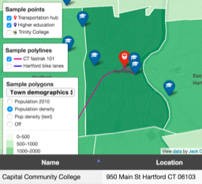

# Leaflet Map Templates {#leaflet}
In [Chapter 8: Map Your Data](map.html), we described several drag-and-drop tools designed for beginners, such as [Google My Maps](mymaps.html) and [Datawrapper](map-datawrapper.html). In this chapter, we offer more advanced map tutorials using our open-source code templates, which you can copy and modify with skills you learned in [Chapter 11: Edit and Host Code with GitHub](github.html). We built all of the templates in this chapter with [Leaflet](https://leafletjs.com), a powerful open-source code library for creating interactive maps on desktop or mobile devices.

No coding skills are required to use our first two easy-to-use templates because they pull your map data from a linked Google Sheet. The first template, [Leaflet Maps with Google Sheets](leaflet-maps-with-google-sheets), is a general-purpose tool that can display points, polygons, or polylines, using your choice of colors, icons, and images, based on data uploaded into your linked Google Sheet and GitHub repository. It also includes the option to display a table of point markers next to your map. The second template, [Leaflet Storymaps with Google Sheets](leaflet-storymaps-with-google-sheets), displays your map as a scrolling narrative of chapters to guide readers through a storyline, with the option to display paragraphs of text, images, audio or video clips, and historical map backgrounds loaded into your linked Google Sheet and GitHub repo. If you wish to add some of these extra features, look back at Chapter 3 to [geocode addresses with a Google Sheets Add-on](geocode.html), or jump ahead to [Chapter 14: Transform Your Map Data](transform.html) to learn how to create and edit polygons and polylines [with the GeoJson.io tool](geojsonio.html), edit or join data with polygons [using the MapShaper tool](mapshaper.html), or georectify a scanned map to use as a background overlay [with the MapWarper tool](mapwarper.html).

<!-- TODO: ask Amelia if it's okay to leave this out of the chapter intro: Also, if you create your own copy of either template above and invite people to visit your map, learn how to [Get Your Own Free Google Sheets API Key](google-sheets-api-key.html) to insert into the code, so that our key is not overused. -->

Our remaining Leaflet templates are designed to help users develop their map coding skills. Even if you have no prior coding experience, but can follow instructions and are *code-curious* about how things work on your computer, start with the [Leaflet Maps with CSV Data tutorial](leaflet-maps-with-csv.html), which walks you through the steps of creating a point map that pulls data from a CSV file, a [generic spreadsheet format we discussed in Chapter 3](spreadsheet.html). Then move on to the [Leaflet Maps with Open Data API tutorial](leaflet-maps-with-api.html), to learn how to code using an application program interface to pull information directly from [open data repositories as we described in Chapter 4](opendata.html). In both of these templates, you'll learn how Leaflet maps are written using three coding languages:

- HTML: to structure content on the web page, typically in a file named `index.html`.
- CSS or Cascading Style Sheet: to shape how content appears on the page, either inside `index.html` or in a separate file such as `style.css`.
- JavaScript: to create the interactive map using instructions from the Leaflet code library, either inside `index.html` on in a separate file, such as `script.js`.

Explore our Leaflet map templates and you'll also see how they refer to different code components, such as basemap tiles from [various open-access online providers](https://leaflet-extras.github.io/leaflet-providers/preview/), such as Carto, Esri, Stamen, and Open Street Map, that allow you to zoom into background maps. You'll also see data files to place information about points, polygons, or polylines on top of the map, usually in CSV or [GeoJSON format---see Chapter 14](convert-geojson.html), with names similar to `data.csv` or `map.geojson`. If you're new to coding, creating Leaflet maps can be a great place to start and quickly see the results of what you've learned. To help you solve problems that may arise, see [Fix Common Mistakes](fix.html) in the appendix.

Table: (\#tab:map-templates) Map Templates and Tutorials

| Map Templates | Best use and tutorials in this book |
| --- | --- |
| Leaflet Maps with Google Sheets<br>  | Best to show interactive points, polygons, or polylines, using your choice of colors, styles, and icons, based on data loaded into your linked Google Sheet (or CSV file) and GitHub repository. Includes option to display a table of point map markers next to your map.  <br>Template with tutorial: [Leaflet Maps with Google Sheets](leaflet-maps-with-google-sheets.html) |
| Leaflet Storymaps with Google Sheets<br>  | Best to display your map as a scrolling narrative of chapters to guide readers through a storyline, with the option to include paragraphs of text, images, audio or video clips, and historical map backgrounds loaded into your linked Google Sheet (or CSV) and GitHub repo. <br>Template with tutorial: [Leaflet Storymaps with Google Sheets](leaflet-storymaps-with-google-sheets.html) |
| Leaflet Point Map with CSV Data<br>  | Learn how to code your own Leaflet point map that pulls data from a CSV file in your GitHub repo.<br>Template with tutorial: [Leaflet Maps with CSV Data](leaflet-maps-with-csv.html)  |
| Leaflet Maps with Open Data API<br>  | Learn how to code your own Leaflet map with an application program interface (API) that pulls content directly from open data repositories, such as Socrata and others.<br>Template with tutorial: [Leaflet Maps with Open Data API](leaflet-maps-with-api.html) |
| Leaflet Heatmap with CSV Point Data <br>  | Heatmaps transform individual points into hotspots or clusters, to display the spatial distribution of events.<br>Template with tutorial: [Leaflet Heatmap](leaflet-heatmap.html) |
| Leaflet Searchable Map with CSV Point Data<br>  | Searchable and filterable point map using CSV data, with optional list view, developed by [Derek Eder](https://derekeder.com/) from DataMade.<br>Template with tutorial: [Leaflet Searchable Map with CSV](leaflet-searchable-map.html) |

## Leaflet Maps with Google Sheets {- #leaflet-maps-with-google-sheets}
Sometimes you need to create a map that cannot be made easily with drag-and-drop tools, because you need to customize its appearance or add new layers of point, polygon, or polyline data. In these cases, consider making a copy of our Leaflet Maps with Google Sheets template on GitHub. It gives you more control over choosing colors, icons, and images, and also the option to display a data table of point markers. To customize your interactive map, you enter data into a Google Sheet template, which you link directly to your copy of the Leaflet code repository, as shown in Figure \@ref(fig:lmwgs-map) and Figure \@ref(fig:lmwgs-sheet).

TODO: Create and insert a new version of the demo, featuring ECGreenway route thru CT, points with photos, and pop density of towns to highlight how this bike route connects cities.

(ref:lmwgs-map) Explore a [live demonstration of Leaflet Maps with Google Sheets](https://handsondataviz.github.io/leaflet-maps-with-google-sheets/).

```{r lmwgs-map, fig.cap="(ref:lmwgs-map)"}
if(knitr::is_html_output(excludes="markdown")) knitr::include_url("https://handsondataviz.github.io/leaflet-maps-with-google-sheets/", height = "500px") else knitr::include_graphics("images/13-leaflet/lmwgs-map.png")
```

(ref:lmwgs-sheet) Explore the [live Google Sheet template](https://docs.google.com/spreadsheets/d/1ZxvU8eGyuN9M8GxTU9acKVJv70iC3px_m3EVFsOHN9g) that feeds data into the Leaflet map above.

```{r lmwgs-sheet, fig.cap="(ref:lmwgs-sheet)"}
if(knitr::is_html_output(excludes="markdown")) knitr::include_url("https://docs.google.com/spreadsheets/d/1ZxvU8eGyuN9M8GxTU9acKVJv70iC3px_m3EVFsOHN9g/pubhtml?widget=true&amp;headers=false", height = "500px") else knitr::include_graphics("images/13-leaflet/lmwgs-sheet.png")
```

### Tutorial Outline {-}
Make sure you meet these requirements, and read this overview to prepare yourself for this multi-step tutorial.

Before you begin, you must:

- Have a [Google Drive account](http://drive.google.com).
- Know how to [File > Make a Copy in Google Sheets](copy.html), as described in Chapter 3.
- Have a [GitHub account](http://github.com).
- Know how to [Edit and Host Code with GitHub](github.html), as described in Chapter 11.

In the first part of the tutorial, you will create and publish your copies of our GitHub and Google Sheets templates:

- A) Copy the GitHub template and publish your version with GitHub Pages
- B) File > Make a Copy of Google Sheet template, Share, and Publish
- C) Paste your Google Sheet browser address in two places in your GitHub repo
- D) Update your Google Sheet *Options* tab info and refresh your live map

In the second half, you will learn how to upload and display different types of map data, such as points, polygons, and polylines, and to edit colors, icons, and images, based on information you enter into the linked Google Sheet and upload to your GitHub repo.

- E) Geocode locations and customize new markers in the Points tab
- F) Remove or display point, polygon, or polylines data and legends

Then you will finalize your map by following either step G *OR* step H:

- G) Save each Google Sheets tab as a CSV file and upload to GitHub
- OR
- H) Get your own Google Sheets API Key to insert into the code

If any problems arise, see the [Fix Common Mistakes](fix.html) section of the appendix.

#### A) Copy the GitHub template and publish your version with GitHub Pages {-}

1. Right-click to open this GitHub code template in a new tab: https://github.com/handsondataviz/leaflet-maps-with-google-sheets

2. In the upper-right corner of the code template, sign in to your free GitHub account.

3. In the upper-right corner, click the green *Use this template* button to make a copy of the repository in your GitHub account. On the next screen, name your repo `leaflet-maps-with-google-sheets` or choose a different meaningful name in all lower-case. Click the *Create repository from template* button. Your copy of the repo will follow this format:

`https://github.com/USERNAME/leaflet-maps-with-google-sheets`

4. In your new copy of the code repo, click the upper-right *Settings* button and scroll way down to the GitHub Pages area. In the drop-down menu, change *Source* from *None* to *Master*, keep the default */(root)* setting, and press *Save* as shown in Figure \@ref(fig:leaflet-github-pages2). This step tells GitHub to publish a live version of your map on the public web, where anyone can access it in their browser, if they have the web address.

(ref:leaflet-github-pages2) In *Settings*, go to *GitHub Pages*, and switch the source from *None* to *Master*.

```{r leaflet-github-pages2, out.width=500, fig.cap="(ref:leaflet-github-pages2)"}
knitr::include_graphics("images/13-leaflet/leaflet-github-pages2.png")
```

Note: **TODO:** GitHub recently announced it plans to change the default branch from *Master* to *Main* to eliminate its master-slave metaphor. GitHub recommends waiting until later in 2020 for their system to support this change. When that happens, we need to update repos, text, and screenshots. See more at https://github.com/github/renaming

5. Scroll down to GitHub Pages section again, and copy the link to your published web site, which will appear in this format:

`https://USERNAME.github.io/leaflet-maps-with-google-sheets`

6. Scroll up to the top, and click on your repo name to go back to its main page.

7. At the top level of your repo main page, click on README.md, and click the pencil icon to edit this file.

8. Delete the link to the *our* live site, and paste in the link to *your* published site. Scroll down and *Commit* to save your edits.

TODO: Insert image here

9. On your repo main page, right-click the link to open your live map in a new tab. *Be patient* during busy periods on GitHub, when your website may take up to 1 minute to appear for the first time.

#### B) File > Make a Copy of Google Sheet template, Share, and Publish {-}

1. Open this [Google Sheets template](https://docs.google.com/spreadsheets/d/1ZxvU8eGyuN9M8GxTU9acKVJv70iC3px_m3EVFsOHN9g) in a new tab

2. Sign into your Google account, and select *File > Make a Copy* to save your own version of this Google Sheet on your Google Drive

3. Click the blue Share button, and click *Change to anyone with the link*, then click *Done*. This publicly shares your map data, which is required to make this template work.

4. Go to *File > Publish to the Web*, and click the green *Publish* button to publish the entire document, so that the Leaflet code can read it. Then click the upper-right *X* symbol to close this window.

5. At the top of your browser, copy your Google Sheet address or URL (which usually ends in `...XYZ/edit#gid=0`). Do *NOT* copy the *Published to the web* address (which usually ends in `...XYZ/pubhtml`), as shown in Figure \@ref(fig:sheets-publish).

(ref:sheets-publish) Copy the Google Sheet address at the top of the browser, NOT the *Publish to the web* address.

```{r sheets-publish, out.width=500, fig.cap="(ref:sheets-publish)"}
 knitr::include_graphics("images/13-leaflet/sheets-publish-annotated.png")
```

#### C) Paste your Google Sheet browser address in two places in your GitHub repo {-}
Our next task is to link your Google Sheet to your Leaflet code in GitHub, so that content from your Sheet will appear in your map.

1. At the top of your GitHub repo, click to open the file named `google-doc-url.js`, and click the pencil symbol to edit it.

2. Paste *your* Google Sheet address or URL (which usually ends in `...XYZ/edit#gid=0`) to replace the existing URL, as shown in Figure \@ref(fig:google-doc-url). Be careful *NOT* to erase the single quotation marks or the semicolon at the end. See separate instructions about the Google API key further below.

(ref:google-doc-url) Paste in *your* Google Sheet URL to replace *our* URL.

```{r google-doc-url, fig.cap="(ref:google-doc-url)"}
 knitr::include_graphics("images/13-leaflet/google-doc-url-annotated.png")
```

<!-- TODO: Update image when new code is done -->

3. Scroll to bottom of page and press *Commit* to save your changes. Now your published Google Sheet is linked to your published Leaflet map code.

4. Also, let's paste your Google Sheets browser address in a second place to keep track of it. In your GitHub repo, click to open the README.md file, click the pencil symbol to edit it, and paste *your* Google Sheet browser address to replace the existing address. Scroll down and commit to save your changes.

TODO: Insert image here

#### D) Update your Google Sheet *Options* tab info and refresh your live map {-}

Now that your published Google Sheet is linked to your live map, go to the *Options* tab and update any of these items:

- Map Title
- Map Subtitle
- Author Name
- Author Email or Website
- Author Code Repo

Open the browser tab that displays your live map and refresh the page to see your changes. If your changes do not appear within a few seconds, see the [Fix Common Problems](fix.html) section of the appendix.

#### E) Geocode locations and customize new markers in the Points tab {-}
In the *Points* tab of your Google Sheet, you'll see column headers to organize and display interactive markers on your map. Replace the demonstration data with your own, but do *not* delete or rename the column headers, since the Leaflet code looks for these specific names.

- Group: Create any labels to categorize groups of markers in your legend.
- Marker Icon: Search [Font Awesome Icons](http://fontawesome.io/icons) and insert any standard icon name such as `school` or `bus`, or leave blank for no icon inside the marker. To create your own custom icon, see further below.
- Marker Color: Search [W3Schools Color Names](https://www.w3schools.com/colors/colors_names.asp) and insert any standard name such as `blue` or `darkblue`. Or insert a web color code such as `#775307` or `rgba(200,100,0,0.5)`.
- Icon Color: Set the color of the icon inside the marker. The default is `white`, which looks good inside darker-colored markers.
- Custom Size: Leave blank, unless you are creating your own custom icon further below.

The next set of columns include items that appear when users click on point markers:
- Name: Add a title to display in the marker pop-up window.
- Image: Insert link to an external image link, or upload a small image to the *media* folder in your GitHub repo and add its pathname, such as `media/trinity-college.jpg`. TODO: add this to GSheet after code update
- Description: Add text to appear in the marker pop-up window. You may include HTML web links in this format: `<a href="url">link text</a>`. If a map link should open in a new browser tab, set the *target* attribute to `_blank`. Learn about HTML syntax at [W3Schools](https://www.w3schools.com/html/html_links.asp).

The next three columns---Location, Latitude, and Longitude---help to place your marker on the map. Although the Leaflet code only requires Latitude and Longitude, it's wise to paste an address or place name into the Location column as a reminder to correspond with the numerical coordinates. Use the [Geocoding by SmartMonkey Add-on](geocode.html) that we introduced in Chapter 3 to convert addresses to x- and y-coordinates in a separate tab of your Google Sheet, and paste the results of those three columns into Location, Latitude, and Longitude.

Optional: You can display a table of viewable markers at the bottom of your map, as shown in Figure \@ref(fig:leaflet-map-with-table). In the *Options* tab, set *Display Table* (cell B30) to *On*. You can also adjust the *Table Height*, and modify the display of *Table Columns* by entering the column headers, separated with commas.

(ref:leaflet-map-with-table) One option is to display a table of viewable markers at the bottom of your map.

```{r leaflet-map-with-table, out.width=500, fig.cap="(ref:leaflet-map-with-table)"}
knitr::include_graphics("images/13-leaflet/leaflet-map-with-table.png")
```

Optional: You can create your own custom marker, such as the Trinity College Bantam mascot in the demo. Use an image editing tool to create a square image, 64 x 64 pixels or smaller, with a transparent background. Save it in PNG format with a filename using all lower-case letters with no spaces. Upload the image to the *markers* folder in your GitHub repo. In the Marker Icon column, set the pathname in this format: `markers/custom-trinity-64.png`. In the Custom Size column, set to `64x64` or similar.

Open the browser tab that displays your live map and refresh the page to see your changes. If your changes do not appear within a few seconds, see the [Fix Common Problems](fix.html) section of the appendix.

#### F) Remove or display point, polygon, or polylines data and legends {-}
By default, the demo map displays three types of data---points, polygons, and polylines---and their legends. You can remove any of these from your map by modifying your linked Google Sheet:

To remove points:

- In the *Options* tab, set *Point Legend Position* (cell B27) to *Off* to hide it.
- In the *Points* tab, delete all rows of point data.

To remove polylines:

- In the *Options* tab, set *Polyline Legend Position* (cell B36) to *Off* to hide it.
- In the *Polylines* tab, delete all rows of polyline data.

To remove polygons:

- In the *Polygons* tab, set *Polygon Legend Position* (cell B4) to *Off* to hide it.
- Also in the *Polygons* tab, set *Polygon GeoJSON URL* (cell B6) to remove that data from your map.
- In the next tab *Polygons1*, use the tab drop-down menu to select *Delete* to remove the entire sheet.

You've already learned how to add more markers in the *Points* tab as described above. But if you wish to add new polygon or polyline data, you'll need to prepare those files in GeoJSON format using either the [GeoJson.io tool tutorial](geojsonio.html) or the [MapShaper tool tutorial](mapshaper.html) in Chapter 14.

After you've prepared your GeoJSON data, name the files using all lower-case characters and no spaces, and upload them into the `geometry` subfolder of your GitHub repo. Then update these settings in your linked Google Sheet:

To display polylines:

- In the *Options* tab, make sure *Polyline Legend Position* (cell B36) is visible by selecting *topleft* or a similar position.
- In the *Polylines* tab, enter the GeoJSON URL pathname to the file you uploaded to your GitHub repo, such as `geometry/polylines-bike-lanes.geojson`. Then insert a Display Name, Description, and Color.

To display polygons:

- In the *Polygons* tab, make sure *Polygon Legend Position* (cell B4) is visible by selecting *topleft* or a similar position.
- Also, in *Polygon GeoJSON URL* (cell B6) enter the pathname to the file you uploaded to your GitHub repo, such as `geometry/polygons-town-population.geojson`.
- Also, you can change the *Polygon Legend Title* (cell B3) and add an optional *Polygon Legend Icon* (cell B5).
- Also, edit the *Polygon Data* and *Color Settings* sections to modify the labels and ranges to align with the properties of your GeoJSON file. In the *Property Range Color Palette*, you can automatically select a color scheme from the ColorBrewer tool we described in the [Map Design section of Chapter 8](map-design.html), or manually insert colors of your choice in the cell below.
- Read the *Hints* column in the *Polygons* sheet for tips on how to enter data.
- If you wish to display multiple polygon layers, use the *Polygons* tab drop-down menu to *Duplicate* the sheet, and name additional sheets in this format: *Polygons1*, *Polygons2*, etc.

#### Finalize Your Map {-}
Now you're ready to finalize your map. Read the options below and choose either step G *OR* step H.

#### G) Save each Google Sheets tab as a CSV file and upload to GitHub {-}
If you have finished entering most of your data into your Google Sheets, save each tab as a CSV file and upload them to GitHub. The Leaflet map code will pull data directly from your CSV files, rather than your Google Sheets. And you can *still* edit your CSV files in GitHub. Moving your data from Google Sheets to CSV format is the *best* long-term preservation strategy, because it keeps your map and data together in the same GitHub folder, and removes the risk that your map will break due to an interruption to Google services, as described in Step H.

To move your map data from Google Sheets to CSV format, go to each tab and select *File > Download As* into CSV format, as shown in Figure \@ref(fig:sheets-download-csv), using these file names:  **TODO: should we warn to keep the first letter upper-case?**

- Options.csv
- Points.csv
- Polylines.csv
- Polygons.csv (if needed, also use: Polygons1.csv, Polygons2.csv, etc.)
- Notes.csv  (or .txt)

Upload all of these CSV files into the main level (or root level) of your GitHub repository. The Leaflet code looks here first for the data, and when it locates them, will pull the data directly from the CSV files into your map, skipping over the Google Sheets. TODO: Confirm this code request is working

(ref:sheets-download-csv) One way to finalize your map is to download each Google Sheets tab as a CSV file.

```{r sheets-download-csv, out.width=350, fig.cap="(ref:sheets-download-csv)"}
 knitr::include_graphics("images/13-leaflet/sheets-download-csv.png")
```

#### H) Get your own Google Sheets API Key to insert into the code {-}
If you wish to keep using your Google Sheets to store your data, go to the chapter section named [Get Your Own Google Sheets API Key](google-sheets-api-key.html), and insert it into the Leaflet map code as described, to avoid overusing our key. Google Sheets requires an API key to maintain reasonable [usage limits](https://developers.google.com/sheets/api/limits) on its service. You can get a free Google Sheets API key if you have a personal Google account, but *not* a Google Suite account provided by your school or business. TODO: confirm this detail

Warning: We reserve the right to change *our* Google Sheets API key at any time, especially if other people overuse or abuse it. This means that you *must* finalize your map using either step J or K above, since it will stop working if we change our key.

If problems arise, see the [Fix Common Mistakes](fix.html) section of the appendix.


**TODO: Start again here**


## Leaflet Storymaps with Google Sheets {- #leaflet-storymaps-with-google-sheets}
TODO: Add intro text

Try it:
Explore the map or right-click to [view full-screen map in a new tab](https://handsondataviz.github.io/leaflet-storymaps-with-google-sheets/)
<iframe src="https://handsondataviz.github.io/leaflet-storymaps-with-google-sheets/" width="90%" height=500></iframe>

The map pulls the point data and settings from a linked Google Sheet, which you can explore below or right-click to [view full-screen Sheet in a new tab](https://docs.google.com/spreadsheets/d/1AO6XHL_0JafWZF4KEejkdDNqfuZWUk3SlNlQ6MjlRFM/)
<iframe src="https://docs.google.com/spreadsheets/d/e/2PACX-1vSqxGs67j80rAPDZdQaS5jI0avn1qs2y5N8fOaeHUGvyrnIwBmWomlfAuujtvPrxtF-5FBZxi_KdTUm/pubhtml?widget=true&amp;headers=false" width="90%" height=500></iframe>

#### Features {-}
- Show map points, text, images, and links with scrolling narrative
- Free and open-source code template, built on Leaflet and linked to Google Sheets
- Fork the code and host your live map on the web for free with GitHub Pages
- Geocode location data with US Census or Google, using script inside the Google Sheet
- Easy-to-modify data and map options in Google Sheet tabs or uploaded CSV files
- Responsive design resizes your maps to display inside most mobile devices

#### Create Your Own {-}
- A) Fork (copy) the code template and publish your version with GitHub Pages
- B) File > Make a Copy of Google Sheet template, Share, and File > Publish
- C) Paste your Google Sheet URL in two places in your GitHub repo
- C2) NEW: Create a free Google Sheets API key to paste into the code
- D) Modify your map settings in the Options tab and test your live map
- E) Geocode locations in the Points tab

To solve problems, see the [Fix Common Mistakes](fix.html) section of the appendix.

#### A) Fork (copy) the code template and publish your version with GitHub Pages {-}

**Before you begin**, this tutorial assumes that you:

- have a [free Google Drive account](http://drive.google.com), and learned the [File > Make a Copy in Google Sheets](copy.html) tutorial in this book
- have a [free GitHub account](http://github.com), and understand concepts from the [Edit and Host Code with GitHub](github.html) chapter in this book

1) Right-click to open this GitHub code template in a new tab: https://github.com/handsondataviz/leaflet-storymaps-with-google-sheets

2) In the upper-right corner of the code template, sign in to your free GitHub account

3) In the upper-right corner, click Fork to copy the template (also called a code repository, or repo) into your own account.
The web address (URL) of the new copy in your account will follow this format:
```
https://github.com/USERNAME/leaflet-storymaps-with-google-sheets
```

Reminder: You can only fork a GitHub repo **one time**. If needed, see how to make a second copy in the [Create a New Repo in GitHub](create-repo.html) chapter in this book.

4) In your new copy of the code repo, click on Settings, scroll down to the GitHub Pages area, select Master, and Save. This publishes your code to a live map on a public website that you control.

5) Scroll down to GitHub Pages section again, and copy the link to your published web site, which will follow this format:
```
https://USERNAME.github.io/leaflet-storymaps-with-google-sheets
```

6) Scroll up to the top, and click on your repo name to go back to its main page.

7) At the top level of your repo main page, click on README.md, and click the pencil icon to edit this file, written in easy-to-read Markdown code.

8) Delete the link to the current live site, and paste in the link to YOUR site. Scroll down and Commit to save your edits.

9) On your repo main page, right-click the link to your live map to open in a new tab. **Be patient** during busy periods on GitHub, when your website may take up to 1 minute to appear the first time.

#### B) File > Make a Copy of Google Sheet template, Share, and File > Publish {-}

1) Right-click to open this Google Sheets template in a new tab: https://docs.google.com/spreadsheets/d/1AO6XHL_0JafWZF4KEejkdDNqfuZWUk3SlNlQ6MjlRFM/

2) Sign into your Google account

3) File > Make a Copy of the Google Sheet template to your Google Drive

4) Click the blue Share button, click Advanced, click to change Private to Anyone with the link > Can View the Sheet. This will make your public data easier to view in your map.

5) File > Publish the Link to your Google Sheet to the public web, so the Leaflet map code can read it.


6) At the top of your browser, copy your Google Sheet web address or URL (which usually ends in `...XYZ/edit#gid=0`). Do NOT copy the published URL (which usually ends in `...XYZ/pubhtml`).


#### C) Paste your Google Sheet URL in two places in your GitHub repo {-}

1) First, connect your Google Sheet directly to your Leaflet Map code. In your Github code repo, click to open this file: `google-doc-url.js`

2) Click the pencil symbol to edit the file.

3) Paste your Google Sheet URL into the code to replace the current URL. Do not delete the single-quotation marks or semicolon.

4) Scroll to bottom of page and press Commit to save your changes. Now the Leaflet Map code can locate your published Google Sheet.

5) Next, let's paste your Google Sheet URL in a second place to keep track of it. Go to the README.md file in your GitHub repo, click to open and edit, and paste your Google Sheet web address to replace the existing link near the top. Commit to save your changes.


#### D) Modify your map settings in the Options tab and test your live map {-}

In the top-level of your GitHub repo, test the new links to your map and your Google Sheet to make sure they work and point to your versions.

** TO DO - redo GIF **

In your linked Google Sheet, go to the Options Tab and modify these items:

1) Map Title -- insert your own title

2) Map Subtitle -- insert your own version

3) Author Name -- insert your own name, or first name, or initials (will be public)

4) Author Email or Website -- insert your own (will be public), or delete the current name to make it blank

Open the link to your live map in a new browser tab and refresh to see your changes.

#### E) Geocode locations and customize new markers in the Points tab {-}

In your new map, our next goal is to add and modify the appearance of a new set of point markers, based on new addresses that you will enter and geocode.

In the Points tab of your Google Sheet:

1) Do NOT delete or rename any column headers. However, you have the option to add new column headers to display in your map table.

2) Geocode your new data inside your Google Sheet by dragging your cursor to select 6 columns of data: Location - Latitude - Longitude - Found - Quality - Source

3) In the Geocoder menu that appears in this Google Sheet template, select one of the geocoding services. If one service cannot locate your data, try the other. Always inspect the accuracy of the Found column.

Open the link to your live map in a new browser tab and refresh to see your changes. If your new markers appear correctly, then delete the existing rows that came with this template.

#### TODO {-}
Add documentation for new features added in 2020

Add links to your text in the Google Sheet

Add line breaks to your text in the Google Sheet

TODO to code: Add Scroll Down text and symbol after the subtitle

Markers

I added a new column to the Chapter tab called “Marker”. It has a dropdown with currently three options: Numerated (defaults to that, even if empty value), Plain (with no number), and No marker. The latter is what you want.
It can be potentially extended to colours, types of markers, etc.
https://github.com/handsondataviz/leaflet-storymaps-with-google-sheets/blob/master/scripts/storymap.js#L121-L131

Overlay GeoJSONs

I added two columns, GeoJSON Overlay with the URL to the GeoJSON, and GeoJSON Feature Properties, which is CSS that defines style of features.
List the styles separated by semicolon, and no quotation marks required. Eg
fillColor: orange; weight:2, opacity: 0.5, color: red, fillOpacity: 0.1
In the code, you will see two vertical lines: they mean “or”. If the value of the left-most expression is not undefined, it uses it. If not, it keeps moving to the right until there is a value that is not an empty string. For example,
https://github.com/handsondataviz/leaflet-storymaps-with-google-sheets/blob/master/scripts/storymap.js#L310
color: feature.properties.COLOR || props.color || 'silver’,

Will first attempt to extract the color from the COLOR property of each geoJson feature (useful for choropleth). If not found, it tries the GeoJSON Feature Properties “color”. If that is not set, it uses silver.
https://github.com/handsondataviz/leaflet-storymaps-with-google-sheets/blob/master/scripts/storymap.js#L288-L316

Data in local CSV files

If googleDocURL variable does not exist (eg you delete the file) or is an empty string, it reads two spreadsheets: Options.csv and Chapters.csv from the /csv folder.
Otherwise, it reads from the google sheet.
https://github.com/handsondataviz/leaflet-storymaps-with-google-sheets/blob/master/scripts/storymap.js#L13-L35
When data is read from a .CSV, it links that in the attribution (https://github.com/handsondataviz/leaflet-storymaps-with-google-sheets/blob/master/scripts/storymap.js#L393-L396)

Modify your Style Sheet

To adjust title size:
In GitHub, go to css/styles.css file, scroll all the way to the bottom, and adjust font-size values (or just use the links below).
See your title around line 170, and change font-size up or down....

To add a horizontal line, you need to be a bit creative (see screenshot attached)! Break down text in your Description with the following code for the horizontal line:

`<span style="display:block;width:100%;height:1px;background-color: silver; margin: 20px 0;"></span>`

When you copy-paste this snippet, the straight quotation marks do not turn into curly marks, otherwise it won’t work.


Learn more:
To solve problems, see [Fix Common Mistakes](fix.html) section of the appendix.


## Get Your Google Sheets API Key {- #google-sheets-api-key}
After you've created your own version of [Leaflet Maps with Google Sheets](leaflet-maps-with-google-sheets.html) or [Leaflet Storymaps with Google Sheets](leaflet-storymaps-with-google-sheets.html), there are two ways to finalize your map, as described above: either save your Google Sheet tabs in CSV format, or get your own Google Sheets API key and paste it into your Leaflet code on GitHub. You'll learn about the latter method in this section.

Google requires a API (application program interface) key to allow your computer code to read data from your Google Sheets, beginning with version 4 in September 2020. (If you created your own Leaflet Maps or Storymaps with Google Sheets using our template prior to September 2020, and you want to continue to pull data from your Google Sheet, you'll need to update your code to make sure it keeps working **TODO: explain pull request**.) Google requires this API key to [maintain reasonable limits](https://developers.google.com/sheets/api/limits) on use of its services. For Google Sheets, the limit is 500 requests per 100 seconds per project, and 100 requests per 100 seconds per user. There is no daily usage limit.

You can get your own API key for free by following the steps below. Overall, you will create and name your Google Cloud project, enable the Google Sheets API to allow a computer to read data from your Google Sheet, copy your new API key, and paste it into the Leaflet code in place of our key.

Before you begin:

- You need a personal Google account, *not* a Google Suite account issued by your school or business.
- This tutorial presumes that you have already have completed the [Leaflet Maps with Google Sheets](leaflet-maps-with-google-sheets.html) or [Leaflet Storymaps with Google Sheets](leaflet-storymaps-with-google-sheets.html) template above, and wish to finalize your map.
- If you already created a Google Sheets API key for one template above, you can also use that key for another template.

1. Go to the Google Developers Console at https://console.developers.google.com/ and log in to your Google account. Google may ask you to identify your country and agree to its terms of service.

2. Click on *Create a Project* on the opening screen, as shown in Figure \@ref(fig:google-api-create). Or alternatively, go to the upper-left drop-down menu to *Select a project > New project*.

(ref:google-api-create) Select *Create a Project* or use the menu to select a new project.

```{r google-api-create, out.width=600, fig.cap="(ref:google-api-create)"}
 knitr::include_graphics("images/13-leaflet/google-api-create.png")
```

3. In the next screen, give your new project a meaningful short name to remind you of its purpose, such as `handsondataviz`. You do not need to create an organization or parent folder. Then click *Create*, as shown in Figure \@ref(fig:google-api-name).

(ref:google-api-name) Give your project a meaningful short name.

```{r google-api-name, out.width=450, fig.cap="(ref:google-api-name)"}
 knitr::include_graphics("images/13-leaflet/google-api-name.png")
```

4. In the next screen, press the *+ Enable APIs and Services* at the top of the menu, as shown in Figure \@ref(fig:google-api-enable). Make sure that your new project name appears near the top.

(ref:google-api-enable) Press the *+ Enable APIs and Services* button.

```{r google-api-enable, fig.cap="(ref:google-api-enable)"}
 knitr::include_graphics("images/13-leaflet/google-api-enable.png")
```

5. In the next screen, enter *Google Sheets* into the search bar, and select this result, as shown in Figure \@ref(fig:google-api-search).

(ref:google-api-search) Search for *Google Sheets* and select this result.

```{r google-api-search, fig.cap="(ref:google-api-search)"}
 knitr::include_graphics("images/13-leaflet/google-api-search.png")
```

6. In the next screen, select the *Enable* button to turn on the Google Sheets API for your project, as shown in Figure \@ref(fig:google-api-select).

(ref:google-api-select) Select the *Enable* button for Google Sheets API.

```{r google-api-select, out.width=350, fig.cap="(ref:google-api-select)"}
 knitr::include_graphics("images/13-leaflet/google-api-select.png")
```

7. In the left sidebar menu, click *Credentials*, then click *+ Create Credentials* and select *API key*, as shown in Figure \@ref(fig:google-api-credentials).

(ref:google-api-credentials) Select *Credentials - Create Credentials - API key*.

```{r google-api-credentials, fig.cap="(ref:google-api-credentials)"}
 knitr::include_graphics("images/13-leaflet/google-api-credentials.png")
```

8. In the next screen, the console will generate your API key. Copy it, then press *Restrict key*, as shown in Figure \@ref(fig:google-api-key).   

(ref:google-api-key) Copy your API key and press *Restrict key*.

```{r google-api-key, out.width=500, fig.cap="(ref:google-api-key)"}
 knitr::include_graphics("images/13-leaflet/google-api-key-annotated.png")
```

9. In the new window, under *API restrictions*, choose the *Restrict key* radio button. In the dropdown that appears, choose *Google Sheets API*, then click *Save*, as shown in Figure \@ref(fig:google-api-restrict).

(ref:google-api-restrict) Choose *API restrictions - Restrict key - Google Sheets API*

```{r google-api-restrict, out.width=600, fig.cap="(ref:google-api-restrict)"}
 knitr::include_graphics("images/13-leaflet/google-api-restrict.png")
```

10. In your Leaflet map code on your GitHub repo, open the `google-doc-url.js` file, click the pencil symbol to edit it, and paste in *your* Google Sheets API key to replace *our* key, as shown in Figure \@ref(fig:google-api-paste). Be careful not to erase the single-quote marks or the semicolon. Scroll down to *Commit* your changes.

(ref:google-api-paste) Paste in *your* Google Sheets API key to replace *our* key.

```{r google-api-paste, fig.cap="(ref:google-api-paste)"}
 knitr::include_graphics("images/13-leaflet/google-api-paste-annotated.png")
```

You might receive a notification from GitHub stating that you have an exposed API key, but don't worry. This key can only be used with Google Sheets, you received it for free, and you did not attach any billing information to it, so Google cannot charge you for its use.

Now that you've learned how to create a Google Sheets API key to use with Leaflet Maps with Google Sheets or Leaflet Storymaps with Google Sheets, in the next sections you'll learn more about other types of Leaflet map templates.


## Leaflet Maps with CSV Data {- #leaflet-maps-with-csv}

Figure \@ref(fig:leaflet-map-csv) shows a simple point map of some colleges and universities
in Connecticut. But instead of individually creating markers in JavaScript using Leaflet's `L.marker()`
function, the point data is stored in a local CSV file (`data.csv`) that is easy
to modify in Excel or any text editor. Each time the map is loaded by the browser,
point data from the CSV file is read and markers are generated "on the fly".

(ref:leaflet-map-csv) Explore a [live demonstration of Leaflet point map with CSV data](https://handsondataviz.github.io/leaflet-map-csv/).

```{r leaflet-map-csv, fig.cap="(ref:leaflet-map-csv)"}
if(knitr::is_html_output(excludes="markdown")) knitr::include_url("https://handsondataviz.github.io/leaflet-map-csv/", height = "500px") else knitr::include_graphics("images/13-leaflet/leaflet-map-csv.png")
```

You can adapt this template to create your own point map. To do so,

1. Visit the [GitHub repo](https://github.com/HandsOnDataViz/leaflet-map-csv) that stores the code for this template. Make sure you are logged in, and
press *Use this template button* to create a copy of this repository in your own GitHub account.
2. Put your point data data inside `data.csv`. The only relevant columns that will be read by the template are *Latitude*, *Longitude*, and *Title*.
The first two determine the location of the marker, and the last one is displayed in a popup. The order of columns does not matter. There can be other columns in the dataset,
but they will be ignored.

Your data can look like the following:
```
Title,Latitude,Longitude
Trinity College,41.745167,-72.69263
Wesleyan University,41.55709,-72.65691
```

3. Depending on the geography of your points, you will want to change the default position
of the map on start. In `index.html`, find the `<script>` tag, and edit the following
chunk of code:

```javascript
var map = L.map('map', {
  center: [41.57, -72.69], // Default latitude and longitude on start
  zoom: 9,  // Between 1 and 18; decrease to zoom out, increase to zoom in
  scrollWheelZoom: false
});
```

We used default Leaflet markers for code simplicity, but you may want to use
custom icons instead. The code snippet below can give you an idea how to

```javascript
var marker = L.marker([row.Latitude, row.Longitude], {
  opacity: 1,
  // Customize your icon
  icon: L.icon({
    iconUrl: 'path/to/your/icon.png',
    iconSize: [40, 60]
  })
}).bindPopup(row.Title);
```

For more information on icon customization, see [this helpful Leaflet example](https://leafletjs.com/examples/custom-icons/).


## Leaflet Maps with Open Data API {- #leaflet-maps-with-api}

Leaflet maps can pull and display data from various open data repositories using APIs.
Figure \@ref(fig:leaflet-open-data) shows an interactive map of North Dakota counties,
colored by population density, with hospitals and EMS stations locations.
Hospital information is pulled directly from [Medicare.org Socrata database](https://data.medicare.gov/).
County boundaries and population density are pulled from [North Dakota GIS](https://www.gis.nd.gov/) ArcGIS server.
EMS stations are fetched from [Homeland Infrastructure Foundation-Level Data](https://hifld-geoplatform.opendata.arcgis.com/) ArcGIS server.

(ref:leaflet-open-data) Explore a [live demonstration of Leaflet Heatmap](https://handsondataviz.github.io/leaflet-maps-open-data-apis/index.html).

```{r leaflet-open-data, fig.cap="(ref:leaflet-open-data)"}
if(knitr::is_html_output(excludes="markdown")) knitr::include_url("https://handsondataviz.github.io/leaflet-maps-open-data-apis/index.html", height = "500px") else knitr::include_graphics("images/13-leaflet/leaflet-open-data.png")
```

You can enable Leaflet to pull data from ArcGIS servers using a free [`esri-leaflet`](https://github.com/Esri/esri-leaflet) plugin.
Data from Socrata can be pulled using jQuery's `$.getJSON()` function,
and then passed to Leaflet directly using `L.GeoJson()` function.

To adapt this template for your own project:

1. Visit the [GitHub repository](https://github.com/HandsOnDataViz/leaflet-maps-open-data-apis) that contains the code for the map in Figure \@ref(fig:leaflet-open-data),
and press the *Use this template* button to copy the repo to your own GitHub account.
1. All data is pulled form the code inside the `<script>` tag of `index.html`. To pull
data from Socrata or another JSON/GeoJSON endpoint, modify the following code snippet
with the appropriate URL and icon:

```javascript
/*
  From Medicare's Socrata database, add general hospitals in North Dakota
  using simple filtering on the `state` column, and a GeoJSON endpoint.
  Each point is a custom .png icon with a tooltip containing hospital's name,
  city, and zipcode.
*/
$.getJSON("https://data.medicare.gov/resource/xubh-q36u.geojson?state=ND",

  function(data) {

    var hospitals = L.geoJson(data, {
      pointToLayer: function(feature, latlng) {
        return L.marker(latlng, {
          icon: L.icon({
            iconUrl: 'images/hospital.png',
            iconSize: [24, 24],
            iconAnchor: [12, 12],
            opacity: 0.5
          })
        }).bindTooltip(
          feature.properties.hospital_name
            + '<br>' + feature.properties.city
            + '<br>' + feature.properties.zip_code
        )
      }
    }).addTo(map)

  }

)
```

The following code snippet uses `esri-leaflet` plugin to pull polygon data
from an ArcGIS server, and creates a choropleth layer based on population density
(stored in `POP10_SQMI` variable of each feature, or polygon).

```javascript
var counties = L.esri.featureLayer({
  url:'https://ndgishub.nd.gov/arcgis/rest/services/All_GovtBoundaries/MapServer/20',
  style: function(feature) {
    return {
      fillOpacity: 0.5,
      weight: 0.5,
      color: 'silver',
      fillColor: getDensityColor(feature.properties.POP10_SQMI)
    }
  }
}).addTo(map)
```

Here, the `getDensityColor()` function returns a color for a given value
based on pre-defined thresholds. In case of the North Dakota example,
population density of over 100 people per square mile is assigned the darkest shade of red,
while the density of 5 and under is shown with the lightest.

```javascript
var getDensityColor = function(d) {
  return d > 100  ? '#7a0177' :
          d > 50  ? '#c51b8a' :
          d > 20  ? '#f768a1' :
          d > 5   ? '#fbb4b9' :
                    '#feebe2'
}
```

While it is convenient to pull data directly from the source databases,
remember that those resources are out of your control (unless you administer them, of course).
Data changes often come unnanounced. For example, if the dataset owner decides
to rename the population density field from `POP10_SQMI` to `Pop10_sqmi`,
your map will stop showing values correctly. Datasets may get moved
to a different domain name or get deleted entirely, so
it is wise to have a back-up file saved locally.

If you are more concerned about the long-term functioning of your map as opposed
to displaying the most up-to-date version of the dataset, you may consider serving
your data from local GeoJSON files instead (but ensure first that it is permitted by the data license).


## Leaflet Heatmap with CSV Point Data {- #leaflet-heatmap}
Heatmaps turn individual points into hotspots or clusters, allowing viewers to explore
spatial distributions of events, such as areas of high and low population density,
or high-crime areas. Figure \@ref(fig:leaflet-heatmap) shows an interactive heatmap of
bike theft locations in London between January and July 2020. The underlying
data are coordinate locations for each reported bike theft,
which [`Leaflet.heat`](https://github.com/Leaflet/Leaflet.heat) plugin transforms
into areas of various densities. Red shows areas of highest density, or areas
where bike theft appeared most often. When you zoom in, areas are re-calculated
into more distinct clusters.

(ref:leaflet-heatmap) Explore a [live demonstration of Leaflet Heatmap](https://handsondataviz.github.io/leaflet-heatmap/).

```{r leaflet-heatmap, fig.cap="(ref:leaflet-heatmap)"}
if(knitr::is_html_output(excludes="markdown")) knitr::include_url("https://handsondataviz.github.io/leaflet-heatmap/", height = "500px") else knitr::include_graphics("images/13-leaflet/leaflet-heatmap.png")
```

You can adapt the code we used for this London heatmap to create your own.

1. Visit the [GitHub repository with our code](https://github.com/HandsOnDataViz/leaflet-heatmap),
make sure you are logged in, and click *Use this template* button to make a personal copy of this repo.
2. Modify map's title and description inside `index.html`.
3. Put your point coordinates data inside `data.csv`. Don't use a header, and keep it one point per line. Use latitude,longitude (or y,x) order, like below:
```
51.506585,-0.139387
51.505467,-0.14655
51.507758,-0.141284
```

4. Depending on your data density, you might want to tweak *radius* and *blur* parameters
inside the `<script>` tag of `index.html`:
```javascript
var heat = L.heatLayer(data, {
  radius: 25,
  blur: 15,
})
```

Edit the following chunk of code to set your map's default position and zoom level:
```javascript
var map = L.map('map', {
  center: [51.5, -0.1], // Initial map center
  zoom: 10, // Initial zoom level
})
```

If for some reason you cannot see clusters, make sure your point data is represented
in `latitude,longitude` order, not the other way around. If you have few points,
try increasing the value of `radius` property of `L.heatLayer`.

## Leaflet Searchable Map with CSV Points {- #leaflet-searchable-map}

Figure \@ref(fig:searchable-map) shows a powerful Leaflet template of a searchable
and filterable point map
developed by [Derek Eder](https://derekeder.com/) from DataMade. This map allows
you to show points of interest, filter them by using *Search by name* functionality,
and show them as a list instead of points on a map. In addition, the *About* page
gives you plenty of space to talk about your map.

(ref:searchable-map) Explore a [live demonstration of Searchable Map template](https://searchable-map-template-csv.netlify.app/).

```{r searchable-map, fig.cap="(ref:searchable-map)"}
knitr::include_graphics("images/13-leaflet/searchable-map.png")
```

This template uses Leaflet.js in combination with Google Maps API to perform
address search.

To begin using the template for your own project, visit the [template's GitHub page](https://github.com/HandsOnDataViz/searchable-map-template-csv),
and fork it so that you get your own copy (see [Edit and Host Code with GitHub](github.html)
chapter to remind yourself about forks).

### Step 1: Get and prep your data {-}

This template will work with data in [csv](https://en.wikipedia.org/wiki/Comma-separated_values) and [geojson](https://en.wikipedia.org/wiki/GeoJSON) formats.

If you have an `xls` or `xlsx` spreadsheet, you can save it as a `csv` file from Excel, Numbers, Libre Office or your spreadsheet tool of choice.

The `csv` file must have a latitude column and longitude column and all rows must be geocoded. If you don't have this, but have information like a street address, you'll need to [geocode](https://en.wikipedia.org/wiki/Geocode) your data.

Here's a few tools for geocoding:

* Google has the best geocoder in terms of accuracy. They have an [API that you can use](https://developers.google.com/maps/documentation/geocoding/start), but may cost you money depending on how many rows you have to geocode.
* To geocode addresses inside Google Sheets, install the [free Geocoding by SmartMonkey Add-On for Google Sheets](https://gsuite.google.com/marketplace/app/geocoding_by_smartmonkey/1033231575312). See [geocoding instructions in Hands-On Data Visualization](https://handsondataviz.org/geocode.html).
* [Geocoding in QGIS](https://www.gislounge.com/how-to-geocode-addresses-using-qgis/) (uses OpenStreetMap)
* [BatchGeo](https://www.batchgeo.com/)
* [Texas A&M](http://geoservices.tamu.edu/Services/Geocode/)

### Step 2: Download and edit this template {-}

1. Download or clone this project and fire up your text editor of choice. Open up `/js/map.js` and set your map options in the `SearchableMapLib.initialize` function:
  - `map_centroid` -  the lat/long you want your map to center on ([find yours here](https://getlatlong.net/))
  - `filePath` - Path to your map data file. This file needs to be in csv or geojson format and placed in the `data` folder. This file's first line must be the header, and it must have a latitude column and longitude column.
  - `fileType` - Set if you are loading in a `csv` or `geojson` file
2. Edit the templates in the `templates` folder for how you want your data displayed. These templates use EJS, which allows the display of your variables with HTML, as well as conditional logic. [Documentation is here](https://ejs.co/#docs).
  - `/templates/hover.ejs` - template for when you hover over a dot on the map
  - `/templates/popup.ejs` - template for when a dot on the map is clicked
  - `/templates/table-row.ejs` - template for each row in the list view
3. Remove the custom filters and add your own.
  -  `index.html` - custom HTML for filters starts around line 112
  - `/js/searchable_map_lib.js` - logic for custom filters starts around line 265


### Step 3: Publishing your map {-}

1. Before you publish, you'll need to [get a Google API key](https://developers.google.com/maps/documentation/javascript/get-api-key). You can get on here. Replace the API key on this line of `index.html` with yours: `<script type="text/javascript" src="https://maps.google.com/maps/api/js?libraries=places&key=[YOUR KEY HERE]"></script>`
2. Upload this map and all the supporting files and folders to your site. This map requires no back-end code, so any host will work, including GitHub pages, Netlify or your own web server.

### Summary {- #summary13}

In this chapter, we introduced Leaflet map templates for common map problems,
such as telling stories about places using scrollable interface,
showing point data from databases like Socrata, and creating heatmaps
to visualize areas of high event density.

You can use these templates as a base to kickstart your own mapping projects.
Leaflet.js is [well-documented](https://leafletjs.com/reference), and we recommend
looking at [their tutorials](https://leafletjs.com/examples.html) for more inspiration.

In the next chapter, we will talk about geospatial data and introduce several
tools that can convert, create, and edit geospatial files.
