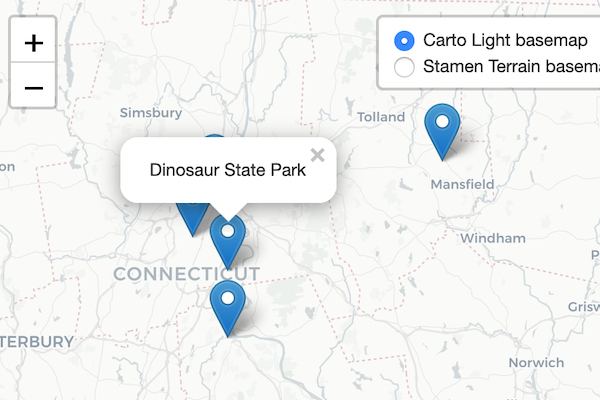
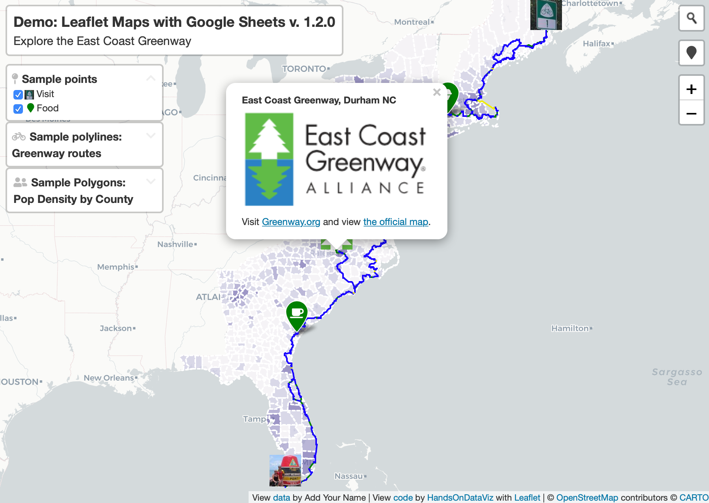
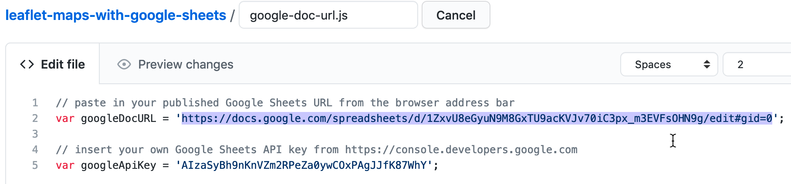
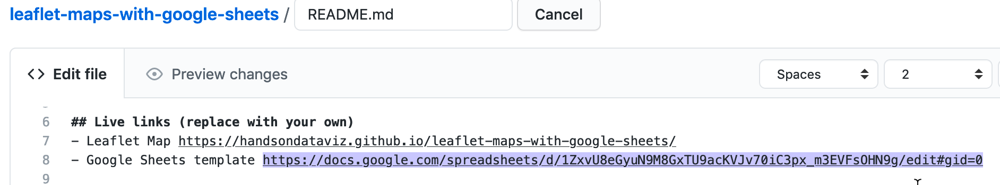
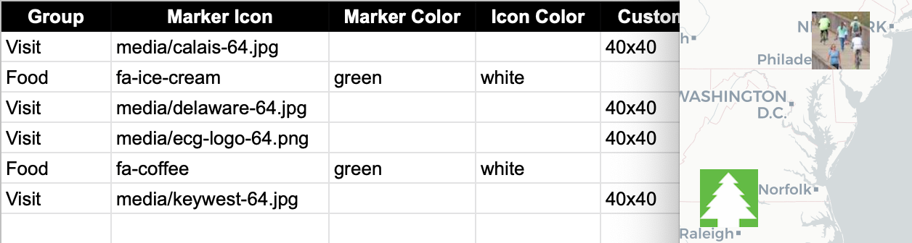
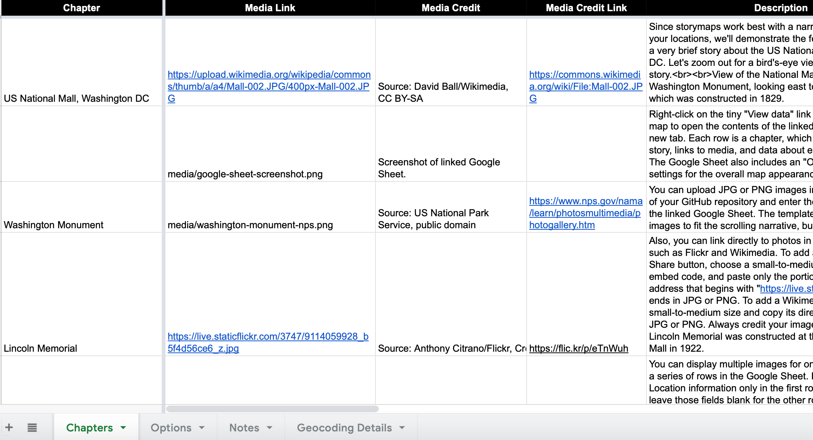
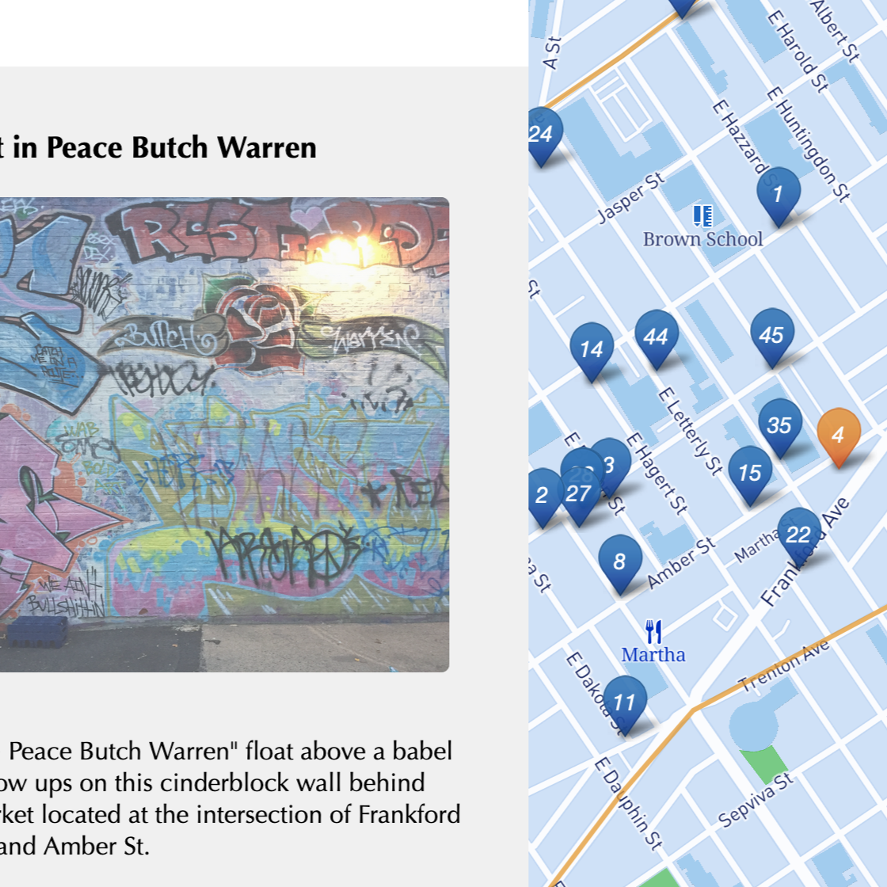
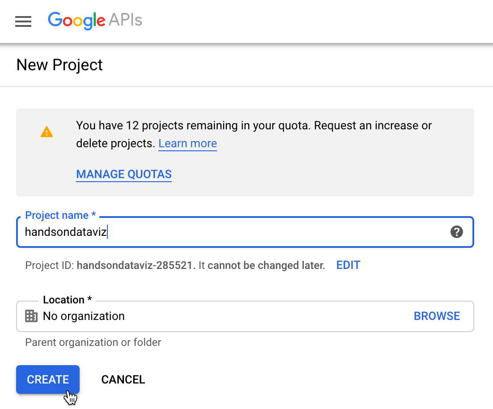
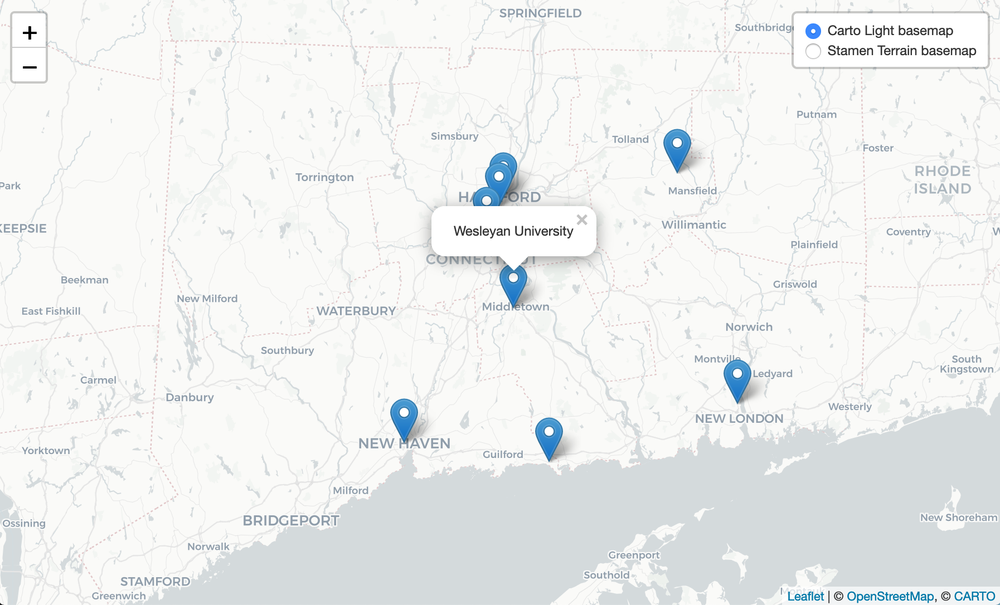

# Leaflet Map Templates {#leaflet}
In [Chapter 8: Map Your Data](map.html), we described several easy-to-learn drag-and-drop tools, such as [Google My Maps](mymaps.html) and [Datawrapper](symbolmap-datawrapper.html), to create several basic types of interactive maps. But if you want to create more customized or advanced maps to stretch beyond the scope of those tool platforms, this chapter offers several code templates based on [Leaflet](https://leafletjs.com), a powerful open-source library for displaying interactive maps on desktop or mobile devices. We first introduced you to Leaflet when you learned how to [edit and host code on GitHub in Chapter 11](github.html).

All of the Leaflet map templates in this chapter are summarized in Table \@ref(tab:map-templates). The first two templates are good for beginners, because they pull your map data from a linked Google Sheet, and do not require any coding skills, but you need to follow some detailed GitHub instructions. The first template, [Leaflet Maps with Google Sheets](leaflet-maps-with-google-sheets) is best for showing any combination of points, polylines, or polygons, with your choice of custom icons and colors, and the option to display a summary table of point data below your map. The second template, [Leaflet Storymaps with Google Sheets](leaflet-storymaps-with-google-sheets), is best for guiding viewers through a point-by-point tour, with a scrolling narrative to display text, images, audio, video, or scanned map backgrounds. We specifically created both code templates for readers of this book, to fill a gap in maps offered on hosted platforms.

The remainder of the Leaflet templates are designed to improve your coding skills and apply them to more specialized cases. Even if you have no prior coding experience, but can follow instructions and are *code-curious*, start with the [Leaflet Point Map with CSV Data template](leaflet-maps-with-csv.html) to learn the basics of pulling point data from a comma-separated values file. Then move on to more advanced examples, such as the [Leaflet Heatmap template](leaflet-heatmap.html) to show point clusters as hotspots, the [Leaflet Searchable Point Map template](leaflet-searchable-map.html) that allows users to search and filter multiple locations, and the [Leaflet Maps with Open Data APIs template](leaflet-maps-open-data-apis.html) to continuously pull the most current information directly from [open repositories, a topic we introduced in Chapter 4](opendata.html) and [raised again in Chapter 8](map-socrata.html).

These Leaflet templates are written in the three most common coding languages on the web: Hypertext Markup Language (HTML) to structure content on a web page (typically in a file named `index.html`), Cascading Style Sheets (CSS) to shape how content appears on the page (either inside `index.html` or a separate file such as `style.css`), and JavaScript to create the interactive map using the open-source Leaflet code library (either inside `index.html` or a separate file such as `script.js`). These Leaflet templates also include links to other online components, such as zoomable basemap tiles from [various open-access online providers](https://leaflet-extras.github.io/leaflet-providers/preview/). Also, they pull in geospatial data, such as polygon boundaries from a `map.geojson` file, which you'll learn how create in [Chapter 14: Transform Your Map Data](transform.html).

If you're new to coding, creating Leaflet maps can be a great place to start and quickly see the results of what you've learned. To help solve problems that may arise, see how to [Fix Common Mistakes](fix.html) in the appendix. Or to delve further into JavaScript, the language that Leaflet relies on, we strongly recommend Marijn Haverbeke's *Eloquent JavaScript*, available both in print and as an [open-source online book](https://eloquentjavascript.net/) with an interactive coding sandbox to try out examples.^[@haverbekeEloquentJavaScriptModern2018]

Table: (\#tab:map-templates) Map Code Templates, Best Uses, and Tutorials

| Map Templates | Best use and tutorials in this book |
| --- | --- |
| Leaflet Maps with Google Sheets<br>  | Best to show interactive points, polygons, or polylines, using your choice of colors, styles, and icons, based on data loaded into your linked Google Sheet (or CSV file) and GitHub repository. Includes option to display a table of point map markers next to your map.  <br>Template with tutorial: [Leaflet Maps with Google Sheets](leaflet-maps-with-google-sheets.html) |
| Leaflet Storymaps with Google Sheets<br>  | Best to show a point-by-point guided tour, with a scrolling narrative to display text, images, audio, video, and scanned map backgrounds loaded into your linked Google Sheet (or CSV file) and GitHub repository.<br>Template with tutorial: [Leaflet Storymaps with Google Sheets](leaflet-storymaps-with-google-sheets.html) |
| Leaflet Point Map with CSV Data<br>  | Learn how to code your own Leaflet point map that pulls data from a CSV file in your GitHub repo.<br>Template with tutorial: [Leaflet Maps with CSV Data](leaflet-maps-with-csv.html)  |
| Leaflet Heatmap Points with CSV Data <br>  | Best to show clusters of points as colored hotspots to emphasize high frequency or density of cases.<br>Template with tutorial: [Leaflet Heatmap](leaflet-heatmap.html) |
| Leaflet Searchable Point Map with CSV Data<br>  | Best to show multiple locations for users to search by name or proximity, or filter by category, with optional list view. Developed by [Derek Eder](https://derekeder.com/) from DataMade.<br>Template with tutorial: [Leaflet Searchable Map with CSV](leaflet-searchable-map.html) |
| Leaflet Maps with Open Data APIs<br>  | Learn how to code your own Leaflet map with an application programming interface (API) that continuously pulls the most current information directly from an open-data repository, such as Socrata and others.<br>Template with tutorial: [Leaflet Maps with Open Data APIs template](leaflet-maps-open-data-apis.html) |

## Leaflet Maps with Google Sheets {- #leaflet-maps-with-google-sheets}
Sometimes you need to create a map that cannot be made easily with drag-and-drop tools, because you need to customize its appearance or show some combination of point, polygon, or polyline data. One solution is to build your map based on our Leaflet Maps with Google Sheets code template, which allows you to display custom point icons, pick any choropleth color palettes, and stack different combinations of map data layers, as shown in Figure \@ref(fig:lmwgs-map). If you've explored prior chapters in this book, this template is a good template for newer users, because you enter your map data and settings in a linked Google Sheet, as shown in Figure \@ref(fig:lmwgs-sheet), and upload images or geographic files into a folder in your GitHub repository. All of the data you enter can easily be exported and migrated to other platforms as visualization technology continues to evolve in the future, as we discussed in the [how to choose tools section in Chapter 2](choose.html). Furthermore, the map design is responsive, meaning it automatically resizes to look good on small or large screens. Finally, the Leaflet Maps template is built on flexible open-source software that's written primarily in JavaScript, a very common coding language for the web, so you can customize it further if you have skills or support from a developer.

(ref:lmwgs-map) Explore the [interactive Leaflet Maps with Google Sheets](https://handsondataviz.github.io/leaflet-maps-with-google-sheets/).

```{r lmwgs-map, fig.cap="(ref:lmwgs-map)"}
if(knitr::is_html_output(excludes="markdown")) knitr::include_url("https://handsondataviz.github.io/leaflet-maps-with-google-sheets/", height = "500px") else 
```

(ref:lmwgs-sheet) View the [online Google Sheet template](https://docs.google.com/spreadsheets/d/1ZxvU8eGyuN9M8GxTU9acKVJv70iC3px_m3EVFsOHN9g) that feeds data into the Leaflet Maps demo above.

```{r lmwgs-sheet, fig.cap="(ref:lmwgs-sheet)"}
if(knitr::is_html_output(excludes="markdown")) knitr::include_url("https://docs.google.com/spreadsheets/d/1ZxvU8eGyuN9M8GxTU9acKVJv70iC3px_m3EVFsOHN9g/pubhtml?widget=true&amp;headers=false", height = "500px") else knitr::include_graphics("images/13-leaflet/lmwgs-sheet.png")
```

### Tutorial Requirements and Overview {-}
Before you begin, you must have a [Google Drive account](http://drive.google.com) and know how to [Make a Copy in Google Sheets as described in Chapter 3](copy.html). Also, you must have a [GitHub account](http://github.com) and know how to [Edit and Host Code with GitHub as described in Chapter 11](github.html). We omitted some screenshots below that illustrate steps we previously covered, so if you get lost, go back to those chapters.

Since this tutorial involves multiple steps, we created this outline to provide a broad overview. In the first part, you will create and publish your copies of two templates, one for GitHub and another for its linked Google Sheet.

- A) Copy the GitHub template and publish your version with GitHub Pages.
- B) File > Make a Copy of Google Sheet template, Share, and Publish.
- C) Paste your Google Sheet browser address in two places in your GitHub repo.
- D) Update your Google Sheet *Options* tab info and refresh your live map.

In the second part, you will learn how to upload and display different types of map data, such as points, polygons, and polylines, and to edit colors, icons, and images, by entering data into the linked Google Sheet and uploading files to your GitHub repo.

- E) Geocode locations and customize new markers in the Points tab.
- F) Remove or display point, polygon, or polylines data and legends.

In the third part, you have two options to finalize your map before publicly sharing it with others:

- G) Save each Google Sheets tab as a CSV file and upload to GitHub.
- OR
- H) Get your own Google Sheets API Key to insert into the code.

If any problems arise, see the [Fix Common Mistakes](fix.html) section of the appendix.

Now that you have a better sense of the big picture, let's get started with the first part of the tutorial.

#### A) Copy the GitHub template and publish your version with GitHub Pages {-}

1. Open the [GitHub code template](https://github.com/handsondataviz/leaflet-maps-with-google-sheets) in a new tab.

2. In the upper-right corner of the code template, sign in to your free GitHub account.

3. In the upper-right corner, click the green *Use this template* button to make a copy of the repository in your GitHub account. On the next screen, name your repo `leaflet-maps-with-google-sheets` or choose a different meaningful name in all lower-case. Click the *Create repository from template* button. Your copy of the repo will follow this format:

`https://github.com/USERNAME/leaflet-maps-with-google-sheets`

4. In your new copy of the code repo, click the upper-right *Settings* button and scroll way down to the GitHub Pages area. In the drop-down menu, change *Source* from *None* to *Main*, keep the default */(root)* setting, and press *Save* as shown in Figure \@ref(fig:leaflet-github-pages-main2). This step tells GitHub to publish a live version of your map on the public web, where anyone can access it in their browser, if they have the web address.

(ref:leaflet-github-pages-main2) In *Settings*, go to *GitHub Pages*, switch the source from *None* to *Main*, and *Save*.

```{r leaflet-github-pages-main2, out.width=300, fig.cap="(ref:leaflet-github-pages-main2)"}
knitr::include_graphics("images/13-leaflet/leaflet-github-pages-main.png")
```

5. Scroll down to GitHub Pages section again, and copy the link to your published web site, which will appear in this format:

`https://USERNAME.github.io/leaflet-maps-with-google-sheets`

6. Scroll up to the top, and click on your repo name to go back to its main page.

7. At the top level of your repo main page, click on README.md, and click the pencil icon to edit this file.

8. Delete the link to the *our* live site, as shown in Figure \@ref(fig:leaflet-readme-link-top), and paste in the link to *your* published site. Scroll down to *Commit* your changes.

(ref:leaflet-readme-link-top) Edit your README file to replace the link to *our* site with the link to *your* site.

```{r leaflet-readme-link-top, fig.cap="(ref:leaflet-readme-link-top)"}
knitr::include_graphics("images/13-leaflet/leaflet-readme-link-top.png")
```

9. On your repo main page, right-click the link to open your live map in a new tab. *Be patient* during busy periods on GitHub, when your website may take up to 1 minute to appear for the first time.

#### B) File > Make a Copy of Google Sheet template, Share, and Publish {-}

1. Open the [Google Sheets template](https://docs.google.com/spreadsheets/d/1ZxvU8eGyuN9M8GxTU9acKVJv70iC3px_m3EVFsOHN9g) in a new tab.

2. Sign into your Google account, and select *File > Make a Copy* to save your own version of this Google Sheet on your Google Drive.

3. Click the blue *Share* button, and click *Change to anyone with the link*, then click *Done*. This publicly shares your map data, which is required to make this template work.

4. Go to *File > Publish to the Web*, and click the green *Publish* button to publish the entire document, so that the Leaflet code can read it. Then click the upper-right *X* symbol to close this window.

5. At the top of your browser, copy your Google Sheet address or URL (which usually ends in `...XYZ/edit#gid=0`), as shown in Figure \@ref(fig:sheets-publish). Do *NOT* copy the *Published to the web* address (which usually ends in `...XYZ/pubhtml`) because that link is slightly different and will not work in this template.

(ref:sheets-publish) Copy the Google Sheet address at the top of the browser, NOT the *Publish to the web* address.

```{r sheets-publish, out.width=500, fig.cap="(ref:sheets-publish)"}
 knitr::include_graphics("images/13-leaflet/sheets-publish-annotated.png")
```

#### C) Paste your Google Sheet browser address in two places in your GitHub repo {-}
Our next task is to link your published Google Sheet to your Leaflet code in GitHub, so that it can pull your data from the Sheet to display on the map.

1. At the top of your GitHub repo, click to open the file named `google-doc-url.js`, and click the pencil symbol to edit it.

2. Paste *your* Google Sheet address or URL (which usually ends in `...XYZ/edit#gid=0`) to replace *our* existing URL, as shown in Figure \@ref(fig:google-doc-url). Be careful *NOT* to erase the single quotation marks or the semicolon at the end. Scroll down to *Commit* your changes. See separate instructions about the Google API key further below.

(ref:google-doc-url) Paste in *your* Google Sheet URL to replace *our* URL.

```{r google-doc-url, fig.cap="(ref:google-doc-url)"}
 
```

3. Also, let's paste your Google Sheet URL in second place to help you keep track of it. In your GitHub repo, click the README.md file to open it, click the pencil symbol to edit it, and paste *your* Google Sheet URL to replace *our* existing URL, as shown in Figure \@ref(fig:leaflet-readme-link-bottom). Scroll down to *Commit* your changes.

(ref:leaflet-readme-link-bottom) Edit your README file to replace the link to *our* site with the link to *your* site.

```{r leaflet-readme-link-bottom, fig.cap="(ref:leaflet-readme-link-bottom)"}

```

Feel free to remove any other content on the README page that you do not wish to keep.

#### D) Update your Google Sheet *Options* tab info and refresh your live map {-}

Now that your published Google Sheet is linked to your live map, go to the *Options* tab to update any of these items:

- Map Title
- Map Subtitle
- Author Name
- Author Email or Website
- Author Code Repo

Open the browser tab that displays your live map and refresh the page to see your changes. If your changes do not appear within a few seconds, see the [Fix Common Problems](fix.html) section of the appendix.

#### E) Geocode locations and customize new markers in the Points tab {-}
Now we can start to add new content to your map. In the *Points* tab of your Google Sheet, you'll see column headers to organize and display interactive markers on your map. Replace the demonstration data with your own, but do *not* delete or rename the column headers, since the Leaflet code looks for these specific names.

- Group: Create any labels to categorize groups of markers in your legend.
- Marker Icon: Insert any standard icon name (such as `school` or `bus`) that appears in the [Font Awesome Icons site](http://fontawesome.io/icons), or leave blank for no icon inside the marker. To create your own custom icon, see further below.
- Marker Color: Insert any standard web color name such as `blue` or `darkblue`, or insert a web color code such as `#775307` or `rgba(200,100,0,0.5)`. See options at [W3Schools Color Names](https://www.w3schools.com/colors/colors_names.asp).
- Icon Color: Set the color of the icon inside the marker. The default is `white`, which looks good inside darker-colored markers.
- Custom Size: Leave blank, unless you are creating your own custom icon further below.

The next set of columns include items that appear when users click on point markers:

- Name: Add a title to display in the marker pop-up window.
- Description: Add text to appear in the marker pop-up window. You may insert HTML tags to add line breaks (such as `<br>`), or to open external links in a new tab, such as `<a href='https://www.w3schools.com/' target='_blank'>Visit W3Schools</a>`. Learn about HTML syntax at [W3Schools](https://www.w3schools.com/html/html_links.asp).
- Image: You have two options to display images. You can insert an external link to an image hosted by an online service (such as Flickr), as long as it begins with `https` (secure) and ends with either `.jpg` or `.png`. Or you can upload an image into the `media` subfolder in your GitHub repo, as shown in Figure \@ref(fig:leaflet-media-upload), and enter the pathname in the Google Sheet in this format: `media/image.jpg` or `...png`.

(ref:leaflet-media-upload) In GitHub, click to open the `media` folder and *Add file - Upload files*.

```{r leaflet-media-upload, out.width=400, fig.cap="(ref:leaflet-media-upload)"}
knitr::include_graphics("images/13-leaflet/leaflet-media-upload.png")
```
Warning: Media file pathnames are case-sensitive, and we recommend using *all lowercase characters*, including the suffix ending. Also, since the code template automatically resizes images to fit, we recommend that you *reduce the size* of any images to 600x400 pixels or less prior to uploading, to make sure your map operates smoothly.

- Location, Latitude, Longitude: These place your markers at points on the map. Although the code template only requires Latitude and Longitude, it's wise to paste an address or place name into the Location column as a reminder to correspond with the numerical coordinates. Use the [Geocoding by SmartMonkey Add-on from Chapter 3](geocode.html) and select *Add-ons > Geocoding by SmartMonkey > Geocode Details* to create a new sheet with sample data and display results for three new columns: *Latitude*, *Longitude*, and *Address found*, as shown in Figure \@ref(fig:geocode-details2). Paste in your own address data and repeat the step above to geocode it, then copy and paste the results into your *Points* sheet.

(ref:geocode-details2) Select *Add-ons--Geocoding by SmartMonkey--Geocode Details* to display sample data with results for three new columns: *Latitude*, *Longitude*, and *Address found*.

```{r geocode-details2, fig.cap="(ref:geocode-details2)"}
 knitr::include_graphics("images/13-leaflet/geocode-details.png")
```

Optional table of viewable markers: To display an interactive table at the bottom of your map, as shown in Figure \@ref(fig:leaflet-map-with-table). In the *Options* tab, set *Display Table* (cell B30) to *On*. You can also adjust the *Table Height*, and modify the display of *Table Columns* by entering the column headers, separated with commas.

(ref:leaflet-map-with-table) Optional: display interactive table of viewable markers at the bottom of your map.

```{r leaflet-map-with-table, out.width=500, fig.cap="(ref:leaflet-map-with-table)"}
knitr::include_graphics("images/13-leaflet/leaflet-map-with-table.png")
```

Optional custom markers: To create your own custom marker, such as a thumbnail photo icon as shown in Figure \@ref(fig:leaflet-map-custom-marker), use any image editing tool to reduce a photo to a square of 64 x 64 pixels. Save it in PNG format and choose a filename using all lower-case characters with no spaces. Upload the image to the *media* folder in your GitHub repo as described above. In the Marker Icon column, enter the file pathname in this format: `media/image-thumbnail.png`. In the Custom Size column, set the dimensions to `64x64` or similar, such as `40x40` if desired.

(ref:leaflet-map-custom-marker) Optional: create and upload custom thumbnail map markers.

```{r leaflet-map-custom-marker, out.width=600, fig.cap="(ref:leaflet-map-custom-marker)"}

```

Open the browser tab that displays your live map and refresh the page to see your changes. If your changes do not appear within a few seconds, see the [Fix Common Problems](fix.html) section of the appendix.

#### F) Remove or display point, polygon, or polylines data and legends {-}
By default, the demo map displays three types of data---points, polygons, and polylines---and their legends. You can remove any of these from your map by modifying your linked Google Sheet:

To remove points:

- In the *Options* tab, set *Point Legend Position* (cell B27) to *Off* to hide it.
- In the *Points* tab, delete all rows of point data.

To remove polylines:

- In the *Options* tab, set *Polyline Legend Position* (cell B36) to *Off* to hide it.
- In the *Polylines* tab, delete all rows of polyline data.

To remove polygons:

- In the *Polygons* tab, set *Polygon Legend Position* (cell B4) to *Off* to hide it.
- Also in the *Polygons* tab, set *Polygon GeoJSON URL* (cell B6) to remove that data from your map.
- In the next tab *Polygons1*, use the tab drop-down menu to select *Delete* to remove the entire sheet.

You've already learned how to add more markers in the *Points* tab as described above. But if you wish to add new polygon or polyline data, you'll need to prepare those files in GeoJSON format using either the [GeoJson.io tool tutorial](geojsonio.html) or the [MapShaper tool tutorial](mapshaper.html) as described in Chapter 14.

After you've prepared your GeoJSON data, name the files using all lower-case characters and no spaces, and upload them into the `geojson` subfolder of your GitHub repo. Then update these settings in your linked Google Sheet:

To display polylines:

- In the *Options* tab, make sure *Polyline Legend Position* (cell B36) is visible by selecting *topleft* or a similar position.
- In the *Polylines* tab, enter the GeoJSON URL pathname to the file you uploaded to your GitHub repo, such as `geodata/lines.geojson`. Then insert a Display Name, Description, and Color.

To display polygons:

- In the *Polygons* tab, make sure *Polygon Legend Position* (cell B4) is visible by selecting *topleft* or a similar position.
- In *Polygon GeoJSON URL* (cell B6) enter the pathname to the file you uploaded to your GitHub repo, such as `geodata/map.geojson`.
- You can change the *Polygon Legend Title* (cell B3) and add an optional *Polygon Legend Icon* (cell B5).
- Edit the *Polygon Data* and *Color Settings* sections to modify the labels and ranges to align with the properties of your GeoJSON file. In the *Property Range Color Palette*, you can automatically select a color scheme from the ColorBrewer tool we described in the [Map Design section of Chapter 8](map-design.html), or manually insert colors of your choice in the cell below.
- Read the *Hints* column in the *Polygons* sheet for tips on how to enter data.
- If you wish to display multiple polygon layers, use the *Polygons* tab drop-down menu to *Duplicate* the sheet, and name additional sheets in this format: *Polygons1*, *Polygons2*, etc.

### Finalize Your Map Before Sharing with the Public {-}
Now you're ready to finalize your map. If you wish to share your map link with the public, read the options below and choose either step G *OR* step H.

Warning: We reserve the right to change *our* Google Sheets API key at any time, especially if other people overuse or abuse it. This means that you *must* finalize your map using either step G or H below before sharing it publicly, because it will *stop working* if we change our key.

#### G) Save each Google Sheets tab as a CSV file and upload to GitHub {-}
If you have finished entering most of your data into your Google Sheets, downloading them into separate CSV files and uploading those into your GitHub repo is the *best* long-term preservation strategy. This approach keeps your map and data together in the same GitHub repo, and removes the risk that your map will break due to an interruption to Google services. Plus, you can still edit your map data. If this approach makes sense, follow these steps:

1. In your Google Sheets, go to each tab and select *File > Download* into CSV format, as shown in Figure \@ref(fig:sheets-download-csv), to create a separate file for each tab.

(ref:sheets-download-csv) Download each Google Sheets tab as a separate CSV file.

```{r sheets-download-csv, out.width=350, fig.cap="(ref:sheets-download-csv)"}
 knitr::include_graphics("images/13-leaflet/sheets-download-csv.png")
```

2. Shorten each file name as shown. The names must be exact, but they are *not* case-sensitive. Only the first file below (Options.csv) is required, and others are optional, depending on your data.

- Options.csv
- Points.csv
- Polylines.csv
- Polygons.csv (If additional files, name them: Polygons1.csv, Polygons2.csv, etc.)
- Notes.csv  (or .txt) Recommended to keep any notes with your data, but not required.

3. In your GitHub repo, click the `csv` subfolder to open it, select *Add file > Upload files*, and upload all of the CSV files above into this subfolder, as shown in Figure \@ref(fig:leaflet-upload-csv). The Leaflet template code checks here first for data, and if it finds CSV files with the names above, it will pull the map data directly from them, instead of your Google Sheets. *Remember* that from this point forward, any edits in your Google Sheet will *no longer appear automatically* in your map.

(ref:leaflet-upload-csv) Upload your map data files into the *csv* subfolder in GitHub.

```{r leaflet-upload-csv, out.width=400, fig.cap="(ref:leaflet-upload-csv)"}
 knitr::include_graphics("images/13-leaflet/leaflet-upload-csv.png")
```

4. If you wish to edit your map after uploading your CSV files, you have two options. You can make small edits directly to your CSV files by opening them in the GitHub web interface. Or you can make larger edits in the Google Sheet, and repeating the steps above to download them in CSV format and upload them to replace your existing files on GitHub.

#### H) Get your own Google Sheets API Key to insert into the code {-}
As an alternative to step G, if you wish to continue to store your map data in your Google Sheets that is published online, go to the section of this chapter titled [Get Your Own Google Sheets API Key](google-sheets-api-key.html), and insert it into the Leaflet map code as described, to avoid overusing our key. Google Sheets requires an API key to maintain reasonable [usage limits](https://developers.google.com/sheets/api/limits) on its service. You can get a free Google Sheets API key if you have a personal Google account, but *not* a Google Suite account provided by your school or business.

If problems arise, see the [Fix Common Mistakes](fix.html) section of the appendix.

## Leaflet Storymaps with Google Sheets {- #leaflet-storymaps-with-google-sheets}
The Leaflet Storymaps code template is designed to show a point-by-point guided tour, with a scrolling narrative to display text, images, audio, video, and scanned map backgrounds, as shown in Figure \@ref(fig:storymap-demo). You enter all of your map data into a linked Google Sheet (or CSV file) or upload it into a GitHub repository, as shown in Figure \@ref(fig:storymap-sheet). In addition, the Leaflet Storymaps template allows you to customize the appearance of your data, and to add more layers, such as historical maps and geographic boundaries, which you'll learn how to prepare in [Chapter 14: Transform Your Map Data](transform.html). Furthermore, the storymap design is responsive, so that it appears top-and-bottom on smaller screens (where width is less than 768 pixels), and automatically switches to side-by-side on larger ones. Finally, the Leaflet template is built on flexible open-source software that's written primarily in JavaScript, a very common coding language for the web, so you can customize it further if you have skills or support from a developer.

(ref:storymap-demo) Explore the [interactive Leaflet Storymaps with Google Sheets](https://handsondataviz.github.io/leaflet-storymaps-with-google-sheets/).

```{r storymap-demo, fig.cap="(ref:storymap-demo)"}
if(knitr::is_html_output(excludes="markdown")) knitr::include_url("images/13-leaflet/storymap-demo.gif", height = "475px") else 
```

(ref:storymap-sheet) View the [online Google Sheet template](https://docs.google.com/spreadsheets/d/1AO6XHL_0JafWZF4KEejkdDNqfuZWUk3SlNlQ6MjlRFM/) that feeds data into the Leaflet Storymaps demo above.

```{r storymap-sheet, fig.cap="(ref:storymap-sheet)"}
if(knitr::is_html_output(excludes="markdown")) knitr::include_url("https://docs.google.com/spreadsheets/d/e/2PACX-1vSqxGs67j80rAPDZdQaS5jI0avn1qs2y5N8fOaeHUGvyrnIwBmWomlfAuujtvPrxtF-5FBZxi_KdTUm/pubhtml?widget=true&amp;headers=false", height = "500px") else 
```

We created Leaflet Storymaps with Google Sheets to fill a gap that was not addressed by other tools. To be clear, other story map platforms are easier for beginners to start using right away, such as the free and open-source [Knight Lab StoryMap platform](https://storymap.knightlab.com/), and also the subscriber-only proprietary [ArcGIS StoryMaps platform](https://storymaps.arcgis.com), successor to the [older Esri Story Maps platform](https://storymaps-classic.arcgis.com/). But we do not recommend either of them because both lack *data portability*, meaning that you can't easily export any data or images you enter, something we cautioned you to watch out for when we discussed [how to choose tools wisely in Chapter 2](choose.html). By contrast, all of the data you enter into the Leaflet Storymaps linked Google Sheet and GitHub repo can easily be migrated to other platforms, as visualization technology continues to evolve in the future.

Explore the Gallery of Leaflet Storymaps with Google Sheets in Table \@ref(tab:storymaps-gallery) to see what other people created with this template.

Table: (\#tab:storymaps-gallery) Gallery of Leaflet Storymaps with Google Sheets

|  |  |
| --- | --- |
| <br>[Synagogue Map, Past and Present](https://jhsgh.org/synagogue-map/) by Elizabeth Rose, Jewish Historical Society of Greater Hartford | <br>[Mapping the Upper Missouri](https://www.mappingtheuppermissouri.com/) by Jen Andrella |
| <br>[Kensington Remembers](https://kensingtonremembers.org) by Gordon Coonfield, Erica Hayes, James Parente, David Uspal, Cheyenne Zaremba | <br>[We Need to Talk about the Border](https://www.weneedtotalkabouttheborder.eu) by Elisabeth Blanchet and Laurent Gontier |

### Tutorial Requirements and Overview {-}
Before you begin, you must have a [Google Drive account](http://drive.google.com) and know how to [Make a Copy in Google Sheets as described in Chapter 3](copy.html). Also, you must have a [GitHub account](http://github.com) and know how to [Edit and Host Code with GitHub as described in Chapter 11](github.html). We omitted some screenshots below that illustrate steps we previously covered, so if you get lost, go back to those chapters.

Tip: You'll notice that this tutorial outline is very similar to the one in the previous section, but the links in the first part are different, and several steps in the second part are new.

Since this tutorial involves multiple steps, we created this outline to provide a broad overview. In the first part, you will create and publish your copies of two templates, one for GitHub and another for its linked Google Sheet.

- A) Copy the GitHub template and publish your version with GitHub Pages.
- B) File > Make a Copy of Google Sheet template, Share, and Publish.
- C) Paste your Google Sheet browser address in two places in your GitHub repo.
- D) Update your Google Sheet *Options* tab info and refresh your live map.

In the second part, you will learn how to geocode and customize point data in the linked Google Sheet, upload images and other map data to your GitHub repo, and add scanned background map layers if desired.

- E) Add text, media, markers, and geocode locations in the Google Sheet *Chapters* tab.
- F) Optional: Add georeferenced historical map image or GeoJSON overlays.

In the third part, you have two options to finalize your map before publicly sharing with others:

- G) Save each Google Sheets tab as a CSV file and upload to GitHub.
- OR
- H) Get your own Google Sheets API Key to insert into the code.

If any problems arise, see the [Fix Common Mistakes](fix.html) section of the appendix.

Now that you have a better sense of the big picture, let's get started with the first part of the tutorial.

#### A) Copy the GitHub template and publish your version with GitHub Pages {-}

1. Open the [GitHub code template](https://github.com/handsondataviz/leaflet-storymaps-with-google-sheets) in a new tab.

2. In the upper-right corner of the code template, sign in to your free GitHub account.

3. In the upper-right corner, click the green *Use this template* button to make a copy of the repository in your GitHub account. On the next screen, name your repo `leaflet-storymaps-with-google-sheets` or choose a different meaningful name in all lower-case. Click the *Create repository from template* button. Your copy of the repo will follow this format:

`https://github.com/USERNAME/leaflet-storymaps-with-google-sheets`

4. In your new copy of the code repo, click the upper-right *Settings* button and scroll way down to the GitHub Pages area. In the drop-down menu, change *Source* from *None* to *Main*, keep the default */(root)* setting, and press *Save* as shown in Figure \@ref(fig:leaflet-github-pages-main3). This step tells GitHub to publish a live version of your map on the public web, where anyone can access it in their browser, if they have the web address.

(ref:leaflet-github-pages-main3) In *Settings*, go to *GitHub Pages*, switch the source from *None* to *Main*, and *Save*.

```{r leaflet-github-pages-main3, out.width=300, fig.cap="(ref:leaflet-github-pages-main3)"}
knitr::include_graphics("images/13-leaflet/leaflet-github-pages-main.png")
```

5. Scroll down to GitHub Pages section again, and copy the link to your published web site, which will appear in this format:

`https://USERNAME.github.io/leaflet-maps-with-google-sheets`

6. Scroll up to the top, and click on your repo name to go back to its main page.

7. At the top level of your repo main page, click on README.md, and click the pencil icon to edit this file.

8. Delete the link to the *our* live site, as shown in Figure \@ref(fig:storymap-readme-link-top), and paste in the link to *your* published site. Scroll down to *Commit* your changes.

(ref:storymap-readme-link-top) Edit your README file to replace the link to *our* site with the link to *your* site.

```{r storymap-readme-link-top, fig.cap="(ref:storymap-readme-link-top)"}
knitr::include_graphics("images/13-leaflet/storymap-readme-link-top.png")
```

9. On your repo main page, right-click the link to open your live map in a new tab. *Be patient* during busy periods on GitHub, when your website may take up to 1 minute to appear for the first time.

#### B) File > Make a Copy of Google Sheet template, Share, and Publish {-}

1. Open the [Google Sheets template](https://docs.google.com/spreadsheets/d/1AO6XHL_0JafWZF4KEejkdDNqfuZWUk3SlNlQ6MjlRFM/) in a new tab.

2. Sign into your Google account, and select *File > Make a Copy* to save your own version of this Google Sheet on your Google Drive.

3. Click the blue *Share* button, and click *Change to anyone with the link*, then click *Done*. This publicly shares your map data, which is required to make this template work.

4. Go to *File > Publish to the Web*, and click the green *Publish* button to publish the entire document, so that the Leaflet code can read it. Then click the upper-right *X* symbol to close this window.

5. At the top of your browser, copy your Google Sheet address or URL (which usually ends in `...XYZ/edit#gid=0`), as shown in Figure \@ref(fig:sheets-publish2). Do *NOT* copy the *Published to the web* address (which usually ends in `...XYZ/pubhtml`) because that link is slightly different and will not work in this template.

(ref:sheets-publish2) Copy the Google Sheet address at the top of the browser, NOT the *Publish to the web* address.

```{r sheets-publish2, out.width=500, fig.cap="(ref:sheets-publish2)"}
 knitr::include_graphics("images/13-leaflet/sheets-publish-annotated.png")
```

#### C) Paste your Google Sheet browser address in two places in your GitHub repo {-}
Our next task is to link your published Google Sheet to your Leaflet code in GitHub, so that it can pull your data from the Sheet to display on the map.

1. At the top of your GitHub repo, click to open the file named `google-doc-url.js`, and click the pencil symbol to edit it.

2. Paste *your* Google Sheet address or URL (which usually ends in `...XYZ/edit#gid=0`) to replace *our* existing URL, as shown in Figure \@ref(fig:google-doc-url2). Be careful *NOT* to erase the single quotation marks or the semicolon at the end. Scroll down to *Commit* your changes. See separate instructions about the Google API key further below.

(ref:google-doc-url2) Paste in *your* Google Sheet URL to replace *our* URL.

```{r google-doc-url2, fig.cap="(ref:google-doc-url2)"}
 
```

3. Also, let's paste your Google Sheet URL in second place to help you keep track of it. In your GitHub repo, click the README.md file to open it, click the pencil symbol to edit it, and paste *your* Google Sheet URL to replace *our* existing URL, as shown in Figure \@ref(fig:storymap-readme-link-bottom). Scroll down to *Commit* your changes.

(ref:storymap-readme-link-bottom) Edit your README file to replace the link to *our* site with the link to *your* site.

```{r storymap-readme-link-bottom, fig.cap="(ref:storymap-readme-link-bottom)"}
knitr::include_graphics("images/13-leaflet/storymap-readme-link-bottom.png")
```

Feel free to remove any other content on the README page that you do not wish to keep.

#### D) Update your Google Sheet *Options* tab info and refresh your live map {-}

Now that your published Google Sheet is linked to your live map, go to the *Options* tab to update any of these items:

- Storymap Title
- Storymap Subtitle -- with code for downward arrow: `<br><small>Scroll down <i class='fa fa-chevron-down'></i></small>`
- Author Name
- Author Email or Website
- Author GitHub Repo Link

Open the browser tab that displays your live map and refresh the page to see your changes. If your changes do not appear within a few seconds, see the [Fix Common Problems](fix.html) section of the appendix.

#### E) Add text, media, markers, and geocode locations in the Chapters tab. {-}
Now we can start to add new content to your map. In the *Chapters* tab of your Google Sheet, you'll see column headers to organize and display interactive markers on your map. Replace the demonstration data with your own, but do *not* delete or rename the column headers, since the Leaflet code looks for these specific names.

- Chapter: The title appearing at the top of each section in the scrolling narrative.

- Media Link: You have several options to display either an image, audio, or video in each chapter. For images, you can insert an external link to an online service (such as Flickr), as long as it begins with `https` (secure) and ends with either `.jpg` or `.png`. You can also insert a Youtube video link. Or you can upload an image file into the `media` subfolder in your GitHub repo, as shown in Figure \@ref(fig:storymap-media-upload), and enter the pathname in the Google Sheet in this format: `media/your-file-name.jpg` or `...png`. Similarly, you can upload an audio file in `.mp3` (recommended) or `.ogg` or `.wav` format.

(ref:storymap-media-upload) In GitHub, click to open the `media` folder and *Add file - Upload files*.

```{r storymap-media-upload, out.width=400, fig.cap="(ref:storymap-media-upload)"}
knitr::include_graphics("images/13-leaflet/storymap-media-upload.png")
```

Warning: Media file pathnames are case-sensitive, and we recommend using *all lowercase characters*, including the suffix ending. Also, since the code template automatically resizes images to fit, we recommend that you *reduce the size* of any images to 600x400 pixels or less prior to uploading, to make sure your storymap scrolls quickly.

Tip: You can display multiple images for one location by creating a series of rows, but only list the *Chapter* and *Location* information in the first row of the series, and leave it blank for the others.

- Media Credit: To display text about the origin of the media, such as "Source:...".
- Media Credit Link: Add a direct link to the source info in the Media Credit text above.
- Description: Designed to display about a paragraph or less of text for the Chapter. You may insert HTML tags to add line breaks (such as `<br>`), or to open external links in a new tab, such as `<a href='https://www.w3schools.com/' target='_blank'>Visit W3Schools</a>`. Learn about HTML syntax at [W3Schools](https://www.w3schools.com/html/html_links.asp).

- Zoom: Leaflet's default zoom levels are between 0 (world view) to 18 (individual buildings), and most free basemap tiles, such as those provided by Stamen or CartoDB are available for each level in this range. There exist more detailed basemaps that allow you to use higher values. Experiment with zoom levels to get the best view for your story, and remember that given the same zoom level, larger screens will show larger areas compared to smaller screens, such as smartphones.
- Marker: Select either `Numbered` (the default) or `Plain` or `Hidden`. The latter works best when assigning several chapters to one location (to avoid stacking markers on top of each other) or when zooming out for a broader view (without highlighting one specific location).
- Marker Color: Insert any standard web color name such as `blue` or `darkblue`, or insert a web color code such as `#775307` or `rgba(200,100,0,0.5)`. See options at [W3Schools Color Names](https://www.w3schools.com/colors/colors_names.asp).

- Location, Latitude, Longitude: These place your markers at points on the map. Although the code template only requires Latitude and Longitude, it's wise to paste an address or place name into the Location column as a reminder to correspond with the numerical coordinates. Use the [Geocoding by SmartMonkey Add-on from Chapter 3](geocode.html) and select *Add-ons > Geocoding by SmartMonkey > Geocode Details* to create a new sheet with sample data and display results for three new columns: *Latitude*, *Longitude*, and *Address found*, as shown in Figure \@ref(fig:geocode-details3). Paste in your own address data and repeat the step above to geocode it, then copy and paste the results into your *Points* sheet.

(ref:geocode-details3) Select *Add-ons--Geocoding by SmartMonkey--Geocode Details* to display sample data with results for three new columns: *Latitude*, *Longitude*, and *Address found*.

```{r geocode-details3, fig.cap="(ref:geocode-details3)"}
 knitr::include_graphics("images/13-leaflet/geocode-details.png")
```

Open the browser tab that displays your live map and refresh the page to see your changes. If your changes do not appear within a few seconds, see the [Fix Common Problems](fix.html) section of the appendix.

#### F) Optional: Add historical map image or GeoJSON overlays {-}
The code template allows you to enrich your story by placing two different types of layers on top of the background map: georeferenced map images (such as a historical map) and GeoJSON geodata (such as a pathway, boundary lines, or a color-coded choropleth map). You can add both types of layers to specific chapters or the entire story. Also, you can adjust the transparency level to reveal or hide the present-day background map. To prepare both types of layers, you will need to jump ahead to [Chapter 14: Transform Your Map Data](transform.html), but here we'll explain the steps to insert them in your storymap template.

To add a historical map overlay to one or more story map chapters, it must be *georeferenced* (also called georectified), which means to digitally align the static map image with a more precise present-day interactive map. If you have a high-quality static image of a historical map, use the [Mapwarper tool](mapwarper.html) as described in Chapter 14 to align several known points with those on a present-day interactive map. Mapwarper transforms the static map image into interactive map tiles, and publicly hosts them online with a link in Google/OpenStreetMap format, similar to `https://mapwarper.net/maps/tile/14781/{z}/{x}/{y}.png`. Or you can search for historical maps that have already been georeferenced and transformed into tiles (and volunteer for crowdsourcing efforts to align maps) on platforms such as [Mapwarper](https://mapwarper.net) and the [New York Public Library Mapwarper](http://maps.nypl.org/warper/). Although map tile links are *not* viewable in a normal browser, they can be displayed by the Leaflet Storymaps code. Enter the tile link and your desired transparency level into the Overlay columns in the *Chapters* tab of your Google Sheet template, as shown in Figure \@ref(fig:storymap-overlay).

- Overlay: Enter a map tile link in Google/OpenStreetMap format, similar to the sample above.
- Overlay Transparency: Enter a number from 0 (transparent) to 1 (opaque). The default is 0.7.

(ref:storymap-overlay) Enter map tile link and transparency level into the Google Sheet template (on left) to display it in one or more storymap chapters (on right).

```{r storymap-overlay, fig.cap="(ref:storymap-overlay)"}
 knitr::include_graphics("images/13-leaflet/storymap-overlay.png")
```

To add a visible path, geographic boundaries, or a filled choropleth map to your story, consider adding a GeoJSON data layer to one or more chapters. Read about [GeoJSON and geospatial data formats](geojson.html) in Chapter 14, where you can also learn [how to find existing GeoJSON boundary files](find-geojson.html), or draw or edit your own geodata with the [GeoJson.io tool](geojsonio.html) or [Mapshaper tool](mapshaper.html). We recommend that you name your GeoJSON files in lower-case characters with no spaces. Upload the file to your GitHub repository by opening the `geojson` folder and selecting *Add file - Upload files*. In your Google Sheet template, enter the pathname in the *GeoJSON Overlay* column in this format: `geojson/your-file-name.geojson`, as shown in Figure \@ref(fig:storymap-geojson).

(ref:storymap-geojson) Enter the pathname in the *GeoJSON Overlay* column (on left)
 to display it in one or more storymap chapters (on right).

```{r storymap-geojson, fig.cap="(ref:storymap-geojson)"}
 knitr::include_graphics("images/13-leaflet/storymap-geojson.png")
```

When you create or edit GeoJSON data with a tool like [GeoJson.io](geojsonio.html), you can directly edit its feature properties. If you wish to display the same properties you assigned to your GeoJSON file in your storymap, we recommend naming them as follows:

- weight (width of line; storymap template default is 1px)
- color (of line; default is gray)
- opacity (of line; default is 0.5)
- fillColor (of polygon; default is white)
- fillOpacity (of polygon; default is 0.7)

Or you can enter properties and CSS codes in the *GeoJSON Feature Properties* template column, in this format, separated by semicolons, with no quotation marks required: `weight:3;color:red;opacity:1;fillColor:orange;fillOpacity:0.9`. You can assign colors with standard names, hex codes, or RGBA values as described in the [W3Schools Colors Picker](https://www.w3schools.com/colors/colors_picker.asp).

Inside the template you'll discover more ways to customize your storymap, such as:

- Insert logo (see Options tab in Google Sheets)
- Insert Google Analytics tracking ID (see Options tab in Google Sheets
- Adjust title size and font (go to css/styles.css file in GitHub)
- To insert a horizontal divider in Chapter text (copy and paste this text into Description field in Google Sheets, and avoid changing single-quote marks into curly apostrophes)
`<span style='display:block;width:100%;height:1px;background-color: silver; margin: 20px 0;'></span>`

### Finalize Your Story Map Before Sharing with the Public {-}
Now you're ready to finalize your map. If you wish to share your map link with the public, read the options below and choose either step G *OR* step H.

Warning: We reserve the right to change *our* Google Sheets API key at any time, especially if other people overuse or abuse it. This means that you *must* finalize your map using either step G or H below before sharing it publicly, because it will *stop working* if we change our key.

#### G) Save each Google Sheets tab as a CSV file and upload to GitHub {-}
If you have finished entering most of your data into your Google Sheets, downloading them into separate CSV files and uploading those into your GitHub repo is the *best* long-term preservation strategy. This approach keeps your map and data together in the same GitHub repo, and removes the risk that your map will break due to an interruption to Google services. Plus, you can still edit your map data. If this approach makes sense, follow these steps:

1. In your Google Sheets, go to each tab and select *File > Download* into CSV format, as shown in Figure \@ref(fig:storymap-download-csv), to create a separate file for each tab.

(ref:storymap-download-csv) Download each Google Sheets tab as a separate CSV file.

```{r storymap-download-csv, out.width=350, fig.cap="(ref:storymap-download-csv)"}
 knitr::include_graphics("images/13-leaflet/storymap-download-csv.png")
```

2. Shorten each file name as shown. The names must be exact, but they are *not* case-sensitive. The first two files below are required, and others are optional.

- Chapters.csv
- Options.csv
- Notes.csv  (or .txt) Recommended to keep any notes with your data, but not required.

3. In your GitHub repo, click the `csv` subfolder to open it, select *Add file > Upload files*, and upload all of the CSV files above into this subfolder, as shown in Figure \@ref(fig:storymap-upload-csv). The Leaflet template code checks here first for data, and if it finds CSV files with the names above, it will pull the map data directly from them, instead of your Google Sheets. *Remember* that from this point forward, any edits in your Google Sheet will *no longer appear automatically* in your map.

(ref:storymap-upload-csv) Upload your map data files into the *csv* subfolder in GitHub.

```{r storymap-upload-csv, out.width=400, fig.cap="(ref:storymap-upload-csv)"}
 knitr::include_graphics("images/13-leaflet/storymap-upload-csv.png")
```

4. If you wish to edit your map after uploading your CSV files, you have two options. You can make small edits directly to your CSV files by opening them in the GitHub web interface. Or you can make larger edits in the Google Sheet, and repeating the steps above to download them in CSV format and upload them to replace your existing files on GitHub.

#### H) Get your own Google Sheets API Key to insert into the code {-}
As an alternative to step G, if you wish to continue to store your map data in your Google Sheets that is published online, go to the section of this chapter titled [Get Your Own Google Sheets API Key](google-sheets-api-key.html), and insert it into the Leaflet map code as described, to avoid overusing our key. Google Sheets requires an API key to maintain reasonable [usage limits](https://developers.google.com/sheets/api/limits) on its service. You can get a free Google Sheets API key if you have a personal Google account, but *not* a Google Suite account provided by your school or business.

If problems arise, see the [Fix Common Mistakes](fix.html) section of the appendix.

## Get Your Google Sheets API Key {- #google-sheets-api-key}
After you've created your own version of [Leaflet Maps with Google Sheets](leaflet-maps-with-google-sheets.html) or [Leaflet Storymaps with Google Sheets](leaflet-storymaps-with-google-sheets.html), there are two ways to finalize your map, as described above: either save your Google Sheet tabs in CSV format, or get your own Google Sheets API key and paste it into your Leaflet code on GitHub. You'll learn about the latter method in this section.

Beginning in January 2021, Google Sheets version 4 requires a API (application programming interface) key to allow code to read your data, in order to [maintain reasonable limits](https://developers.google.com/sheets/api/limits) on use of its services. For Google Sheets, the limit is 500 requests per 100 seconds per project, and 100 requests per 100 seconds per user. There is no daily usage limit.

You can get your own free Google Sheets API key by following the steps below. Overall, you will create and name your Google Cloud project, enable the Google Sheets API to allow a computer to read data from your Google Sheet, copy your new API key, and paste it into the Leaflet code in place of our key.

Before you begin:

- You need a personal Google account, *not* a Google Suite account issued by your school or business.
- This tutorial presumes that you have already have completed the [Leaflet Maps with Google Sheets](leaflet-maps-with-google-sheets.html) or [Leaflet Storymaps with Google Sheets](leaflet-storymaps-with-google-sheets.html) template above, and wish to finalize your map.
- If you already created a Google Sheets API key for one template above, you can also use that key for another template.

Warning: Your screen instructions may vary from those listed below.

1. Go to the Google Developers Console at https://console.developers.google.com/ and log in to your Google account. Google may ask you to identify your country and agree to its terms of service.

2. Click on *Create a Project* on the opening screen, as shown in Figure \@ref(fig:google-api-create). Or alternatively, go to the upper-left drop-down menu to *Select a project > New project*.

(ref:google-api-create) Select *Create a Project* or use the menu to select a new project.

```{r google-api-create, out.width=600, fig.cap="(ref:google-api-create)"}
 knitr::include_graphics("images/13-leaflet/google-api-create.png")
```

3. In the next screen, give your new project a meaningful short name to remind you of its purpose, such as `handsondataviz`. You do not need to create an organization or parent folder. Then click *Create*, as shown in Figure \@ref(fig:google-api-name).

(ref:google-api-name) Give your project a meaningful short name.

```{r google-api-name, out.width=450, fig.cap="(ref:google-api-name)"}
 
```

4. In the next screen, press the *+ Enable APIs and Services* at the top of the menu, as shown in Figure \@ref(fig:google-api-enable). Make sure that your new project name appears near the top.

(ref:google-api-enable) Press the *+ Enable APIs and Services* button.

```{r google-api-enable, out.width=500, fig.cap="(ref:google-api-enable)"}
 knitr::include_graphics("images/13-leaflet/google-api-enable.png")
```

5. In the next screen, enter *Google Sheets* into the search bar, and select this result, as shown in Figure \@ref(fig:google-api-search).

(ref:google-api-search) Search for *Google Sheets* and select this result.

```{r google-api-search, out.width=500, fig.cap="(ref:google-api-search)"}
 knitr::include_graphics("images/13-leaflet/google-api-search.png")
```

6. In the next screen, select the *Enable* button to turn on the Google Sheets API for your project, as shown in Figure \@ref(fig:google-api-select).

(ref:google-api-select) Select the *Enable* button for Google Sheets API.

```{r google-api-select, out.width=350, fig.cap="(ref:google-api-select)"}
 knitr::include_graphics("images/13-leaflet/google-api-select.png")
```

7. In the left sidebar menu, click *Credentials*, then click *+ Create Credentials* and select *API key*, as shown in Figure \@ref(fig:google-api-credentials).

(ref:google-api-credentials) Select *Credentials - Create Credentials - API key*.

```{r google-api-credentials, fig.cap="(ref:google-api-credentials)"}
 knitr::include_graphics("images/13-leaflet/google-api-credentials.png")
```

8. In the next screen, the console will generate your API key. Copy it, then press *Restrict key*, as shown in Figure \@ref(fig:google-api-key).   

(ref:google-api-key) Copy your API key and press *Restrict key*.

```{r google-api-key, out.width=500, fig.cap="(ref:google-api-key)"}
 knitr::include_graphics("images/13-leaflet/google-api-key-annotated.png")
```

9. In the new window, under *API restrictions*, choose the *Restrict key* radio button. In the dropdown that appears, choose *Google Sheets API*, then click *Save*, as shown in Figure \@ref(fig:google-api-restrict).

(ref:google-api-restrict) Choose *API restrictions - Restrict key - Google Sheets API*

```{r google-api-restrict, out.width=600, fig.cap="(ref:google-api-restrict)"}
 knitr::include_graphics("images/13-leaflet/google-api-restrict.png")
```

10. In your Leaflet map code on your GitHub repo, open the `google-doc-url.js` file, click the pencil symbol to edit it, and paste in *your* Google Sheets API key to replace *our* key, as shown in Figure \@ref(fig:google-api-paste). Be careful not to erase the single-quote marks or the semicolon. Scroll down to *Commit* your changes.

(ref:google-api-paste) Paste in *your* Google Sheets API key to replace *our* key.

```{r google-api-paste, fig.cap="(ref:google-api-paste)"}
 knitr::include_graphics("images/13-leaflet/google-api-paste-annotated.png")
```

You might receive a notification from GitHub stating that you have an exposed API key, but don't worry. This key can only be used with Google Sheets, you received it for free, and you did not attach any billing information to it, so Google cannot charge you for its use.

Now that you've learned how to create a Google Sheets API key to use with Leaflet Maps with Google Sheets or Leaflet Storymaps with Google Sheets, in the next sections you'll learn more about other types of Leaflet map templates.


## Leaflet Maps with CSV Data {- #leaflet-maps-with-csv}
This open-source template is designed to improve your coding skills by demonstrating how to create a Leaflet point map that pulls data from a CSV file located in your GitHub repo. While you can make the same type of map on other platforms, such as [Google My Maps as described in Chapter 8](mymaps.html), you'll more about how the Leaflet code library works by doing it yourself.

Figure \@ref(fig:leaflet-map-csv) shows a simple point map of some colleges and universities
in Connecticut. But instead of individually creating markers in JavaScript using Leaflet's `L.marker()` function, the point data is stored in a local CSV file (`data.csv`) that is easy
to modify in any text editor or spreadsheet. Each time the map is loaded by the browser,
point data from the CSV file is read and markers are generated "on the fly.""

(ref:leaflet-map-csv) Explore the [interactive Leaflet point map with CSV data](https://handsondataviz.github.io/leaflet-map-csv/).

```{r leaflet-map-csv, fig.cap="(ref:leaflet-map-csv)"}
if(knitr::is_html_output(excludes="markdown")) knitr::include_url("https://handsondataviz.github.io/leaflet-map-csv/", height = "500px") else 
```

You can adapt this template to create your own point map by following these instructions:

1. Visit the [GitHub repo](https://github.com/HandsOnDataViz/leaflet-map-csv) that stores the code for this template. Make sure you are logged in, and
press *Use this template button* to create a copy of this repository in your own GitHub account.
2. Put your point data inside `data.csv`. The only relevant columns that will be read by the template are *Latitude*, *Longitude*, and *Title*.
The first two determine the location of the marker, and the last one is displayed in a popup. The order of columns does not matter. There can be other columns in the dataset,
but they will be ignored.

Your data can look like the following:
```
Title,Latitude,Longitude
Trinity College,41.745167,-72.69263
Wesleyan University,41.55709,-72.65691
```

3. Depending on the geography of your points, you will want to change the default position
of the map on start. In `index.html`, find the `<script>` tag, and edit the following
chunk of code:

```javascript
var map = L.map('map', {
  center: [41.57, -72.69], // Default latitude and longitude on start
  zoom: 9,  // Between 1 and 18; decrease to zoom out, increase to zoom in
  scrollWheelZoom: false
});
```

We used default Leaflet markers for code simplicity, but you may want to use
custom icons instead. The code snippet below can give you an idea how to set it up in your GitHub repository, where you insert your unique pathname to your icon in place of the sample.

```javascript
var marker = L.marker([row.Latitude, row.Longitude], {
  opacity: 1,
  // Customize your icon
  icon: L.icon({
    iconUrl: 'path/to/your/icon.png',
    iconSize: [40, 60]
  })
}).bindPopup(row.Title);
```

To learn more, see [this helpful Leaflet documentation example about custom icons](https://leafletjs.com/examples/custom-icons/).

## Leaflet Heatmap Points with CSV Data {- #leaflet-heatmap}
Heatmaps turn individual points into hotspots or clusters, allowing viewers to explore
spatial distributions of events, such as areas of high and low population density or incidents of crime. Figure \@ref(fig:leaflet-heatmap) shows an interactive heatmap of
bike theft locations in London between January and July 2020. The underlying
data are coordinate locations for each reported bike theft,
which the [`Leaflet.heat`](https://github.com/Leaflet/Leaflet.heat) plugin transforms
into areas of various densities. Red shows areas of highest density, or areas
where bike theft appeared most often. When you zoom in, areas are re-calculated
into more distinct clusters.

(ref:leaflet-heatmap) Explore the [interactive Leaflet Heatmap](https://handsondataviz.github.io/leaflet-heatmap/).

```{r leaflet-heatmap, fig.cap="(ref:leaflet-heatmap)"}
if(knitr::is_html_output(excludes="markdown")) knitr::include_url("https://handsondataviz.github.io/leaflet-heatmap/", height = "500px") else knitr::include_graphics("images/13-leaflet/leaflet-heatmap.png")
```

You can adapt the code we used for this London heatmap to create your own.

1. Visit the [GitHub repository with our code](https://github.com/HandsOnDataViz/leaflet-heatmap),
make sure you are logged in, and click *Use this template* button to make a personal copy of this repo.
2. Modify map's title and description inside `index.html`.
3. Place your point coordinates data inside `data.csv`. Do *not* insert any column headers. Instead of the traditional order, you must write them in *latitude,longitude* (or y,x) order, one pair per line, like this:
```
51.506585,-0.139387
51.505467,-0.14655
51.507758,-0.141284
```

4. Depending on your data density, you might want to tweak *radius* and *blur* parameters
inside the `<script>` tag of `index.html`:
```javascript
var heat = L.heatLayer(data, {
  radius: 25,
  blur: 15,
})
```

Edit the following chunk of code to set your map's default position and zoom level:
```javascript
var map = L.map('map', {
  center: [51.5, -0.1], // Initial map center
  zoom: 10, // Initial zoom level
})
```

If for some reason you cannot see clusters, make sure your point data is represented
in `latitude,longitude` order, not the other way around. If you have few points,
try increasing the value of `radius` property of `L.heatLayer`.

## Leaflet Searchable Point Map {- #leaflet-searchable-map}

A searchable point map works best for showing multiple locations, where users can search by name or proximity to a location, or filter by category, with an optional list view. Figure \@ref(fig:searchable-map) shows a powerful Leaflet template of a searchable
and filterable point map, which draws from a CSV data file,
developed by [Derek Eder](https://derekeder.com/) from DataMade in Chicago. This map allows
you to show points of interest, filter them by using *Search by name* functionality,
and show them as a list instead of points on a map. In addition, the *About* page
gives you plenty of space to describe the purpose and content of your map.

(ref:searchable-map) Explore the [interactive Searchable Map template](https://searchable-map-template-csv.netlify.app/).

```{r searchable-map, fig.cap="(ref:searchable-map)"}
knitr::include_graphics("images/13-leaflet/searchable-map.png")
```

This template uses Leaflet.js in combination with Google Maps API to perform
address search.

To begin using the template for your own project, visit the [template's GitHub page](https://github.com/HandsOnDataViz/searchable-map-template-csv),
and fork it so that you get your own copy (see [Edit and Host Code with GitHub](github.html)
chapter to remind yourself about forks).

### Step 1: Prepare your data {-}
This template will work with data in [csv](csv.html) and [geojson](geojson.html) formats. If you have an `.xls` or `.xlsx` Excel file, save it in `csv` comma-separated values format with any spreadsheet tool. The `csv` file must have a latitude column and longitude column and all rows must be geocoded. If you only have street-address or location data, learn how to [geocode](geocode.html) it in chapter 3.

### Step 2: Download and edit this template {-}
1. Download or clone this project and fire up your text editor of choice. Open up `/js/map.js` and set your map options in the `SearchableMapLib.initialize` function:
  - `map_centroid` -  the lat/long you want your map to center on.
  - `filePath` - Path to your map data file. This file needs to be in csv or geojson format and placed in the `data` folder. This file's first line must be the header, and it must have a latitude column and longitude column.
  - `fileType` - Set if you are loading in a `csv` or `geojson` file
2. Edit the templates in the `templates` folder for how you want your data displayed. These templates use EJS, which allows the display of your variables with HTML, as well as conditional logic. Read more in the [EJS documentation](https://ejs.co/#docs).
  - `/templates/hover.ejs` - template for when you hover over a dot on the map
  - `/templates/popup.ejs` - template for when a dot on the map is clicked
  - `/templates/table-row.ejs` - template for each row in the list view
3. Remove the custom filters and add your own.
  -  `index.html` - custom HTML for filters starts around line 112
  - `/js/searchable_map_lib.js` - logic for custom filters starts around line 265

### Step 3: Publish your map {-}
1. Before you publish, you'll need to get a [free Google Maps API key](https://developers.google.com/maps/documentation/javascript/get-api-key), which is similar but different from the [Get Your Google Sheets API Key section in this chapter](google-sheets-api-key.html). Replace the Google Maps API key on this line of `index.html` with yours: `<script type="text/javascript" src="https://maps.google.com/maps/api/js?libraries=places&key=[YOUR KEY HERE]"></script>`
2. Upload this map and all the supporting files and folders to your site. This map requires no back-end code, so any host will work, such as [GitHub Pages as described in Chapter 11](github.html), or [Netlify](http://netlify.com), or your own web server.

## Leaflet Maps with Open Data APIs {- #leaflet-maps-open-data-apis}

Learn how to code your own Leaflet map with an application programming interface (API) that continuously pulls the most current information directly from an open-data repository, similar to the [Socrata Open Data map you learned about in Chapter 8](map-socrata.html). Leaflet maps can pull and display data from various open data repositories using APIs.
Figure \@ref(fig:leaflet-open-data) shows an interactive map of North Dakota counties,
colored by population density, with hospitals and emergency medical service (EMS) locations.

This map template pulls data from three different open repository sources:

- Hospital information is pulled directly from [Medicare.org Socrata database](https://data.medicare.gov/).
- County boundaries and population density are pulled from [North Dakota GIS](https://www.gis.nd.gov/) ArcGIS server.
- EMS stations are fetched from [Homeland Infrastructure Foundation-Level Data](https://hifld-geoplatform.opendata.arcgis.com/) ArcGIS server.

(ref:leaflet-open-data) Explore the [interactive Leaflet Map with Open Data](https://handsondataviz.github.io/leaflet-maps-open-data-apis/index.html).

```{r leaflet-open-data, fig.cap="(ref:leaflet-open-data)"}
if(knitr::is_html_output(excludes="markdown")) knitr::include_url("https://handsondataviz.github.io/leaflet-maps-open-data-apis/index.html", height = "500px") else knitr::include_graphics("images/13-leaflet/leaflet-open-data.png")
```

You can enable Leaflet to pull data from ArcGIS servers using a free [`esri-leaflet`](https://github.com/Esri/esri-leaflet) plugin.
Data from Socrata can be pulled using jQuery's `$.getJSON()` function,
and then passed to Leaflet directly using `L.GeoJson()` function.

To adapt this template for your own project:

1. Visit the [GitHub repository](https://github.com/HandsOnDataViz/leaflet-maps-open-data-apis) that contains the code for the map in Figure \@ref(fig:leaflet-open-data),
and press the *Use this template* button to copy the repo to your own GitHub account.
1. All data is pulled form the code inside the `<script>` tag of `index.html`. To pull
data from Socrata or another JSON/GeoJSON endpoint, modify the following code snippet
with the appropriate URL and icon:

```javascript
/*
  From Medicare's Socrata database, add general hospitals in North Dakota
  using simple filtering on the `state` column, and a GeoJSON endpoint.
  Each point is a custom .png icon with a tooltip containing hospital's name,
  city, and zipcode.
*/
$.getJSON("https://data.medicare.gov/resource/xubh-q36u.geojson?state=ND",

  function(data) {

    var hospitals = L.geoJson(data, {
      pointToLayer: function(feature, latlng) {
        return L.marker(latlng, {
          icon: L.icon({
            iconUrl: 'images/hospital.png',
            iconSize: [24, 24],
            iconAnchor: [12, 12],
            opacity: 0.5
          })
        }).bindTooltip(
          feature.properties.hospital_name
            + '<br>' + feature.properties.city
            + '<br>' + feature.properties.zip_code
        )
      }
    }).addTo(map)

  }

)
```

The following code snippet uses `esri-leaflet` plugin to pull polygon data
from an ArcGIS server, and creates a choropleth layer based on population density
(stored in `POP10_SQMI` variable of each feature, or polygon).

```javascript
var counties = L.esri.featureLayer({
  url:'https://ndgishub.nd.gov/arcgis/rest/services/All_GovtBoundaries/MapServer/20',
  style: function(feature) {
    return {
      fillOpacity: 0.5,
      weight: 0.5,
      color: 'silver',
      fillColor: getDensityColor(feature.properties.POP10_SQMI)
    }
  }
}).addTo(map)
```

Here, the `getDensityColor()` function returns a color for a given value
based on pre-defined thresholds. In case of the North Dakota example,
population density of over 100 people per square mile is assigned the darkest shade of red,
while the density of 5 and under is shown with the lightest.

```javascript
var getDensityColor = function(d) {
  return d > 100  ? '#7a0177' :
          d > 50  ? '#c51b8a' :
          d > 20  ? '#f768a1' :
          d > 5   ? '#fbb4b9' :
                    '#feebe2'
}
```

While it is convenient to pull data directly from the source databases,
remember that those resources are out of your control (unless you administer them, of course).
Data changes often come unannounced. For example, if the dataset owner decides
to rename the population density field from `POP10_SQMI` to `Pop10_sqmi`,
your map will stop showing values correctly. Datasets may get moved
to a different domain name or get deleted entirely, so
it is wise to have a back-up file saved locally.

If you are more concerned about the long-term functioning of your map as opposed
to displaying the most up-to-date version of the dataset, you may consider serving
your data from local GeoJSON files instead (but ensure first that it is permitted by the data license).

### Summary {- #summary13}

In this chapter, we introduced Leaflet map templates for common map problems,
such as telling stories about places using scrollable interface,
showing point data from databases like Socrata, and creating heatmaps
to visualize areas of high event density.

You can use these templates as a base to kickstart your own mapping projects.
Leaflet.js is [well-documented](https://leafletjs.com/reference), and we recommend
looking at [their tutorials](https://leafletjs.com/examples.html) for more inspiration.

In the next chapter, we will talk about geospatial data and introduce several
tools that can convert, create, and edit geospatial files.
