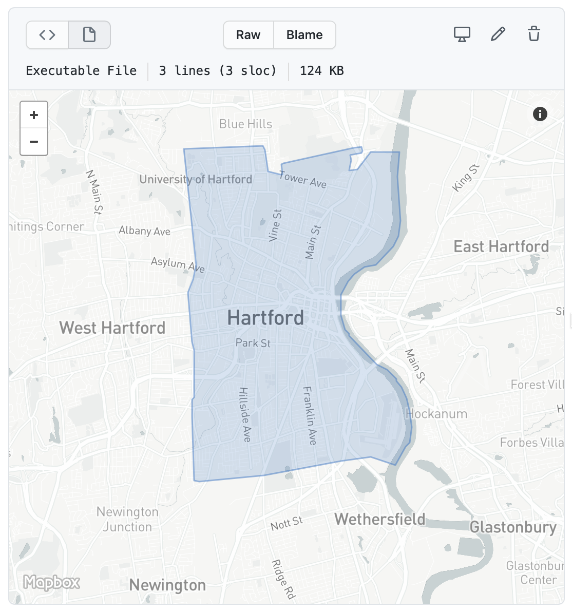
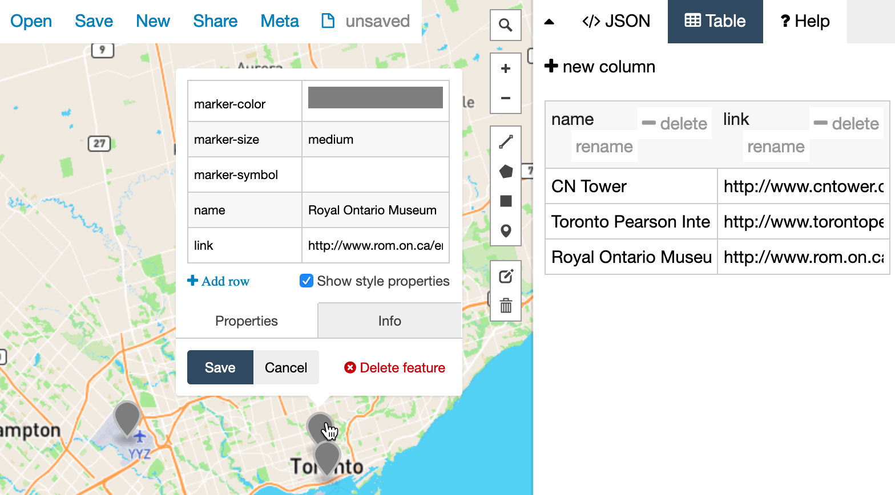
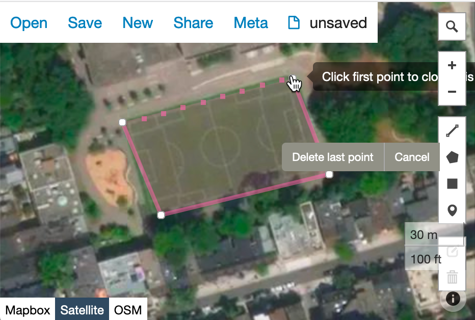
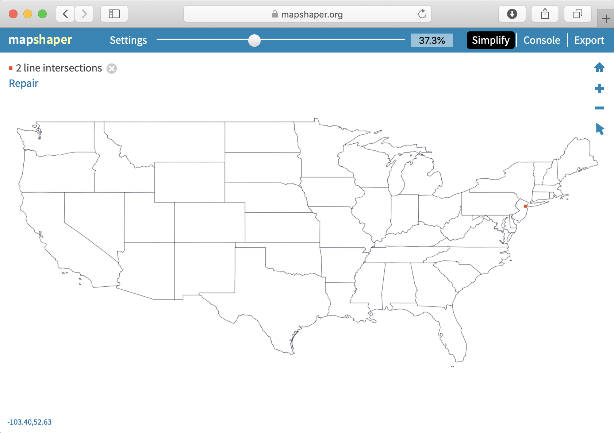
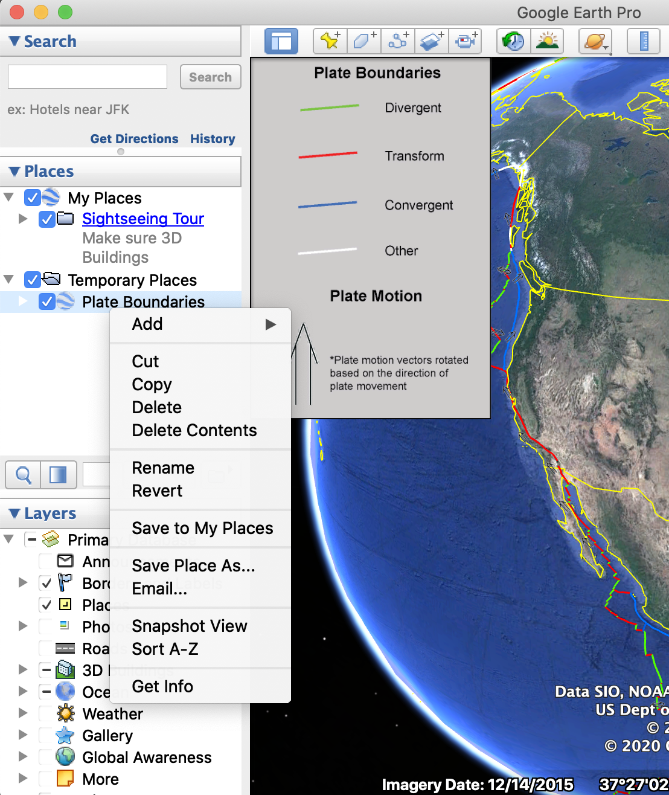

# Transform Your Map Data {#transform}

In [Chapter 8: Map Your Data](map.html), we introduced basic concepts about interactive web maps, which are made up of different data layers. When users explore an interactive map, they usually click on the upper layer, which often displays some combination of points, polylines, and polygons, on top of a seamless set of basemap tiles that are built from raster or vector data. Whether you [create maps with drag-and-drop tools such Datawrapper](choropleth-datawrapper.html) or [customize Leaflet map code templates](leaflet.html), you may need to transform data to work with one of these types of map layers.

In this chapter, we will delve further into the topic of [geospatial data and its different formats](geojson.html), such as GeoJSON, the open-standard format most commonly used in this book. You'll learn [how to find and extract geographic boundary files in this format](find-geojson.html) from the crowd-sourced OpenStreetMap platform. Also, we'll show how to convert or create your own top-level map layer data using the [GeoJson.io tool](geojsonio.html), and how to edit these layers with spreadsheet data using the [Mapshaper tool](mapshaper.html).  Moreover, you'll also learn how to georeference a high-quality static map image and transform it into interactive map tiles using the [the MapWarper tool](mapwarper.html). All of these free, web-based geodata tools are easy to learn, and in many cases they replace the need for more costly or complex geographic information systems, such as the proprietary ArcGIS and the open-source QGIS desktop applications. Finally, we'll conclude with strategies to [bulk geocode large batches of address data](bulk-geocode.html), and to [pivot points into polygon data](pivot-point-to-polygon.html), which enables you to display this information in choropleth maps. By the end of this chapter, you should feel much more confident in navigating the somewhat-overwhelming world of geospatial data.

Let's start with a general overview of geospatial data, and introduce you to various file formats to ensure you are ready to create, use, and share map data.

## Geospatial Data and GeoJSON {- #geojson}

Let's talk about basics of geospatial data to help you to better understand the map layers that you'll create and edit later in this chapter. The first thing to know about geospatial data is that it consists of two components, *location* and *attribute*.
When you use Google Maps to search for a restaurant, you see a red marker on the screen that points to its location in latitude and longitude coordinates, such as `41.7620891, -72.6856295`. Attributes include additional information such as the restaurant name, its human-friendly street address, and guest review comments. All of these attributes add value to your location data.

Second, geospatial data can be *raster* or *vector*, a concept we previously introduced in the [Map Design Principles section of Chapter 8](map-design.html). In digital maps, raster data often appears as satellite and aerial images, and the quality depends on the resolution of the camera that captured them. If a satellite camera has a 1-meter resolution, its images display the different colors it captured as a grid of cells, which measure one meter on each side. Each of these cells appears as a color-coded pixel on our computer screens. If you zoom in too close to a raster image, it may appear fuzzy or pixelated due to the resolution limitations of the original image, as shown in Figure \@ref(fig:geospatial-raster-vector).

By contrast, vector data often appears in digital maps as pictorial images of buildings, rivers, and regions. Vector maps can be created by humans or algorithms when they draw points, polylines, and polygons from raster satellite or aerial images, or from devices such as GPS trackers that record runs or hikes, or from other sources. For example, much of [OpenStreetMap](https://www.openstreetmap.org) has been built by volunteers who trace outlines of objects from satellite images, and anyone can sign up to help expand it this crowdsourced map of the world. Unlike raster maps, vector maps remain sharply focused at any zoom level, because every point and line is represented by latitude and longitude coordinates, which can be expressed with precise decimals. In addition, while raster data is generally limited to one value per cell (such as color for traditional satellite images, or height above sea level for digital elevation models), vector data can contain multiple attributes about each object (such as its name, street address, and comments). Moreover, vector map files tend to be smaller in size than raster ones, which is important when we create and upload maps to share and display online.

(ref:geospatial-raster-vector) Geospatial data can be a raster grid of cells (on the left) or a vector collection of points, polylines, and polygons (on the right).

```{r geospatial-raster-vector, out.width=750, fig.cap="(ref:geospatial-raster-vector)"}
knitr::include_graphics("images/14-transform/geospatial-raster-vector.png")
```

Since we focus on vector data in the several sections of this chapter, let's take a look at some of its most common file formats, starting with GeoJSON, the format that works best with our recommended tools.

#### GeoJSON {-}
[GeoJSON](https://geojson.org) is a popular map data format, based on an open-standard created in 2016, with file suffixes that end with `.geojson` or `.json`. The code snippet below represents a single point in GeoJSON format, with latitude of 41.76 and longitude of -72.67, and a *name* attribute (also known as a property) whose value is *Hartford*.

```
{
  "type": "Feature",
  "geometry": {
    "type": "Point",
    "coordinates": [-72.67, 41.76]
  },
  "properties": {
    "name": "Hartford"
  }
}
```

In addition to `Point` feature type shown above, other GeoJSON types can be `LineString` (also known as lines or polylines) or `Polygon`, both of which are represented as arrays of points. The simplicity and readability of GeoJSON allows you to edit it even in the most
simple text editor, such as the [Atom Editor tool described in Chapter 11](github-desktop-atom.html).

We strongly recommend that you create and edit map data in GeoJSON format, which is supported by the map tools we recommend in this book (such as Datawrapper and Leaflet) and dozens of others. Storing and sharing your geospatial data in GeoJSON ensures that you can others will be able to use the file without installing bulky or expensive GIS desktop applications. Another benefit is that your GitHub repository will automatically display a map preview of any GeoJSON file, as shown in Figure \@ref(fig:geojson-github).

(ref:geojson-github) GitHub repositories automatically show a map preview for GeoJSON files.

```{r geojson-github, out.width=600, fig.cap="(ref:geojson-github)"}

```

Warning: In GeoJSON format, coordinates are ordered in *longitude-latitude* format, the same as X-Y coordinates in mathematics. But this is the opposite of Google Maps and some other web map tools, which place coordinate values in *latitude-longitude* format. For example, *Hartford, Connecticut* is located at (-72.67, 41.76) according to GeoJSON, but at (41.76, -72.67) in Google Maps. Neither notation is right or wrong. Just make sure you know which one you are dealing with. Tom MacWright created a great summary table
[showing lat/lon order of different geospatial formats and technologies](https://macwright.com/lonlat/).

Now that you've been introduced to the GeoJSON geospatial file format, let's compare it with some other formats.

#### Shapefiles {-}
The shapefile format was created in the 1990s by Esri, the company that develops
ArcGIS software. Shapefiles typically appear in a folder of files with suffixes
such as `.shp`, `.shx`, and `.dbf`, and the folder may be compressed into a `.zip` file.

Government agencies commonly distribute map data in shapefile format. But the standard tools for editing
shapefiles---ArcGIS and its free and open-source cousin, QGIS---are not as
easy to learn as other tools in this book. For this reason, we
recommend converting shapefiles into GeoJSON files if possible, and you can do this with the [Mapshaper tool](mapshaper.html), discussed a bit later in the chapter.

#### GPS Exchange Format (GPX) {-}

If you ever recorded your run or bike ride with a GPS device, chances are you ended up with a `.gpx` file.
GPX is an open standard and is based on XML markup language.
Like GeoJSON, you can inspect the contents of a GPX file in any simple text editor. Most likely, you will see a collection timestamps and latitude/longitude coordinates that the GPS device recorded at that particular time. You can convert GPX to GeoJSON format with the [GeoJson.io tool](geojsonio.html), discussed later in this chapter.

#### Keyhole Markup Language (or KML) {-}

The KML format rose in popularity during the late 2000s, when it was developed for [Google Earth](https://www.google.com/earth/), a free and user-friendly tool to view and edit two- and three-dimensional geographic data. KML files were also used
with maps powered by Google Fusion Tables, but that [tool was dropped by Google in late 2019](https://killedbygoogle.com/).
 You can convert your KML file into GeoJSON format with the [GeoJson.io tool](geojsonio.html) described later in this chapter.

Hint: Sometimes `.kml` files are distributed in a compressed `.kmz` format. To learn how to transform them, see the [Converting from KMZ to KML format](convert-kmz.html) section of this chapter.

#### MapInfo TAB {-}
The proprietary TAB format is created and supported by MapInfo, Esri's competitor, and is designed to work well with MapInfo Pro
GIS software. Similar to Esri's shapefiles, MapInfo TAB files usually appear in a folder with suffixes that end with `.tab`, `.dat`, `.ind`, and some other files.  Unfortunately, you will most likely need MapInfo Pro, QGIS, or ArcGIS to convert these to Shapefile or GeoJSON format.

We've mentioned only a handful of the most common geospatial file formats, and there is a myriad of [lesser-known formats](https://en.wikipedia.org/wiki/GIS_file_formats). Remember that GeoJSON is one of the best, most universal formats for your *vector* data,
and we strongly recommend that you store and share your point, polyline, and polygon data in this format.
In the next section, we will describe how to find GeoJSON boundary files for many locations around the globe.

## Find GeoJSON Boundary Files {- #find-geojson}
You may be searching for geographic boundary files in GeoJSON format to create a customized map. For example, both the [Datawrapper tool described in Chapter 8](choropleth-datawrapper.html) and the [Leaflet map code code templates described in Chapter 13](leaflet.html) allow you to upload your own GeoJSON files. Since GeoJSON is an open-data standard, you may [find these files in several open data repositories listed in Chapter 4](opendata.html).

Another way to find and download GeoJSON files is the clever [Gimme Geodata tool](http://hanshack.com/geotools/), developed by Hans Hack, which provides quick access to multiple layers of [OpenStreetMap](https:openstreetmap.org) boundary files. When you open the tool, search for a location and click a specific point on the map. The tool displays the names and outlines of different geographic boundaries around that point that have been uploaded into OpenStreetMap, which you can select and download in GeoJSON format. For example, when you search and click on Toronto Centre, the tool displays several neighborhood-level boundaries, the Old Toronto city boundary, the present-day Toronto city boundary, and regional and provincial boundaries, as shown in Figure \@ref(fig:gimme-geodata). Read more details about each layer to evaluate their accuracy, then select any layer to download in GeoJSON format. The tool also includes an editor (the scissors symbol) to remove water areas from the boundary file (such as deleting Lake Ontario from Toronto). When using any type of data that you downloaded from OpenStreetMap, always credit the source in your final product like this: `© OpenStreetMap contributors`.

(ref:gimme-geodata) Use the Gimme Geodata tool to select a point and download surrounding geographic boundaries from Open Street Map.

```{r gimme-geodata, fig.cap="(ref:gimme-geodata)"}
knitr::include_graphics("images/14-transform/gimme-geodata.png")
```

Now that you know how to find geodata, let's look at free online tools to create, convert, edit, and join GeoJSON files with other types of data.

## Draw and Edit with GeoJson.io {- #geojsonio}

[GeoJson.io](https://geojson.io) is a popular open-source web tool to convert,
edit, and create GeoJSON files. The tool was originally developed by
[Tom MacWright](https://macwright.org/about/) in 2013
and quickly became a go-to tool for geospatial practitioners.

In this tutorial, we will show you how to convert existing KML, GPX, TopoJSON, and even
CSV files with latitude/longitude data into GeoJSON files. We will also explore how to
edit attribute data, add new features to GeoJSON files, and create new geodata from scratch by tracing satellite imagery.

#### Convert KML, GPX, and other formats into GeoJSON {-}

Navigate to the [GeoJson.io tool](https://geojson.io). You will see
a map on the left, and a Table/JSON attribute view area on the right. At the start,
it represents an empty feature collection. Remember that features
are points, polylines, and polygons.

Drag and drop your geospatial data file into the map area on the left.
Alternatively, you can also import a file from *Open > File* menu.
If you don't have a geospatial file, download the [Toronto neighborhoods sample file in KML format](data/toronto-neighborhoods-sample.kml)
to your computer, and upload it to the GeoJson.io tool. This simplified sample KML file was created from the [Toronto Open Data portal](https://open.toronto.ca/dataset/neighbourhoods/).

If GeoJson.io can recognize and import your geodata file,
you will see a green popup message in the upper-left corner saying how many
features were imported. For example, Figure \@ref(fig:geojson-io-import) shows us that 140 features were imported from
the sample Toronto neighborhoods KML file, and these polygons appear in the top of the map view.

Note: If GeoJson.io cannot import your file, you will see a red
popup saying it "Could not detect file type." Instead, try to convert your file into GeoJSON format using the [Mapshaper tool](mapshaper.html), as described further below.

(ref:geojson-io-import) GeoJson.io successfully imported the Hartford Parks sample KML file.

```{r geojson-io-import, out.width=600, fig.cap="(ref:geojson-io-import)"}
knitr::include_graphics("images/14-transform/geojson-io-import.png")
```

To download a converted GeoJSON file to your computer, go to *Save > GeoJSON*.

Warning: The GeoJson.io tool will automatically name your downloaded file as `map.geojson`, so rename it to avoid confusion.

#### Create GeoJSON from a CSV file {-}

GeoJson.io can transform a CSV spreadsheet with *latitude* (or *lat*) and *longitude* (or *lon*)
columns into a GeoJSON file of point features. Each row in the spreadsheet
becomes its own point, and all columns other than *lat* and *lon*
become *attributes* (or *properties*) of point features. For this exercise, you can download the [Toronto locations sample CSV file](data/toronto-locations-sample.csv) to your computer, which contains three rows of data as shown in Figure \@ref(fig:geojson-io-csv-data).

(ref:geojson-io-csv-data) A CSV spreadsheet with lat/lon columns can be transformed into a GeoJSON with point features.

```{r geojson-io-csv-data, fig.cap="(ref:geojson-io-csv-data)"}
knitr::include_graphics("images/14-transform/geojson-io-csv-data.png")
```

1. Select *New* to clear data from the prior exercise in the GeoJson.io tool, then drag-and-drop the Toronto locations CSV file you downloaded above into the map area of the tool. A green popup show notify you that 3 features were successfully imported.

Note: If you add new data to existing data in GeoJson.io, it will combine them into one file, which can be useful for certain tasks.

2. Click on a marker to see a popup with point properties. If you used the Toronto locations sample file, you will see *name* and *link* features, in addition to the tool's default *marker-color*, *marker-size*, and *marker-symbol* fields. Note that you can edit and delete properties in the Map view.

3. Click the *Table* tab to the right of the map to view all of the data at once, rather than individual marker popups, as shown in Figure \@ref(fig:geojson-io-points). You can edit and delete properties in the Table view, as well as the JSON code view.

4. If you edited your map data, go to *Save > GeoJSON* to download the file to your computer, which will automatically be named `map.geojson`, so rename it to avoid confusion. Optionally, you can also log into GeoJson.io with your GitHub account and save it directly to your repository.

(ref:geojson-io-points) Upload CSV data into GeoJson.io to easily edit it in the Map or Table view.

```{r geojson-io-points, fig.cap="(ref:geojson-io-points)"}

```

#### Create new GeoJSON data with drawing tools {-}

GeoJson.io lets you create geospatial files from scratch by using simple drawing
tools to place points, polylines, or polygons on the map.
These are useful when you have no original file to work with. Let's create some new data.

1. Click *New* to clear data from the prior exercise in the GeoJson.io tool.  

2. In the lower-left corner, switch from Mapbox (vector tiles) to Satellite (raster data).

3. In the upper-right corner of the map, use the Search tool to find an area of interest.
For this exercise, we will trace the geography around an athletic field in Toronto, as shown in
Figure \@ref(fig:geojson-io-draw).

(ref:geojson-io-draw) Use drawing tools to create points, lines, and polygons in GeoJson.io.

```{r geojson-io-draw, out.width=450, fig.cap="(ref:geojson-io-draw)"}

```

4. In the toolbar, you have a choice of four drawing tools: a polyline (which is a series
of points connected by lines, but not closed like a polygon), a polygon, a rectangle
(which is just an instance of a polygon), and a point marker.

5. Select the *Draw a marker* button, and click anywhere on the map to place it.
You will see a gray marker that is now part of your map. You can modify its properties,
or delete it in the interactive pop-up.

6. Select the *Draw a polyline* button and click on multiple locations in the map to see
connected lines appearing. Polylines are generally used for roads and paths. To finish and create a feature, click again on the final point.

7. Select the *Draw a polygon* button, which similar to drawing a polyline, except that you need to complete
the feature by making your final point at the same location as your initial point.
Polygons are used to define boundaries, including small and large geographical areas.

8. Use the *Edit layers* tool (above *Delete*) to move a marker to a better position,
or adjust the shapes of your features.

After you have created features and their physical boundaries, add
meaningful attribution data. Use the interactive popups or the Table view to
give objects names and other properties. When finished, save the GeoJSON file to your computer.

You can also use drawing tools to edit existing GeoJSON files. For example,
if you created a GeoJSON from a CSV file, you might decide to move some markers
with *Edit layers* tool instead of modifying their latitude and longitude values.
Or you might decide to make polygons more precise by tracing around satellite imagery.

In the next section, we will introduce Mapshaper, another free online tool
to convert and modify geospatial files.

## Edit and Join with Mapshaper {- #mapshaper}

Like [GeoJson.io](geojsonio.html), [Mapshaper](https://mapshaper.org)
is a free, open-source editor that can convert geospatial files, edit attribute
data, filter and dissolve features, simplify boundaries to make files smaller,
and many more. Mapshaper's edit and join commands are much more powerful than the GeoJson.io tool. Unlike GeoJson.io, Mapshaper doesn't have drawing tools, so you won't be able to create geospatial files from scratch.

Mapshaper is developed and maintained by [Matthew Bloch on GitHub](https://github.com/mbloch/mapshaper).
This easy-to-learn web tool has replaced *many* of our map preparation
tasks that previously required expensive and hard-to-learn ArcGIS software, or its free
but still-challenging-to-learn cousin, QGIS. Even advanced GIS users may discover that Mapshaper
can be a quick alternative for some common but time-consuming tasks.

#### Import, convert, and export map boundary files {-}

You can use Mapshaper to convert between geospatial file formats. Unlike GeoJson.io,
Mapshaper also allows you to upload Esri Shapefiles, so you can easily convert them into the web-friendly GeoJSON format.
In the following steps, we will convert a geospatial file by importing it to Mapshaper,
and then exporting it as a different file type.

1. Navigate to [Mapshaper.org](https://mapshaper.org). The start page is two large drag-and-drop zones
which you can use to import your file. The smaller area at the bottom, *Quick import*, uses default
import settings and is a good way to begin.

2. Drag and drop your geospatial file to the *Quick import* area. For this exercise, you can download our [US states shapefiles in .zip format](data/us-states-shapefile.zip), which is a compressed archive that contains four shapefiles.

Note: If you want to import a folder of shapefiles, you need to either select all files inside that folder
and drop them all together to the import area, or upload all of them inside a compressed `.zip` archive.

3. Each imported file becomes a layer, and is accessible from the dropdown menu in the top-middle
of the browser window. There, you can see how many features each layer has, toggle their visibility,
or delete them.

4. To export, go to *Export* in the upper-right corner, and select a desired file format.
The choice of export formats is shown in Figure \@ref(fig:mapshaper-export).
Currently, available formats are Shapefile, GeoJSON,
TopoJSON (similar to GeoJSON, but with topographical data), JSON records, CSV,
or SVG (Scalable Vector Graphics, for web and print). If you export more than one layer at a time,
Mapshaper will archive them first, and you will download an `output.zip` that contains
all exported layers.

(ref:mapshaper-export) You can use Mapshaper to quickly convert between geospatial file formats.

```{r mapshaper-export, fig.cap="(ref:mapshaper-export)"}
knitr::include_graphics("images/14-transform/mapshaper-export.png")
```

Tip: Mapshaper doesn't work with KML or KMZ files, but you can use [GeoJson.io](#geojson.html) to first convert them into GeoJSON format, then upload to Mapshaper.


#### Edit data for specific polygons {-}

You can edit attribute data of individual polygons (and also points and lines) in Mapshaper, as shown in Figure \@ref(fig:mapshaper-edit).

1. Import the file whose polygon attributes you want to edit.

2. Under the cursor tool, select *edit attributes*.

3. Click on the polygon you want to edit. A pop-up will appear in the upper-left corner
listing all attributes and values of the polygon.

4. Click on any value (underlined, in blue) and edit it.

5. When you are done, export your geospatial file by clicking *Export* and
choosing the desired file format.

(ref:mapshaper-edit) Use *edit attributes* tool (under Cursor tool) to edit attributes of polygons, lines, and points.

```{r mapshaper-edit, fig.cap="(ref:mapshaper-edit)"}
knitr::include_graphics("images/14-transform/mapshaper-edit.png")
```

#### Simplify map boundaries to reduce file size {-}

You may not need precise and detailed map boundaries for
data visualization projects where zoomed-out geographies are shown.
Detailed boundaries are heavy, and may slow down your web maps.

Consider two maps of the contiguous US states (also known as *the lower 48*,
the term co-author Ilya learned in 2018 while traveling in Alaska), as shown in Figure \@ref(fig:mapshaper-simplify-demo).
The map in Figure \@ref(fig:mapshaper-simplify-demo)a is more detailed and is about 230 kilobytes, but the map in Figure \@ref(fig:mapshaper-simplify-demo)b
is only 37 kilobytes, or six times smaller! However, be careful not to simplify boundaries so much that you remove important features.

(ref:mapshaper-simplify-demo) Consider simplifying geometries with Mapshaper to make your web maps faster.

```{r mapshaper-simplify-demo, fig.cap="(ref:mapshaper-simplify-demo)"}
knitr::include_graphics("images/14-transform/mapshaper-simplify-demo-annotated.png")
```

To simplify map boundaries in Mapshaper, follow the steps below.

1. Import your geodata file to Mapshaper. You can use the [sample contiguous US states GeoJSON](data/lower-48.geojson).

2. Click the *Simplify* button in the upper-right corner. The Simplification menu will appear,
where you can choose one of three methods. We recommend checking *prevent shape removal*, and leaving
the default *Visvalingam / weighted area*. Click *Apply*.

3. You will see a slider with `100%` appear on top (Figure \@ref(fig:mapshaper-simplify)), replacing the layer selection dropdown.
Move the slider to the right and see the map simplify its shape as you go. Stop when you think
the map looks appropriate (when the shapes are still recognizable).

4. Mapshaper may suggest to repair line intersections in the upper-left corner. Click *Repair*.

5. You can now export your file using the *Export* feature.

(ref:mapshaper-simplify) Use Simplify & Repair tools in Mapshaper.

```{r mapshaper-simplify, fig.cap="(ref:mapshaper-simplify)"}

```

Tip: You may find the US shape a bit unusual and vertically "shrunk".
Click open the *Console* and type `-proj EPSG:3857` to change projection to Web Mercator,
which is more common.

#### Dissolve internal polygons to create an outline map {-}

Mapshaper's most powerful tools are available through the *Console*, which allows you to type commands for common map editing tasks.
One of such tasks is to create an outline map by removing the internal boundaries. For example, you can dissolve
state boundaries of the US map in the previous exercise to get the outline of the country, like is shown in
Figure \@ref(fig:mapshaper-dissolve).

(ref:mapshaper-dissolve) Mapshaper lets you dissolve boundaries to create an outline shape.

```{r mapshaper-dissolve, fig.cap="(ref:mapshaper-dissolve)"}
knitr::include_graphics("images/14-transform/mapshaper-dissolve.png")
```

Click on *Console*, which opens a window to type in commands. Enter the *dissolve* command exactly as shown below, then press the *Return* or *Enter* key.

`-dissolve`

You will see that internal boundaries became lighter color, and that's Mapshaper's way of saying they no longer exist.
You can now export your outline shape.

#### Clip a map to match an outline layer {-}

The state of Connecticut consists of 8 counties, which in turn are divided into towns. There are a total of 169 towns in Connecticut.
Imagine you are given a [boundary file of all 169 towns](data/ct-towns.geojson), and [the outline of Hartford county](data/hartfordcounty-outline.geojson).
You need to "cut" the original towns map to only include those towns that fall within Hartford county.

Mapshaper allows you to do just that using one simple `-clip` command.

1. Import two boundary files into Mapshaper. One is the larger one that is being clipped (if you use sample files, *ct-towns*),
and one is the desired final shape (*hartfordcounty-outline*). The latter is what ArcGIS calls the "clip feature".

2. Make sure your active layer is set to the map you are clipping (*ct-towns*).

3. In the *Console*, type `-clip` followed by the name of your clip layer, like this:

`-clip hartfordcounty-outline`

4. You should see your active layer got clipped. Sometimes you end up with tiny "slivers" of clipped areas that remain alongside the borders.
If that is the case, use a related command to remove them, like this:

`-clip hartfordcounty-outline -filter-slivers`

5. Your Mapshaper state should look like the one pictured in Figure \@ref(fig:mapshaper-clip). You can now save the file on your computer using the *Export* button.

(ref:mapshaper-clip) When clipping, make sure your active layer is the one being clipped (with many features), not the clipping feature itself.

```{r mapshaper-clip, fig.cap="(ref:mapshaper-clip)"}
knitr::include_graphics("images/14-transform/mapshaper-clip.png")
```

#### Remove unwanted data fields {-}

Sometimes map features, such as polygons, lines, and points, contain unwanted *attributes* (or fields, or columns) that you may want to remove.
In the *Console*, type the `-filter-fields` editing command to remove unnecessary fields.

For example, this command removes all fields except *town*:

`-filter-fields town`

If you want to leave more than one field, separate them by a comma, but without spaces, like this:

`-filter-fields town,state`

Warning: If you leave a space after a comma, you will get a *Command expects a single value* error.

#### Join spreadsheet data with polygon map {-}

Combining spreadsheet data with geographical boundaries is a common task in data visualization. In this exercise, you will download this [Connecticut town boundaries map in GeoJson format ](data/ct-towns.geojson),
and also download this [Connecticut town population data in CSV format](data/ct-towns-popdensity.csv), and join the two of them in order to build a choropleth map.

Mapshaper provides a powerful `-join` command to connect these files files. Remember that you need some common keys
in both datasets (such as *town name*, or *state*, or *country*) in order to join the two files. Without a common field, Mapshaper has no way of knowing which
numbers belong to which polygons.

1. Import both the GeoJSON file and the CSV file you downloaded above into Mapshaper using its Quick import box.

2. Make sure both files appear in the drop-down list of layers.
Your CSV data will appear to resemble a table. Use the *Cursor > inspect attributes* tool
to make sure the data is imported correctly. If you use the sample Connecticut data, note that the *ct-towns* layer
has *name* attribute with the name of the town, and *ct-towns-popdensity* has town names in the *town* column.

3. Make your geospatial layer (*ct-towns*) the active layer.

4. Open the *Console* and enter the `-join` command, like this:

`-join ct-towns-popdensity keys=name,town`

In this command, `ct-towns-popdensity` is the CSV layer you are merging with, and `keys` are the attributes that contain values to join by.
For our sample data, these would be town names which are stored in `name` attribute of the map file, and `town` column
of the CSV file.

5. You will see a message in the console notifying you if join was performed successfully, or if Mapshaper encountered any errors.

6. Use the *Cursor > inspect attributes* tool to make sure you see CSV columns as fields of your polygons, as shown in Figure \@ref(fig:mapshaper-join).

7. You can now save the file to your computer by clicking the *Export* button.

(ref:mapshaper-join) In Mapshaper, join spatial and CSV files using common keys, such as town names.

```{r mapshaper-join, fig.cap="(ref:mapshaper-join)"}
knitr::include_graphics("images/14-transform/mapshaper-join.png")
```

Tip: To avoid confusion, it may be useful to re-name your CSV column that contains key values to match the key attribute name of your map.
In our example, you would rename *town* column to *name* column in the CSV, and your command would end with `keys=name,name`.


#### Count points in polygons with Mapshaper {-}

Mapshaper lets you count points in polygons, and record that number in polygon attributes using `-join` command.

1. Download two sample GeoJSON files to your computer: the points that you want to aggregate, such as [hospital points in the US](data/hospitals-points.geojson), and polygon boundaries, such as [US state boundaries](data/us-states.geojson). Import both into Mapshaper.

2. Make sure polygons (not points) are the active layer from selecting it from the dropdown menu.

3. In the *Console*, do a `-join` command using a `count()` function, like this:

`-join hospitals-points calc='hospitals = count()' fields=`

This command tells Mapshaper to count points inside the *hospitals-points* layer and record them as the *hospitals* attribute of the polygons.
The `fields=` part tells Mapshaper to not copy any fields from the points, because in our case we are performing many-to-one matching, meaning many hospitals per state.

4. Use the *Cursor > inspect attributes* tool to make sure polygons obtained a new field with the recorded count of points,
as shown in Figure \@ref(fig:mapshaper-count-points).

5. Save the new file using the *Export* button and chose the desired output format. In the section below,
we will talk about what happens to objects that don't join.

(ref:mapshaper-count-points) Mapshaper's *-join* command can count points in polygons.

```{r mapshaper-count-points, fig.cap="(ref:mapshaper-count-points)"}
knitr::include_graphics("images/14-transform/mapshaper-count-points.png")
```

#### More about joins {-}

In the section above on "Count points in polygons," you did not need to specify *keys* to join locations between two geographical layers: points and polygons. But if one of the files you wish to join is a CSV dataset, you need *keys*.

If you don't have a CSV dataset that matches the columns in your boundary map data, you can easily create one.
Upload the boundary map to Mapshaper, and export in CSV format. Open the downloaded CSV file in any spreadsheet tool.
To match data columns in the CSV spreadsheet, use the [VLOOKUP](vlookup.html) function.

In real life, you will rarely have perfect files with one-to-one matches,
so you might want to have more information about which features didn't get matched so
that you can fix your data.
Mapshaper helps you keep track of data that is not properly joined or matched. For example, if the polygon map contains 169 features
(one for each town in Connecticut), but the CSV table contains only 168 rows of data, Mapshaper will join all of those with matching keys,
and then display this message:

```
[join] Joined data from 168 source records to 168 target records
[join] 1/169 target records received no data
[join] 1/169 source records could not be joined
```

To get more details on which values were not joined, add `unjoined unmatched -info` flags to your join command, like this:

`-join ct-towns-popdensity keys=name,town unjoined unmatched -info`

The `unjoined` flag saves a copy of each unjoined record from the source table into another layer named *unjoined*. The `unmatched` flag saves a copy of each unmatched record from the target table to a new layer named *unmatched*. Finally, the `-info` flag outputs some additional information about the joining procedure to the console.


#### Merge selected polygons with join and dissolve commands {-}

In Mapshaper, you can merge selected polygons into larger clusters using `-join` and `-dissolve` commands. Imagine that you are employed by the CT Department of Public Health, and your task is to divide 169 towns into 20 [public health districts](https://portal.ct.gov/DPH/Local-Health-Admin/LHA/Local-Health-Administration---Site-Map) and produce a new geospatial file.

You should begin by creating a *crosswalk* of towns and their health districts, which means some way of matching two sets of data, such as zip codes and towns where they are located. In our case, the crosswalk can be as simple as a two-column CSV list
of a town and its district, each on a new line. Because your boss didn't give you a list of towns in a spreadsheet format,
but instead a GeoJSON file with town boundaries, let's extract a list of towns from it.

1. Import [ct-towns.geojson](data/ct-towns.geojson) to Mapshaper using Quick import box.

2. Use the *Cursor > inspect attributes* tool to see that each polygon has a *name* attribute with the name of the town.

3. Save attribute data as a CSV file using *Export* button. Open the file in any spreadsheet tool. You will see that your data is a one-column
file with a *name* column that lists 169 towns.

4. In your spreadsheet, create a second column titled *merged* and copy-paste values from the first *name* column. At this point your spreadsheet contains two columns with the same values.

5. Pick a few towns, such as *West Hartford* and *Bloomfield*, and assign "Bloomfield-West Hartford"
to their *merged* column, as shown in Figure \@ref(fig:mapshaper-merge-csv). You can stop here and move to the next step, or keep assigning district names to a few other neighboring towns.

(ref:mapshaper-merge-csv) Create a two-column crosswalk of town names and their merged health districts.

```{r mapshaper-merge-csv, out.width=350, fig.cap="(ref:mapshaper-merge-csv)"}
knitr::include_graphics("images/14-transform/mapshaper-merge-csv.png")
```

6. Save this new spreadsheet file as *ct-towns-merged.csv*, and drag-and-drop it to Mapshaper on top of your *ct-towns* layer. Click *Import*.

7. In Mapshaper, this new CSV layer, named *ct-towns-merged*, will appear as a series of table cells. From the dropdown menu,
select *ct-towns* to get back to your map.

8. Now you are ready to merge certain towns into districts according to your uploaded CSV file. Open the *Console*, and type:

`-join ct-towns-merged keys=name,name`

to join the CSV layer with the boundaries layer that you see on the screen.

Then type:

`-dissolve merged`

to dissolve polygons of towns according to the *merged* column of the CSV file.

In our example, only Bloomfield and West Hartford are dissolved into a combined
"Bloomfield-West Hartford" regional health district, with the shared boundary line between those towns becoming grayed out,
and all of the other polygons remain the same. Figure \@ref(fig:mapshaper-merge) shows the final result.

(ref:mapshaper-merge) Merge polygons based on a predefined crosswalk.

```{r mapshaper-merge, fig.cap="(ref:mapshaper-merge)"}
knitr::include_graphics("images/14-transform/mapshaper-merge.png")
```

You can inspect attribute data of polygons using *Cursor > inspect attributes* tool, and save the resulting file
using the *Export* button.

Overall, Mapshaper is a powerful geodata editing tool with many more commands that are worth exploring. Some of these include changing projections, filtering features using JavaScript expressions, assigning colors to polygons based on values, and many more. Explore the [MapShaper Wiki on GitHub](https://github.com/mbloch/mapshaper/wiki/Command-Reference) to learn more commands and see more examples.

## Convert Compressed KMZ to KML {- #convert-kmz}

In the previous two sections, we demonstrated how to use the [Geojson.io tool](geojsonio.html) and the [Mapshaper tool](mapshaper.html)
to convert geospatial files from one format to another. However, not all file types can be converted with these tools.
This chapter shows a specific example of a commonly-requested conversion between `.kmz` and `.kml` formats, using the free Google Earth Pro desktop application. KMZ is a compressed version of a KML file, a native format of Google Earth.

1. Download and install the [Google Earth Pro](https://www.google.com/earth/versions/) desktop application for Mac, Windows, or Linux.

2. Double-click on any `.kmz` file to open it in Google Earth Pro. Alternatively, open Google Earth Pro first,
and go to *File > Open* and choose your KMZ file.

3. Right-click (or control-click) on the KMZ layer under the *Places* menu, and select *Save Place As...*, as shown in Figure \@ref(fig:kmz-earth).

(ref:kmz-earth) In Google Earth Pro, right-click the KMZ layer and choose *Save Place As*.

```{r kmz-earth, out.width="400px", fig.cap="(ref:kmz-earth)"}

```

4. In the dropdown menu of *Save file...* window, choose *KML* format, as shown in Figure \@ref(fig:kmz-save-as).

(ref:kmz-save-as) Save as KML, not KMZ.

```{r kmz-save-as, out.width="350px", fig.cap="(ref:kmz-save-as)"}
knitr::include_graphics("images/14-transform/kmz-save-as.png")
```

Alternatively, you can use any zip-utility to extract a KML file from KMZ, because KMZ is simply a *zipped* version of a KML file!


## Georeference with MapWarper {- #mapwarper}

[MapWarper](http://mapwarper.net), an open-source tool created and hosted by Tim Waters, allows users to upload and georeference (also called georectify) a scanned map image. This means to precisely align the static map image on top of a present-day interactive map. As a result of this process, older map images often appear "warped" when updated for the digital age. After your map image is georeferenced and hosted on this site, a special link allows you to place this raster data as an overlay on an interactive map, such as [Leaflet Storymaps with Google Sheets as described in Chapter 13](leaflet-storymaps-with-google-sheets.html). Anyone can create a free account to upload and georeference a map on the developer's public MapWarper site. See also how the tool is used by organizations such as the [New York Public Library's digital maps collection](http://maps.nypl.org).

Warning: While MapWarper is a wonderful open-source platform, service may be unstable. A July 2020 update states: "Ran out of disk space. Maps older than 2 years will need re-warping to work. Downtime will happen again." We recommend that users be mindful of the platform's limitations, but also consider donating funds to the developer to continue this open-source project.

Follow this abbreviated tutorial to create a georeferenced overlay map, based on a [more detailed version by digital librarians Erica Hayes and Mia Partlow](https://github.com/ericayhayes/georeferencingtutorial).^[@hayesTutorialGeoreferencingDisplaying2020]

1. Create a free account on [MapWarper](http://mapwarper.net).

2. Upload a high-quality image or scan of a map that has not yet been georeferenced, such as an image of a paper historical map, and enter metadata for others to find it. Follow guidelines about fair-use copyright or works in the public domain.

3. After you upload the image, click on the *Rectify* tab in the MapWarper interface, and practice moving around the map.

4. Click to add a control point in the historic map window, then click to add a matching control point in the modern map window to align the two images, as shown in Figure \@ref(fig:mapwarper). Good control points are stable locations or landmarks that have not changed during the time period between the two maps. For example, major cities, railroad tracks, or road intersections might be a good way to align maps from the early 1900s to today, depending on the map scale and historical context.

(ref:mapwarper) Add control points to align stable locations or landmarks between the historical map (on the right) and the modern map (on the left).

```{r mapwarper, out.width=750, fig.cap="(ref:mapwarper)"}
knitr::include_graphics("images/14-transform/mapwarper.png")
```

5. Add at least 4 or 5 control points to match the two maps and spread them out. When you are satisfied, click the *Warp Image* button at the bottom of the page. MapWarper transforms the static map image into a set of georeferenced map tiles, which now appear as a layer on top of the modern map.

6. Click the *Export* tab, and under *Map Services*, copy the Tiles URL that appears in Google/OpenStreetMap format, similar to this:

`https://mapwarper.net/maps/tile/14781/{z}/{x}/{y}.png`

7. You can copy and paste this special Tiles URL into the [Leaflet Storymaps with Google Sheets template as described in Chapter 13](leaflet-storymaps-with-google-sheets.html), or other web map tools or code templates that display overlay maps in this format. But it will not work if you paste it into a regular web browser.

You can search for historical maps that have already been georeferenced and transformed into tiles, or contribute to crowdsourcing efforts to align maps, on platforms such as [Mapwarper](https://mapwarper.net), the [New York Public Library Mapwarper](http://maps.nypl.org/warper/).

## Bulk Geocode with US Census {- #bulk-geocode}
In Chapter 3: Strengthen Your Spreadsheet Skills, you learned [how to geocode addresses with a Google Sheets Add-On](geocode.html) called [Geocoding by SmartMonkey](https://gsuite.google.com/marketplace/app/geocoding_by_smartmonkey/1033231575312). Geocoding converts street addresses to latitude-longitude coordinates (such as *300 Summit St, Hartford CT, USA* to *41.75, -72.69*) that can be placed on maps. While the Geocoding by SmartMonkey Add-On for Google Sheets works well for medium-sized batches of addresses, sometimes you need a faster geocoding service for larger jobs.

One of the fastest ways to geocode up to 10,000 US addresses at a time is to use the [US Census Geocoder](https://geocoding.geo.census.gov/geocoder/locations/addressbatch?form). First, create a CSV file with 5 columns. Your file must *not* contain a header row, and needs to be formatted the following way:

```
| 1 | 300 Summit St | Hartford | CT | 06106 |
| 2 | 1012 Broad St | Hartford | CT | 06106 |
```

- Column 1: Unique IDs for each address, such as 1, 2, 3, etc. While it does not necessarily have to start at 1 or be in consecutive order, this is the easiest. To quickly create a column of consecutive numbers in most spreadsheets, enter `1`, select the bottom-right corner of the cell, hold down the Option or Control key and drag your mouse downward.
- Column 2: Street address.
- Column 3: City.
- Column 4: State.
- Column 5: Zip Code.

Although some of your data, such as zipcodes or states, may be missing and the geocoder may still be able to recognize and geocode the location, unique IDs are absolutely necessary to include for each row (address).

Tip: If your original data combines address, city, state, and zip into one cell, then see how to [Split Data into Separate Columns in Chapter 5: Clean Up Messy Data](split-data.html). But if your street addresses contain apartment numbers, you can leave them in.

Second, upload your CSV file to the [US Census Geocoder address batch form](https://geocoding.geo.census.gov/geocoder/locations/addressbatch?form). Select *Find Locations Using... > Address Batch*, then choose your file to upload. Select *Public_AR_Current* as the benchmark, and click *Get Results*.

Note: In left-side menu, you can switch from *Find Locations* to *Find Geographies*
if you wish to obtain additional information, such as the GeoID for each address. The US Census assigns a unique 15-digit GeoID to every place, and a sample (such as `090035245022001`) consists of the state (09), followed by the county (003),
the census tract (524502, or more conventional 5245.02),
the census block group (2), and finally the census block (001).

In a few moments the tool will return a
file named *GeocodeResults.csv* with geocoded results. It usually takes longer for larger files.
Save it, and inspect it in your favorite spreadsheet tool. The resulting file is
an eight-column CSV file with the original ID and address, match type (exact, non-exact, tie, or no match),
and latitude-longitude coordinates. A *tie* means there are multiple possible results for your address. To see all possible matches of an address that received a *tie*, use *One Line* or *Address* tools in the left-side menu and search for that address.

Tip: If you see some unmatched addresses, use a filtering functionality of your
spreadsheet to filter for unmatched addresses, then manually correct them,
save as a separate CSV file, and re-upload. You can use the US Census Geocoder as many
times as you want, as long as a single file doesn't exceed 10,000 records.

To learn more about this service, read the [Overview and Documentation section of the US Census Geocoder](https://www.census.gov/programs-surveys/geography/technical-documentation/complete-technical-documentation/census-geocoder.html).

If for some reason you cannot geocode address-level data, but you need to produce some mapping output,
you can use pivot tables to get counts of points for specific areas, such as towns or states. In the next section,
we will look at hospital addresses in the US and how we can count them by state using pivot tables.

## Pivot Points into Polygon Data {- #pivot-point-to-polygon}

If you deal with geographical data, you may find yourself in a situation where
you have a list of addresses which need to be counted (*aggregated*) by area
and displayed as a polygon map. In this case, a simple pivot table in a spreadsheet
software can solve the problem.

Note: A special case of a polygon map is a *choropleth* map,
which represents polygons that are colored in a particular way to represent underlying values.
A lot of polygon maps end up being *choropleth* maps, so we will be using this term a lot in this book.

Let's take a look at a [list of all hospitals](https://data.medicare.gov/Hospital-Compare/Hospital-General-Information/xubh-q36u/data)
that are registered with the Medicare program in the United States. The dataset is
stored and displayed by Socrata, a web database popular among government agencies and city administrations.
This particular dataset has information on each hospital's name,
location (nicely divided into Address, City, State, and ZIP Code columns),
a phone number and some other indicators, such as mortality and patient experience.

Now, imagine you are given a task to create a choropleth map of total hospitals by US state.
Instead of showing individual hospitals as points (as in Figuere \@ref(fig:pivot-address)a ),
you want darker shades of blue to represent states with more hospitals (as in Figure \@ref(fig:pivot-address)b).

(ref:pivot-address) You can count addresses by state (or other area) to produce polygon,
or choropleth, maps instead of point maps.

```{r pivot-address, fig.cap="(ref:pivot-address)"}
knitr::include_graphics("images/14-transform/pivot-address-annotated.png")
```

First, save the database to your local machine by going to *Export > Download > CSV*
of Socrata interface. Figure \@ref(fig:pivot-address-export) shows where you can find the Export button.

(ref:pivot-address-export) In Socrata, you can export the entire dataset as a CSV.

```{r pivot-address-export, fig.cap="(ref:pivot-address-export)"}
knitr::include_graphics("images/14-transform/pivot-address-export.png")
```

Next, open the file in your favorite spreadsheet tool. If you use Google Sheets,
use *File > Import > Upload* to import CSV data. Make sure your address columns are present,
and move on to creating a pivot table (in Google Sheets, go to *Data > Pivot table*, make sure the entire data range
is selected, and click *Create*). In the pivot table, set *Rows* to *State*, because
we want to get counts by state. Next, set pivot table's *Values* to *State*—or really any other
column that has no missing values—and choose *Summarize by: COUNTA*. Voila!

(ref:pivot-address-sheet) Use pivot tables in any spreadsheet software to count addresses per area (such as state, county, of zip code).

```{r pivot-address-sheet, fig.cap="(ref:pivot-address-sheet)"}
knitr::include_graphics("images/14-transform/pivot-address-sheet.png")
```

Your aggregated dataset is ready, so save it as a CSV. If you use Google Sheets,
go to *File > Download > Comma-separated values (.csv, current sheet)*.
You can now merge this dataset with your polygons manually using editing capabilities of
[GeoJson.io](geojsonio.html), or merge it all in one go using powerful [Mapshaper](mapshaper.html).


### Summary {- #summary14}

In this chapter, we delved into geospatial data and the GeoJSON format. You also learned how to use various open-source tools to find geodata, convert and create vector data, and edit and join these layers with spreadsheet data. You also "warped" historical raster map images by georeferencing them onto modern maps. Finally, you acquired some additional strategies to bulk geocode large batches of US addresses, and to pivot point-level data into polygons for use in choropleth maps.

In the next chapter, we will discuss how to detect lies and reduce bias in charts and maps, so that you become a more critical consumer of visualizations as well as a better data storyteller.
