# Detect Lies and Reduce Data Bias {#detect}
The goal of data visualization is to encode information into images that capture true and insightful stories. But we've warned you to watch out for people who lie with visualizations. Looking back at income inequality examples in the [Introduction](introduction.html) to this book, we intentionally manipulated charts in Figure \@ref(fig:us-income-chart1) and Figure \@ref(fig:us-income-chart2), and maps in Figure \@ref(fig:world-income-map1) and Figure \@ref(fig:world-income-map2), to demonstrate how the same data can be rearranged to paint very different pictures of reality. Does that mean all data visualizations are right? Definitely not. On closer examination, we declared that the second of the two charts about US income inequality was *misleading* because it intentionally used an inappropriate scale to hide the truth. But we also confided that the two world maps were *equally truthful*, even though the US appeared in a darker color (signaling a higher level of inequality) than the other.

How can two different visualizations be equally right? Our response may conflict with those who prefer to call their work *data science*, a label that suggests an objective world with only one right answer. Instead, we argue that data visualization is best understood as *interpretative skill* that still depends on evidence, but more than one portrayal of reality may be valid. As you recall, our field has only a few definitive rules about how *not* to visualize data, which we introduced in [Chapter 7 on chart design](chart-design.html) and [Chapter 8 on map design](map-design.html). Rather than a binary world, we argue that visualizations fall into three categories.

First, visualizations are *wrong* if they misstate the evidence or violate one of these rigid design rules. For examples of the latter, if a bar or column chart begins at a number other than zero, it's wrong because those types of charts represent values through *length* or *height*, which readers cannot determine if the baseline has been truncated. Similarly, if the slices of a pie chart adds up to more than 100 percent, it's wrong because readers cannot accurately interpret the chart, which also incorrectly presents data.

Second, visualizations are *misleading* if they technically follow the design rules, but unreasonably hide or twist the appearance of relevant data. We acknowledge that the word "unreasonably" can be subject to debate here, but we'll review several examples in this chapter, such as using inappropriate scales or warping the aspect ratio. Inserting this category between *wrong* and *truthful* underscores how charts and maps can accurately display data and adhere to design rules, yet misdirect us from the truth, just as a magician knows how to misdirect their audience while performing sleight of hand tricks.

Third, visualizations are *truthful* if they show accurate data and follow the design rules. Still, there's a wide spectrum of quality within this category. When looking at two visualizations that are equally valid, sometimes we say that one is *better* than the other because it illuminates a meaningful data pattern that we did not yet recognize. Or we may say that one is better because it portrays these patterns more beautifully, or with less ink on the page and greater simplicity, than the other. In any case, let's agree that we're aiming for truthful visualizations, with a preference for the better side of the quality spectrum.

In this chapter, you'll learn to sort out differences between the three categories: wrong, misleading, and truthful. The best way to improve your lie detector skills is through hands-on tutorials in the art of data deception, to better understand [how to lie with charts](how-to-lie-with-charts.html) and [how to lie with maps](how-to-lie-with-maps.html). As the saying goes, it takes a thief to catch a thief. Learning *how to lie* not only make it harder for people to mislead you, but also educates you more deeply about the ethical decisions we make when designing visualizations that *tell the truth*, while recognizing there's more than one path to that destination. Finally, we'll discuss how to [recognize and reduce other types of data bias](data-bias.html), such as framing bias, intergroup bias, and map area bias, including how we define the United States. While we may not be able to stop bias entirely, in this chapter you'll learn how to identify it in the works by other people, and strategies to reduce its presence in our own visualizations.^[The "how to lie" tutorials were inspired by several excellent works in data visualization: @cairoTruthfulArtData2016; @cairoHowChartsLie2019; @huffHowLieStatistics1954; @monmonierHowLieMaps2018; @yauHowSpotVisualization2017; @nasajplEducatorGuideGraphing2017]

## How to Lie with Charts {- #how-to-lie-with-charts}
In this section, you'll learn how to avoid being fooled by misleading charts, and also how to make your own charts more honest, by intentionally manipulating the same data to tell opposing stories. First you will *exaggerate* small differences in a column chart to make them seem larger. Second you will *diminish* the rate of growth in a line chart to make it appear more gradual. Together, these tutorials will teach you to watch out for key details when reading other people's charts, such as the vertical axis and aspect ratio. Paradoxically, by demonstrating *how to lie*, our goal is to teach you to *tell the truth* and to think more carefully about the ethics of designing your data stories.

### Exaggerate Change in Charts {-}
First we'll examine data about the economy, a topic that's often twisted by politicians to portray it more favorably for their perspective. The Gross Domestic Product (GDP) measures the market value of the final goods and services produced in a nation, which many economists consider to be the primary indicator of economic health. (Interestingly, not everyone agrees because GDP does not count unpaid household labor such as caring for one's children, nor does it consider the distribution of wealth across a nation's population.) We downloaded US GDP data from the [US Federal Reserve open-data repository](https://fred.stlouisfed.org/series/GDP), which is measured in billions of dollars and published quarterly, with seasonal adjustments to allow for better comparisons across industries that vary during the year, such as summer-time farming and tourism versus winter-time holiday shopping. Your task is create a deceptive column chart that *exaggerates* small differences to make them appear larger in the reader's eye.

1. Open the [US GDP mid-2019 data in Google Sheets](https://docs.google.com/spreadsheets/d/1teB2Pw2lNpFjE_GCNmeqVNURSid36IMrWUROpPZMScA/edit#gid=0), and go to *File > Make a Copy* to create a copy that you can edit in your own Google Drive. We'll create charts in Google Sheets, but you can also download the data to use in a different chart tool if you prefer.

2. Examine the data and read the notes. To simplify this example, we show only two figures: the US GDP for the 2nd quarter (April-June) and the 3rd quarter (July-September) in 2019. The 2nd quarter was about $21.5 trillion, and the third quarter was slightly higher at $21.7 trillion. In other words, the quarterly GDP rose by just under one percent, which we calculated this way: `(21747 - 21540)/21540 = 0.0096 = 0.96%`.

3. Create a Google Sheets column chart in the same sheet using the *default* settings, although we never automatically accept them as the best representation of the truth. In the *data* sheet, select the two columns, and go to *Insert > Chart*, as you learned when we introduced [charts with Google Sheets in Chapter 7](chart-google.html). The tool should recognize your data and automatically produce a column chart, as shown in the left side of Figure \@ref(fig:gdp-baseline-merged). In this default view, with the zero baseline for the vertical axis, the difference between $21.5 versus $21.7 trillion looks relatively small to the reader.

4. *Truncate the vertical axis to exaggerate differences.* Instead of a zero baseline, let's manipulate the scale to make the 1 percent change in GDP look larger. Click on the three-dot kebab menu to open the *Chart editor* and select the *Customize* tab. Scroll down to the vertical axis settings, and reduce the scale by changing the minimum from 0 (the zero baseline) to 21500, and also change the maximum to 21800, as shown in the right side of Figure \@ref(fig:gdp-baseline-merged). Although the data remains the same, the small difference between the two columns in the chart now appears much larger in our eyes. Only people who read charts closely will notice this trick. The political candidate who's campaigning on rising economic growth will thank you!

(ref:gdp-baseline-merged) The Zero baseline GDP line chart (left), and the Truncated baseline line chart, with the Chart editor (right).

```{r gdp-baseline-merged, out.width=750, fig.cap="(ref:gdp-baseline-merged)"}
 knitr::include_graphics("images/15-detect/gdp-baseline-merged-annotated.png")
```

As you can see, the truncated baseline chart is *wrong* because you've violated one of the [cardinal rules about chart design in Chapter 7](chart-design.html). Column (and bar) charts *must* start at the zero baseline, because they represent value using *height* (and *length*). Readers cannot determine if a column is twice as high as another column unless both begin at the zero baseline. By contrast, the default chart with the zero baseline is truthful. But let's move on to a different example where the rules are not as clear.

### Diminish Change in Charts {-}
Next we'll examine data about climate change, one of the most pressing issues we face on our planet, yet deniers continue to resist the new reality, and some of them twist the facts. In this tutorial, we'll examine global temperature data from 1880 to the present, [downloaded from the NASA, the US National Aeronautics and Space Administration](https://climate.nasa.gov/vital-signs/global-temperature/). It shows that the mean global temperature has risen about 1 degree Celsius (or about 2 degrees Fahrenheit) during the past fifty years, and this warming has already begun to cause glacial melt and rising sea levels. Your task is to create *misleading* line charts that *diminish* the appearance of rising global temperature change in the reader's eye.^[The tutorial on misleading climate change data was inspired by a high school classroom activity created by the NASA Jet Propulsion Laboratory (JPL), as well as Alberto Cairo's analysis of charts by climate change deniers. @nasajplEducatorGuideGraphing2017; @cairoHowChartsLie2019, pp. 65-67, 135-141.]

1. Open the [global temperature change 1880-2019 data in Google Sheets](https://docs.google.com/spreadsheets/d/1Npc7ozRjlsgRLLEV_B5zBvqyRqL6akE2qrEIGegHfGU/edit#gid=0), and go to *File > Make a Copy* to create a version you can edit in your own Google Drive.

2. Examine the data and read the notes. Temperature change refers to the mean global land-ocean surface temperature in degrees Celsius, estimated from many samples around the earth, relative to the temperature in 1951-1980, about 14°C (or 57°F). In other words, the 0.98 value for 2019 means that global temperatures were about 1°C above normal that year. Scientists define the 1951-80 period as "normal" based on standards from NASA and the US National Weather Service, and also because it's a familiar reference for many of today's adults who grew up during those decades. While there's other ways to measure temperature change, this data from NASA's Goddard Institute for Space Studies (NASA/GISS) is generally consistent with data compiled by other scientists at the [Climatic Research Unit](http://www.cru.uea.ac.uk/) and the [National Oceanic and Atmospheric Administration](https://www.ncdc.noaa.gov/cag/global/time-series) (NOAA).

3. Create a Google Sheets line chart by selecting the two columns in the *data* sheet, then *Insert > Chart*. The tool should recognize your time-series data and produce a *default* line chart, though we never automatically accept it as the best representation of the truth. Click on the three-dot kebab menu to open the *Chart editor* and select the *Customize* tab. Add a better title and vertical axis label, using the notes to clarify the source and how temperature change is measured, as shown in Figure \@ref(fig:temperature-default).

(ref:temperature-default) Default line chart of global temperature change. Explore the [interactive version](https://docs.google.com/spreadsheets/d/e/2PACX-1vRBJy0vWBN1z49hE8c7vxF_ZiTNKF5RjQ2vpJ-aVfsdNpNYgcMu1cH2zAh90v713vcMmrs6kVlSgQkV/pubchart?oid=557710802&format=interactive).

```{r temperature-default, fig.cap="(ref:temperature-default)"}
if(knitr::is_html_output(excludes="markdown")) knitr::include_url("https://docs.google.com/spreadsheets/d/e/2PACX-1vRBJy0vWBN1z49hE8c7vxF_ZiTNKF5RjQ2vpJ-aVfsdNpNYgcMu1cH2zAh90v713vcMmrs6kVlSgQkV/pubchart?oid=557710802&amp;format=interactive") else knitr::include_graphics("images/15-detect/temperature-default.png")
```

Now let's create three more charts using the same data but different methods, and discuss why they are *not wrong* from a technical perspective, but nevertheless *very misleading*.

#### Lengthen the vertical axis to flatten the line {-}
We'll use the same method as shown in the [Exaggerate Change in Charts section](how-to-lie-with-charts.html) above, but in the opposite direction. In the Google Sheets chart editor, customize the vertical axis by changing the minimum value to negative 5 and the maximum to positive 5, as shown in Figure \@ref(fig:temperature-axis-annotated). By increasing the length of the vertical scale, you flattened our perception of the rising line, and cancelled our climate emergency...but not really.

(ref:temperature-axis-annotated) Misleading chart with a lengthened vertical axis.

```{r temperature-axis-annotated, fig.cap="(ref:temperature-axis-annotated)"}
 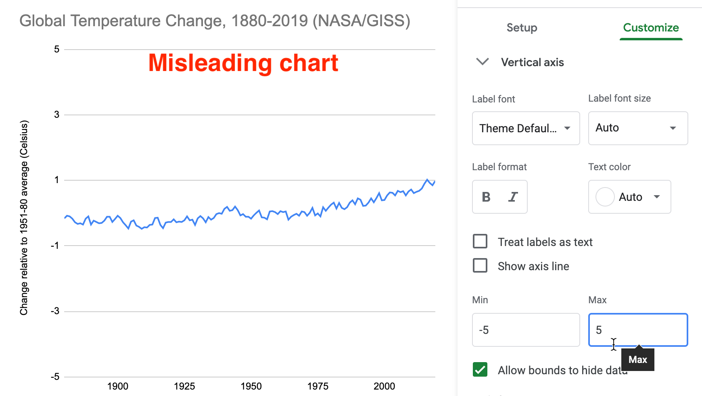
```

What makes this flattened line chart *misleading* rather than *wrong*? In the first half of the tutorial, when you reduced the vertical axis of the US GDP chart, you violated the zero-baseline rule, because column and bar charts *must* begin at zero since they require readers to judge *height* and *length*, as described in the [chart design section of Chapter 7](chart-design.html). But you may be surprised to learn that the zero-baseline rule does *not* apply to line charts. Visualization expert Albert Cairo reminds us that line charts represent values in the *position* and *angle* of the line. Readers interpret the meaning of line charts by their shape, rather than their height, so the baseline is irrelevant. Therefore, flattening the line chart for temperature change may mislead readers, but it's technically not wrong, as long as it is labelled correctly.^[@cairoHowChartsLie2019, p. 61.]

#### Widen the chart to warp its aspect ratio {-}
In your Google Sheet, click the chart and drag the sides to make it very short and wide, as shown in Figure \@ref(fig:temperature-aspect-annotated). Image measurements as listed in width by height, and we calculate the aspect ratio as width divided by height. Since the default chart is 600 x 370 pixels, its aspect ratio is about 1.6 to 1. But the stretched-out chart is 1090 x 191 pixels, and its ratio is about 5.7 to 1. By increasing the aspect ratio, you have flattened our perception of the rising line, and cancelled our climate crisis once again...but not really.

(ref:temperature-aspect-annotated) Misleading chart with a stretched aspect ratio.

```{r temperature-aspect-annotated, fig.cap="(ref:temperature-aspect-annotated)"}
 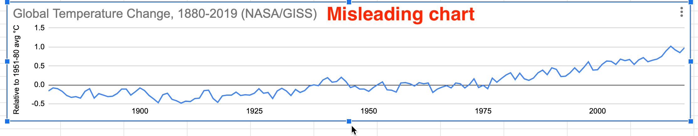
```

What makes this warped line chart *misleading* rather than *wrong*? Once again, since changing the aspect ratio of a line chart does not violate a clearly-defined rule of data visualization, it's not technically wrong, as long as it's accurately labeled. But it's definitely misleading. Cairo states that we should design charts with an aspect ratio that "neither exaggerates nor minimizes change." What specifically does he suggest? Cairo recommends, yet clearly states this "isn't a universal rule of chart design," that the percent change expressed in a chart should roughly match its aspect ratio. For example, if a chart represents a 33 percent increase, which is the same as 33/100 or 1/3, he recommends an aspect ratio of 3:1 (because the fraction is flipped by placing width before height), or in other words, a line chart that is three times wider than its height.^[@cairoHowChartsLie2019, p. 69.]

But Cairo does *not* propose his aspect ratio recommendation as a universal rule because he recognizes how it fails with very small or very large values. For example, if we apply Cairo's recommendation to our global temperature change chart, the difference between the lowest and highest values (-0.5° to 1°C) represents a 300% increase. In this case, we calculate the percent change using the lowest value of -0.5°C, rather than the initial value of 0°C, because dividing by zero is not defined, so `(1°C- -0.5°C) / |-0.5°C| = 3 = 300%`). Following Cairo's general recommendation, a 300% increase suggests a 1:3 aspect ratio, or a line chart three times taller than its width, as shown in Figure \@ref(fig:temperature-aspect-cairo). While this very tall chart is technically correct, it's *misleading* because it *exaggerates change*, which is contrary to Cairo's main message. The aspect ratio recommendation becomes ridiculous when we divide by numbers that are very close to zero.

(ref:temperature-aspect-cairo) Following Cairo's "recommendation" for a 300% increase results in a 1:3 aspect ratio that exaggerates change.

```{r temperature-aspect-cairo, fig.cap="(ref:temperature-aspect-cairo)"}
 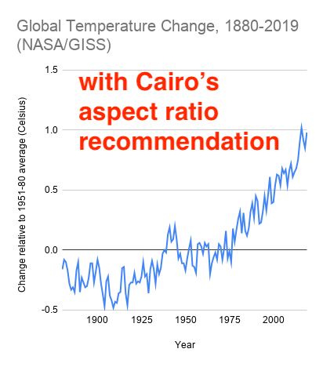
```

Cairo acknowledges that his aspect ratio recommendation also can result in *misleading* charts in the opposite way that *diminish change*. For example, instead of *global temperature change*, which increased from 0° to 1°C, imagine a chart that displays *global temperature*, which increased from about 13° to 14°C (or about 55° to 57°F) over time. Even though a 1°C difference in average global temperature may not *feel* very significant to our bodies, it has dramatic consequences for the Earth. We can calculate the percent change as: `(14°C - 13°C) / 13°C = 0.08 = 8% percent increase`, or about 1/12. This translates into a 12:1 aspect ratio, or a line chart that is twelve times wider than it is tall, as shown in Figure \@ref(fig:temperature2-aspect-cairo). Cairo warns that this significant global temperature increase looks "deceptively small," so he cautious against using his aspect ratio recommendation in all cases.^[@cairoHowChartsLie2019, p. 70.]

(ref:temperature2-aspect-cairo) Following Cairo's "recommendation" for an 8% increase results in a 12:1 aspect ratio that diminishes change.

```{r temperature2-aspect-cairo, fig.cap="(ref:temperature2-aspect-cairo)"}
 knitr::include_graphics("images/15-detect/temperature2-aspect-cairo-annotated.png")
```

Where does all of this leave us? If you feel confused, that's because data visualization has *no universal rule about aspect ratios*. What should you do? First, never automatically accept the default chart. Second, explore how different aspect ratios affect its appearance. Finally, even Cairo argues that you should use own judgment and ignore his recommendation in several cases, because there is no single rule about aspect ratio that fits all circumstances.

#### Add more data and a dual vertical axis {-}
Another common way to mislead is to add more data, such as a second data series that corresponds to a second vertical axis on the right side of a line chart. While it's technically possible to construct a dual-axis chart, we strongly advise against them because they can easily be manipulated to mislead readers. Let's illustrate how with an example that combines two prior datasets---global temperature change and US Gross Domestic Product---in one dual-axis chart. In the Google Sheet, go to the *temp+GDP* sheet, where you will see temperature change plus a new column: US Gross Domestic Product (GDP) in billions of dollars from 1929 to 2019, downloaded from the [US Federal Reserve](https://fred.stlouisfed.org/series/GDPA). To simplify this example, we deleted pre-1929 temperature data to match it up more neatly with available GDP data.

1. Select all three columns and *Insert > Chart* to produce a default line chart with two data series: temperature (in blue) and US GDP (in red).

2. In the *Chart editor*, select *Customize* and scroll down to *Series*. Change the drop-down menu from *Apply to all series* to *US GDP*. Just below that in the *Format* area, change the *Axis* menu from *Left axis* to *Right Axis*, which creates another vertical axis on the right side of the chart, connected only to the US GDP data, as shown in Figure \@ref(fig:temperature-gdp-axis-setup).

(ref:temperature-gdp-axis-setup) Add another vertical axis to the right side of the chart.

```{r temperature-gdp-axis-setup, fig.cap="(ref:temperature-gdp-axis-setup)"}
 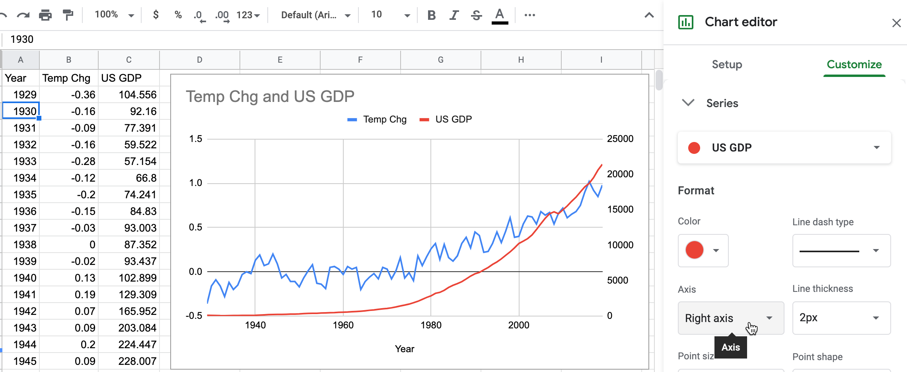
```

3. In the *Chart editor > Customize* tab, scroll down and you will now see separate controls for *Vertical Axis* (the left side, for temperature change only), and a brand-new menu for the *Right Axis* (for US GDP only), as shown in Figure \@ref(fig:temperature-right-axis).

(ref:temperature-right-axis) Brand-new menu for the right axis.

```{r temperature-right-axis, out.width=250, fig.cap="(ref:temperature-right-axis)"}
 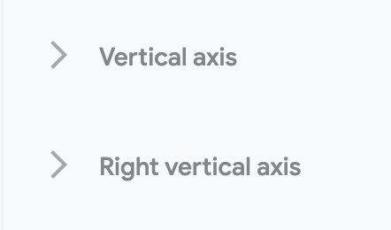
```

4. Finish your chart by adjusting *Vertical Axis* for temperature change, but with even more exaggeration than you did in step 5 above. This time, change the minimum value to 0 (to match the right-axis baseline for US GDP) and the maximum to 10, to flatten the temperature line even further. Add a title, source, and labels to make it look more authoritative, as shown in Figure \@ref(fig:temperature-gdp-final-annotated).

(ref:temperature-gdp-final-annotated) Misleading dual-axis chart of US GDP and global temperature change.

```{r temperature-gdp-final-annotated, fig.cap="(ref:temperature-gdp-final-annotated)"}
 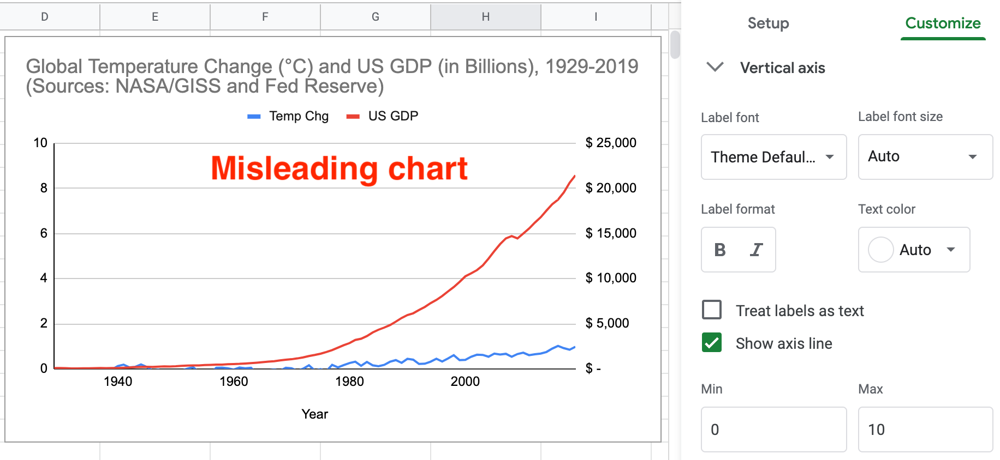
```

What makes this dual axis chart *misleading* rather than *wrong*? Once again, since it does not violate a clearly-defined visualization design rule, the chart is not wrong. But many visualization experts strongly advise against dual-axis charts because they confuse most readers, do not clearly show relationships between two variables, and sometimes lead to mischief. Although both axes begin at zero in Figure \@ref(fig:temperature-gdp-final-annotated), the left-side temperature scale has a top level of 10°C, which is unreasonable since the temperature line rises only 1°C. Therefore, by lowering our perception of the temperature line in comparison to the steadily rising GDP line, you've misled us into ignoring the consequences of climate change while we enjoy a long-term economic boom! Two additional issues also make this chart problematic. Since the GDP data is *not* adjusted for inflation, its misleads us by comparing 1929 dollars to 2019 dollars, a topic we warned about in [Chapter 6: Make Meaningful Comparisons](comparisons.html). Furthermore, by accepting default colors assigned by Google Sheets, the climate data is displayed in a "cool" blue, which sends our brain the opposite message of rising temperatures and glacial melt. To sum it up, this chart misleads in three ways: an unreasonable vertical axis, non-comparable data, and color choice.

What's a better alternative to a dual-axis line chart? If your goal is to visualize the relationship between two variables---global temperature and US GDP---then display them in a [scatter chart, as we introduced in chapter 7](scatter-bubble-datawrapper.html). We can make a more meaningful comparison by plotting [real US GDP](https://fred.stlouisfed.org/series/GDPCA), which has been adjusted into constant 2012 dollars, and entered alongside global temperature change [in this Google Sheet](https://docs.google.com/spreadsheets/d/1Npc7ozRjlsgRLLEV_B5zBvqyRqL6akE2qrEIGegHfGU/edit#gid=374640985). While a scatter chart does not show time in the same way as a line chart, float your cursor over points to see years in the [interactive version of the Datawrapper scatter chart](https://datawrapper.dwcdn.net/2Nhs9/) as shown in Figure \@ref(fig:real-gdp-temperature-scatter). Overall, the growth of the US economy is strongly associated with rising global temperature change from 1929 to the present. Furthermore, it's harder to mislead readers with a scatter chart because the axes are designed to display the full range of data, and our reading of the strength of the relationship is not tied to the aspect ratio.

(ref:real-gdp-temperature-scatter) Scatter chart of relationship between real US GDP and global temperature change from 1929 to 2019. Explore the [interactive version](https://datawrapper.dwcdn.net/2Nhs9/).

```{r real-gdp-temperature-scatter, fig.cap="(ref:real-gdp-temperature-scatter)"}
if(knitr::is_html_output(excludes="markdown")) knitr::include_url("https://datawrapper.dwcdn.net/2Nhs9/") else 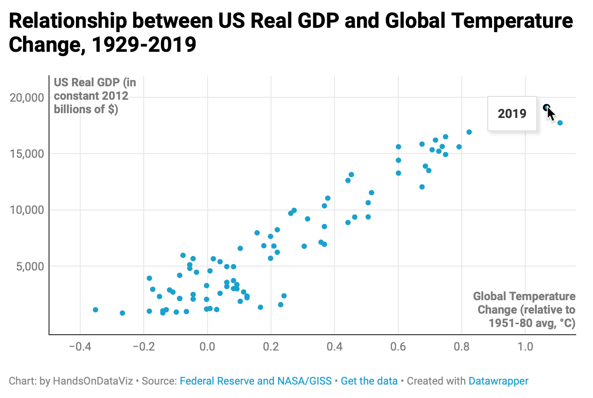
```

To sum up, in this tutorial we created several charts about global temperature change. None of them were technically wrong, only some were truthful, but most were unreasonably manipulated to fool readers by hiding or disguising important patterns in the data. We demonstrated several ways that charts can be designed to deceive readers, but did not exhaust all of the options. For example, see additional readings on ways to create three-dimensional charts and to tilt the reader's perspective below the baseline, which causes readers to misjudge the relative height of column or line charts.^[@cairoHowChartsLie2019, p. 58.]

You may feel frustrated that data visualization lacks clearly-defined design rules for many cases, like we are accustomed to reading in our math, science, or grammar textbooks. Instead, remember that the important visualization rule is a *three-step process*: never automatically accept the default, explore how different designs affect the appearance of your interpretation, and use your best judgement to tell true and meaningful data stories.

Now that you've learned about how to lie with charts, in the next section you'll build on these skills to lie with maps.

## How to Lie with Maps {- #how-to-lie-with-maps}
One of the best ways to learn how to detect lies is to intentionally manipulate a map, and tell two (or more) opposing stories with the same data. You’ll learn what to watch out for when viewing other people’s maps, and think more carefully about the ethical issues when you design your own. We'll focus our attention on choropleth maps that use shading or color to represent values in geographic areas, because they are a topic of considerable mischief. This exercise was inspired by geographer Mark Monmonier's classic book by the same name, *How to Lie with Maps*, originally published in 1991, now in its third edition.[@monmonierHowLieMaps2018]

Before we get started, review the [map design principles in Chapter 8](map-design.html) to avoid common mistakes when designing choropleth maps. For example, in most cases you should avoid mapping raw counts (such as the total number of people with a disease) and instead show relative rates (such as the percentage of people with a disease), because a raw count map would generally show that most people live in urban rather than rural areas. Also, this section assumes that you're already familiar with the steps for creating a [Choropleth map with Datawrapper in Chapter 8](choropleth-datawrapper.html).

Let's return to the two maps in the [Introduction](introduction.html) of this book, where we presented two different interpretations of world income inequality. In particular, Figure \@ref(fig:world-income-map1) colored the US in medium blue which suggested its level of inequality was similar to other nations, while Figure \@ref(fig:world-income-map2) made the US stand out in dark blue at the highest tier of inequality. We argued that both were *truthful* interpretations. You'll understand the concepts more clearly by following this hands-on tutorial to recreate both maps, plus one more. First, let's examine the data and upload it to Datawrapper to start making our choropleth maps.

1. Open the [world income top 1 percent data in Google Sheets](https://docs.google.com/spreadsheets/d/1IomO4pyGziTZnQrlSnlO11zqgdohwwTm2olR2-tGPfI/edit#gid=1463939565), and go to *File > Make a Copy* to create a version that you can edit in your own Google Drive.

2. Examine the data and read the notes. Overall, this data offers one way to make international comparisons about income distribution by showing "how big a slice of the pie" is held by the richest 1 percent in each nation. Each row lists a nation and its three-letter code, along with the percent share of pre-tax national income held by the top 1 percent of the population, and the most recent year when this data was collected by the World Inequality Database. For example, in Brazil, the top 1 percent of the population held 28.3 percent of the nation's income in 2015, while in the United States, the top 1 percent held 20.5 percent in 2018.

Note: To be clear, social scientists have developed many other ways to compare the distribution of income or wealth across nations, and this topic is beyond the scope of this book. In this tutorial we capture this complex concept using one easy-to-understand variable: percent share of pre-tax national income held by the top 1 percent of the population in each nation. 

3. Since we cannot directly import this Google Sheet into our Datawrapper mapping tool, go to *File > Download* to export the first tab in *CSV format* to your computer.

4. Open the [Datawrapper visualization tool](https://datawrapper.de) in your browser and upload your CSV map data.  Select *New Map*, select *Choropleth map*, and select *World*, then *Proceed*. In the *Add your data* screen, scroll down below the table and select the *Import your dataset* button, then the *Start Import* button, then *click here to upload a CSV file*, and upload the CSV file you created in the step above. Click to confirm that the first column is *Matched as ISO code*, click *Continue*, then click to confirm that the *Percent Share* column is *Matched as Values*, then click *Go* and *Proceed* to visualize your map.

5. In the *Visualize* screen, in the *Colors* section of the *Refine* tab *Select palette*, click the *wrench symbol* to open up the color settings, as shown in Figure \@ref(fig:map-color-settings). Let's skip past the light-green-to-blue color palette, which you can modify later, and let's focus on settings for color ranges.

(ref:map-color-settings) Click the *wrench symbol* to open the color settings.

```{r map-color-settings, out.width=350, fig.cap="(ref:map-color-settings)"}
 knitr::include_graphics("images/15-detect/map-color-settings.png")
```

### Modify the map color ranges {-}
While we never automatically accept the default visualization, it's a good place to begin. The default map displays a *continuous* type of range, with a *linear* interpolation of data values. This means that the map places all of the values in a straight line, from the minimum of 5% to the maximum of 31%, and assigns each value to a color along the gradient, as shown in Figure \@ref(fig:map-continuous-linear). Notice that the US (20.5%) blends in with a medium blue color, just above the midpoint in this range.

(ref:map-continuous-linear) Income inequality map with continuous range and linear interpolation. Explore the [interactive version](https://datawrapper.dwcdn.net/aetEM/).

```{r map-continuous-linear, fig.cap="(ref:map-continuous-linear)"}
if(knitr::is_html_output(excludes="markdown")) knitr::include_url("https://datawrapper.dwcdn.net/aetEM/", height="450px") else 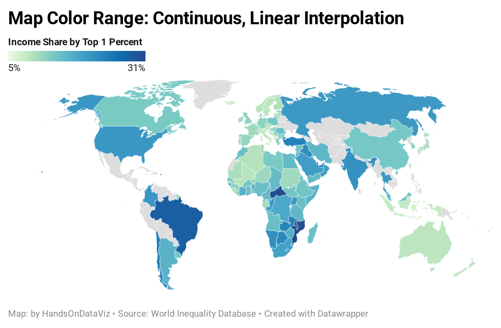
```

Create a second map with the same data but different settings. Change the *Type* setting to *steps*, and adjust to *3* steps, using *Natural breaks (Jenks)* interpolation, as shown in Figure \@ref(fig:map-3steps-naturalbreaks). This means that the map now places all of the values in three ascending groups. Natural breaks offers a compromise between using colors to highlight the outliers versus diversity inside the range. Notice that the US (still 20.5%) now stands out in a dark blue color at the top third of this range (19% or above).

(ref:map-3steps-naturalbreaks) Income inequality map with 3 steps and natural breaks interpolation. Explore the [interactive version](https://datawrapper.dwcdn.net/VSfdZ/).

```{r map-3steps-naturalbreaks, fig.cap="(ref:map-3steps-naturalbreaks)"}
if(knitr::is_html_output(excludes="markdown")) knitr::include_url("https://datawrapper.dwcdn.net/VSfdZ/", height="450px") else 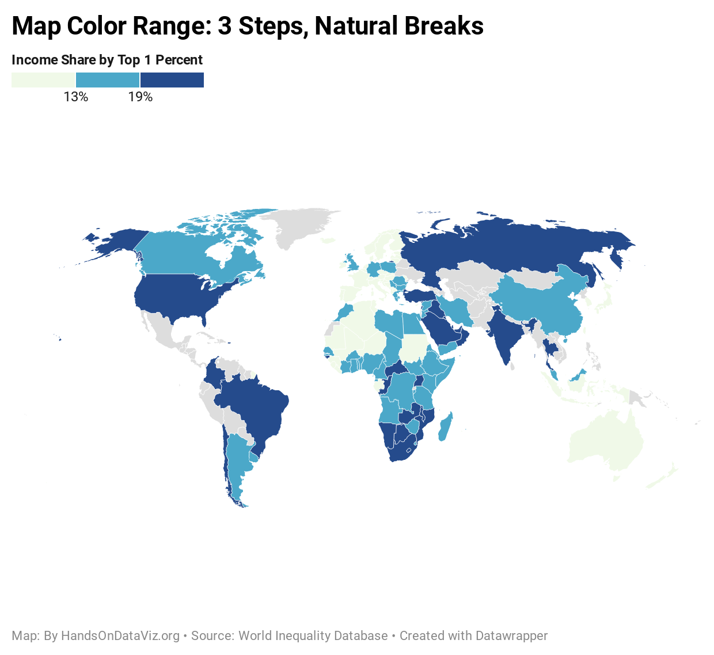
```

The first map portrays US income inequality to be similar to most nations, while the second map places the US at the higher end of the color scale. Which map is misleading? Which one is truthful? If you prefer clear and definitive rules in map design, this answer may frustrate you. Although the two maps generate very different impressions in our eyes, both maps present accurate data that is clearly labeled, based on reasonable and truthful interpretations of the data.

To understand what's happening behind the scenes with your choropleth map, visualization expert Alberto Cairo recommends creating a histogram to better understand the data distribution. Go back to the [data in the Google Sheet](https://docs.google.com/spreadsheets/d/1IomO4pyGziTZnQrlSnlO11zqgdohwwTm2olR2-tGPfI/edit#gid=1463939565) and create a [histogram, as we described in chapter 7](histogram-google.html) to view the frequency of nations when sorted by percent share into "buckets", as shown in Figure \@ref(fig:map-data-histogram). While most nations are clumped around the median, this is not a normal distribution curve, because a handful are outliers near the 30 percent mark. In the first map, which used continuous type and linear interpolation, the US appeared closer to the median and blended in with a medium blue. By contrast, the second map used 3 steps and natural breaks, which meant that the US appeared in the top range and stood out in dark blue.

(ref:map-data-histogram) Histogram of income inequality map data.

```{r map-data-histogram, fig.cap="(ref:map-data-histogram)"}
 knitr::include_graphics("images/15-detect/map-data-histogram-annotated.png")
```

So how *should* we make decisions when designing choropleth maps? Similar to the chart section, there are few universal rules, but several wise recommendations. First and foremost, always look for *better* ways to use map color ranges to show true and meaningful differences in the data, rather than hiding them out of sight. [Datawrapper Academy recommends](https://academy.datawrapper.de/article/117-color-palette-for-your-map) finding "a compromise between honesty and usefulness" when creating choropleth maps. In other words, tell the truth when displaying evidence *and* use design choices to emphasize an interpretation that calls our attention to what's most important in the data story. For example, a *linear* interpolation works best to emphasize extreme lows and highs, while *quantiles* or other non-linear groupings reveal more geographic diversity in the middle ranges. [Datawrapper Academy also recommends](https://academy.datawrapper.de/article/134-what-to-consider-when-creating-choropleth-maps) using a *continuous* color palette to show nuances in the data, unless your data story has a compelling reason to display discrete *steps* to emphasize regions above or below certain thresholds. If you choose steps, increasing the *number of steps* will display more contrast in your map, but *too many steps* can give the mistaken impression that light- and dark-colored regions are very different, when in fact their numbers may vary only slightly. Whatever you decide, avoid the temptation to manually adjust a map's settings in ways that manipulate its appearance to fit a preconceived point of view. In sum, show us a story and tell the truth. You may need to create several maps with different settings to decide which one is the best compromise.

Now that you have a clearer idea of how to lie with charts and maps, let's examine a related topic: recognizing and reducing data bias.

## Recognize and Reduce Data Bias {- #data-bias}
We define bias as unfairly favoring one view over another. When working with data and designing visualizations, it's important to be aware of different types of bias, so that you can recognize them as potential factors that may influence your perception, and reduce their presence in your own work. The first step toward reducing bias is to correctly identify various types, which at first glance may appear hidden, so that we can call them out. In this section we'll discuss four categories of bias that anyone who works with data needs to recognize: sampling biases, cognitive biases, algorithmic biases, and intergroup biases. In a later section we'll address other types of biases that are highly relevant to anyone working with map data.

We previously warned you about *sampling biases* in [Chapter 6: Make Meaningful Comparisons](comparisons.html). This category covers data collection procedures that seem legitimate on the surface, but include partially-hidden processes that skew the evidence and yield inaccurate results. One example is *selection bias*, which means that the sample selected for your study differs systematically from the larger population. "What you see depends on where you look," cautions professors Carol Bergstrom and Jevin West, authors of a book with an unforgettable title, *Calling Bullshit*.^[@bergstromCallingBullshitArt2020, pp. 79, 104-133] One obvious example is to attempting to find the average person's height by measuring people who happen to be leaving a gymnasium after basketball practice. More subtle forms involve *participation bias*, such as survey methods that do not yield responses that are representative of the broader population. We also cautioned about *self-selection bias* in program evaluation data, where participants who apply or volunteer must be analyzed carefully to avoid comparisons with non-participants. Always [question your data, as described in chapter 4](question.html), before you attempt to make meaningful comparisons. If you suspect that sampling issue may have snuck into the data collection process, either do not use the data, or clearly describe your concerns in your visualization notes and companion text to call out potential biases.

*Cognitive biases* refer to a category of human behaviors that skew how we interpret data. *Confirmation bias* is one example, which refers to the tendency to accept only claims that fit our preconceived notions of how the world works. *Pattern bias* is another example, where people tend to see meaningful relationships in data, even when numbers were randomly selected. Counter these biases by actively searching for alternative interpretations and considering contradictory findings with open eyes. Remind remind readers (and yourself) that data is noisy, and our brains are wired to see patterns even when none exist. See additional resources on statistical analysis mentioned in [chapter 6](comparisons.html) to learn about appropriate tests to determine whether patterns exist in your data at odds greater than chance.

TODO: FINISH REWRITE with transition....

Just as people can lie with charts and maps, let's not forget our long history of misleading audiences (and ourselves) with the word choices we make when describing data. *Framing bias* refers to negative or positive labels or conceptual categories that affect how we interpret information. For example, British statistician David Spiegelhalter notes that US hospitals tend to report *mortality rates*, while UK hospitals report *survival* rates. When weighing the risks of a surgical procedure for member of your family, a 5 percent mortality rate seems worse than a 95 percent survival rate, even though they're identical. Furthermore, Spiegelhalter observes that when we supplement rates with raw counts, it further increases our impression of risks. For example, if we told you a surgical procedure had a 5 percent mortality rate *and* that 20 out of 400 patients died, it seems worse because we begin to imagine real people's lives, not abstract percentages.^[@spiegelhalterArtStatisticsLearning2019, pp. 22-5] The best way to counter framing bias is to be aware of its potential effect on our minds and to call it out, as we've attempted to do here.


TODO: FINISH REWRITE....
Also beware of *algorithmic bias* that is built into our software, ranging from simple examples (such as web visitor IP addresses being converted into the nation's geographic center) and more dangerous ones (TODO EXAMPLE from Ch6)....
TODO INSERT AND EXPAND HERE? Also beware of *algorithmic bias* that people have built into our computer systems, which repeatedly favor some groups or outcomes over others, and often reinforce privileges held by dominant White, wealthy, masculine culture.... As we write this, several examples of algorithmic bias and machine-learning bias have appeared in the news.  facial recognition across racial groups, or discrimination in home lending. examples: https://www.nytimes.com/2019/08/20/upshot/housing-discrimination-algorithms-hud.html; https://www.brookings.edu/blog/techtank/2020/04/16/why-a-proposed-hud-rule-could-worsen-algorithm-driven-housing-discrimination/
Reduce bias by calling it out. Do not equate "digital" with "authoritative."
Cite more comprehensive books on this topic.


*Intergroup bias* refers to multiple ways that people privilege or discriminate by social categories, such as race, gender, class, sexuality, etc. In the wake of the Black Lives Matter movement, greater attention has been called to ways that intergroup bias pervades data visualization, and ways to counter its impact. Jonathan Schwabish and Alice Feng describe how they applied a racial equity lens to revise the [Urban Institute's Data Visualization Style Guide](http://urbaninstitute.github.io/graphics-styleguide/) with a racial equity lens.^[@schwabishApplyingRacialEquity2020. See also this web post summary of the paper, @schwabishApplyingRacialEquity2020a. @urbaninstituteUrbanInstituteData2020] Some recommendations are straightforward and relatively simple to implement. For example, they recommend ordering group labels to focus on the data story, rather than listing "White" and "Men" at the top by default. Also, we should proactively acknowledge missing groups in our data by calling attention to those often omitted, such as non-binary and transgender people in US federal datasets. Furthermore, when choosing color palettes to represent people in charts and maps, avoid stereotypical colors (such as blue for men and pink for women), and on a more subtle level, avoid color-grouping Black, Latino, and Asian people as the polar opposites of White people.

Other proposals by Schwabish and Feng are likely to generate more discussion and debate. For example, they recommend to stop placing disaggregated racial and ethnic data on the same chart, because it encourages a "deficit-based perspective" that judges lower-performing groups by the standards of higher-performing ones. Instead, they suggest plotting data about racial and ethnic groups on separate but adjacent charts, each with its own reference to state or national averages for comparison, as shown in Figure \@ref(fig:schwabish-placeholder). The idea is interesting, but the example about Covid-19 pandemic data raises more questions about whose interests are served by revising how data is visualized On one hand, if predominantly White audiences perceive racial disparities in Covid data to be caused by *group behavior*, then it makes sense to stop feeding racist stereotypes and no longer compare different groups in the same chart. On the other hand, if these racial disparities are caused in part by *structural obstacles* to quality jobs, housing, and health care, then do separate charts make it harder to identify and challenge the roots of systemic racism? Schwabish and Feng raise important issues for deeper reflection. Yet once again, data visualization is not always driven by clearly-defined design rules. Instead, our mission is to find *better* ways to tell true and meaningful data stories, while working to identify and reduce bias all around us.

(ref:schwabish-placeholder) Schwabish and Feng recommend to stop placing racial and ethnic data on the same chart (left), and replace it with separate but adjacent charts with state or national averages as a comparison point (right).

```{r schwabish-placeholder, out.width=700, fig.cap="(ref:schwabish-placeholder)"}
 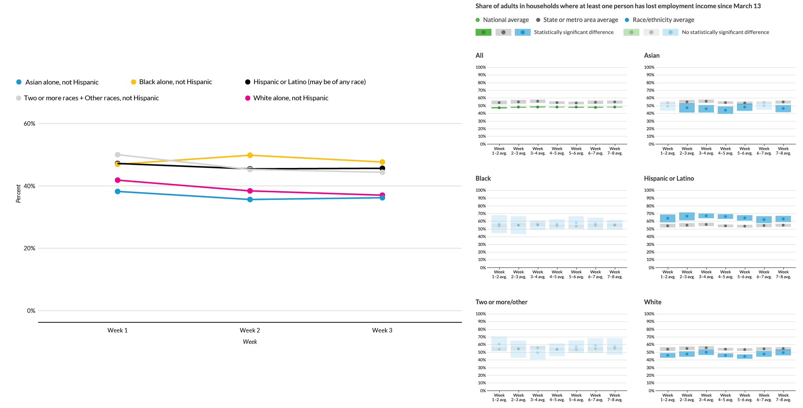
```

TODO above: DECIDE if description and critique of Schwabish and Feng is clear, interesting, and feasible with or without image (which probably would need to be redone and simplified).

Now that we've introduced various types of bias to consider when working with data visualization in general, in the next section we'll focus on two additional types of bias that are specific to mapping.

## Map Area and Projection Bias {-}
Two additional types of bias that are specific to spatial visualizations are *map area bias* and *projection bias*, and beware of both types when creating choropleth maps, as described earlier in this chapter. Map area bias refers to the tendency for our eyes to focus primarily on larger regions on a map, and less on smaller ones. This bias diverts our attention to *geographic area* rather than *population size*, which is usually the more relevant common denominator in choropleth maps. A classic example arises every four years during US presidential elections. Conventional maps of US electoral votes exaggerate the influence of rural states with larger geographic areas (such as spacious Wyoming with less than 600,000 people), and diminish the influence of urban states with small areas (such as tiny Rhode Island with over 1,000,000 people). Although Wyoming covers 80 times more area than Rhode Island, it currently has only 3 electoral votes, while Rhode Island has 4. Yet many people cannot make this distinction while looking at a conventional electoral map, because our eyes tend to focus on states with larger geographic areas.

A related problem is *projection bias*. In order to portray a three-dimensional globe on a flat surface, geographers have developed different projection systems, and some of these, such as Mercator maps, inflate the size of nations located further away from the equator, which mistakenly gives the appearance that many North American countries (such as the United States and Russia) are more important than those in Central Africa. [TODO: check wording and describe how the ubiquitous Google Maps WGS84 standard compares, which I believe is still a pseudo-Mercator system: https://en.wikipedia.org/wiki/Web_Mercator_projection]. For an interactive visual depiction of this issue, see http://googlemapsmania.blogspot.com/2020/09/how-map-projections-lie.html

Note: Also beware of *contested territory bias* in several popular digital map tile services. For example, Google Maps displays different borders and map data depending on the internet address of the user. If you look at location X from a computer in China, it will show AAA, but if you look at the same location from a computer in Taiwan, it will display BBB. [TODO: Find this cite and complete the example]

One solution to both the map area and projection bias problem is to replace conventional map outlines with *cartograms* (sometimes called *population square* or *hexagon* maps). Cartograms display geographic regions by relative population size, rather than total area, and also do not rely on a projection system. One drawback is that cartograms require readers to recognize abstract shapes in place of familiar boundaries, since these population-based visualizations do not align perfectly with conventional geography-based maps, as shown in Figure \@ref(fig:cartogram-placeholder).

(ref:cartogram-placeholder) PLACEHOLDER: Conventional US map (left) versus cartogram (right) of US 2016 electoral vote.

```{r cartogram-placeholder, fig.cap="(ref:cartogram-placeholder)"}
 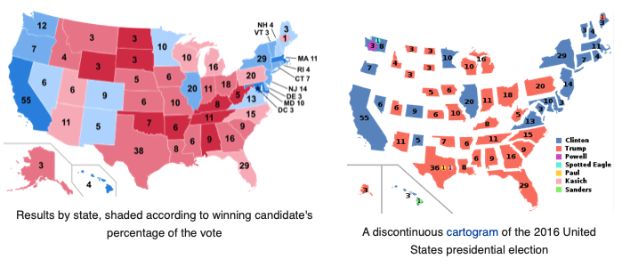
```

TODO: Update maps above using 2020 election data in November? Use cartogram/hexagon from Datawrapper on right. TODO above: determine if cartograms and pop squares are interchangeable terms, or if they have different definitions.

In the [How to Lie with Maps section of this chapter](how-to-lie-with-maps.html), we created choropleth maps of world inequality data in Datawrapper. To convert one from a conventional world map to a population square map, follow this tutorial:

1. To modify an existing world inequality map that you may have saved in your Datawrapper account, go to *My Charts*, select and right-click on the map to make a duplicate, and edit it. Or follow the steps in the previous section to create a new map.

2. Go to the *Select your map* screen, and type "squares" to see all of those available types (including World population squares). Similarly, type "hexagons" to see all of the cartograms available (including US States). Select your preferred map, and proceed to visualize the data in the same way as other Datawrapper choropleth maps, as shown in Figure \@ref(fig:map-world-pop-square).

(ref:map-world-pop-square) World population square map with income inequality data. Explore the [interactive version](https://datawrapper.dwcdn.net/YfNDe/).

```{r map-world-pop-square, fig.cap="(ref:map-world-pop-square)"}
if(knitr::is_html_output(excludes="markdown")) knitr::include_url("https://datawrapper.dwcdn.net/YfNDe/", height="600px") else 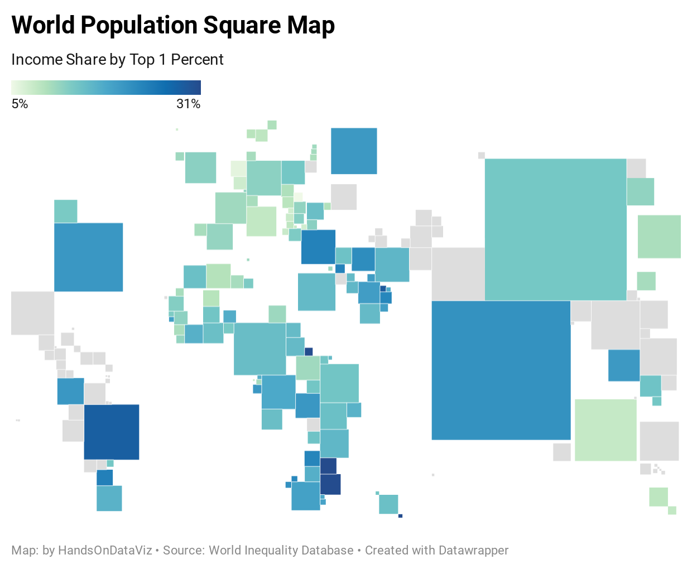
```

### The US States bias {-}
When working with data about the United States, consider the additional *framing bias* and *intergroup bias* that frequently causes visualizations to omit over 4 million US citizens. Does your data include the District of Columbia, which is not counted as a state, and whose 700,000 residents (more than Wyoming), a majority of whom are African-American, have no voting representation in the US Congress? Similarly, how does your data represent Puerto Rico, a US territory with over 3 million residents who are US citizens, mostly Spanish-speaking, but have no voting representation in Congress and no electoral votes? How about other US territories such as the US Virgin Islands, Guam, the Northern Mariana Islands, and American Samoa?

Furthermore, what happens when you create a map of the United States? If your data does include residents of District of Columbia, Puerto Rico, or other US territories, what happens when you try to map it? Do these people become visible---or vanish? Most likely the answer depends on the default settings of your mapping tool, and the geographic outlines it uploads when you select "United States." If the default setting includes only the 50 US states---even when you have data on DC or US territories---those 4 million US citizens will disappear from the map. And if you cannot easily find a way to map their data, call out the US States bias by describing the omission in the map notes and companion text. Whenever possible, include people of "the United States" rather than ignoring their existence. Tell true and meaningful stories.

TODO: Datawrapper kindly responded to our request for USA » States and Territories map codes and USA » States and Territories (hexagons), so update text and add example to show this.

### Summary {- #summary15}
TODO
