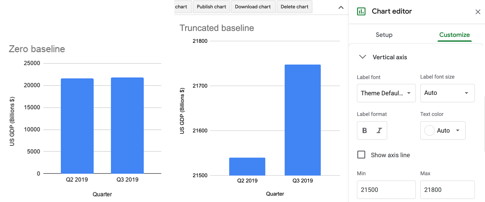

# Detect Lies and Reduce Data Bias {#detect}
The goal of data visualization is to encode information into images that capture true and insightful stories. But we've warned you to watch out for people who lie with charts and maps. In fact, in the [Introduction](introduction.html) we intentionally manipulated visualizations about income inequality to demonstrate how the same data can be rearranged to paint very different pictures of reality. Does that mean all data visualizations are right? Definitely not. On closer examination, we declared that one of the two charts about US income inequality to be *misleading* because it intentionally used an inappropriate scale to hide the truth. But we also confided that the two world maps were *equally truthful*, even though the US appeared in a darker color (signaling a higher level of inequality) than the other.

How can two different visualizations be equally right? Our response may conflict with those who prefer to call their work *data science*, a label that suggests an objective world with only one right answer. Instead, we argue that data visualization is best understood as *interpretative skill* that still depends on evidence, but more than one portrayal of reality may be valid. As you recall, our field has only a few definitive rules about how *not* to visualize data, which we introduced in [Chapter 7 on chart design](chart-design.html) and [Chapter 8 on map design](map-design.html). Rather than a binary world, we argue that visualizations fall into three categories.

First, visualizations may be *wrong* because they violate one of these firm rules [TODO ADD: or they clearly misstate the evidence]. For example, if a bar or column chart begins at a number other than zero, we say it's *wrong* because those types of charts represent values through *length* or *height*, which readers cannot determine if the baseline has been truncated. Also, if the slices of a pie chart adds up to more than 100 percent, we declare it to be *wrong* because that violates the fundamental design rules.

Second, visualizations may be *misleading* if they technically follow the design rules, yet unreasonably hide or twist the appearance of relevant data. We acknowledge that the word "unreasonably" can be subject to debate here. But the category is essential to point out how charts and map can follow the rules, yet misdirect readers, and you'll see many examples in this chapter.

Third, visualizations may be *truthful* if they follow the design rules and provide insightful interpretations of the data. This is our goal, but we acknowledge that there's a wide spectrum within this category. Sometimes when looking at two valid interpretations, we say that one is *better* than the other because it illuminates meaningful patterns that we did not yet recognize in the data. Or perhaps one is better because it portrays these patterns more beautifully than other visualizations.

In this chapter, you'll learn to sort out differences between the three categories. The best way to improve your lie detector skills is through hands-on tutorials in the art of data deception, to better understand [how to lie with charts](how-to-lie-with-charts.html) and [how to lie with maps](how-to-lie-with-maps.html). As the saying goes, it takes a thief to catch a thief. Learning *how to lie* not only make it harder for people to mislead you, but also educates you more deeply about the ethical decisions we make when designing visualizations that *tell the truth*, while recognizing there's more than one path to that destination. Also, just like we can be wrong, misleading, or truthful with our data, the same concepts apply to language, as we'll discuss in a similar section on [how to lie with words](how-to-lie-with-words.html). Finally, we'll reflect on ways to [recognize and reduce data bias](data-bias.html), such as privileged majority bias that has historically favored Whites, men, and other groups, as well as other types. While we may not be able to stop bias entirely, in this chapter you'll learn ways to identify it and strategies for reducing it our own visualizations.^[The "how to lie" tutorials were inspired by several excellent works in data visualization: @cairoTruthfulArtData2016; @cairoHowChartsLie2019; @huffHowLieStatistics1954; @monmonierHowLieMaps2018; @yauHowSpotVisualization2017; @nasajplEducatorGuideGraphing2017]

## How to Lie with Charts {- #how-to-lie-with-charts}
In this section, you'll learn how to avoid being fooled by misleading charts, and also how to make your own charts more honest, by intentionally manipulating the same data to tell opposing stories. In the first half, you will *exaggerate* small differences in a column chart to make them seem larger. In the second, half, you will *diminish* the rate of growth in a line chart to make it appear more gradual. Together, these tutorials will teach you to watch out for key details when reading other people's charts, such as the vertical axis and aspect ratio. Paradoxically, by demonstrating *how to lie*, our goal is to teach you to *tell the truth* and to think more carefully about the ethics of designing your data stories.

In the first half of this tutorial, we'll examine data about the economy, a topic that's often twisted by politicians to portray it more favorably for their perspective. The Gross Domestic Product (GDP) measures the market value of the final goods and services produced in a nation, which many economists consider to be the primary indicator of economic health. (Interestingly, not everyone agrees because GDP does not count unpaid household labor such as caring for one's children, nor does it consider the distribution of wealth across a nation's population.) We downloaded US GDP data from the [US Federal Reserve open-data repository](https://fred.stlouisfed.org/series/GDP), which is measured in billions of dollars and published quarterly, with seasonal adjustments to allow for better comparisons across industries that vary during the year, such as summer-time farming and tourism versus Christmas-time gift shopping. Your task is create a *misleading* column chart that *exaggerates* small differences to make them appear larger in the reader's eye.

1. Open the [US GDP mid-2019 data in Google Sheets](https://docs.google.com/spreadsheets/d/1teB2Pw2lNpFjE_GCNmeqVNURSid36IMrWUROpPZMScA/edit#gid=0), and go to *File > Save As* to create a copy that you can edit in your own Google Drive. We'll create charts in Google Sheets, but you can also download the data to use in a different chart tool if you prefer.

2. Examine the data and read the notes. To simplify this example, we show only two figures: the US GDP for the 2nd quarter (April-June) and the 3rd quarter (July-September) in 2019. The 2nd quarter was about $21.5 trillion, and the third quarter was slightly higher at $21.7 trillion. TODO: DECIDE whether to add this: If we calculated the percent change, or (21747 - 21540)/21540 = 0.0096 = 0.96%, that's a growth rate of just under 1 percent.

3. Create a Google Sheets column chart in the same sheet using the *default* settings, although we never automatically accept them as the best representation of the truth. In the *data* tab, select the two columns, and go to *Insert > Chart*, as you learned when we introduced [charts with Google Sheets in Chapter 7](chart-google.html). The tool should recognize your data and automatically produce a column chart, as shown in the left side of Figure \@ref(fig:gdp-baseline-merged). In this default view, with the zero baseline for the vertical axis, the difference between $21.5 versus $21.7 trillion looks relatively small to the reader.

4. *Reduce the vertical axis.* Click on the three-dot kebab menu to open the *Chart editor* and select the *Customize* tab. Scroll down to the vertical axis settings, and change the minimum to 21500 and the maximum to 21800, as shown in the right side of Figure \@ref(fig:gdp-baseline-merged). Although the data remains the same, those small differences now appear much larger in our eyes because you've manipulated the vertical scale. Only people who read charts closely will notice this trick. The political candidate who's campaigning on rising economic growth will thank you!

(ref:gdp-baseline-merged) The default GDP line chart on the left, and the reduced-axis chart on the right.

```{r gdp-baseline-merged, out.width=750, fig.cap="(ref:gdp-baseline-merged)"}
 
```

TODO: Placed images above side-by-side to allow for easier comparison. Rethink if "zero baseline" and "truncated baseline" are best titles.

However, your chart is clearly *wrong* because you've violated one of the [cardinal rules about chart design in Chapter 7](chart-design.html). Column (and bar) charts *must* start at the zero baseline, because they represent value using *height* (and *length*). Readers cannot determine if a column is twice as high as another column unless both begin at the zero baseline. By contrast, the default chart with the zero baseline is truthful. But let's move on to a different example where the rules are not as clear.

In the second half of this tutorial, we'll examine data about climate change, one of the most pressing issues we face on our planet, yet deniers continue to resist the new reality, and some of them twist the facts.[TODO: Cite Cairo examples]. In this tutorial, we'll examine global temperature data from 1880 to the present, [downloaded from the NASA, the US National Aeronautics and Space Administration](https://climate.nasa.gov/vital-signs/global-temperature/). It shows that the mean global temperature has risen about 1 degree Celsius (or about 2 degrees Fahrenheit) during the past fifty years, and this warming has already begun to cause glacial melt and rising sea levels. Your task is to create *misleading* line charts that *diminish* the appearance of rising global temperature change in the reader's eye.^[The inspiration for this specific tutorial came from a high school classroom activity created by the NASA Jet Propulsion Laboratory (JPL), as well as visualization expert Alberto Cairo's analysis of charts by climate change deniers. @nasajplEducatorGuideGraphing2017; @cairoHowChartsLie2019, pp. 65-67, 135-141.]

1. Open the [global temperature change 1880-2019 data in Google Sheets](https://docs.google.com/spreadsheets/d/1Npc7ozRjlsgRLLEV_B5zBvqyRqL6akE2qrEIGegHfGU/edit#gid=0), and go to *File > Save As* to create a copy that you can edit in your own Google Drive.

2. Examine the data and read the notes. Temperature change refers to the mean global land-ocean surface temperature in degrees Celsius, estimated from many samples around the earth, relative to the temperature in 1951-1980, about 14°C (or 57°F). In other words, the 0.98 value for 2019 means that global temperatures were about 1°C above normal that year. Scientists define the 1951-80 period as "normal" based on standards from NASA and the US National Weather Service, and also because it's a familiar reference for many of today's adults who grew up during those decades. While there's other ways to measure temperature change, this data from NASA's Goddard Institute for Space Studies (NASA/GISS) is generally consistent with data compiled by other scientists at the [Climatic Research Unit](http://www.cru.uea.ac.uk/) and the [National Oceanic and Atmospheric Administration](https://www.ncdc.noaa.gov/cag/global/time-series) (NOAA).

3. Create a Google Sheets line chart in the *data* tab by selecting the two columns in the *data* tab, then *Insert > Chart*. The tool should recognize your time-series data and produce a *default* line chart, though we never automatically accept it as the best representation of the truth. Click on the three-dot kebab menu to open the *Chart editor* and select the *Customize* tab. Add a better title and vertical axis label, using the notes to clarify the source and how temperature change is measured, as shown in Figure \@ref(fig:temperature-default).

(ref:temperature-default) Default line chart of global temperature change. Explore the [interactive version](https://docs.google.com/spreadsheets/d/e/2PACX-1vRBJy0vWBN1z49hE8c7vxF_ZiTNKF5RjQ2vpJ-aVfsdNpNYgcMu1cH2zAh90v713vcMmrs6kVlSgQkV/pubchart?oid=557710802&format=interactive).

```{r temperature-default, fig.cap="(ref:temperature-default)"}
if(knitr::is_html_output(excludes="markdown")) knitr::include_url("https://docs.google.com/spreadsheets/d/e/2PACX-1vRBJy0vWBN1z49hE8c7vxF_ZiTNKF5RjQ2vpJ-aVfsdNpNYgcMu1cH2zAh90v713vcMmrs6kVlSgQkV/pubchart?oid=557710802&amp;format=interactive") else knitr::include_graphics("images/15-detect/temperature-default.png")
```

Now let's create three more charts using the same data but different methods, and discuss why they are *not wrong* from a technical perspective, but nevertheless *very misleading*.

### Lengthen the vertical axis to flatten the line {-}
We'll use the same method as shown in the first half of this tutorial, but in the opposite direction. In the Google Sheets chart editor, customize the vertical axis by changing the minimum value to negative 5 and the maximum to positive 5, as shown in Figure \@ref(fig:temperature-axis-annotated). By increasing the length of the vertical scale, you flattened our perception of the rising line, and cancelled our climate emergency...but not really.

(ref:temperature-axis-annotated) Misleading chart with a lengthened vertical axis.

```{r temperature-axis-annotated, fig.cap="(ref:temperature-axis-annotated)"}
 knitr::include_graphics("images/15-detect/temperature-axis-annotated.png")
```

What makes this flattened line chart *misleading* rather than *wrong*? In the first half of the tutorial, when you reduced the vertical axis of the US GDP chart, you violated the zero-baseline rule, because column and bar charts *must* begin at zero since they require readers to judge *height* and *length*, as described in the [chart design section of Chapter 7](chart-design.html). But you may be surprised to learn that the zero-baseline rule does *not* apply to line charts. Visualization expert Albert Cairo reminds us that line charts represent values in the *position* and *angle* of the line. Readers interpret the meaning of line charts by their shape, rather than their height, so the baseline is irrelevant. Therefore, flattening the line chart for temperature change may mislead readers, but it's technically not wrong, as long as it is labelled correctly.^[@cairoHowChartsLie2019, p. 61.]

TODO: While the text asks "wrong or misleading?" the chart and caption are clearly labeled "misleading" to avoid confusion among readers who just skim the text. Maybe rephrase the question: What makes this chart

### Widen the chart to warp its aspect ratio {-}
In your Google Sheet, click the chart and drag the sides to make it very short and wide, as shown in Figure \@ref(fig:temperature-aspect-annotated). Image measurements as listed in width by height, and we calculate the aspect ratio as width divided by height. Since the default chart is 600 x 370 pixels, its aspect ratio is about 1.6 to 1. But the stretched-out chart is 1090 x 191 pixels, and its ratio is about 5.7 to 1. By increasing the aspect ratio, you have flattened our perception of the rising line, and cancelled our climate crisis once again...but not really.

(ref:temperature-aspect-annotated) Misleading chart with a stretched aspect ratio.

```{r temperature-aspect-annotated, fig.cap="(ref:temperature-aspect-annotated)"}
 knitr::include_graphics("images/15-detect/temperature-aspect-annotated.png")
```

What makes this warped line chart *misleading* rather than *wrong*? Once again, since changing the aspect ratio of a line chart does not violate a clearly-defined rule of data visualization, it's not technically wrong, as long as it's accurately labeled. But it's definitely misleading. This is a case of designer preference. Alberto Cairo prefers to set the aspect ratio to be similar to the rate of change shown in the line chart....[TODO describe and cite passage about this... but it's not a clearly-defined rule, as publications often require visualizations to fit into specific spaces....]

### Add more data and a dual vertical axis {-}
Let's add more data to make your chart even more misleading! In the Google Sheet, go to the tab named *temp+GDP*, where you will see temperature change plus a new column: US Gross Domestic Product (GDP) in billions of dollars from 1929 to 2019, downloaded from the [US Federal Reserve](https://fred.stlouisfed.org/series/GDPA). We deleted temperature rows prior to 1929 to make them match with available GDP data.

1. Select all three columns and *Insert > Chart* to produce a default line chart with two data series: temperature (in blue) and US GDP (in red).

2. In the *Chart editor*, select *Customize* and scroll down to *Series*. Change the drop-down menu from *Apply to all series* to *US GDP*. Just below that in the *Format* area, change the *Axis* menu from *Left axis* to *Right Axis*, which creates another vertical axis on the right side of the chart, connected only to the US GDP data, as shown in Figure \@ref(fig:temperature-gdp-axis-setup).

(ref:temperature-gdp-axis-setup) Add another vertical axis to the right side of the chart.

```{r temperature-gdp-axis-setup, fig.cap="(ref:temperature-gdp-axis-setup)"}
 knitr::include_graphics("images/15-detect/temperature-gdp-axis-setup.png")
```

3. In the *Chart editor > Customize* tab, scroll down and you will now see separate controls for *Vertical Axis* (the left side, for temperature change only), and a brand-new menu for the *Right Axis* (for US GDP only), as shown in Figure \@ref(fig:temperature-right-axis).

(ref:temperature-right-axis) Brand-new menu for the right axis.

```{r temperature-right-axis, out.width=250, fig.cap="(ref:temperature-right-axis)"}
 knitr::include_graphics("images/15-detect/temperature-right-axis.png")
```

4. Finish your chart by adjusting *Vertical Axis* for temperature change, but with even more exaggeration than you did in step 5 above. This time, change the minimum value to 0 (to match the right-axis baseline for US GDP) and the maximum to 10, to flatten the temperature line even further. Add a title, source, and labels to make it look more authoritative, as shown in Figure \@ref(fig:temperature-gdp-final-annotated). By lowering our perception of the temperature line in comparison to the steadily rising GDP line, you've misled us into ignoring the consequences of climate change while we enjoy a long-term economic boom! Furthermore, the GDP data is *not* adjusted for inflation, so you've double-misled us by comparing 1929 dollars to 2019 dollars. Finally, since you accepted the default colors assigned by Google Sheets, the climate data is displayed in a "cool" blue, which sends our brain the opposite message of rising temperatures and glacial melt. So we'll count this as a triple! TODO: Decide whether to break non-comparable data and color into separate paragraphs.

(ref:temperature-gdp-final-annotated) Misleading dual-axis chart of US GDP and global temperature change.

```{r temperature-gdp-final-annotated, fig.cap="(ref:temperature-gdp-final-annotated)"}
 knitr::include_graphics("images/15-detect/temperature-gdp-final-annotated.png")
```

Is this dual axis chart *misleading* rather than *wrong*? Once again, since it does not violate a clearly-defined visualization design rule, the chart is not wrong, but very misleading. In fact, many visualization experts strongly discourage using dual-axis charts because they confuse most readers and create mischief. Even though both axes began at zero, the left-side temperature scale has a top level of 10 degrees Celsius, which is not reasonable given the context of the data. [TODO: ADD THIS? Perhaps a better way to plot global temperature change and US GDP over time would be a scatter or bubble chart, which are designed to compare two or more variables. TODO: Should we show a scatter of this here?] Furthermore, a better chart would compare appropriate data, such as real GDP that has been adjusted into constant dollars.

To sum up, in this tutorial you created four charts about global temperature change. None of them were technically wrong, but only the default chart was truthful, while the other three charts were unreasonably manipulated to mislead readers by hiding relevant patterns in the data. Although we never accept automatically accept the default chart generated by a visualization tool, in this case it was the best representation of the truth among the four candidates.

TODO: FINISH There are many other ways to lie with charts.... for example, lie with 3D and perspective (see Cairo 2019 p58)...
Now that you've learned about how to lie with charts, you'll build on these skills in the next section about lying with maps.

## How to Lie with Maps {- #how-to-lie-with-maps}
One of the best ways to learn how to detect lies is to intentionally manipulate a map, and tell two (or more) opposing stories with the same data. You’ll learn what to watch out for when viewing other people’s maps, and think more carefully about the ethical issues when you design your own. We'll focus our attention on choropleth maps that use shading or color to represent values in geographic areas, because they are a topic of considerable mischief. This exercise was inspired by geographer Mark Monmonier's classic book by the same name, *How to Lie with Maps*, originally published in 1991, now in its third edition.[@monmonierHowLieMaps2018]

Before we get started, review the [map design principles in Chapter 8](map-design.html) to avoid common mistakes when designing colored polygon (or choropleth) maps. For example, in most cases you want to avoid mapping absolute numbers (such as the total number of people in a group), and instead show relative data (such as the percentage of people in a group). Mapping absolute numbers of voters would simply show you where most people live, rather than how rates vary across geographic areas, which is usually what map makers wish to emphasize. Also, this section assumes that you're already familiar with the steps for creating a [Colored Polygon or Choropleth map with Datawrapper in Chapter 8](map-datawrapper.html).

Let's return to the two maps in the [Introduction](introduction.html) of this book, which presented two different interpretations of world income inequality. In particular, the first map colored the US in medium blue which suggested its level of inequality was similar to other nations, while the second map made the US stand out in dark blue at the highest tier of inequality. We argued that both were *truthful* interpretations. You'll understand the concepts more clearly by follow this hands-on tutorial to recreate both maps, plus one more. First, let's examine the data and upload it to Datawrapper to start making our choropleth maps.

1. Open the [world income top 1 percent data in Google Sheets](https://docs.google.com/spreadsheets/d/1IomO4pyGziTZnQrlSnlO11zqgdohwwTm2olR2-tGPfI/edit#gid=1463939565), and go to *File > Save As* to create a copy that you can edit in your own Google Drive.

2. Examine the data and read the notes. Overall, this data offers one way to make international comparisons about income distribution by showing "how big a slice of the pie" is held by the richest 1 percent in each nation. Each row lists a nation and its three-letter code, along with the percent share of pre-tax national income held by the top 1 percent of the population, and the most recent year when this data was collected by the World Inequality Database. For example, in Brazil, the top 1 percent of the population held 28.3 percent of the nation's income in 2015, while in the United States, the top 1 percent held 20.5 percent in 2018. To be clear, there are other ways to compare the distribution of income or wealth across nations, but this is one of the better datasets available that capture this concept using one easy-to-understand variable.

3. Since we cannot directly import this Google Sheet into our Datawrapper mapping tool, go to *File > Download* to export the first tab in *CSV format* to your computer.

4. Open the [Datawrapper visualization tool](https://datawrapper.de) in your browser and upload your CSV map data.  Select *New Map*, select *Choropleth map*, and select *World*, then *Proceed*. In the *Add your data* screen, scroll down below the table and select the *Import your dataset* button, then the *Start Import* button, then *click here to upload a CSV file*, and upload the CSV file you created in the step above. Click to confirm that the first column is *Matched as ISO code*, click *Continue*, then click to confirm that the *Percent Share* column is *Matched as Values*, then click *Go* and *Proceed* to visualize your map.

5. In the *Visualize* screen, in the *Colors* section of the *Refine* tab *Select palette*, click the *wrench symbol* to open up the color settings, as shown in Figure \@ref(fig:map-color-settings). Let's skip past the light-green-to-blue color palette, which you can modify later, and let's focus on settings for color ranges.

(ref:map-color-settings) Click the *wrench symbol* to open the color settings.

```{r map-color-settings, out.width=350, fig.cap="(ref:map-color-settings)"}
 knitr::include_graphics("images/15-detect/map-color-settings.png")
```

### Modify the map color ranges {-}
While we never automatically accept the default visualization, it's a good place to begin. The default map displays a *continuous* type of range, with a *linear* interpolation of data values. This means that the map places all of the values in a straight line, from the minimum of 5% to the maximum of 31%, and assigns each value to a color along the gradient, as shown in Figure \@ref(fig:map-continuous-linear). Notice that the US (20.5%) blends in with a medium blue color, just above the midpoint in this range.

(ref:map-continuous-linear) Income inequality map with continuous range and linear interpolation. Explore the [interactive version](https://datawrapper.dwcdn.net/aetEM/).

```{r map-continuous-linear, fig.cap="(ref:map-continuous-linear)"}
if(knitr::is_html_output(excludes="markdown")) knitr::include_url("https://datawrapper.dwcdn.net/aetEM/", height="450px") else knitr::include_graphics("images/15-detect/map-continuous-linear.png")
```

Create a second map with the same data but different settings. Change the *Type* setting to *steps*, and adjust to *3* steps, using *Natural breaks (Jenks)* interpolation, as shown in Figure \@ref(fig:map-3steps-naturalbreaks). This means that the map now places all of the values in three ascending groups. Natural breaks offers a compromise between using colors to highlight the outliers versus diversity inside the range. Notice that the US (still 20.5%) now stands out in a dark blue color at the top third of this range (19% or above).

(ref:map-3steps-naturalbreaks) Income inequality map with 3 steps and natural breaks interpolation. Explore the [interactive version](https://datawrapper.dwcdn.net/VSfdZ/).

```{r map-3steps-naturalbreaks, fig.cap="(ref:map-3steps-naturalbreaks)"}
if(knitr::is_html_output(excludes="markdown")) knitr::include_url("https://datawrapper.dwcdn.net/VSfdZ/", height="450px") else knitr::include_graphics("images/15-detect/map-3steps-naturalbreaks.png")
```

The first map portrays US income inequality to be similar to most nations, while the second map places the US at the higher end of the color scale. Which map is misleading? Which one is truthful? If you prefer clear and definitive rules in map design, this answer may frustrate you. Although the two maps generate very different impressions in our eyes, both maps offer reasonable and truthful interpretations of the data.

To understand what's happening behind the scenes with your choropleth map, visualization expert Alberto Cairo recommends creating a histogram to better understand the data distribution. [Cite Cairo; add that he recommends multiple histograms with different bucket sizes?] Go back to the original Google Sheet [link again?] and create a [histogram, as we described in chapter 7](chart-histogram.html) to view the frequency of nations when sorted into "buckets" by percent share, as shown in Figure \@ref(fig:map-data-histogram). This is not a normal distribution curve, because a handful of nations are outliers around the 30 percent mark. In the first map, which used continuous type and linear interpolation, the US appears closer to the midpoint of the range and blended in with a medium blue. In the second map, which used 3 steps and natural breaks, the US appears in the top range was stood out with a dark blue. Since both maps are consistently labeled...(more?), there is no definitive answer that makes one map more correct than the other. [TODO: check wording]

(ref:map-data-histogram) Histogram of income inequality map data.

```{r map-data-histogram, fig.cap="(ref:map-data-histogram)"}
 knitr::include_graphics("images/15-detect/map-data-histogram.png")
```

So how *should* you make decisions when designing choropleth maps? Can you simply place the cutoffs anywhere you choose? Absolutely not. Mapmakers offer guidelines about ways to make *better* visualizations. For example, Datawrapper Academy recommends finding "a compromise between honesty and usefulness" when designing maps [TODO cite https://academy.datawrapper.de/article/117-color-palette-for-your-map]. "Useful" means that it's acceptable to use design choices to communicate different interpretations of the data. For example, a linear interpolation is best for emphasizing the extreme lows and highs, while quantiles are best for identifying geographic patterns in the middle ranges. "Honesty" means telling the truth, and not intentionally creating misleading impressions of the data. For example, increasing the number of steps in your color range will increase the level of contrast in the map, but it can also mistakenly give the impression that light- and dark-colored regions are very different, while their numbers may vary only slightly. In general, Datawrapper recommends choosing ranges to make sure readers "see all the differences in the data," rather than hiding them out of sight.[TODO cite https://academy.datawrapper.de/article/134-what-to-consider-when-creating-choropleth-maps] They also recommend using a continuous color range to show nuances in the data, unless your data story has a compelling reason to display discrete color steps [TODO add "such as...example" and cite https://academy.datawrapper.de/article/134-what-to-consider-when-creating-choropleth-maps]. Finally, Datawrapper Academy strongly warns against using the manual custom settings to manipulate a map's appearance to fit a preconceived point of view.[Cite https://academy.datawrapper.de/article/132-how-to-use-the-color-palette-tool]. Show readers the story and tell the truth.

[TODO: Where to insert this?] Based on these general guidelines, some may argue that the first map is *better* because it displays a continuous color range, but that does *not* make the second map wrong nor misleading.  

### Modify the map area {-}
Another way that choropleth maps mislead readers is because larger regions draw too much attention and divert the focus from *population size* to *geographic area*. In the United States, this problem arises during every national election. Typical maps of US electoral votes exaggerate the influence of rural states with larger geographic areas (such as enormous Wyoming, with about 590,000 people), and diminish the influence of urban states with small areas (such as tiny Rhode Island, with over 1,000,000 people).

TODO: DECIDE whether to include US electoral vote map, with standard projection vs cartogram side-by-side?

This problem is related to the larger issue of map projection bias. Some projections create the appearance of larger sizes for nations in the North hemisphere than those in the South hemisphere. [TODO give examples and illustrate difference...]

One solution to this problem is to replace standard map outlines with *cartograms* OR *population squares*, which [TODO: add precise definitions of the two]. One drawback is that both alternatives require readers to be familiar with the general geographic outline of the region shown, since the visualizations do not match standard maps.

To create a population square map in Datawrapper:

1. Create a new map and go to *Select your map* .... or if you saved world inequality maps in your Datawrapper account, go to My Charts, select and duplicate one of them, and edit it.

2. Under type of map to create, type "hexagons" to see all of the cartograms available (including US States) or type "squares" to see all of those available (including World population squares). Select your preferred map and data, and proceed to visualize in the same way as above, as shown in Figure \@ref(fig:map-world-pop-square).

(ref:map-world-pop-square) World population square map with income inequality data. Explore the [interactive version](https://datawrapper.dwcdn.net/YfNDe/).

```{r map-world-pop-square, fig.cap="(ref:map-world-pop-square)"}
if(knitr::is_html_output(excludes="markdown")) knitr::include_url("https://datawrapper.dwcdn.net/YfNDe/", height="600px") else knitr::include_graphics("images/15-detect/map-world-pop-square.png")
```

TODO: mention other types of map bias? Interactive maps such as Google Maps change borders and data depending on the internet address of the user (eg China). Also map color bias....

Now that you have a clearer idea of how to lie with charts and maps, let's look at the related problem of lying about data using words.

## How to Lie with Words {- #how-to-lie-with-words}

Now that we've focused on charts and maps, think more carefully about the words we choose when designing our visualizations...

Framing Bias: Watch for negative versus positive framing and how it affects readers. For example, British statistician David Spiegelhalter notes that US hospitals report *mortality rates*, while UK hospitals report *survival* rates. When considering the risks of a surgical procedure for member of your family, a 5 percent mortality rate sounds worse than a 95 percent survival rate, even they're mathematically identical. Furthermore, augmenting the rate with raw numbers (such as 20 deaths out of 400 patients) raises the impression of risk even higher, because we begin to imagine real people's lives, not abstract percentages.^[@spiegelhalterArtStatisticsLearning2019, pp. 22-5]

## Recognize and Reduce Data Bias {- #data-bias}

Bias occurs when we unfairly favor one view over another. Different types of bias....(we already mentioned statistical biases in the Compare Appropriate Data chapter...)

We use the term to refer to biased people who prejudge something before evaluating the evidence. While some forms of bias are clearer to recognize, such as racial or gender bias,....Some biases are baked into human cognition and hard to avoid in data viz, unless you call it out

- Privileged majority biases... such as whiteness bias, male bias, heterosexual bias....
- Example: Map with “empty” land ignoring indigenous people https://twitter.com/indigenia/status/1308406887231246337?s=12
- sidenote: that wasn't how the original map creator designed or labeled the map, but others interpreted it this way
- how to address: clarify map biases....
- See also John Schwabish, avoid whiteness bias...
https://medium.com/@urban_institute/applying-racial-equity-awareness-in-data-visualization-bd359bf7a7ff
- Reduce by calling out white superiority or privilege, and changing how we design....

Think also about the simple act of mapping data for the "United States": How does your data and map represent the District of Columbia, where X people live but is not counted as a state? Similarly, how does it represent Puerto Rico....? Or other US territories in the Pacific, such as....? If you're trying to create a map of all US data, seek to include people rather than ignoring their existence. If it's hard to include non-contiguous areas in your US map, find better basemaps. If you don't have data, mention this in the notes and/or text

We also refer to biases that are baked into the software that humans create.
- Algorithm or machine learning bias: human-written code, or machine-learning that follows inductive reasoning standards set up by humans, can lead to biased results, especially in facial recognition across racial groups, or discrimination in home lending. examples: https://www.nytimes.com/2019/08/20/upshot/housing-discrimination-algorithms-hud.html; https://www.brookings.edu/blog/techtank/2020/04/16/why-a-proposed-hud-rule-could-worsen-algorithm-driven-housing-discrimination/
- Reduce by calling it out, and not simply equating "digital" as "authoritative"...

- Confirmation Bias: accept claims that fit our preconceived notions...(see dataviz experiments in Cario book, Thaler?). Avoid it by looking at data with open eyes, and search out competing interpretations

- Pattern Bias: tendency to see patterns in random data. Avoid it by remind readers that data is noisy and use statistical tests to determine likelihood of results due to change, covered in many books on statistical analysis.


### Summary {- #summary15}
TODO
