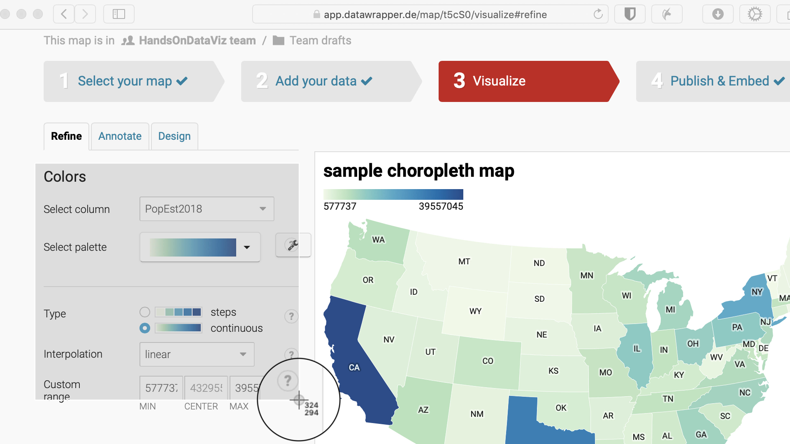
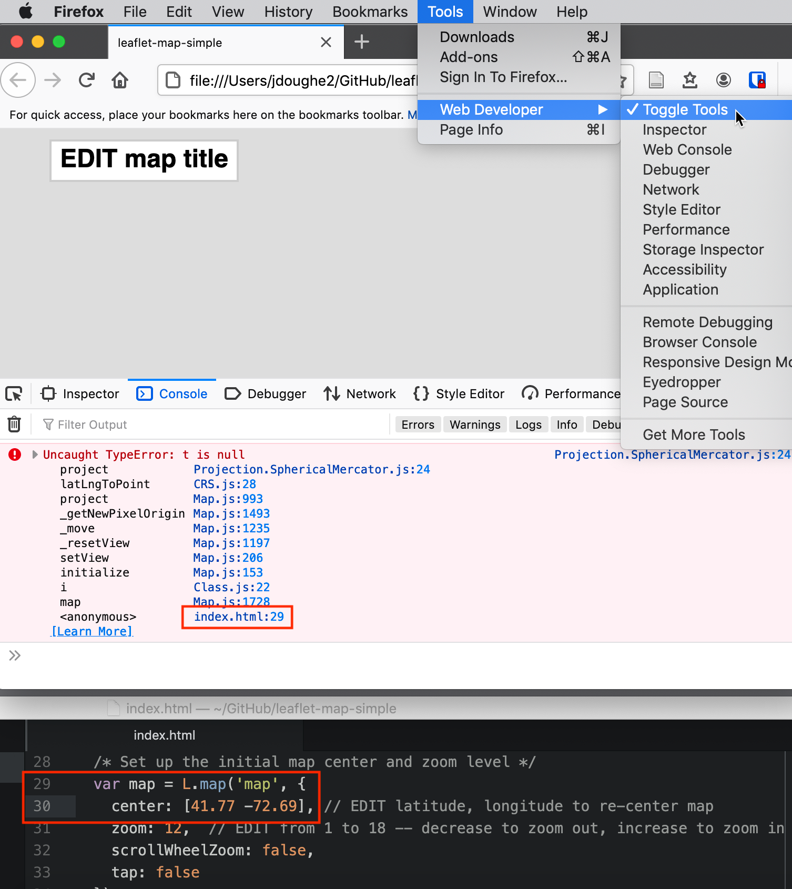
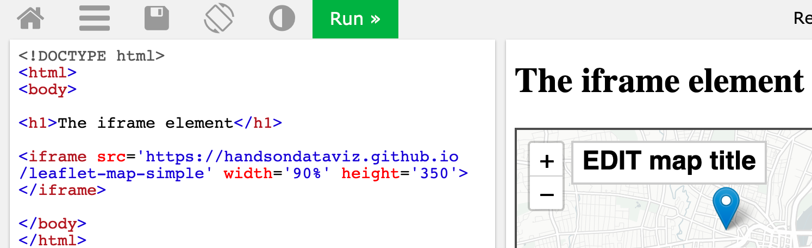

# (APPENDIX) Appendix {-}

# Fix Common Problems {#fix}
When creating data visualizations with online tools, public datasets, and code templates, it's not uncommon to encounter some occasional problems that prevent it from working as expected. We understand that finding the source of a problem can feel frustrating. But figuring out why it broke---and how to fix it---can be a great way to learn what's happening behind the scenes.

Reach out to ask others for advice on solving problems, and make it easier for them to help you. Clearly describe your issue, mention your computer operating system and/or browser version, and consider including a [screenshot](https://en.wikipedia.org/wiki/Screenshot) using these built-in commands, as shown in Figure \@ref(fig:screenshot-mac):

- Chromebook: *Shift + Ctrl + F5* (the *show windows* button), then click-and-drag the cross-hair cursor.
- Macintosh: *Shift + Command + 4*, then click-and-drag the cross-hair cursor to capture screenshot.
- Windows: *Windows logo key + Shift + S* to call up the *Snip & Sketch* tool.

(ref:screenshot-mac) How to create a screenshot on a Mac.

```{r screenshot-mac, fig.cap="(ref:screenshot-mac)"}
if(knitr::is_html_output(excludes="markdown")) knitr::include_url("images/16-fix/screenshot-mac.gif", height = "360px") else 
```

Review these sections below to help you diagnose what type of problem you may be facing, and see our recommended solutions for the most common issues we've seen. Remember that some of the thorniest problems may be caused by two or more separate issues.

- [Tool or platform problems](fix-tool.html)
- [Try a different browser](fix-browser.html)
- [Diagnose with developer tools](fix-developer-tools.html)
- [Mac or Chromebook problems](fix-computer.html)
- [Watch out for bad data](fix-data.html)
- [Common iframe errors](fix-iframe.html)
- [Fix your code on GitHub](fix-code.html)

## Tool or platform problems {#fix-tool}

If you have a problem with one of our recommended digital tools, and have not found the answer in this book, go to the tool's support page (listed in alphabetical order):

- [Airtable relational database support](https://support.airtable.com)
- [Atom text editor documentation](https://atom.io/docs)
- [Chart.js code library documentation](https://www.chartjs.org/)
- [Datawrapper Academy support](https://academy.datawrapper.de/)
- [GeoJson.io geodata editor - see Help menu](http://geojson.io/)
- [GitHub.com and GitHub Desktop documentation](https://docs.github.com)
- [Google My Maps support](https://support.google.com/mymaps)
- [Google Sheets support](https://support.google.com/docs)
- [Highcharts code library - demo and support](https://www.highcharts.com)
- [Leaflet map code library - tutorials and documentation](https://leafletjs.com)
- [LibreOffice Calc support](https://help.libreoffice.org)
- [Mapshaper geodata editor - documentation wiki](https://github.com/mbloch/mapshaper/wiki)
- [Map Warper georectifier help](https://mapwarper.net/help) and [see note about limited disk space](https://mapwarper.net)
- [OpenRefine data cleaner - documentation](https://openrefine.org)
- [Tabula PDF table extractor - how to use](https://tabula.technology)
- [Tableau Public resources page](https://public.tableau.com/en-us/s/resources).

Of course, if you encounter a problem when using an online tool or web platform, always check your internet connection. On rare occasions, online tools and platforms may be off-line for all users. To clarify if an online service down for everyone, and not just you, check for outage reports on sites such as:

- [Downdetector.com](https://downdetector.com)
- [Down for Everyone or Just Me?](https://downforeveryoneorjustme.com)

Also, some online services operate their own status pages:

- [GitHub Status](https://www.githubstatus.com)
- [Google Workspace Status](https://www.google.com/appsstatus)

Finally, note that rare outages by large providers, such as the [problems faced by Amazon Web Services in November 2020](https://www.washingtonpost.com/business/economy/amazon-web-services-outage-stymies-businesses/2020/11/25/b54a6106-2f4f-11eb-860d-f7999599cbc2_story.html), can affect other online tool platforms.

## Try a different browser {#fix-browser}

Many problems we encounter with online tools and code templates turn out to be caused by our browser, not the tool or template itself. The *most important advice* we offer in this chapter is to *always try a different browser* to diagnose your problems. If you normally do all of your work in your favorite browser---such as [Chrome](https://www.google.com/chrome/), [Firefox](https://www.mozilla.org/en-US/firefox/), [Microsoft Edge](https://www.microsoft.com/en-us/edge), or [Safari for Mac only](https://www.apple.com/safari/)---download a second browser for testing purposes. But please stop using the defunct Internet Explorer or Edge Legacy browsers, since [Microsoft announced in 2020](https://docs.microsoft.com/en-us/lifecycle/faq/internet-explorer-microsoft-edge) that neither will be supported in the future.

In fact, you should *always* test your data visualization products in a second browser, where you are *not* logged in to an online account for the tool or service that created it, to check how it appears to regular users. On our computers, we installed a second browser, specifically for testing, and changed the settings to *Never Remember browsing history* so that it acts like a first-time user whenever we open it.

If you encounter any issues when using your favorite browser with digital tools or web services, give it a "hard refresh" to [bypass any saved content in your cache](https://en.wikipedia.org/wiki/Wikipedia:Bypass_your_cache) and re-download the entire web page from the server, using one of these key combinations:

- Ctrl + F5 (most Windows or Linux browsers)
- Shift + Ctrl + R (Chromebook)
- Command + Shift + R (Chrome or Firefox for Mac)
- Option + Command + R (Safari for Mac)

## Diagnose with developer tools {#fix-developer-tools}

We recommend learning how to use your browser to diagnose other types of issues discussed later in this appendix, such as [common iframe errors](fix-iframe.html) or [code template issues](fix-code.html). Most browsers contain *developer tools* that allow you to view the source code of a web page and spot any errors that it flags. Even if you're not a software developer, learning how to open your browser's developer tools allows you to peek under the hood and make a more informed guess about what's not working. To open developer tools in various browsers:

- In Chrome, go to *View > Developer > Developer Tools*.
- In Firefox, go to *Tools > Web Developer > Toggle Tools*.
- In Microsoft Edge, go to *Settings and more (...) icon > More Tools > Developer Tools*.
- In Safari for Mac, first go to *Safari > Preferences > Advanced > Show Develop menu in menu bar*, then go to *Develop > Show JavaScript Console*.

When you open the browser's developer tools, it displays a *console* window that shows error messages that may help to diagnose problems, particularly with code templates. For example, in Chapter 10, you learned how to [edit the simple Leaflet map template in GitHub](copy-leaflet.html). If you accidentally make a mistake, such as deleting the comma between the latitude and longitude coordinates for map center, your code will "break" and display an empty gray box in your screen. If you turn on the browser developer tools, as shown in Figure \@ref(fig:firefox-dev-tools), the console will display several errors, including one that points you to a problem beginning in the `index.html` file on line 29. While the error does not specifically state that a comma is missing in line 30, it's still the best clue to alert you to a problem in that vicinity of the code. This is just one way to use the developer tools, so explore other features to learn more about its many features, and how they differ across browsers.

(ref:firefox-dev-tools) When you open a browser's developer tools, the console window will display any errors it flags in the code for that web page. In this example, a "broken" map appears as a gray box (top), and the console shows an error in line 29 of the `index.html` file (middle), which offers a clue about a missing comma between the latitude and longitude coordinates in line 30 (bottom).

```{r firefox-dev-tools, out.width=500, fig.cap="(ref:firefox-dev-tools)"}
 
```

## Mac or Chromebook problems {#fix-computer}

If you are using a Mac computer, make sure your settings make visible the filename extensions, meaning the abbreviated file format that appears after the period, such as `data.csv` or `map.geojson`. The Mac operating system hides these extensions by default, and several tools in this book will not work properly if are not visible. Make them visible on a Mac by going to *Finder > Preferences > Advanced*, and check the box to *Show all filename extensions*, as shown in Figure \@ref(fig:mac-file-extensions2).

(ref:mac-file-extensions2) On a Mac, go to *Finder - Preferences - Advanced* and check the box to *Show all filename extensions*.

```{r mac-file-extensions2, out.width=400, fig.cap="(ref:mac-file-extensions2)"}
 knitr::include_graphics("images/16-fix/mac-file-extensions.png")
```

If you are using a Chromebook computer, beware that it may be difficult or impossible to install and run some of the recommended tools in this book. Tools that are *not* currently supported for Chromebook include most downloadable desktop applications, such as: Atom editor, GitHub Desktop, LibreOffice Calc, OpenRefine data cleaner, Tableau Public, and Tabula PDF table extractor. But Chromebooks can still operate most of the tools that run through the Chrome browser, such as: Google Sheets, Google My Maps, Datawrapper, the GitHub.com web interface, and several others. Also, if you wish to edit code templates on a Chromebook, see the open-source [Caret text editor for Chrome](https://thomaswilburn.net/caret/) by Thomas Wilburn.

## Watch out for bad data {#fix-data}

Sometimes a problem with a data visualization tool or service is caused by bad data. Learn how to [Recognize Bad Data in Chapter 3](bad-data.html), and different ways to [Clean Data in Chapter 4](clean.html). In addition, avoid common mistakes that will introduce errors into your data files, especially when working with [Chart.js and Highcharts code templates in Chapter 11](chartcode.html) and [Leaflet map code templates in Chapter 12](leaflet.html).

First, avoid typing blank spaces into spreadsheet entries---especially column headers---as shown in Figure \@ref(fig:header-blank). Although blank spaces may seem innocent to human eyes, they may confuse digital tools and code templates that expect to find column headers spelled precisely as promised, without extra spaces.

(ref:header-blank) Avoid typing blank spaces into spreadsheets, especially column headers.

```{r header-blank, out.width=300, fig.cap="(ref:header-blank)"}
 knitr::include_graphics("images/16-fix/header-blank.png")
```

Second, avoid blank rows in data files. For example, when using code templates such as Leaflet Maps with Google Sheets or Leaflet Storymaps with Google Sheets, your online map will break if you leave a blank row in the Google Sheets, as shown in Figure \@ref(fig:blank-row).

(ref:blank-row) Avoid leaving blank rows in Google Sheets data files for Leaflet code templates.

```{r blank-row, out.width=500, fig.cap="(ref:blank-row)"}
 knitr::include_graphics("images/16-fix/blank-row.png")
```

On a related note, in both of the Leaflet code templates described above, media file pathnames are case-sensitive. In other words, `media/filename.jpg` is not the same as `media/filename.JPG`. Therefore, we recommend using *all lowercase characters*, including the suffix ending.

Finally, when working with Leaflet code templates that call GeoJSON data files, as described in Chapter 13, watch out for null (empty) field errors in your geodata. In the browser console diagnostic window described in the section above, these may show a `NaN` error message similar to this:

`Uncaught Error: Invalid LatLng object: (NaN, NaN)`

To resolve a `NaN` error in the browser console, use the [GeoJson.io tool in Chapter 13](geojsonio.html) to closely inspect your geodata for null fields.


## Common iframe errors {#fix-iframe}

If you followed steps in [Chapter 9: Embed on the Web](embed.html) and the contents of your iframe still do not appear in your browser, check for these common problems:

- Items listed in your iframe (such as the URL, width, or height) should be enclosed inside straight single-quote (`'`, also known as an *apostrophe*) or double-quote marks (`"`, also known as *quotation marks*). Choose either type, but be consistent.

- Always use *straight* quote marks, and avoid accidentally entering *curly quotes* (also known as *smart quotes* or *slanted quotes*), which sometimes happens when pasting code from word-processor tools.

- Always use `https` (the extra "s" means "secure"), not `http` in iframes. Some web browsers will block content if it mixes *https* and *http* resources. All of the code templates in this book require *https*.

Use the [W3Schools TryIt iframe page](https://www.w3schools.com/tags/tryit.asp?filename=tryhtml_iframe) to test your iframe embed codes, especially when you need to edit them, since it's a great way to check for mistaken punctuation. Figure \@ref(fig:iframe-incorrect) shows three common problems in a simple iframe: a curly double-quote (after `src=`), use of `http` instead of `https`, and mixture of double-quotes and single-quotes. All of these problems are corrected in Figure \@ref(fig:iframe-correct), which causes the iframe to appear as expected.

(ref:iframe-incorrect) Can you spot three common problems in this incorrect iframe code?

```{r iframe-incorrect, fig.cap="(ref:iframe-incorrect)"}
 knitr::include_graphics("images/16-fix/iframe-incorrect.png")
```

(ref:iframe-correct) All three problems are corrected here, which causes the iframe to appear as expected.

```{r iframe-correct, fig.cap="(ref:iframe-correct)"}
 
```

## Fix your code on GitHub {#fix-code}

As we discussed in [Chapter 10: Edit and Host Code with GitHub](github.html), working with open-source code templates gives you more control over how your data visualization appears and where it is hosted online. But it also means that when your code breaks, you're also responsible for fixing it, or finding a qualified person to help you fix it, perhaps for a fee. If you encounter problems with fixing your code or hosting it on the free GitHub platform, review the relevant chapter(s) in this book and watch out for common problems listed below.

- Be careful when editing your code. A single typo---such as a missing comma, semicolon, or quotation mark, or parenthesis---can break your visualization. We understand how frustrated you may feel when this happens, because it's also happened to us, so take a short break and come back to your screen a bit later, with fresh eyes to help you find the problem.

- Be patient. If edits to your visualization do *not* appear right away on GitHub Pages, wait up to 60 seconds (perhaps longer during busy periods) for the online platform to finish processing your edits. Then give your browser a "hard refresh" to [bypass any saved content in your cache](https://en.wikipedia.org/wiki/Wikipedia:Bypass_your_cache) and re-download the entire web page from the server, using one of these key combinations:

  - Ctrl + F5 (most Windows or Linux browsers)
  - Shift + Ctrl + R (Chromebook)
  - Command + Shift + R (Chrome or Firefox for Mac)
  - Option + Command + R (Safari for Mac)

- Always test the link to your published visualization in a *different* browser. Sometimes problems are actually caused by a glitch in the browser, not the code itself.

- On occasion, the GitHub platform may experience an outage or report known problems with building GitHub Pages from your code. Check the [GitHub Status site](https://status.github.com).

When working with [Chart.js and Highcharts code templates in Chapter 11](chartcode.html) and [Leaflet map code templates in Chapter 12](leaflet.html), be cautious about making edits, especially to the structure of the data file. For example, in the Leaflet Maps with Google Sheets code template, do not change the names at the top of each column, as shown in Figure \@ref(fig:header-name), unless you know what you are doing, because the code template looks for these exact names in order to process your data.

(ref:header-name) Do not change header names in code templates, unless you know what you are doing.

```{r header-name, out.width=600, fig.cap="(ref:header-name)"}
 knitr::include_graphics("images/16-fix/header-name-annotated.png")
```

Remember that you can edit and test code templates more efficiently on your *local* computer, rather than upload every change to view on GitHub online. Use the [GitHub Desktop and Atom Editor tools as described in Chapter 10](github-desktop-atom.html). To fully view more complex Chart.js or Highcharts or Leaflet code templates on your *local* computer, you may need to temporarily manage your CORS internet security settings in your browser, as shown in Figure \@ref(fig:disable-cors-safari) and Figure \@ref(fig:disable-cors-chrome).

Over time, code templates require maintenance to ensure that they will continue to work as technology evolves. For example, the code templates featured in this book all have *code dependencies*, which means they rely on other code or online services in order to operate. These dependencies include online code libraries that create charts and maps, such as Chart.js, Highcharts, Leaflet, and others. Also, map code templates depend on online map tiles from providers such as CARTO, Stamen, and OpenStreetMap. *If one of your online code dependencies is no longer operating*, your code template will stop working.

To check if your code template has an issue with one of its online code dependencies, go back to the original GitHub repository where you made your copy. Check to see if the current online demo chart or map is properly functioning. If yes, then check to see if the original GitHub repo has had recent code updates that may solve your problem. Some code updates are very simple and can be typed directly into your repo through the GitHub web interface. But other code updates are more complex, so review how to "pull" code from a repo to your local computer using tools such as [GitHub Desktop in Chapter 10](github-desktop-atom.html).

If the original GitHub repo from which you copied the code template has a non-functional online demo version, contact the open-source software developer, and the best way to do this is to create an *Issue* on their GitHub repository. There is no guarantee that open-source software developers will continue to maintain their code project into the future. But one benefit of open-source code is that anyone can create a new fork copy and maintain it on their own, or with other collaborators in the open-source coding community.

Finally, if you do not find the answer to your problem above, consider other places to pose your question. Some of our [recommended tools support pages](fix-tool.html) include links to community help forums, where users can post questions and sometimes receive helpful answers from other users. Also, the [StackExchange network](https://stackexchange.com) brings together over 170 online communities where experts answers questions on specific topics, such as [Web Applications Stack Exchange](https://webapps.stackexchange.com) for online tools such as Google Sheets and [Stack Overflow](https://stackoverflow.com) for software coding. When posting a question on any of these public forums, be sure to follow their guidelines, clearly describe your problem, and mention the type of computer operating system and/or browser version you're using.
