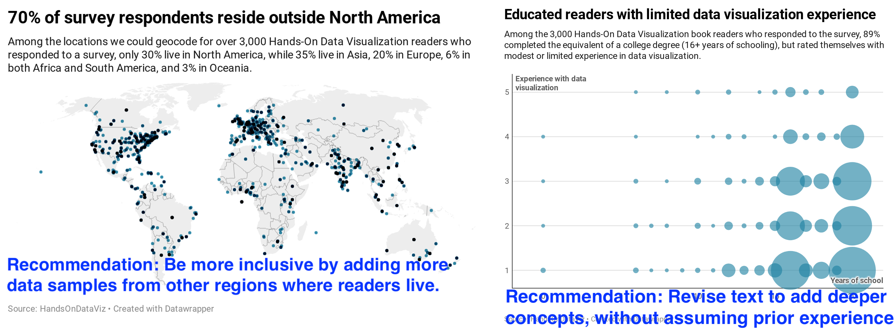
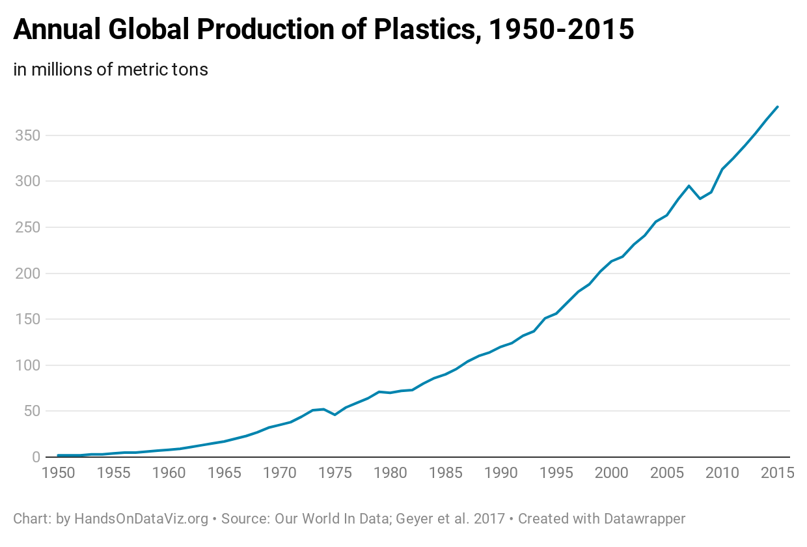
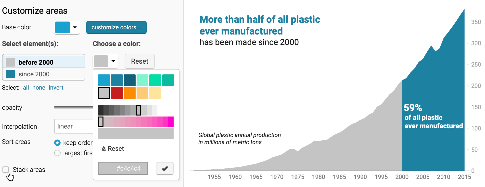

# Tell and Show Your Data Story {#story}
For our concluding chapter, we'll draw on knowledge and skills you've developed while reading this book and offer some final recommendations for creating true and meaningful data stories. Here we emphasize *storytelling*. The goal of data visualization is not simply to make pictures about numbers, but also to craft a truthful narrative that convinces readers how and why your interpretation matters.

Writers have an old saying---"show, don't tell"---which means to let readers experience a story through the actions and feelings of its characters, rather than narration by the author. But we take a different stance, as shown in our chapter title: "tell and show" your data story. Make a regular habit of these three steps: tell your audience what you found that's interesting in the data, show them the visual evidence to support your argument, and remind us why it matters. In three words: tell---show---why. Whatever you do, avoid the bad habit of showing lots of pictures and leaving it up to the audience to guess what it all means. Because we rely on you, the storyteller, to guide us on a journey through the data and what aspects deserve our attention. Describe the forest, not every tree, but point out a few special trees as examples to help us understand how different parts of the forest stand out.

In this chapter, you'll learn how to [build visualizations into the narrative of the storyboard](storyboard.html) that we started at the beginning of the book. Also, you will try out ways to [draw attention to what's most meaningful](draw-attention.html) in your data through text and color, as well as how to [acknowledge sources and uncertainty](sources-uncertainty.html). Finally, we'll discuss decisions you will need to make about the [format of your data story](story-format.html), with our continual emphasis on sharing interactive visualizations rather than static images.^[Our inspiration for this chapter is drawn from excellent books by visualization experts Cole Nussbaumer Knaflic and Alberto Cairo: @knaflicStorytellingDataData2015; @knaflicStorytellingDataLet2019; @cairoTruthfulArtData2016; @cairoHowChartsLie2019]

## Build a Narrative on a Storyboard {- #storyboard}

Let's return to the [Sketch Your Data Story exercise from Chapter 2](sketch.html). We encouraged you to scribble words and sketch pictures on sheets of paper to lay out at least four initial elements of your story:

- Identify the *problem* that motivates your project.
- Reframe the problem into a researchable *question*.
- Describe your plan to *find* data to answer the question.
- Dream up one or more *visualizations* you might create using imaginary data.

Spread out these sheets like a *storyboard* to define the sequence of your narrative, as shown in Figure \@ref(fig:data-story-panel2). Imagine them as preliminary slides for your presentation, or paragraphs and pictures for your written report or web page, for how you will explain the process to your audience. If you prefer to construct your storyboard digitally, another option is to convert blocks of text and images from your sheets into a [Google Slides presentation](https://www.google.com/slides/about/) or a [draft Google Document](https://www.google.com/docs/about/), or your preferred tools for telling the data story. Of course, it's perfectly normal to update the sheets you created at the beginning of your project to reflect changes in your thinking. For example, you may have refined your research question, found new sources during your search, and of course, turned your imagined visualizations into actual tables, charts, or maps with real data.

(ref:data-story-panel2) Sketch out your story idea on four pages: problem, question, find data, visualize.

```{r data-story-panel2, out.width=750, fig.cap="(ref:data-story-panel2)"}
 knitr::include_graphics("images/02-choose/data-story-panel.png")
 ```

Let's enrich your storyboard by adding content about what you discovered while searching, cleaning, analyzing, and visualizing your data. Select only your most meaningful tables, charts, or maps. Print them out on separate sheets of paper, or download [static images or capture screenshots](static.html) to place them in your draft slides or document. Leave room for you to write at the top and bottom of each table, chart, or map in order to tell your data story.

The next step is to *summarize* the most important message the data reveals, and write it as a one-sentence summary at the top of each page that contains a table, chart, or map. Verbalize what your eyes see as the most insightful finding for your most important visualizations. Become our guide, and focus our attention on the data forest, rather than individual trees. Two sentences are acceptable, but one succinct sentence is better. If your prose becomes too wordy, try writing the first sentence in "headline" style and the second as a more descriptive follow-up. Despite the old saying that a picture is worth a thousand words, data visualizations do *not* speak for themselves. Your job is to interpret their meaning for your audience. One of the best ways to translate charts or maps into words is to describe exactly what captures your eye as the designer, and communicate this to your reader, who is seeing it for the first time and relying on your guidance. In every case, you need to decide on the ideal mix of words and images.

At the bottom of each visualization, tell us *why it matters*, and build up to how audiences should rethink or react. A good way to discuss the significance of your data story is to focus on how this new information *changes us*. When you discovered interesting patterns in your data visualization, how did it make you feel about the problem you (or your organization) were trying to solve? How did your answers to the research question make you think about the issue in a new or different way? Overall, does your data story inspire you or others to take action in some way? Once again, think about these questions from the perspective of your audience, and find words that capture how the data story should change our mindset, alter our habits, or influence our next steps.

For example, we started to [sketch our own data storyboard in chapter 2](sketch.html) to define our problem statement: *We need to find out our readers' backgrounds and interests about data visualization, in order to write a better introductory guide that meets their needs.* We collected data from over 3,000 readers of an earlier draft of this book who responded to our [online survey](https://forms.gle/yn5QwTzfQkYcppQn9) and agreed that we would [publicly share the survey results](https://docs.google.com/spreadsheets/d/1egX_akJccnCSzdk1aaDdtrEGe5HcaTrlOW-Yf6mJ3Uo), as we discussed in [chapter 3](spreadsheets.html). We [cleaned up the data as described in chapter 5](clean.html) because some responses were partially empty or contained locations that could not be accurately geocoded. Then we looked for [meaningful comparisons as described in chapter 6](comparisons.html) and visualized our most interesting results in two ways. We created a [scatter chart as described in chapter 7](chart.html) and also a [point map as described in chapter 8](map.html). For this chapter, we followed our own advice above by writing short summaries at the top of each visualization, and explaining why it matters at the bottom.

What did we discover in our reader survey about the earlier draft of this book? And how did we respond to the key data findings? First, over 70 percent of readers who responded live outside of North America. Most notably, 35 percent reside in Asia, 20 percent in Europe, 6 percent each in Africa and South America, and 3 percent in Oceania, as shown in the left side of Figure \@ref(fig:survey-combined-annotated). Our first draft of the book mostly included examples from Hartford, Connecticut, where we both worked. While we knew that our book had a global audience, we were surprised to see how many readers---among those who responded to the survey---live outside of the United States. In order to be more inclusive and expand our international audience, we revised the book to add more sample charts and maps from other regions around the world. Second, we learned that readers who responded to our survey have relatively high levels of education, but limited data visualization experience. In particular, 89 percent reported completing the equivalent of a college degree (16 or more years of schooling), and 64% of these rated themselves as data visualization beginners (either 1 or 2 on the 5-point experiential scale), as shown in the right side of Figure \@ref(fig:survey-combined-annotated). In our earlier draft of the book, our primary audience were college undergraduates, and we were uncertain about the reading and background levels of other readers. Based on the survey responses, we revised the manuscript to add deeper concepts about data visualization, because we believe most of our readers can grasp them, yet we continue to write at an introductory level that assumes no prior knowledge beyond a secondary school or early college education. Now we can add these new sheets to our storyboard.

(ref:survey-combined-annotated) Verbalize meaningful insights at the top of each visualization, and tell why it matters at the bottom, then insert them into your storyboard.

```{r survey-combined-annotated, out.width=750, fig.cap="(ref:survey-combined-annotated)"}

```

Let's pivot back to your storyboard. Insert your new data visualization sheets (or slides, or blocks of text and images) into the pages you've already assembled. As you complete your work, your layout might look something like this:

- problem statement
- research question
- how you found data
- tell 1st data insight---show evidence---why it matters
- tell 2nd data insight---show evidence---why it matters
- ...and so forth toward your summary conclusion

As the storyteller, it's your job to organize your data narrative in the way that makes sense *to your audience*, who most likely will be viewing all of this content for the first time. While there is no one way to tell a story, consider this advice to avoid making rookie mistakes:

- Tell us the problem and question *before* you offer an answer, because our brains expect to hear them in that order.
- Summarize each insight *before* you show us the supporting evidence, because once again, reversing the normal sequence makes it harder for us to follow your argument.
- Make sure that your research question and key insights are *aligned* with one another, since your audience will be confused if you ask one question, but answer a different one. It's perfectly normal to tweak or fully revise the wording of your research question after you've dug deep into the data, because sometimes you don't really know what you're looking for until you've discovered it.

Now you should have a clearer sense of how a storyboard helps you to bring together narrative and data. In the next section, you'll learn how to refine your visualizations by using text and color to draw attention to what is most important.

## Draw Attention to Meaning {- #draw-attention}
When finalizing your visualizations, add finishing touches to draw attention to the most meaningful aspects of the data. In addition to writing text to accompany your charts and maps, you can also add annotations and use colors *inside* some types of visualizations to point out what's most significant in your data story. Let's demonstrate how to use these features to transform your visualization in [Datawrapper, a tool we first introduced in Chapter 7](chart-datawrapper.html).

One of the environmental challenges we face today is the ever-growing production of plastics. While these inexpensive and lightweight materials offer many quality-of-life benefits, we often deposit them in mismanaged waste streams that cause them to enter our rivers and oceans. To understand the growth of plastics, we consulted [Our World In Data](https://ourworldindata.org/plastic-pollution), and you can view the [annual global production data from 1950-2015 in Google Sheets format](https://docs.google.com/spreadsheets/d/1H3OwmiLQy5DugT-iArhuqHryzcWJi1kLocpGp7v-1VM/edit#gid=339613035).^[This example was inspired by the Datawrapper Academy article on pro tips: https://academy.datawrapper.de/article/256-a-collection-of-datawrapper-pro-tips.]

First, let's upload the data in a single-column format to Datawrapper. By default, the tool transforms this time-series data into a line chart, as shown in Figure \@ref(fig:plastic-line-chart), which shows how global plastic production has increased over time.

```
| year | plastics |
| 1950 |        2 |
| 1951 |        2 |
...
```

(ref:plastic-line-chart) The default line chart for historical plastic production in Datawrapper.

```{r plastic-line-chart, fig.cap="(ref:plastic-line-chart)"}
if(knitr::is_html_output(excludes="markdown")) knitr::include_url("https://datawrapper.dwcdn.net/5y13d/", height = "475px") else 
```

But Figure \@ref(fig:plastic-line-chart) does not yet focus on the bigger story: the total amount of plastics manufactured in global history. Our 60 percent of all of the plastics ever manufactured in the world have been made since 2000, or the last 15 years of this chart, according to our analysis of the data. Let's highlight this broader point by editing the chart and building on skills you learned in prior chapters. First, divide the data into two columns, *before 2000* and *since 2000*, which allows you to apply different colors to each data series. Insert the same data for year 2000 in both columns to make the new chart look continuous. Second, change the chart type from the default *line chart* to an *area chart* to fill the space under the curve to draw attention to the total amount of plastics manufactured over time. Third, in the *Refine* tab, since you do *not* want a stacked area chart, uncheck the *stack areas* box. Assign a dark blue color to draw more attention to the post-2000 data series, and a gray color to diminish the appearance of the pre-2000 data series, as shown in Figure \@ref(fig:plastic-refine).

```
| year | before 2000 | since 2000 |
| 1999 |         202 |            |
| 2000 |         213 |        213 |
| 2001 |             |        218 |
...
```

(ref:plastic-refine) After dividing the data into two columns and switching to an area chart, uncheck the *stacked areas* box in the *Refine* tab.

```{r plastic-refine, fig.cap="(ref:plastic-refine)"}

```

Finally, hide the old title and replace it by adding annotations as you learned in the [Annotated Charts with Datawrapper section of Chapter 7](annotated-datawrapper.html). Place annotations inside the area chart, using colored text, to emphasize the new interpretation and place it where readers will look, as shown in Figure \@ref(fig:plastic-area-chart). Overall, redesigning your chart helps you to communicate a more meaningful data story that global plastic production is increasing *and* that our world has manufactured more than half of our historical total in just the past 15 years.

(ref:plastic-area-chart) Explore the [interactive version of the new area chart](https://datawrapper.dwcdn.net/1TyyZ/), which uses color and annotations to draw attention to post-2000 global plastic production.

```{r plastic-area-chart, fig.cap="(ref:plastic-area-chart)"}
if(knitr::is_html_output(excludes="markdown")) knitr::include_url("https://datawrapper.dwcdn.net/1TyyZ/", height = "475px") else knitr::include_graphics("images/16-story/plastic-area-chart.png")
```

Now that you have a clearer idea about why and how to draw your audience's attention to the most meaningful aspects of your data story, we'll build on those skills in the next section on acknowledging sources and ambiguous data.

## Acknowledge Sources & Uncertainty {- #sources-uncertainty}
Since our goal is to tell data stories that are meaningful and true, build credibility into your work, which you can do in several ways:

First, always represent data truthfully. Do not hide or obscure relevant evidence, and avoid visualization methods that might mislead your audience, as we discussed in [Chapter 15 on detecting lies and reducing bias](detect.html). We place our trust in you to fairly interpret the meaning of the data. Warn us if we're in danger of reading too much into the data, or misinterpreting it by seeing something that isn't really there.

Second, [credit and source your data origins](source.html), as we described in [Chapter 4: Find and Question Your Data](find.html). Some of the visualization tools and templates featured in this book make it easy to display links to online sources, so use that feature whenever feasible. When it's not, then write these important details into the text that accompanies your tables, charts, and maps. Also, let audiences know who created the visualization, and credit collaborators and other people who assisted in your work.

Third, save and show your data work at different stages of the process. Save notes and copies of the data as you download, clean, or transform it, and document the important decisions you make along the way. One simple method is to save different versions of your data in [separate spreadsheet tabs, as shown in Chapter 3](spreadsheet.html). For more complex projects, consider sharing your data and documenting your methods in a [public GitHub repository, as shown in chapter 11](github.html). If someone questions your work---or if you need to replicate it with updated dataset---you'll be grateful to have notes that allow you to trace it backwards.

Finally, acknowledge the limitations of your data and disclose any uncertainty. Your work becomes more credible when you admit what you do *not* know or consider alternative interpretations. Some of our recommended [chart tools in chapter 7](chart.html) and [chart code templates in chapter 12](chartcode.html) allow you to insert error bars to show the confidence level in the data, so use those when appropriate. Furthermore, the two-column method shown in the prior section also works to visually distinguish between observed versus project data with solid versus dashed lines, as shown in the Google Sheets chart editor in Figure \@ref(fig:observed-vs-projected).

(ref:observed-vs-projected) Split one data column into two columns to contrast observed data (solid line) versus projected data (dashed line).

```{r observed-vs-projected, fig.cap="(ref:observed-vs-projected)"}
knitr::include_graphics("images/16-story/observed-vs-projected.png")
```

Now that we've reviewed ways to build credibility in your work, let's move on to decisions you'll need to make about telling your data story in different formats.

## Decide On Your Data Story Format {- #story-format}
Most data visualization books and workshops presume that you will deliver your final product on a sheet of paper to people sitting around a board room, or perhaps in a PDF document sent via email or posted online. Those *static* formats are fine, but do not fully reflect the wide range of ways to share your story with broader audiences in the digital age. Moreover, as we write these words during the Covid-19 pandemic, when sitting around an indoor table is not an option, we need to find more creative formats to communicate our data stories.

Given that our book has emphasized the benefits of creating interactive visualizations, which invites audiences to engage with your data by floating their cursor over the charts and maps, we also encourage you to consider more interactive formats for your stories, such as:

- Websites that combine textual narrative and interactive visualizations using iframes.
- Online presentation slides that link to live visualizations
- Video that combines live or voiceover narration with interactive visualization screencast
- A [data walk format](https://www.urban.org/sites/default/files/publication/72906/2000510-data-walks-an-innovative-way-to-share-data-with-communities.pdf), where community stakeholders move around and discuss connections between their lived experiences and the data stories.

Of course, different storytelling methods require you to tailor content to fit the format. Furthermore, not every format requires interactive visualizations, nor are they always the most appropriate choice. While the details are beyond the scope of this book, we encourage you not to fall into traditional mindsets and to think differently about ways to tell true and meaningful data stories.

### Summary {- #summary16}

This concluding chapter brought together broad concepts and pragmatic skills from the book to reinforce how data visualization is driven by truthful and meaningful *storytelling*. While we love to make pictures about numbers, our broader mission is to create narratives that convince our audiences how and why our data interpretations matter. You learned different strategies to achieve this goal, such as building storyboards, drawing attention to meaningful data with text and color, acknowledging sources and uncertainty, and thinking creatively about storytelling formats that fit our audiences.
