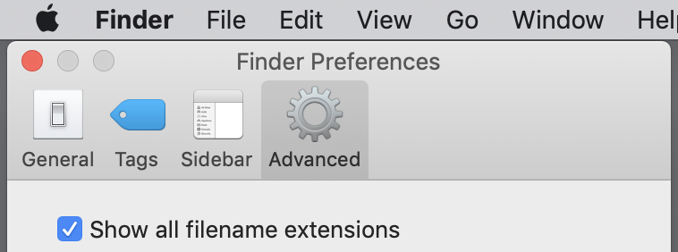
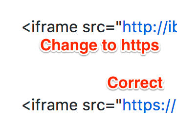

# (APPENDIX) Appendix {-}

# Fix Common Problems {#fix}
When creating data visualizations with online tools, public datasets, and code templates, it's not uncommon to encounter some occasional problems that prevent it from working as expected. We understand that finding the source of a problem can feel frustrating. But figuring out why it broke---and how to fix it---can be a great way to learn what's happening behind the scenes. Review these sections below to help you diagnose what type of problem you may be facing, and see our recommended solutions for the most common issues we've seen. Remember that some of the thorniest problems may be caused by two or more separate issues.

- [Problem with a tool or online service](fix-tool.html)
- [Problem with an online service](fix-service.html)
- [Problem with your browser](fix-browser.html)
- [Diagnose with browser developer tools](fix-developer-tools.html)
- [Problem with your Mac or Chromebook computer](fix-computer.html)
- [Problem with your data](fix-data.html)
- [Problem with an embed code or iframe](fix-embed.html)
- [Problem with GitHub or code templates](fix-code.html)
- [Where to ask questions and seek answers](fix-questions.html)

## Problem with a tool or online service {#fix-tool}

If you have a problem with one of our recommended digital tools, and have not found the answer in this book, go to the tool's online support page (listed in alphabetical order):

- [Airtable relational database support](https://support.airtable.com)
- [Atom text editor documentation](https://atom.io/docs)
- [Chart.js code library documentation](https://www.chartjs.org/)
- [Datawrapper Academy support](https://academy.datawrapper.de/)
- [GeoJson.io geodata editor - see Help menu](http://geojson.io/)
- [GitHub.com and GitHub Desktop documentation](https://docs.github.com)
- [Google My Maps support](https://support.google.com/mymaps)
- [Google Sheets support](https://support.google.com/docs)
- [Highcharts code library - demo and support](https://www.highcharts.com)
- [Leaflet map code library - tutorials and documentation](https://leafletjs.com)
- [LibreOffice Calc support](https://help.libreoffice.org)
- [Mapshaper geodata editor - documentation wiki](https://github.com/mbloch/mapshaper/wiki)
- [MapWarper georectifier help](https://mapwarper.net/help) and [see note about limited disk space](https://mapwarper.net)
- [OpenRefine data cleaner - documentation](https://openrefine.org)
- [Tabula PDF table extractor - how to use](https://tabula.technology)
- [Tableau Public resources page](https://public.tableau.com/en-us/s/resources).

On rare occasions, a tool platform or web service may be off-line for all users. To clarify whether a site is down for everyone, and not just you, check for outage reports on sites such as:

- [Downdetector.com](https://downdetector.com)
- [Down for Everyone or Just Me?](https://downforeveryoneorjustme.com)

Also, some online services operate their own status pages:

- [GitHub Status](https://www.githubstatus.com)
- [Google Workspace Status](https://www.google.com/appsstatus)

See also how rare outages by large providers, such as the [problems faced by Amazon Web Services in November 2020](https://www.washingtonpost.com/business/economy/amazon-web-services-outage-stymies-businesses/2020/11/25/b54a6106-2f4f-11eb-860d-f7999599cbc2_story.html), can affect other online tool platforms. Finally, always make sure your internet connection is working properly.

## Problem with your browser {#fix-browser}

Many problems we encounter with online tools and code templates turn out to be caused by our browser, not the tool or template itself. The *most important advice* we offer in this chapter is to *always try a different browser* to diagnose your problems. If you normally do all of your work in your favorite browser---such as [Chrome](https://www.google.com/chrome/), [Firefox](https://www.mozilla.org/en-US/firefox/), [Microsoft Edge](https://www.microsoft.com/en-us/edge), or [Safari for Mac only](https://www.apple.com/safari/)---download a second browser for testing purposes. But please stop using the defunct Internet Explorer or Edge Legacy browsers, since [Microsoft announced in 2020](https://docs.microsoft.com/en-us/lifecycle/faq/internet-explorer-microsoft-edge) that neither will be supported in the future.

In fact, you should *always* test your data visualization products in a second browser, where you are *not* logged in to an online account for the tool or service that created it, to check how it appears to regular users. On our computers, we installed a second browser, specifically for testing, and changed the settings to *Never Remember browsing history* so that it acts like a first-time user whenever we open it.

If you encounter any issues when using your favorite browser with digital tools or web services, give it a "hard refresh" to [bypass any saved content in your cache](https://en.wikipedia.org/wiki/Wikipedia:Bypass_your_cache) and re-download the entire web page from the server, using one of these key combinations:

- Ctrl + F5 (most Windows or Linux browsers)
- Shift + Ctrl + R (Chromebook)
- Command + Shift + R (Chrome or Firefox for Mac)
- Option + Command + R (Safari for Mac)

## Diagnose with browser developer tools {#fix-developer-tools}

We recommend learning how to use your browser to diagnose other types of issues discussed later in this chapter, such as [problems with iframes](fix-embed.html) or [code templates](fix-code.html). Most browsers contain *developer tools* that allow you to view the source code of a web page and spot any errors that it flags. Even if you're not a software developer, learning how to open your browser's developer tools allows you to peek under the hood and make a more informed guess about what's not working. To open developer tools in various browsers:

- In Chrome, go to *View > Developer > Developer Tools*.
- In Firefox, go to *Tools > Web Developer > Toggle Tools*.
- In Microsoft Edge, go to *Settings and more (...) icon > More Tools > Developer Tools*.
- In Safari for Mac, first go to *Safari > Preferences > Advanced > Show Develop menu in menu bar*, then go to *Develop > Show JavaScript Console*.

When you open the browser's developer tools, it displays a *console* window that shows error messages that may help to diagnose problems, particularly with code templates. For example, in Chapter 10, you learned how to [edit the simple Leaflet map template in GitHub](copy-leaflet.html). If you accidentally make a mistake, such as deleting the comma between the latitude and longitude coordinates for map center, your code will "break" and display an empty gray box in your screen. If you turn on the browser developer tools, as shown in Figure \@ref(fig:firefox-dev-tools), the console will display several errors, including one that points you to a problem beginning in the `index.html` file on line 29. While the error does not specifically state that a comma is missing in line 30, it's still the best clue to alert you to a problem in that vicinity of the code. This is just one way to use the developer tools, so explore other features to learn more about its many features, and how they differ across browsers.

(ref:firefox-dev-tools) When you open a browser's developer tools, the console window will display any errors it flags in the code for that web page. In this example, a "broken" map appears as a gray box (top), and the console shows an error in line 29 of the `index.html` file (middle), which offers a clue about a missing comma between the latitude and longitude coordinates in line 30 (bottom).

```{r firefox-dev-tools, out.width=500, fig.cap="(ref:firefox-dev-tools)"}
 knitr::include_graphics("images/17-fix/firefox-dev-tools-annotated.png")
```

## Problem with your Mac computer or Chromebook {#fix-computer}

TODO... START AGAIN HERE...

If you use a Mac computer, make sure you can see the filename extensions, meaning the abbreviated file format that appears after the period, such as `data.csv` or `map.geojson`. Several tools in this book will not work properly if your computer does not display the filename extensions, and the Mac computer operating system hides these by default. Turn them on by going to Finder > Preferences > Advanced, and check the box to *Show all filename extensions*, as shown in Figure \@ref(fig:mac-file-extensions2).

(ref:mac-file-extensions2) On a Mac, go to *Finder* then *Preferences* then *Advanced* and check the box to *Show all filename extensions*.

```{r mac-file-extensions2, out.width=400, fig.cap="(ref:mac-file-extensions2)"}
 
```

Add Chromebook....

## Problem with your data {#fix-data}

First, review how to Recognize Bad Data in Chapter 4, and ways to Clean Data in Chapter 5....

Avoid typing blank spaces after column headers---or any spreadsheet entries---since some data visualization tools will not match them with headers lacking a blank character, as shown in Figure \@ref(fig:header-blank).

TODO: IMPROVE image

(ref:header-blank) Avoid blank spaces in data headers...

```{r header-blank, out.width=300, fig.cap="(ref:header-blank)"}
 knitr::include_graphics("images/17-fix/header-blank-annotated.png")
```

If you are working with Leaflet code templates, avoid null (empty) fields in your data file, which may throw a `NaN` error code in the browser console...see section above...


## Problem with an embed code or iframe {#fix-embed}

If you followed steps in [Chapter 10: Embed on the Web](embed.html) and the contents of your iframe do not appear in your browser, check for these common problems:

- Items listed in your iframe (such as the URL, width, or height) should be enclosed inside straight quotation marks (single or double)
  - BROKEN iframe (missing quotation marks for width and height)

  `<iframe src="https://handsondataviz.github.io/leaflet-map-simple" width=90% height=350></iframe>`

  - FIXED iframe (with correct quotation marks)

  `<iframe src="https://handsondataviz.github.io/leaflet-map-simple" width="90%" height="350"></iframe>`

- Use only `https` (the extra 's' means 'secure'), not `http`. Some web browsers will block content if it mixes http and https resources, and some code templates in this book require https, as shown in Figure \@ref(fig:https-vs-http).

TODO: IMPROVE image

(ref:https-vs-http) Use https links, not http

```{r https-vs-http, out.width=300, fig.cap="(ref:https-vs-http)"}
 
```


- Use only straight quotes, not curly quotes. Avoid pasting text from a word-processor into GitHub, which can accidentally carry over curly quotes. Typing directly into the GitHub editor will create straight quotes, as shown in Figure \@ref(fig:straight-vs-curly).

TODO: IMPROVE image

(ref:straight-vs-curly) Use straight quotes, not curly, in code...

```{r straight-vs-curly, fig.cap="(ref:straight-vs-curly)"}
 knitr::include_graphics("images/17-fix/straight-vs-curly-annotated.png")
```

Hint: Either single-quote (`'`) marks (also called an apostrophe) or double-quote (`"`) marks are acceptable in your iframe code, but be consistent and avoid accidentally pasting in curly-quotes.


## Problem with GitHub or code templates {#fix-code}

"code dependency" to an online background map or code library is unexpectedly interrupted. But more often it seems that problems arise because we make simple mistakes that break our own code. Whatever the cause, one big drawback of working with code is that you're also responsible for fixing it.

...Be careful when editing your code. Accidentally removing or adding extra punctuation (such as quotation marks, commas, or semicolons) can stop your map from working....We understand the feeling you experience when a simple typo---such as a misplaced semicolon (;)---makes your data visualization disappear from the screen.

- Test the link to your published web page in a different browser. If you normally use Chrome, try Firefox.

- On rare occasions, the GitHub service or GitHub Pages feature may be down. Check <https://status.github.com>.

TODO: Test one way to fix GitHub errors by going into the commits and going back to a previous version of the code. Is this possible in the web version?


If you upload new data to your Chart.js code template on GitHub Pages, and it does not appear in your browser after refreshing and waiting up to one minute, then GitHub Pages is probably not the cause of the problem. Instead, some browsers continue to show "old" Chart.js in the web cache. The simplest solution is to File > Quit your browser and re-open the link to your Chart.js


TODO - STILL RELEVANT? If you followed the [Create a Simple Web Page with GitHub Pages tutorial](github-pages.html), it should have created two web links (or URLs):

- your code repository, in this format: `https://github.com/USERNAME/REPOSITORY`
- your published web page, in this format: `https://USERNAME.github.io/REPOSITORY`

Be sure to insert your GitHub username, and your GitHub repository name, in the general formats above.

These URLs are NOT case-sensitive, which means that `https://github.com/USERNAME` and `https://gitub.com/username` point to the same location.

- Make sure that you are pointing to the correct URL for your published web page, in the format shown above.
- Be patient. During busy periods on GitHub, it may take up to 1 minute for new content to appear in your browser.
- **MOVE UP**
If your map does *not* appear right away, wait up to 30 seconds for GitHub Pages to finish processing your edits. Then give your browser a "hard refresh" to [bypass any saved content in your cache](https://en.wikipedia.org/wiki/Wikipedia:Bypass_your_cache) and re-download the entire web page from the server, using one of these key combinations:

- Ctrl + F5 (most Windows or Linux browsers)
- Shift + Ctrl + R (Chromebook)
- Command + Shift + R (Chrome or Firefox for Mac)
- Option + Command + R (Safari for Mac)


Problems with Leaflet Maps with Google Sheets template ....
1) Confirm that you have completed all of the key steps in the [Leaflet Maps with Google Sheets](leaflet-with-google-sheets) tutorial in this book, especially these:
  - Sign in to Google and File > Make a Copy of the Google Sheet to your Google Drive.
  - File > Publish your Google Sheet (Jack often forgets this key step!)
  - Copy your Google Sheet web address from top of your browser (usually ends with `...XYZ/edit#gid=0`) and paste into your `google-doc-url.js` file in your GitHub repo. Do NOT copy the *Published* web address (which usually ends with `...XYZ/pubhtml`)
  - When you paste your Google Sheet web address into `google-doc-url.js`, be careful not to erase single-quote marks or semicolon
  - Go to your live map link, which should follow this format: `https://USERNAME.github.io/REPOSITORY`, refresh the browser, and wait at least 30 seconds.

2) Check your Google Sheet for errors:
- Do NOT rename column headers (in row 1) of any sheet, because the Leaflet Map code looks for these exact words.

- Do NOT rename row labels (in column A) of any sheet, due to the same reason above.

- In your Points tab, DO NOT leave any blank rows

3) Confirm on GitHub Status (https://status.github.com/) that all systems are operational.

4) If you cannot find the problem, go to the top of this page to Safely Delete Your GitHub Repo and Start Over. Also, make a new copy of the Google Sheet template, give it a new name, and copy data from your old sheet using File > Paste Special > Values Only.

Warning: Media file pathnames are case-sensitive, and we recommend using *all lowercase characters*, including the suffix ending. Also, since the code template automatically resizes images to fit, we recommend that you *reduce the size* of any images to 600x400 pixels or less prior to uploading, to make sure your map operates smoothly.


To fully view more complex code templates in your local browser, including some [Chart.js or Highcharts templates in Chapter 12](chartcode.html) or [Leaflet templates in Chapter 13](leaflet.html), you may need to temporarily relax [same-origin policy restrictions](https://en.wikipedia.org/wiki/Same-origin_policy), an internet security mechanism that limits how web pages access content from other domains. You can do so by managing your [Cross-Origin Resource Sharing](https://en.wikipedia.org/wiki/Cross-origin_resource_sharing)(CORS) settings, and methods for doing this vary across operating systems and browsers. For example, [to disable same-origin policy on Safari for Mac](https://stackoverflow.com/questions/4556429/disabling-same-origin-policy-in-safari), first go to *Preferences > Advanced* to enable the *Developer* menu, then in this new menu select *Disable Cross-Origin Restrictions*. After you are done testing your code, restart Safari to reset the setting to its default safety position. See also ways to [run the Chrome browser without same-origin restrictions on various computers](https://alfilatov.com/posts/run-chrome-without-cors/) or this [popular Stackoverflow page](https://stackoverflow.com/questions/3102819/disable-same-origin-policy-in-chrome). If you temporarily disable this safety mechanism in your browser, be sure to re-enable it before browsing sites on the public web.


If you decide to safely delete one of your GitHub repositories and start over with a code template, here's a simple way to save your work:

- Go to the top-level of your GitHub repository, similar to `https://github.com/USERNAME/REPOSITORY`
- Click the green "Clone or Download" button, and select Download Zip to receive a compressed folder of your repo contents on your computer.
- In your GitHub repo, click on Settings (upper-right area) and scroll down to Delete This Repository.
- To prevent accidental deletions, GitHub requires you to type in the REPOSITORY name.
- Now you can start over in one of these ways:
  - If you wish to [Create a Simple Web Page with GitHub Pages](github-pages.html), follow that tutorial again.
  - OR
  - Fork another copy of the original GitHub repository to your account. After you create your copy, if you wish to add selected files that you previously downloaded to your computer, follow directions to [Upload Code with GitHub](create-repo) in the second half of this tutorial in this book

## Where to ask questions and seek answers {#fix-questions}

(describe your problem, computer OS and browser version, and what you have tried so far, and add a screenshot or link to your open-source code when appropriate)
