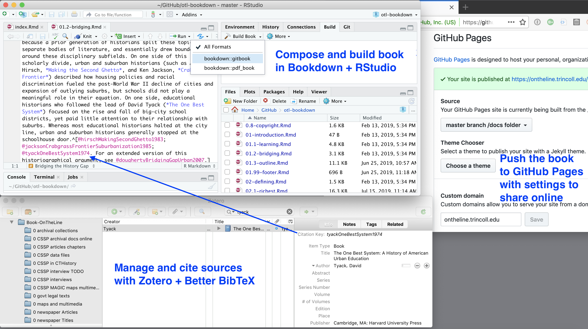
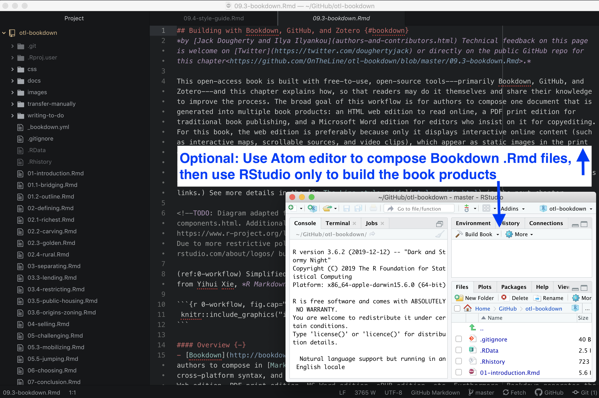

# Publishing with Bookdown {#bookdown}
We built this book with free-to-use, open-source tools, primarily [Bookdown](https://bookdown.org), [GitHub](http://github.com), and [Zotero](http://zotero.org). This chapter explains why and how we combined these tools and developed our publishing workflow, so that others can build their own books and share their knowledge about how to improve the process.

Why not just write the book in a conventional word processor? We desired an efficient workflow to co-author one manuscript that could continuously generate multiple book products for different purposes, as shown in Figure \@ref(fig:workflow).

- HMTL web edition for the open-access book, with embedded iframes for interactive charts and maps
- PDF print edition with static images and book-style layout
- Microsoft Word edition with static images for editors who prefer to provide feedback this way
- Markdown file of the full-length book with pathnames to static images for easy conversion into the publisher's platform

A conventional word processor could not continuously generate all of these products, which likely would have resulted in creating entirely separate files and code for different editions. But with our unified Bookdown workflow, all of our writing is done in one manuscript. Whenever we make edits, we push a couple of buttons to publish our updated book products in the HTML, PDF, MS Word, and Markdown formats.

(ref:workflow) Simplified workflow to compose, compile, and publish in multiple formats with Bookdown. Images from [Daniel Hendricks](https://fileicons.org), [RStudio](https://github.com/rstudio/hex-stickers/), and [Zotero](https://www.zotero.org/support/brand).

```{r workflow, fig.cap="(ref:workflow)"}
 knitr::include_graphics("images/20-bookdown/workflow.png")
```

### Bookdown Overview: Why and How? {-}
We based our solution around [Bookdown](https://bookdown.org), an open-source package for the [R code project](https://www.r-project.org/) created by Yihui Xie at RStudio. Although many people use R for statistical analysis, the free [RStudio desktop application](https://rstudio.com/) also supports several innovative publishing solutions. Here's an overview of our workflow:

- We set up the Bookdown files and composed the manuscript in [R Markdown](https://rmarkdown.rstudio.com), the R-flavored version of the easy-to-write [Markdown syntax](https://en.wikipedia.org/wiki/Markdown). Each chapter consisted of one .Rmd file, with links to static images and interactive visualizations.
- We uploaded our files to a free [GitHub](http://github.com) repository, which allowed both of us to work simultaneously on *different* chapters of the book and "push" our revisions (called commits) to our shared online repository, where we could view each other's edits. Alternatively, you could simultaneously write and comment on the *same* chapter in Google Documents, and use the [Docs to Markdown add-on](https://github.com/evbacher/gd2md-html/wiki) to convert one-time into Markdown format, which is similar to R Markdown.
- We organized our sources using the free [Zotero bibliography manager](https://zotero.org) by the Roy Rosenzweig Center for History and New Media at George Mason University. Also, we installed the free [Better BibTeX](https://github.com/retorquere/zotero-better-bibtex) extension by Emiliano Heynes to create Zotero citation keys that work smoothly with Bookdown.
- After each day's writing, we used Bookdown to automatically "knit" and compile the book products. Behind the scenes, Bookdown builds the editions using the [PanDoc](https://pandoc.org/) universal document converter and the [LaTeX](https://www.latex-project.org) document preparation software, without requiring you to learn these complex formats.
- Under our open-access agreement with the publisher, we made our book public as we wrote it to develop our audience and address reader feedback. With each day's revisions, we rebuilt the book and published all of the editions to our public GitHub repository, and used its free [GitHub Pages](https://pages.github.com) feature to host the open-access HTML web edition. (Alternatively, you can choose to keep your GitHub repo private.)
- We hosted our open-access web edition on GitHub using a custom domain name (https://HandsOnDataViz.org), which we purchased and set up through [Reclaim Hosting](http://reclaimhosting.com).
- As we worked on the book manuscript, our developmental editor downloaded the PDF edition from our public GitHub repo to mark up with feedback. (Alternatively, some editors prefer to insert track-changes comments in the MS Word edition.)
- When we were ready to submit the final manuscript, we used Bookdown to create one full-length Markdown file of the entire book, which was compatible with the publisher's [Atlas production platform](https://docs.atlas.oreilly.com/writing_in_asciidoc.html). However, this was a one-time file conversion, and edits we make to our Bookdown workflow will not appear in the publisher's platform, unless they request a new file and convert it.

Screenshots of two variations of the basic workflow appear in Figure \@ref(fig:workflow-desktop) and Figure \@ref(fig:workflow-atom). The first displays how to compose the book using the R Studio built-in editor, and the second shows a very similar process using the [Atom text editor](http://atom.io), which we prefer. Learn more about [GitHub Desktop and Atom text editor in Chapter 11](github-desktop-atom.html).

(ref:workflow-desktop) Workflow on a Mac desktop: Compose the text in RStudio and build books with Bookdown (top left), manage sources and insert citation keys with Zotero + BetterBibTex (bottom left), push book products to your GitHub repository to host online (right).

```{r workflow-desktop, fig.cap="(ref:workflow-desktop)"}
 
```

(ref:workflow-atom) Variation on the workflow above: Compose the text in your preferred editor (such as Atom), and use RStudio only to build the book products.

```{r workflow-atom, fig.cap="(ref:workflow-atom)"}
 
```

Our Bookdown workflow met our goal to efficiently and continuously produce multiple book products. But it may not be ideal for everyone, especially novice computer users. Installation and setup requires several steps, as described in the following sections:

- [Install and Set Up Bookdown](install.html)
- [File Structure and Headers](structure.html)
- [Style Guide for *Hands-On Data Visualization*](style-guide.html)
- [Images and R Code-chunk Formatting](images.html)
- [Tables in Markdown Format](tables.html)
- [Zotero and Better BibTeX for Notes and Biblio](zotero.html)

Before leaping into Bookdown or any related tool, see also this section on [Alternative Book Authoring-Publishing Tools](alternative.html).

For more technical details about Bookdown, and examples of other publications built with this tool, see https://bookdown.org:

- Xie, Yihui. *Bookdown: Authoring Books and Technical Documents with R Markdown*. Chapman & Hall/CRC, 2018. https://bookdown.org/yihui/bookdown/.
- Xie, Yihui, J. J. Allaire, and Garrett Grolemund. *R Markdown: The Definitive Guide*. Chapman & Hall/CRC, 2020. https://bookdown.org/yihui/rmarkdown/.
- Xie, Yihui, Christophe Dervieux, and Emily Riederer. *R Markdown Cookbook*. Chapman & Hall/CRC, 2020. https://bookdown.org/yihui/rmarkdown-cookbook/.
