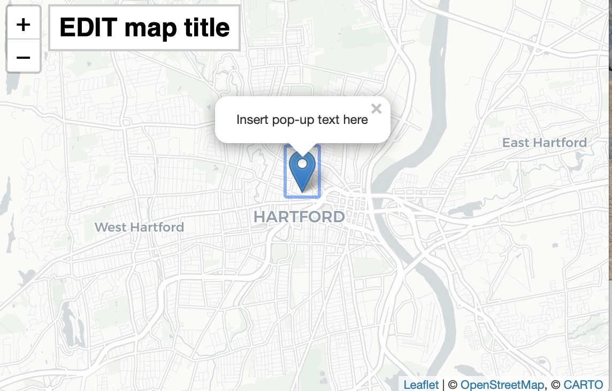
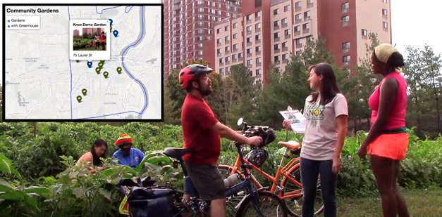

## Images and R Code-chunk Formatting {- #images}
View the underlying source code to understand how this page was composed at: https://github.com/HandsOnDataViz/book/blob/main/20.4-images.Rmd

In general, create high-resolution color screenshots with the paid SnagIt tool (to capture cursors) on a high-resolution Retina monitor (144 ppi) with tight cropping, and save in PNG format (preferred over JPG due to image loss). Save items into the `images` subfolder that corresponds with each chapter. Make sure that color images include high contrast and/or shading, because they will be converted to grayscale by the publisher for the print book. Write file names in lowercase with dashes (not spaces) and begin with keyword of relevant section to keep related images grouped together. Despite being in separate folders, avoid duplicate image file names across the book. Avoid numbering images since they may not match the final sequence.

If we need to create side-by-side images, save each element using the root file name plus a suffix, and use Photoshop or http://Photopea.com to combine images and also save in Photoshop format (.psd) in the images subfolder.

If a screenshot requires additional artwork or text for the HTML edition, make a copy of the original, modify using a graphics tool, and add the suffix `-annotated` to note that this version is annotated, save into the same folder with the same root file name, and use in the code-chunk image pathnames. In the publisher's Figure Log we will point to the original image, and add a note to the annotated version as a guide for any artwork that they wish to redraw.

Since large PNG images sometimes appear too large in the PDF edition, convert a copy into a smaller PDF image to fit better. To batch process several PNG images:

- create duplicates of all PNGs and drag to a separate folder
- select all of the duplicated PNG files and open with Mac Preview to view all
- select all image thumbnails in Preview, reduce image size for all by 50% (or more), and save
- select all image thumbnails in Preview again, and File > Export, with Option to change file format to PDF, but keep same file name as PNG
- move all reduced-size PDFs back to the original images folder

As a result, a simple image may have only one file in the the images folder, but large and complex images may consist of multiple files:

```
images/chapter/image.png
images/chapter/image-annotated.png
images/chapter/image-annotated.pdf
images/chapter/image-combined.psd
images/chapter/image-part1.png
images/chapter/image-part2.png

```

In writing this book, one of key goals was to create R Markdown syntax to display different versions of images for different Bookdown editions. For each image, we wanted one set of instructions to display an interactive chart/map/video using an embedded iframe in the HTML web edition, but display a static PNG image in the full-length Markdown edition, or to substitute a smaller PDF static image when available in the PDF book edition. Also, we wanted auto-numbering of images by chapter.

Our solution relies on R code-chunk formatting for *most* images, with some exceptions. This R Markdown/Bookdown syntax is more complex than basic Markdown image formatting, but supports conditional formatting and captions in all of our editions, and auto-numbering in HMTL and LaTeX/PDF editions. Our *general* R code-chunk image format looks *roughly* like this, minus some code tics that have been removed for simplicity:

```
...as shown in Figure \@ref(fig:keyword).

(ref:keyword) Caption, with optional Markdown links, but no endnotes.

{r keyword, fig.cap="(ref:keyword)"}
if(knitr::is_html_output(excludes="markdown")) knitr::include_url("http://pathname-to-interactive-version-keyword.html")
else knitr::include_graphics("pathname-to-static-version-keyword.png")
```

The first line generates an auto-numbered and clickable figure cross-reference call-out. Auto-numbering appears in `Figure x.x` format in HTML, PDF, and Word, but `Figure x` format in Markdown. (Word auto-number formatting can be changed with a reference.docx file.) This call-out is important because images in PDF output will "float" by design and may appear before or after the desired page.

The second line contains the caption, with optional links in Markdown format. But do not insert endnotes with Zotero citation keys, since those will cause errors in the PDF edition. Insert detailed endnotes about sources for images in the body of the text, and use the caption for only a brief "Source: " mention.

The third block is the R code-chunk. (In practice, the code-chunk is set off from the other two lines using 3 code tic marks, as shown in later demos, which we omitted here for simplicity.) The first portion references keyword in the call-out and also the caption above. The latter portion may simply instruct Bookdown to include a static image (when there is no interactive version), or it may include an if-else statement for conditional formatting when both interactive and static versions exist.

The if statement for HTML output contains `(excludes="markdown")` because `markdown` is considered an HTML format, as described in the [R Markdown Cookbook](https://bookdown.org/yihui/rmarkdown-cookbook/latex-html.html). Since the publisher's platform will accept a full-length Markdown version of the book, which displays static images rather than interactive visualizations, we need to generate the "markdown" file differently than the HTML web edition.

Write R code-chunk labels that use the same year and keywords as the image file name. Avoid duplicate labels across the book. Use only letters, numbers, and hyphens (not underscores):

```
ref:keywords-with-hyphens

images/07-chart/keywords-with-hyphens.png
```

Do not insert spaces inside the `ref:chunk-label` for the caption. But do add a blank line to separate it from the code-chunk. After the code-chunk, add *another* blank line to avoid "undefined reference" Bookdown errors.

Inside the R code-chunk ref caption, do NOT use mischievous characters (such as `<` or `>` or `"`) that will throw HTML errors into the Markdown output images. Instead, use safe characters such as (`*` and `-`) to designate computer instructions, such as *File - Make a Copy*.

Our Bookdown `index.Rmd` file includes global R code-chunk settings immediately after the first header. One setting displays each code-chunk image without a code echo, meaning that only the image is displayed, and not the code used to generate that image. The other setting automatically inserts the PDF version of an PNG/JPG image, whenever it exists, in the PDF output, which allows us to manually reduce the size of large images displayed in the PDF book. Read more about these options in this Bookdown chapter: https://bookdown.org/yihui/bookdown/figures.html.

```
{r setup, include=FALSE}
knitr::opts_chunk$set(echo = FALSE)
options(knitr.graphics.auto_pdf = TRUE)
```

### Demo: R code-chunk for static image for all editions: HTML, PDF, DOCX, MD {-}
...as shown in Figure \@ref(fig:sample-image).

(ref:sample-image) Caption with optional Markdown links but no endnotes. Source: "Hippo and crocodile" by [Stig Nygaard](https://www.flickr.com/photos/10259776@N00), CC-BY.

```{r sample-image, fig.cap="(ref:sample-image)"}
 knitr::include_graphics("images/20-bookdown/sample-image.png")
```

### Demo: R code-chunk to reduce size of static image for all editions {-}
First, create a copy of the original PNG image. Use Preview or any image editor to reduce size by 50 percent or more, and if needed, increase the resolution (from 72 to 144 dpi or higher), and save. Export as PDF image with same filename as PNG file, to produce two image files: keyword.png (original) and keyword.pdf (smaller size). The global setting will auto-substitute the smaller PDF image in place of the original PNG image.

Second, insert an `out.width=...` in the second line to reduce the PNG display size as needed in the HTML edition. Note that this method keeps the original PNG image intact, which is ideal when working with historical images of a reasonable file size. Images larger than 3MB may be delayed in the HTML web edition for readers with slow internet connections.

...as shown in Figure \@ref(fig:sample-image2).

(ref:sample-image2) This version reduces HTML display size using `out.width=300` and auto-substitutes a smaller PDF image. Source: "Hippo and crocodile" by [Stig Nygaard](https://www.flickr.com/photos/10259776@N00), CC-BY.

```{r sample-image2, out.width=300, fig.cap="(ref:sample-image2)"}
 knitr::include_graphics("images/20-bookdown/sample-image2.png")
```

R code-chunks allow more complex conditional formatting, where an interactive map or animated GIF or streaming video clip appears in the HTML version, and a manually-produced static image with an embedded link appears in the PDF, MS Word, and full-length Markdown outputs. To change the height of the default 400px iframe, add the new height to `include_url` as shown in the examples. (Note: Changing the width of the default 675px iframe to less than 100 percent requires adding a line in a `custom-scripts.html` file, and including this in the `index.Rmd` file).

### Demo: R code-chunk for iframe in HTML, static image in PDF, DOCX, MD {-}
...as shown in Figure \@ref(fig:sample-map).

(ref:sample-map) Explore the [interactive map](https://handsondataviz.github.io/leaflet-map-simple/), which enables readers of non-HTML editions to view it.

```{r sample-map, fig.cap="(ref:sample-map)"}
if(knitr::is_html_output(excludes="markdown")) knitr::include_url("https://handsondataviz.github.io/leaflet-map-simple/", height = "375px") else 
```

### Demo: R code-chunk for animated GIF in HTML, static image in PDF, DOCX, MD {-}
When appropriate, create animated GIF files using the free [Giphy Capture](https://giphy.com/apps/giphycapture) or the paid [Camtasia](https://www.techsmith.com/video-editor.html) application, which allows the option to add fade-to-black to mark the end-point in the looped version.

...as shown in Figure \@ref(fig:sample-gif).

(ref:sample-gif) View the [animated GIF](https://handsondataviz.org/images/20-bookdown/sample.gif), which enables readers of non-HTML editions to view it.

```{r sample-gif, fig.cap="(ref:sample-gif)"}
if(knitr::is_html_output(excludes="markdown")) knitr::include_url("images/20-bookdown/sample-gif.gif", height = "250px") else knitr::include_graphics("images/20-bookdown/sample-gif.png")
```

### Demo: R code-chunk for streaming video in HTML, static image in PDF, DOCX, MD {-}
Be sure to use the *embed* link from a YouTube or Vimeo *share* button.

...as shown in the video \@ref(fig:sample-video).

(ref:sample-video) View the [YouTube video](https://youtu.be/M3_TWyva5yc), which enables readers of non-HTML editions to view it.

```{r sample-video, fig.cap="(ref:sample-video)"}
if(knitr::is_html_output(excludes="markdown")) knitr::include_url("https://www.youtube.com/embed/M3_TWyva5yc") else 
```

### Demo: R code-chunk for streaming video ONLY in HTML {-}
This option is useful if you wish to display a video only in the HTML edition, with no screenshot in the other editions. Note that this will alter figure auto-numbering between the HTML and other editions. To avoid auto-numbering issues, use conventional iframe formatting without the R code-chunk.

(ref:sample-video2) Caption only appears in HTML version. View link to [YouTube video](https://youtu.be/_hmhEr1s7F0).

```{r sample-video2, fig.cap="(ref:sample-video2)"}
if(knitr::is_html_output(excludes="markdown")) knitr::include_url("https://www.youtube.com/embed/_hmhEr1s7F0")
```

### Demo: Markdown image formatting without auto-numbering, for all editions {-}
While we normally use R code-chunk image formatting, there are some exceptions. For example, we use Markdown formatting for tables or grids of images that are relatively small and do not require captions or auto-numbering.

When creating images to appear as the same size in sequence, temporarily add a code-comment with the image width, height, and resolution as a reminder to match up with others, as shown below. Use PNG images (rather than JPG), and if appropriate, add a numerical suffix to the filename (image-200.png) to distinguish this 200px-wide version from the larger original.

`<!-- Images below are 200x200 at 300 resolution -->`

| Co-Authors      | About Us      |
| --------------- | ------------- |
|  | About [Jack Dougherty](http://jackdougherty.org) |
|  | About [Ilya Ilyankou](https://github.com/ilyankou) |   
