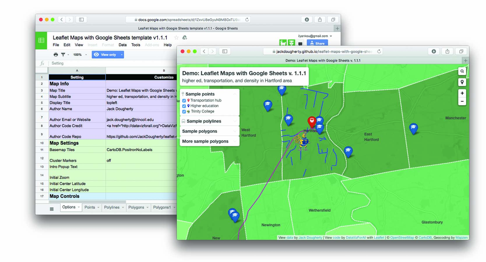
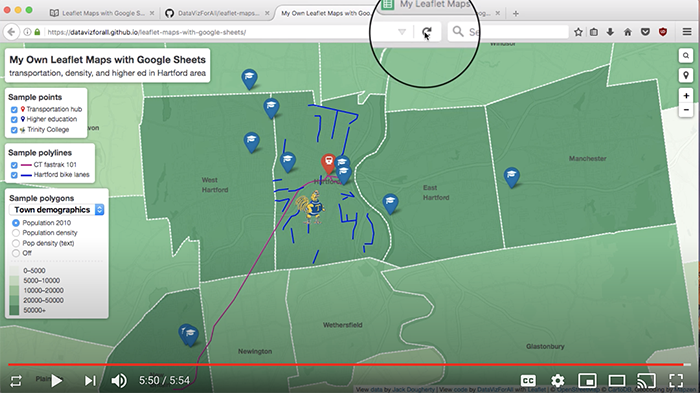

## Images {- #images}
View the underlying source code to understand how this page was composed at: https://github.com/HandsOnDataViz/book/blob/main/20.4-images.Rmd

Create high-resolution color screenshots and other static images in .png or .jpg format, with tight cropping on a high-resolution Retina monitor, typically at 144 ppi. Save items into the `images` subfolder by chapter. Make sure that color images include high contrast and/or shading, because they will be converted to grayscale by the publisher for the print book. Write file names in lowercase with dashes (not spaces) and begin with keyword of relevant section to keep related images grouped together. Despite being in separate folders, avoid duplicate image file names across the book. Avoid numbering images since they may not match the final sequence.

If a screenshot requires additional artwork or text for the HTML edition, make a copy of the original and add `-annotated` to note that this version is annotated, save into the same folder with the same root file name, and use in the code-chunk image pathnames. The publisher will use the original image and add their own artwork for their editions.

Typically, we need to convert PNG images into smaller PDF images to fit them in the PDF edition. To batch process this for a folder of images:

- create duplicates of all PNGs and drag to a separate folder
- select all of the duplicated PNG files and open with Mac Preview to view all
- select all image thumbnails in Preview, reduce image size for all by 50% (or more)
- select all image thumbnails in Preview again, and File > Export, with Option to change file format to PDF, but keep same file name as PNG
- move all reduced-size PDFs back to the original images folder

Overall, sometimes the folder will contain only one version of a simple image, but in other cases it may contain up to 3-4 versions of an image:

```
images/07-chart/design-setup.png
images/07-chart/design-setup-annotated.png
images/07-chart/design-setup-annotated.pdf
```

If creating images to appear as the same size in sequence, add a code-comment with the image width, height, and resolution as a reminder to make others match up, like this:

`<!-- Images below are 200x200 at 300 resolution -->`

In this book, use *Markdown formatting only for images that appear inside tables* or *do not require captions or figure numbering*, and leave the caption field blank, like this example:

<!-- Images below are 200x200 at 300 resolution do not follow style guide due to placement in a table -->

| Co-Authors      | About Us      |
| --------------- | ------------- |
|  | About [Jack Dougherty](http://jackdougherty.org) |
|  | About [Ilya Ilyankou](https://github.com/ilyankou) |   

Although Markdown formatting offers a simple syntax that easily converts into other formats with Bookdown/Pandoc, there is no auto-numbering in the HTML edition, while auto-numbering appears in the PDF edition, and numbered figures are required by the publisher. Furthermore, Markdown formatting does not allow conditional output.

### Images with R code-chunks for auto-numbering and conditional formatting {-}
For these reasons, this book *primarily uses R code-chunk formatting for images*. The syntax is more complex but supports auto-numbering in HTML and PDF. Also, the syntax supports conditional output for interactive images in HTML versus static images in PDF and full-length Markdown, which we accomplish using this *general* format:

```
if(knitr::is_html_output(excludes="markdown")) knitr::include_url("PATHNAME-TO-INTERACTIVE")
else knitr::include_graphics("PATHNAME-TO-STATIC")
```

We need to exclude `markdown` because it is considered an HTML format, as described here:
https://bookdown.org/yihui/rmarkdown-cookbook/latex-html.html

Auto-numbering appears in `Figure x.x` format in HTML and PDF, but `Figure x` format in MS Word and Markdown. Note that Word formatting can be changed with reference.docx.

Note that images in PDF output will "float" by design and may appear before or after the desired page, so always add a cross-reference call-out.

Write R code-chunk labels that follow the image file name, and avoid duplicate labels across the book:

```
ref:design-setup

images/07-chart/design-setup.png
```

Do not insert spaces inside the `ref:chunk-label` for the caption, but add a blank line to separate it from the code-chunk. After the code-chunk, add *another* blank line to avoid "undefined reference" Bookdown errors.

Inside the R code-chunk ref caption, do NOT use mischievous characters (such as `<` or `>` or `"`) that will throw HTML errors into the Markdown output images. Instead, use safe characters such as (`*` and `-`) to designate computer instructions, such as *File - Make a Copy*.

For each figure, manually add a cross-reference call-out and optionally, insert `fig.pos='h'` to place the image "here" on the page in the PDF output, to *attempt* to avoid PDF floating. Ignore the Bookdown LaTeX warning message "h float specifier changed to ht." See more at https://bookdown.org/yihui/bookdown/figures.html and https://bookdown.org/yihui/rmarkdown-cookbook/figure-placement.html

This Bookdown `index.Rmd` file includes two global R code-chunk settings immediately after the first header. One setting displays each code-chunk image without a code echo. The other setting automatically inserts the PDF version of an PNG/JPG image, whenever it exists, in the PDF output, which allows us to manually reduce the image sizes for the PDF book. Read more about these options in this Bookdown chapter: https://bookdown.org/yihui/bookdown/figures.html.

```
{r setup, include=FALSE}
knitr::opts_chunk$set(echo = FALSE)
options(knitr.graphics.auto_pdf = TRUE)
```

### Demo: R code-chunk for small static image for HTML, PDF, full-length Markdown editions {-}
Small is defined as each side less than 300px, as shown in Figure \@ref(fig:tiger).

(ref:tiger) Caption here. Markdown embedded links are acceptable, but no footnotes in captions due to error when generating PDF edition.

```{r tiger, fig.cap="(ref:tiger)"}
 knitr::include_graphics("images/20-bookdown/tiger.png")
```

### R code-chunk for larger static image using out.width and PDF img {-}
For larger images, where one side is greater than 300px, set the out.width to a pixel number for ideal display in the HTML edition. Also optional to reduce float in PDF: `fig.pos='h',`. If necessary, copy the image, use Photoshop to create a smaller image size, and save with same file name and a .pdf extension for auto-substitution in the PDF output ...as shown in Figure \@ref(fig:screenshot-tall).

(ref:screenshot-tall) Using out.width=200 and smaller PDF image size.

```{r screenshot-tall, out.width=200, fig.cap="(ref:screenshot-tall)"}
 knitr::include_graphics("images/20-bookdown/screenshot-tall.png")
```

R code-chunks allow more complex conditional formatting, where an interactive map or animated GIF or YouTube video clip appears in the HTML version, and a static image with an embedded link appears in the PDF, MS Word, and full-length Markdown outputs. To change the height of the default 400px iframe, add the new height to `include_url` as shown in the examples. However, to change the width of the default 675px iframe to less than 100 percent, add a line in a `custom-scripts.html` file.

### Demo: R code-chunk for iframe in HTML and static image in PDF and Markdown{-}
...as shown in Figure \@ref(fig:sample-map).

(ref:sample-map) Caption here, and add embedded link to explore the [full-screen interactive map](https://handsondataviz.github.io/leaflet-maps-with-google-sheets/).

```{r sample-map, fig.cap="(ref:sample-map)"}
if(knitr::is_html_output(excludes="markdown")) knitr::include_url("https://handsondataviz.github.io/leaflet-maps-with-google-sheets/", height = "600px") else 
```

### Demo: R code-chunk for animated GIF in HTML and static image in PDF and Markdown {-}
When appropriate, create animated GIF files using Camtasia, and add fade-to-black to mark the end-point in the looped version. Add ...as shown in Figure \@ref(fig:sheets-option-drag).

(ref:sheets-option-drag) Caption here, with embedded link to the [animated GIF](https://handsondataviz.org/images/20-bookdown/sheets-option-drag.gif).

```{r sheets-option-drag, fig.cap="(ref:sheets-option-drag)"}
if(knitr::is_html_output(excludes="markdown")) knitr::include_url("images/20-bookdown/sheets-option-drag.gif", height = "250px") else knitr::include_graphics("images/20-bookdown/sheets-option-drag.png")
```

### Demo: R code-chunk for Youtube video in HTML and static image in PDF and Markdown {-}
Be sure to use the *embed* link from the YouTube *share* button.

...as shown in the video \@ref(fig:video-sample).

(ref:video-sample) Caption here, with embedded link to the [YouTube video](https://youtu.be/-nGdrzMuUnI).

```{r video-sample, fig.cap="(ref:video-sample)"}
if(knitr::is_html_output(excludes="markdown")) knitr::include_url("https://www.youtube.com/embed/-nGdrzMuUnI") else 
```

### Demo: R code-chunk for YouTube video in HTML, with NO static image in PDF or Markdown {-}
This option may be relevant when you wish to display a video only in the html edition, with no screenshot of it in the PDF edition. Note that this will alter figure-numbering between the HTML and PDF editions.

(ref:video-sample2) Caption **only** for HTML version, with embedded link to the [YouTube video](https://youtu.be/w6dQ-RIQ5bc).

```{r video-sample2, fig.cap="(ref:video-sample2)"}
if(knitr::is_html_output(excludes="markdown")) knitr::include_url("https://www.youtube.com/embed/w6dQ-RIQ5bc")
```
