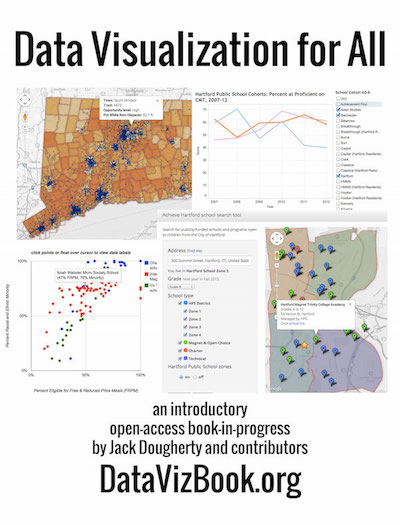

### Tell your story ***and*** show it with data.

By Jack Dougherty (Trinity College, CT) and contributors.

***Data Visualization for All*** explains how to create interactive charts, maps, and simple web apps, with easy-to-learn free tools and open data. This introductory textbook features step-by-step tutorials and videos, so that everyday people with minimal coding skills can create and embed data visualizations on their own websites. Learn more about tools such as Google Sheets, Google Fusion Tables, Tableau Public, GitHub Pages, and more. 

This open-access book is **freely available** on the web, with downloadable PDF/ePUB/Mobi formats, at http://DataVizBook.org.

#####Help improve this book-in-progress:
- To publicly comment on any paragraph inside this book, select the text and click the plus symbol (+) in the margin. 
- To suggest revisions for the book, click the "Edit in GitHub" button at the top of any page to view its development branch on the [GitHub repository for this book](https://github.com/jackdougherty/datavizbook/tree/dev/).
- Learn how to submit additional chapters for possible inclusion in [About This GitBook](gitbook/README.md) 

[Data Visualization for All](http://datavizbook.org)
by [Jack Dougherty](http://bit.ly/jackdougherty)
and contributors is licensed under a [Creative Commons Attribution-NonCommercial 4.0 International License](http://creativecommons.org/licenses/by-nc/4.0).
You may freely share and modify this content for non-commercial purposes, with a source credit to http://DataVizBook.org.

