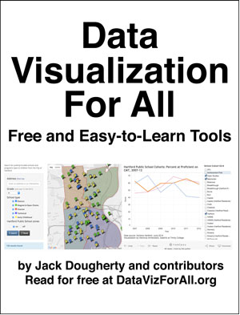

### Tell your story ***and*** show it with data.

***Data Visualization for All*** illustrates how to create interactive charts and maps with easy-to-learn free tools and open data sources. This introductory textbook includes step-by-step tutorials and vivid examples to design and embed data visualizations in your own website. No coding skills required. Featured tools include Tableau Public, Google Fusion Tables, and GitHub Pages in the browser. Read or download this open-access book-in-progress at http://DataVizForAll.org.

[About the authors:](introduction/who.md) Jack Dougherty (Trinity College, CT) with contributors Veronica X. Armendariz, Derek Eder, and others.

[Freely read online](https://www.gitbook.com/read/book/jackdougherty/datavizforall) (recommended) or download the [PDF](https://www.gitbook.com/download/pdf/book/jackdougherty/datavizforall) or [ePUB](https://www.gitbook.com/download/epub/book/jackdougherty/datavizforall) or [Mobi/Kindle](https://www.gitbook.com/download/mobi/book/jackdougherty/datavizforall) editions.

[Improve this book-in-progress](gitbook/improve.md) by adding comments.

  

[Suggest revisions or additions](gitbook/improve.md) with edits on GitHub.

  

[Learn how GitBook works](gitbook/README.md) and publish your own book.

***

[Data Visualization for All](http://datavizforall.org)
is copyrighted by [Jack Dougherty and contributors](introduction/who.md)
and distributed under a [Creative Commons Attribution-NonCommercial 4.0 International License](http://creativecommons.org/licenses/by-nc/4.0).
You may freely share and modify this content for non-commercial purposes, with a source credit to http://DataVizForAll.org.

