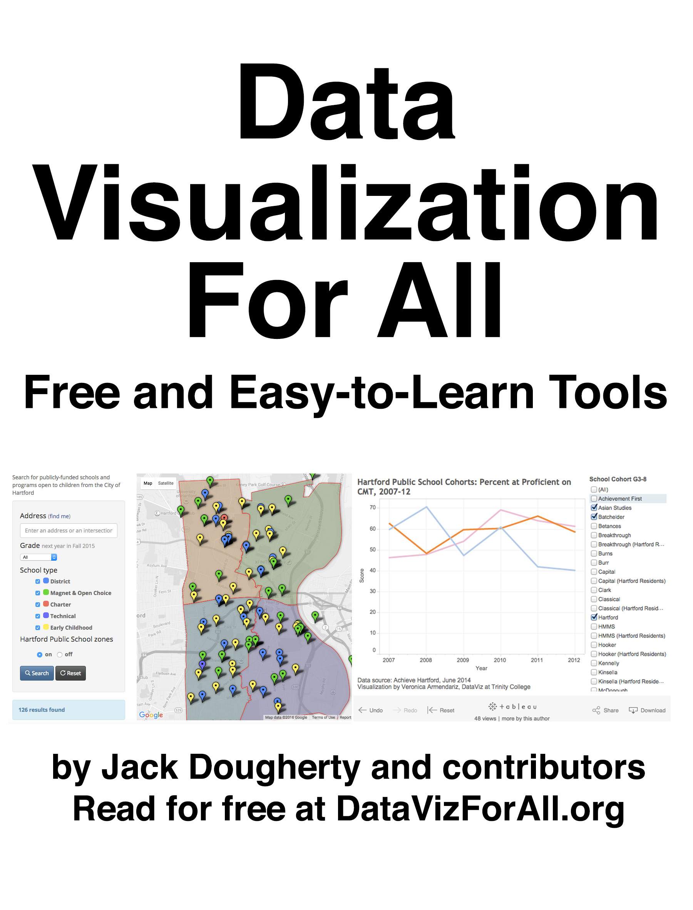

# Data Visualization for All

Visualize your data with free tools and user-friendly tutorials in this open-access introductory book. Create interactive charts, maps, and simple web apps to tell data-driven stories on the web. Features step-by-step instructions and video screencasts for Google Sheets, Google Fusion Tables, Tableau Public, GitHub Pages and more. Freely available at http://DataVizBook.org.

Contribute updates and add tutorials to this book-in-progress. Send a pull request to the book's [GitHub repository](https://github.com/jackdougherty/datavizbook)

[Data Visualization for All](http://datavizbook.org)
by [Jack Dougherty](http://bit.ly/jackdougherty)
and contributors is licensed under a [Creative Commons Attribution-NonCommercial 4.0 International License](http://creativecommons.org/licenses/by-nc/4.0).
You may freely share and modify this content for non-commercial purposes, with a source credit to http://DataVizBook.org.

